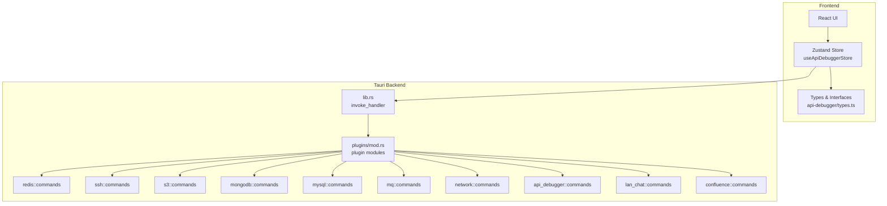
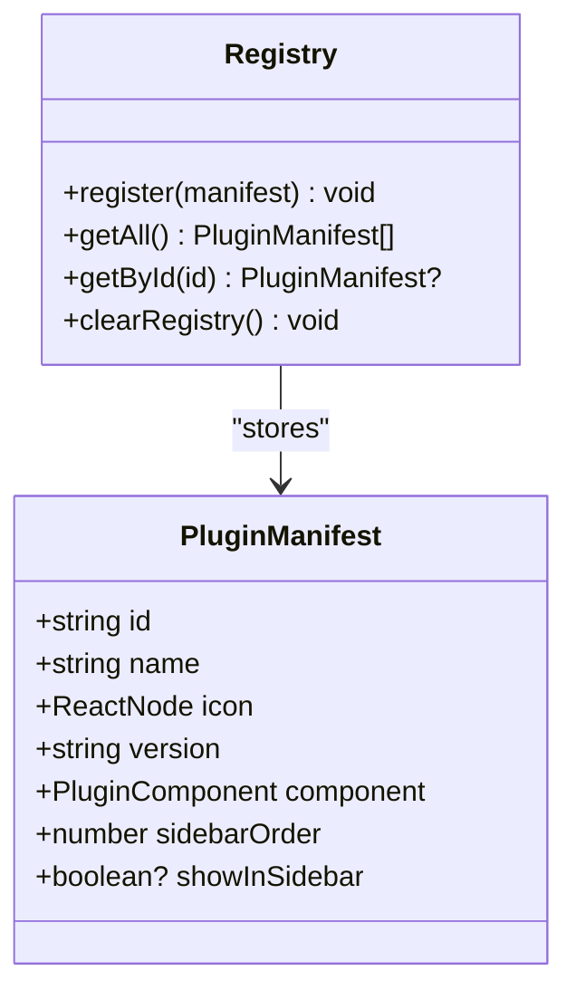
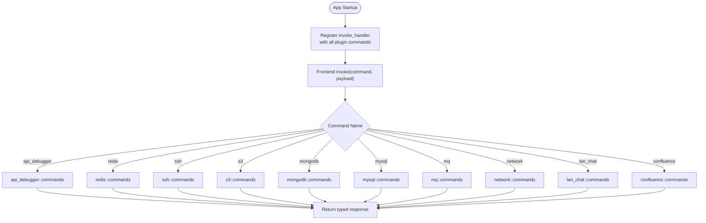
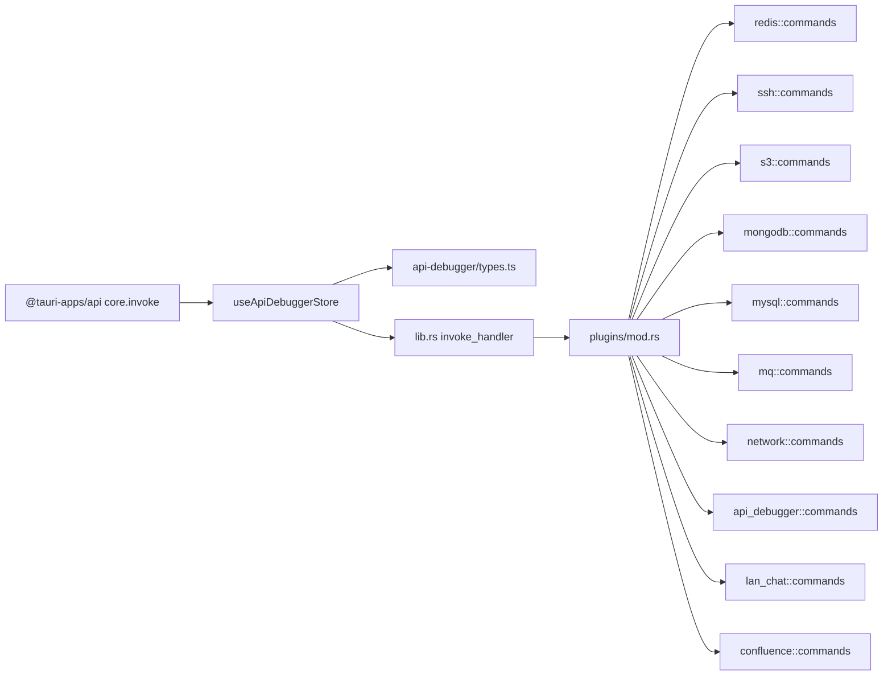

# API Reference

<cite>
**Referenced Files in This Document**
- [lib.rs](file://src-tauri/src/lib.rs)
- [main.rs](file://src-tauri/src/main.rs)
- [mod.rs](file://src-tauri/src/plugins/mod.rs)
- [registry.ts](file://src/app/plugin-registry/registry.ts)
- [types.ts](file://src/app/plugin-registry/types.ts)
- [builtin.ts](file://src/app/plugin-registry/builtin.ts)
- [index.tsx](file://src/plugins/api-debugger/index.tsx)
- [types.ts](file://src/plugins/api-debugger/types.ts)
- [api-debugger.ts](file://src/plugins/api-debugger/store/api-debugger.ts)
- [api-debugger.ts](file://src/plugins/api-debugger/utils/api-debugger.ts)
</cite>

## Table of Contents
1. [Introduction](#introduction)
2. [Project Structure](#project-structure)
3. [Core Components](#core-components)
4. [Architecture Overview](#architecture-overview)
5. [Detailed Component Analysis](#detailed-component-analysis)
6. [Dependency Analysis](#dependency-analysis)
7. [Performance Considerations](#performance-considerations)
8. [Troubleshooting Guide](#troubleshooting-guide)
9. [Conclusion](#conclusion)
10. [Appendices](#appendices)

## Introduction
This document provides a comprehensive API reference for the DevNexus Tauri plugin command system. It covers:
- Tauri command registration and invocation from the frontend
- Plugin-specific command interfaces and data models
- Frontend API interfaces and state management for the API Debugger plugin
- Inter-plugin communication patterns and backend command specifications
- Parameter validation, error handling, and response processing
- Authentication and rate-limiting considerations
- Integration examples and common usage patterns

## Project Structure
DevNexus is a Tauri-based desktop application with a plugin architecture. The backend registers Tauri commands in Rust, and the frontend invokes them via the @tauri-apps/api core invoke mechanism. Plugins are registered at startup and exposed through manifests.



**Diagram sources**
- [lib.rs:26-259](file://src-tauri/src/lib.rs#L26-L259)
- [mod.rs:1-11](file://src-tauri/src/plugins/mod.rs#L1-L11)

**Section sources**
- [lib.rs:10-262](file://src-tauri/src/lib.rs#L10-L262)
- [main.rs:4-7](file://src-tauri/src/main.rs#L4-L7)
- [mod.rs:1-11](file://src-tauri/src/plugins/mod.rs#L1-L11)

## Core Components
- Tauri command registration: All plugin commands are registered under a single invoke handler in the backend.
- Frontend invocation: The frontend uses @tauri-apps/api invoke to call backend commands with typed payloads and receive typed responses.
- Plugin manifest and registry: Plugins are registered via manifests and a central registry for sidebar navigation and routing.
- API Debugger plugin: Provides a complete frontend API for sending HTTP requests, managing collections, environments, and history.

Key backend command groups:
- Redis client commands
- SSH client commands
- S3 client commands
- MongoDB client commands
- MySQL client commands
- MQ client commands
- Network diagnostics commands
- API debugger commands
- LAN chat commands
- Confluence publishing commands
- Developer logging commands

**Section sources**
- [lib.rs:26-259](file://src-tauri/src/lib.rs#L26-L259)

## Architecture Overview
The Tauri command lifecycle:
1. Frontend triggers an action in the Zustand store.
2. The store invokes a Tauri command using @tauri-apps/api invoke with a payload.
3. The backend’s invoke_handler routes the command to the appropriate plugin module.
4. The plugin executes the operation and returns a typed response.
5. The store updates state with the response and optionally refreshes related data.

```mermaid
sequenceDiagram
participant UI as "UI Component"
participant Store as "useApiDebuggerStore"
participant Tauri as "invoke_handler"
participant Cmd as "api_debugger : : commands"
participant DB as "Persistence"
UI->>Store : "User clicks Send"
Store->>Store : "updateRequest()"
Store->>Tauri : "invoke('cmd_api_send_request', { request })"
Tauri->>Cmd : "cmd_api_send_request(request)"
Cmd->>DB : "optional persistence"
DB-->>Cmd : "result"
Cmd-->>Tauri : "ApiResponseData"
Tauri-->>Store : "ApiResponseData"
Store->>Store : "set(response); fetchHistory()"
Store-->>UI : "render response"
```

**Diagram sources**
- [api-debugger.ts:62-72](file://src/plugins/api-debugger/store/api-debugger.ts#L62-L72)
- [lib.rs:193-195](file://src-tauri/src/lib.rs#L193-L195)

**Section sources**
- [api-debugger.ts:62-72](file://src/plugins/api-debugger/store/api-debugger.ts#L62-L72)
- [lib.rs:26-259](file://src-tauri/src/lib.rs#L26-L259)

## Detailed Component Analysis

### Plugin Manifest and Registry
- PluginManifest defines the plugin identity, UI component, and sidebar metadata.
- The registry stores manifests and exposes helpers to retrieve and sort plugins.
- Built-in plugins are registered once at startup.



**Diagram sources**
- [types.ts:5-13](file://src/app/plugin-registry/types.ts#L5-L13)
- [registry.ts:3-25](file://src/app/plugin-registry/registry.ts#L3-L25)

**Section sources**
- [types.ts:5-13](file://src/app/plugin-registry/types.ts#L5-L13)
- [registry.ts:3-25](file://src/app/plugin-registry/registry.ts#L3-L25)
- [builtin.ts:14-29](file://src/app/plugin-registry/builtin.ts#L14-L29)

### API Debugger Plugin Frontend API
- State management: The store encapsulates current request, response, collections, environments, history, and UI tabs.
- Invocation pattern: All actions call invoke with a command name and payload, returning typed results.
- Data models: Strongly typed request, response, environment, collection, folder, and history items.

```mermaid
classDiagram
class ApiSendRequest {
+string? requestId
+string method
+string url
+ApiKeyValue[] params
+ApiKeyValue[] headers
+ApiKeyValue[] cookies
+ApiAuthConfig? auth
+ApiBodyConfig? body
+number? timeoutMs
+boolean? followRedirects
+boolean? validateSsl
+string? environmentId
+boolean? saveHistory
}
class ApiResolvedPreview {
+string url
+ApiKeyValue[] headers
+ApiKeyValue[] cookies
+string? bodyPreview
+string[] missingVariables
}
class ApiResponseData {
+number? status
+string? statusText
+number durationMs
+number sizeBytes
+ApiKeyValue[] headers
+ApiKeyValue[] cookies
+string body
+boolean bodyTruncated
+string? contentType
+string[] redirectChain
+string? error
+Timing timing
}
class ApiCollection { +string id +string name +string? description +string createdAt +string updatedAt }
class ApiFolder { +string id +string collectionId +string? parentId +string name +number sortOrder +string createdAt +string updatedAt }
class ApiEnvironment { +string id +string name +ApiKeyValue[] variables +string createdAt +string updatedAt }
class ApiSavedRequest { +string id +string? collectionId +string? folderId +string name +string method +string url +string paramsJson +string headersJson +string cookiesJson +string authJson +string bodyJson +number timeoutMs +boolean followRedirects +boolean validateSsl +string createdAt +string updatedAt }
class ApiHistoryItem { +string id +string method +string url +string host +string status +number? statusCode +number durationMs +string requestJson +string responseJson +string createdAt }
ApiSendRequest --> ApiAuthConfig
ApiSendRequest --> ApiBodyConfig
ApiSendRequest --> ApiKeyValue
ApiResolvedPreview --> ApiKeyValue
ApiResponseData --> ApiKeyValue
ApiSavedRequest --> ApiSendRequest
```



**Diagram sources**
- [types.ts:1-105](file://src/plugins/api-debugger/types.ts#L1-L105)

**Section sources**
- [index.tsx:13-38](file://src/plugins/api-debugger/index.tsx#L13-L38)
- [types.ts:1-105](file://src/plugins/api-debugger/types.ts#L1-L105)
- [api-debugger.ts:47-128](file://src/plugins/api-debugger/store/api-debugger.ts#L47-L128)
- [api-debugger.ts:14-29](file://src/plugins/api-debugger/utils/api-debugger.ts#L14-L29)

### Backend Command Registration and Invocation
- The backend registers all plugin commands in a single invoke handler.
- Frontend calls are typed and validated by the Tauri bridge.
- Commands are grouped by plugin domain (e.g., redis, ssh, s3, mongodb, mysql, mq, network, api_debugger, lan_chat, confluence).



**Diagram sources**
- [lib.rs:26-259](file://src-tauri/src/lib.rs#L26-L259)

**Section sources**
- [lib.rs:26-259](file://src-tauri/src/lib.rs#L26-L259)

### API Debugger Commands
- Preview request: Resolves variables and returns a resolved preview.
- Send request: Executes the HTTP request and returns response metadata and body.
- Cancel request: Cancels an in-flight request by ID.
- Collections: CRUD for request collections.
- Folders: CRUD for nested folders within collections.
- Requests: CRUD for saved requests with serialized bodies and headers.
- Environments: CRUD for environment variable sets.
- History: CRUD and filtering for request/response history.
- Import/export: cURL import and collection export.

Common invocation pattern:
- Payload typing: Use strongly typed interfaces from the API Debugger types.
- Response typing: Use typed return values from the store actions.
- Error handling: Catch exceptions around invoke calls and surface errors via response.error or UI state.

**Section sources**
- [api-debugger.ts:62-72](file://src/plugins/api-debugger/store/api-debugger.ts#L62-L72)
- [api-debugger.ts:73-76](file://src/plugins/api-debugger/store/api-debugger.ts#L73-L76)
- [api-debugger.ts:77-81](file://src/plugins/api-debugger/store/api-debugger.ts#L77-L81)
- [api-debugger.ts:82-87](file://src/plugins/api-debugger/store/api-debugger.ts#L82-L87)
- [api-debugger.ts:88-89](file://src/plugins/api-debugger/store/api-debugger.ts#L88-L89)
- [api-debugger.ts:90-98](file://src/plugins/api-debugger/store/api-debugger.ts#L90-L98)
- [api-debugger.ts:99-99](file://src/plugins/api-debugger/store/api-debugger.ts#L99-L99)
- [api-debugger.ts:100-100](file://src/plugins/api-debugger/store/api-debugger.ts#L100-L100)
- [api-debugger.ts:101-109](file://src/plugins/api-debugger/store/api-debugger.ts#L101-L109)
- [api-debugger.ts:110-117](file://src/plugins/api-debugger/store/api-debugger.ts#L110-L117)
- [api-debugger.ts:118-119](file://src/plugins/api-debugger/store/api-debugger.ts#L118-L119)
- [api-debugger.ts:120-120](file://src/plugins/api-debugger/store/api-debugger.ts#L120-L120)
- [api-debugger.ts:121-122](file://src/plugins/api-debugger/store/api-debugger.ts#L121-L122)
- [api-debugger.ts:123-123](file://src/plugins/api-debugger/store/api-debugger.ts#L123-L123)
- [api-debugger.ts:124-125](file://src/plugins/api-debugger/store/api-debugger.ts#L124-L125)
- [api-debugger.ts:126-127](file://src/plugins/api-debugger/store/api-debugger.ts#L126-L127)

## Dependency Analysis
- Frontend depends on @tauri-apps/api for invoke and on Zustand for state.
- The store depends on typed interfaces from the API Debugger types.
- Backend depends on plugin modules declared in plugins/mod.rs.
- The main entry point initializes the backend and runs the app.



**Diagram sources**
- [api-debugger.ts:1](file://src/plugins/api-debugger/store/api-debugger.ts#L1)
- [api-debugger.ts:4](file://src/plugins/api-debugger/store/api-debugger.ts#L4)
- [lib.rs:26-259](file://src-tauri/src/lib.rs#L26-L259)
- [mod.rs:1-11](file://src-tauri/src/plugins/mod.rs#L1-L11)

**Section sources**
- [api-debugger.ts:1-45](file://src/plugins/api-debugger/store/api-debugger.ts#L1-L45)
- [lib.rs:26-259](file://src-tauri/src/lib.rs#L26-L259)
- [mod.rs:1-11](file://src-tauri/src/plugins/mod.rs#L1-L11)

## Performance Considerations
- Batch frontend requests: Use Promise.all for fetching multiple resources (e.g., collections, folders, requests, environments) to reduce latency.
- Debounce previews: Throttle preview requests when users edit URLs or headers rapidly.
- Pagination and filters: Apply filters and limits for history and large datasets to avoid rendering performance issues.
- Body handling: Avoid parsing very large bodies; rely on truncated previews and streaming where applicable.
- Cancellation: Support request cancellation to free resources promptly.

## Troubleshooting Guide
- Command not found: Verify the command name matches the backend registration and that the plugin module is included in plugins/mod.rs.
- Type mismatch: Ensure frontend payloads match the TypeScript interfaces; Tauri will enforce type safety at the bridge level.
- Empty or stale data: Use fetchAll or targeted fetch methods after mutations to refresh state.
- SSL validation: Toggle validateSsl when dealing with self-signed certificates during development.
- Environment variables: Confirm environmentId is set and variables are properly serialized/deserialized.
- Rate limiting: Implement client-side throttling for frequent operations; backend commands should handle concurrency per plugin domain.

**Section sources**
- [api-debugger.ts:90-98](file://src/plugins/api-debugger/store/api-debugger.ts#L90-L98)
- [api-debugger.ts:126-127](file://src/plugins/api-debugger/store/api-debugger.ts#L126-L127)

## Conclusion
DevNexus provides a robust Tauri command framework with strong typing and a modular plugin architecture. The API Debugger plugin demonstrates best practices for frontend invocation, typed payloads, and state-driven workflows. By following the patterns outlined here, developers can integrate new plugins and extend existing ones with predictable command interfaces and reliable error handling.

## Appendices

### Command Naming and Grouping
- Prefixes indicate plugin domains (e.g., cmd_api_*, cmd_redis_*, cmd_ssh_*).
- Group commands by feature area (collections, requests, environments, history).

### Frontend Invocation Examples
- Preview request: invoke("cmd_api_preview_request", { request })
- Send request: invoke("cmd_api_send_request", { request })
- Save collection: invoke("cmd_api_save_collection", { id, name, description })
- Delete environment: invoke("cmd_api_delete_environment", { id })
- Export collection: invoke("cmd_api_export_collection_json", { collectionId, redact })

### Data Model Validation Notes
- Required fields: method, url, and auth/body configurations depend on authType/bodyType.
- Optional fields: environmentId, timeoutMs, followRedirects, validateSsl.
- Arrays: params, headers, cookies, variables should be normalized with enabled flags.