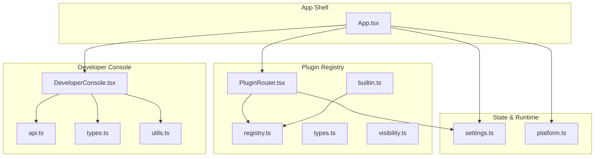
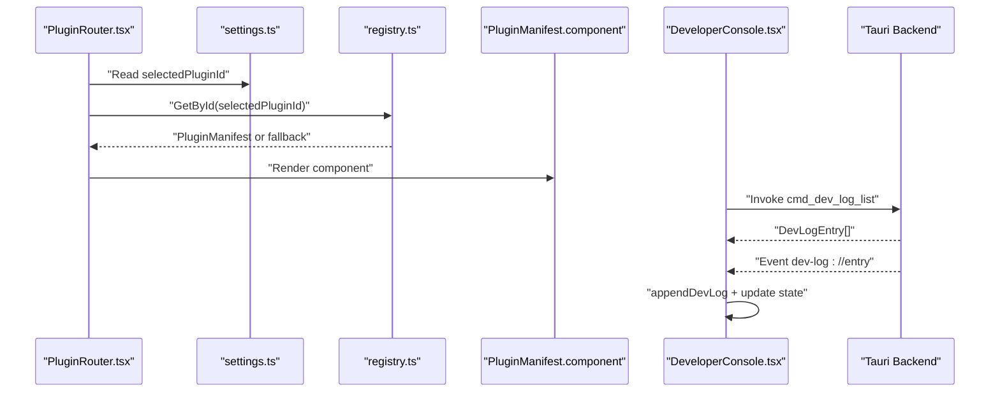
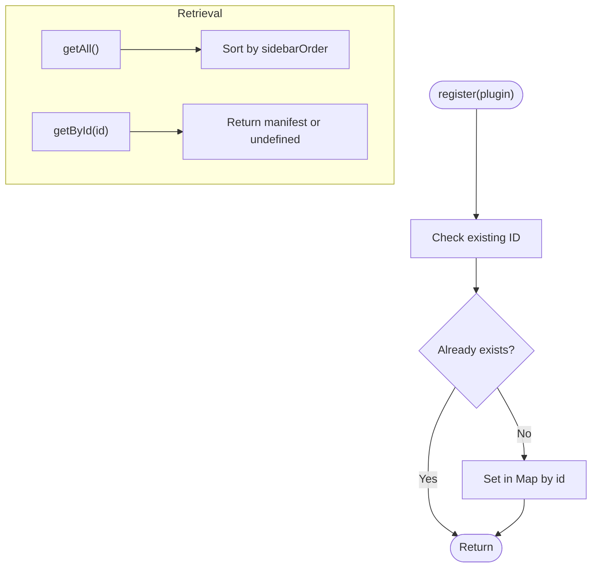
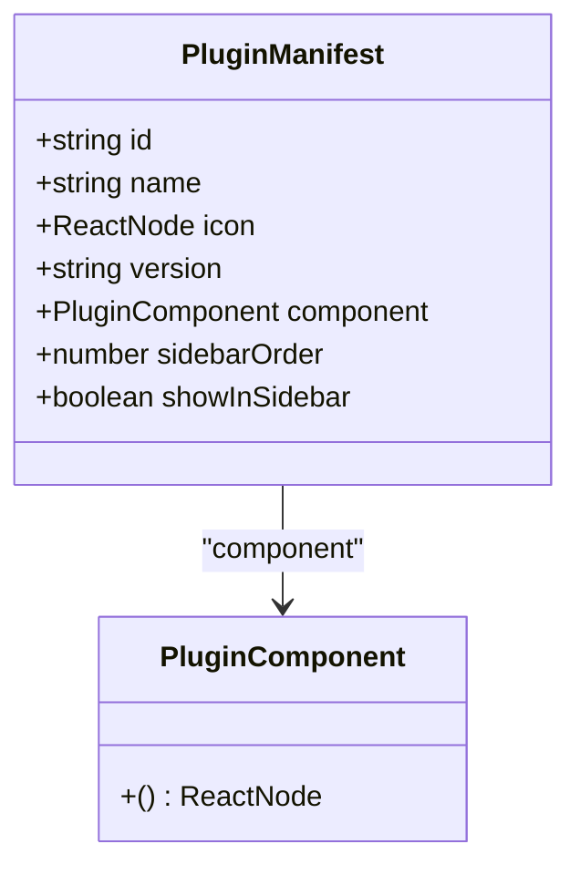
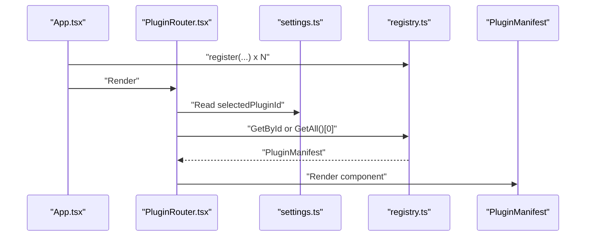
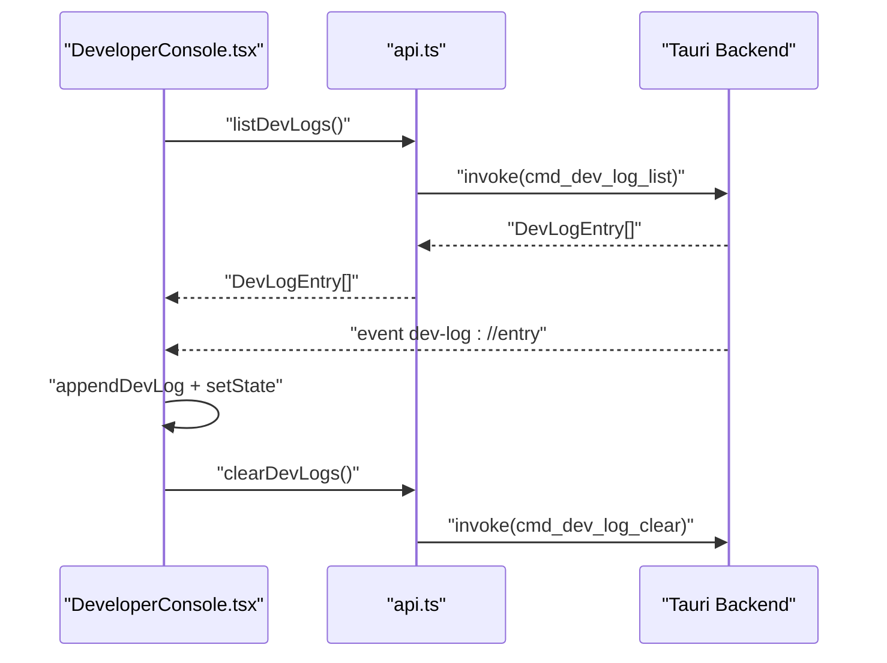
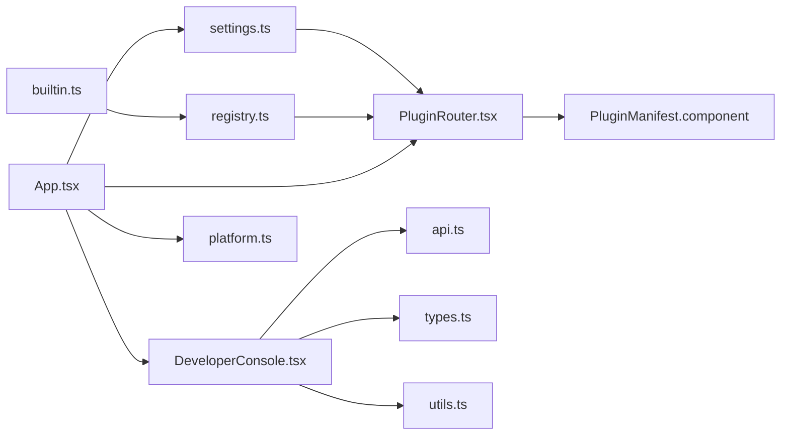

# Frontend Interfaces

<cite>
**Referenced Files in This Document**
- [registry.ts](file://src/app/plugin-registry/registry.ts)
- [types.ts](file://src/app/plugin-registry/types.ts)
- [visibility.ts](file://src/app/plugin-registry/visibility.ts)
- [PluginRouter.tsx](file://src/app/plugin-registry/PluginRouter.tsx)
- [builtin.ts](file://src/app/plugin-registry/builtin.ts)
- [api.ts](file://src/app/developer-console/api.ts)
- [types.ts](file://src/app/developer-console/types.ts)
- [utils.ts](file://src/app/developer-console/utils.ts)
- [DeveloperConsole.tsx](file://src/app/developer-console/DeveloperConsole.tsx)
- [settings.ts](file://src/app/store/settings.ts)
- [platform.ts](file://src/app/runtime/platform.ts)
- [App.tsx](file://src/App.tsx)
- [index.tsx](file://src/plugins/api-debugger/index.tsx)
- [index.tsx](file://src/plugins/confluence/index.tsx)
- [index.tsx](file://src/plugins/mongodb-client/index.tsx)
</cite>

## Table of Contents
1. [Introduction](#introduction)
2. [Project Structure](#project-structure)
3. [Core Components](#core-components)
4. [Architecture Overview](#architecture-overview)
5. [Detailed Component Analysis](#detailed-component-analysis)
6. [Dependency Analysis](#dependency-analysis)
7. [Performance Considerations](#performance-considerations)
8. [Troubleshooting Guide](#troubleshooting-guide)
9. [Conclusion](#conclusion)
10. [Appendices](#appendices)

## Introduction
This document describes the frontend interfaces and API surfaces used by DevNexus applications, focusing on:
- Plugin registry interface and visibility management
- Developer console APIs and event-driven logging
- Frontend-to-backend communication patterns via Tauri
- State management interfaces using Zustand
- Component interaction protocols and plugin loading mechanisms
- Guidance for extending frontend interfaces, integrating new plugins, and maintaining backward compatibility

## Project Structure
The frontend is organized around three primary areas:
- Plugin Registry: registration, retrieval, and visibility filtering of plugins
- Developer Console: reactive log viewer with backend integration
- Application Shell and Stores: global state and platform detection

**Diagram sources**
- [registry.ts:1-26](file://src/app/plugin-registry/registry.ts#L1-L26)
- [types.ts:1-14](file://src/app/plugin-registry/types.ts#L1-L14)
- [visibility.ts:1-6](file://src/app/plugin-registry/visibility.ts#L1-L6)
- [PluginRouter.tsx:1-29](file://src/app/plugin-registry/PluginRouter.tsx#L1-L29)
- [builtin.ts:1-31](file://src/app/plugin-registry/builtin.ts#L1-L31)
- [DeveloperConsole.tsx:1-132](file://src/app/developer-console/DeveloperConsole.tsx#L1-L132)
- [api.ts:1-12](file://src/app/developer-console/api.ts#L1-L12)
- [types.ts:1-9](file://src/app/developer-console/types.ts#L1-L9)
- [utils.ts:1-13](file://src/app/developer-console/utils.ts#L1-L13)
- [settings.ts:1-28](file://src/app/store/settings.ts#L1-L28)
- [platform.ts:1-10](file://src/app/runtime/platform.ts#L1-L10)
- [App.tsx:1-11](file://src/App.tsx#L1-L11)

**Section sources**
- [App.tsx:1-11](file://src/App.tsx#L1-L11)
- [settings.ts:1-28](file://src/app/store/settings.ts#L1-L28)
- [platform.ts:1-10](file://src/app/runtime/platform.ts#L1-L10)

## Core Components
- Plugin Registry: Provides a simple in-memory registry keyed by plugin ID, exposing registration, retrieval, sorting, and clearing operations.
- Plugin Manifest Types: Defines the shape of plugin metadata and component contract.
- Visibility Management: Filters plugins for sidebar rendering based on explicit visibility flags.
- Plugin Router: Selects and renders the active plugin component based on persisted settings.
- Built-in Plugin Registration: Registers all core plugins once during initialization.
- Developer Console: Reactive drawer that lists, streams, copies, and clears backend-generated developer logs.
- Frontend-to-Backend Communication: Uses Tauri’s invoke/listen for command invocation and event streaming.
- State Management: Zustand stores manage UI state and persisted preferences.
- Platform Detection: Utility to detect macOS for UI/UX adaptations.

**Section sources**
- [registry.ts:1-26](file://src/app/plugin-registry/registry.ts#L1-L26)
- [types.ts:1-14](file://src/app/plugin-registry/types.ts#L1-L14)
- [visibility.ts:1-6](file://src/app/plugin-registry/visibility.ts#L1-L6)
- [PluginRouter.tsx:1-29](file://src/app/plugin-registry/PluginRouter.tsx#L1-L29)
- [builtin.ts:1-31](file://src/app/plugin-registry/builtin.ts#L1-L31)
- [DeveloperConsole.tsx:1-132](file://src/app/developer-console/DeveloperConsole.tsx#L1-L132)
- [api.ts:1-12](file://src/app/developer-console/api.ts#L1-L12)
- [settings.ts:1-28](file://src/app/store/settings.ts#L1-L28)
- [platform.ts:1-10](file://src/app/runtime/platform.ts#L1-L10)

## Architecture Overview
The frontend composes a shell with a sidebar-driven plugin area and a developer console drawer. Plugins are registered statically and rendered dynamically based on user selection. Developer logs are streamed from the backend and displayed reactively.

**Diagram sources**
- [PluginRouter.tsx:1-29](file://src/app/plugin-registry/PluginRouter.tsx#L1-L29)
- [settings.ts:1-28](file://src/app/store/settings.ts#L1-L28)
- [registry.ts:1-26](file://src/app/plugin-registry/registry.ts#L1-L26)
- [DeveloperConsole.tsx:1-132](file://src/app/developer-console/DeveloperConsole.tsx#L1-L132)
- [api.ts:1-12](file://src/app/developer-console/api.ts#L1-L12)

## Detailed Component Analysis

### Plugin Registry Interface
The registry exposes:
- register(plugin): Adds a plugin manifest if not already present
- getAll(): Returns sorted manifests by sidebar order
- getById(id): Retrieves a specific plugin
- clearRegistry(): Clears the registry

**Diagram sources**
- [registry.ts:1-26](file://src/app/plugin-registry/registry.ts#L1-L26)

**Section sources**
- [registry.ts:1-26](file://src/app/plugin-registry/registry.ts#L1-L26)
- [types.ts:1-14](file://src/app/plugin-registry/types.ts#L1-L14)

### Plugin Manifest and Visibility
- PluginComponent: A zero-argument function returning a ReactNode
- PluginManifest: Defines id, name, icon, version, component, sidebarOrder, and optional sidebar visibility flag
- Visibility filter: getSidebarPlugins filters out plugins explicitly hidden

**Diagram sources**
- [types.ts:1-14](file://src/app/plugin-registry/types.ts#L1-L14)

**Section sources**
- [types.ts:1-14](file://src/app/plugin-registry/types.ts#L1-L14)
- [visibility.ts:1-6](file://src/app/plugin-registry/visibility.ts#L1-L6)

### Plugin Loading and Activation
- Built-in registration: registerBuiltinPlugins registers core plugins once
- Router selection: PluginRouter reads selectedPluginId from settings and renders the active plugin component
- Fallback behavior: If no plugin is found, a warning alert is shown

**Diagram sources**
- [builtin.ts:1-31](file://src/app/plugin-registry/builtin.ts#L1-L31)
- [PluginRouter.tsx:1-29](file://src/app/plugin-registry/PluginRouter.tsx#L1-L29)
- [settings.ts:1-28](file://src/app/store/settings.ts#L1-L28)
- [registry.ts:1-26](file://src/app/plugin-registry/registry.ts#L1-L26)

**Section sources**
- [builtin.ts:1-31](file://src/app/plugin-registry/builtin.ts#L1-L31)
- [PluginRouter.tsx:1-29](file://src/app/plugin-registry/PluginRouter.tsx#L1-L29)
- [settings.ts:1-28](file://src/app/store/settings.ts#L1-L28)

### Developer Console APIs and Event Streaming
- API surface:
  - listDevLogs(): Fetches current logs from backend
  - clearDevLogs(): Clears backend logs
- UI behavior:
  - Drawer opens via keyboard shortcut
  - Subscribes to dev-log://entry events and appends entries
  - Supports copying logs as JSON and clearing
- Data model:
  - DevLogEntry: id, timestamp, level, scope, message, details

**Diagram sources**
- [DeveloperConsole.tsx:1-132](file://src/app/developer-console/DeveloperConsole.tsx#L1-L132)
- [api.ts:1-12](file://src/app/developer-console/api.ts#L1-L12)
- [types.ts:1-9](file://src/app/developer-console/types.ts#L1-L9)
- [utils.ts:1-13](file://src/app/developer-console/utils.ts#L1-L13)

**Section sources**
- [DeveloperConsole.tsx:1-132](file://src/app/developer-console/DeveloperConsole.tsx#L1-L132)
- [api.ts:1-12](file://src/app/developer-console/api.ts#L1-L12)
- [types.ts:1-9](file://src/app/developer-console/types.ts#L1-L9)
- [utils.ts:1-13](file://src/app/developer-console/utils.ts#L1-L13)

### Frontend-to-Backend Communication Patterns
- Command invocation: Tauri invoke("command_name") returns promises
- Event listening: Tauri listen("event://name") returns unlisten function
- Developer console uses both patterns to list and stream logs

**Section sources**
- [api.ts:1-12](file://src/app/developer-console/api.ts#L1-L12)
- [DeveloperConsole.tsx:1-132](file://src/app/developer-console/DeveloperConsole.tsx#L1-L132)

### State Management Interfaces
- settings store:
  - Persisted state: sidebarCollapsed, dbToolsCollapsed, selectedPluginId
  - Actions: setters for each field
- Used by PluginRouter to select active plugin

**Section sources**
- [settings.ts:1-28](file://src/app/store/settings.ts#L1-L28)
- [PluginRouter.tsx:1-29](file://src/app/plugin-registry/PluginRouter.tsx#L1-L29)

### Component Interaction Protocols
- PluginRouter depends on settings store and registry to resolve and render the active plugin
- DeveloperConsole manages lifecycle events and integrates with clipboard and messages

**Section sources**
- [PluginRouter.tsx:1-29](file://src/app/plugin-registry/PluginRouter.tsx#L1-L29)
- [DeveloperConsole.tsx:1-132](file://src/app/developer-console/DeveloperConsole.tsx#L1-L132)

### Platform Detection
- isMacOsRuntime(): Detects macOS via navigator.platform and userAgent

**Section sources**
- [platform.ts:1-10](file://src/app/runtime/platform.ts#L1-L10)

### Example: Using Developer Console APIs in a React Component
- Fetch logs on open: see [DeveloperConsole.tsx:15-22](file://src/app/developer-console/DeveloperConsole.tsx#L15-L22)
- Subscribe to live events: see [DeveloperConsole.tsx:35-45](file://src/app/developer-console/DeveloperConsole.tsx#L35-L45)
- Clear logs: see [DeveloperConsole.tsx:60-63](file://src/app/developer-console/DeveloperConsole.tsx#L60-L63)
- API definitions: see [api.ts:5-11](file://src/app/developer-console/api.ts#L5-L11)

### Example: Defining a Plugin Manifest
- See manifest shape: [types.ts:5-13](file://src/app/plugin-registry/types.ts#L5-L13)
- Example manifests:
  - API Debugger: [index.tsx:38](file://src/plugins/api-debugger/index.tsx#L38)
  - Confluence: [index.tsx:10-17](file://src/plugins/confluence/index.tsx#L10-L17)
  - MongoDB Client: [index.tsx:79-86](file://src/plugins/mongodb-client/index.tsx#L79-L86)

### Example: Rendering a Plugin Component
- Router resolution and render: [PluginRouter.tsx:10-27](file://src/app/plugin-registry/PluginRouter.tsx#L10-L27)
- Settings store usage: [PluginRouter.tsx:8](file://src/app/plugin-registry/PluginRouter.tsx#L8) and [settings.ts:20-21](file://src/app/store/settings.ts#L20-L21)

### Example: Filtering Plugins for Sidebar
- Visibility filter: [visibility.ts:3-5](file://src/app/plugin-registry/visibility.ts#L3-L5)

### Example: Platform-Specific UI Adaptation
- macOS detection: [platform.ts:1-9](file://src/app/runtime/platform.ts#L1-L9)

## Dependency Analysis
- PluginRouter depends on:
  - settings store for selected plugin ID
  - registry for manifests
- Built-in plugins depend on registry for registration
- DeveloperConsole depends on:
  - api module for commands
  - types for DevLogEntry
  - utils for log manipulation
- App shell composes PluginRouter and DeveloperConsole

**Diagram sources**
- [PluginRouter.tsx:1-29](file://src/app/plugin-registry/PluginRouter.tsx#L1-L29)
- [settings.ts:1-28](file://src/app/store/settings.ts#L1-L28)
- [registry.ts:1-26](file://src/app/plugin-registry/registry.ts#L1-L26)
- [builtin.ts:1-31](file://src/app/plugin-registry/builtin.ts#L1-L31)
- [DeveloperConsole.tsx:1-132](file://src/app/developer-console/DeveloperConsole.tsx#L1-L132)
- [api.ts:1-12](file://src/app/developer-console/api.ts#L1-L12)
- [types.ts:1-9](file://src/app/developer-console/types.ts#L1-L9)
- [utils.ts:1-13](file://src/app/developer-console/utils.ts#L1-L13)
- [App.tsx:1-11](file://src/App.tsx#L1-L11)
- [platform.ts:1-10](file://src/app/runtime/platform.ts#L1-L10)

**Section sources**
- [PluginRouter.tsx:1-29](file://src/app/plugin-registry/PluginRouter.tsx#L1-L29)
- [settings.ts:1-28](file://src/app/store/settings.ts#L1-L28)
- [registry.ts:1-26](file://src/app/plugin-registry/registry.ts#L1-L26)
- [builtin.ts:1-31](file://src/app/plugin-registry/builtin.ts#L1-L31)
- [DeveloperConsole.tsx:1-132](file://src/app/developer-console/DeveloperConsole.tsx#L1-L132)
- [api.ts:1-12](file://src/app/developer-console/api.ts#L1-L12)
- [types.ts:1-9](file://src/app/developer-console/types.ts#L1-L9)
- [utils.ts:1-13](file://src/app/developer-console/utils.ts#L1-L13)
- [App.tsx:1-11](file://src/App.tsx#L1-L11)
- [platform.ts:1-10](file://src/app/runtime/platform.ts#L1-L10)

## Performance Considerations
- Registry operations are O(n log n) due to sorting in getAll; acceptable given small plugin counts
- Developer console maintains bounded log history via slicing; consider memory impact for very high-frequency events
- Event listeners are properly unregistered to prevent leaks
- Avoid unnecessary re-renders by using memoization and stable callbacks where appropriate

## Troubleshooting Guide
- No plugin registered:
  - Symptom: Warning alert in PluginRouter
  - Cause: Registry empty or selectedPluginId invalid
  - Fix: Register built-ins or another plugin; ensure settings persistence is enabled
  - Reference: [PluginRouter.tsx:15-24](file://src/app/plugin-registry/PluginRouter.tsx#L15-L24), [builtin.ts:14-29](file://src/app/plugin-registry/builtin.ts#L14-L29)
- Developer logs drawer not updating:
  - Symptom: Logs not appearing or not refreshing
  - Cause: Missing event listener or failed invoke
  - Fix: Verify event subscription and command invocation; check backend event emission
  - Reference: [DeveloperConsole.tsx:35-45](file://src/app/developer-console/DeveloperConsole.tsx#L35-L45), [api.ts:5-11](file://src/app/developer-console/api.ts#L5-L11)
- Clipboard copy fails:
  - Symptom: Copy action does nothing
  - Cause: Browser permissions or unsupported environment
  - Fix: Ensure secure context and permissions; handle errors gracefully
  - Reference: [DeveloperConsole.tsx:55-58](file://src/app/developer-console/DeveloperConsole.tsx#L55-L58)
- macOS-specific UI issues:
  - Symptom: Unexpected shortcuts or layout
  - Cause: Platform detection logic
  - Fix: Use isMacOsRuntime for conditional behavior
  - Reference: [platform.ts:1-9](file://src/app/runtime/platform.ts#L1-L9)

**Section sources**
- [PluginRouter.tsx:15-24](file://src/app/plugin-registry/PluginRouter.tsx#L15-L24)
- [builtin.ts:14-29](file://src/app/plugin-registry/builtin.ts#L14-L29)
- [DeveloperConsole.tsx:35-45](file://src/app/developer-console/DeveloperConsole.tsx#L35-L45)
- [api.ts:5-11](file://src/app/developer-console/api.ts#L5-L11)
- [DeveloperConsole.tsx:55-58](file://src/app/developer-console/DeveloperConsole.tsx#L55-L58)
- [platform.ts:1-9](file://src/app/runtime/platform.ts#L1-L9)

## Conclusion
DevNexus frontend interfaces provide a clean, extensible foundation for plugin-driven functionality and diagnostic logging. The registry and router pattern enable straightforward plugin integration, while the developer console offers robust, event-driven diagnostics backed by Tauri. Zustand stores centralize state with persistence, and platform utilities support cross-environment UX.

## Appendices

### Extending Frontend Interfaces
- Add a new plugin:
  - Define a PluginManifest and export it
  - Register it in registerBuiltinPlugins or elsewhere
  - Reference: [types.ts:5-13](file://src/app/plugin-registry/types.ts#L5-L13), [builtin.ts:14-29](file://src/app/plugin-registry/builtin.ts#L14-L29)
- Integrate a developer console command:
  - Add invoke wrappers in api.ts
  - Extend DevLogEntry in types.ts if needed
  - Reference: [api.ts:1-12](file://src/app/developer-console/api.ts#L1-L12), [types.ts:1-9](file://src/app/developer-console/types.ts#L1-L9)
- Maintain backward compatibility:
  - Keep PluginManifest fields optional where safe
  - Avoid breaking changes to DevLogEntry shape
  - Preserve event channel names and command identifiers
  - Reference: [types.ts:12](file://src/app/plugin-registry/types.ts#L12), [types.ts:4](file://src/app/developer-console/types.ts#L4)