# Plugin APIs

<cite>
**Referenced Files in This Document**
- [types.ts](file://src/plugins/api-debugger/types.ts)
- [index.tsx](file://src/plugins/api-debugger/index.tsx)
- [store/api-debugger.ts](file://src/plugins/api-debugger/store/api-debugger.ts)
- [types.ts](file://src/plugins/mongodb-client/types.ts)
- [index.tsx](file://src/plugins/mongodb-client/index.tsx)
- [store/mongodb-connections.ts](file://src/plugins/mongodb-client/store/mongodb-connections.ts)
- [types.ts](file://src/plugins/mysql-client/types.ts)
- [index.tsx](file://src/plugins/mysql-client/index.tsx)
- [store/mysql-connections.ts](file://src/plugins/mysql-client/store/mysql-connections.ts)
- [types.ts](file://src/plugins/redis-manager/types.ts)
- [index.tsx](file://src/plugins/redis-manager/index.tsx)
- [store/connections.ts](file://src/plugins/redis-manager/store/connections.ts)
- [store/console.ts](file://src/plugins/redis-manager/store/console.ts)
- [store/key-browser.ts](file://src/plugins/redis-manager/store/key-browser.ts)
- [store/server-info.ts](file://src/plugins/redis-manager/store/server-info.ts)
- [store/workspace.ts](file://src/plugins/redis-manager/store/workspace.ts)
- [types.ts](file://src/plugins/s3-client/types.ts)
- [index.tsx](file://src/plugins/s3-client/index.tsx)
- [store/s3-connections.ts](file://src/plugins/s3-client/store/s3-connections.ts)
- [types.ts](file://src/plugins/ssh-client/types.ts)
- [index.tsx](file://src/plugins/ssh-client/index.tsx)
- [store/keys.ts](file://src/plugins/ssh-client/store/keys.ts)
- [store/sessions.ts](file://src/plugins/ssh-client/store/sessions.ts)
- [store/ssh-connections.ts](file://src/plugins/ssh-client/store/ssh-connections.ts)
- [store/tunnels.ts](file://src/plugins/ssh-client/store/tunnels.ts)
- [store/workspace.ts](file://src/plugins/ssh-client/store/workspace.ts)
- [types.ts](file://src/plugins/network-tools/types.ts)
- [index.tsx](file://src/plugins/network-tools/index.tsx)
- [store/network-tools.ts](file://src/plugins/network-tools/store/network-tools.ts)
- [types.ts](file://src/plugins/confluence/types.ts)
- [index.tsx](file://src/plugins/confluence/index.tsx)
- [store/confluence.ts](file://src/plugins/confluence/store/confluence.ts)
- [types.ts](file://src/plugins/mq-client/types.ts)
- [index.tsx](file://src/plugins/mq-client/index.tsx)
- [store/mq-client.ts](file://src/plugins/mq-client/store/mq-client.ts)
- [types.ts](file://src/plugins/lan-chat/types.ts)
- [index.tsx](file://src/plugins/lan-chat/index.tsx)
- [store/lan-chat.ts](file://src/plugins/lan-chat/store/lan-chat.ts)
- [mod.rs](file://src-tauri/src/plugins/mod.rs)
- [commands.rs](file://src-tauri/src/plugins/api_debugger/commands.rs)
- [types.rs](file://src-tauri/src/plugins/api_debugger/types.rs)
- [commands.rs](file://src-tauri/src/plugins/mongodb/commands.rs)
- [types.rs](file://src-tauri/src/plugins/mongodb/types.rs)
- [client_pool.rs](file://src-tauri/src/plugins/mongodb/client_pool.rs)
- [commands.rs](file://src-tauri/src/plugins/mysql/commands.rs)
- [types.rs](file://src-tauri/src/plugins/mysql/types.rs)
- [client_pool.rs](file://src-tauri/src/plugins/mysql/client_pool.rs)
- [commands.rs](file://src-tauri/src/plugins/redis/commands.rs)
- [types.rs](file://src-tauri/src/plugins/redis/types.rs)
- [pool.rs](file://src-tauri/src/plugins/redis/pool.rs)
- [commands.rs](file://src-tauri/src/plugins/s3/commands.rs)
- [types.rs](file://src-tauri/src/plugins/s3/types.rs)
- [client_pool.rs](file://src-tauri/src/plugins/s3/client_pool.rs)
- [commands.rs](file://src-tauri/src/plugins/ssh/commands.rs)
- [types.rs](file://src-tauri/src/plugins/ssh/types.rs)
- [session_pool.rs](file://src-tauri/src/plugins/ssh/session_pool.rs)
- [terminal.rs](file://src-tauri/src/plugins/ssh/terminal.rs)
- [tunnel.rs](file://src-tauri/src/plugins/ssh/tunnel.rs)
- [commands.rs](file://src-tauri/src/plugins/network/commands.rs)
- [types.rs](file://src-tauri/src/plugins/network/types.rs)
- [commands.rs](file://src-tauri/src/plugins/confluence/commands.rs)
- [types.rs](file://src-tauri/src/plugins/confluence/types.rs)
- [commands.rs](file://src-tauri/src/plugins/mq/commands.rs)
- [types.rs](file://src-tauri/src/plugins/mq/types.rs)
- [commands.rs](file://src-tauri/src/plugins/lan_chat/commands.rs)
- [types.rs](file://src-tauri/src/plugins/lan_chat/types.rs)
</cite>

## Table of Contents
1. [Introduction](#introduction)
2. [Project Structure](#project-structure)
3. [Core Components](#core-components)
4. [Architecture Overview](#architecture-overview)
5. [Detailed Component Analysis](#detailed-component-analysis)
6. [Dependency Analysis](#dependency-analysis)
7. [Performance Considerations](#performance-considerations)
8. [Troubleshooting Guide](#troubleshooting-guide)
9. [Conclusion](#conclusion)
10. [Appendices](#appendices)

## Introduction
This document describes the plugin-specific API interfaces in DevNexus. It covers the plugin command structure, shared data models, and type definitions across categories: database clients (MongoDB, MySQL), cloud storage (S3-compatible), SSH, API debugging, network tools, message queue clients, LAN chat, and Confluence publishing. It also documents common plugin interface patterns, parameter specifications, return value formats, lifecycle management, connection handling, resource cleanup, and frontend integration for asynchronous operations.

## Project Structure
DevNexus organizes plugins into two layers:
- Frontend plugins under src/plugins/<plugin-name>/, exposing TypeScript types, React components, stores, and an index entry point.
- Backend plugins under src-tauri/src/plugins/<plugin-name>/, implementing Tauri commands and shared types.

```mermaid
graph TB
subgraph "Frontend"
AD["api-debugger<br/>index.tsx"]
MDB["mongodb-client<br/>index.tsx"]
MY["mysql-client<br/>index.tsx"]
RDM["redis-manager<br/>index.tsx"]
S3C["s3-client<br/>index.tsx"]
SSHC["ssh-client<br/>index.tsx"]
NT["network-tools<br/>index.tsx"]
MQC["mq-client<br/>index.tsx"]
LC["lan-chat<br/>index.tsx"]
CON["confluence<br/>index.tsx"]
end
subgraph "Backend"
MOD["plugins/mod.rs"]
AD_RS["api_debugger/commands.rs"]
MDB_RS["mongodb/commands.rs"]
MY_RS["mysql/commands.rs"]
RDM_RS["redis/commands.rs"]
S3_RS["s3/commands.rs"]
SSH_RS["ssh/commands.rs"]
NET_RS["network/commands.rs"]
MQ_RS["mq/commands.rs"]
LC_RS["lan_chat/commands.rs"]
CON_RS["confluence/commands.rs"]
end
AD --> AD_RS
MDB --> MDB_RS
MY --> MY_RS
RDM --> RDM_RS
S3C --> S3_RS
SSHC --> SSH_RS
NT --> NET_RS
MQC --> MQ_RS
LC --> LC_RS
CON --> CON_RS
MOD --> AD_RS
MOD --> MDB_RS
MOD --> MY_RS
MOD --> RDM_RS
MOD --> S3_RS
MOD --> SSH_RS
MOD --> NET_RS
MOD --> MQ_RS
MOD --> LC_RS
MOD --> CON_RS
```

**Diagram sources**
- [mod.rs:1-11](file://src-tauri/src/plugins/mod.rs#L1-L11)
- [index.tsx](file://src/plugins/api-debugger/index.tsx)
- [index.tsx](file://src/plugins/mongodb-client/index.tsx)
- [index.tsx](file://src/plugins/mysql-client/index.tsx)
- [index.tsx](file://src/plugins/redis-manager/index.tsx)
- [index.tsx](file://src/plugins/s3-client/index.tsx)
- [index.tsx](file://src/plugins/ssh-client/index.tsx)
- [index.tsx](file://src/plugins/network-tools/index.tsx)
- [index.tsx](file://src/plugins/mq-client/index.tsx)
- [index.tsx](file://src/plugins/lan-chat/index.tsx)
- [index.tsx](file://src/plugins/confluence/index.tsx)

**Section sources**
- [mod.rs:1-11](file://src-tauri/src/plugins/mod.rs#L1-L11)

## Core Components
This section outlines the common patterns across plugins:
- Command surface: Each plugin exposes Tauri commands via commands.rs. Frontend invokes these commands asynchronously and handles returned payloads or errors.
- Type safety: Shared TypeScript types define request/response shapes for frontend stores and components.
- Lifecycle: Plugins manage connections, sessions, pools, and cleanup resources when closing or switching contexts.
- State management: Stores encapsulate plugin state (e.g., connections, history, tabs) and expose async actions to drive backend commands.

Examples of command invocation patterns:
- Frontend dispatches a typed request to a backend command.
- Backend executes the operation and returns a structured payload or an error.
- Frontend updates its store/state based on the result.

Return value formats:
- Success payloads: JSON-serializable objects with fields for data, metadata, and timing.
- Error payloads: Objects containing an error message and optional details.

Parameter specifications:
- Requests include identifiers (ids), credentials, targets, and optional flags (e.g., SSL validation, redirects).
- Many requests support environment-driven variable resolution and history persistence toggles.

**Section sources**
- [types.ts:27-41](file://src/plugins/api-debugger/types.ts#L27-L41)
- [types.ts:3-18](file://src/plugins/mongodb-client/types.ts#L3-L18)
- [types.ts:1-13](file://src/plugins/mysql-client/types.ts#L1-L13)
- [types.ts:3-23](file://src/plugins/redis-manager/types.ts#L3-L23)
- [types.ts:3-14](file://src/plugins/s3-client/types.ts#L3-L14)
- [types.ts:3-17](file://src/plugins/ssh-client/types.ts#L3-L17)
- [types.ts:1-13](file://src/plugins/network-tools/types.ts#L1-L13)
- [types.ts:1-9](file://src/plugins/confluence/types.ts#L1-L9)
- [types.ts:22-33](file://src/plugins/mq-client/types.ts#L22-L33)

## Architecture Overview
The plugin architecture separates concerns:
- Frontend: UI, stores, and typed models.
- Backend: Tauri commands and domain logic.
- Shared types: TypeScript models for frontend and Rust types for backend.

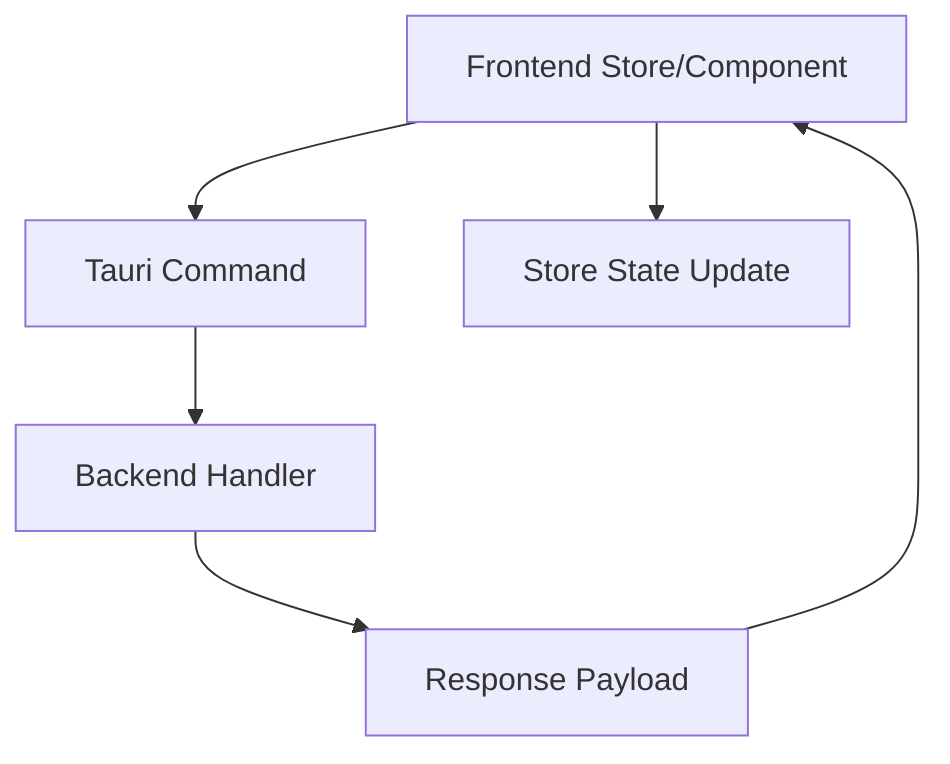

[No sources needed since this diagram shows conceptual workflow, not actual code structure]

## Detailed Component Analysis

### API Debugger Plugin
- Purpose: Send HTTP requests, preview resolved values, and manage collections, environments, and history.
- Key types:
  - Request model: [ApiSendRequest:27-41](file://src/plugins/api-debugger/types.ts#L27-L41)
  - Response model: [ApiResponseData:51-64](file://src/plugins/api-debugger/types.ts#L51-L64)
  - Collections/environments/history models: [ApiCollection:66-68](file://src/plugins/api-debugger/types.ts#L66-L68), [ApiEnvironment:68-68](file://src/plugins/api-debugger/types.ts#L68-L68), [ApiHistoryItem:89-100](file://src/plugins/api-debugger/types.ts#L89-L100)
- Command surface:
  - Backend commands module: [commands.rs](file://src-tauri/src/plugins/api_debugger/commands.rs)
  - Types: [types.rs](file://src-tauri/src/plugins/api_debugger/types.rs)
- Frontend integration:
  - Store: [store/api-debugger.ts](file://src/plugins/api-debugger/store/api-debugger.ts)
  - Entry: [index.tsx](file://src/plugins/api-debugger/index.tsx)
  - Types: [types.ts](file://src/plugins/api-debugger/types.ts)

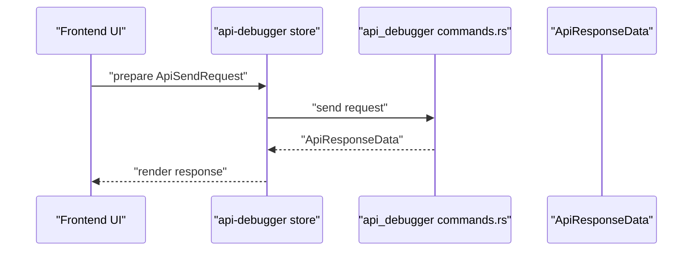

**Diagram sources**
- [commands.rs](file://src-tauri/src/plugins/api_debugger/commands.rs)
- [types.ts:27-64](file://src/plugins/api-debugger/types.ts#L27-L64)

**Section sources**
- [types.ts:1-105](file://src/plugins/api-debugger/types.ts#L1-L105)
- [index.tsx](file://src/plugins/api-debugger/index.tsx)
- [store/api-debugger.ts](file://src/plugins/api-debugger/store/api-debugger.ts)
- [commands.rs](file://src-tauri/src/plugins/api_debugger/commands.rs)
- [types.rs](file://src-tauri/src/plugins/api_debugger/types.rs)

### MongoDB Client Plugin
- Purpose: Manage MongoDB connections, browse databases/collections, run queries, import/export, and view server status.
- Key types:
  - Connection forms/info: [MongoConnectionFormData:3-18](file://src/plugins/mongodb-client/types.ts#L3-L18), [MongoConnectionInfo:20-34](file://src/plugins/mongodb-client/types.ts#L20-L34)
  - Query and import results: [MongoQueryHistoryItem:73-81](file://src/plugins/mongodb-client/types.ts#L73-L81), [MongoImportResult:83-87](file://src/plugins/mongodb-client/types.ts#L83-L87)
  - Server status: [MongoServerStatus:89-94](file://src/plugins/mongodb-client/types.ts#L89-L94)
- Command surface:
  - Commands: [commands.rs](file://src-tauri/src/plugins/mongodb/commands.rs)
  - Types: [types.rs](file://src-tauri/src/plugins/mongodb/types.rs)
  - Client pool: [client_pool.rs](file://src-tauri/src/plugins/mongodb/client_pool.rs)
- Frontend integration:
  - Entry: [index.tsx](file://src/plugins/mongodb-client/index.tsx)
  - Store: [store/mongodb-connections.ts](file://src/plugins/mongodb-client/store/mongodb-connections.ts)
  - Types: [types.ts](file://src/plugins/mongodb-client/types.ts)

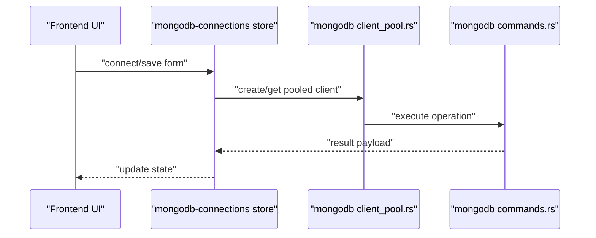

**Diagram sources**
- [client_pool.rs](file://src-tauri/src/plugins/mongodb/client_pool.rs)
- [commands.rs](file://src-tauri/src/plugins/mongodb/commands.rs)
- [types.ts:3-34](file://src/plugins/mongodb-client/types.ts#L3-L34)

**Section sources**
- [types.ts:1-95](file://src/plugins/mongodb-client/types.ts#L1-L95)
- [index.tsx](file://src/plugins/mongodb-client/index.tsx)
- [store/mongodb-connections.ts](file://src/plugins/mongodb-client/store/mongodb-connections.ts)
- [commands.rs](file://src-tauri/src/plugins/mongodb/commands.rs)
- [types.rs](file://src-tauri/src/plugins/mongodb/types.rs)
- [client_pool.rs](file://src-tauri/src/plugins/mongodb/client_pool.rs)

### MySQL Client Plugin
- Purpose: Manage MySQL connections, browse schema, execute SQL, import/export, and view server status.
- Key types:
  - Connection forms/info: [MysqlConnectionFormData:1-13](file://src/plugins/mysql-client/types.ts#L1-L13), [MysqlConnectionInfo:15-27](file://src/plugins/mysql-client/types.ts#L15-L27)
  - Results and metadata: [MysqlSqlResult:35-35](file://src/plugins/mysql-client/types.ts#L35-L35), [MysqlQueryHistoryItem:37-37](file://src/plugins/mysql-client/types.ts#L37-L37)
  - Server status: [MysqlServerStatus:39-39](file://src/plugins/mysql-client/types.ts#L39-L39)
- Command surface:
  - Commands: [commands.rs](file://src-tauri/src/plugins/mysql/commands.rs)
  - Types: [types.rs](file://src-tauri/src/plugins/mysql/types.rs)
  - Client pool: [client_pool.rs](file://src-tauri/src/plugins/mysql/client_pool.rs)
- Frontend integration:
  - Entry: [index.tsx](file://src/plugins/mysql-client/index.tsx)
  - Store: [store/mysql-connections.ts](file://src/plugins/mysql-client/store/mysql-connections.ts)
  - Types: [types.ts](file://src/plugins/mysql-client/types.ts)

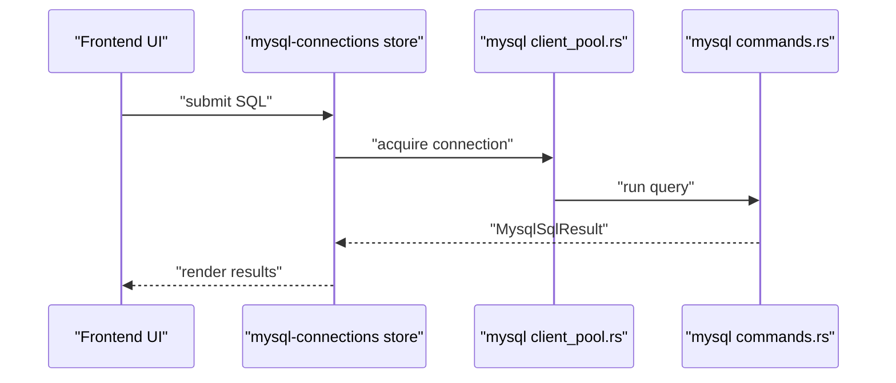

**Diagram sources**
- [client_pool.rs](file://src-tauri/src/plugins/mysql/client_pool.rs)
- [commands.rs](file://src-tauri/src/plugins/mysql/commands.rs)
- [types.ts:1-39](file://src/plugins/mysql-client/types.ts#L1-L39)

**Section sources**
- [types.ts:1-40](file://src/plugins/mysql-client/types.ts#L1-L40)
- [index.tsx](file://src/plugins/mysql-client/index.tsx)
- [store/mysql-connections.ts](file://src/plugins/mysql-client/store/mysql-connections.ts)
- [commands.rs](file://src-tauri/src/plugins/mysql/commands.rs)
- [types.rs](file://src-tauri/src/plugins/mysql/types.rs)
- [client_pool.rs](file://src-tauri/src/plugins/mysql/client_pool.rs)

### Redis Manager Plugin
- Purpose: Connect to Redis (standalone, sentinel, cluster), browse keys, inspect values, run console commands, export/import, and view server info.
- Key types:
  - Connection forms/info: [ConnectionFormData:3-12](file://src/plugins/redis-manager/types.ts#L3-L12), [ConnectionInfo:14-23](file://src/plugins/redis-manager/types.ts#L14-L23)
  - Values and scan: [RedisValue:85-90](file://src/plugins/redis-manager/types.ts#L85-L90), [ScanResult:40-43](file://src/plugins/redis-manager/types.ts#L40-L43)
  - Server info: [ServerInfo:62-68](file://src/plugins/redis-manager/types.ts#L62-L68)
- Command surface:
  - Commands: [commands.rs](file://src-tauri/src/plugins/redis/commands.rs)
  - Types: [types.rs](file://src-tauri/src/plugins/redis/types.rs)
  - Pool: [pool.rs](file://src-tauri/src/plugins/redis/pool.rs)
- Frontend integration:
  - Entry: [index.tsx](file://src/plugins/redis-manager/index.tsx)
  - Stores: [connections.ts](file://src/plugins/redis-manager/store/connections.ts), [console.ts](file://src/plugins/redis-manager/store/console.ts), [key-browser.ts](file://src/plugins/redis-manager/store/key-browser.ts), [server-info.ts](file://src/plugins/redis-manager/store/server-info.ts), [workspace.ts](file://src/plugins/redis-manager/store/workspace.ts)
  - Types: [types.ts](file://src/plugins/redis-manager/types.ts)

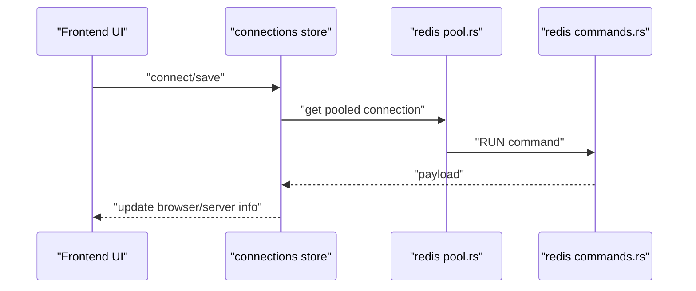

**Diagram sources**
- [pool.rs](file://src-tauri/src/plugins/redis/pool.rs)
- [commands.rs](file://src-tauri/src/plugins/redis/commands.rs)
- [types.ts:1-91](file://src/plugins/redis-manager/types.ts#L1-L91)

**Section sources**
- [types.ts:1-91](file://src/plugins/redis-manager/types.ts#L1-L91)
- [index.tsx](file://src/plugins/redis-manager/index.tsx)
- [store/connections.ts](file://src/plugins/redis-manager/store/connections.ts)
- [store/console.ts](file://src/plugins/redis-manager/store/console.ts)
- [store/key-browser.ts](file://src/plugins/redis-manager/store/key-browser.ts)
- [store/server-info.ts](file://src/plugins/redis-manager/store/server-info.ts)
- [store/workspace.ts](file://src/plugins/redis-manager/store/workspace.ts)
- [commands.rs](file://src-tauri/src/plugins/redis/commands.rs)
- [types.rs](file://src-tauri/src/plugins/redis/types.rs)
- [pool.rs](file://src-tauri/src/plugins/redis/pool.rs)

### S3 Client Plugin
- Purpose: Manage S3-compatible connections, list buckets/objects, preview metadata, delete objects, and compute bucket statistics.
- Key types:
  - Connection forms/info: [S3ConnectionFormData:3-14](file://src/plugins/s3-client/types.ts#L3-L14), [S3ConnectionInfo:16-27](file://src/plugins/s3-client/types.ts#L16-L27)
  - Objects and versions: [S3ObjectItem:40-46](file://src/plugins/s3-client/types.ts#L40-L46), [S3ObjectVersion:55-63](file://src/plugins/s3-client/types.ts#L55-L63)
  - Lists and stats: [S3ListObjectsResult:48-53](file://src/plugins/s3-client/types.ts#L48-L53), [S3BucketStats:86-90](file://src/plugins/s3-client/types.ts#L86-L90)
- Command surface:
  - Commands: [commands.rs](file://src-tauri/src/plugins/s3/commands.rs)
  - Types: [types.rs](file://src-tauri/src/plugins/s3/types.rs)
  - Client pool: [client_pool.rs](file://src-tauri/src/plugins/s3/client_pool.rs)
- Frontend integration:
  - Entry: [index.tsx](file://src/plugins/s3-client/index.tsx)
  - Store: [store/s3-connections.ts](file://src/plugins/s3-client/store/s3-connections.ts)
  - Types: [types.ts](file://src/plugins/s3-client/types.ts)

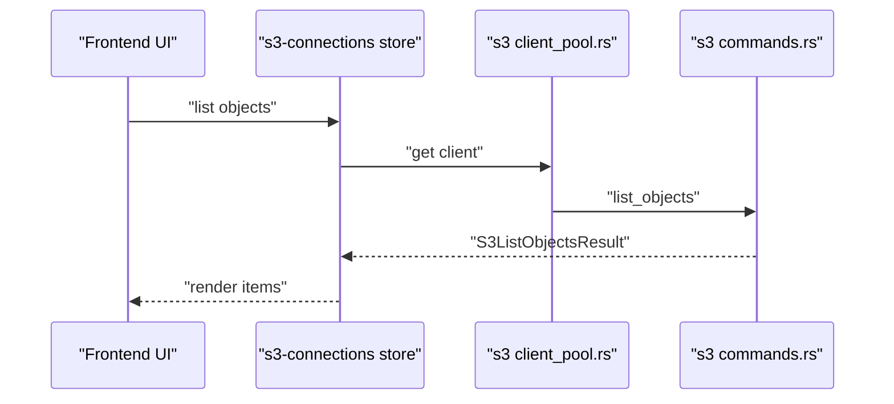

**Diagram sources**
- [client_pool.rs](file://src-tauri/src/plugins/s3/client_pool.rs)
- [commands.rs](file://src-tauri/src/plugins/s3/commands.rs)
- [types.ts:1-110](file://src/plugins/s3-client/types.ts#L1-L110)

**Section sources**
- [types.ts:1-110](file://src/plugins/s3-client/types.ts#L1-L110)
- [index.tsx](file://src/plugins/s3-client/index.tsx)
- [store/s3-connections.ts](file://src/plugins/s3-client/store/s3-connections.ts)
- [commands.rs](file://src-tauri/src/plugins/s3/commands.rs)
- [types.rs](file://src-tauri/src/plugins/s3/types.rs)
- [client_pool.rs](file://src-tauri/src/plugins/s3/client_pool.rs)

### SSH Client Plugin
- Purpose: Establish SSH sessions, manage terminals, maintain key pairs, and configure tunnels.
- Key types:
  - Connection forms/info: [SshConnectionFormData:3-17](file://src/plugins/ssh-client/types.ts#L3-L17), [SshConnectionInfo:19-32](file://src/plugins/ssh-client/types.ts#L19-L32)
  - Sessions and quick commands: [SshSessionMeta:44-49](file://src/plugins/ssh-client/types.ts#L44-L49), [SshQuickCommand:51-57](file://src/plugins/ssh-client/types.ts#L51-L57)
  - Keys and tunnels: [SshKeyInfo:67-74](file://src/plugins/ssh-client/types.ts#L67-L74), [TunnelRule:82-93](file://src/plugins/ssh-client/types.ts#L82-L93)
- Command surface:
  - Commands: [commands.rs](file://src-tauri/src/plugins/ssh/commands.rs)
  - Types: [types.rs](file://src-tauri/src/plugins/ssh/types.rs)
  - Session pool: [session_pool.rs](file://src-tauri/src/plugins/ssh/session_pool.rs)
  - Terminal: [terminal.rs](file://src-tauri/src/plugins/ssh/terminal.rs)
  - Tunnel: [tunnel.rs](file://src-tauri/src/plugins/ssh/tunnel.rs)
- Frontend integration:
  - Entry: [index.tsx](file://src/plugins/ssh-client/index.tsx)
  - Stores: [keys.ts](file://src/plugins/ssh-client/store/keys.ts), [sessions.ts](file://src/plugins/ssh-client/store/sessions.ts), [ssh-connections.ts](file://src/plugins/ssh-client/store/ssh-connections.ts), [tunnels.ts](file://src/plugins/ssh-client/store/tunnels.ts), [workspace.ts](file://src/plugins/ssh-client/store/workspace.ts)
  - Types: [types.ts](file://src/plugins/ssh-client/types.ts)

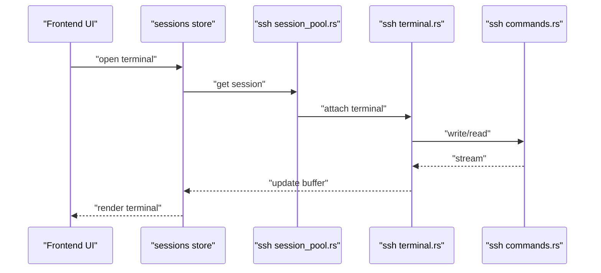

**Diagram sources**
- [session_pool.rs](file://src-tauri/src/plugins/ssh/session_pool.rs)
- [terminal.rs](file://src-tauri/src/plugins/ssh/terminal.rs)
- [commands.rs](file://src-tauri/src/plugins/ssh/commands.rs)
- [types.ts:1-115](file://src/plugins/ssh-client/types.ts#L1-L115)

**Section sources**
- [types.ts:1-115](file://src/plugins/ssh-client/types.ts#L1-L115)
- [index.tsx](file://src/plugins/ssh-client/index.tsx)
- [store/keys.ts](file://src/plugins/ssh-client/store/keys.ts)
- [store/sessions.ts](file://src/plugins/ssh-client/store/sessions.ts)
- [store/ssh-connections.ts](file://src/plugins/ssh-client/store/ssh-connections.ts)
- [store/tunnels.ts](file://src/plugins/ssh-client/store/tunnels.ts)
- [store/workspace.ts](file://src/plugins/ssh-client/store/workspace.ts)
- [commands.rs](file://src-tauri/src/plugins/ssh/commands.rs)
- [types.rs](file://src-tauri/src/plugins/ssh/types.rs)
- [session_pool.rs](file://src-tauri/src/plugins/ssh/session_pool.rs)
- [terminal.rs](file://src-tauri/src/plugins/ssh/terminal.rs)
- [tunnel.rs](file://src-tauri/src/plugins/ssh/tunnel.rs)

### Network Tools Plugin
- Purpose: Perform ping, TCP checks, DNS lookups, and traceroute diagnostics with history.
- Key types:
  - History and results: [NetworkHistoryItem:3-13](file://src/plugins/network-tools/types.ts#L3-L13), [NetworkResult:56-56](file://src/plugins/network-tools/types.ts#L56-L56)
  - Tool-specific results: [PingResult:24-33](file://src/plugins/network-tools/types.ts#L24-L33), [TcpCheckResult:15-22](file://src/plugins/network-tools/types.ts#L15-L22), [DnsLookupResult:35-40](file://src/plugins/network-tools/types.ts#L35-L40), [TracerouteResult:48-54](file://src/plugins/network-tools/types.ts#L48-L54)
- Command surface:
  - Commands: [commands.rs](file://src-tauri/src/plugins/network/commands.rs)
  - Types: [types.rs](file://src-tauri/src/plugins/network/types.rs)
- Frontend integration:
  - Entry: [index.tsx](file://src/plugins/network-tools/index.tsx)
  - Store: [store/network-tools.ts](file://src/plugins/network-tools/store/network-tools.ts)
  - Types: [types.ts](file://src/plugins/network-tools/types.ts)

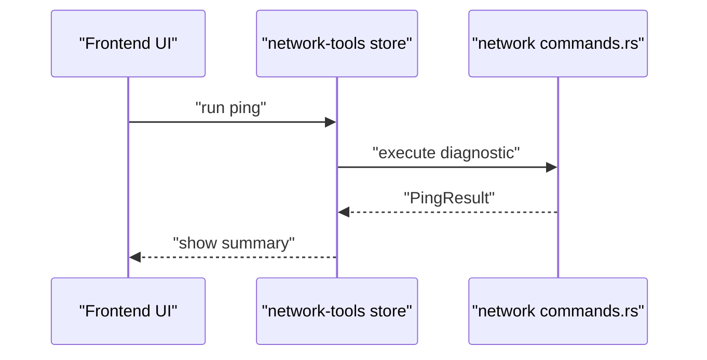

**Diagram sources**
- [commands.rs](file://src-tauri/src/plugins/network/commands.rs)
- [types.ts:1-57](file://src/plugins/network-tools/types.ts#L1-L57)

**Section sources**
- [types.ts:1-57](file://src/plugins/network-tools/types.ts#L1-L57)
- [index.tsx](file://src/plugins/network-tools/index.tsx)
- [store/network-tools.ts](file://src/plugins/network-tools/store/network-tools.ts)
- [commands.rs](file://src-tauri/src/plugins/network/commands.rs)
- [types.rs](file://src-tauri/src/plugins/network/types.rs)

### MQ Client Plugin
- Purpose: Connect to RabbitMQ or Kafka, publish/consume messages, preview message bodies, and track history.
- Key types:
  - Broker configs and connections: [RabbitMqConfig:4-10](file://src/plugins/mq-client/types.ts#L4-L10), [KafkaConfig:12-20](file://src/plugins/mq-client/types.ts#L12-L20), [MqConnectionFormData:22-33](file://src/plugins/mq-client/types.ts#L22-L33)
  - Operations: [MqPublishRequest:46-57](file://src/plugins/mq-client/types.ts#L46-L57), [MqConsumeRequest:59-70](file://src/plugins/mq-client/types.ts#L59-L70)
  - Results and previews: [MqMessagePreview:72-82](file://src/plugins/mq-client/types.ts#L72-L82), [MqOperationResult:84-84](file://src/plugins/mq-client/types.ts#L84-L84)
- Command surface:
  - Commands: [commands.rs](file://src-tauri/src/plugins/mq/commands.rs)
  - Types: [types.rs](file://src-tauri/src/plugins/mq/types.rs)
- Frontend integration:
  - Entry: [index.tsx](file://src/plugins/mq-client/index.tsx)
  - Store: [store/mq-client.ts](file://src/plugins/mq-client/store/mq-client.ts)
  - Types: [types.ts](file://src/plugins/mq-client/types.ts)

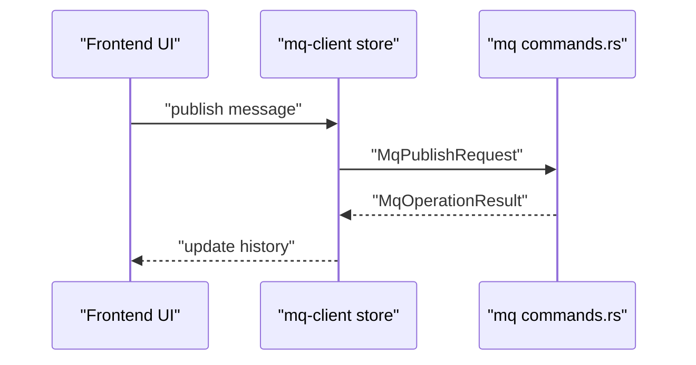

**Diagram sources**
- [commands.rs](file://src-tauri/src/plugins/mq/commands.rs)
- [types.ts:1-90](file://src/plugins/mq-client/types.ts#L1-L90)

**Section sources**
- [types.ts:1-90](file://src/plugins/mq-client/types.ts#L1-L90)
- [index.tsx](file://src/plugins/mq-client/index.tsx)
- [store/mq-client.ts](file://src/plugins/mq-client/store/mq-client.ts)
- [commands.rs](file://src-tauri/src/plugins/mq/commands.rs)
- [types.rs](file://src-tauri/src/plugins/mq/types.rs)

### LAN Chat Plugin
- Purpose: Discover peers, join rooms, send/receive messages, and manage file transfers.
- Key types:
  - Identity and devices: [LanChatDeviceIdentity:1-7](file://src/plugins/lan-chat/types.ts#L1-L7), [LanChatDevice:9-18](file://src/plugins/lan-chat/types.ts#L9-L18)
  - Rooms, conversations, messages, transfers: [LanChatRoom:20-30](file://src/plugins/lan-chat/types.ts#L20-L30), [LanChatConversation:32-38](file://src/plugins/lan-chat/types.ts#L32-L38), [LanChatMessage:40-50](file://src/plugins/lan-chat/types.ts#L40-L50), [LanChatTransfer:52-66](file://src/plugins/lan-chat/types.ts#L52-L66)
  - Snapshot: [LanChatSnapshot:68-74](file://src/plugins/lan-chat/types.ts#L68-L74)
- Command surface:
  - Commands: [commands.rs](file://src-tauri/src/plugins/lan_chat/commands.rs)
  - Types: [types.rs](file://src-tauri/src/plugins/lan_chat/types.rs)
- Frontend integration:
  - Entry: [index.tsx](file://src/plugins/lan-chat/index.tsx)
  - Store: [store/lan-chat.ts](file://src/plugins/lan-chat/store/lan-chat.ts)
  - Types: [types.ts](file://src/plugins/lan-chat/types.ts)

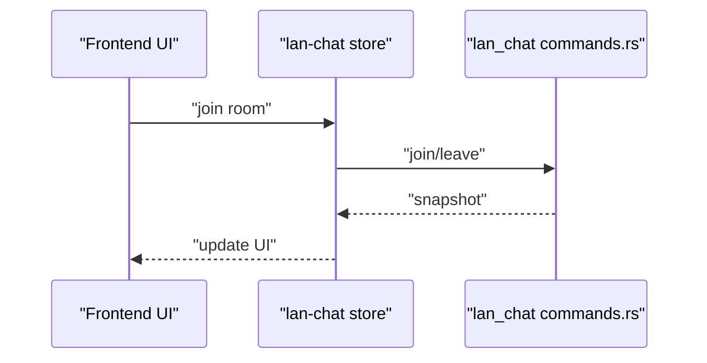

**Diagram sources**
- [commands.rs](file://src-tauri/src/plugins/lan_chat/commands.rs)
- [types.ts:1-74](file://src/plugins/lan-chat/types.ts#L1-L74)

**Section sources**
- [types.ts:1-74](file://src/plugins/lan-chat/types.ts#L1-L74)
- [index.tsx](file://src/plugins/lan-chat/index.tsx)
- [store/lan-chat.ts](file://src/plugins/lan-chat/store/lan-chat.ts)
- [commands.rs](file://src-tauri/src/plugins/lan_chat/commands.rs)
- [types.rs](file://src-tauri/src/plugins/lan_chat/types.rs)

### Confluence Plugin
- Purpose: Manage Confluence connections, test connectivity, fetch spaces/pages, and publish content.
- Key types:
  - Connection and forms: [ConfluenceConnectionInfo:1-9](file://src/plugins/confluence/types.ts#L1-L9), [ConfluenceConnectionForm:11-18](file://src/plugins/confluence/types.ts#L11-L18)
  - Test and page info: [ConfluenceTestResult:20-24](file://src/plugins/confluence/types.ts#L20-L24), [SpaceInfo:26-29](file://src/plugins/confluence/types.ts#L26-L29), [PageInfo:31-36](file://src/plugins/confluence/types.ts#L31-L36)
  - Publishing and history: [ConfluencePublishHistory:53-66](file://src/plugins/confluence/types.ts#L53-L66), [ConfluencePublishHistoryForm:68-79](file://src/plugins/confluence/types.ts#L68-L79), [ConfluencePageTarget:81-85](file://src/plugins/confluence/types.ts#L81-L85)
- Command surface:
  - Commands: [commands.rs](file://src-tauri/src/plugins/confluence/commands.rs)
  - Types: [types.rs](file://src-tauri/src/plugins/confluence/types.rs)
- Frontend integration:
  - Entry: [index.tsx](file://src/plugins/confluence/index.tsx)
  - Store: [store/confluence.ts](file://src/plugins/confluence/store/confluence.ts)
  - Types: [types.ts](file://src/plugins/confluence/types.ts)

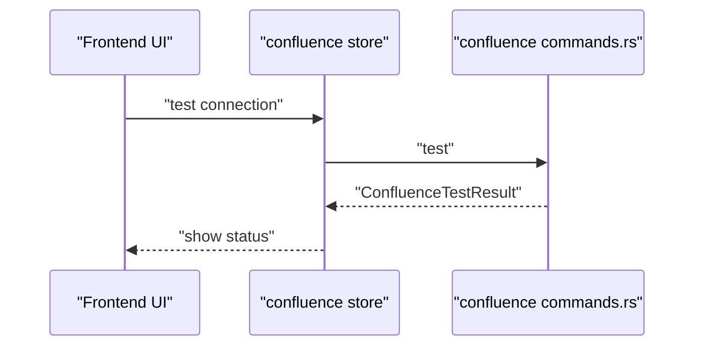

**Diagram sources**
- [commands.rs](file://src-tauri/src/plugins/confluence/commands.rs)
- [types.ts:1-86](file://src/plugins/confluence/types.ts#L1-L86)

**Section sources**
- [types.ts:1-86](file://src/plugins/confluence/types.ts#L1-L86)
- [index.tsx](file://src/plugins/confluence/index.tsx)
- [store/confluence.ts](file://src/plugins/confluence/store/confluence.ts)
- [commands.rs](file://src-tauri/src/plugins/confluence/commands.rs)
- [types.rs](file://src-tauri/src/plugins/confluence/types.rs)

## Dependency Analysis
Plugins depend on backend modules declared in the central plugins registry. Each plugin’s backend module exports commands and types, while the frontend consumes them through typed stores and components.

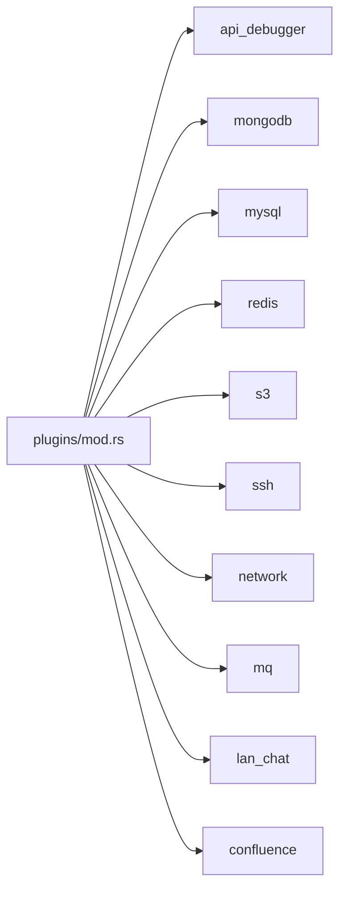

**Diagram sources**
- [mod.rs:1-11](file://src-tauri/src/plugins/mod.rs#L1-L11)

**Section sources**
- [mod.rs:1-11](file://src-tauri/src/plugins/mod.rs#L1-L11)

## Performance Considerations
- Connection pooling: Redis, S3, MongoDB, and MySQL plugins use dedicated pools to reuse connections efficiently and reduce handshake overhead.
- Async operations: Frontend stores orchestrate long-running tasks (e.g., diagnostics, S3 listings, SSH streams) without blocking the UI.
- Resource cleanup: SSH sessions and tunnels are managed with explicit lifecycle controls; Redis and database pools close idle connections periodically.
- Payload sizes: API debugger and MQ clients handle large bodies; consider streaming or truncation to avoid UI bottlenecks.

[No sources needed since this section provides general guidance]

## Troubleshooting Guide
Common issues and resolutions:
- Authentication failures:
  - Verify credentials and auth type in connection forms.
  - Check plugin-specific auth fields (e.g., bearer token, API key placement).
- Connection timeouts:
  - Increase connectTimeout or adjust keepalive intervals.
  - Validate network reachability and firewall rules.
- SSL/TLS errors:
  - Disable SSL validation only for testing; enable strict validation in production.
- Large payloads:
  - Use pagination or filtering in lists (e.g., S3 list tokens, query limits).
  - Monitor body truncation indicators in response models.
- SSH tunnel errors:
  - Confirm local/remote ports and auto-start settings.
  - Validate jump host configuration if used.

**Section sources**
- [types.ts:37-40](file://src/plugins/api-debugger/types.ts#L37-L40)
- [types.ts:82-93](file://src/plugins/ssh-client/types.ts#L82-L93)
- [types.ts:62-68](file://src/plugins/redis-manager/types.ts#L62-L68)
- [types.ts:48-53](file://src/plugins/s3-client/types.ts#L48-L53)
- [types.ts:73-81](file://src/plugins/mongodb-client/types.ts#L73-L81)
- [types.ts:35-35](file://src/plugins/mysql-client/types.ts#L35-L35)

## Conclusion
DevNexus plugins provide a consistent, typed interface across diverse systems. Frontend stores encapsulate asynchronous operations, while backend modules implement robust command handlers with shared types. Connection pooling, lifecycle management, and structured error reporting enable reliable integrations for database clients, cloud storage, SSH, API debugging, network diagnostics, messaging systems, LAN chat, and Confluence publishing.

[No sources needed since this section summarizes without analyzing specific files]

## Appendices

### Plugin Command Invocation Patterns
- Frontend prepares a typed request object.
- Frontend dispatches the request to a backend command.
- Backend returns a structured payload or an error object.
- Frontend updates its store and re-renders the UI.

**Section sources**
- [types.ts:27-64](file://src/plugins/api-debugger/types.ts#L27-L64)
- [types.ts:46-84](file://src/plugins/mq-client/types.ts#L46-L84)
- [types.ts:3-13](file://src/plugins/network-tools/types.ts#L3-L13)

### Data Model Reference Tables
- API Debugger
  - Request: [ApiSendRequest:27-41](file://src/plugins/api-debugger/types.ts#L27-L41)
  - Response: [ApiResponseData:51-64](file://src/plugins/api-debugger/types.ts#L51-L64)
  - History: [ApiHistoryItem:89-100](file://src/plugins/api-debugger/types.ts#L89-L100)
- MongoDB Client
  - Connection: [MongoConnectionInfo:20-34](file://src/plugins/mongodb-client/types.ts#L20-L34)
  - Query history: [MongoQueryHistoryItem:73-81](file://src/plugins/mongodb-client/types.ts#L73-L81)
  - Server status: [MongoServerStatus:89-94](file://src/plugins/mongodb-client/types.ts#L89-L94)
- MySQL Client
  - Connection: [MysqlConnectionInfo:15-27](file://src/plugins/mysql-client/types.ts#L15-L27)
  - SQL result: [MysqlSqlResult:35-35](file://src/plugins/mysql-client/types.ts#L35-L35)
  - Server status: [MysqlServerStatus:39-39](file://src/plugins/mysql-client/types.ts#L39-L39)
- Redis Manager
  - Connection: [ConnectionInfo:14-23](file://src/plugins/redis-manager/types.ts#L14-L23)
  - Value: [RedisValue:85-90](file://src/plugins/redis-manager/types.ts#L85-L90)
  - Server info: [ServerInfo:62-68](file://src/plugins/redis-manager/types.ts#L62-L68)
- S3 Client
  - Connection: [S3ConnectionInfo:16-27](file://src/plugins/s3-client/types.ts#L16-L27)
  - Object item: [S3ObjectItem:40-46](file://src/plugins/s3-client/types.ts#L40-L46)
  - List result: [S3ListObjectsResult:48-53](file://src/plugins/s3-client/types.ts#L48-L53)
- SSH Client
  - Connection: [SshConnectionInfo:19-32](file://src/plugins/ssh-client/types.ts#L19-L32)
  - Session meta: [SshSessionMeta:44-49](file://src/plugins/ssh-client/types.ts#L44-L49)
  - Tunnel rule: [TunnelRule:82-93](file://src/plugins/ssh-client/types.ts#L82-L93)
- Network Tools
  - History: [NetworkHistoryItem:3-13](file://src/plugins/network-tools/types.ts#L3-L13)
  - Result union: [NetworkResult:56-56](file://src/plugins/network-tools/types.ts#L56-L56)
- MQ Client
  - Publish request: [MqPublishRequest:46-57](file://src/plugins/mq-client/types.ts#L46-L57)
  - Consume request: [MqConsumeRequest:59-70](file://src/plugins/mq-client/types.ts#L59-L70)
  - Preview: [MqMessagePreview:72-82](file://src/plugins/mq-client/types.ts#L72-L82)
- LAN Chat
  - Device identity: [LanChatDeviceIdentity:1-7](file://src/plugins/lan-chat/types.ts#L1-L7)
  - Message: [LanChatMessage:40-50](file://src/plugins/lan-chat/types.ts#L40-L50)
  - Transfer: [LanChatTransfer:52-66](file://src/plugins/lan-chat/types.ts#L52-L66)
- Confluence
  - Connection info: [ConfluenceConnectionInfo:1-9](file://src/plugins/confluence/types.ts#L1-L9)
  - Page target: [ConfluencePageTarget:81-85](file://src/plugins/confluence/types.ts#L81-L85)

**Section sources**
- [types.ts:27-105](file://src/plugins/api-debugger/types.ts#L27-L105)
- [types.ts:20-95](file://src/plugins/mongodb-client/types.ts#L20-L95)
- [types.ts:15-40](file://src/plugins/mysql-client/types.ts#L15-L40)
- [types.ts:14-91](file://src/plugins/redis-manager/types.ts#L14-L91)
- [types.ts:16-110](file://src/plugins/s3-client/types.ts#L16-L110)
- [types.ts:19-115](file://src/plugins/ssh-client/types.ts#L19-L115)
- [types.ts:3-57](file://src/plugins/network-tools/types.ts#L3-L57)
- [types.ts:46-90](file://src/plugins/mq-client/types.ts#L46-L90)
- [types.ts:1-86](file://src/plugins/lan-chat/types.ts#L1-L86)
- [types.ts:1-86](file://src/plugins/confluence/types.ts#L1-L86)