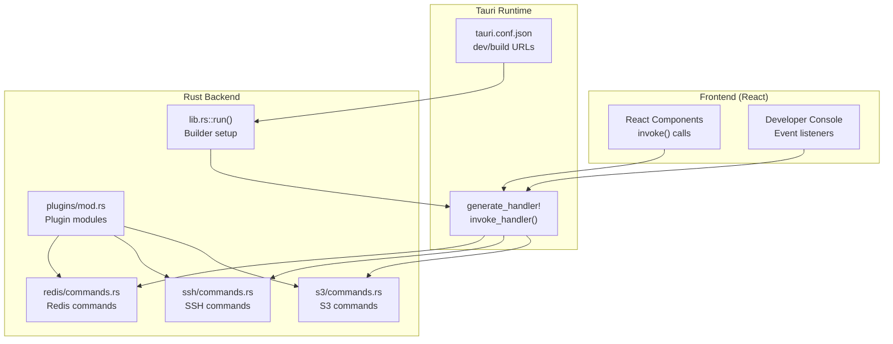
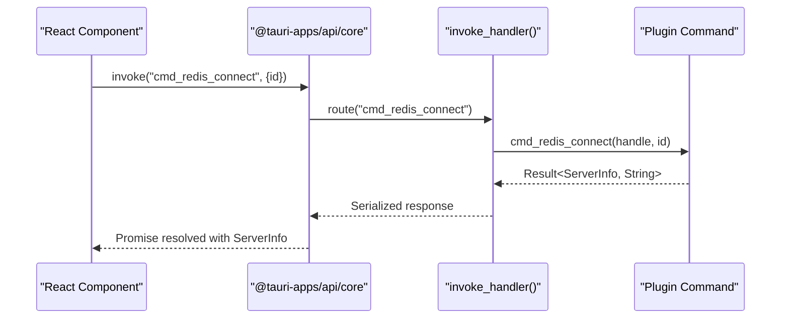
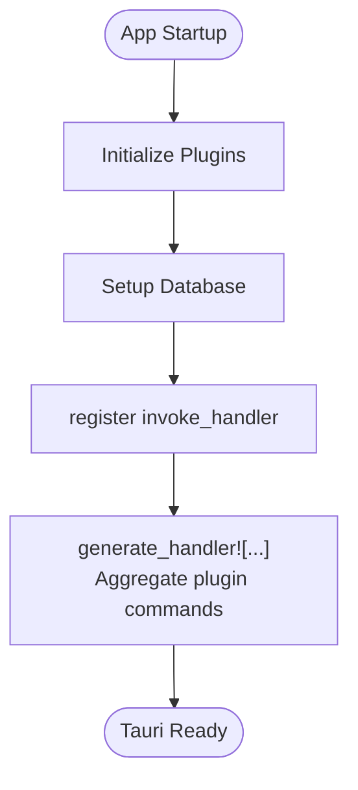
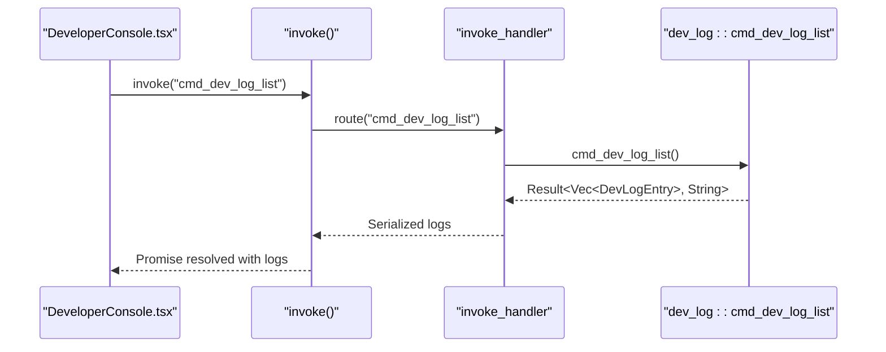
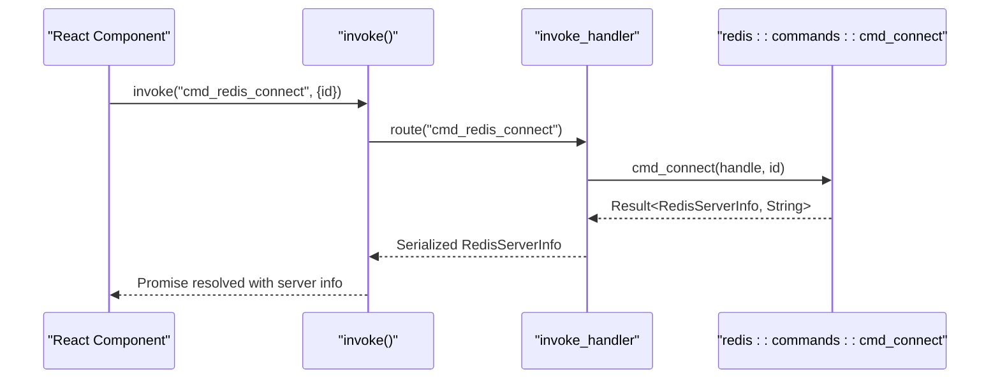
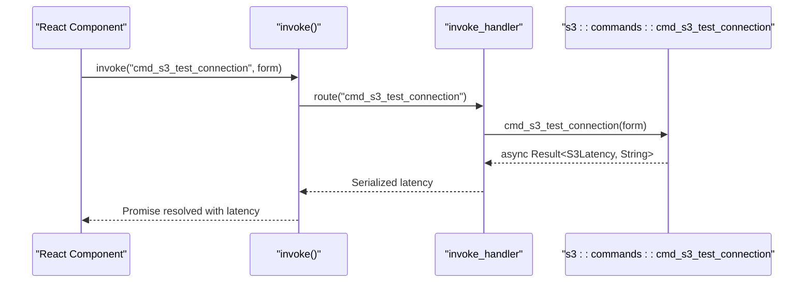
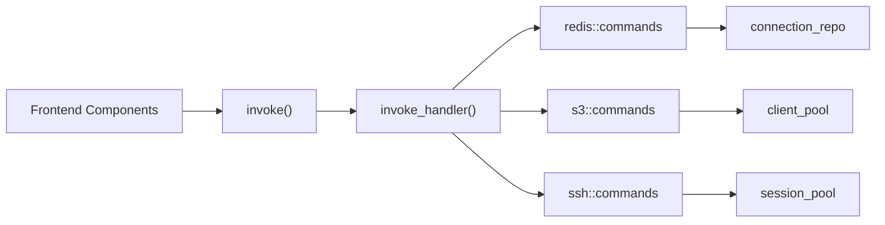

# Tauri Command System

<cite>
**Referenced Files in This Document**
- [main.rs](file://src-tauri/src/main.rs)
- [lib.rs](file://src-tauri/src/lib.rs)
- [tauri.conf.json](file://src-tauri/tauri.conf.json)
- [mod.rs](file://src-tauri/src/plugins/mod.rs)
- [commands.rs](file://src-tauri/src/plugins/redis/commands.rs)
- [commands.rs](file://src-tauri/src/plugins/ssh/commands.rs)
- [commands.rs](file://src-tauri/src/plugins/s3/commands.rs)
- [registry.ts](file://src/app/plugin-registry/registry.ts)
- [DeveloperConsole.tsx](file://src/app/developer-console/DeveloperConsole.tsx)
- [api.ts](file://src/app/developer-console/api.ts)
- [index.tsx](file://src/plugins/redis-manager/index.tsx)
</cite>

## Table of Contents
1. [Introduction](#introduction)
2. [Project Structure](#project-structure)
3. [Core Components](#core-components)
4. [Architecture Overview](#architecture-overview)
5. [Detailed Component Analysis](#detailed-component-analysis)
6. [Dependency Analysis](#dependency-analysis)
7. [Performance Considerations](#performance-considerations)
8. [Troubleshooting Guide](#troubleshooting-guide)
9. [Conclusion](#conclusion)

## Introduction
This document explains the Tauri command system that powers DevNexus, focusing on how Rust backend commands are registered and invoked from the React frontend. It covers the command registration mechanism, the invoke handler configuration, cross-language communication patterns, command signatures, parameter validation, error handling, return value formats, and practical examples for frontend invocation. It also documents the generate_handler macro usage, command naming conventions, plugin-specific command namespaces, and provides troubleshooting and performance guidance.

## Project Structure
DevNexus uses Tauri’s invoke system to bridge the React frontend and Rust backend. The application entrypoint initializes the Tauri Builder, registers plugins, sets up the database, and wires the invoke handler that exposes all backend commands to the frontend. Commands are grouped by plugin and exposed under a consistent naming convention.

**Diagram sources**
- [lib.rs:10-262](file://src-tauri/src/lib.rs#L10-L262)
- [tauri.conf.json:6-11](file://src-tauri/tauri.conf.json#L6-L11)
- [mod.rs:1-11](file://src-tauri/src/plugins/mod.rs#L1-L11)
- [commands.rs:139-142](file://src-tauri/src/plugins/redis/commands.rs#L139-L142)
- [commands.rs:8-13](file://src-tauri/src/plugins/ssh/commands.rs#L8-L13)
- [commands.rs:14-27](file://src-tauri/src/plugins/s3/commands.rs#L14-L27)

**Section sources**
- [main.rs:4-7](file://src-tauri/src/main.rs#L4-L7)
- [lib.rs:10-262](file://src-tauri/src/lib.rs#L10-L262)
- [tauri.conf.json:6-11](file://src-tauri/tauri.conf.json#L6-L11)

## Core Components
- Application entrypoint and builder: Initializes Tauri, registers plugins, sets up database, and configures the invoke handler.
- Invoke handler: Uses the generate_handler! macro to register all plugin commands in a single place.
- Plugin modules: Each plugin defines its own commands.rs file containing tauri::command functions.
- Frontend integration: React components use @tauri-apps/api/core invoke() to call backend commands.

Key responsibilities:
- lib.rs::run() constructs the Tauri Builder, registers plugins, runs initialization, and wires the invoke handler.
- generate_handler! aggregates all commands from plugin modules into a single invoke handler.
- Frontend components import invoke from @tauri-apps/api/core and call commands by their string identifiers.

**Section sources**
- [lib.rs:10-262](file://src-tauri/src/lib.rs#L10-L262)
- [mod.rs:1-11](file://src-tauri/src/plugins/mod.rs#L1-L11)

## Architecture Overview
The command system follows a strict contract:
- Backend: Each command is a #[tauri::command] function with a typed signature and returns Result<T, String>.
- Frontend: invoke("command_name", payload) sends parameters and receives structured results.
- Serialization: Tauri serializes/deserializes parameters and return values automatically via serde.

**Diagram sources**
- [lib.rs:26-259](file://src-tauri/src/lib.rs#L26-L259)
- [commands.rs:174-194](file://src-tauri/src/plugins/redis/commands.rs#L174-L194)

## Detailed Component Analysis

### Command Registration Mechanism
- The invoke handler is configured in lib.rs::run() using generate_handler!([...]) and lists all commands from plugin modules.
- Each plugin module exports a commands.rs file with #[tauri::command] functions.
- The generate_handler! macro registers these functions so the frontend can call them by name.

**Diagram sources**
- [lib.rs:10-262](file://src-tauri/src/lib.rs#L10-L262)
- [mod.rs:1-11](file://src-tauri/src/plugins/mod.rs#L1-L11)

**Section sources**
- [lib.rs:26-259](file://src-tauri/src/lib.rs#L26-L259)
- [mod.rs:1-11](file://src-tauri/src/plugins/mod.rs#L1-L11)

### Cross-Language Communication Patterns
- Frontend: Components import invoke from @tauri-apps/api/core and call commands by their string identifiers.
- Backend: Each command is a #[tauri::command] function taking typed parameters and returning Result<T, String>.
- Parameter serialization: Tauri uses serde to serialize/deserialize parameters and return values.
- Async commands: Some commands are async and return futures; Tauri handles async execution internally.

Examples of frontend invocation patterns:
- Developer Console invokes dev log commands via invoke("cmd_dev_log_list").
- Redis Manager components call Redis commands like connect, scan, get/set operations.

**Section sources**
- [api.ts:5-11](file://src/app/developer-console/api.ts#L5-L11)
- [DeveloperConsole.tsx:15-22](file://src/app/developer-console/DeveloperConsole.tsx#L15-L22)
- [index.tsx:14-36](file://src/plugins/redis-manager/index.tsx#L14-L36)

### Command Signature Patterns
- Standard pattern: #[tauri::command] fn cmd_name(app_handle: tauri::AppHandle, ...) -> Result<ReturnType, String>.
- Some commands take only AppHandle (e.g., list/query operations).
- Some commands are async (e.g., S3 operations) and return async Result.
- Return types are strongly typed and serialized automatically.

Examples:
- Redis: cmd_connect(app_handle, id) -> Result<RedisServerInfo, String>
- SSH: cmd_ssh_test_connection(form) -> Result<SshLatency, String>
- S3: cmd_s3_test_connection(form) -> Result<S3Latency, String> (async)

**Section sources**
- [commands.rs:174-194](file://src-tauri/src/plugins/redis/commands.rs#L174-L194)
- [commands.rs:29-62](file://src-tauri/src/plugins/ssh/commands.rs#L29-L62)
- [commands.rs:36-91](file://src-tauri/src/plugins/s3/commands.rs#L36-L91)

### Parameter Validation
- Validation occurs at the start of command functions. Examples:
  - Redis: Validates DB index range before switching databases.
  - SSH: Validates host and username presence; resolves addresses and checks connectivity.
  - S3: Validates required fields (name, access key, region) and provider-specific constraints.
- Errors are returned as String, which the frontend receives as a rejected promise.

**Section sources**
- [commands.rs:207-214](file://src-tauri/src/plugins/redis/commands.rs#L207-L214)
- [commands.rs:30-58](file://src-tauri/src/plugins/ssh/commands.rs#L30-L58)
- [commands.rs:36-55](file://src-tauri/src/plugins/s3/commands.rs#L36-L55)

### Error Handling Strategies
- Commands consistently return Result<T, String>. On success, Ok(T) is returned; on failure, Err(String) is returned.
- Frontend receives rejected promises with the error message string.
- Some commands implement safety checks (e.g., dangerous command confirmation) and return explicit error messages.

**Section sources**
- [commands.rs:674-679](file://src-tauri/src/plugins/redis/commands.rs#L674-L679)
- [commands.rs:182-184](file://src-tauri/src/plugins/ssh/commands.rs#L182-L184)

### Return Value Formats
- Strongly typed structs are returned (e.g., RedisServerInfo, S3ObjectItem, ScanResult).
- These are serialized via serde and deserialized on the frontend.
- Arrays, maps, and optional fields are supported and preserved across the boundary.

**Section sources**
- [commands.rs:50-90](file://src-tauri/src/plugins/redis/commands.rs#L50-L90)
- [commands.rs:108-181](file://src-tauri/src/plugins/s3/commands.rs#L108-L181)

### Example: Developer Console Command Invocation
- Frontend calls invoke("cmd_dev_log_list") to fetch logs.
- The invoke handler routes to dev_log::cmd_dev_log_list.
- The backend returns a Vec<DevLogEntry> which the frontend renders.

**Diagram sources**
- [api.ts:5-7](file://src/app/developer-console/api.ts#L5-L7)
- [lib.rs:226-227](file://src-tauri/src/lib.rs#L226-L227)

**Section sources**
- [api.ts:5-11](file://src/app/developer-console/api.ts#L5-L11)
- [DeveloperConsole.tsx:15-22](file://src/app/developer-console/DeveloperConsole.tsx#L15-L22)

### Example: Redis Command Invocation
- Frontend calls invoke("cmd_redis_connect", { id }) to establish a Redis connection.
- The invoke handler routes to plugins::redis::commands::cmd_connect.
- The backend validates connection info, connects, queries INFO, parses sections, and returns RedisServerInfo.

**Diagram sources**
- [commands.rs:174-194](file://src-tauri/src/plugins/redis/commands.rs#L174-L194)
- [lib.rs:26-69](file://src-tauri/src/lib.rs#L26-L69)

**Section sources**
- [commands.rs:174-194](file://src-tauri/src/plugins/redis/commands.rs#L174-L194)

### Example: S3 Command Invocation (Async)
- Frontend calls invoke("cmd_s3_test_connection", form) to test S3 connectivity.
- The invoke handler routes to s3::commands::cmd_s3_test_connection (async).
- The backend validates form fields, builds a client, performs a list operation, and returns S3Latency.

**Diagram sources**
- [commands.rs:36-91](file://src-tauri/src/plugins/s3/commands.rs#L36-L91)
- [lib.rs:96-101](file://src-tauri/src/lib.rs#L96-L101)

**Section sources**
- [commands.rs:36-91](file://src-tauri/src/plugins/s3/commands.rs#L36-L91)

### Command Naming Conventions and Plugin Namespaces
- Naming convention: cmd_<plugin>_<operation>(...).
- Plugin namespaces:
  - redis: cmd_redis_* (connect, disconnect, scan, get/set, list/history, etc.)
  - ssh: cmd_ssh_* (connections, terminals, keys, tunnels)
  - s3: cmd_s3_* (connections, buckets, objects, uploads/downloads)
  - api_debugger, mq, mongodb, mysql, network, lan_chat, confluence
- The invoke handler aggregates all commands from plugin modules, ensuring unique command names across the app.

**Section sources**
- [lib.rs:26-259](file://src-tauri/src/lib.rs#L26-L259)
- [mod.rs:1-11](file://src-tauri/src/plugins/mod.rs#L1-L11)

## Dependency Analysis
The command system exhibits low coupling and high cohesion:
- Frontend depends only on invoke() and command names.
- Backend commands depend on their respective plugin modules and shared infrastructure (e.g., connection repositories).
- The invoke handler centralizes routing and minimizes frontend knowledge of backend internals.

**Diagram sources**
- [lib.rs:26-259](file://src-tauri/src/lib.rs#L26-L259)
- [commands.rs:16-29](file://src-tauri/src/plugins/redis/commands.rs#L16-L29)
- [commands.rs:94-101](file://src-tauri/src/plugins/s3/commands.rs#L94-L101)
- [commands.rs:65-70](file://src-tauri/src/plugins/ssh/commands.rs#L65-L70)

**Section sources**
- [lib.rs:26-259](file://src-tauri/src/lib.rs#L26-L259)

## Performance Considerations
- Prefer batching operations where possible (e.g., bulk deletes, list operations with reasonable limits).
- Use async commands for I/O-bound tasks (e.g., S3 operations) to avoid blocking the UI thread.
- Cache frequently accessed data (e.g., connection pools) to reduce repeated setup costs.
- Limit large result sets by applying pagination or truncation (e.g., list_objects_v2 with max_keys).
- Avoid unnecessary serialization overhead by keeping payloads minimal and avoiding redundant conversions.

## Troubleshooting Guide
Common issues and resolutions:
- Command not found: Ensure the command name matches the registered name and the plugin module is included in generate_handler!.
- Parameter type mismatch: Verify frontend payload shape matches the backend function signature; Tauri relies on serde for serialization.
- Async command timeouts: For long-running operations (e.g., S3), ensure appropriate timeouts and consider progress reporting.
- Dangerous command blocked: Some commands require explicit confirmation (e.g., raw Redis commands); provide the required flag when invoking.
- Connection failures: Validate credentials and network reachability before invoking commands; check plugin-specific error messages.

**Section sources**
- [commands.rs:674-679](file://src-tauri/src/plugins/redis/commands.rs#L674-L679)
- [commands.rs:30-58](file://src-tauri/src/plugins/ssh/commands.rs#L30-L58)
- [commands.rs:36-55](file://src-tauri/src/plugins/s3/commands.rs#L36-L55)

## Conclusion
DevNexus leverages Tauri’s invoke system to provide a robust, typed, and scalable bridge between React components and Rust backend services. The generate_handler! macro centralizes command registration, while plugin-specific modules encapsulate domain logic. Strong typing, consistent error handling, and automatic serialization/deserialization simplify cross-language communication. Following the documented naming conventions, validation patterns, and performance recommendations ensures reliable and maintainable command execution across the application.