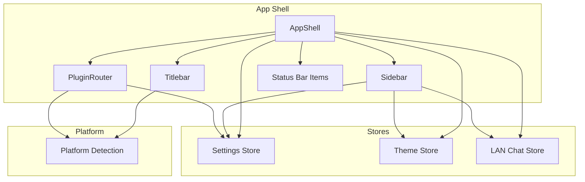
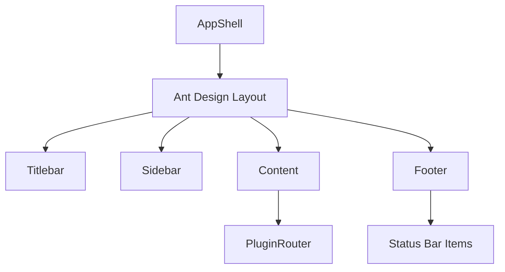
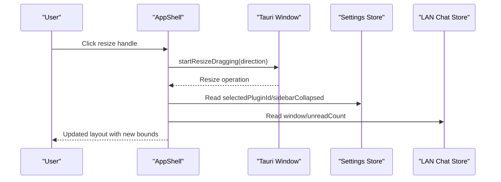
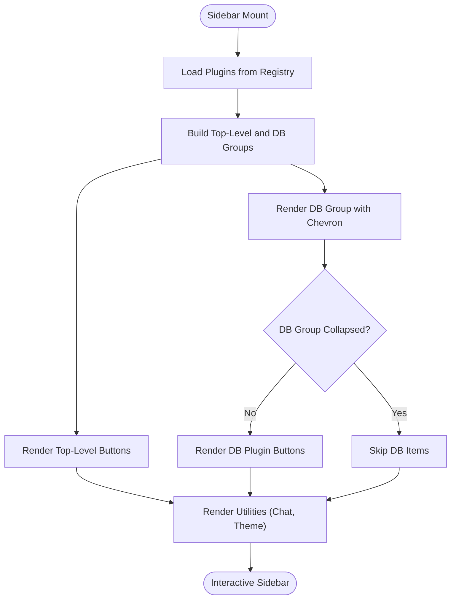
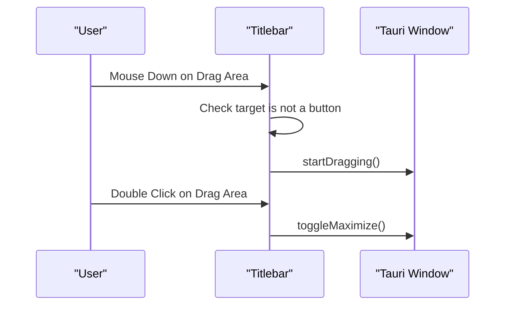
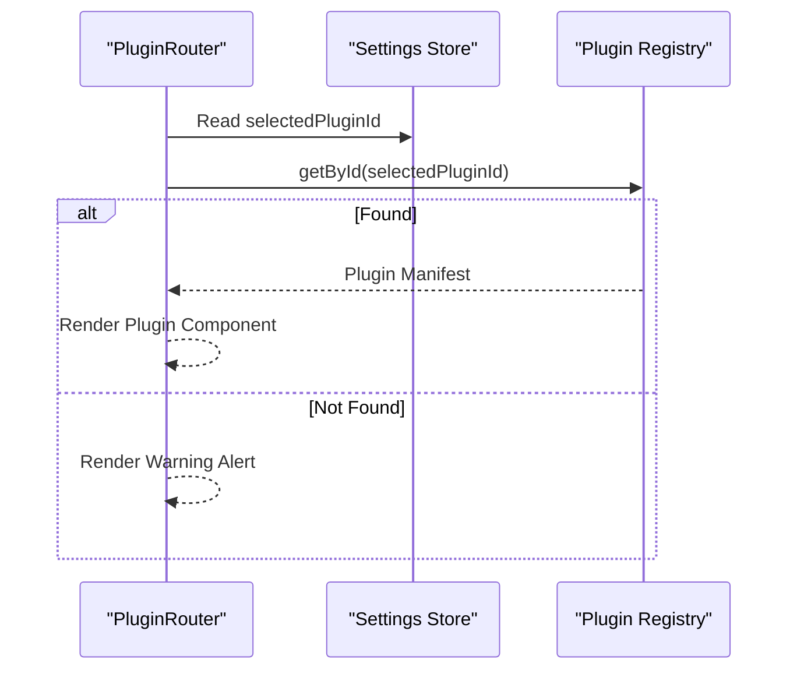
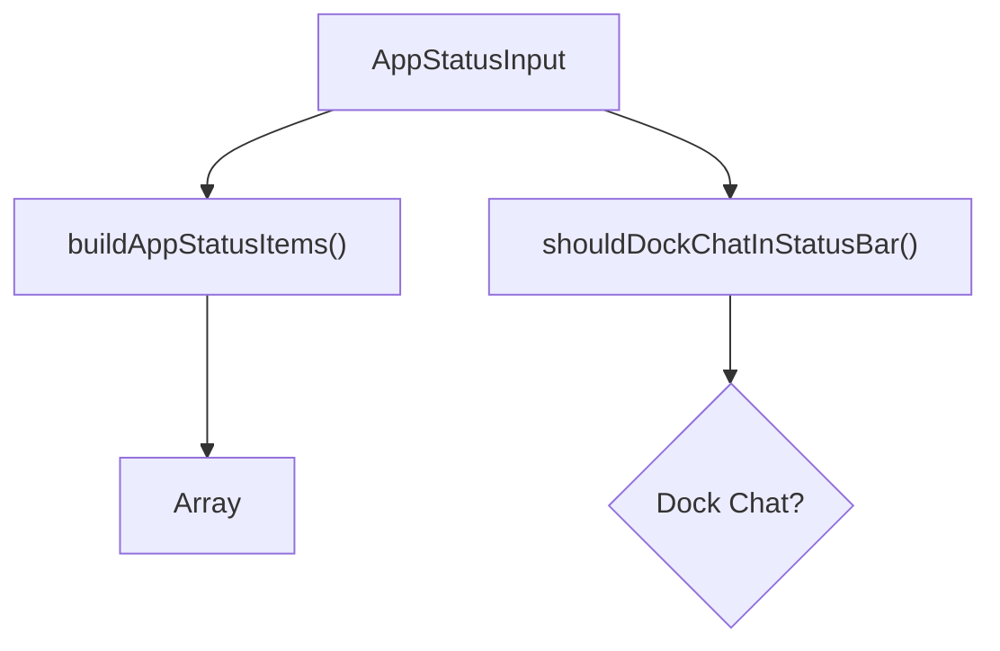
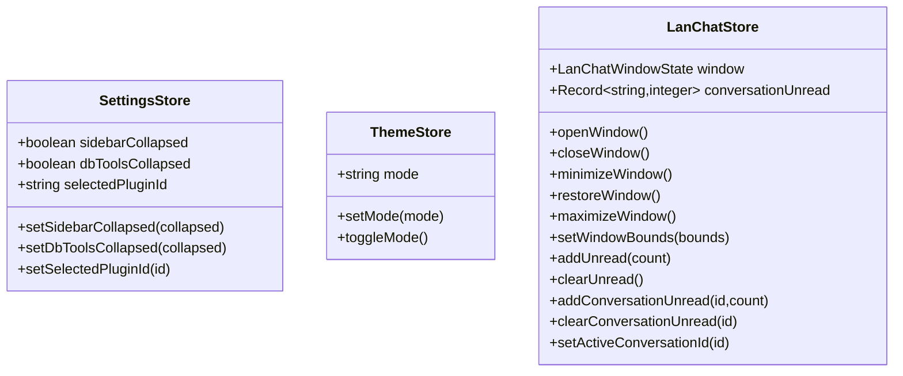
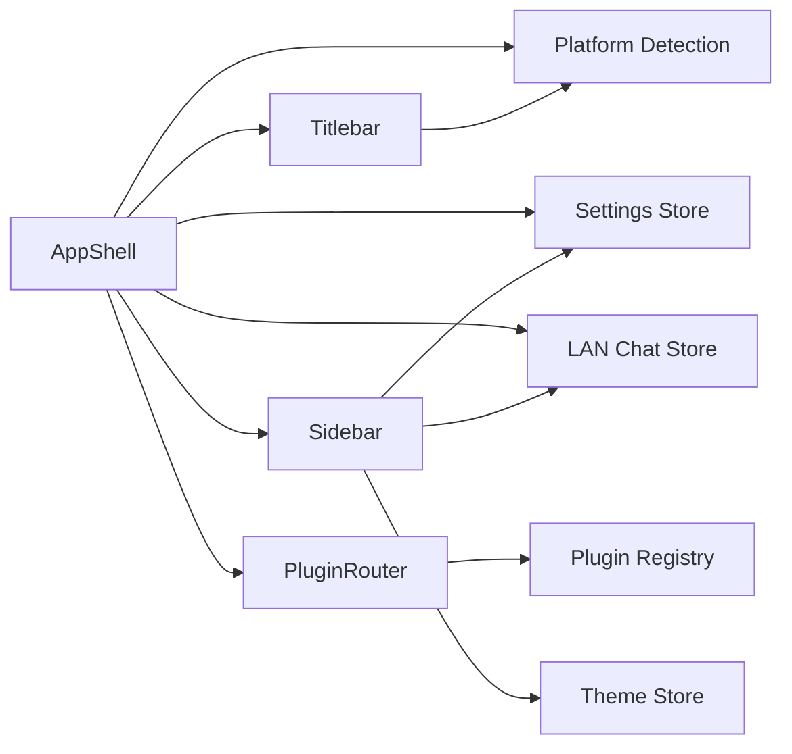

# AppShell Architecture

<cite>
**Referenced Files in This Document**
- [AppShell.tsx](file://src/app/layout/AppShell.tsx)
- [Sidebar.tsx](file://src/app/layout/Sidebar.tsx)
- [Titlebar.tsx](file://src/app/layout/Titlebar.tsx)
- [status-bar.ts](file://src/app/layout/status-bar.ts)
- [PluginRouter.tsx](file://src/app/plugin-registry/PluginRouter.tsx)
- [settings.ts](file://src/app/store/settings.ts)
- [theme.ts](file://src/app/store/theme.ts)
- [lan-chat.ts](file://src/plugins/lan-chat/store/lan-chat.ts)
- [platform.ts](file://src/app/runtime/platform.ts)
- [registry.ts](file://src/app/plugin-registry/registry.ts)
- [visibility.ts](file://src/app/plugin-registry/visibility.ts)
- [App.tsx](file://src/App.tsx)
- [main.tsx](file://src/main.tsx)
- [global.css](file://src/styles/global.css)
</cite>

## Table of Contents
1. [Introduction](#introduction)
2. [Project Structure](#project-structure)
3. [Core Components](#core-components)
4. [Architecture Overview](#architecture-overview)
5. [Detailed Component Analysis](#detailed-component-analysis)
6. [Dependency Analysis](#dependency-analysis)
7. [Performance Considerations](#performance-considerations)
8. [Troubleshooting Guide](#troubleshooting-guide)
9. [Conclusion](#conclusion)
10. [Appendices](#appendices)

## Introduction
This document explains the AppShell architecture component that defines the main container layout for the application. It covers the Ant Design Layout structure integrating Content, Footer, and Sidebar, the component hierarchy, state management via stores, dynamic resizing overlays for window manipulation, conditional rendering for desktop versus browser environments, native titlebar detection, cross-platform UI adaptations, plugin router integration, responsive design considerations, and accessibility features embedded in the shell structure.

## Project Structure
The AppShell orchestrates the primary layout and integrates several subsystems:
- Layout containers: Ant Design Layout with Content and Footer regions
- Navigation: Sidebar with collapsible groups and plugin selection
- Window controls: Titlebar with drag area and OS-specific behavior
- Status bar: Runtime and LAN connectivity indicators
- Routing: PluginRouter renders the active plugin’s view
- Stores: Settings, theme, and LAN chat state management
- Platform detection: Desktop vs browser and macOS-specific titlebar handling

**Diagram sources**
- [AppShell.tsx:31-206](file://src/app/layout/AppShell.tsx#L31-L206)
- [Titlebar.tsx:12-74](file://src/app/layout/Titlebar.tsx#L12-L74)
- [Sidebar.tsx:21-176](file://src/app/layout/Sidebar.tsx#L21-L176)
- [PluginRouter.tsx:7-28](file://src/app/plugin-registry/PluginRouter.tsx#L7-L28)
- [settings.ts:13-27](file://src/app/store/settings.ts#L13-L27)
- [theme.ts:12-26](file://src/app/store/theme.ts#L12-L26)
- [lan-chat.ts:89-201](file://src/plugins/lan-chat/store/lan-chat.ts#L89-L201)
- [platform.ts:1-10](file://src/app/runtime/platform.ts#L1-L10)

**Section sources**
- [AppShell.tsx:31-206](file://src/app/layout/AppShell.tsx#L31-L206)
- [App.tsx:4-10](file://src/App.tsx#L4-L10)
- [main.tsx:12-31](file://src/main.tsx#L12-L31)

## Core Components
- AppShell: Central layout container, conditionally renders Titlebar, manages resize overlays, composes Sidebar, PluginRouter, DeveloperConsole, and Footer with status items.
- Sidebar: Collapsible navigation with grouped plugin buttons, theme toggle, and LAN Chat quick access.
- Titlebar: Non-native window controls for desktop apps; macOS hides controls and relies on OS titlebar.
- PluginRouter: Renders the currently selected plugin component from the registry.
- Stores: Settings (sidebar state, selected plugin), Theme (mode), LAN Chat (window state and unread counts).
- Platform detection: Determines desktop runtime and macOS native titlebar support.

Key responsibilities:
- Layout orchestration and responsive sizing
- Cross-platform adaptation (desktop vs browser, macOS vs others)
- Dynamic resizing overlays for window manipulation
- Status reporting and LAN connectivity monitoring
- Plugin-driven content routing

**Section sources**
- [AppShell.tsx:31-206](file://src/app/layout/AppShell.tsx#L31-L206)
- [Sidebar.tsx:21-176](file://src/app/layout/Sidebar.tsx#L21-L176)
- [Titlebar.tsx:12-74](file://src/app/layout/Titlebar.tsx#L12-L74)
- [PluginRouter.tsx:7-28](file://src/app/plugin-registry/PluginRouter.tsx#L7-L28)
- [settings.ts:13-27](file://src/app/store/settings.ts#L13-L27)
- [theme.ts:12-26](file://src/app/store/theme.ts#L12-L26)
- [lan-chat.ts:89-201](file://src/plugins/lan-chat/store/lan-chat.ts#L89-L201)
- [platform.ts:1-10](file://src/app/runtime/platform.ts#L1-L10)

## Architecture Overview
The AppShell composes the Ant Design Layout with:
- Header region: Titlebar (when applicable)
- Sider region: Sidebar
- Content region: PluginRouter rendering the active plugin
- Footer region: Status items and optional LAN Chat dock button

Desktop-specific enhancements:
- Dynamic resize overlays around edges for window resizing
- Native titlebar detection on macOS to avoid duplicate controls
- LAN chat monitoring and unread counters

**Diagram sources**
- [AppShell.tsx:147-204](file://src/app/layout/AppShell.tsx#L147-L204)
- [Titlebar.tsx:20-72](file://src/app/layout/Titlebar.tsx#L20-L72)
- [PluginRouter.tsx:26-27](file://src/app/plugin-registry/PluginRouter.tsx#L26-L27)
- [status-bar.ts:15-28](file://src/app/layout/status-bar.ts#L15-L28)

## Detailed Component Analysis

### AppShell Component
Responsibilities:
- Build status items from settings and LAN snapshot
- Conditionally render Titlebar and resize overlays based on platform
- Compose Sidebar, PluginRouter, DeveloperConsole, and Footer
- Manage LAN chat monitoring and unread notifications

Conditional rendering logic:
- Desktop runtime detection via Tauri
- Native titlebar detection via macOS runtime
- Resize overlays rendered only when desktop and not native titlebar

Dynamic resizing overlay system:
- Eight overlay zones (edges and corners) with directional cursors
- Mouse down handler triggers Tauri window resize dragging

State integration:
- Reads settings for sidebar state and selected plugin
- Subscribes to LAN chat store for window state and unread counts

**Diagram sources**
- [AppShell.tsx:149-167](file://src/app/layout/AppShell.tsx#L149-L167)
- [AppShell.tsx:32-36](file://src/app/layout/AppShell.tsx#L32-L36)
- [settings.ts:13-27](file://src/app/store/settings.ts#L13-L27)
- [lan-chat.ts:89-201](file://src/plugins/lan-chat/store/lan-chat.ts#L89-L201)

**Section sources**
- [AppShell.tsx:31-206](file://src/app/layout/AppShell.tsx#L31-L206)
- [status-bar.ts:15-28](file://src/app/layout/status-bar.ts#L15-L28)
- [platform.ts:1-10](file://src/app/runtime/platform.ts#L1-L10)

### Sidebar Component
Responsibilities:
- Render collapsible plugin groups (top-level and database tools)
- Toggle sidebar and group collapse states
- Select active plugin and reflect selection
- Provide theme toggle and LAN Chat quick access with unread badges

Collapsible behavior:
- Top-level plugins and database tools groups support separate collapse states
- Tooltips replace labels when collapsed
- Nested plugin buttons visually distinct

**Diagram sources**
- [Sidebar.tsx:21-176](file://src/app/layout/Sidebar.tsx#L21-L176)
- [registry.ts:13-21](file://src/app/plugin-registry/registry.ts#L13-L21)
- [visibility.ts:3-5](file://src/app/plugin-registry/visibility.ts#L3-L5)

**Section sources**
- [Sidebar.tsx:21-176](file://src/app/layout/Sidebar.tsx#L21-L176)
- [registry.ts:13-21](file://src/app/plugin-registry/registry.ts#L13-L21)
- [visibility.ts:3-5](file://src/app/plugin-registry/visibility.ts#L3-L5)

### Titlebar Component
Responsibilities:
- Provide draggable header area and window controls (minimize, maximize/toggle, close)
- Disable controls when not in a desktop environment
- Hide controls on macOS to use native titlebar

Drag and double-click behavior:
- Single click initiates window drag
- Double-click toggles maximize state
- Controls disabled when not available

**Diagram sources**
- [Titlebar.tsx:24-44](file://src/app/layout/Titlebar.tsx#L24-L44)
- [platform.ts:1-10](file://src/app/runtime/platform.ts#L1-L10)

**Section sources**
- [Titlebar.tsx:12-74](file://src/app/layout/Titlebar.tsx#L12-L74)
- [platform.ts:1-10](file://src/app/runtime/platform.ts#L1-L10)

### PluginRouter Component
Responsibilities:
- Resolve the selected plugin from settings
- Fallback to the first registered plugin if none selected
- Render the plugin’s component

**Diagram sources**
- [PluginRouter.tsx:7-28](file://src/app/plugin-registry/PluginRouter.tsx#L7-L28)
- [settings.ts:13-27](file://src/app/store/settings.ts#L13-L27)
- [registry.ts:19-21](file://src/app/plugin-registry/registry.ts#L19-L21)

**Section sources**
- [PluginRouter.tsx:7-28](file://src/app/plugin-registry/PluginRouter.tsx#L7-L28)
- [settings.ts:13-27](file://src/app/store/settings.ts#L13-L27)
- [registry.ts:19-21](file://src/app/plugin-registry/registry.ts#L19-L21)

### Status Bar Items
Responsibilities:
- Build status items from runtime, sidebar state, selected tool, and LAN metrics
- Determine whether LAN Chat should be docked in the status bar

**Diagram sources**
- [status-bar.ts:15-28](file://src/app/layout/status-bar.ts#L15-L28)

**Section sources**
- [status-bar.ts:15-28](file://src/app/layout/status-bar.ts#L15-L28)

### Stores Integration
- Settings Store: sidebarCollapsed, dbToolsCollapsed, selectedPluginId
- Theme Store: mode, toggleMode
- LAN Chat Store: window state, unread counts, conversation unread tracking

**Diagram sources**
- [settings.ts:13-27](file://src/app/store/settings.ts#L13-L27)
- [theme.ts:12-26](file://src/app/store/theme.ts#L12-L26)
- [lan-chat.ts:89-201](file://src/plugins/lan-chat/store/lan-chat.ts#L89-L201)

**Section sources**
- [settings.ts:13-27](file://src/app/store/settings.ts#L13-L27)
- [theme.ts:12-26](file://src/app/store/theme.ts#L12-L26)
- [lan-chat.ts:89-201](file://src/plugins/lan-chat/store/lan-chat.ts#L89-L201)

## Dependency Analysis
Key dependencies and relationships:
- AppShell depends on platform detection, settings store, LAN chat store, and plugin registry
- Sidebar depends on settings store, theme store, and LAN chat store
- PluginRouter depends on settings store and plugin registry
- Titlebar depends on platform detection and Tauri window APIs
- Styles define layout and responsive behavior

**Diagram sources**
- [AppShell.tsx:31-206](file://src/app/layout/AppShell.tsx#L31-L206)
- [Sidebar.tsx:21-176](file://src/app/layout/Sidebar.tsx#L21-L176)
- [Titlebar.tsx:12-74](file://src/app/layout/Titlebar.tsx#L12-L74)
- [PluginRouter.tsx:7-28](file://src/app/plugin-registry/PluginRouter.tsx#L7-L28)
- [registry.ts:13-21](file://src/app/plugin-registry/registry.ts#L13-L21)
- [platform.ts:1-10](file://src/app/runtime/platform.ts#L1-L10)

**Section sources**
- [AppShell.tsx:31-206](file://src/app/layout/AppShell.tsx#L31-L206)
- [Sidebar.tsx:21-176](file://src/app/layout/Sidebar.tsx#L21-L176)
- [Titlebar.tsx:12-74](file://src/app/layout/Titlebar.tsx#L12-L74)
- [PluginRouter.tsx:7-28](file://src/app/plugin-registry/PluginRouter.tsx#L7-L28)
- [registry.ts:13-21](file://src/app/plugin-registry/registry.ts#L13-L21)
- [platform.ts:1-10](file://src/app/runtime/platform.ts#L1-L10)

## Performance Considerations
- Memoization: Status items computed via memoization to avoid unnecessary re-renders
- Conditional rendering: Titlebar and resize overlays only rendered when desktop and not native titlebar
- Efficient polling: LAN chat snapshot polling uses timeouts and intervals with cleanup
- CSS containment: Layout uses flexbox and min-height: 0 for efficient overflow handling
- Store subscriptions: Components subscribe only to relevant slices of state

[No sources needed since this section provides general guidance]

## Troubleshooting Guide
Common issues and resolutions:
- No plugin selected: PluginRouter displays a warning alert; ensure a plugin is registered and selected
- Desktop controls missing: Verify platform detection and Tauri availability; native titlebar on macOS hides controls intentionally
- Resize overlays not working: Confirm desktop runtime and that mouse events propagate to overlay handlers
- LAN chat unread counts incorrect: Check conversation filtering logic and visibility conditions

**Section sources**
- [PluginRouter.tsx:15-24](file://src/app/plugin-registry/PluginRouter.tsx#L15-L24)
- [AppShell.tsx:59-92](file://src/app/layout/AppShell.tsx#L59-L92)
- [Titlebar.tsx:17-18](file://src/app/layout/Titlebar.tsx#L17-L18)
- [lan-chat.ts:155-174](file://src/plugins/lan-chat/store/lan-chat.ts#L155-L174)

## Conclusion
The AppShell provides a robust, cross-platform layout foundation leveraging Ant Design Layout, Zustand stores, and Tauri APIs. It adapts to desktop and browser environments, integrates plugin-driven content, and offers dynamic resizing and status reporting. The modular design supports easy customization and extension while maintaining responsive behavior and accessibility.

[No sources needed since this section summarizes without analyzing specific files]

## Appendices

### Responsive Design and Accessibility Notes
- Responsive layout: Uses flexbox and min-height: 0 to adapt to varying content sizes
- Accessibility: Ant Design components provide built-in keyboard navigation and focus management
- Platform-specific adjustments: Hides controls on macOS native titlebar and adjusts layout heights accordingly

**Section sources**
- [global.css:36-81](file://src/styles/global.css#L36-L81)
- [global.css:72-74](file://src/styles/global.css#L72-L74)
- [main.tsx:20-29](file://src/main.tsx#L20-L29)