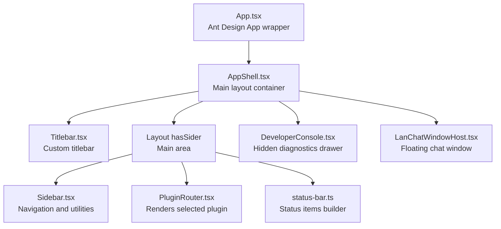
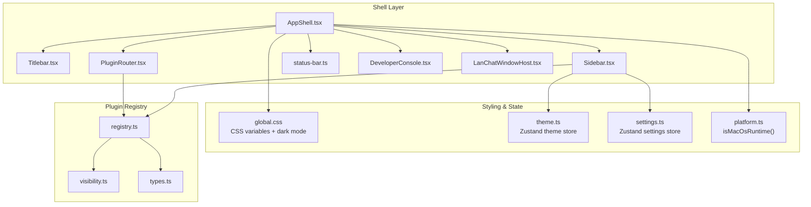
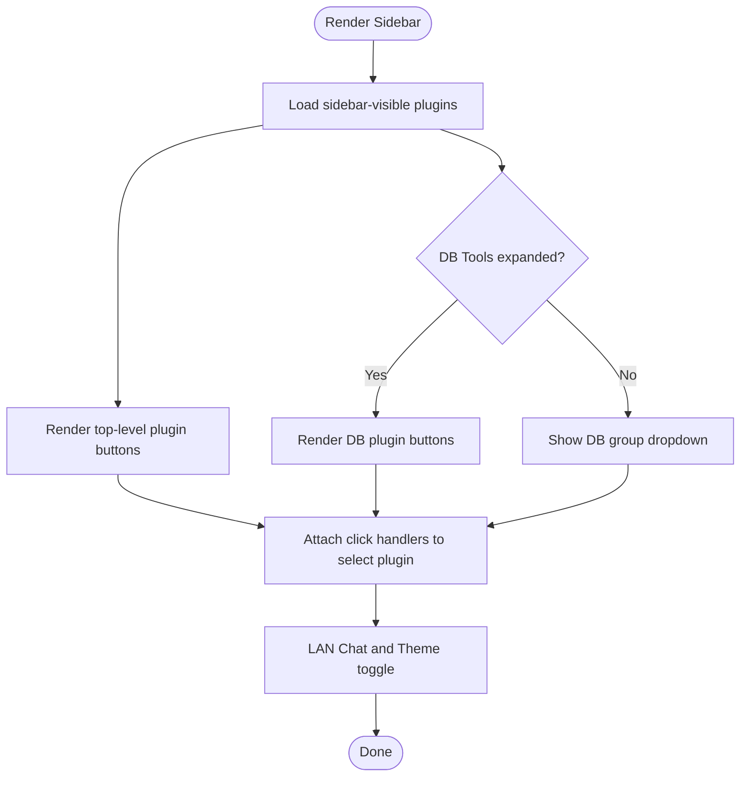
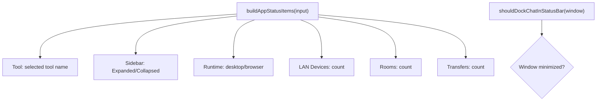
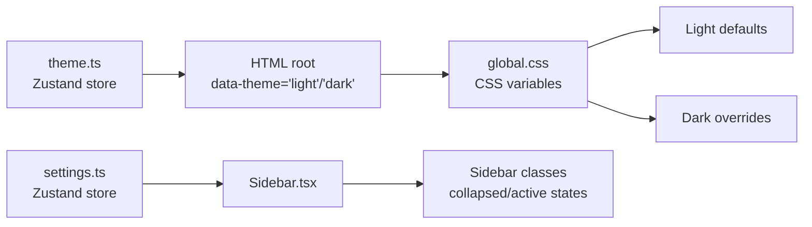
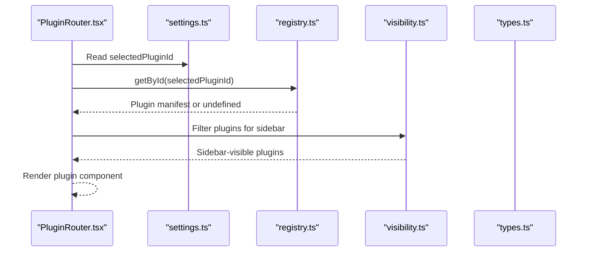
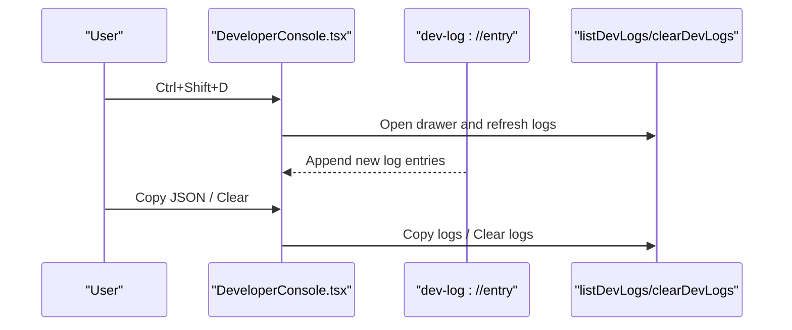
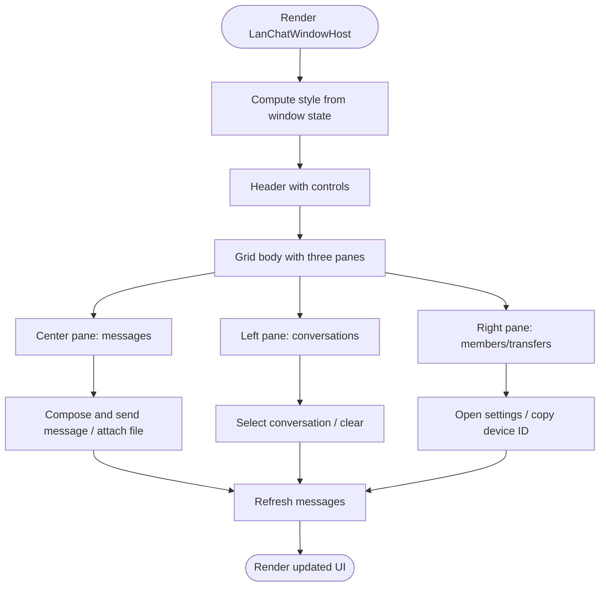
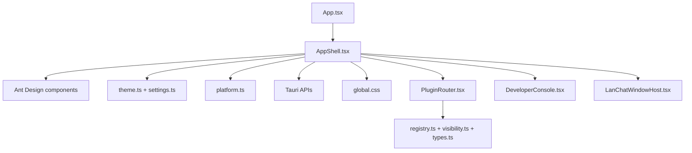

# Application Shell & UI Components

<cite>
**Referenced Files in This Document**
- [AppShell.tsx](file://src/app/layout/AppShell.tsx)
- [Sidebar.tsx](file://src/app/layout/Sidebar.tsx)
- [Titlebar.tsx](file://src/app/layout/Titlebar.tsx)
- [status-bar.ts](file://src/app/layout/status-bar.ts)
- [global.css](file://src/styles/global.css)
- [theme.ts](file://src/app/store/theme.ts)
- [settings.ts](file://src/app/store/settings.ts)
- [platform.ts](file://src/app/runtime/platform.ts)
- [App.tsx](file://src/App.tsx)
- [PluginRouter.tsx](file://src/app/plugin-registry/PluginRouter.tsx)
- [registry.ts](file://src/app/plugin-registry/registry.ts)
- [visibility.ts](file://src/app/plugin-registry/visibility.ts)
- [types.ts](file://src/app/plugin-registry/types.ts)
- [DeveloperConsole.tsx](file://src/app/developer-console/DeveloperConsole.tsx)
- [LanChatWindowHost.tsx](file://src/plugins/lan-chat/components/LanChatWindowHost.tsx)
</cite>

## Table of Contents
1. [Introduction](#introduction)
2. [Project Structure](#project-structure)
3. [Core Components](#core-components)
4. [Architecture Overview](#architecture-overview)
5. [Detailed Component Analysis](#detailed-component-analysis)
6. [Dependency Analysis](#dependency-analysis)
7. [Performance Considerations](#performance-considerations)
8. [Troubleshooting Guide](#troubleshooting-guide)
9. [Conclusion](#conclusion)
10. [Appendices](#appendices)

## Introduction
This document describes the DevNexus application shell and UI components. It explains the AppShell architecture, main container layout, sidebar navigation system, custom titlebar implementation, and status bar functionality. It also covers the component hierarchy, styling system using Ant Design, theme customization, responsive design considerations, accessibility features, cross-platform UI consistency, global styling architecture, and component composition strategies.

## Project Structure
DevNexus organizes the shell and UI under a clear layout module with dedicated components for the shell, sidebar, titlebar, status bar, and plugin routing. Global styles define a cohesive design system with light/dark themes. Stores manage persistent settings and theme state. The application bootstraps via a minimal wrapper that initializes Ant Design’s app context.



**Diagram sources**
- [App.tsx:1-11](file://src/App.tsx#L1-L11)
- [AppShell.tsx:31-206](file://src/app/layout/AppShell.tsx#L31-L206)
- [Titlebar.tsx:12-74](file://src/app/layout/Titlebar.tsx#L12-L74)
- [Sidebar.tsx:21-176](file://src/app/layout/Sidebar.tsx#L21-L176)
- [PluginRouter.tsx:7-28](file://src/app/plugin-registry/PluginRouter.tsx#L7-L28)
- [status-bar.ts:15-28](file://src/app/layout/status-bar.ts#L15-L28)
- [DeveloperConsole.tsx:10-131](file://src/app/developer-console/DeveloperConsole.tsx#L10-L131)
- [LanChatWindowHost.tsx:67-454](file://src/plugins/lan-chat/components/LanChatWindowHost.tsx#L67-L454)

**Section sources**
- [App.tsx:1-11](file://src/App.tsx#L1-L11)
- [AppShell.tsx:31-206](file://src/app/layout/AppShell.tsx#L31-L206)

## Core Components
- AppShell: Orchestrates the main layout, integrates the titlebar, sidebar, plugin content area, status bar, developer console, and LAN Chat window. Handles desktop resizing overlays, LAN Chat monitoring, and status bar composition.
- Sidebar: Provides collapsible navigation for plugins, grouped database tools, LAN Chat quick access, and theme toggle with tooltips and badges.
- Titlebar: Implements a custom draggable, resizable, and closable header for non-MacOS desktop environments using Tauri APIs.
- Status Bar: Builds runtime status items and determines whether the LAN Chat button should dock in the status bar.
- Global Styles: Defines CSS custom properties for theme tokens, layout sizing, and dark mode overrides.
- Stores: Persisted Zustand stores for theme mode and UI settings (sidebar state, selected plugin).
- Plugin Registry: Centralized plugin registration, retrieval, ordering, and visibility filtering for the sidebar.
- Developer Console: Hidden diagnostics drawer accessible via keyboard shortcut, displaying live logs from the backend.
- LAN Chat Window: Floating, resizable, draggable chat window with multi-pane layout, real-time messaging, and transfer management.

**Section sources**
- [AppShell.tsx:31-206](file://src/app/layout/AppShell.tsx#L31-L206)
- [Sidebar.tsx:21-176](file://src/app/layout/Sidebar.tsx#L21-L176)
- [Titlebar.tsx:12-74](file://src/app/layout/Titlebar.tsx#L12-L74)
- [status-bar.ts:15-28](file://src/app/layout/status-bar.ts#L15-L28)
- [global.css:1-973](file://src/styles/global.css#L1-L973)
- [theme.ts:12-26](file://src/app/store/theme.ts#L12-L26)
- [settings.ts:13-27](file://src/app/store/settings.ts#L13-L27)
- [PluginRouter.tsx:7-28](file://src/app/plugin-registry/PluginRouter.tsx#L7-L28)
- [registry.ts:3-25](file://src/app/plugin-registry/registry.ts#L3-L25)
- [visibility.ts:3-5](file://src/app/plugin-registry/visibility.ts#L3-L5)
- [types.ts:5-13](file://src/app/plugin-registry/types.ts#L5-L13)
- [DeveloperConsole.tsx:10-131](file://src/app/developer-console/DeveloperConsole.tsx#L10-L131)
- [LanChatWindowHost.tsx:67-454](file://src/plugins/lan-chat/components/LanChatWindowHost.tsx#L67-L454)

## Architecture Overview
The shell composes a responsive, cross-platform desktop UI with Ant Design components and custom CSS. The layout adapts to MacOS native titlebar vs. custom titlebar, supports window dragging and resizing, and integrates plugin-driven content areas. The theme system switches between light and dark modes via a data attribute applied to the document root.



**Diagram sources**
- [AppShell.tsx:31-206](file://src/app/layout/AppShell.tsx#L31-L206)
- [Titlebar.tsx:12-74](file://src/app/layout/Titlebar.tsx#L12-L74)
- [Sidebar.tsx:21-176](file://src/app/layout/Sidebar.tsx#L21-L176)
- [PluginRouter.tsx:7-28](file://src/app/plugin-registry/PluginRouter.tsx#L7-L28)
- [status-bar.ts:15-28](file://src/app/layout/status-bar.ts#L15-L28)
- [DeveloperConsole.tsx:10-131](file://src/app/developer-console/DeveloperConsole.tsx#L10-L131)
- [LanChatWindowHost.tsx:67-454](file://src/plugins/lan-chat/components/LanChatWindowHost.tsx#L67-L454)
- [global.css:1-973](file://src/styles/global.css#L1-L973)
- [theme.ts:12-26](file://src/app/store/theme.ts#L12-L26)
- [settings.ts:13-27](file://src/app/store/settings.ts#L13-L27)
- [platform.ts:1-10](file://src/app/runtime/platform.ts#L1-L10)
- [registry.ts:3-25](file://src/app/plugin-registry/registry.ts#L3-L25)
- [visibility.ts:3-5](file://src/app/plugin-registry/visibility.ts#L3-L5)
- [types.ts:5-13](file://src/app/plugin-registry/types.ts#L5-L13)

## Detailed Component Analysis

### AppShell: Main Container and Orchestration
AppShell wires together the shell’s primary regions and manages dynamic behavior:
- Desktop resizing overlays: eight directional resize handles positioned absolutely to enable window resizing.
- Custom titlebar integration: renders Titlebar when not on MacOS.
- Sidebar and plugin content: Sidebar and PluginRouter compose the main content area.
- Status bar: builds status items and conditionally shows a LAN Chat button when the chat window is minimized and docked.
- Developer console: renders a hidden drawer for diagnostics.
- LAN Chat monitoring: periodically refreshes LAN snapshot and tracks unread messages across conversations.

```mermaid
sequenceDiagram
participant Shell as "AppShell.tsx"
participant Title as "Titlebar.tsx"
participant Side as "Sidebar.tsx"
participant Router as "PluginRouter.tsx"
participant Status as "status-bar.ts"
participant Console as "DeveloperConsole.tsx"
participant Chat as "LanChatWindowHost.tsx"
Shell->>Title : Render custom titlebar (non-MacOS)
Shell->>Side : Render sidebar navigation
Shell->>Router : Render selected plugin component
Shell->>Status : Build status items
Shell->>Console : Render developer console drawer
Shell->>Chat : Render floating LAN Chat window
Shell->>Shell : Setup resize overlays and LAN monitor
```

**Diagram sources**
- [AppShell.tsx:31-206](file://src/app/layout/AppShell.tsx#L31-L206)
- [Titlebar.tsx:12-74](file://src/app/layout/Titlebar.tsx#L12-L74)
- [Sidebar.tsx:21-176](file://src/app/layout/Sidebar.tsx#L21-L176)
- [PluginRouter.tsx:7-28](file://src/app/plugin-registry/PluginRouter.tsx#L7-L28)
- [status-bar.ts:15-28](file://src/app/layout/status-bar.ts#L15-L28)
- [DeveloperConsole.tsx:10-131](file://src/app/developer-console/DeveloperConsole.tsx#L10-L131)
- [LanChatWindowHost.tsx:67-454](file://src/plugins/lan-chat/components/LanChatWindowHost.tsx#L67-L454)

**Section sources**
- [AppShell.tsx:31-206](file://src/app/layout/AppShell.tsx#L31-L206)

### Sidebar: Navigation and Utilities
Sidebar provides:
- Collapsible plugin groups with tooltips and badges.
- Dedicated “DB Tools” group with nested buttons for Redis, MongoDB, and MySQL clients.
- LAN Chat quick access with unread badge.
- Theme toggle with tooltip and label that adapts to collapsed state.
- Active selection highlighting and nested indentation for sub-items.



**Diagram sources**
- [Sidebar.tsx:21-176](file://src/app/layout/Sidebar.tsx#L21-L176)
- [visibility.ts:3-5](file://src/app/plugin-registry/visibility.ts#L3-L5)
- [registry.ts:13-21](file://src/app/plugin-registry/registry.ts#L13-L21)

**Section sources**
- [Sidebar.tsx:21-176](file://src/app/layout/Sidebar.tsx#L21-L176)

### Titlebar: Custom Window Controls
Titlebar provides:
- Draggable region that initiates window dragging and double-click toggles maximize.
- Minimize, maximize, and close buttons using Tauri window APIs.
- Hidden on MacOS via platform detection.

```mermaid
sequenceDiagram
participant User as "User"
participant Title as "Titlebar.tsx"
participant Tauri as "Tauri Window API"
User->>Title : Mouse down on drag region
Title->>Tauri : startDragging()
User->>Title : Double-click drag region
Title->>Tauri : toggleMaximize()
User->>Title : Click minimize/close
Title->>Tauri : minimize()/close()
```

**Diagram sources**
- [Titlebar.tsx:12-74](file://src/app/layout/Titlebar.tsx#L12-L74)
- [platform.ts:1-10](file://src/app/runtime/platform.ts#L1-L10)

**Section sources**
- [Titlebar.tsx:12-74](file://src/app/layout/Titlebar.tsx#L12-L74)

### Status Bar: Runtime Information
Status bar aggregates contextual information:
- Selected tool name, sidebar state, runtime type, and LAN metrics.
- Docking logic decides whether to show the LAN Chat button in the status bar.



**Diagram sources**
- [status-bar.ts:15-28](file://src/app/layout/status-bar.ts#L15-L28)

**Section sources**
- [status-bar.ts:15-28](file://src/app/layout/status-bar.ts#L15-L28)

### Global Styling and Theme System
Global CSS defines:
- CSS custom properties for theme tokens (backgrounds, borders, text).
- Layout classes for the shell, titlebar, sidebar, content, footer, and specialized plugin layouts.
- Dark mode overrides via a data attribute applied to the document root.
- LAN Chat window styles including draggable panes, presence indicators, and message bubbles.

Theme store:
- Maintains light/dark mode and persists it locally.
- Sidebar toggles theme and updates the data attribute.

Settings store:
- Persists sidebar collapse state, DB tools group collapse, and selected plugin ID.



**Diagram sources**
- [global.css:1-973](file://src/styles/global.css#L1-L973)
- [theme.ts:12-26](file://src/app/store/theme.ts#L12-L26)
- [settings.ts:13-27](file://src/app/store/settings.ts#L13-L27)
- [Sidebar.tsx:21-176](file://src/app/layout/Sidebar.tsx#L21-L176)

**Section sources**
- [global.css:1-973](file://src/styles/global.css#L1-L973)
- [theme.ts:12-26](file://src/app/store/theme.ts#L12-L26)
- [settings.ts:13-27](file://src/app/store/settings.ts#L13-L27)

### Plugin Registry and Routing
PluginRouter selects and renders the currently active plugin component. The registry maintains plugin manifests with ordering and visibility flags. Sidebar filters plugins for display.



**Diagram sources**
- [PluginRouter.tsx:7-28](file://src/app/plugin-registry/PluginRouter.tsx#L7-L28)
- [settings.ts:13-27](file://src/app/store/settings.ts#L13-L27)
- [registry.ts:3-25](file://src/app/plugin-registry/registry.ts#L3-L25)
- [visibility.ts:3-5](file://src/app/plugin-registry/visibility.ts#L3-L5)
- [types.ts:5-13](file://src/app/plugin-registry/types.ts#L5-L13)

**Section sources**
- [PluginRouter.tsx:7-28](file://src/app/plugin-registry/PluginRouter.tsx#L7-L28)
- [registry.ts:3-25](file://src/app/plugin-registry/registry.ts#L3-L25)
- [visibility.ts:3-5](file://src/app/plugin-registry/visibility.ts#L3-L5)
- [types.ts:5-13](file://src/app/plugin-registry/types.ts#L5-L13)

### Developer Console: Diagnostics Drawer
DeveloperConsole is a hidden drawer activated by a keyboard shortcut. It listens to live log events, lists entries, and supports copying and clearing logs.



**Diagram sources**
- [DeveloperConsole.tsx:10-131](file://src/app/developer-console/DeveloperConsole.tsx#L10-L131)

**Section sources**
- [DeveloperConsole.tsx:10-131](file://src/app/developer-console/DeveloperConsole.tsx#L10-L131)

### LAN Chat Window: Multi-Pane Floating UI
LanChatWindowHost renders a floating, resizable, draggable chat window with:
- Left pane: conversation list with unread badges.
- Center pane: messages with sender info and content previews (images, audio, video, files).
- Right pane: members list and transfer history.
- Resizable panes and window edges with smooth minimum size enforcement.
- Real-time updates, settings modal, and direct chat creation.



**Diagram sources**
- [LanChatWindowHost.tsx:67-454](file://src/plugins/lan-chat/components/LanChatWindowHost.tsx#L67-L454)

**Section sources**
- [LanChatWindowHost.tsx:67-454](file://src/plugins/lan-chat/components/LanChatWindowHost.tsx#L67-L454)

## Dependency Analysis
The shell depends on Ant Design for UI primitives, Zustand for state persistence, and Tauri for desktop window controls and events. The plugin system decouples navigation and content rendering. Global styles centralize theme tokens and layout rules.



**Diagram sources**
- [App.tsx:1-11](file://src/App.tsx#L1-L11)
- [AppShell.tsx:31-206](file://src/app/layout/AppShell.tsx#L31-L206)
- [theme.ts:12-26](file://src/app/store/theme.ts#L12-L26)
- [settings.ts:13-27](file://src/app/store/settings.ts#L13-L27)
- [platform.ts:1-10](file://src/app/runtime/platform.ts#L1-L10)
- [global.css:1-973](file://src/styles/global.css#L1-L973)
- [PluginRouter.tsx:7-28](file://src/app/plugin-registry/PluginRouter.tsx#L7-L28)
- [registry.ts:3-25](file://src/app/plugin-registry/registry.ts#L3-L25)
- [visibility.ts:3-5](file://src/app/plugin-registry/visibility.ts#L3-L5)
- [types.ts:5-13](file://src/app/plugin-registry/types.ts#L5-L13)
- [DeveloperConsole.tsx:10-131](file://src/app/developer-console/DeveloperConsole.tsx#L10-L131)
- [LanChatWindowHost.tsx:67-454](file://src/plugins/lan-chat/components/LanChatWindowHost.tsx#L67-L454)

**Section sources**
- [App.tsx:1-11](file://src/App.tsx#L1-L11)
- [AppShell.tsx:31-206](file://src/app/layout/AppShell.tsx#L31-L206)

## Performance Considerations
- Memoization: AppShell uses memoization for status items to avoid unnecessary re-renders.
- Efficient polling: LAN Chat monitors network snapshots and messages at intervals; timers are cleared on unmount.
- Minimal DOM: Edge overlays and resize handles are lightweight; CSS transforms and variables reduce layout thrash.
- Lazy rendering: Plugin content is rendered only when selected; developer console drawer is off-screen until opened.

[No sources needed since this section provides general guidance]

## Troubleshooting Guide
- Custom titlebar not visible on MacOS: Expected behavior; Titlebar is hidden on MacOS via platform detection.
- Sidebar not updating selections: Verify plugin registration and sidebar visibility flags; ensure selected plugin ID exists in the registry.
- LAN Chat window not opening: Confirm desktop runtime and that the window state is toggled open; check LAN Chat snapshot initialization.
- Theme not switching: Ensure the data attribute is applied to the root element and that the theme store persists correctly.
- Status bar items incorrect: Validate inputs passed to the status builder and confirm runtime detection.

**Section sources**
- [Titlebar.tsx:12-74](file://src/app/layout/Titlebar.tsx#L12-L74)
- [platform.ts:1-10](file://src/app/runtime/platform.ts#L1-L10)
- [registry.ts:3-25](file://src/app/plugin-registry/registry.ts#L3-L25)
- [LanChatWindowHost.tsx:67-454](file://src/plugins/lan-chat/components/LanChatWindowHost.tsx#L67-L454)
- [theme.ts:12-26](file://src/app/store/theme.ts#L12-L26)
- [status-bar.ts:15-28](file://src/app/layout/status-bar.ts#L15-L28)

## Conclusion
DevNexus’s shell and UI components form a cohesive, extensible desktop application built on Ant Design and Tauri. The AppShell orchestrates layout, navigation, status reporting, and auxiliary panels. Global CSS and a theme store provide consistent theming across light and dark modes. The plugin registry enables modular content composition, while the LAN Chat window demonstrates advanced multi-pane, draggable UI patterns. Accessibility and responsiveness are addressed through Ant Design components, CSS variables, and careful layout constraints.

[No sources needed since this section summarizes without analyzing specific files]

## Appendices

### Responsive Design Considerations
- Sidebar collapses to icons-only mode, adjusting button sizes and labels accordingly.
- Content area uses flexbox to fill available space with overflow handling.
- LAN Chat window enforces minimum sizes and supports edge resizing.

**Section sources**
- [Sidebar.tsx:21-176](file://src/app/layout/Sidebar.tsx#L21-L176)
- [global.css:858-890](file://src/styles/global.css#L858-L890)
- [LanChatWindowHost.tsx:38-454](file://src/plugins/lan-chat/components/LanChatWindowHost.tsx#L38-L454)

### Accessibility Features
- Tooltips for icon-only navigation.
- Keyboard shortcuts for developer console.
- Semantic roles for separators and buttons (e.g., aria-labels for resize handles).
- Proper contrast in light/dark modes via CSS variables.

**Section sources**
- [Sidebar.tsx:70-76](file://src/app/layout/Sidebar.tsx#L70-L76)
- [DeveloperConsole.tsx:25-33](file://src/app/developer-console/DeveloperConsole.tsx#L25-L33)
- [LanChatWindowHost.tsx:442-442](file://src/plugins/lan-chat/components/LanChatWindowHost.tsx#L442-L442)
- [global.css:892-972](file://src/styles/global.css#L892-L972)

### Cross-Platform UI Consistency
- MacOS uses native titlebar; other platforms use custom titlebar with window controls.
- Sidebar and layout adapt to collapsed state and screen size.
- Theme tokens unify appearance across platforms.

**Section sources**
- [Titlebar.tsx:12-74](file://src/app/layout/Titlebar.tsx#L12-L74)
- [platform.ts:1-10](file://src/app/runtime/platform.ts#L1-L10)
- [Sidebar.tsx:98-101](file://src/app/layout/Sidebar.tsx#L98-L101)
- [global.css:1-17](file://src/styles/global.css#L1-L17)

### Component Composition Strategies
- Shell composes child components declaratively; each component manages its own internal state and effects.
- PluginRouter delegates rendering to plugin manifests, enabling dynamic composition.
- Global styles and theme store provide shared styling primitives.

**Section sources**
- [AppShell.tsx:147-205](file://src/app/layout/AppShell.tsx#L147-L205)
- [PluginRouter.tsx:7-28](file://src/app/plugin-registry/PluginRouter.tsx#L7-L28)
- [global.css:36-101](file://src/styles/global.css#L36-L101)