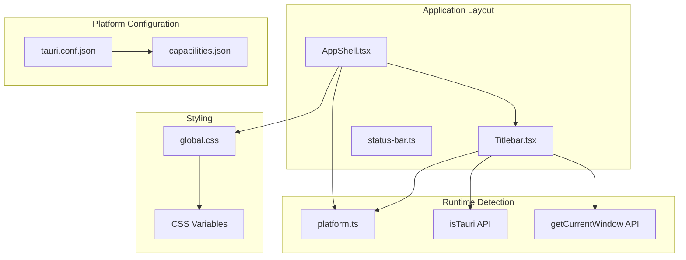
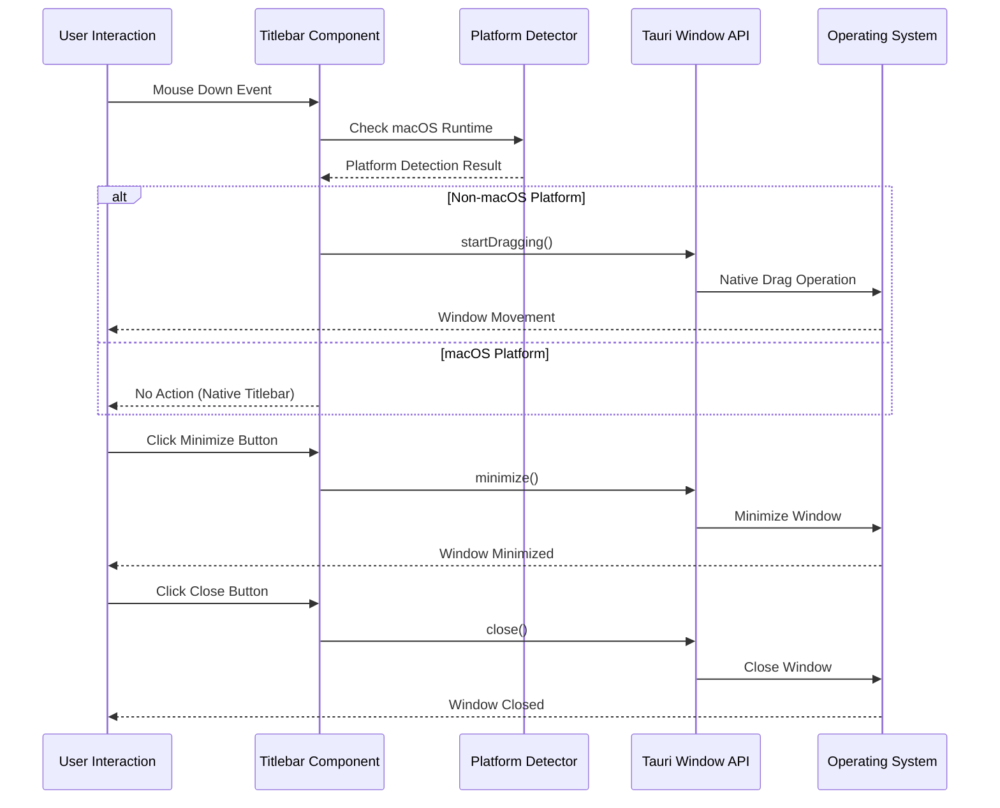
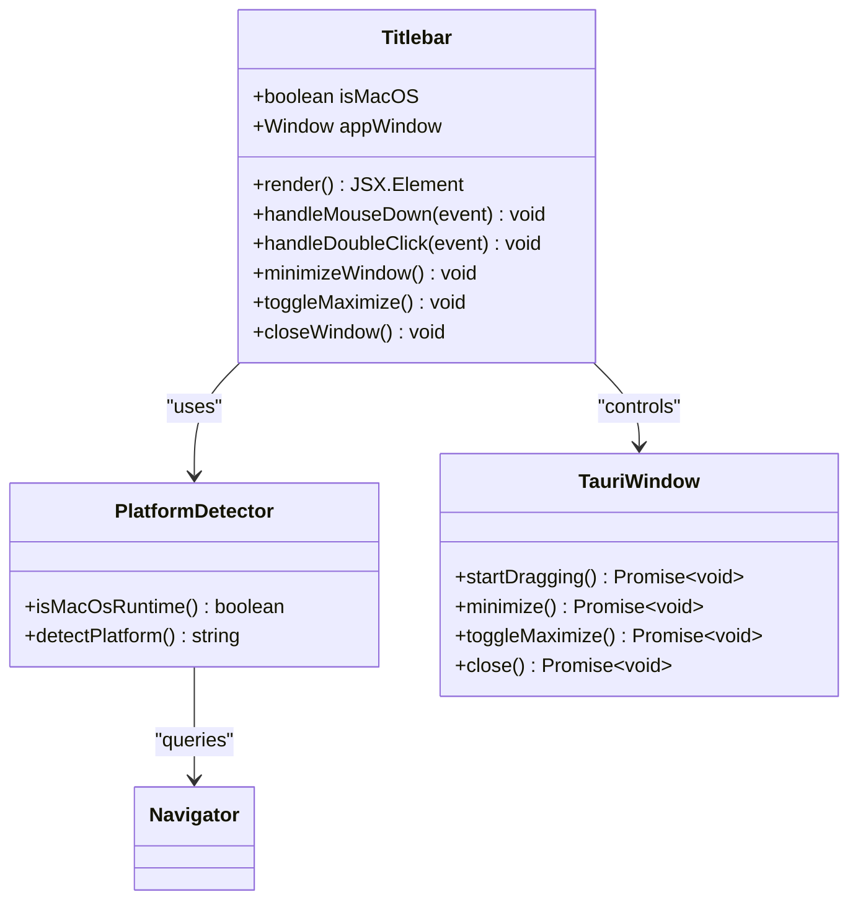
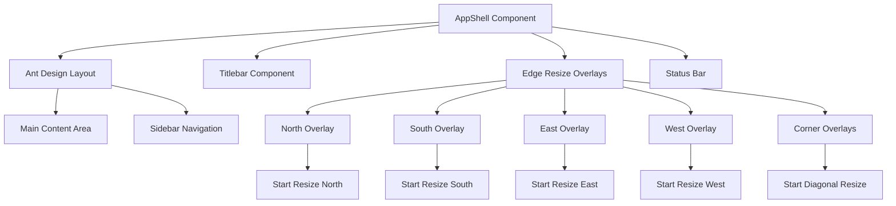
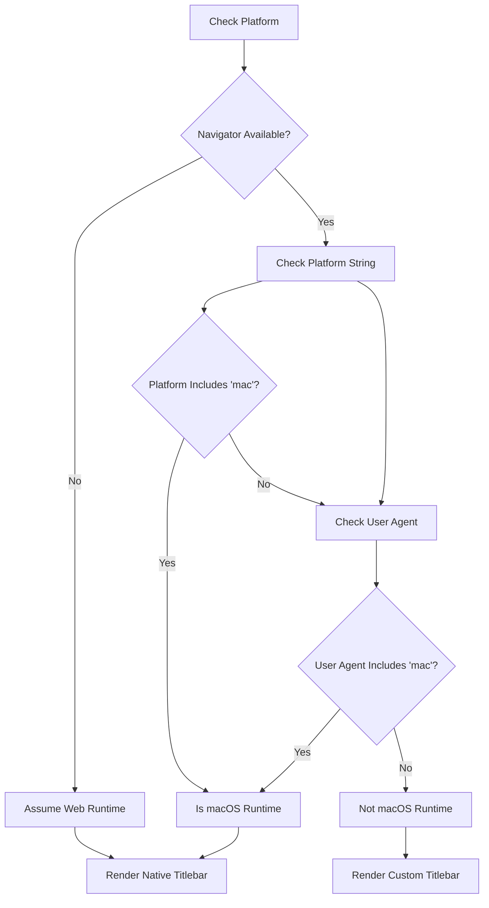
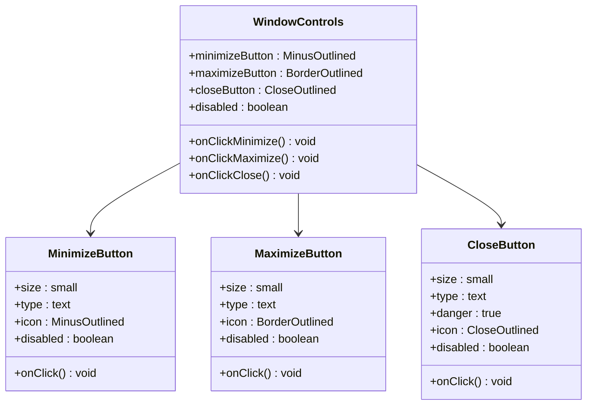
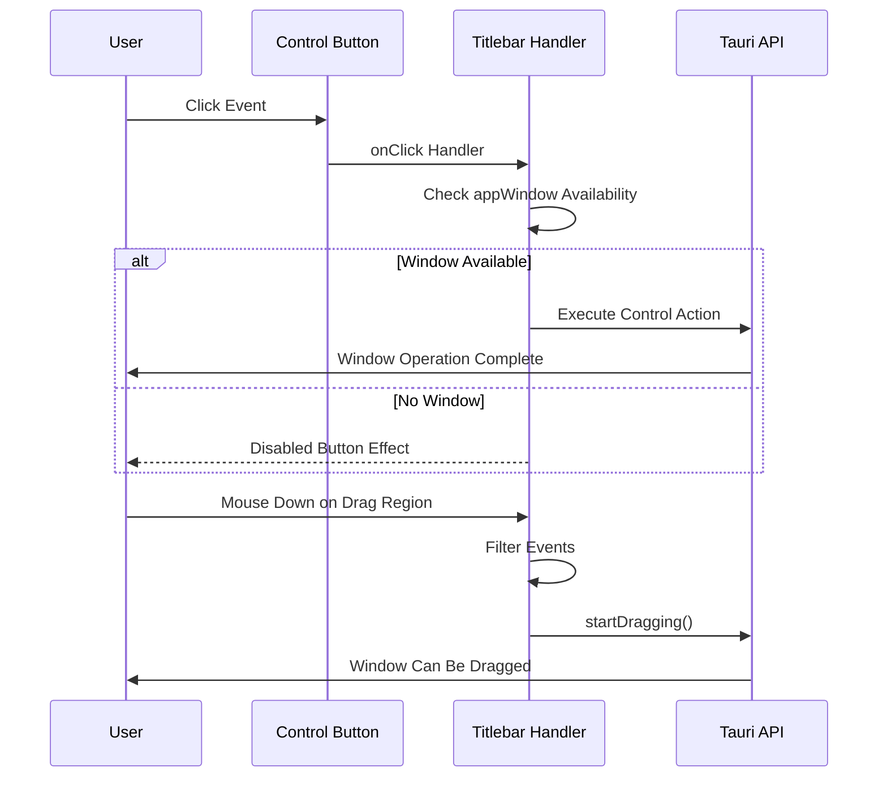
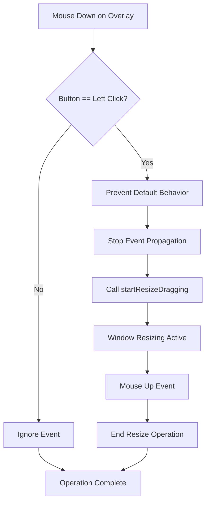
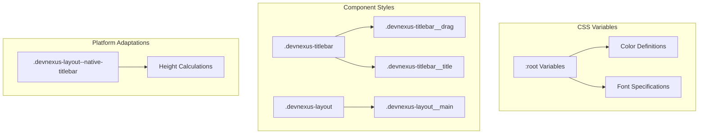
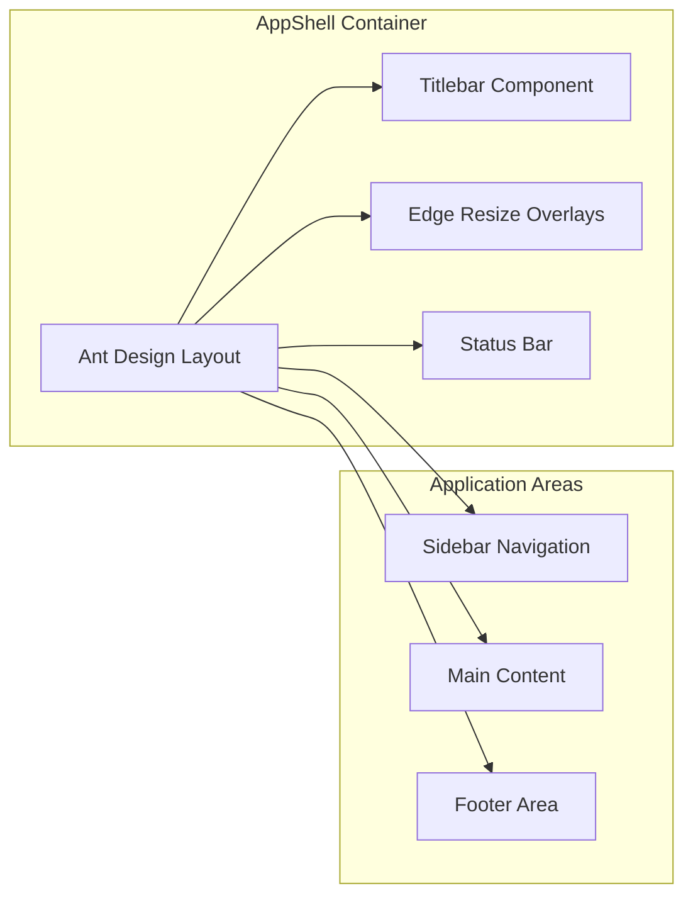

# Custom Titlebar System

<cite>
**Referenced Files in This Document**
- [Titlebar.tsx](file://src/app/layout/Titlebar.tsx)
- [AppShell.tsx](file://src/app/layout/AppShell.tsx)
- [platform.ts](file://src/app/runtime/platform.ts)
- [global.css](file://src/styles/global.css)
- [tauri.conf.json](file://src-tauri/tauri.conf.json)
- [capabilities.json](file://src-tauri/gen/schemas/capabilities.json)
- [status-bar.ts](file://src/app/layout/status-bar.ts)
</cite>

## Table of Contents
1. [Introduction](#introduction)
2. [Project Structure](#project-structure)
3. [Core Components](#core-components)
4. [Architecture Overview](#architecture-overview)
5. [Detailed Component Analysis](#detailed-component-analysis)
6. [Cross-Platform Compatibility](#cross-platform-compatibility)
7. [Window Control Implementation](#window-control-implementation)
8. [Window Resizing System](#window-resizing-system)
9. [Styling and Branding](#styling-and-branding)
10. [Integration with Application Shell](#integration-with-application-shell)
11. [Performance Considerations](#performance-considerations)
12. [Troubleshooting Guide](#troubleshooting-guide)
13. [Conclusion](#conclusion)

## Introduction

The Custom Titlebar System is a React-based implementation that provides native-like window controls and drag functionality for desktop applications built with Tauri. This system replaces the default operating system titlebar with a custom-designed header that maintains cross-platform compatibility while preserving the familiar window control buttons (minimize, maximize/close) and drag-to-move functionality.

The system is designed to work seamlessly across Windows, macOS, and Linux platforms, with platform-specific optimizations and behavioral adaptations. It integrates deeply with the application's shell architecture and provides a cohesive user experience that matches modern desktop application standards.

## Project Structure

The Custom Titlebar System is organized within the application's layout architecture, with clear separation of concerns between platform detection, window control logic, and styling components.

**Diagram sources**
- [AppShell.tsx:1-207](file://src/app/layout/AppShell.tsx#L1-L207)
- [Titlebar.tsx:1-75](file://src/app/layout/Titlebar.tsx#L1-L75)
- [platform.ts:1-10](file://src/app/runtime/platform.ts#L1-L10)

**Section sources**
- [AppShell.tsx:1-207](file://src/app/layout/AppShell.tsx#L1-L207)
- [Titlebar.tsx:1-75](file://src/app/layout/Titlebar.tsx#L1-L75)
- [platform.ts:1-10](file://src/app/runtime/platform.ts#L1-L10)

## Core Components

The Custom Titlebar System consists of three primary components that work together to provide a seamless cross-platform window management experience:

### Titlebar Component
The main titlebar component handles window controls, drag operations, and platform-specific rendering logic. It conditionally renders only on non-macOS platforms and manages all window control interactions through Tauri's window API.

### AppShell Integration
The application shell serves as the container component that orchestrates the titlebar placement, manages window resizing overlays, and coordinates with the broader application layout system.

### Platform Detection System
A dedicated platform detection module that accurately identifies macOS runtime environments and adapts the UI accordingly, ensuring optimal user experience across different operating systems.

**Section sources**
- [Titlebar.tsx:12-74](file://src/app/layout/Titlebar.tsx#L12-L74)
- [AppShell.tsx:31-206](file://src/app/layout/AppShell.tsx#L31-L206)
- [platform.ts:1-10](file://src/app/runtime/platform.ts#L1-L10)

## Architecture Overview

The Custom Titlebar System follows a layered architecture pattern that separates platform detection, window management, and presentation concerns.

**Diagram sources**
- [Titlebar.tsx:24-44](file://src/app/layout/Titlebar.tsx#L24-L44)
- [platform.ts:13-15](file://src/app/runtime/platform.ts#L13-L15)
- [AppShell.tsx:40-42](file://src/app/layout/AppShell.tsx#L40-L42)

The architecture ensures that window operations are handled through the Tauri window API, providing consistent behavior across different platforms while maintaining native performance characteristics.

## Detailed Component Analysis

### Titlebar Component Implementation

The Titlebar component is implemented as a React functional component that encapsulates all window control functionality and drag operations.

**Diagram sources**
- [Titlebar.tsx:12-74](file://src/app/layout/Titlebar.tsx#L12-L74)
- [platform.ts:1-10](file://src/app/runtime/platform.ts#L1-L10)

The component implements several key features:

1. **Conditional Rendering**: Automatically hides on macOS platforms to utilize native titlebars
2. **Event Filtering**: Prevents drag operations when clicking buttons or during double-clicks
3. **Platform-Specific Logic**: Adapts behavior based on detected runtime environment

**Section sources**
- [Titlebar.tsx:12-74](file://src/app/layout/Titlebar.tsx#L12-L74)

### AppShell Integration Layer

The AppShell component serves as the container that manages the overall application layout while coordinating with the titlebar system.

**Diagram sources**
- [AppShell.tsx:147-205](file://src/app/layout/AppShell.tsx#L147-L205)

The AppShell manages multiple overlay regions for window resizing, each configured with specific cursor styles and resize directions.

**Section sources**
- [AppShell.tsx:94-145](file://src/app/layout/AppShell.tsx#L94-L145)

## Cross-Platform Compatibility

The system implements sophisticated platform detection and adaptation mechanisms to ensure optimal user experience across different operating systems.

### Platform Detection Logic

The platform detection system uses multiple approaches to accurately identify the runtime environment:

**Diagram sources**
- [platform.ts:1-10](file://src/app/runtime/platform.ts#L1-L10)

### Platform-Specific Rendering Differences

The system adapts its rendering strategy based on the detected platform:

| Platform | Titlebar Rendering | Native Controls | Custom Controls |
|----------|-------------------|-----------------|-----------------|
| macOS | Native titlebar only | System-provided | None |
| Windows | Custom titlebar | Limited | Full control buttons |
| Linux | Custom titlebar | Basic | Full control buttons |

**Section sources**
- [platform.ts:13-15](file://src/app/runtime/platform.ts#L13-L15)
- [Titlebar.tsx:13-15](file://src/app/layout/Titlebar.tsx#L13-L15)

## Window Control Implementation

The window control system provides comprehensive functionality for managing application windows through intuitive button interactions.

### Window Control Buttons

Each window control button is implemented with specific behavior and accessibility considerations:

**Diagram sources**
- [Titlebar.tsx:48-71](file://src/app/layout/Titlebar.tsx#L48-L71)

### Event Handling and User Interactions

The window control system implements sophisticated event handling to prevent conflicts and ensure smooth user interactions:

**Diagram sources**
- [Titlebar.tsx:24-44](file://src/app/layout/Titlebar.tsx#L24-L44)
- [Titlebar.tsx:54-69](file://src/app/layout/Titlebar.tsx#L54-L69)

**Section sources**
- [Titlebar.tsx:48-71](file://src/app/layout/Titlebar.tsx#L48-L71)

## Window Resizing System

The window resizing system provides precise control over application window dimensions through strategically placed overlay regions that trigger native resize operations.

### Edge Overlay System

The resizing system implements eight distinct overlay regions, each designed for specific resize directions:

| Overlay | Direction | Cursor Style | Purpose |
|---------|-----------|--------------|---------|
| Top | North | ns-resize | Resize window height upward |
| Bottom | South | ns-resize | Resize window height downward |
| Left | West | ew-resize | Resize window width leftward |
| Right | East | ew-resize | Resize window width rightward |
| NW | NorthWest | nwse-resize | Resize diagonally (up-left) |
| NE | NorthEast | nesw-resize | Resize diagonally (up-right) |
| SE | SouthEast | nwse-resize | Resize diagonally (down-right) |
| SW | SouthWest | nesw-resize | Resize diagonally (down-left) |

### Resize Operation Flow

**Diagram sources**
- [AppShell.tsx:158-167](file://src/app/layout/AppShell.tsx#L158-L167)

**Section sources**
- [AppShell.tsx:94-145](file://src/app/layout/AppShell.tsx#L94-L145)
- [AppShell.tsx:147-205](file://src/app/layout/AppShell.tsx#L147-L205)

## Styling and Branding

The Custom Titlebar System implements a comprehensive styling framework that ensures consistent visual presentation across all supported platforms while maintaining brand identity.

### CSS Architecture

The styling system utilizes CSS custom properties and modular class structures:

**Diagram sources**
- [global.css:1-17](file://src/styles/global.css#L1-L17)
- [global.css:43-74](file://src/styles/global.css#L43-L74)

### Branding Elements

The system incorporates brand identity through:

1. **Consistent Color Scheme**: Defined through CSS custom properties
2. **Typography Standards**: Specific font families and weights
3. **Visual Hierarchy**: Clear distinction between titlebar and content areas
4. **Platform-Specific Adaptations**: Maintains brand consistency while respecting platform conventions

**Section sources**
- [global.css:43-74](file://src/styles/global.css#L43-L74)
- [global.css:1-17](file://src/styles/global.css#L1-L17)

## Integration with Application Shell

The Custom Titlebar System integrates seamlessly with the broader application architecture through the AppShell component, which serves as the central coordinator for all layout-related functionality.

### Layout Coordination

The AppShell manages the relationship between the titlebar and other application components:

**Diagram sources**
- [AppShell.tsx:147-205](file://src/app/layout/AppShell.tsx#L147-L205)

### Status Integration

The titlebar system works in conjunction with the status bar to provide comprehensive application state information:

| Status Item | Purpose | Display Format |
|-------------|---------|----------------|
| Tool Name | Current active plugin/tool | Text value |
| Sidebar State | Collapsed/Expanded state | Text indicator |
| Runtime Type | Desktop/Browser mode | Text indicator |
| LAN Devices | Network device count | Numeric value |
| Room Count | Conversation room count | Numeric value |
| Transfer Count | File transfer count | Numeric value |

**Section sources**
- [AppShell.tsx:45-56](file://src/app/layout/AppShell.tsx#L45-L56)
- [status-bar.ts:15-24](file://src/app/layout/status-bar.ts#L15-L24)

## Performance Considerations

The Custom Titlebar System is designed with performance optimization in mind, implementing several strategies to ensure smooth operation across different platforms and hardware configurations.

### Event Optimization

The system implements efficient event handling through:

1. **Event Delegation**: Centralized event handlers reduce memory overhead
2. **Conditional Rendering**: Components only render when necessary
3. **Memoization**: Status items are computed efficiently using useMemo
4. **Early Returns**: Platform checks prevent unnecessary computations

### Memory Management

Key performance considerations include:

- **Lazy Loading**: Window controls are only initialized when needed
- **Cleanup Functions**: Proper cleanup of event listeners and intervals
- **Minimal DOM Manipulation**: Efficient class switching and property updates
- **Resource Pooling**: Reusable overlay components avoid redundant allocations

### Platform-Specific Optimizations

The system adapts performance characteristics based on platform capabilities:

- **macOS**: Leverages native titlebar for optimal performance
- **Windows/Linux**: Implements efficient custom rendering with minimal overhead
- **Hardware Acceleration**: Utilizes browser capabilities for smooth animations

## Troubleshooting Guide

Common issues and their solutions when working with the Custom Titlebar System:

### Platform Detection Issues

**Problem**: Titlebar not displaying on expected platforms
**Solution**: Verify platform detection logic and ensure proper navigator availability

**Problem**: Incorrect platform identification
**Solution**: Check both platform string and user agent detection methods

### Window Control Problems

**Problem**: Window controls not responding
**Solution**: Verify Tauri window API availability and capability permissions

**Problem**: Drag operations conflicting with button clicks
**Solution**: Ensure proper event filtering and target element checking

### Styling Issues

**Problem**: Titlebar not appearing styled correctly
**Solution**: Verify CSS class names and custom property definitions

**Problem**: Platform-specific styling not applied
**Solution**: Check layout class modifications and height calculations

### Performance Issues

**Problem**: Slow response to user interactions
**Solution**: Review event handler implementations and consider memoization

**Problem**: Memory leaks in long-running sessions
**Solution**: Ensure proper cleanup of event listeners and intervals

**Section sources**
- [platform.ts:1-10](file://src/app/runtime/platform.ts#L1-L10)
- [Titlebar.tsx:24-44](file://src/app/layout/Titlebar.tsx#L24-L44)
- [global.css:43-74](file://src/styles/global.css#L43-L74)

## Conclusion

The Custom Titlebar System represents a sophisticated implementation of cross-platform window management that successfully balances native performance with custom design flexibility. Through careful platform detection, efficient event handling, and comprehensive styling support, the system provides a seamless user experience across Windows, macOS, and Linux platforms.

Key achievements of the implementation include:

- **Cross-Platform Compatibility**: Sophisticated platform detection ensures optimal behavior on all supported operating systems
- **Performance Optimization**: Efficient event handling and resource management maintain smooth operation
- **Design Flexibility**: Comprehensive styling system allows for extensive customization while maintaining brand consistency
- **Integration Excellence**: Seamless coordination with the broader application architecture through the AppShell component

The system serves as a foundation for modern desktop application development, providing developers with a robust framework for creating native-like experiences while leveraging the power of web technologies. Its modular design and clear separation of concerns make it easily maintainable and extensible for future enhancements.