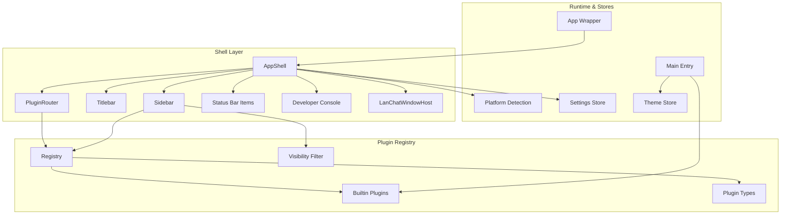
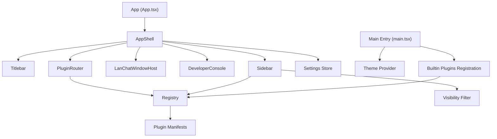
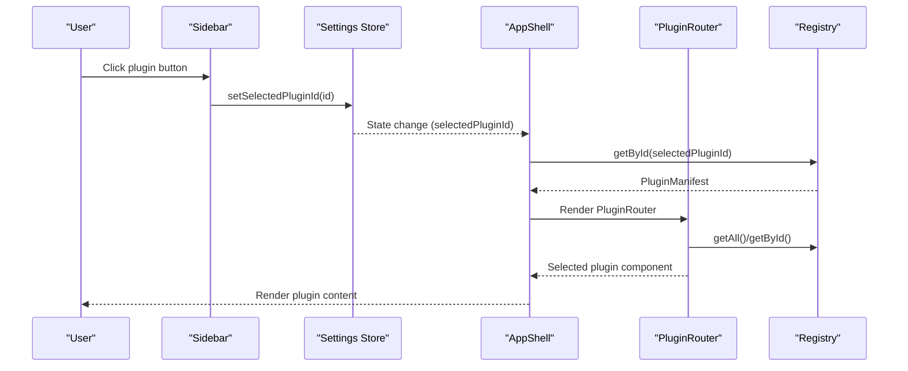
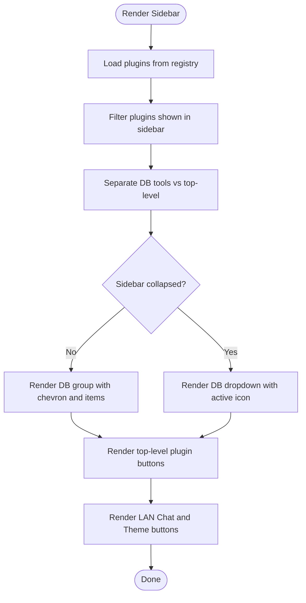
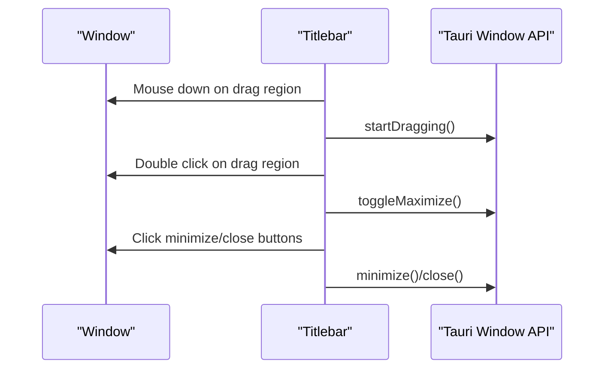
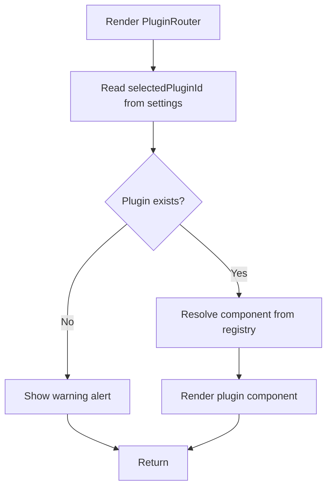
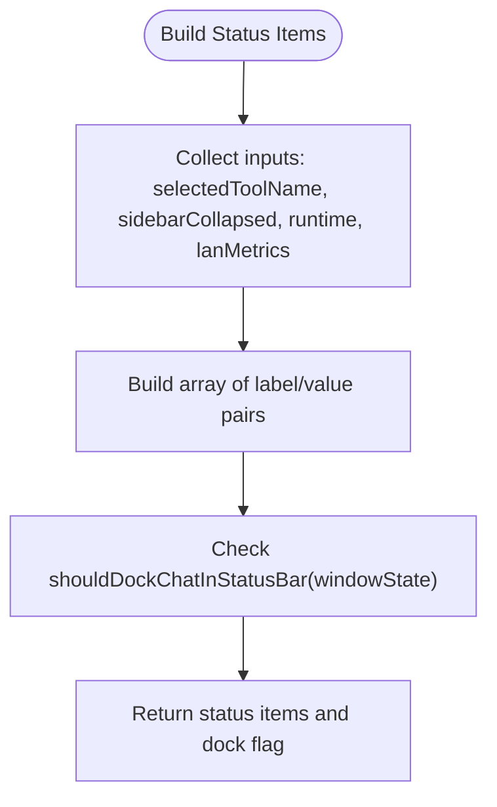
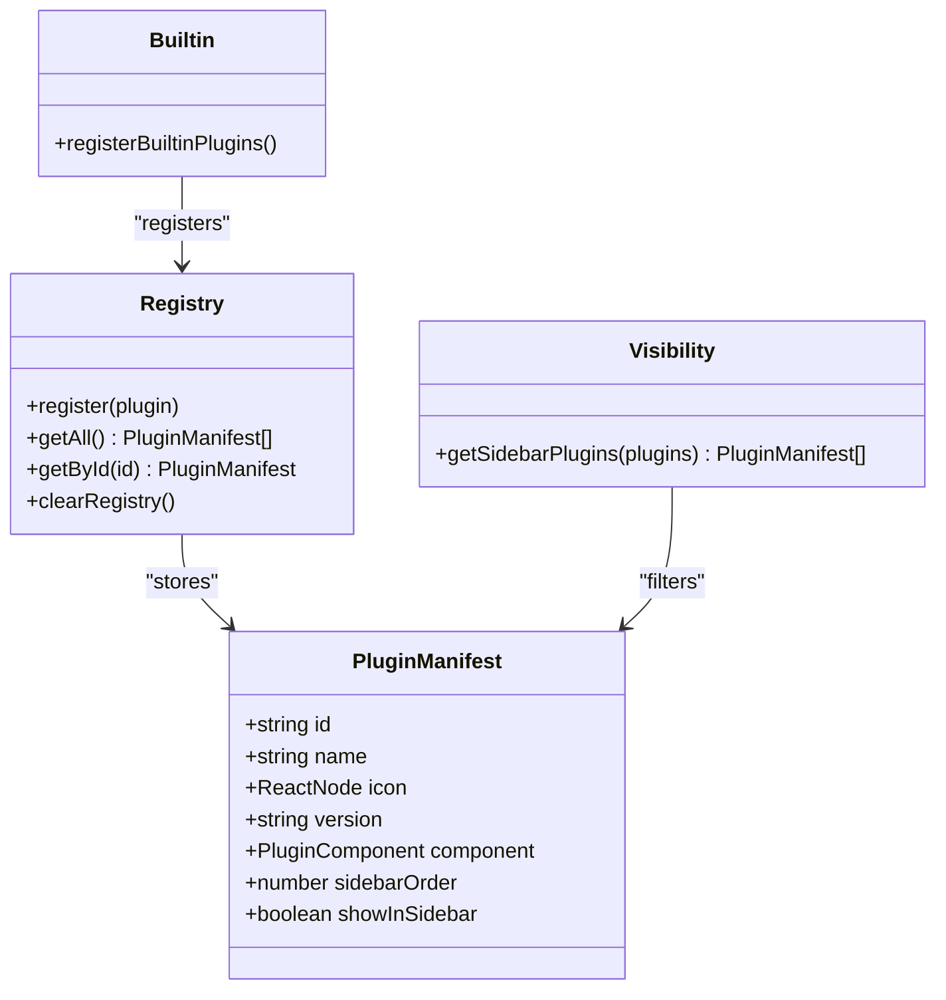
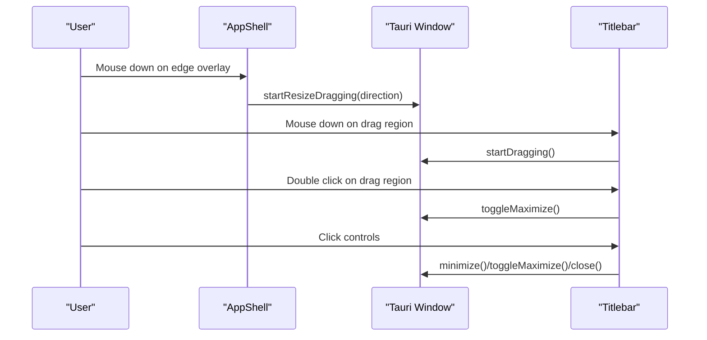
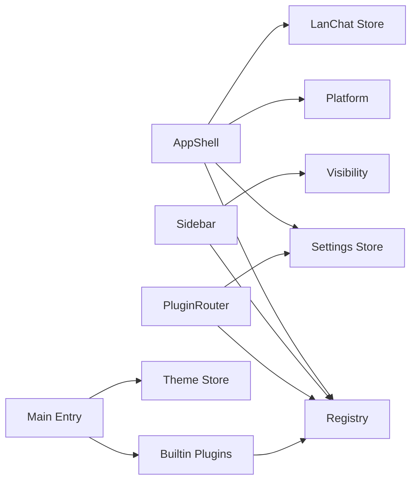

# Application Shell Design

<cite>
**Referenced Files in This Document**
- [AppShell.tsx](file://src/app/layout/AppShell.tsx)
- [Sidebar.tsx](file://src/app/layout/Sidebar.tsx)
- [Titlebar.tsx](file://src/app/layout/Titlebar.tsx)
- [status-bar.ts](file://src/app/layout/status-bar.ts)
- [PluginRouter.tsx](file://src/app/plugin-registry/PluginRouter.tsx)
- [registry.ts](file://src/app/plugin-registry/registry.ts)
- [visibility.ts](file://src/app/plugin-registry/visibility.ts)
- [builtin.ts](file://src/app/plugin-registry/builtin.ts)
- [types.ts](file://src/app/plugin-registry/types.ts)
- [platform.ts](file://src/app/runtime/platform.ts)
- [settings.ts](file://src/app/store/settings.ts)
- [theme.ts](file://src/app/store/theme.ts)
- [main.tsx](file://src/main.tsx)
- [App.tsx](file://src/App.tsx)
- [LanChatWindowHost.tsx](file://src/plugins/lan-chat/components/LanChatWindowHost.tsx)
- [DeveloperConsole.tsx](file://src/app/developer-console/DeveloperConsole.tsx)
- [redis-manager/index.tsx](file://src/plugins/redis-manager/index.tsx)
</cite>

## Table of Contents
1. [Introduction](#introduction)
2. [Project Structure](#project-structure)
3. [Core Components](#core-components)
4. [Architecture Overview](#architecture-overview)
5. [Detailed Component Analysis](#detailed-component-analysis)
6. [Dependency Analysis](#dependency-analysis)
7. [Performance Considerations](#performance-considerations)
8. [Troubleshooting Guide](#troubleshooting-guide)
9. [Conclusion](#conclusion)

## Introduction
This document describes the DevNexus application shell design, focusing on the main container layout that wraps all plugins with consistent UI elements. The shell manages plugin routing, maintains application-wide state, and provides cross-plugin navigation. It also documents responsive design patterns for different screen sizes and operating systems, cross-platform window management integration, and the coordination between the shell and the plugin system.

## Project Structure
The shell architecture centers around a primary layout container that orchestrates the sidebar, titlebar, plugin content area, and status bar. The plugin system is registry-driven, enabling dynamic activation and navigation between plugins. Supporting components include a developer console and a LAN chat overlay window.

**Diagram sources**
- [AppShell.tsx:1-207](file://src/app/layout/AppShell.tsx#L1-L207)
- [Sidebar.tsx:1-177](file://src/app/layout/Sidebar.tsx#L1-L177)
- [Titlebar.tsx:1-75](file://src/app/layout/Titlebar.tsx#L1-L75)
- [status-bar.ts:1-29](file://src/app/layout/status-bar.ts#L1-L29)
- [PluginRouter.tsx:1-29](file://src/app/plugin-registry/PluginRouter.tsx#L1-L29)
- [registry.ts:1-26](file://src/app/plugin-registry/registry.ts#L1-L26)
- [visibility.ts:1-6](file://src/app/plugin-registry/visibility.ts#L1-L6)
- [builtin.ts:1-31](file://src/app/plugin-registry/builtin.ts#L1-L31)
- [types.ts:1-14](file://src/app/plugin-registry/types.ts#L1-L14)
- [platform.ts:1-10](file://src/app/runtime/platform.ts#L1-L10)
- [settings.ts:1-28](file://src/app/store/settings.ts#L1-L28)
- [theme.ts](file://src/app/store/theme.ts)
- [main.tsx:1-38](file://src/main.tsx#L1-L38)
- [App.tsx:1-11](file://src/App.tsx#L1-L11)

**Section sources**
- [AppShell.tsx:1-207](file://src/app/layout/AppShell.tsx#L1-L207)
- [main.tsx:1-38](file://src/main.tsx#L1-L38)
- [App.tsx:1-11](file://src/App.tsx#L1-L11)

## Core Components
- AppShell: The primary layout container that composes the titlebar, sidebar, plugin router, status bar, developer console, and LAN chat overlay. It manages cross-plugin navigation via the settings store and builds status bar items dynamically.
- Sidebar: Provides plugin selection, grouped database tools, theme toggle, and LAN chat access. It reads plugin manifests from the registry and filters them for sidebar visibility.
- Titlebar: Implements custom window controls and drag region for non-macOS desktop environments using Tauri APIs.
- PluginRouter: Renders the currently selected plugin component based on the settings store and registry lookup.
- Status Bar Utilities: Build status items and determine whether the LAN chat window should be docked in the status bar.
- Plugin Registry: Central registry for plugin manifests with registration, retrieval, and ordering mechanisms.
- Runtime Platform: Detects macOS runtime to conditionally render native titlebar.
- Settings Store: Maintains application-wide state such as sidebar collapse state, selected plugin, and database tools collapse state.
- Theme Store: Manages light/dark theme mode and applies Ant Design theme algorithms.
- Developer Console: Hidden diagnostic drawer accessible via keyboard shortcut, listening to developer log events.
- LAN Chat Overlay: A draggable, resizable floating window hosting chat UI, with docking behavior when minimized.

**Section sources**
- [AppShell.tsx:31-207](file://src/app/layout/AppShell.tsx#L31-L207)
- [Sidebar.tsx:21-177](file://src/app/layout/Sidebar.tsx#L21-L177)
- [Titlebar.tsx:12-75](file://src/app/layout/Titlebar.tsx#L12-L75)
- [PluginRouter.tsx:7-29](file://src/app/plugin-registry/PluginRouter.tsx#L7-L29)
- [status-bar.ts:15-29](file://src/app/layout/status-bar.ts#L15-L29)
- [registry.ts:3-26](file://src/app/plugin-registry/registry.ts#L3-L26)
- [platform.ts:1-10](file://src/app/runtime/platform.ts#L1-L10)
- [settings.ts:13-28](file://src/app/store/settings.ts#L13-L28)
- [theme.ts](file://src/app/store/theme.ts)
- [DeveloperConsole.tsx:10-132](file://src/app/developer-console/DeveloperConsole.tsx#L10-L132)
- [LanChatWindowHost.tsx:67-455](file://src/plugins/lan-chat/components/LanChatWindowHost.tsx#L67-L455)

## Architecture Overview
The shell follows a layered architecture:
- Presentation Layer: AppShell, Sidebar, Titlebar, Status Bar, Developer Console, LAN Chat Overlay.
- Routing Layer: PluginRouter selects the active plugin component.
- State Management: Settings store persists and exposes application-wide state; Theme store applies UI themes.
- Plugin System: Registry stores plugin manifests; Visibility filter controls sidebar rendering; Built-in plugins register at startup.
- Runtime Integration: Platform detection and Tauri window APIs enable native window controls and drag regions.

**Diagram sources**
- [App.tsx:4-10](file://src/App.tsx#L4-L10)
- [AppShell.tsx:168-205](file://src/app/layout/AppShell.tsx#L168-L205)
- [Titlebar.tsx:20-72](file://src/app/layout/Titlebar.tsx#L20-L72)
- [Sidebar.tsx:79-174](file://src/app/layout/Sidebar.tsx#L79-L174)
- [LanChatWindowHost.tsx:388-453](file://src/plugins/lan-chat/components/LanChatWindowHost.tsx#L388-L453)
- [DeveloperConsole.tsx:65-131](file://src/app/developer-console/DeveloperConsole.tsx#L65-L131)
- [PluginRouter.tsx:7-28](file://src/app/plugin-registry/PluginRouter.tsx#L7-L28)
- [registry.ts:13-21](file://src/app/plugin-registry/registry.ts#L13-L21)
- [visibility.ts:3-5](file://src/app/plugin-registry/visibility.ts#L3-L5)
- [types.ts:5-13](file://src/app/plugin-registry/types.ts#L5-L13)
- [settings.ts:13-27](file://src/app/store/settings.ts#L13-L27)
- [main.tsx:12-31](file://src/main.tsx#L12-L31)
- [builtin.ts:14-29](file://src/app/plugin-registry/builtin.ts#L14-L29)

## Detailed Component Analysis

### AppShell Component
AppShell orchestrates the entire shell layout:
- Layout composition: Titlebar, collapsible sidebar, LAN chat overlay, developer console, plugin content area, and status bar footer.
- Cross-plugin navigation: Reads selected plugin ID from the settings store and resolves the component via the registry.
- Status bar integration: Builds status items reflecting selected tool, sidebar state, runtime, and LAN chat metrics.
- Desktop window controls: Adds resize edge overlays for non-native titlebar environments and integrates Tauri window APIs for dragging and resizing.
- LAN chat integration: Monitors LAN chat snapshots and updates unread counts; conditionally docks chat in the status bar.

**Diagram sources**
- [Sidebar.tsx:50-77](file://src/app/layout/Sidebar.tsx#L50-L77)
- [settings.ts:13-27](file://src/app/store/settings.ts#L13-L27)
- [AppShell.tsx:44-56](file://src/app/layout/AppShell.tsx#L44-L56)
- [PluginRouter.tsx:7-28](file://src/app/plugin-registry/PluginRouter.tsx#L7-L28)
- [registry.ts:19-21](file://src/app/plugin-registry/registry.ts#L19-L21)

**Section sources**
- [AppShell.tsx:31-207](file://src/app/layout/AppShell.tsx#L31-L207)
- [status-bar.ts:15-29](file://src/app/layout/status-bar.ts#L15-L29)
- [settings.ts:13-27](file://src/app/store/settings.ts#L13-L27)
- [registry.ts:13-21](file://src/app/plugin-registry/registry.ts#L13-L21)

### Sidebar Component
Sidebar provides:
- Plugin grouping: Top-level plugins and a collapsed dropdown for database tools.
- Selection state: Highlights the active plugin and toggles sidebar and database groups.
- Utility actions: LAN chat access with unread badge and theme toggle with tooltip labels.
- Responsive behavior: Collapses icons-only when the sidebar is collapsed, using tooltips for labels.

**Diagram sources**
- [Sidebar.tsx:21-177](file://src/app/layout/Sidebar.tsx#L21-L177)
- [visibility.ts:3-5](file://src/app/plugin-registry/visibility.ts#L3-L5)

**Section sources**
- [Sidebar.tsx:21-177](file://src/app/layout/Sidebar.tsx#L21-L177)
- [visibility.ts:3-5](file://src/app/plugin-registry/visibility.ts#L3-L5)

### Titlebar Component
Titlebar handles:
- Native titlebar detection: On macOS, renders nothing to rely on the native titlebar.
- Non-native environments: Provides draggable region and window controls (minimize, maximize/toggle, close) using Tauri APIs.
- Double-click maximize: Toggles window maximization on the draggable area.

**Diagram sources**
- [Titlebar.tsx:20-72](file://src/app/layout/Titlebar.tsx#L20-L72)
- [platform.ts:1-10](file://src/app/runtime/platform.ts#L1-L10)

**Section sources**
- [Titlebar.tsx:12-75](file://src/app/layout/Titlebar.tsx#L12-L75)
- [platform.ts:1-10](file://src/app/runtime/platform.ts#L1-L10)

### PluginRouter Component
PluginRouter:
- Resolves the selected plugin from the settings store.
- Falls back to the first available plugin if none is selected.
- Renders the plugin’s component directly.

**Diagram sources**
- [PluginRouter.tsx:7-28](file://src/app/plugin-registry/PluginRouter.tsx#L7-L28)
- [settings.ts:13-27](file://src/app/store/settings.ts#L13-L27)
- [registry.ts:19-21](file://src/app/plugin-registry/registry.ts#L19-L21)

**Section sources**
- [PluginRouter.tsx:7-29](file://src/app/plugin-registry/PluginRouter.tsx#L7-L29)
- [settings.ts:13-27](file://src/app/store/settings.ts#L13-L27)
- [registry.ts:13-21](file://src/app/plugin-registry/registry.ts#L13-L21)

### Status Bar Integration
Status bar items reflect:
- Selected tool name
- Sidebar collapsed/expander state
- Runtime environment (desktop/browser)
- LAN chat metrics: devices, rooms, transfers

Docking logic determines whether the LAN chat window should be docked in the status bar when minimized.

**Diagram sources**
- [status-bar.ts:15-29](file://src/app/layout/status-bar.ts#L15-L29)
- [AppShell.tsx:45-57](file://src/app/layout/AppShell.tsx#L45-L57)

**Section sources**
- [status-bar.ts:15-29](file://src/app/layout/status-bar.ts#L15-L29)
- [AppShell.tsx:45-57](file://src/app/layout/AppShell.tsx#L45-L57)

### Plugin Registry and Activation
The plugin system:
- Registers built-in plugins at startup.
- Exposes functions to register, retrieve, and sort plugins by sidebar order.
- Filters plugins for sidebar visibility.
- Defines the plugin manifest contract.

**Diagram sources**
- [registry.ts:3-26](file://src/app/plugin-registry/registry.ts#L3-L26)
- [visibility.ts:3-5](file://src/app/plugin-registry/visibility.ts#L3-L5)
- [builtin.ts:14-29](file://src/app/plugin-registry/builtin.ts#L14-L29)
- [types.ts:5-13](file://src/app/plugin-registry/types.ts#L5-L13)

**Section sources**
- [registry.ts:3-26](file://src/app/plugin-registry/registry.ts#L3-L26)
- [visibility.ts:3-5](file://src/app/plugin-registry/visibility.ts#L3-L5)
- [builtin.ts:14-29](file://src/app/plugin-registry/builtin.ts#L14-L29)
- [types.ts:5-13](file://src/app/plugin-registry/types.ts#L5-L13)

### Responsive Design Patterns
Responsive behavior is achieved through:
- Collapsible sidebar: Reduces to icons-only with tooltips when collapsed, preserving accessibility.
- Status bar items: Compact labels and values adapt to narrow widths.
- LAN chat overlay: Resizable and draggable with minimum bounds; docked when minimized to status bar.
- Theme-aware UI: Ant Design theme adapts to dark/light modes.

Cross-platform considerations:
- macOS runtime: Uses native titlebar; Titlebar component is omitted.
- Other platforms: Custom titlebar with draggable region and window controls.
- Tauri window APIs: Used for dragging, resizing, and window state management.

**Section sources**
- [Sidebar.tsx:68-77](file://src/app/layout/Sidebar.tsx#L68-L77)
- [Titlebar.tsx:13-15](file://src/app/layout/Titlebar.tsx#L13-L15)
- [platform.ts:1-10](file://src/app/runtime/platform.ts#L1-L10)
- [LanChatWindowHost.tsx:38-455](file://src/plugins/lan-chat/components/LanChatWindowHost.tsx#L38-L455)

### Cross-Platform Window Management
Desktop runtime integration:
- Edge resize overlays: Fixed-position overlays enable resizing edges for non-native titlebars.
- Dragging: Draggable header region initiates window dragging.
- Window controls: Minimize, maximize/toggle, and close actions use Tauri APIs.

**Diagram sources**
- [AppShell.tsx:147-167](file://src/app/layout/AppShell.tsx#L147-L167)
- [Titlebar.tsx:20-72](file://src/app/layout/Titlebar.tsx#L20-L72)

**Section sources**
- [AppShell.tsx:147-167](file://src/app/layout/AppShell.tsx#L147-L167)
- [Titlebar.tsx:20-72](file://src/app/layout/Titlebar.tsx#L20-L72)

## Dependency Analysis
The shell’s dependencies are intentionally decoupled:
- AppShell depends on settings store, registry, platform detection, and LAN chat store.
- Sidebar depends on registry and visibility filter.
- PluginRouter depends on registry and settings store.
- Theme store and main entry configure global theme and register plugins.

**Diagram sources**
- [AppShell.tsx:32-56](file://src/app/layout/AppShell.tsx#L32-L56)
- [Sidebar.tsx:22-42](file://src/app/layout/Sidebar.tsx#L22-L42)
- [PluginRouter.tsx:8-13](file://src/app/plugin-registry/PluginRouter.tsx#L8-L13)
- [settings.ts:13-27](file://src/app/store/settings.ts#L13-L27)
- [registry.ts:13-21](file://src/app/plugin-registry/registry.ts#L13-L21)
- [visibility.ts:3-5](file://src/app/plugin-registry/visibility.ts#L3-L5)
- [main.tsx:12-31](file://src/main.tsx#L12-L31)
- [builtin.ts:14-29](file://src/app/plugin-registry/builtin.ts#L14-L29)

**Section sources**
- [AppShell.tsx:32-56](file://src/app/layout/AppShell.tsx#L32-L56)
- [Sidebar.tsx:22-42](file://src/app/layout/Sidebar.tsx#L22-L42)
- [PluginRouter.tsx:8-13](file://src/app/plugin-registry/PluginRouter.tsx#L8-L13)
- [registry.ts:13-21](file://src/app/plugin-registry/registry.ts#L13-L21)
- [visibility.ts:3-5](file://src/app/plugin-registry/visibility.ts#L3-L5)
- [main.tsx:12-31](file://src/main.tsx#L12-L31)
- [builtin.ts:14-29](file://src/app/plugin-registry/builtin.ts#L14-L29)

## Performance Considerations
- Memoization: AppShell computes status items with memoization to avoid unnecessary re-renders.
- Interval management: LAN chat monitoring uses timers with cleanup to prevent memory leaks.
- Conditional rendering: Components like LAN chat overlay and developer console are hidden by default, reducing DOM overhead.
- Theme application: Global theme provider avoids per-component theme computations.

## Troubleshooting Guide
Common issues and checks:
- No plugin rendered: Verify at least one plugin is registered and selected; PluginRouter falls back to the first plugin if none is selected.
- Sidebar not updating: Ensure sidebar collapse state is persisted in the settings store and that plugin visibility filtering is applied.
- Titlebar controls missing: Confirm non-macOS runtime and that Tauri window APIs are available.
- LAN chat overlay not appearing: Check that the LAN chat window state is open and not minimized; docking occurs only when minimized.
- Developer console not opening: Ensure the keyboard shortcut is pressed and that the event listener is registered.

**Section sources**
- [PluginRouter.tsx:15-24](file://src/app/plugin-registry/PluginRouter.tsx#L15-L24)
- [settings.ts:13-27](file://src/app/store/settings.ts#L13-L27)
- [Titlebar.tsx:17-18](file://src/app/layout/Titlebar.tsx#L17-L18)
- [LanChatWindowHost.tsx:176-176](file://src/plugins/lan-chat/components/LanChatWindowHost.tsx#L176-L176)
- [DeveloperConsole.tsx:24-33](file://src/app/developer-console/DeveloperConsole.tsx#L24-L33)

## Conclusion
The DevNexus application shell provides a robust, extensible foundation for a plugin-rich desktop application. Its layout consistently wraps plugins with a sidebar, custom titlebar, status bar, developer console, and LAN chat overlay. The shell coordinates plugin activation through a registry-driven router, maintains application-wide state via stores, and integrates with the desktop runtime for native window behavior. The design supports responsive layouts and cross-platform considerations, ensuring a cohesive user experience across environments.