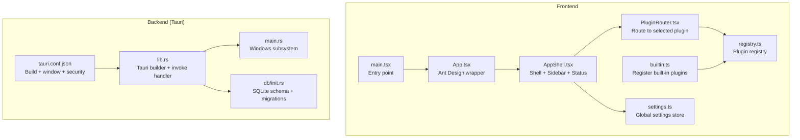
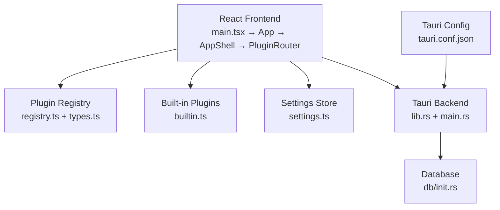
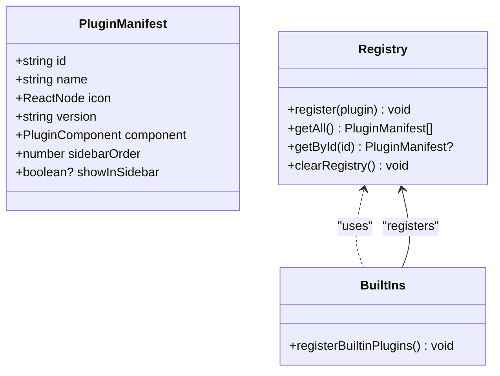
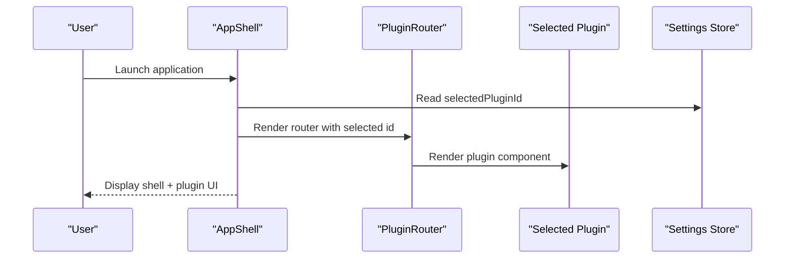
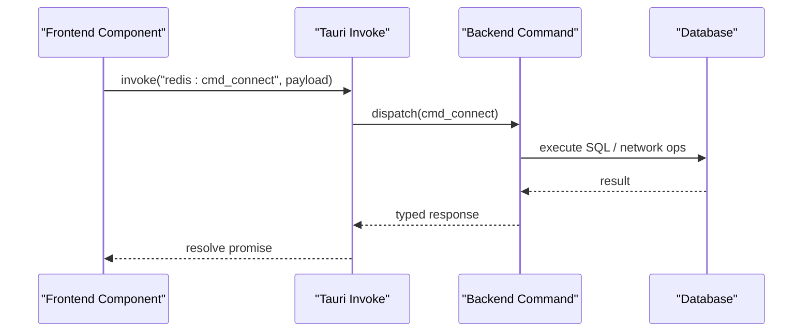
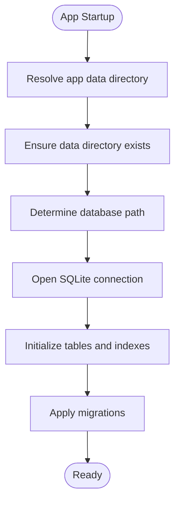
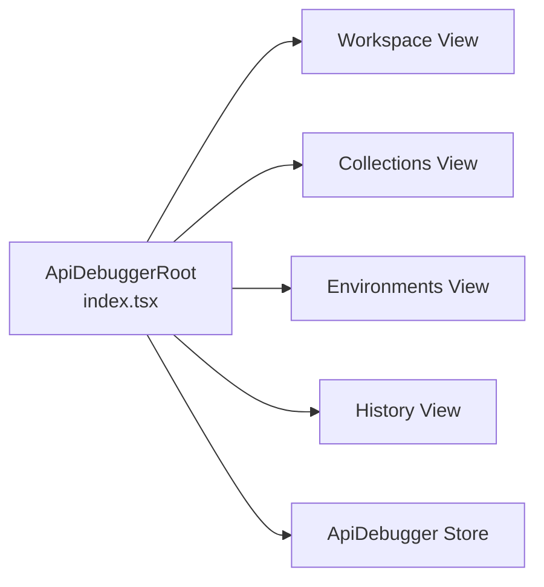
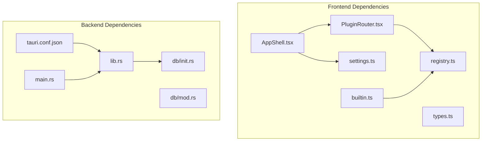

# Architecture Overview

<cite>
**Referenced Files in This Document**
- [main.tsx](file://src/main.tsx)
- [App.tsx](file://src/App.tsx)
- [AppShell.tsx](file://src/app/layout/AppShell.tsx)
- [PluginRouter.tsx](file://src/app/plugin-registry/PluginRouter.tsx)
- [registry.ts](file://src/app/plugin-registry/registry.ts)
- [types.ts](file://src/app/plugin-registry/types.ts)
- [builtin.ts](file://src/app/plugin-registry/builtin.ts)
- [settings.ts](file://src/app/store/settings.ts)
- [tauri.conf.json](file://src-tauri/tauri.conf.json)
- [lib.rs](file://src-tauri/src/lib.rs)
- [main.rs](file://src-tauri/src/main.rs)
- [Cargo.toml](file://src-tauri/Cargo.toml)
- [init.rs](file://src-tauri/src/db/init.rs)
- [mod.rs](file://src-tauri/src/db/mod.rs)
- [index.tsx](file://src/plugins/api-debugger/index.tsx)
</cite>

## Table of Contents
1. [Introduction](#introduction)
2. [Project Structure](#project-structure)
3. [Core Components](#core-components)
4. [Architecture Overview](#architecture-overview)
5. [Detailed Component Analysis](#detailed-component-analysis)
6. [Dependency Analysis](#dependency-analysis)
7. [Performance Considerations](#performance-considerations)
8. [Security Considerations](#security-considerations)
9. [Troubleshooting Guide](#troubleshooting-guide)
10. [Conclusion](#conclusion)

## Introduction
This document describes the architecture of DevNexus, a hybrid desktop application built with a React frontend and a Rust backend integrated via Tauri 2. The system follows a plugin-first architecture where each tool is encapsulated as an independent plugin with its own UI, state, and backend command handlers. The application shell orchestrates navigation, layout, and inter-plugin coordination, while the Rust backend provides secure, high-performance IPC commands and persistent storage.

## Project Structure
DevNexus is organized into two primary layers:
- Frontend (React + TypeScript): Application shell, plugin registry, individual plugins, and shared stores.
- Backend (Rust + Tauri): IPC command registration, database initialization, and platform integrations.

**Diagram sources**
- [main.tsx:1-38](file://src/main.tsx#L1-L38)
- [App.tsx:1-11](file://src/App.tsx#L1-L11)
- [AppShell.tsx:1-207](file://src/app/layout/AppShell.tsx#L1-L207)
- [PluginRouter.tsx:1-29](file://src/app/plugin-registry/PluginRouter.tsx#L1-L29)
- [registry.ts:1-26](file://src/app/plugin-registry/registry.ts#L1-L26)
- [builtin.ts:1-31](file://src/app/plugin-registry/builtin.ts#L1-L31)
- [settings.ts:1-28](file://src/app/store/settings.ts#L1-L28)
- [lib.rs:1-263](file://src-tauri/src/lib.rs#L1-L263)
- [main.rs:1-7](file://src-tauri/src/main.rs#L1-L7)
- [tauri.conf.json:1-39](file://src-tauri/tauri.conf.json#L1-L39)
- [init.rs:1-393](file://src-tauri/src/db/init.rs#L1-L393)

**Section sources**
- [main.tsx:1-38](file://src/main.tsx#L1-L38)
- [App.tsx:1-11](file://src/App.tsx#L1-L11)
- [AppShell.tsx:1-207](file://src/app/layout/AppShell.tsx#L1-L207)
- [PluginRouter.tsx:1-29](file://src/app/plugin-registry/PluginRouter.tsx#L1-L29)
- [registry.ts:1-26](file://src/app/plugin-registry/registry.ts#L1-L26)
- [builtin.ts:1-31](file://src/app/plugin-registry/builtin.ts#L1-L31)
- [settings.ts:1-28](file://src/app/store/settings.ts#L1-L28)
- [lib.rs:1-263](file://src-tauri/src/lib.rs#L1-L263)
- [main.rs:1-7](file://src-tauri/src/main.rs#L1-L7)
- [tauri.conf.json:1-39](file://src-tauri/tauri.conf.json#L1-L39)
- [init.rs:1-393](file://src-tauri/src/db/init.rs#L1-L393)

## Core Components
- Application Shell: Orchestrates layout, status bar, sidebar, and plugin routing.
- Plugin Registry: Central registry for plugin manifests with registration and lookup.
- Built-in Plugins: Pre-registered plugins that extend functionality.
- Settings Store: Persistent global state for UI and selection.
- Tauri Runtime: Desktop windowing, IPC invocation, and backend command registration.
- Database Layer: SQLite schema initialization and migrations.

Key implementation references:
- Shell and routing: [AppShell.tsx:31-206](file://src/app/layout/AppShell.tsx#L31-L206), [PluginRouter.tsx:7-28](file://src/app/plugin-registry/PluginRouter.tsx#L7-L28)
- Plugin registry: [registry.ts:3-25](file://src/app/plugin-registry/registry.ts#L3-L25), [types.ts:5-13](file://src/app/plugin-registry/types.ts#L5-L13)
- Built-in registration: [builtin.ts:14-29](file://src/app/plugin-registry/builtin.ts#L14-L29)
- Settings persistence: [settings.ts:13-27](file://src/app/store/settings.ts#L13-L27)
- IPC and commands: [lib.rs:26-259](file://src-tauri/src/lib.rs#L26-L259)
- Database schema: [init.rs:35-392](file://src-tauri/src/db/init.rs#L35-L392)

**Section sources**
- [AppShell.tsx:31-206](file://src/app/layout/AppShell.tsx#L31-L206)
- [PluginRouter.tsx:7-28](file://src/app/plugin-registry/PluginRouter.tsx#L7-L28)
- [registry.ts:3-25](file://src/app/plugin-registry/registry.ts#L3-L25)
- [types.ts:5-13](file://src/app/plugin-registry/types.ts#L5-L13)
- [builtin.ts:14-29](file://src/app/plugin-registry/builtin.ts#L14-L29)
- [settings.ts:13-27](file://src/app/store/settings.ts#L13-L27)
- [lib.rs:26-259](file://src-tauri/src/lib.rs#L26-L259)
- [init.rs:35-392](file://src-tauri/src/db/init.rs#L35-L392)

## Architecture Overview
DevNexus employs a hybrid desktop architecture:
- Frontend: React application bootstrapped in main.tsx, wrapped by Ant Design, and rendered inside AppShell.
- Backend: Tauri 2 runtime initializes plugins, registers IPC commands, and manages the desktop window.
- Plugin-first: Each tool is a self-contained plugin with its own manifest, UI, and state.
- IPC: Frontend invokes backend commands via Tauri’s invoke handler; backend executes operations and returns typed results.
- Data Layer: SQLite database initialized on startup with schema and migrations.

**Diagram sources**
- [main.tsx:1-38](file://src/main.tsx#L1-L38)
- [App.tsx:1-11](file://src/App.tsx#L1-L11)
- [AppShell.tsx:1-207](file://src/app/layout/AppShell.tsx#L1-L207)
- [PluginRouter.tsx:1-29](file://src/app/plugin-registry/PluginRouter.tsx#L1-L29)
- [registry.ts:1-26](file://src/app/plugin-registry/registry.ts#L1-L26)
- [types.ts:1-14](file://src/app/plugin-registry/types.ts#L1-L14)
- [builtin.ts:1-31](file://src/app/plugin-registry/builtin.ts#L1-L31)
- [settings.ts:1-28](file://src/app/store/settings.ts#L1-L28)
- [lib.rs:1-263](file://src-tauri/src/lib.rs#L1-L263)
- [main.rs:1-7](file://src-tauri/src/main.rs#L1-L7)
- [tauri.conf.json:1-39](file://src-tauri/tauri.conf.json#L1-L39)
- [init.rs:1-393](file://src-tauri/src/db/init.rs#L1-L393)

## Detailed Component Analysis

### Plugin Registry and Manifest System
The plugin registry defines a minimal manifest contract and exposes registration and lookup utilities. Built-in plugins register themselves during application bootstrap.

**Diagram sources**
- [types.ts:5-13](file://src/app/plugin-registry/types.ts#L5-L13)
- [registry.ts:3-25](file://src/app/plugin-registry/registry.ts#L3-L25)
- [builtin.ts:14-29](file://src/app/plugin-registry/builtin.ts#L14-L29)

**Section sources**
- [types.ts:5-13](file://src/app/plugin-registry/types.ts#L5-L13)
- [registry.ts:3-25](file://src/app/plugin-registry/registry.ts#L3-L25)
- [builtin.ts:14-29](file://src/app/plugin-registry/builtin.ts#L14-L29)

### Application Shell and Routing
The shell composes the UI layout, integrates the sidebar, status bar, LAN chat docking, and renders the active plugin via PluginRouter. It also monitors LAN chat state and coordinates desktop window resizing.

**Diagram sources**
- [AppShell.tsx:31-206](file://src/app/layout/AppShell.tsx#L31-L206)
- [PluginRouter.tsx:7-28](file://src/app/plugin-registry/PluginRouter.tsx#L7-L28)
- [settings.ts:13-27](file://src/app/store/settings.ts#L13-L27)

**Section sources**
- [AppShell.tsx:31-206](file://src/app/layout/AppShell.tsx#L31-L206)
- [PluginRouter.tsx:7-28](file://src/app/plugin-registry/PluginRouter.tsx#L7-L28)
- [settings.ts:13-27](file://src/app/store/settings.ts#L13-L27)

### IPC Command Registration and Invocation
Tauri registers a comprehensive set of backend commands under the invoke handler. These commands are invoked from the frontend to perform operations scoped to each plugin’s domain.

**Diagram sources**
- [lib.rs:26-259](file://src-tauri/src/lib.rs#L26-L259)

**Section sources**
- [lib.rs:26-259](file://src-tauri/src/lib.rs#L26-L259)

### Database Initialization and Schema
On startup, the backend ensures the application data directory exists, migrates legacy database paths if needed, and initializes SQLite tables and migrations.

**Diagram sources**
- [init.rs:28-392](file://src-tauri/src/db/init.rs#L28-L392)

**Section sources**
- [init.rs:28-392](file://src-tauri/src/db/init.rs#L28-L392)

### Example Plugin: API Debugger
Each plugin encapsulates its UI, state, and backend commands. The API Debugger plugin demonstrates tabbed views and environment awareness.

**Diagram sources**
- [index.tsx:13-39](file://src/plugins/api-debugger/index.tsx#L13-L39)

**Section sources**
- [index.tsx:13-39](file://src/plugins/api-debugger/index.tsx#L13-L39)

## Dependency Analysis
The frontend depends on the plugin registry and settings store to render the active plugin. The backend depends on Tauri configuration and database initialization. IPC commands bridge frontend and backend.

**Diagram sources**
- [registry.ts:1-26](file://src/app/plugin-registry/registry.ts#L1-L26)
- [types.ts:1-14](file://src/app/plugin-registry/types.ts#L1-L14)
- [builtin.ts:1-31](file://src/app/plugin-registry/builtin.ts#L1-L31)
- [settings.ts:1-28](file://src/app/store/settings.ts#L1-L28)
- [AppShell.tsx:1-207](file://src/app/layout/AppShell.tsx#L1-L207)
- [PluginRouter.tsx:1-29](file://src/app/plugin-registry/PluginRouter.tsx#L1-L29)
- [tauri.conf.json:1-39](file://src-tauri/tauri.conf.json#L1-L39)
- [lib.rs:1-263](file://src-tauri/src/lib.rs#L1-L263)
- [main.rs:1-7](file://src-tauri/src/main.rs#L1-L7)
- [mod.rs:1-8](file://src-tauri/src/db/mod.rs#L1-L8)
- [init.rs:1-393](file://src-tauri/src/db/init.rs#L1-L393)

**Section sources**
- [registry.ts:1-26](file://src/app/plugin-registry/registry.ts#L1-L26)
- [types.ts:1-14](file://src/app/plugin-registry/types.ts#L1-L14)
- [builtin.ts:1-31](file://src/app/plugin-registry/builtin.ts#L1-L31)
- [settings.ts:1-28](file://src/app/store/settings.ts#L1-L28)
- [AppShell.tsx:1-207](file://src/app/layout/AppShell.tsx#L1-L207)
- [PluginRouter.tsx:1-29](file://src/app/plugin-registry/PluginRouter.tsx#L1-L29)
- [tauri.conf.json:1-39](file://src-tauri/tauri.conf.json#L1-L39)
- [lib.rs:1-263](file://src-tauri/src/lib.rs#L1-L263)
- [main.rs:1-7](file://src-tauri/src/main.rs#L1-L7)
- [mod.rs:1-8](file://src-tauri/src/db/mod.rs#L1-L8)
- [init.rs:1-393](file://src-tauri/src/db/init.rs#L1-L393)

## Performance Considerations
- Lazy plugin rendering: PluginRouter renders only the selected plugin, minimizing DOM and memory overhead.
- Debounced background tasks: LAN chat monitoring uses initial delay and periodic polling to balance responsiveness and CPU usage.
- SQLite I/O: Database operations are centralized and schema-initialized once per session to avoid repeated setup costs.
- IPC batching: Group related operations where possible to reduce round-trips.

## Security Considerations
- Desktop runtime detection: Shell logic adapts behavior based on Tauri vs browser runtime.
- CSP configuration: Tauri config disables CSP for development flexibility; production builds should enforce appropriate policies.
- Encrypted secrets: Database schema includes encrypted fields for sensitive credentials across plugins.
- Platform-specific behavior: macOS decoration toggling is handled at startup for native look-and-feel.

**Section sources**
- [AppShell.tsx:40-92](file://src/app/layout/AppShell.tsx#L40-L92)
- [tauri.conf.json:23-25](file://src-tauri/tauri.conf.json#L23-L25)
- [init.rs:37-133](file://src-tauri/src/db/init.rs#L37-L133)

## Troubleshooting Guide
- No plugin registered: If the registry is empty, PluginRouter displays a warning. Ensure built-in plugins are registered during bootstrap.
  - Reference: [PluginRouter.tsx:15-24](file://src/app/plugin-registry/PluginRouter.tsx#L15-L24), [builtin.ts:14-29](file://src/app/plugin-registry/builtin.ts#L14-L29)
- Database initialization failures: Verify data directory creation and migration steps.
  - Reference: [init.rs:28-392](file://src-tauri/src/db/init.rs#L28-L392)
- IPC command not found: Confirm command is listed in the invoke handler registration.
  - Reference: [lib.rs:26-259](file://src-tauri/src/lib.rs#L26-L259)
- Settings persistence issues: Check zustand persistence middleware configuration.
  - Reference: [settings.ts:13-27](file://src/app/store/settings.ts#L13-L27)

**Section sources**
- [PluginRouter.tsx:15-24](file://src/app/plugin-registry/PluginRouter.tsx#L15-L24)
- [builtin.ts:14-29](file://src/app/plugin-registry/builtin.ts#L14-L29)
- [init.rs:28-392](file://src-tauri/src/db/init.rs#L28-L392)
- [lib.rs:26-259](file://src-tauri/src/lib.rs#L26-L259)
- [settings.ts:13-27](file://src/app/store/settings.ts#L13-L27)

## Conclusion
DevNexus combines a React-powered UI with a Rust-backed Tauri runtime to deliver a modular, plugin-first desktop application. The plugin registry and manifest system enable clean isolation of UI and state per tool, while Tauri’s IPC provides secure, typed access to backend capabilities. The application shell coordinates navigation and system integration, and SQLite-backed persistence supports each plugin’s data needs. This architecture balances maintainability, performance, and extensibility for a developer-focused toolkit.