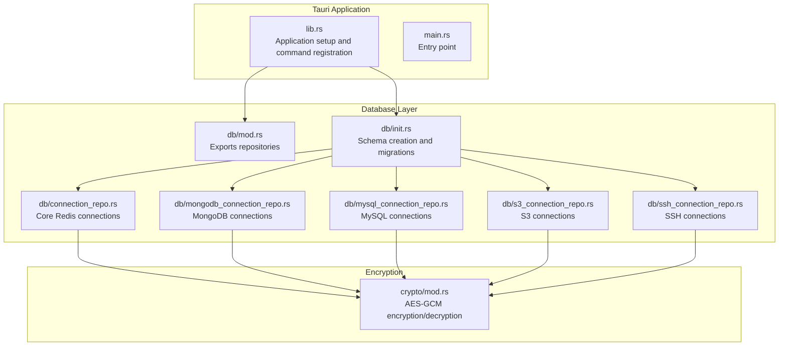
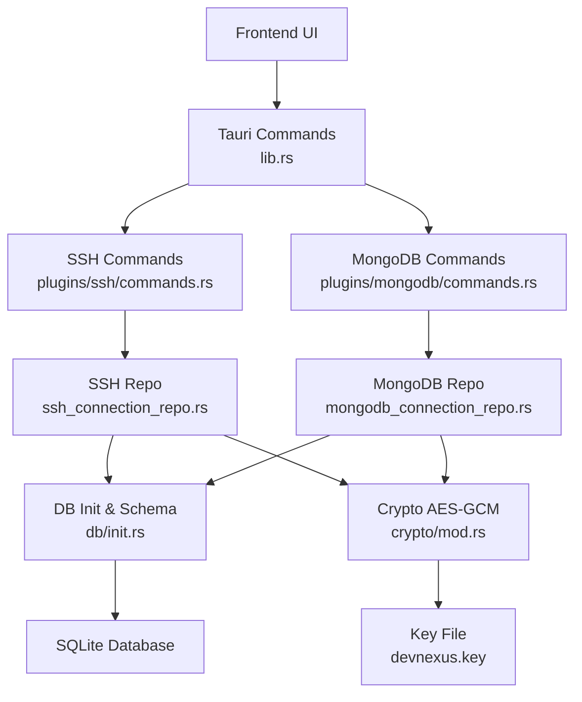
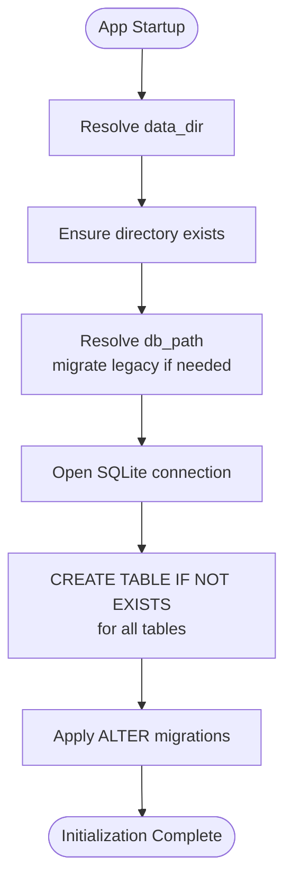
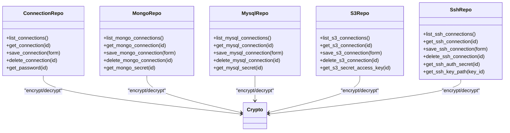
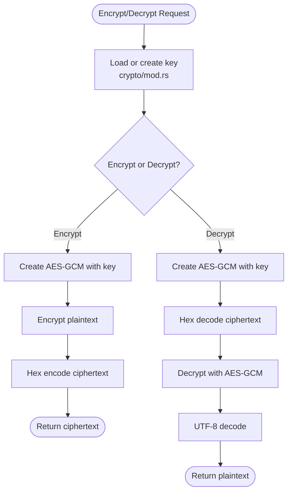
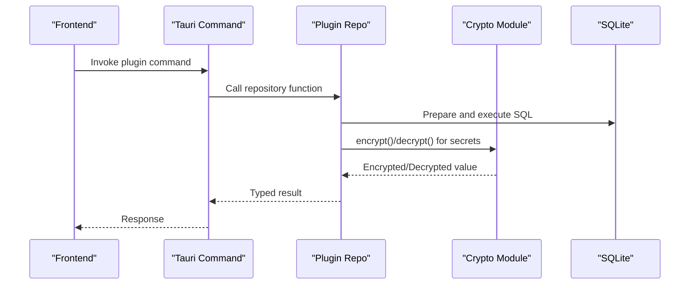
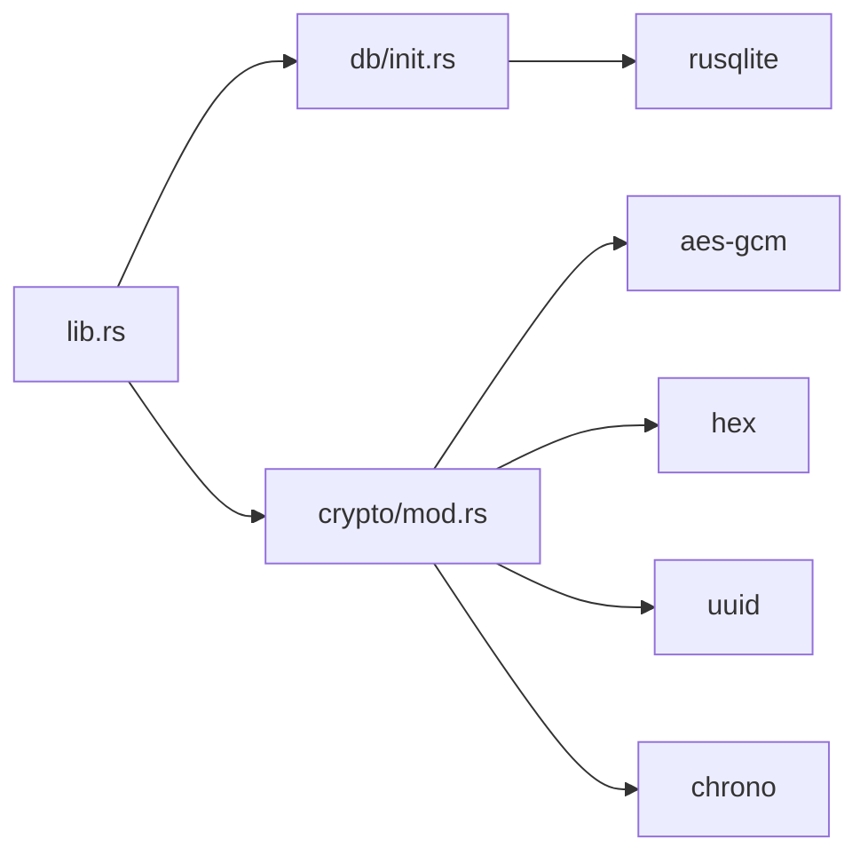

# Data Management Architecture

<cite>
**Referenced Files in This Document**
- [lib.rs](file://src-tauri/src/lib.rs)
- [main.rs](file://src-tauri/src/main.rs)
- [init.rs](file://src-tauri/src/db/init.rs)
- [mod.rs](file://src-tauri/src/db/mod.rs)
- [connection_repo.rs](file://src-tauri/src/db/connection_repo.rs)
- [mongodb_connection_repo.rs](file://src-tauri/src/db/mongodb_connection_repo.rs)
- [mysql_connection_repo.rs](file://src-tauri/src/db/mysql_connection_repo.rs)
- [s3_connection_repo.rs](file://src-tauri/src/db/s3_connection_repo.rs)
- [ssh_connection_repo.rs](file://src-tauri/src/db/ssh_connection_repo.rs)
- [mod.rs](file://src-tauri/src/crypto/mod.rs)
- [Cargo.toml](file://src-tauri/Cargo.toml)
- [commands.rs](file://src-tauri/src/plugins/ssh/commands.rs)
- [commands.rs](file://src-tauri/src/plugins/mongodb/commands.rs)
</cite>

## Table of Contents
1. [Introduction](#introduction)
2. [Project Structure](#project-structure)
3. [Core Components](#core-components)
4. [Architecture Overview](#architecture-overview)
5. [Detailed Component Analysis](#detailed-component-analysis)
6. [Dependency Analysis](#dependency-analysis)
7. [Performance Considerations](#performance-considerations)
8. [Troubleshooting Guide](#troubleshooting-guide)
9. [Conclusion](#conclusion)

## Introduction
This document describes the DevNexus data management architecture with a focus on the SQLite-based persistence layer, encrypted storage for sensitive connection credentials, and the repository pattern implementation across plugin types. It explains the database initialization and schema management, migration strategies, data flow between plugins and the repository abstractions, and the encryption strategy using AES-GCM. It also covers data separation between user data, plugin state, and application configuration.

## Project Structure
The data management layer is implemented in the Rust backend under src-tauri. The high-level structure relevant to data management includes:
- Database initialization and schema management
- Repository modules for each plugin type
- Encryption module for secure credential storage
- Tauri setup hook that initializes the database at startup

**Diagram sources**
- [lib.rs:10-25](file://src-tauri/src/lib.rs#L10-L25)
- [init.rs:28-392](file://src-tauri/src/db/init.rs#L28-L392)
- [mod.rs:1-8](file://src-tauri/src/db/mod.rs#L1-L8)
- [connection_repo.rs:29-32](file://src-tauri/src/db/connection_repo.rs#L29-L32)
- [mongodb_connection_repo.rs:40-43](file://src-tauri/src/db/mongodb_connection_repo.rs#L40-L43)
- [mysql_connection_repo.rs:40-43](file://src-tauri/src/db/mysql_connection_repo.rs#L40-L43)
- [s3_connection_repo.rs:33-36](file://src-tauri/src/db/s3_connection_repo.rs#L33-L36)
- [ssh_connection_repo.rs:38-41](file://src-tauri/src/db/ssh_connection_repo.rs#L38-L41)
- [mod.rs:40-74](file://src-tauri/src/crypto/mod.rs#L40-L74)

**Section sources**
- [lib.rs:10-25](file://src-tauri/src/lib.rs#L10-L25)
- [main.rs:4-7](file://src-tauri/src/main.rs#L4-L7)
- [init.rs:28-392](file://src-tauri/src/db/init.rs#L28-L392)
- [mod.rs:1-8](file://src-tauri/src/db/mod.rs#L1-L8)

## Core Components
- Database initialization and schema management: Creates tables and applies migrations during app startup.
- Repository pattern per plugin: Encapsulates CRUD operations and secret retrieval for each connection type.
- Encryption module: Provides AES-GCM encryption/decryption for sensitive data stored in the database.
- Tauri setup hook: Ensures the database is initialized before commands are invoked.

Key responsibilities:
- Initialization: Resolve data directory, ensure existence, migrate legacy paths, open database, create tables, and apply migrations.
- Repositories: Provide typed models, save/delete/list/get operations, and secure secret retrieval via encryption module.
- Encryption: Load or create a persistent key, encrypt/decrypt sensitive strings, and maintain compatibility with legacy key locations.

**Section sources**
- [init.rs:6-392](file://src-tauri/src/db/init.rs#L6-L392)
- [connection_repo.rs:96-155](file://src-tauri/src/db/connection_repo.rs#L96-L155)
- [mongodb_connection_repo.rs:115-248](file://src-tauri/src/db/mongodb_connection_repo.rs#L115-L248)
- [mysql_connection_repo.rs:108-208](file://src-tauri/src/db/mysql_connection_repo.rs#L108-L208)
- [s3_connection_repo.rs:110-187](file://src-tauri/src/db/s3_connection_repo.rs#L110-L187)
- [ssh_connection_repo.rs:117-203](file://src-tauri/src/db/ssh_connection_repo.rs#L117-L203)
- [mod.rs:21-74](file://src-tauri/src/crypto/mod.rs#L21-L74)
- [lib.rs:15-25](file://src-tauri/src/lib.rs#L15-L25)

## Architecture Overview
The architecture follows a layered design:
- Application layer: Tauri commands registered in lib.rs.
- Data access layer: Repositories per plugin type encapsulate SQL operations.
- Persistence layer: SQLite database with schema managed by init.rs.
- Security layer: Encryption module handles AES-GCM operations.

**Diagram sources**
- [lib.rs:26-259](file://src-tauri/src/lib.rs#L26-L259)
- [commands.rs:8-27](file://src-tauri/src/plugins/ssh/commands.rs#L8-L27)
- [commands.rs:124-164](file://src-tauri/src/plugins/mongodb/commands.rs#L124-L164)
- [ssh_connection_repo.rs:117-167](file://src-tauri/src/db/ssh_connection_repo.rs#L117-L167)
- [mongodb_connection_repo.rs:115-202](file://src-tauri/src/db/mongodb_connection_repo.rs#L115-L202)
- [init.rs:28-392](file://src-tauri/src/db/init.rs#L28-L392)
- [mod.rs:21-74](file://src-tauri/src/crypto/mod.rs#L21-L74)

## Detailed Component Analysis

### Database Initialization and Schema Management
- Data directory resolution and legacy migration: Ensures the database path is migrated from legacy locations.
- Schema creation: Creates all connection and history tables in a single batch.
- Migration: Applies ALTER statements to add new columns to existing tables.

**Diagram sources**
- [init.rs:28-392](file://src-tauri/src/db/init.rs#L28-L392)

**Section sources**
- [init.rs:6-392](file://src-tauri/src/db/init.rs#L6-L392)

### Repository Pattern Implementation
Each plugin type exposes a repository module with:
- Typed models for connection info and forms
- CRUD operations (list, get, save, delete)
- Secret retrieval helpers that decrypt stored values

**Diagram sources**
- [connection_repo.rs:34-155](file://src-tauri/src/db/connection_repo.rs#L34-L155)
- [mongodb_connection_repo.rs:72-248](file://src-tauri/src/db/mongodb_connection_repo.rs#L72-L248)
- [mysql_connection_repo.rs:69-208](file://src-tauri/src/db/mysql_connection_repo.rs#L69-L208)
- [s3_connection_repo.rs:38-187](file://src-tauri/src/db/s3_connection_repo.rs#L38-L187)
- [ssh_connection_repo.rs:43-218](file://src-tauri/src/db/ssh_connection_repo.rs#L43-L218)
- [mod.rs:40-74](file://src-tauri/src/crypto/mod.rs#L40-L74)

**Section sources**
- [connection_repo.rs:34-155](file://src-tauri/src/db/connection_repo.rs#L34-L155)
- [mongodb_connection_repo.rs:72-248](file://src-tauri/src/db/mongodb_connection_repo.rs#L72-L248)
- [mysql_connection_repo.rs:69-208](file://src-tauri/src/db/mysql_connection_repo.rs#L69-L208)
- [s3_connection_repo.rs:38-187](file://src-tauri/src/db/s3_connection_repo.rs#L38-L187)
- [ssh_connection_repo.rs:43-218](file://src-tauri/src/db/ssh_connection_repo.rs#L43-L218)

### Encryption Strategy (AES-GCM)
- Key management: Loads or creates a 32-byte key, stored in a hex-encoded file. Supports migration from legacy key location.
- Encryption/Decryption: Uses AES-256-GCM with a fixed nonce. Empty plaintext returns empty ciphertext and vice versa.
- Integration: Repositories call the encryption module before storing secrets and decryption when retrieving them.

**Diagram sources**
- [mod.rs:21-74](file://src-tauri/src/crypto/mod.rs#L21-L74)

**Section sources**
- [mod.rs:21-74](file://src-tauri/src/crypto/mod.rs#L21-L74)

### Data Flow: Plugins to Database via Repositories
This sequence illustrates how Tauri commands interact with repositories and the database.

**Diagram sources**
- [commands.rs:8-27](file://src-tauri/src/plugins/ssh/commands.rs#L8-L27)
- [commands.rs:124-164](file://src-tauri/src/plugins/mongodb/commands.rs#L124-L164)
- [ssh_connection_repo.rs:117-167](file://src-tauri/src/db/ssh_connection_repo.rs#L117-L167)
- [mongodb_connection_repo.rs:115-202](file://src-tauri/src/db/mongodb_connection_repo.rs#L115-L202)
- [mod.rs:40-74](file://src-tauri/src/crypto/mod.rs#L40-L74)
- [init.rs:33-33](file://src-tauri/src/db/init.rs#L33-L33)

### Data Consistency, Transactions, and Backup/Restore
- Transactions: The repository implementations perform individual SQL operations without explicit transaction blocks. For atomicity across multiple writes, consider wrapping repository calls with explicit transactions in higher-level flows.
- Consistency: Repositories rely on SQLite’s ACID guarantees for single statements. Multi-step operations (e.g., saving secrets) are handled per-table and rely on the encryption module for confidentiality.
- Backup/Restore: The application does not implement automated backup/restore mechanisms. Users can back up the SQLite database file located in the resolved data directory and restore it manually.

[No sources needed since this section provides general guidance]

## Dependency Analysis
External dependencies relevant to data management:
- SQLite driver: rusqlite for database operations
- Serialization: serde for typed models
- Time utilities: chrono for timestamps
- UUID generation: uuid for identifiers
- Encryption: aes-gcm for AES-GCM
- Hex encoding: hex for key serialization

**Diagram sources**
- [lib.rs:10-25](file://src-tauri/src/lib.rs#L10-L25)
- [init.rs:1-4](file://src-tauri/src/db/init.rs#L1-L4)
- [mod.rs:1-8](file://src-tauri/src/crypto/mod.rs#L1-L8)
- [Cargo.toml:20-49](file://src-tauri/Cargo.toml#L20-L49)

**Section sources**
- [Cargo.toml:20-49](file://src-tauri/Cargo.toml#L20-L49)

## Performance Considerations
- SQLite is embedded and optimized for local workloads. For high-frequency operations, consider batching queries and minimizing round trips.
- Encryption overhead is minimal for typical credential sizes. Avoid unnecessary encrypt/decrypt cycles by caching decrypted secrets within a session lifecycle.
- Use prepared statements (as implemented) to reduce parsing overhead.

[No sources needed since this section provides general guidance]

## Troubleshooting Guide
Common issues and remedies:
- Database path errors: Verify data directory resolution and permissions. The initialization routine ensures the directory exists and migrates legacy paths.
- Schema errors: Ensure the schema creation batch runs successfully. Check for constraint violations or missing migrations.
- Encryption failures: Confirm the key file exists and is valid (32 bytes hex). If corrupted, remove the key file to regenerate it.
- Repository errors: Validate input forms and handle optional fields. Secrets are optional; repository functions account for missing values.

**Section sources**
- [init.rs:6-392](file://src-tauri/src/db/init.rs#L6-L392)
- [mod.rs:21-38](file://src-tauri/src/crypto/mod.rs#L21-L38)

## Conclusion
DevNexus employs a clean, layered architecture with SQLite as the persistence engine and AES-GCM for securing sensitive connection credentials. The repository pattern isolates database concerns per plugin type, enabling maintainable and testable code. The initialization routine establishes a robust schema and applies incremental migrations. While the current design focuses on single-statement operations, future enhancements can introduce explicit transactions for multi-step consistency and add backup/restore capabilities for improved operational resilience.