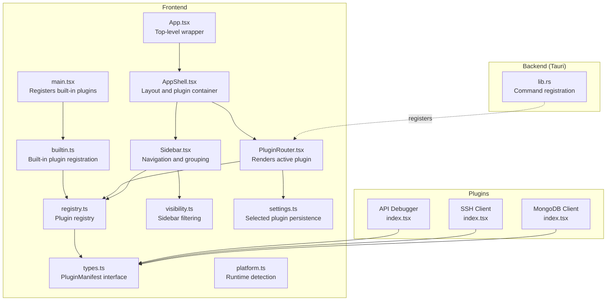
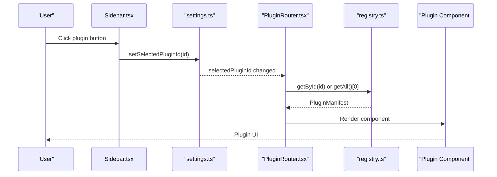
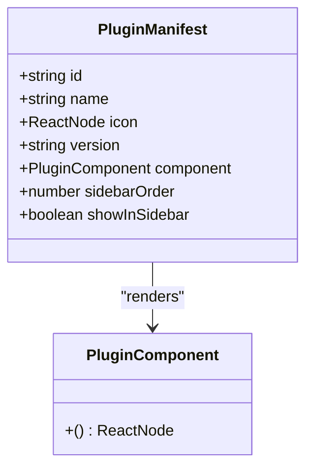
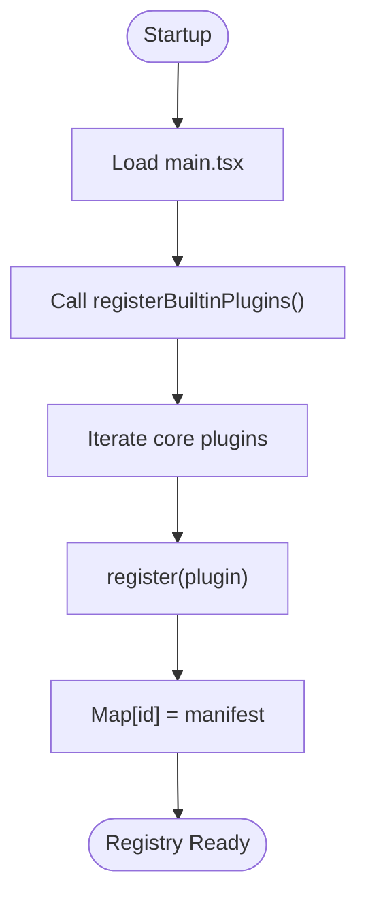
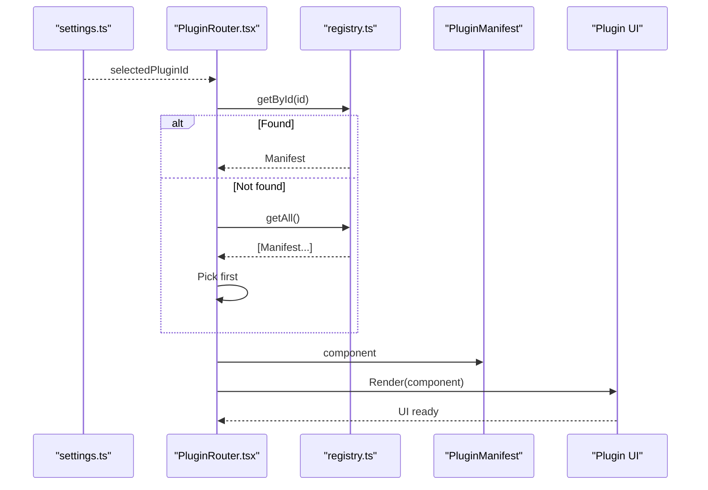
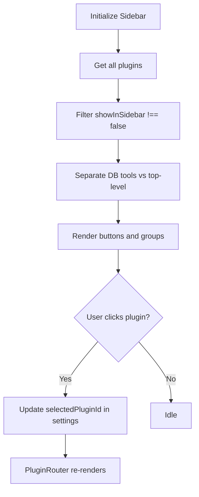
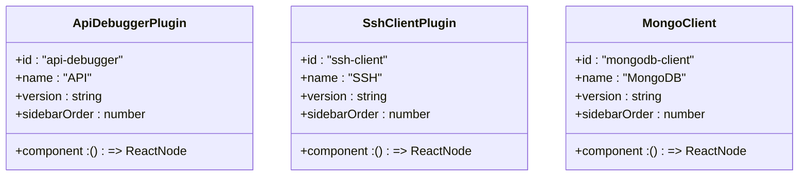
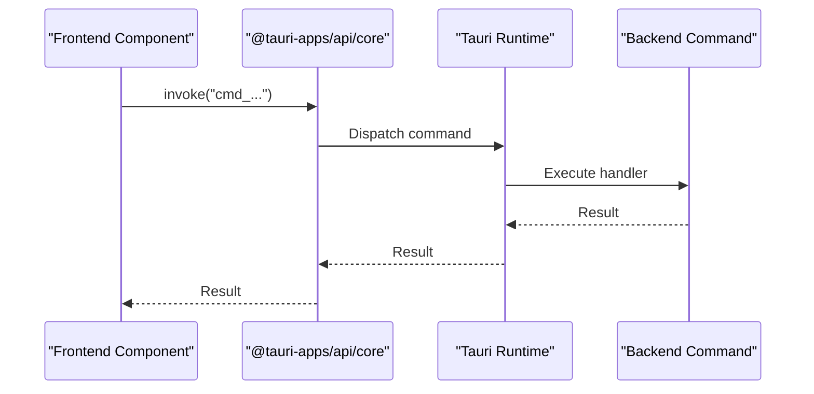
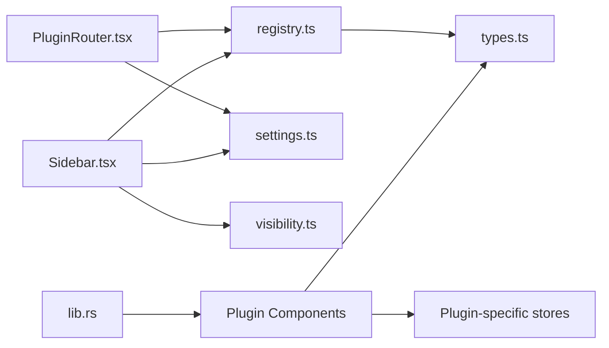

# Plugin System Architecture

<cite>
**Referenced Files in This Document**
- [registry.ts](file://src/app/plugin-registry/registry.ts)
- [builtin.ts](file://src/app/plugin-registry/builtin.ts)
- [PluginRouter.tsx](file://src/app/plugin-registry/PluginRouter.tsx)
- [types.ts](file://src/app/plugin-registry/types.ts)
- [visibility.ts](file://src/app/plugin-registry/visibility.ts)
- [index.tsx (API Debugger)](file://src/plugins/api-debugger/index.tsx)
- [index.tsx (SSH Client)](file://src/plugins/ssh-client/index.tsx)
- [index.tsx (MongoDB Client)](file://src/plugins/mongodb-client/index.tsx)
- [App.tsx](file://src/App.tsx)
- [main.tsx](file://src/main.tsx)
- [AppShell.tsx](file://src/app/layout/AppShell.tsx)
- [Sidebar.tsx](file://src/app/layout/Sidebar.tsx)
- [settings.ts](file://src/app/store/settings.ts)
- [platform.ts](file://src/app/runtime/platform.ts)
- [lib.rs](file://src-tauri/src/lib.rs)
- [api.ts (Developer Console)](file://src/app/developer-console/api.ts)
</cite>

## Table of Contents
1. [Introduction](#introduction)
2. [Project Structure](#project-structure)
3. [Core Components](#core-components)
4. [Architecture Overview](#architecture-overview)
5. [Detailed Component Analysis](#detailed-component-analysis)
6. [Dependency Analysis](#dependency-analysis)
7. [Performance Considerations](#performance-considerations)
8. [Security and Isolation](#security-and-isolation)
9. [Troubleshooting Guide](#troubleshooting-guide)
10. [Conclusion](#conclusion)

## Introduction
This document describes the DevNexus plugin system architecture. DevNexus follows a plugin-first design where each tool is implemented as an independent plugin with its own UI, state management, and backend command bindings. The system emphasizes:
- Compile-time plugin registration and deterministic discovery
- A centralized plugin router for navigation and lifecycle management
- Strong separation between plugin UI, state, and backend commands
- A sidebar-driven navigation model with grouped plugin categories
- Persistent settings to track the active plugin selection

## Project Structure
The plugin system spans the frontend React application and the Tauri backend:
- Frontend plugin registry and router live under src/app/plugin-registry
- Individual plugins live under src/plugins/<plugin-id>
- Application shell integrates the plugin router and sidebar
- Backend command registration is centralized in the Tauri library entry point

**Diagram sources**
- [main.tsx:1-38](file://src/main.tsx#L1-L38)
- [builtin.ts:1-31](file://src/app/plugin-registry/builtin.ts#L1-L31)
- [registry.ts:1-26](file://src/app/plugin-registry/registry.ts#L1-L26)
- [types.ts:1-14](file://src/app/plugin-registry/types.ts#L1-L14)
- [visibility.ts:1-6](file://src/app/plugin-registry/visibility.ts#L1-L6)
- [AppShell.tsx:1-207](file://src/app/layout/AppShell.tsx#L1-L207)
- [Sidebar.tsx:1-177](file://src/app/layout/Sidebar.tsx#L1-L177)
- [PluginRouter.tsx:1-29](file://src/app/plugin-registry/PluginRouter.tsx#L1-L29)
- [settings.ts:1-28](file://src/app/store/settings.ts#L1-L28)
- [index.tsx (API Debugger):1-39](file://src/plugins/api-debugger/index.tsx#L1-L39)
- [index.tsx (SSH Client):1-66](file://src/plugins/ssh-client/index.tsx#L1-L66)
- [index.tsx (MongoDB Client):1-87](file://src/plugins/mongodb-client/index.tsx#L1-L87)
- [lib.rs:245-262](file://src-tauri/src/lib.rs#L245-L262)

**Section sources**
- [main.tsx:1-38](file://src/main.tsx#L1-L38)
- [AppShell.tsx:1-207](file://src/app/layout/AppShell.tsx#L1-L207)
- [Sidebar.tsx:1-177](file://src/app/layout/Sidebar.tsx#L1-L177)
- [PluginRouter.tsx:1-29](file://src/app/plugin-registry/PluginRouter.tsx#L1-L29)
- [registry.ts:1-26](file://src/app/plugin-registry/registry.ts#L1-L26)
- [builtin.ts:1-31](file://src/app/plugin-registry/builtin.ts#L1-L31)
- [types.ts:1-14](file://src/app/plugin-registry/types.ts#L1-L14)
- [visibility.ts:1-6](file://src/app/plugin-registry/visibility.ts#L1-L6)
- [settings.ts:1-28](file://src/app/store/settings.ts#L1-L28)
- [platform.ts:1-10](file://src/app/runtime/platform.ts#L1-L10)

## Core Components
- PluginManifest: Defines the contract for each plugin, including id, name, icon, version, component, sidebar order, and visibility flag.
- Registry: Central in-memory store keyed by plugin id, exposing registration, retrieval, listing, and clearing.
- Built-in Registration: Explicitly registers all core plugins during application initialization.
- PluginRouter: Selects and renders the active plugin based on persisted settings.
- Sidebar: Presents grouped navigation for plugins, including database tools and top-level tools.
- Settings Store: Persists the selected plugin id and UI preferences.
- Platform Detection: Provides runtime hints for UI behavior.

**Section sources**
- [types.ts:1-14](file://src/app/plugin-registry/types.ts#L1-L14)
- [registry.ts:1-26](file://src/app/plugin-registry/registry.ts#L1-L26)
- [builtin.ts:1-31](file://src/app/plugin-registry/builtin.ts#L1-L31)
- [PluginRouter.tsx:1-29](file://src/app/plugin-registry/PluginRouter.tsx#L1-L29)
- [Sidebar.tsx:1-177](file://src/app/layout/Sidebar.tsx#L1-L177)
- [settings.ts:1-28](file://src/app/store/settings.ts#L1-L28)
- [platform.ts:1-10](file://src/app/runtime/platform.ts#L1-L10)

## Architecture Overview
The plugin system is designed around a plugin-first pattern:
- Plugins are React components wrapped in a PluginManifest
- Registration is compile-time and explicit
- Navigation is handled by a dedicated router that reads the selected plugin id from persistent settings
- Sidebar groups plugins and exposes quick access to database tools
- Backend commands are registered centrally and invoked via Tauri’s invoke mechanism

**Diagram sources**
- [Sidebar.tsx:1-177](file://src/app/layout/Sidebar.tsx#L1-L177)
- [settings.ts:1-28](file://src/app/store/settings.ts#L1-L28)
- [PluginRouter.tsx:1-29](file://src/app/plugin-registry/PluginRouter.tsx#L1-L29)
- [registry.ts:1-26](file://src/app/plugin-registry/registry.ts#L1-L26)

## Detailed Component Analysis

### Plugin Manifest and Interface Specification
Each plugin defines a PluginManifest that includes:
- id: Unique identifier used for selection and persistence
- name: Human-readable name for UI display
- icon: Ant Design icon for sidebar presentation
- version: Semantic version string
- component: React component function to render the plugin UI
- sidebarOrder: Numeric ordering for sidebar placement
- showInSidebar: Optional flag to hide from sidebar

**Diagram sources**
- [types.ts:1-14](file://src/app/plugin-registry/types.ts#L1-L14)

**Section sources**
- [types.ts:1-14](file://src/app/plugin-registry/types.ts#L1-L14)

### Plugin Registry and Built-in Registration
The registry maintains a Map keyed by plugin id. It supports:
- register(plugin): Prevents duplicate registration and stores the manifest
- getAll(): Returns sorted manifests by sidebarOrder
- getById(id): Retrieves a specific plugin
- clearRegistry(): Clears all entries

Built-in plugins are registered at startup by importing each plugin’s manifest and invoking the central register function. This ensures all core plugins are available immediately upon launch.

**Diagram sources**
- [main.tsx:1-38](file://src/main.tsx#L1-L38)
- [builtin.ts:1-31](file://src/app/plugin-registry/builtin.ts#L1-L31)
- [registry.ts:1-26](file://src/app/plugin-registry/registry.ts#L1-L26)

**Section sources**
- [registry.ts:1-26](file://src/app/plugin-registry/registry.ts#L1-L26)
- [builtin.ts:1-31](file://src/app/plugin-registry/builtin.ts#L1-L31)
- [main.tsx:1-38](file://src/main.tsx#L1-L38)

### Plugin Router and Lifecycle Management
The PluginRouter selects the active plugin based on the selectedPluginId stored in settings. It:
- Reads the current selected plugin id
- Resolves the manifest via registry
- Falls back to the first available plugin if none is selected
- Renders the plugin component returned by the manifest

This design ensures a single plugin is rendered at a time, isolating UI state and preventing cross-plugin interference.

**Diagram sources**
- [PluginRouter.tsx:1-29](file://src/app/plugin-registry/PluginRouter.tsx#L1-L29)
- [registry.ts:1-26](file://src/app/plugin-registry/registry.ts#L1-L26)
- [settings.ts:1-28](file://src/app/store/settings.ts#L1-L28)

**Section sources**
- [PluginRouter.tsx:1-29](file://src/app/plugin-registry/PluginRouter.tsx#L1-L29)
- [settings.ts:1-28](file://src/app/store/settings.ts#L1-L28)

### Sidebar Navigation and Visibility
The Sidebar component:
- Fetches all plugins and filters those marked for sidebar visibility
- Groups database-related plugins separately
- Supports collapsing/expanding groups and toggling the entire sidebar
- Updates the selected plugin id when a user clicks a plugin button

**Diagram sources**
- [Sidebar.tsx:1-177](file://src/app/layout/Sidebar.tsx#L1-L177)
- [visibility.ts:1-6](file://src/app/plugin-registry/visibility.ts#L1-L6)
- [settings.ts:1-28](file://src/app/store/settings.ts#L1-L28)

**Section sources**
- [Sidebar.tsx:1-177](file://src/app/layout/Sidebar.tsx#L1-L177)
- [visibility.ts:1-6](file://src/app/plugin-registry/visibility.ts#L1-L6)

### Plugin Examples: API Debugger, SSH Client, MongoDB Client
These plugins demonstrate the plugin-first pattern:
- Each exports a PluginManifest with id, name, icon, version, sidebarOrder, and component
- The component encapsulates its own state and views
- They integrate with their respective stores and views

**Diagram sources**
- [index.tsx (API Debugger):1-39](file://src/plugins/api-debugger/index.tsx#L1-L39)
- [index.tsx (SSH Client):1-66](file://src/plugins/ssh-client/index.tsx#L1-L66)
- [index.tsx (MongoDB Client):1-87](file://src/plugins/mongodb-client/index.tsx#L1-L87)

**Section sources**
- [index.tsx (API Debugger):1-39](file://src/plugins/api-debugger/index.tsx#L1-L39)
- [index.tsx (SSH Client):1-66](file://src/plugins/ssh-client/index.tsx#L1-L66)
- [index.tsx (MongoDB Client):1-87](file://src/plugins/mongodb-client/index.tsx#L1-L87)

### Backend Command Registration and Invocation
Backend commands are registered in the Tauri library entry point and invoked from the frontend using Tauri’s invoke mechanism. This provides a clean boundary between frontend UI and backend operations.

**Diagram sources**
- [api.ts (Developer Console):1-11](file://src/app/developer-console/api.ts#L1-L11)
- [lib.rs:245-262](file://src-tauri/src/lib.rs#L245-L262)

**Section sources**
- [api.ts (Developer Console):1-11](file://src/app/developer-console/api.ts#L1-L11)
- [lib.rs:245-262](file://src-tauri/src/lib.rs#L245-L262)

## Dependency Analysis
The plugin system exhibits low coupling and high cohesion:
- Registry and Router depend on PluginManifest contracts
- Sidebar depends on registry and visibility filter
- Settings store persists selection and UI state
- Plugins depend only on their internal stores and shared types
- Backend commands are decoupled from frontend rendering

**Diagram sources**
- [registry.ts:1-26](file://src/app/plugin-registry/registry.ts#L1-L26)
- [types.ts:1-14](file://src/app/plugin-registry/types.ts#L1-L14)
- [PluginRouter.tsx:1-29](file://src/app/plugin-registry/PluginRouter.tsx#L1-L29)
- [Sidebar.tsx:1-177](file://src/app/layout/Sidebar.tsx#L1-L177)
- [visibility.ts:1-6](file://src/app/plugin-registry/visibility.ts#L1-L6)
- [settings.ts:1-28](file://src/app/store/settings.ts#L1-L28)
- [lib.rs:245-262](file://src-tauri/src/lib.rs#L245-L262)

**Section sources**
- [registry.ts:1-26](file://src/app/plugin-registry/registry.ts#L1-L26)
- [types.ts:1-14](file://src/app/plugin-registry/types.ts#L1-L14)
- [PluginRouter.tsx:1-29](file://src/app/plugin-registry/PluginRouter.tsx#L1-L29)
- [Sidebar.tsx:1-177](file://src/app/layout/Sidebar.tsx#L1-L177)
- [visibility.ts:1-6](file://src/app/plugin-registry/visibility.ts#L1-L6)
- [settings.ts:1-28](file://src/app/store/settings.ts#L1-L28)
- [lib.rs:245-262](file://src-tauri/src/lib.rs#L245-L262)

## Performance Considerations
- Single-plugin rendering: Only one plugin is mounted at a time, minimizing memory footprint and DOM complexity.
- Sorted registry retrieval: getAll() sorts by sidebarOrder, enabling efficient sidebar rendering without repeated computations.
- Minimal re-renders: PluginRouter uses memoization to avoid unnecessary recomputation when the selected plugin id does not change.
- Persistent settings: Persisted selection avoids expensive lookups on startup.

[No sources needed since this section provides general guidance]

## Security and Isolation
- Plugin isolation: Each plugin encapsulates its own state and UI, reducing cross-plugin interference.
- Backend boundaries: Frontend invokes backend commands via Tauri’s typed invoke mechanism, enforcing strict command contracts.
- Data protection: Sensitive credentials are encrypted before storage, as enforced by backend crypto helpers.
- Runtime awareness: Platform detection enables appropriate UI behavior for different environments.

**Section sources**
- [platform.ts:1-10](file://src/app/runtime/platform.ts#L1-L10)
- [lib.rs:245-262](file://src-tauri/src/lib.rs#L245-L262)

## Troubleshooting Guide
Common issues and resolutions:
- No plugin registered: If the registry is empty, the router displays a warning. Ensure registerBuiltinPlugins() is called during startup.
- Incorrect plugin selection: Verify selectedPluginId in settings is set and corresponds to a registered plugin id.
- Sidebar not updating: Confirm showInSidebar flag is not explicitly set to false and sidebarOrder values are correct.
- Backend command failures: Check command registration in lib.rs and ensure frontend invoke matches the backend command name.

**Section sources**
- [PluginRouter.tsx:1-29](file://src/app/plugin-registry/PluginRouter.tsx#L1-L29)
- [builtin.ts:1-31](file://src/app/plugin-registry/builtin.ts#L1-L31)
- [settings.ts:1-28](file://src/app/store/settings.ts#L1-L28)
- [lib.rs:245-262](file://src-tauri/src/lib.rs#L245-L262)

## Conclusion
DevNexus employs a robust plugin-first architecture that separates concerns across UI, state, and backend layers. Compile-time registration guarantees predictable discovery, while the router and sidebar provide a streamlined navigation experience. The system’s isolation and clear command boundaries support scalability and maintainability as new plugins are added.