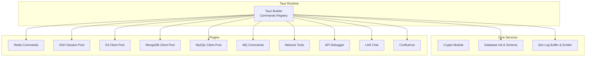
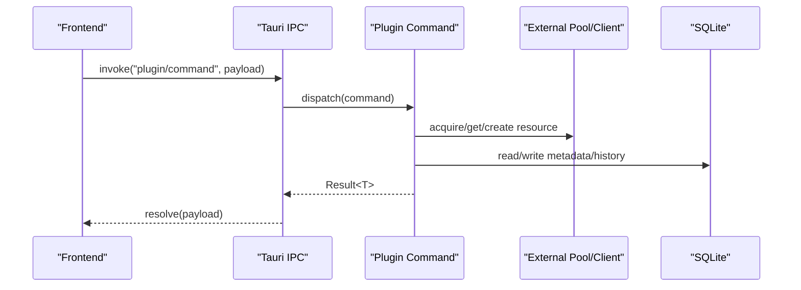
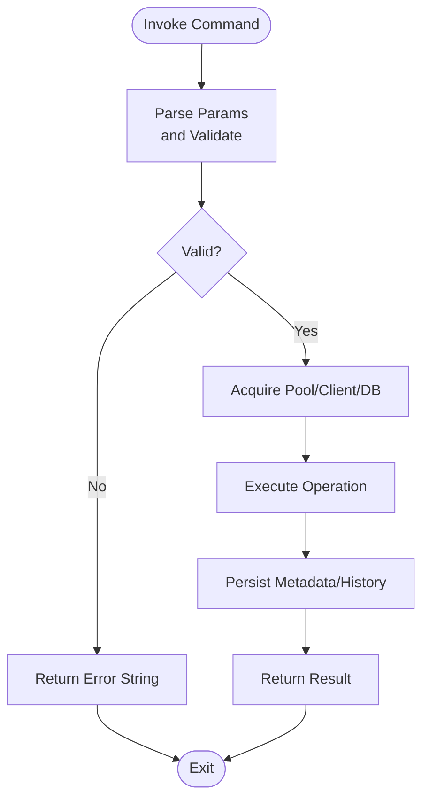
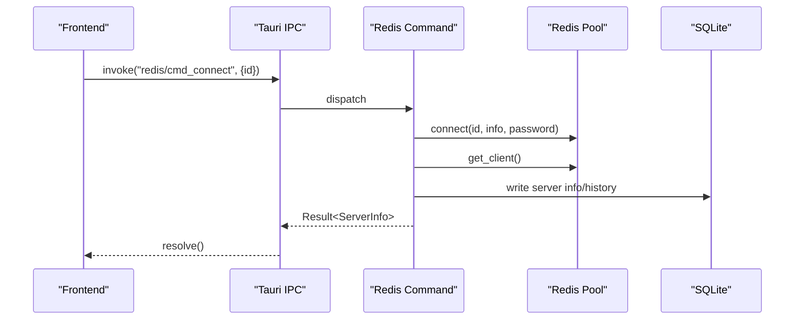
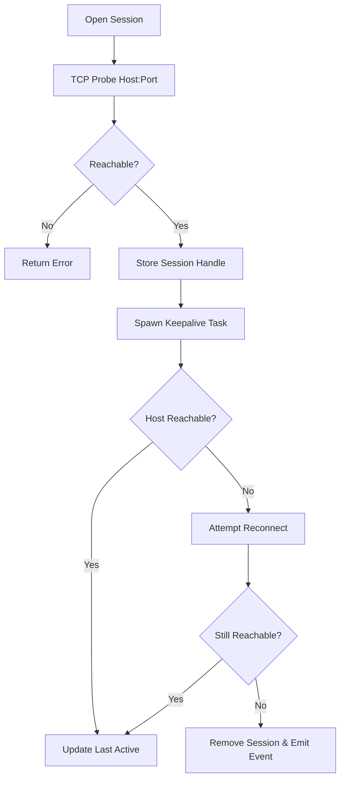
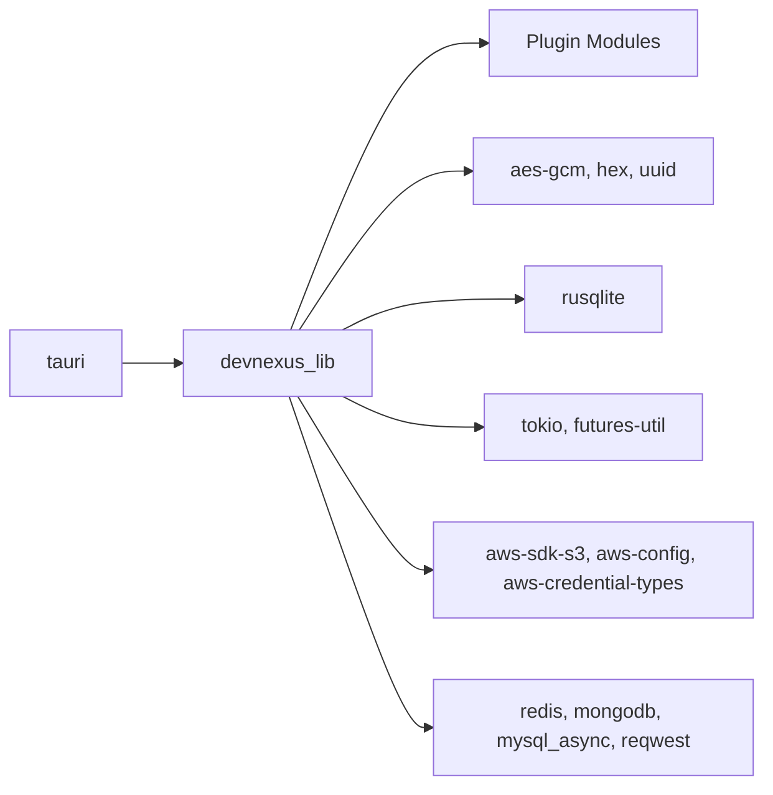

# Backend Services & Commands

<cite>
**Referenced Files in This Document**
- [Cargo.toml](file://src-tauri/Cargo.toml)
- [main.rs](file://src-tauri/src/main.rs)
- [lib.rs](file://src-tauri/src/lib.rs)
- [tauri.conf.json](file://src-tauri/tauri.conf.json)
- [db/init.rs](file://src-tauri/src/db/init.rs)
- [db/mod.rs](file://src-tauri/src/db/mod.rs)
- [crypto/mod.rs](file://src-tauri/src/crypto/mod.rs)
- [dev_log.rs](file://src-tauri/src/dev_log.rs)
- [plugins/mod.rs](file://src-tauri/src/plugins/mod.rs)
- [redis/commands.rs](file://src-tauri/src/plugins/redis/commands.rs)
- [mysql/client_pool.rs](file://src-tauri/src/plugins/mysql/client_pool.rs)
- [s3/client_pool.rs](file://src-tauri/src/plugins/s3/client_pool.rs)
- [mongodb/client_pool.rs](file://src-tauri/src/plugins/mongodb/client_pool.rs)
- [ssh/session_pool.rs](file://src-tauri/src/plugins/ssh/session_pool.rs)
</cite>

## Table of Contents
1. [Introduction](#introduction)
2. [Project Structure](#project-structure)
3. [Core Components](#core-components)
4. [Architecture Overview](#architecture-overview)
5. [Detailed Component Analysis](#detailed-component-analysis)
6. [Dependency Analysis](#dependency-analysis)
7. [Performance Considerations](#performance-considerations)
8. [Troubleshooting Guide](#troubleshooting-guide)
9. [Conclusion](#conclusion)

## Introduction
This document explains the DevNexus backend services and Tauri command system. It covers the Rust backend architecture, the typed command system that exposes Rust functions to the frontend via Tauri IPC, plugin-specific implementations, connection pooling strategies, error handling patterns, and operational guidance for lifecycle management, resource management, and performance optimization. It also includes debugging strategies, logging mechanisms, and monitoring approaches tailored to the backend services.

## Project Structure
The backend is implemented in Rust under the src-tauri directory and integrates with Tauri to expose a rich set of commands to the web-based frontend. The structure organizes core services (database, encryption, logging), plugin modules (Redis, SSH, S3, MongoDB, MySQL, MQ, Network, API Debugger, LAN Chat, Confluence), and Tauri bootstrap logic.

**Diagram sources**
- [lib.rs:10-262](file://src-tauri/src/lib.rs#L10-L262)
- [db/mod.rs:1-8](file://src-tauri/src/db/mod.rs#L1-L8)
- [plugins/mod.rs:1-11](file://src-tauri/src/plugins/mod.rs#L1-L11)

**Section sources**
- [lib.rs:10-262](file://src-tauri/src/lib.rs#L10-L262)
- [tauri.conf.json:1-39](file://src-tauri/tauri.conf.json#L1-L39)

## Core Components
- Tauri Bootstrap and Command Registry: Initializes plugins, sets up the database, records startup logs, and registers hundreds of commands exposed to the frontend.
- Database Initialization: Creates and migrates the SQLite schema for connection storage, query history, environments, and plugin-specific tables.
- Encryption: Provides AES-GCM symmetric encryption/decryption for secrets, with key migration and persistence.
- Developer Logging: In-memory ring-buffer log entries emitted to the frontend via Tauri events.

Key responsibilities:
- Centralized command registration via Tauri’s typed command macro.
- Resource lifecycle management for external services (SSH sessions, database pools, cloud SDK clients).
- Consistent error propagation from Rust to the frontend as human-readable messages.

**Section sources**
- [lib.rs:10-262](file://src-tauri/src/lib.rs#L10-L262)
- [db/init.rs:28-392](file://src-tauri/src/db/init.rs#L28-L392)
- [crypto/mod.rs:10-74](file://src-tauri/src/crypto/mod.rs#L10-L74)
- [dev_log.rs:29-68](file://src-tauri/src/dev_log.rs#L29-L68)

## Architecture Overview
The backend follows a modular plugin architecture. Each plugin encapsulates:
- Typed commands (annotated with Tauri’s command macro) that accept strongly-typed parameters and return structured results.
- Optional connection pools for external services (e.g., Redis, MongoDB, MySQL, S3).
- Utility modules for encryption, history, and resource management.

**Diagram sources**
- [lib.rs:26-259](file://src-tauri/src/lib.rs#L26-L259)
- [redis/commands.rs:139-194](file://src-tauri/src/plugins/redis/commands.rs#L139-L194)
- [db/init.rs:92-137](file://src-tauri/src/db/init.rs#L92-L137)

## Detailed Component Analysis

### Tauri Command System and Typed Commands
- The command registry aggregates commands from all plugins and exposes them to the frontend via Tauri’s invoke handler.
- Each command is annotated with Tauri’s command macro and returns a Result<T, String>, enabling typed serialization and robust error propagation.
- Parameter validation and safety checks are performed at the command boundary (e.g., dangerous command confirmation, bounds checking).

Example patterns:
- Connection lifecycle commands (list/save/delete/test/connect/disconnect/select-db).
- Data operations (scan keys, get/set string/hash/list/set/zset, TTL management).
- History and diagnostics (list query history, server info, slowlog, dbsize).
- Raw command execution with safeguards.

**Diagram sources**
- [lib.rs:26-259](file://src-tauri/src/lib.rs#L26-L259)
- [redis/commands.rs:139-194](file://src-tauri/src/plugins/redis/commands.rs#L139-L194)
- [redis/commands.rs:668-695](file://src-tauri/src/plugins/redis/commands.rs#L668-L695)

**Section sources**
- [lib.rs:26-259](file://src-tauri/src/lib.rs#L26-L259)
- [redis/commands.rs:139-194](file://src-tauri/src/plugins/redis/commands.rs#L139-L194)
- [redis/commands.rs:216-251](file://src-tauri/src/plugins/redis/commands.rs#L216-L251)
- [redis/commands.rs:668-695](file://src-tauri/src/plugins/redis/commands.rs#L668-L695)

### Database Initialization and Schema Management
- Ensures the application data directory exists and migrates legacy database paths.
- Creates and maintains schema tables for connections, query history, environments, and plugin-specific entities.
- Provides helper functions to resolve data directory and database path.

Operational notes:
- Schema migrations are applied during initialization.
- History writes and reads are supported for Redis/Mongo/MySQL.

**Section sources**
- [db/init.rs:6-392](file://src-tauri/src/db/init.rs#L6-L392)

### Encryption and Secret Storage
- Manages a per-installation symmetric key for encrypting secrets.
- Migrates legacy key locations and validates key sizes.
- Provides encryption and decryption helpers used by connection repositories.

Security considerations:
- Uses AES-GCM with a fixed nonce; suitable for local secret storage.
- Key is stored in the application data directory.

**Section sources**
- [crypto/mod.rs:10-74](file://src-tauri/src/crypto/mod.rs#L10-L74)

### Developer Logging
- Maintains a thread-safe ring-buffer of recent log entries.
- Emits live log events to the frontend for real-time monitoring.
- Supports listing and clearing logs.

**Section sources**
- [dev_log.rs:29-68](file://src-tauri/src/dev_log.rs#L29-L68)

### Plugin-Specific Backend Implementations

#### Redis Plugin
- Connection management via a connection pool module and a sync connection helper.
- Comprehensive command coverage for strings, hashes, lists, sets, sorted sets, and server diagnostics.
- Dangerous command protection with explicit confirmation.
- Query history persistence and retrieval.

**Diagram sources**
- [redis/commands.rs:174-194](file://src-tauri/src/plugins/redis/commands.rs#L174-L194)
- [redis/commands.rs:92-111](file://src-tauri/src/plugins/redis/commands.rs#L92-L111)

**Section sources**
- [redis/commands.rs:139-194](file://src-tauri/src/plugins/redis/commands.rs#L139-L194)
- [redis/commands.rs:216-251](file://src-tauri/src/plugins/redis/commands.rs#L216-L251)
- [redis/commands.rs:668-695](file://src-tauri/src/plugins/redis/commands.rs#L668-L695)

#### SSH Plugin
- Session pool manages long-lived SSH sessions with keepalive probes and automatic reconnection.
- Emits session-closed events when connectivity fails.
- Integrates with terminal and tunnel modules.

**Diagram sources**
- [ssh/session_pool.rs:105-139](file://src-tauri/src/plugins/ssh/session_pool.rs#L105-L139)
- [ssh/session_pool.rs:50-102](file://src-tauri/src/plugins/ssh/session_pool.rs#L50-L102)

**Section sources**
- [ssh/session_pool.rs:105-139](file://src-tauri/src/plugins/ssh/session_pool.rs#L105-L139)
- [ssh/session_pool.rs:50-102](file://src-tauri/src/plugins/ssh/session_pool.rs#L50-L102)

#### S3 Plugin
- Builds AWS SDK S3 clients with configurable endpoints and path-style access.
- Maintains a simple in-process client pool keyed by connection ID.

**Section sources**
- [s3/client_pool.rs:34-59](file://src-tauri/src/plugins/s3/client_pool.rs#L34-L59)
- [s3/client_pool.rs:61-85](file://src-tauri/src/plugins/s3/client_pool.rs#L61-L85)

#### MongoDB Plugin
- Constructs MongoDB clients from URI, SRV, or host/port configurations with TLS and auth support.
- Stores clients in a process-wide pool keyed by connection ID.

**Section sources**
- [mongodb/client_pool.rs:14-105](file://src-tauri/src/plugins/mongodb/client_pool.rs#L14-L105)
- [mongodb/client_pool.rs:107-131](file://src-tauri/src/plugins/mongodb/client_pool.rs#L107-L131)

#### MySQL Plugin
- Builds MySQL connection pools with charset initialization and optional credentials.
- Stores pools in a process-wide map keyed by connection ID.

**Section sources**
- [mysql/client_pool.rs:12-30](file://src-tauri/src/plugins/mysql/client_pool.rs#L12-L30)
- [mysql/client_pool.rs:32-48](file://src-tauri/src/plugins/mysql/client_pool.rs#L32-L48)

### Cross-Language Communication Mechanisms
- Tauri IPC: Frontend invokes commands by name; Tauri routes to registered handlers.
- Typed Serialization: Commands return Result<T, String>; Tauri serializes results automatically.
- Events: Backend emits events (e.g., dev-log entries, SSH session-closed) to the frontend.

Integration points:
- Command registration in the Tauri builder.
- Frontend-side invocation and response handling.

**Section sources**
- [lib.rs:26-259](file://src-tauri/src/lib.rs#L26-L259)
- [dev_log.rs:29-68](file://src-tauri/src/dev_log.rs#L29-L68)
- [ssh/session_pool.rs:96-98](file://src-tauri/src/plugins/ssh/session_pool.rs#L96-L98)

## Dependency Analysis
The backend leverages a set of key crates for cryptography, databases, async runtime, and cloud integrations. The Tauri ecosystem provides the IPC bridge and plugin infrastructure.

**Diagram sources**
- [Cargo.toml:20-49](file://src-tauri/Cargo.toml#L20-L49)
- [lib.rs:10-262](file://src-tauri/src/lib.rs#L10-L262)

**Section sources**
- [Cargo.toml:20-49](file://src-tauri/Cargo.toml#L20-L49)

## Performance Considerations
- Connection pooling: Use plugin-specific pools (Redis, MongoDB, MySQL, S3) to avoid repeated handshakes and reduce latency.
- Keepalive and liveness: SSH sessions include keepalive loops with TCP probing and backoff to maintain stability.
- History writes: Minimize synchronous disk writes by batching or deferring non-critical operations.
- Asynchronous runtime: Leverage Tokio for concurrent operations and avoid blocking the main thread.
- Payload sizes: For large datasets (lists, sets, zsets), consider pagination and streaming where possible.

[No sources needed since this section provides general guidance]

## Troubleshooting Guide
Common issues and remedies:
- Command errors: Commands return String errors; surface these to the UI for actionable feedback.
- Connection failures: Verify host reachability, credentials, and TLS settings; use test connection routines.
- Pool exhaustion: Ensure proper acquisition and release of pooled resources; monitor pool sizes.
- Logging: Use the dev-log commands to inspect recent entries and timestamps; clear buffers when needed.
- Database migration: Confirm schema initialization runs on startup; check data directory permissions.

Debugging strategies:
- Enable verbose logging and inspect dev-log entries.
- Reproduce with minimal parameters and progressively add complexity.
- Validate parameter bounds and types at the command boundary.

**Section sources**
- [dev_log.rs:29-68](file://src-tauri/src/dev_log.rs#L29-L68)
- [redis/commands.rs:675-679](file://src-tauri/src/plugins/redis/commands.rs#L675-L679)
- [ssh/session_pool.rs:110-112](file://src-tauri/src/plugins/ssh/session_pool.rs#L110-L112)

## Conclusion
DevNexus employs a modular, typed command system powered by Tauri to expose robust backend services to the frontend. Strong typing, centralized error handling, and plugin-specific connection pools enable reliable operations across diverse systems (Redis, SSH, S3, MongoDB, MySQL). Proper lifecycle management, logging, and monitoring practices ensure maintainability and operability in production scenarios.