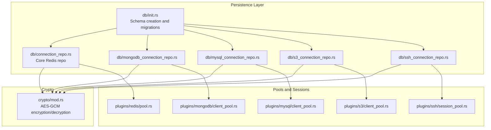
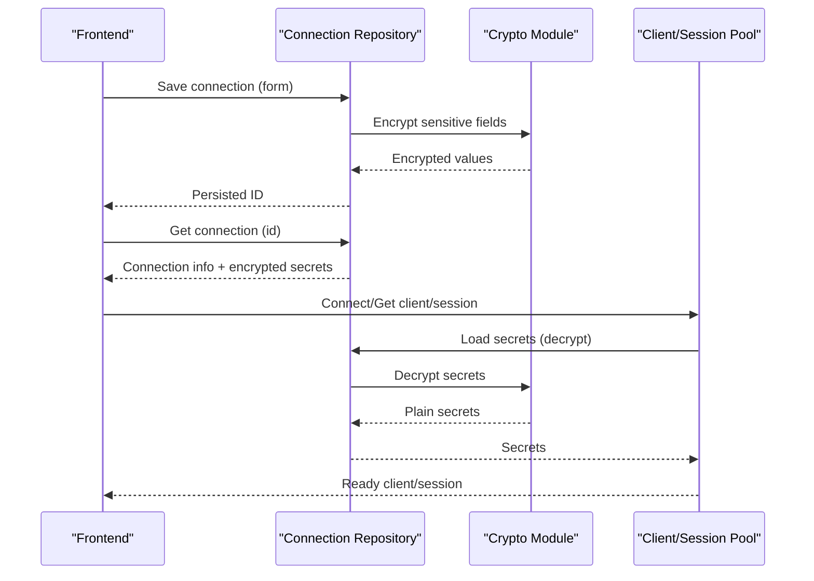
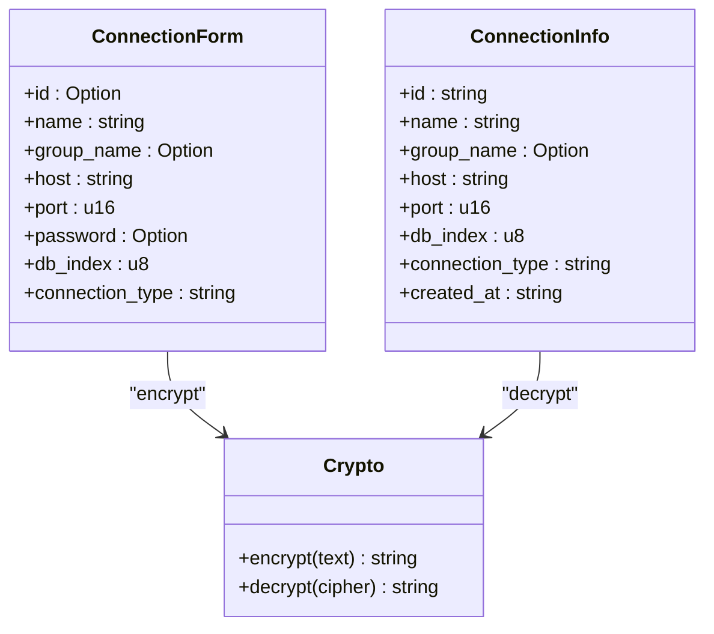
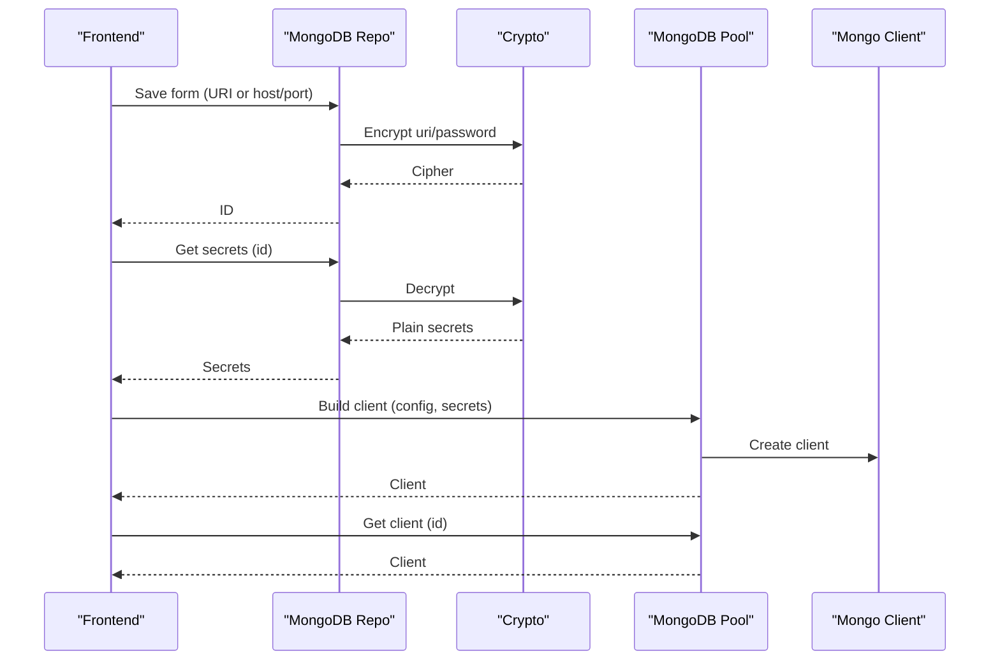
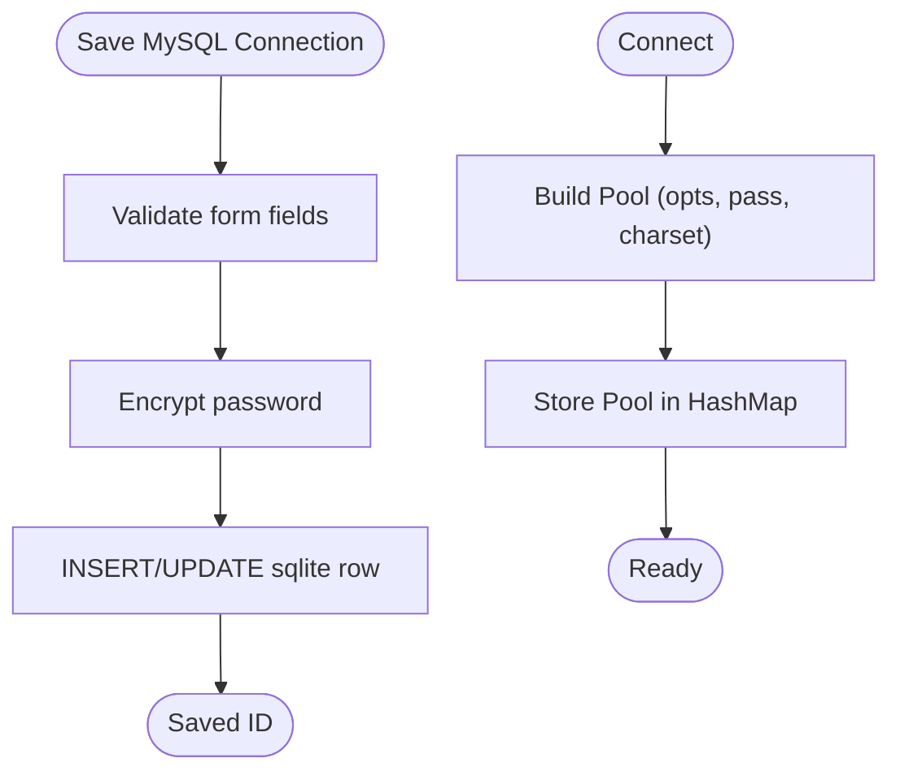
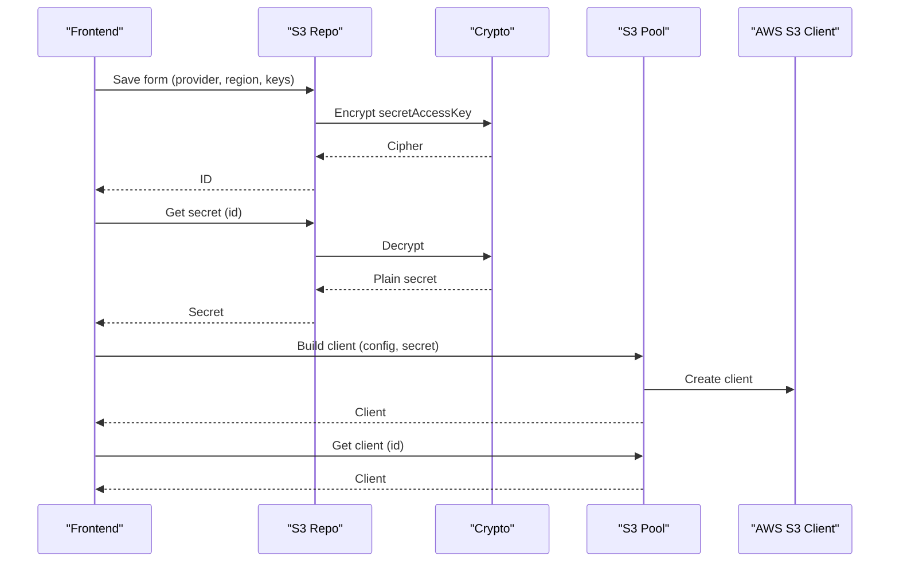
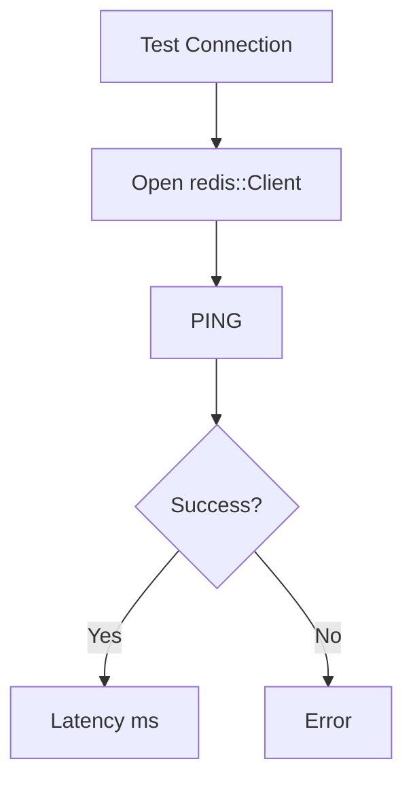
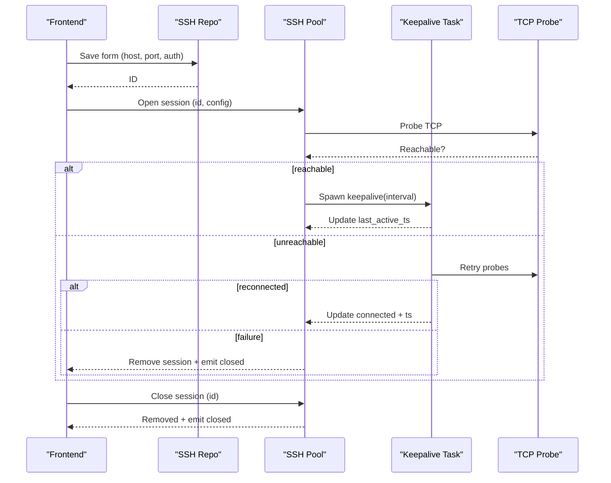
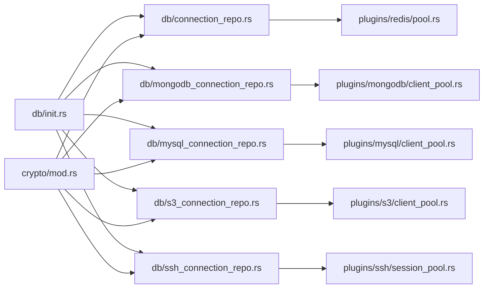

# Connection Management

<cite>
**Referenced Files in This Document**
- [connection_repo.rs](file://src-tauri/src/db/connection_repo.rs)
- [mongodb_connection_repo.rs](file://src-tauri/src/db/mongodb_connection_repo.rs)
- [mysql_connection_repo.rs](file://src-tauri/src/db/mysql_connection_repo.rs)
- [s3_connection_repo.rs](file://src-tauri/src/db/s3_connection_repo.rs)
- [ssh_connection_repo.rs](file://src-tauri/src/db/ssh_connection_repo.rs)
- [mod.rs](file://src-tauri/src/db/mod.rs)
- [init.rs](file://src-tauri/src/db/init.rs)
- [mod.rs](file://src-tauri/src/crypto/mod.rs)
- [client_pool.rs (MongoDB)](file://src-tauri/src/plugins/mongodb/client_pool.rs)
- [client_pool.rs (MySQL)](file://src-tauri/src/plugins/mysql/client_pool.rs)
- [client_pool.rs (S3)](file://src-tauri/src/plugins/s3/client_pool.rs)
- [pool.rs (Redis)](file://src-tauri/src/plugins/redis/pool.rs)
- [session_pool.rs (SSH)](file://src-tauri/src/plugins/ssh/session_pool.rs)
</cite>

## Table of Contents
1. [Introduction](#introduction)
2. [Project Structure](#project-structure)
3. [Core Components](#core-components)
4. [Architecture Overview](#architecture-overview)
5. [Detailed Component Analysis](#detailed-component-analysis)
6. [Dependency Analysis](#dependency-analysis)
7. [Performance Considerations](#performance-considerations)
8. [Troubleshooting Guide](#troubleshooting-guide)
9. [Conclusion](#conclusion)

## Introduction
This document explains connection management strategies across backend services in the application. It covers:
- The connection repository pattern for secure storage and retrieval of connection configurations
- Connection pooling for database clients, SSH sessions, and external service clients
- Lifecycle management: establishment, validation, reuse, and cleanup
- Encryption handling and credential management
- Timeout handling, retry logic, and error recovery
- Monitoring, health checking, and performance optimization

## Project Structure
The backend is implemented in Rust under src-tauri. Connection-related logic is organized into:
- A central database initialization and schema management module
- A cryptographic module for secure encryption/decryption of secrets
- Per-service connection repositories for persistence
- Per-service client pools and session managers for runtime connection lifecycle

**Diagram sources**
- [init.rs:1-393](file://src-tauri/src/db/init.rs#L1-L393)
- [connection_repo.rs:1-174](file://src-tauri/src/db/connection_repo.rs#L1-L174)
- [mongodb_connection_repo.rs:1-249](file://src-tauri/src/db/mongodb_connection_repo.rs#L1-L249)
- [mysql_connection_repo.rs:1-209](file://src-tauri/src/db/mysql_connection_repo.rs#L1-L209)
- [s3_connection_repo.rs:1-188](file://src-tauri/src/db/s3_connection_repo.rs#L1-L188)
- [ssh_connection_repo.rs:1-218](file://src-tauri/src/db/ssh_connection_repo.rs#L1-L218)
- [mod.rs:1-75](file://src-tauri/src/crypto/mod.rs#L1-L75)
- [client_pool.rs (MongoDB):1-132](file://src-tauri/src/plugins/mongodb/client_pool.rs#L1-L132)
- [client_pool.rs (MySQL):1-65](file://src-tauri/src/plugins/mysql/client_pool.rs#L1-L65)
- [client_pool.rs (S3):1-86](file://src-tauri/src/plugins/s3/client_pool.rs#L1-L86)
- [pool.rs (Redis):1-76](file://src-tauri/src/plugins/redis/pool.rs#L1-L76)
- [session_pool.rs (SSH):1-172](file://src-tauri/src/plugins/ssh/session_pool.rs#L1-L172)

**Section sources**
- [mod.rs:1-8](file://src-tauri/src/db/mod.rs#L1-L8)
- [init.rs:1-393](file://src-tauri/src/db/init.rs#L1-L393)

## Core Components
- Centralized schema and data directory management
- Secure credential storage via AES-GCM encryption
- Per-service connection repositories for CRUD operations and secret retrieval
- Runtime pools/sessions for efficient reuse and health maintenance

Key responsibilities:
- Schema initialization and migrations
- Data directory resolution and database path management
- Encryption key provisioning and rotation
- Connection configuration persistence and retrieval
- Client/session pooling and lifecycle management

**Section sources**
- [init.rs:1-393](file://src-tauri/src/db/init.rs#L1-L393)
- [mod.rs:1-75](file://src-tauri/src/crypto/mod.rs#L1-L75)
- [connection_repo.rs:1-174](file://src-tauri/src/db/connection_repo.rs#L1-L174)
- [mongodb_connection_repo.rs:1-249](file://src-tauri/src/db/mongodb_connection_repo.rs#L1-L249)
- [mysql_connection_repo.rs:1-209](file://src-tauri/src/db/mysql_connection_repo.rs#L1-L209)
- [s3_connection_repo.rs:1-188](file://src-tauri/src/db/s3_connection_repo.rs#L1-L188)
- [ssh_connection_repo.rs:1-218](file://src-tauri/src/db/ssh_connection_repo.rs#L1-L218)

## Architecture Overview
The system separates persistent configuration from runtime connectivity:
- Repositories persist and retrieve connection configurations, including encrypted secrets
- Pools/sessions encapsulate client creation, validation, reuse, and cleanup
- Crypto module ensures secrets are stored and accessed securely

**Diagram sources**
- [connection_repo.rs:96-131](file://src-tauri/src/db/connection_repo.rs#L96-L131)
- [mod.rs:40-74](file://src-tauri/src/crypto/mod.rs#L40-L74)
- [client_pool.rs (MongoDB):107-123](file://src-tauri/src/plugins/mongodb/client_pool.rs#L107-L123)
- [client_pool.rs (MySQL):32-48](file://src-tauri/src/plugins/mysql/client_pool.rs#L32-L48)
- [client_pool.rs (S3):61-77](file://src-tauri/src/plugins/s3/client_pool.rs#L61-L77)
- [pool.rs (Redis):58-67](file://src-tauri/src/plugins/redis/pool.rs#L58-L67)
- [session_pool.rs (SSH):162-171](file://src-tauri/src/plugins/ssh/session_pool.rs#L162-L171)

## Detailed Component Analysis

### Connection Repository Pattern
- Purpose: Provide a unified interface to manage connection configurations and secrets
- Data model: Structured forms and info records per service; encrypted fields stored in SQLite
- Operations: List, get, save (upsert), delete, and secret retrieval with decryption

**Diagram sources**
- [connection_repo.rs:3-27](file://src-tauri/src/db/connection_repo.rs#L3-L27)
- [mod.rs:40-74](file://src-tauri/src/crypto/mod.rs#L40-L74)

**Section sources**
- [connection_repo.rs:34-131](file://src-tauri/src/db/connection_repo.rs#L34-L131)
- [mod.rs:40-74](file://src-tauri/src/crypto/mod.rs#L40-L74)

### MongoDB Connection Management
- Repository: Stores URI or form-based configuration, TLS/SRV flags, and encrypted secrets
- Client pool: Builds clients from either URI or host/port with optional auth and TLS
- Lifecycle: Pool stores client keyed by connection ID; retrieval returns existing client

**Diagram sources**
- [mongodb_connection_repo.rs:115-202](file://src-tauri/src/db/mongodb_connection_repo.rs#L115-L202)
- [mod.rs:40-74](file://src-tauri/src/crypto/mod.rs#L40-L74)
- [client_pool.rs (MongoDB):14-105](file://src-tauri/src/plugins/mongodb/client_pool.rs#L14-L105)
- [client_pool.rs (MongoDB):107-123](file://src-tauri/src/plugins/mongodb/client_pool.rs#L107-L123)

**Section sources**
- [mongodb_connection_repo.rs:1-249](file://src-tauri/src/db/mongodb_connection_repo.rs#L1-L249)
- [client_pool.rs (MongoDB):1-132](file://src-tauri/src/plugins/mongodb/client_pool.rs#L1-L132)

### MySQL Connection Management
- Repository: Validates required fields, persists encrypted password, and supports timeouts
- Pool: Builds a connection pool with charset initialization and optional database selection
- Lifecycle: Pool stores a Pool keyed by connection ID; removal triggers disconnect

**Diagram sources**
- [mysql_connection_repo.rs:108-176](file://src-tauri/src/db/mysql_connection_repo.rs#L108-L176)
- [mod.rs:40-74](file://src-tauri/src/crypto/mod.rs#L40-L74)
- [client_pool.rs (MySQL):12-30](file://src-tauri/src/plugins/mysql/client_pool.rs#L12-L30)
- [client_pool.rs (MySQL):50-63](file://src-tauri/src/plugins/mysql/client_pool.rs#L50-L63)

**Section sources**
- [mysql_connection_repo.rs:1-209](file://src-tauri/src/db/mysql_connection_repo.rs#L1-L209)
- [client_pool.rs (MySQL):1-65](file://src-tauri/src/plugins/mysql/client_pool.rs#L1-L65)

### S3 Connection Management
- Repository: Persists provider, endpoint, region, access key, and encrypted secret access key
- Client pool: Constructs AWS SDK S3 client with credentials, region, endpoint override, and path-style option
- Lifecycle: Pool stores client keyed by connection ID; retrieval returns existing client

**Diagram sources**
- [s3_connection_repo.rs:110-161](file://src-tauri/src/db/s3_connection_repo.rs#L110-L161)
- [mod.rs:40-74](file://src-tauri/src/crypto/mod.rs#L40-L74)
- [client_pool.rs (S3):34-59](file://src-tauri/src/plugins/s3/client_pool.rs#L34-L59)
- [client_pool.rs (S3):61-77](file://src-tauri/src/plugins/s3/client_pool.rs#L61-L77)

**Section sources**
- [s3_connection_repo.rs:1-188](file://src-tauri/src/db/s3_connection_repo.rs#L1-L188)
- [client_pool.rs (S3):1-86](file://src-tauri/src/plugins/s3/client_pool.rs#L1-L86)

### Redis Connection Management
- Repository: Core Redis connection info (host, port, db index) persisted with encrypted password support
- Pool: Builds a URL-encoded client string with optional password and PING validation
- Lifecycle: Pool stores redis::Client keyed by connection ID; test helper measures latency

**Diagram sources**
- [pool.rs (Redis):69-75](file://src-tauri/src/plugins/redis/pool.rs#L69-L75)
- [pool.rs (Redis):39-48](file://src-tauri/src/plugins/redis/pool.rs#L39-L48)

**Section sources**
- [connection_repo.rs:3-27](file://src-tauri/src/db/connection_repo.rs#L3-L27)
- [pool.rs (Redis):1-76](file://src-tauri/src/plugins/redis/pool.rs#L1-L76)

### SSH Session Management
- Repository: Stores SSH connection settings including auth type, optional key ID, and keepalive interval
- Session pool: Maintains active sessions with TCP probing, keepalive tasks, and automatic reconnect/recovery
- Lifecycle: Open creates a session and spawns a keepalive task; Close removes session and emits events

**Diagram sources**
- [ssh_connection_repo.rs:117-167](file://src-tauri/src/db/ssh_connection_repo.rs#L117-L167)
- [session_pool.rs (SSH):105-139](file://src-tauri/src/plugins/ssh/session_pool.rs#L105-L139)
- [session_pool.rs (SSH):141-160](file://src-tauri/src/plugins/ssh/session_pool.rs#L141-L160)
- [session_pool.rs (SSH):50-102](file://src-tauri/src/plugins/ssh/session_pool.rs#L50-L102)

**Section sources**
- [ssh_connection_repo.rs:1-218](file://src-tauri/src/db/ssh_connection_repo.rs#L1-L218)
- [session_pool.rs (SSH):1-172](file://src-tauri/src/plugins/ssh/session_pool.rs#L1-L172)

## Dependency Analysis
- Repositories depend on SQLite schema initialized by db/init.rs and on crypto/mod.rs for encryption/decryption
- Pools/sessions depend on their respective repositories for configuration and secrets
- Crypto module depends on data directory resolved by db/init.rs

**Diagram sources**
- [init.rs:1-393](file://src-tauri/src/db/init.rs#L1-L393)
- [mod.rs:1-75](file://src-tauri/src/crypto/mod.rs#L1-L75)
- [connection_repo.rs:1-174](file://src-tauri/src/db/connection_repo.rs#L1-L174)
- [mongodb_connection_repo.rs:1-249](file://src-tauri/src/db/mongodb_connection_repo.rs#L1-L249)
- [mysql_connection_repo.rs:1-209](file://src-tauri/src/db/mysql_connection_repo.rs#L1-L209)
- [s3_connection_repo.rs:1-188](file://src-tauri/src/db/s3_connection_repo.rs#L1-L188)
- [ssh_connection_repo.rs:1-218](file://src-tauri/src/db/ssh_connection_repo.rs#L1-L218)
- [pool.rs (Redis):1-76](file://src-tauri/src/plugins/redis/pool.rs#L1-L76)
- [client_pool.rs (MongoDB):1-132](file://src-tauri/src/plugins/mongodb/client_pool.rs#L1-L132)
- [client_pool.rs (MySQL):1-65](file://src-tauri/src/plugins/mysql/client_pool.rs#L1-L65)
- [client_pool.rs (S3):1-86](file://src-tauri/src/plugins/s3/client_pool.rs#L1-L86)
- [session_pool.rs (SSH):1-172](file://src-tauri/src/plugins/ssh/session_pool.rs#L1-L172)

**Section sources**
- [mod.rs:1-8](file://src-tauri/src/db/mod.rs#L1-L8)
- [init.rs:1-393](file://src-tauri/src/db/init.rs#L1-L393)

## Performance Considerations
- Prefer connection pooling for long-lived connections (MongoDB, MySQL, S3, Redis) to reduce overhead
- Use lightweight keepalive tasks for SSH to detect liveness without heavy operations
- Cache decrypted secrets per connection ID to avoid repeated crypto operations during reuse
- Limit pool sizes and tune timeouts based on service characteristics and resource constraints
- Monitor latency via built-in test helpers and adjust retry backoffs accordingly

[No sources needed since this section provides general guidance]

## Troubleshooting Guide
Common issues and strategies:
- Decryption failures: Verify encryption key exists and matches expected size; check migration from legacy key path
- Connection not found errors: Ensure the connection ID exists in the appropriate repository and pool
- SSH connectivity problems: Confirm TCP probe success; review keepalive intervals and retry backoff
- Pool disconnects: For MySQL, explicitly remove and disconnect pools to clean up resources
- Health checks: Use Redis test helper to measure latency; rely on pool ping for readiness

**Section sources**
- [mod.rs:21-38](file://src-tauri/src/crypto/mod.rs#L21-L38)
- [client_pool.rs (MySQL):50-63](file://src-tauri/src/plugins/mysql/client_pool.rs#L50-L63)
- [session_pool.rs (SSH):31-44](file://src-tauri/src/plugins/ssh/session_pool.rs#L31-L44)
- [pool.rs (Redis):69-75](file://src-tauri/src/plugins/redis/pool.rs#L69-L75)

## Conclusion
The backend implements a robust, layered approach to connection management:
- Secure, schema-backed persistence with encrypted secrets
- Efficient runtime pools/sessions with lifecycle controls
- Health monitoring and automatic recovery for long-running connections
- Clear separation of concerns enabling maintainability and extensibility