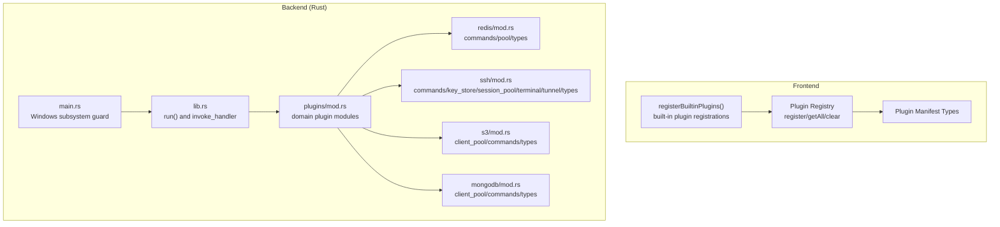
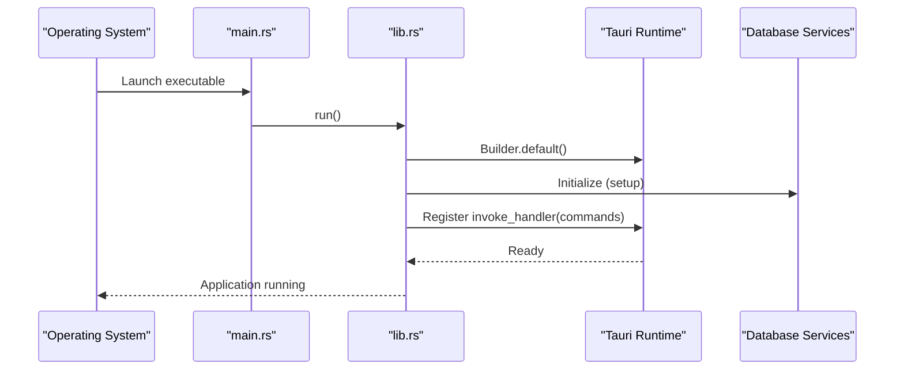
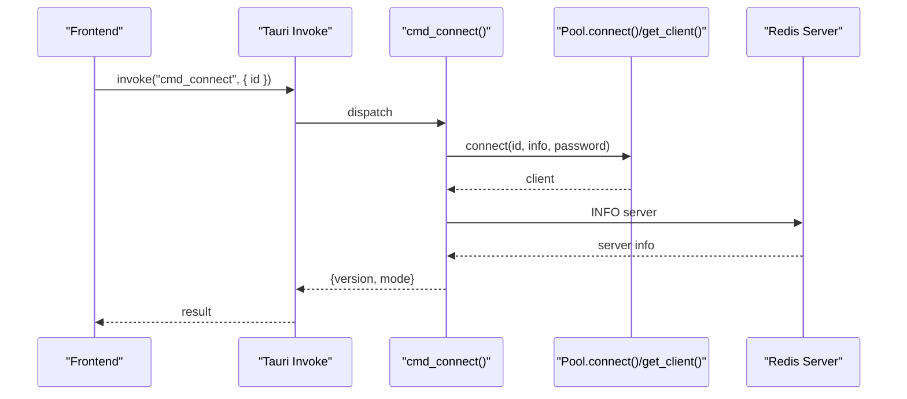
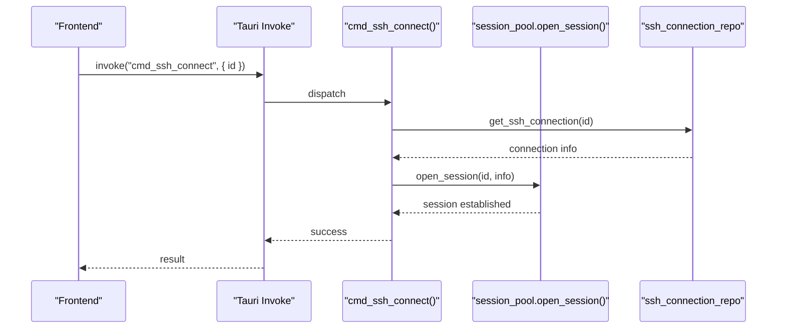
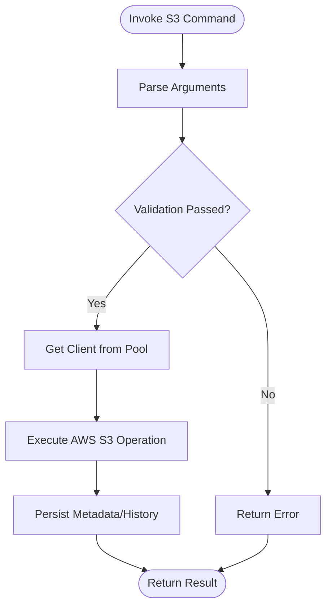
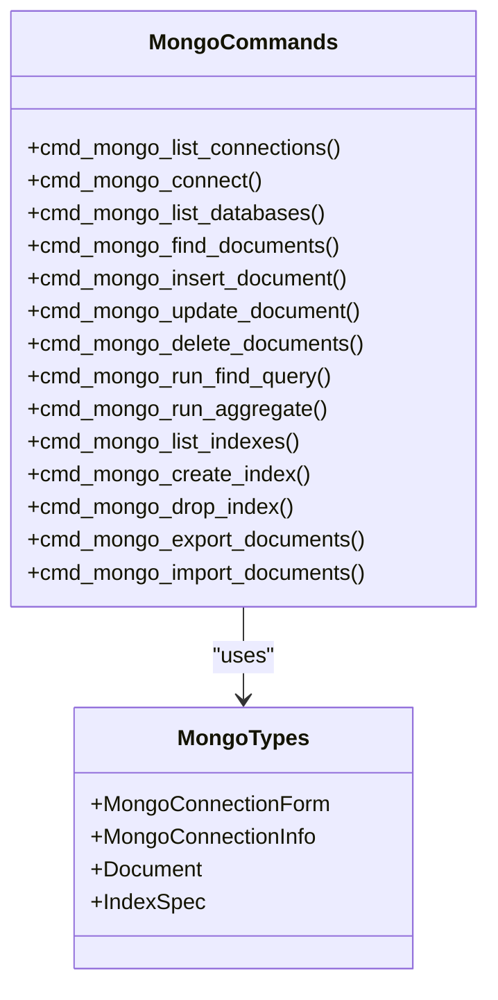
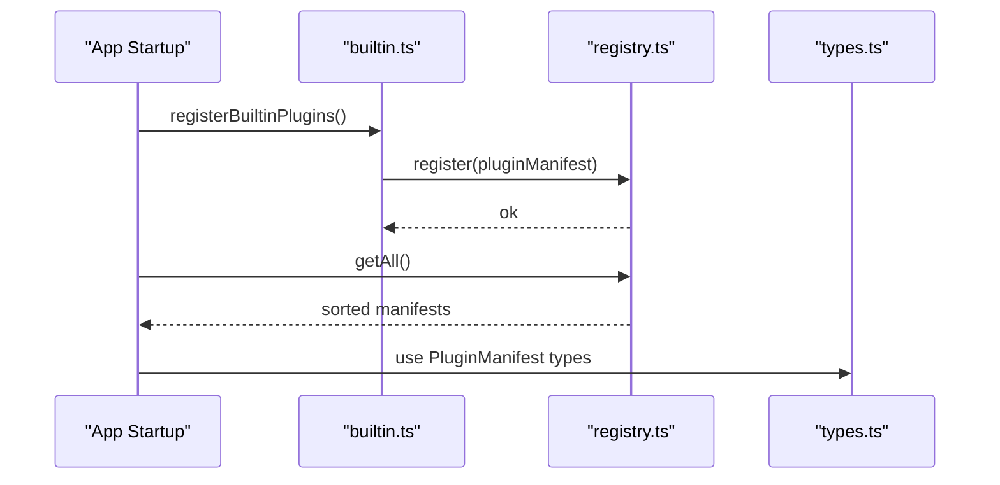
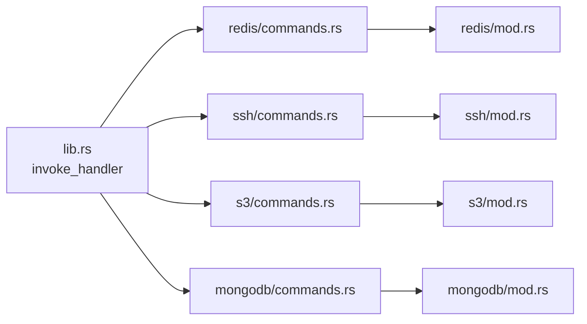

# Plugin Backend Implementations

<cite>
**Referenced Files in This Document**
- [lib.rs](file://src-tauri/src/lib.rs)
- [main.rs](file://src-tauri/src/main.rs)
- [mod.rs](file://src-tauri/src/plugins/mod.rs)
- [redis/mod.rs](file://src-tauri/src/plugins/redis/mod.rs)
- [redis/commands.rs](file://src-tauri/src/plugins/redis/commands.rs)
- [ssh/mod.rs](file://src-tauri/src/plugins/ssh/mod.rs)
- [ssh/commands.rs](file://src-tauri/src/plugins/ssh/commands.rs)
- [s3/mod.rs](file://src-tauri/src/plugins/s3/mod.rs)
- [mongodb/mod.rs](file://src-tauri/src/plugins/mongodb/mod.rs)
- [builtin.ts](file://src/app/plugin-registry/builtin.ts)
- [registry.ts](file://src/app/plugin-registry/registry.ts)
- [types.ts](file://src/app/plugin-registry/types.ts)
</cite>

## Table of Contents
1. [Introduction](#introduction)
2. [Project Structure](#project-structure)
3. [Core Components](#core-components)
4. [Architecture Overview](#architecture-overview)
5. [Detailed Component Analysis](#detailed-component-analysis)
6. [Dependency Analysis](#dependency-analysis)
7. [Performance Considerations](#performance-considerations)
8. [Troubleshooting Guide](#troubleshooting-guide)
9. [Conclusion](#conclusion)

## Introduction
This document explains the plugin-specific backend implementations in DevNexus. The backend is implemented in Rust using Tauri and organized into modular plugins by domain (Redis, SSH, S3, MongoDB, MySQL, MQ, LAN Chat, Confluence, Network Tools, API Debugger). Each plugin encapsulates its own commands, connection pools, and domain-specific logic behind a unified Tauri command surface. The frontend registers built-in plugins and exposes them in the sidebar, while the backend initializes database services and wires all plugin commands into Tauri’s invoke handler.

## Project Structure
The backend is structured around a central Tauri entrypoint that registers all plugin commands. Plugins are grouped under a common module and expose submodules for commands, pools, and types. The frontend registers built-in plugins and manages their manifests.

**Diagram sources**
- [main.rs:1-7](file://src-tauri/src/main.rs#L1-L7)
- [lib.rs:1-263](file://src-tauri/src/lib.rs#L1-L263)
- [mod.rs:1-11](file://src-tauri/src/plugins/mod.rs#L1-L11)
- [redis/mod.rs:1-4](file://src-tauri/src/plugins/redis/mod.rs#L1-L4)
- [ssh/mod.rs:1-7](file://src-tauri/src/plugins/ssh/mod.rs#L1-L7)
- [s3/mod.rs:1-4](file://src-tauri/src/plugins/s3/mod.rs#L1-L4)
- [mongodb/mod.rs:1-4](file://src-tauri/src/plugins/mongodb/mod.rs#L1-L4)
- [builtin.ts:1-31](file://src/app/plugin-registry/builtin.ts#L1-L31)
- [registry.ts:1-26](file://src/app/plugin-registry/registry.ts#L1-L26)
- [types.ts:1-14](file://src/app/plugin-registry/types.ts#L1-L14)

**Section sources**
- [main.rs:1-7](file://src-tauri/src/main.rs#L1-L7)
- [lib.rs:1-263](file://src-tauri/src/lib.rs#L1-L263)
- [mod.rs:1-11](file://src-tauri/src/plugins/mod.rs#L1-L11)
- [builtin.ts:1-31](file://src/app/plugin-registry/builtin.ts#L1-L31)
- [registry.ts:1-26](file://src/app/plugin-registry/registry.ts#L1-L26)
- [types.ts:1-14](file://src/app/plugin-registry/types.ts#L1-L14)

## Core Components
- Central Tauri entrypoint and command wiring:
  - The backend defines a run function that sets up plugins, initializes the database, and registers all plugin commands via Tauri’s invoke handler. Commands are grouped by domain and exposed under a consistent namespace.
- Domain plugin modules:
  - Each domain plugin exposes submodules for commands, connection pools, and types. Examples include Redis, SSH, S3, and MongoDB.
- Frontend plugin registry:
  - Built-in plugins are registered once and stored in a manifest registry. The registry supports lookup by ID and retrieval of all manifests sorted by sidebar order.

Common patterns across plugins:
- Command structuring:
  - Each plugin command is a #[tauri::command] function that receives an AppHandle and typed arguments, performs domain logic, and returns a Result<T, String>.
- Error handling:
  - Commands consistently return Result<T, String> with descriptive errors. Many commands wrap lower-level operations with context-rich messages.
- Resource management:
  - Plugins manage long-lived resources (e.g., connection pools) and expose explicit connect/disconnect commands. Cleanup is performed during deletion or shutdown.
- Shared services:
  - Commands often rely on shared database services for connection storage and history logging.

**Section sources**
- [lib.rs:10-259](file://src-tauri/src/lib.rs#L10-L259)
- [redis/commands.rs:139-194](file://src-tauri/src/plugins/redis/commands.rs#L139-L194)
- [ssh/commands.rs:8-75](file://src-tauri/src/plugins/ssh/commands.rs#L8-L75)
- [builtin.ts:14-29](file://src/app/plugin-registry/builtin.ts#L14-L29)
- [registry.ts:3-25](file://src/app/plugin-registry/registry.ts#L3-L25)

## Architecture Overview
The backend architecture follows a layered design:
- Application bootstrap initializes database and logs, then registers all plugin commands.
- Each plugin encapsulates:
  - Commands: Tauri-bound functions implementing domain operations.
  - Pools: Optional connection pools for persistent connections.
  - Types: Domain-specific data structures for requests, responses, and metadata.
- The frontend registers built-in plugins and renders them in the sidebar.

**Diagram sources**
- [main.rs:4-6](file://src-tauri/src/main.rs#L4-L6)
- [lib.rs:10-25](file://src-tauri/src/lib.rs#L10-L25)

**Section sources**
- [lib.rs:10-25](file://src-tauri/src/lib.rs#L10-L25)
- [main.rs:4-6](file://src-tauri/src/main.rs#L4-L6)

## Detailed Component Analysis

### Redis Plugin
The Redis plugin demonstrates a canonical backend pattern:
- Connection lifecycle:
  - Save/delete/list connections via shared connection repository.
  - Connect/disconnect uses a connection pool keyed by connection ID.
- Command orchestration:
  - Many commands construct a Redis command, execute against a pooled connection, and map responses to domain types.
- Safety and history:
  - Dangerous commands require confirmation.
  - Query history is persisted to the shared database.

**Diagram sources**
- [lib.rs:27-67](file://src-tauri/src/lib.rs#L27-L67)
- [redis/commands.rs:175-194](file://src-tauri/src/plugins/redis/commands.rs#L175-L194)

Key implementation patterns:
- Connection retrieval and pooling:
  - Retrieve connection info and password from shared storage, then connect and obtain a connection from the pool.
- Command execution:
  - Build Redis commands dynamically, execute, and map responses to typed structures.
- Safety checks:
  - Dangerous raw commands require explicit confirmation before execution.

Example command implementations:
- Connection management: [redis/commands.rs:139-194](file://src-tauri/src/plugins/redis/commands.rs#L139-L194)
- Key operations: [redis/commands.rs:217-336](file://src-tauri/src/plugins/redis/commands.rs#L217-L336)
- Hash/List/Set/ZSet operations: [redis/commands.rs:377-666](file://src-tauri/src/plugins/redis/commands.rs#L377-L666)
- Raw command execution with safety: [redis/commands.rs:669-695](file://src-tauri/src/plugins/redis/commands.rs#L669-L695)

**Section sources**
- [redis/mod.rs:1-4](file://src-tauri/src/plugins/redis/mod.rs#L1-L4)
- [redis/commands.rs:16-29](file://src-tauri/src/plugins/redis/commands.rs#L16-L29)
- [redis/commands.rs:139-194](file://src-tauri/src/plugins/redis/commands.rs#L139-L194)
- [redis/commands.rs:217-336](file://src-tauri/src/plugins/redis/commands.rs#L217-L336)
- [redis/commands.rs:377-666](file://src-tauri/src/plugins/redis/commands.rs#L377-L666)
- [redis/commands.rs:669-695](file://src-tauri/src/plugins/redis/commands.rs#L669-L695)

### SSH Plugin
The SSH plugin showcases advanced backend features:
- Connection lifecycle:
  - Save/delete/list connections via dedicated repository.
  - Connect/disconnect uses a session pool keyed by connection ID.
- Terminal management:
  - Open/close terminals, send input (base64), resize, and drain output.
- Key management:
  - Import, delete, generate, and derive public keys.
- Tunnel management:
  - Define, persist, and start local/remote/dynamic tunnels.

**Diagram sources**
- [lib.rs:70-95](file://src-tauri/src/lib.rs#L70-L95)
- [ssh/commands.rs:65-70](file://src-tauri/src/plugins/ssh/commands.rs#L65-L70)

Key implementation patterns:
- Session lifecycle:
  - Connect uses a session pool; disconnect closes sessions.
- Terminal I/O:
  - Base64-encoded input is decoded and forwarded to the terminal; output is drained as base64.
- Persistence:
  - Quick commands are stored in the shared database with conflict resolution.

Example command implementations:
- Connection lifecycle: [ssh/commands.rs:8-75](file://src-tauri/src/plugins/ssh/commands.rs#L8-L75)
- Terminal operations: [ssh/commands.rs:78-106](file://src-tauri/src/plugins/ssh/commands.rs#L78-L106)
- Key operations: [ssh/commands.rs:109-139](file://src-tauri/src/plugins/ssh/commands.rs#L109-L139)
- Quick commands CRUD: [ssh/commands.rs:147-215](file://src-tauri/src/plugins/ssh/commands.rs#L147-L215)
- Tunnel operations: [ssh/commands.rs:218-265](file://src-tauri/src/plugins/ssh/commands.rs#L218-L265)

**Section sources**
- [ssh/mod.rs:1-7](file://src-tauri/src/plugins/ssh/mod.rs#L1-L7)
- [ssh/commands.rs:8-75](file://src-tauri/src/plugins/ssh/commands.rs#L8-L75)
- [ssh/commands.rs:78-106](file://src-tauri/src/plugins/ssh/commands.rs#L78-L106)
- [ssh/commands.rs:109-139](file://src-tauri/src/plugins/ssh/commands.rs#L109-L139)
- [ssh/commands.rs:147-215](file://src-tauri/src/plugins/ssh/commands.rs#L147-L215)
- [ssh/commands.rs:218-265](file://src-tauri/src/plugins/ssh/commands.rs#L218-L265)

### S3 Plugin
The S3 plugin demonstrates cloud storage operations:
- Connection lifecycle:
  - Save/delete/list connections via shared repository.
  - Connect/disconnect uses a client pool keyed by connection ID.
- Object operations:
  - List buckets, create/delete buckets, list objects, head objects, delete objects/versions/folders.
  - Upload/download/cancel operations with progress-aware workflows.
- Metadata and policies:
  - Get/set bucket/object policies and tags; compute bucket statistics.

[No sources needed since this diagram shows conceptual workflow, not actual code structure]

**Section sources**
- [s3/mod.rs:1-4](file://src-tauri/src/plugins/s3/mod.rs#L1-L4)

### MongoDB Plugin
The MongoDB plugin encapsulates database operations:
- Connection lifecycle:
  - Save/delete/list connections via shared repository.
  - Connect/disconnect using a client pool keyed by connection ID.
- Collection and document operations:
  - List databases/collections, describe collections, run queries and aggregations, insert/update/delete documents.
- Index and export/import:
  - Manage indexes and import/export of documents.

**Diagram sources**
- [lib.rs:135-160](file://src-tauri/src/lib.rs#L135-L160)
- [mongodb/mod.rs:1-4](file://src-tauri/src/plugins/mongodb/mod.rs#L1-L4)

**Section sources**
- [mongodb/mod.rs:1-4](file://src-tauri/src/plugins/mongodb/mod.rs#L1-L4)

### Frontend Plugin Registration
The frontend registers built-in plugins and manages their manifests:
- Built-in registration:
  - registerBuiltinPlugins ensures plugins are registered once.
- Manifest registry:
  - register stores manifests by ID; getAll returns sorted manifests; getById retrieves by ID; clearRegistry clears state.

**Diagram sources**
- [builtin.ts:14-29](file://src/app/plugin-registry/builtin.ts#L14-L29)
- [registry.ts:3-25](file://src/app/plugin-registry/registry.ts#L3-L25)
- [types.ts:5-13](file://src/app/plugin-registry/types.ts#L5-L13)

**Section sources**
- [builtin.ts:14-29](file://src/app/plugin-registry/builtin.ts#L14-L29)
- [registry.ts:3-25](file://src/app/plugin-registry/registry.ts#L3-L25)
- [types.ts:5-13](file://src/app/plugin-registry/types.ts#L5-L13)

## Dependency Analysis
The backend composes domain plugins into a single Tauri command surface. The central lib.rs aggregates all plugin commands, enabling a unified invoke handler. Plugins share common patterns (connection repositories, pools, and database-backed persistence) while remaining isolated by domain.

**Diagram sources**
- [lib.rs:27-258](file://src-tauri/src/lib.rs#L27-L258)
- [redis/mod.rs:1-4](file://src-tauri/src/plugins/redis/mod.rs#L1-L4)
- [ssh/mod.rs:1-7](file://src-tauri/src/plugins/ssh/mod.rs#L1-L7)
- [s3/mod.rs:1-4](file://src-tauri/src/plugins/s3/mod.rs#L1-L4)
- [mongodb/mod.rs:1-4](file://src-tauri/src/plugins/mongodb/mod.rs#L1-L4)

**Section sources**
- [lib.rs:27-258](file://src-tauri/src/lib.rs#L27-L258)

## Performance Considerations
- Connection pooling:
  - Plugins that require persistent connections (Redis, SSH, S3, MongoDB) use pools keyed by connection ID to avoid repeated handshakes and reduce latency.
- Command batching and streaming:
  - Large operations (uploads/downloads, scans) should leverage streaming APIs where supported to minimize memory overhead.
- Database I/O:
  - History and metadata writes are performed via SQLite; batch writes and prepared statements help maintain responsiveness.
- Error propagation:
  - Early validation reduces unnecessary work and improves perceived performance.

[No sources needed since this section provides general guidance]

## Troubleshooting Guide
Common issues and resolutions:
- Connection failures:
  - Verify credentials and network reachability. Use test commands to validate connectivity before connecting.
- Pool exhaustion:
  - Ensure proper disconnect/close on cleanup. Reuse existing pooled connections rather than creating new ones unnecessarily.
- Dangerous command warnings:
  - For plugins supporting raw commands, confirm dangerous operations when prompted.
- Database errors:
  - Inspect database initialization and path resolution. Ensure permissions allow file creation and updates.

**Section sources**
- [redis/commands.rs:159-172](file://src-tauri/src/plugins/redis/commands.rs#L159-L172)
- [ssh/commands.rs:29-62](file://src-tauri/src/plugins/ssh/commands.rs#L29-L62)
- [redis/commands.rs:675-679](file://src-tauri/src/plugins/redis/commands.rs#L675-L679)

## Conclusion
DevNexus employs a modular, domain-focused backend architecture. Each plugin encapsulates its commands, pools, and types while sharing common patterns for connection management, error handling, and persistence. The central Tauri entrypoint wires all plugin commands into a unified invoke surface, and the frontend registers built-in plugins with a simple manifest registry. This design enables clear isolation, predictable lifecycles, and scalable extension across domains such as Redis, SSH, S3, and MongoDB.