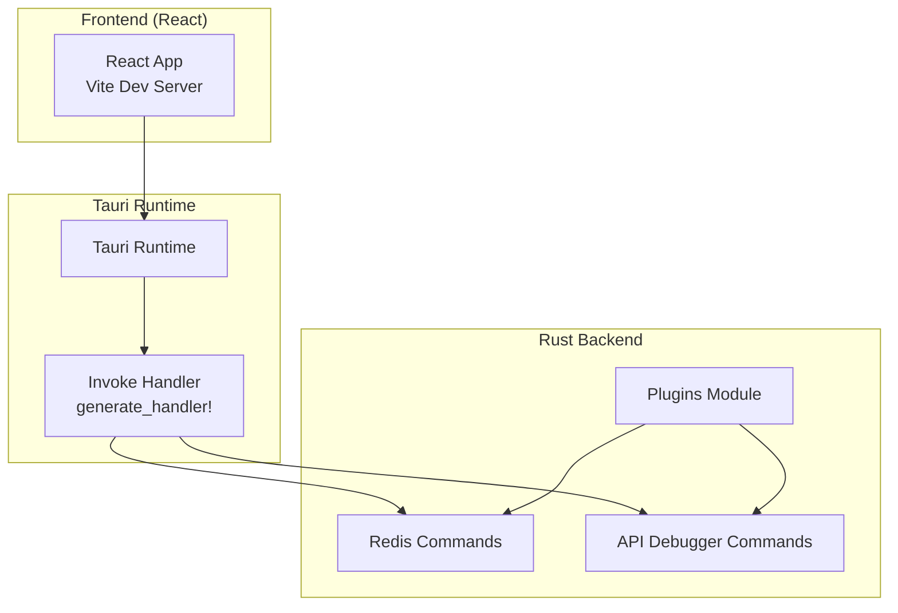
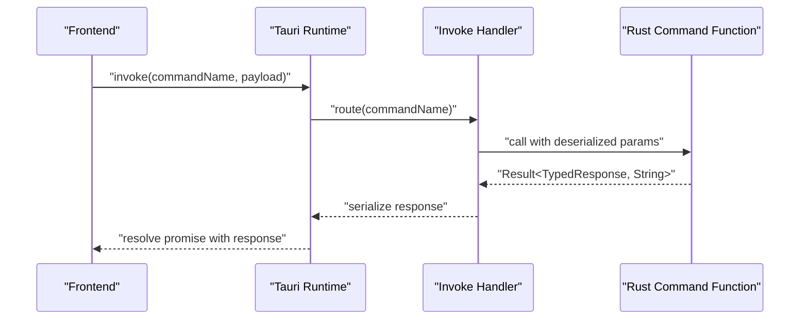
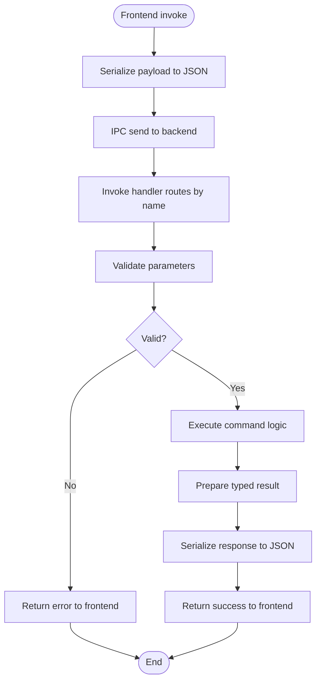
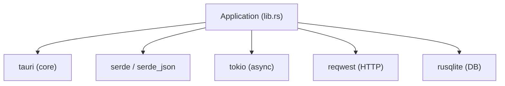

# Tauri Command System

<cite>
**Referenced Files in This Document**
- [main.rs](file://src-tauri/src/main.rs)
- [lib.rs](file://src-tauri/src/lib.rs)
- [Cargo.toml](file://src-tauri/Cargo.toml)
- [tauri.conf.json](file://src-tauri/tauri.conf.json)
- [redis/commands.rs](file://src-tauri/src/plugins/redis/commands.rs)
- [redis/types.rs](file://src-tauri/src/plugins/redis/types.rs)
- [api_debugger/commands.rs](file://src-tauri/src/plugins/api_debugger/commands.rs)
- [api_debugger/types.rs](file://src-tauri/src/plugins/api_debugger/types.rs)
</cite>

## Table of Contents
1. [Introduction](#introduction)
2. [Project Structure](#project-structure)
3. [Core Components](#core-components)
4. [Architecture Overview](#architecture-overview)
5. [Detailed Component Analysis](#detailed-component-analysis)
6. [Dependency Analysis](#dependency-analysis)
7. [Performance Considerations](#performance-considerations)
8. [Troubleshooting Guide](#troubleshooting-guide)
9. [Conclusion](#conclusion)

## Introduction
This document explains the Tauri command system used for cross-language communication between the React frontend and the Rust backend in this desktop application. It covers the typed command architecture, command registration mechanism, IPC patterns, handler generation, parameter validation, response handling, error propagation, and the end-to-end command lifecycle. It also includes debugging techniques, logging mechanisms, and performance considerations for high-frequency operations.

## Project Structure
The Tauri application is structured with a Rust backend that exposes commands via the Tauri Builder and a React frontend served by Vite. Commands are grouped by plugin (e.g., Redis, API Debugger) and registered centrally in the application initialization.

**Diagram sources**
- [lib.rs:26-259](file://src-tauri/src/lib.rs#L26-L259)
- [main.rs:4-6](file://src-tauri/src/main.rs#L4-L6)

**Section sources**
- [main.rs:4-6](file://src-tauri/src/main.rs#L4-L6)
- [lib.rs:10-262](file://src-tauri/src/lib.rs#L10-L262)
- [tauri.conf.json:6-11](file://src-tauri/tauri.conf.json#L6-L11)

## Core Components
- Tauri Builder and invoke handler: The application initializes with a Builder that registers all commands via a generated handler macro. This ensures type-safe command routing from the frontend to Rust functions.
- Plugin-based command organization: Commands are organized per plugin (e.g., Redis, API Debugger), each exposing typed functions decorated with the Tauri command attribute.
- Serialization and deserialization: Commands accept and return strongly typed structs that derive Serde serialization, enabling automatic JSON marshaling/unmarshaling across the IPC boundary.
- Error propagation: Functions return a Result type, allowing errors to propagate back to the frontend as structured error messages.

Key implementation references:
- Application entrypoint and library export: [main.rs:4-6](file://src-tauri/src/main.rs#L4-L6), [lib.rs:9-262](file://src-tauri/src/lib.rs#L9-L262)
- Command registration via generate_handler!: [lib.rs:26-259](file://src-tauri/src/lib.rs#L26-L259)
- Redis command definitions: [redis/commands.rs:139-800](file://src-tauri/src/plugins/redis/commands.rs#L139-L800)
- API debugger command definitions: [api_debugger/commands.rs:391-480](file://src-tauri/src/plugins/api_debugger/commands.rs#L391-L480)

**Section sources**
- [lib.rs:26-259](file://src-tauri/src/lib.rs#L26-L259)
- [redis/commands.rs:139-800](file://src-tauri/src/plugins/redis/commands.rs#L139-L800)
- [api_debugger/commands.rs:391-480](file://src-tauri/src/plugins/api_debugger/commands.rs#L391-L480)

## Architecture Overview
The command system follows a typed, macro-generated handler pattern:
- Frontend invokes a command by name with a payload.
- Tauri routes the command to the registered handler.
- The handler resolves to a Rust function annotated with the Tauri command attribute.
- The function validates parameters, executes logic, and returns a typed result.
- Errors are serialized and returned to the frontend.

**Diagram sources**
- [lib.rs:26-259](file://src-tauri/src/lib.rs#L26-L259)
- [redis/commands.rs:139-142](file://src-tauri/src/plugins/redis/commands.rs#L139-L142)
- [api_debugger/commands.rs:391-401](file://src-tauri/src/plugins/api_debugger/commands.rs#L391-L401)

## Detailed Component Analysis

### Typed Command Architecture
- Command attribute: Each backend function is annotated to become a callable command. This enables automatic handler generation and type-safe invocation.
- Parameter types: Functions accept strongly typed parameters derived from Serde-annotated structs. These are automatically deserialized from JSON on the Rust side.
- Return types: Functions return Result<T, String>, where T is a serializable struct. On success, T is serialized to JSON; on error, the String becomes the error message.

Examples:
- Redis connection listing: [redis/commands.rs:139-142](file://src-tauri/src/plugins/redis/commands.rs#L139-L142)
- API request preview: [api_debugger/commands.rs:391-401](file://src-tauri/src/plugins/api_debugger/commands.rs#L391-L401)

**Section sources**
- [redis/commands.rs:139-142](file://src-tauri/src/plugins/redis/commands.rs#L139-L142)
- [api_debugger/commands.rs:391-401](file://src-tauri/src/plugins/api_debugger/commands.rs#L391-L401)

### Command Registration Mechanism
- Central registration: All commands are registered in a single location using the Tauri Builder’s invoke handler. This ensures discoverability and prevents missing registrations.
- Plugin grouping: Commands are grouped under plugin modules, making the system modular and maintainable.

Registration example:
- Redis commands registration: [lib.rs:26-129](file://src-tauri/src/lib.rs#L26-L129)
- SSH commands registration: [lib.rs:70-95](file://src-tauri/src/lib.rs#L70-L95)
- S3 commands registration: [lib.rs:96-134](file://src-tauri/src/lib.rs#L96-L134)
- MongoDB commands registration: [lib.rs:135-160](file://src-tauri/src/lib.rs#L135-L160)
- MySQL commands registration: [lib.rs:161-184](file://src-tauri/src/lib.rs#L161-L184)
- Network commands registration: [lib.rs:186-192](file://src-tauri/src/lib.rs#L186-L192)
- API debugger commands registration: [lib.rs:193-212](file://src-tauri/src/lib.rs#L193-L212)
- MQ commands registration: [lib.rs:213-226](file://src-tauri/src/lib.rs#L213-L226)
- LAN chat commands registration: [lib.rs:228-247](file://src-tauri/src/lib.rs#L228-L247)
- Confluence commands registration: [lib.rs:248-258](file://src-tauri/src/lib.rs#L248-L258)

**Section sources**
- [lib.rs:26-259](file://src-tauri/src/lib.rs#L26-L259)

### IPC Patterns and Handler Generation
- Macro-based handler: The generate_handler! macro creates a centralized handler that routes incoming commands to their respective functions. This eliminates boilerplate and reduces runtime overhead.
- AppHandle usage: Many commands receive the AppHandle, enabling access to shared resources like databases and configuration during execution.

Handler generation example:
- Central handler registration: [lib.rs:26-259](file://src-tauri/src/lib.rs#L26-L259)

**Section sources**
- [lib.rs:26-259](file://src-tauri/src/lib.rs#L26-L259)

### Parameter Validation and Response Handling
- Validation patterns: Commands validate inputs early and return descriptive errors. For example, Redis DB index validation ensures safe operations.
- Response formatting: Results are formatted as typed structs, ensuring consistent payloads for the frontend.

Validation and response examples:
- Redis DB index validation: [redis/commands.rs:207-214](file://src-tauri/src/plugins/redis/commands.rs#L207-L214)
- API request preview: [api_debugger/commands.rs:391-401](file://src-tauri/src/plugins/api_debugger/commands.rs#L391-L401)

**Section sources**
- [redis/commands.rs:207-214](file://src-tauri/src/plugins/redis/commands.rs#L207-L214)
- [api_debugger/commands.rs:391-401](file://src-tauri/src/plugins/api_debugger/commands.rs#L391-L401)

### Error Propagation
- Error type: Commands return Result<T, String>, where String is propagated as the error message to the frontend.
- Frontend handling: The frontend receives structured errors and can surface them to users or log them.

Error propagation examples:
- Redis scan keys error handling: [redis/commands.rs:235-236](file://src-tauri/src/plugins/redis/commands.rs#L235-L236)
- API request send error classification: [api_debugger/commands.rs:417-444](file://src-tauri/src/plugins/api_debugger/commands.rs#L417-L444)

**Section sources**
- [redis/commands.rs:235-236](file://src-tauri/src/plugins/redis/commands.rs#L235-L236)
- [api_debugger/commands.rs:417-444](file://src-tauri/src/plugins/api_debugger/commands.rs#L417-L444)

### Async Operations and Cancellation
- Async commands: Some commands are declared async to perform I/O-bound tasks (e.g., HTTP requests).
- Cancellation pattern: While cancellation primitives are not implemented in the current code, the framework supports async execution and can be extended to support cancellation tokens or request-scoped cancellation.

Async example:
- API request send (async): [api_debugger/commands.rs:404-475](file://src-tauri/src/plugins/api_debugger/commands.rs#L404-L475)

Cancellation example:
- Placeholder cancellation command: [api_debugger/commands.rs:477-480](file://src-tauri/src/plugins/api_debugger/commands.rs#L477-L480)

**Section sources**
- [api_debugger/commands.rs:404-475](file://src-tauri/src/plugins/api_debugger/commands.rs#L404-L475)
- [api_debugger/commands.rs:477-480](file://src-tauri/src/plugins/api_debugger/commands.rs#L477-L480)

### Command Lifecycle: From Frontend Invocation to Backend Execution

**Diagram sources**
- [lib.rs:26-259](file://src-tauri/src/lib.rs#L26-L259)
- [redis/commands.rs:139-142](file://src-tauri/src/plugins/redis/commands.rs#L139-L142)
- [api_debugger/commands.rs:391-401](file://src-tauri/src/plugins/api_debugger/commands.rs#L391-L401)

### Data Models and Serialization
- Redis value representation: A sealed enum captures Redis protocol responses, enabling robust conversion and error reporting.
- API debugger request/response models: Rich models define request composition, response metadata, and history storage.

Redis value model:
- [redis/types.rs:89-96](file://src-tauri/src/plugins/redis/types.rs#L89-L96)

API debugger models:
- [api_debugger/types.rs:35-49](file://src-tauri/src/plugins/api_debugger/types.rs#L35-L49)
- [api_debugger/types.rs:69-82](file://src-tauri/src/plugins/api_debugger/types.rs#L69-L82)

**Section sources**
- [redis/types.rs:89-96](file://src-tauri/src/plugins/redis/types.rs#L89-L96)
- [api_debugger/types.rs:35-49](file://src-tauri/src/plugins/api_debugger/types.rs#L35-L49)
- [api_debugger/types.rs:69-82](file://src-tauri/src/plugins/api_debugger/types.rs#L69-L82)

## Dependency Analysis
The backend depends on Tauri and various ecosystem crates for networking, databases, and serialization. The command system leverages these dependencies to implement plugin-specific functionality.

**Diagram sources**
- [Cargo.toml:20-48](file://src-tauri/Cargo.toml#L20-L48)
- [lib.rs:10-262](file://src-tauri/src/lib.rs#L10-L262)

**Section sources**
- [Cargo.toml:20-48](file://src-tauri/Cargo.toml#L20-L48)
- [lib.rs:10-262](file://src-tauri/src/lib.rs#L10-L262)

## Performance Considerations
- Prefer batch operations where possible to reduce IPC overhead.
- Limit response sizes for large payloads; truncate or stream when appropriate.
- Use timeouts and cancellation for long-running operations to avoid blocking the UI thread.
- Cache frequently accessed data in memory or minimize repeated database queries.
- Avoid unnecessary serialization/deserialization by reusing typed models.

## Troubleshooting Guide
- Logging: Use the development logging facility to record events and errors during command execution.
- Error messages: Inspect the error strings returned by commands to diagnose failures quickly.
- Frontend diagnostics: Capture request/response snapshots and inspect sensitive data masking behavior.

Logging example:
- Development log recording: [lib.rs:22-24](file://src-tauri/src/lib.rs#L22-L24)

Sensitive data masking:
- Masking utilities for headers, cookies, and auth: [api_debugger/commands.rs:47-88](file://src-tauri/src/plugins/api_debugger/commands.rs#L47-L88)

**Section sources**
- [lib.rs:22-24](file://src-tauri/src/lib.rs#L22-L24)
- [api_debugger/commands.rs:47-88](file://src-tauri/src/plugins/api_debugger/commands.rs#L47-L88)

## Conclusion
The Tauri command system in this project provides a robust, typed, and scalable foundation for cross-language communication. By organizing commands per plugin, centralizing registration, and leveraging Serde for serialization, the system ensures reliability, maintainability, and performance. Extending the system with cancellation and advanced logging will further improve operability for high-frequency and long-running operations.