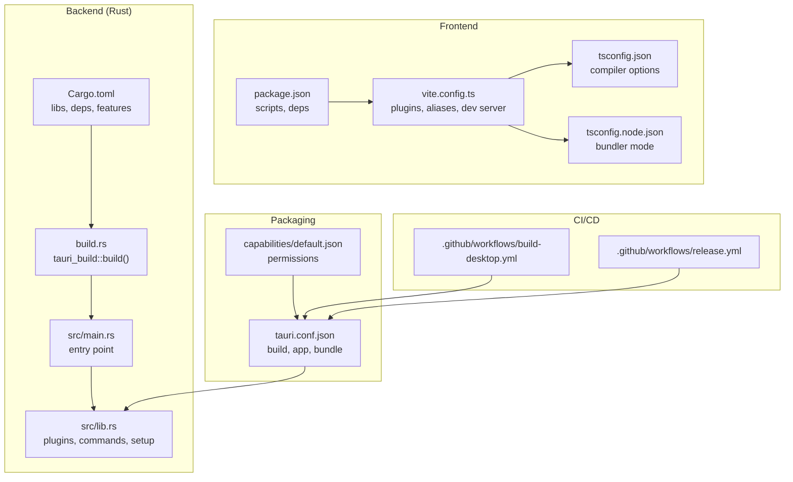
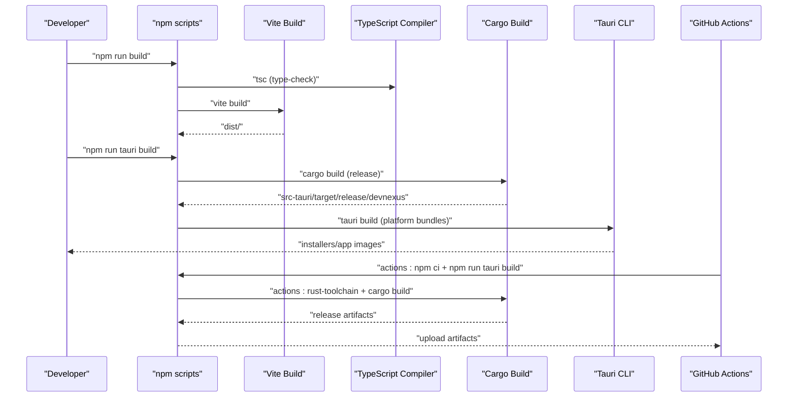
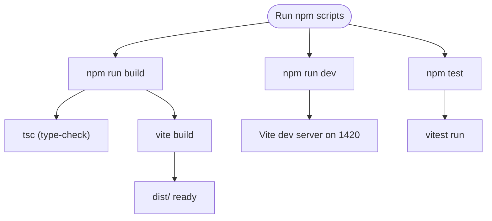
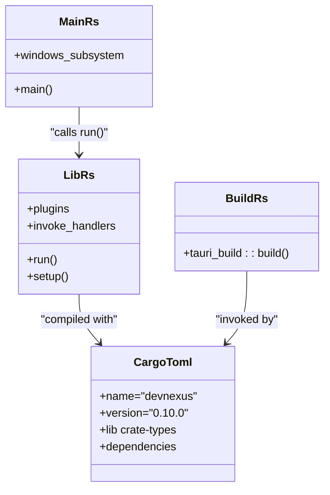
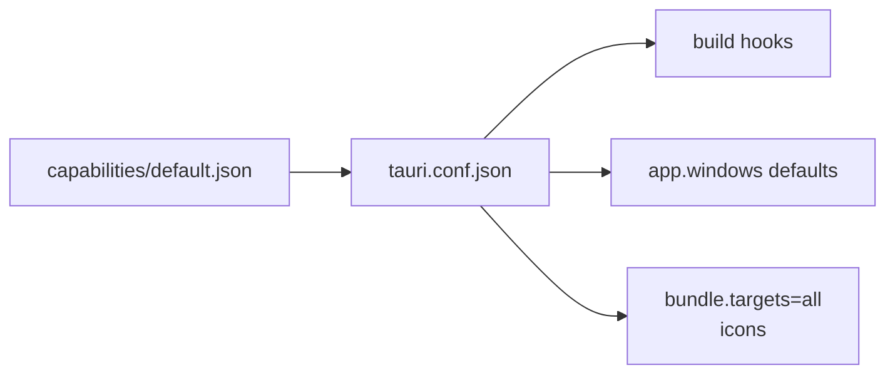
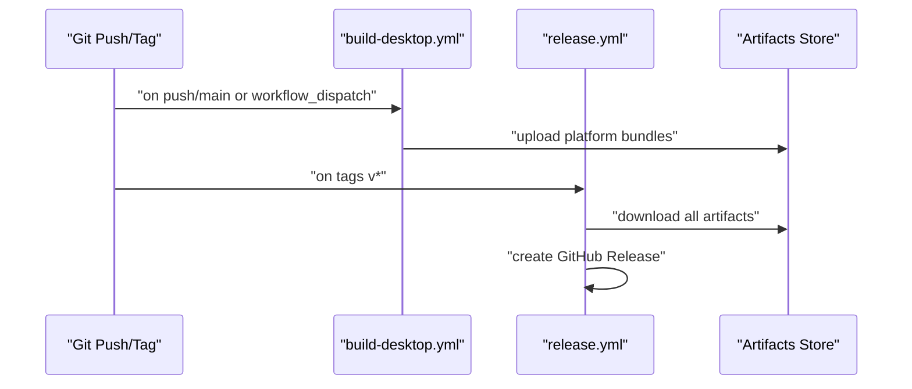
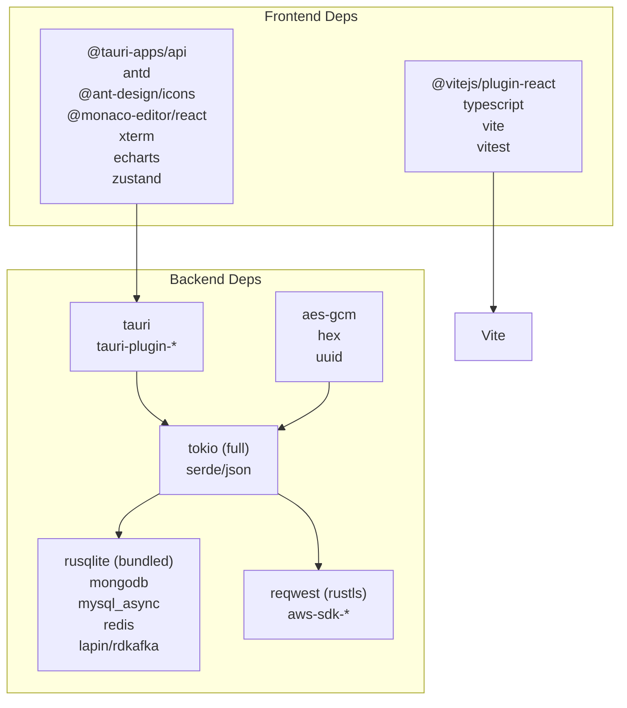

# Build System & Deployment

<cite>
**Referenced Files in This Document**
- [package.json](file://package.json)
- [vite.config.ts](file://vite.config.ts)
- [tsconfig.json](file://tsconfig.json)
- [tsconfig.node.json](file://tsconfig.node.json)
- [src-tauri/Cargo.toml](file://src-tauri/Cargo.toml)
- [src-tauri/tauri.conf.json](file://src-tauri/tauri.conf.json)
- [src-tauri/build.rs](file://src-tauri/build.rs)
- [src-tauri/src/main.rs](file://src-tauri/src/main.rs)
- [src-tauri/src/lib.rs](file://src-tauri/src/lib.rs)
- [src-tauri/capabilities/default.json](file://src-tauri/capabilities/default.json)
- [.github/workflows/build-desktop.yml](file://.github/workflows/build-desktop.yml)
- [.github/workflows/release.yml](file://.github/workflows/release.yml)
- [README.md](file://README.md)
</cite>

## Table of Contents
1. [Introduction](#introduction)
2. [Project Structure](#project-structure)
3. [Core Components](#core-components)
4. [Architecture Overview](#architecture-overview)
5. [Detailed Component Analysis](#detailed-component-analysis)
6. [Dependency Analysis](#dependency-analysis)
7. [Performance Considerations](#performance-considerations)
8. [Troubleshooting Guide](#troubleshooting-guide)
9. [Conclusion](#conclusion)
10. [Appendices](#appendices)

## Introduction
This document explains the DevNexus build system and deployment processes. It covers frontend build configuration using Vite and TypeScript, Rust backend compilation and dependency management, Tauri packaging and capability configuration, CI/CD pipelines with GitHub Actions, and platform-specific deployment instructions for Windows, macOS, and Linux. It also addresses build optimization, bundle size management, and distribution strategies.

## Project Structure
DevNexus follows a clear separation between the frontend and backend:
- Frontend: React 19, TypeScript, Vite, with tests powered by Vitest.
- Backend: Rust/Tokio-based Tauri 2 application with plugin commands and system capabilities.
- Packaging: Tauri bundles desktop installers and app images per platform.
- CI/CD: GitHub Actions workflows build and release artifacts for all supported platforms.

**Diagram sources**
- [package.json:1-47](file://package.json#L1-L47)
- [vite.config.ts:1-42](file://vite.config.ts#L1-L42)
- [tsconfig.json:1-30](file://tsconfig.json#L1-L30)
- [tsconfig.node.json:1-11](file://tsconfig.node.json#L1-L11)
- [src-tauri/Cargo.toml:1-49](file://src-tauri/Cargo.toml#L1-L49)
- [src-tauri/build.rs:1-4](file://src-tauri/build.rs#L1-L4)
- [src-tauri/src/main.rs:1-7](file://src-tauri/src/main.rs#L1-L7)
- [src-tauri/src/lib.rs:1-263](file://src-tauri/src/lib.rs#L1-L263)
- [src-tauri/tauri.conf.json:1-39](file://src-tauri/tauri.conf.json#L1-L39)
- [src-tauri/capabilities/default.json:1-18](file://src-tauri/capabilities/default.json#L1-L18)
- [.github/workflows/build-desktop.yml:1-142](file://.github/workflows/build-desktop.yml#L1-L142)
- [.github/workflows/release.yml:1-178](file://.github/workflows/release.yml#L1-L178)

**Section sources**
- [README.md:58-99](file://README.md#L58-L99)
- [README.md:257-298](file://README.md#L257-L298)

## Core Components
- Frontend build and type-check: Vite with React plugin, TypeScript compiler options, and Vitest for unit tests.
- Backend build and dependencies: Cargo workspace with Tauri 2 libraries, Tokio runtime, and platform crates.
- Tauri configuration: Dev/build URLs, window configuration, and cross-platform bundling.
- CI/CD: Automated desktop builds and releases across Windows, macOS, and Linux.

**Section sources**
- [package.json:6-14](file://package.json#L6-L14)
- [vite.config.ts:9-42](file://vite.config.ts#L9-L42)
- [tsconfig.json:2-26](file://tsconfig.json#L2-L26)
- [tsconfig.node.json:1-11](file://tsconfig.node.json#L1-L11)
- [src-tauri/Cargo.toml:10-49](file://src-tauri/Cargo.toml#L10-L49)
- [src-tauri/tauri.conf.json:6-38](file://src-tauri/tauri.conf.json#L6-L38)

## Architecture Overview
The build and packaging pipeline integrates frontend and backend:

**Diagram sources**
- [package.json:7-13](file://package.json#L7-L13)
- [vite.config.ts:9-42](file://vite.config.ts#L9-L42)
- [src-tauri/Cargo.toml:10-15](file://src-tauri/Cargo.toml#L10-L15)
- [src-tauri/src/main.rs:4-6](file://src-tauri/src/main.rs#L4-L6)
- [.github/workflows/build-desktop.yml:28-32](file://.github/workflows/build-desktop.yml#L28-L32)
- [.github/workflows/release.yml:27-31](file://.github/workflows/release.yml#L27-L31)

## Detailed Component Analysis

### Frontend Build Configuration (Vite + TypeScript)
- Scripts orchestrate development, production build, linting, testing, and preview.
- Vite configuration:
  - React plugin enabled.
  - Path alias for "@/*" pointing to src/.
  - Test glob configured under tests/**/*.test.ts.
  - Tauri-specific dev server options:
    - Fixed port 1420 with strictPort=true.
    - Optional host and HMR settings controlled by TAURI_DEV_HOST.
    - Ignores src-tauri during watch.
- TypeScript configuration:
  - ES2020 target, DOM/DOM.Iterable libs.
  - Bundler module resolution, JSX transform, JSON module support.
  - Strict linting flags enabled.
  - Path mapping mirrors Vite alias.

**Diagram sources**
- [package.json:6-14](file://package.json#L6-L14)
- [vite.config.ts:9-42](file://vite.config.ts#L9-L42)
- [tsconfig.json:2-26](file://tsconfig.json#L2-L26)

**Section sources**
- [package.json:6-14](file://package.json#L6-L14)
- [vite.config.ts:9-42](file://vite.config.ts#L9-L42)
- [tsconfig.json:2-26](file://tsconfig.json#L2-L26)
- [tsconfig.node.json:1-11](file://tsconfig.node.json#L1-L11)

### Rust Backend Compilation and Dependencies
- Library configuration:
  - Named devnexus_lib with staticlib, cdylib, and rlib crate types for flexibility.
  - Tauri 2 core and plugin crates included.
  - Tokio full runtime, rusqlite with bundled SQLite, encryption, UUID, networking, cloud SDKs, async traits, databases, and messaging stacks.
- Entry points:
  - main.rs sets Windows subsystem and delegates to lib.rs run().
  - lib.rs initializes plugins, sets up macOS decorations, initializes database, logs startup, and registers hundreds of invoke handlers for plugin commands.
- Build integration:
  - build.rs invokes tauri_build to integrate Tauri’s procedural build steps.

**Diagram sources**
- [src-tauri/src/main.rs:1-7](file://src-tauri/src/main.rs#L1-L7)
- [src-tauri/src/lib.rs:9-262](file://src-tauri/src/lib.rs#L9-L262)
- [src-tauri/Cargo.toml:10-49](file://src-tauri/Cargo.toml#L10-L49)
- [src-tauri/build.rs:1-4](file://src-tauri/build.rs#L1-L4)

**Section sources**
- [src-tauri/Cargo.toml:10-49](file://src-tauri/Cargo.toml#L10-L49)
- [src-tauri/src/main.rs:1-7](file://src-tauri/src/main.rs#L1-L7)
- [src-tauri/src/lib.rs:9-262](file://src-tauri/src/lib.rs#L9-L262)
- [src-tauri/build.rs:1-4](file://src-tauri/build.rs#L1-L4)

### Tauri Packaging and Capability Management
- Application configuration:
  - Product name, version, identifier.
  - Dev/build hooks: beforeDevCommand, devUrl, beforeBuildCommand, frontendDist.
  - Window defaults: size, min sizes, decorations disabled.
  - Security: CSP set to null.
  - Bundling: active, targets all, icon assets for multiple formats.
- Capabilities:
  - default capability grants permissions for core window controls, opener, dialog, and fs plugins to the main window.

**Diagram sources**
- [src-tauri/tauri.conf.json:1-39](file://src-tauri/tauri.conf.json#L1-L39)
- [src-tauri/capabilities/default.json:1-18](file://src-tauri/capabilities/default.json#L1-L18)

**Section sources**
- [src-tauri/tauri.conf.json:6-38](file://src-tauri/tauri.conf.json#L6-L38)
- [src-tauri/capabilities/default.json:1-18](file://src-tauri/capabilities/default.json#L1-L18)

### CI/CD Pipeline (GitHub Actions)
- build-desktop.yml:
  - Windows: Node 20, Rust stable, npm ci, tauri build with nsis bundle, upload artifacts.
  - macOS: Matrix builds for x64 and arm64; installs Rust target, npm ci, tauri build with app and dmg bundles, collect and upload artifacts.
  - Linux: Installs system dependencies, npm ci, tauri build with deb and appimage bundles, upload artifacts.
- release.yml:
  - Mirrors build-desktop.yml steps, adds Windows portable zip packaging, downloads all artifacts, and publishes a GitHub Release with release notes.

**Diagram sources**
- [.github/workflows/build-desktop.yml:1-142](file://.github/workflows/build-desktop.yml#L1-L142)
- [.github/workflows/release.yml:1-178](file://.github/workflows/release.yml#L1-L178)

**Section sources**
- [.github/workflows/build-desktop.yml:12-142](file://.github/workflows/build-desktop.yml#L12-L142)
- [.github/workflows/release.yml:11-178](file://.github/workflows/release.yml#L11-L178)

### Deployment Instructions

#### Windows
- Build installer:
  - Use the nsis bundle target via the Tauri CLI.
- Portable build:
  - The release workflow packages a portable zip containing the executable and a README with usage notes.

**Section sources**
- [.github/workflows/build-desktop.yml:31-40](file://.github/workflows/build-desktop.yml#L31-L40)
- [.github/workflows/release.yml:33-51](file://.github/workflows/release.yml#L33-L51)
- [README.md:148-163](file://README.md#L148-L163)

#### macOS
- Build app and DMG:
  - Use the Tauri CLI with app and dmg bundles.
- Multi-architecture:
  - Separate x64 and arm64 runners produce distinct artifacts.

**Section sources**
- [.github/workflows/build-desktop.yml:72-96](file://.github/workflows/build-desktop.yml#L72-L96)
- [.github/workflows/release.yml:93-110](file://.github/workflows/release.yml#L93-L110)
- [README.md:151-153](file://README.md#L151-L153)

#### Linux
- Build packages:
  - Use the Tauri CLI with deb and appimage bundles.
- System dependencies:
  - The workflow installs required GTK, WebKit, AppIndicator, SVG, curl, and patchelf packages.

**Section sources**
- [.github/workflows/build-desktop.yml:126-142](file://.github/workflows/build-desktop.yml#L126-L142)
- [.github/workflows/release.yml:139-149](file://.github/workflows/release.yml#L139-L149)
- [README.md:154-156](file://README.md#L154-L156)

## Dependency Analysis
- Frontend dependencies include React 19, Ant Design, Monaco Editor, xterm.js, ECharts, and Zustand.
- Dev dependencies include Vite, TypeScript, React plugin, and Vitest.
- Backend dependencies span Tauri plugins, Tokio runtime, encryption, UUID, database drivers, async networking, and cloud SDKs.

**Diagram sources**
- [package.json:15-45](file://package.json#L15-L45)
- [src-tauri/Cargo.toml:20-49](file://src-tauri/Cargo.toml#L20-L49)

**Section sources**
- [package.json:15-45](file://package.json#L15-L45)
- [src-tauri/Cargo.toml:20-49](file://src-tauri/Cargo.toml#L20-L49)

## Performance Considerations
- Frontend:
  - Vite dev server uses a fixed port and strictPort to avoid conflicts and improve reliability.
  - Ignoring src-tauri in Vite watch reduces unnecessary rebuilds.
  - TypeScript bundler mode and isolated modules help optimize build performance.
- Backend:
  - Tokio full runtime enables efficient async I/O for database, network, and cloud operations.
  - rusqlite with bundled SQLite avoids external dependencies for local storage.
- CI/CD:
  - Caching Node.js dependencies via npm ci improves workflow speed.
  - Platform-specific system dependencies are installed once per job.

**Section sources**
- [vite.config.ts:23-40](file://vite.config.ts#L23-L40)
- [tsconfig.json:9-15](file://tsconfig.json#L9-L15)
- [src-tauri/Cargo.toml:27-31](file://src-tauri/Cargo.toml#L27-L31)
- [.github/workflows/build-desktop.yml:22-23](file://.github/workflows/build-desktop.yml#L22-L23)

## Troubleshooting Guide
- Vite large chunk warnings:
  - The project acknowledges a current Vite large-chunk warning; it does not block release if exit code is zero.
- Unused Rust warning:
  - An existing unused RedisConnectionType warning is noted; it does not block release if exit code is zero.
- Development server port conflicts:
  - The dev server enforces port 1420 with strictPort=true; ensure the port is free or adjust configuration.
- macOS decorations:
  - The macOS setup toggles window decorations in the app setup; verify window appearance expectations.
- CI/CD artifacts:
  - Verify that artifacts are uploaded and downloaded correctly across jobs; check artifact paths and names.

**Section sources**
- [README.md:140](file://README.md#L140)
- [README.md:338](file://README.md#L338)
- [vite.config.ts:25-29](file://vite.config.ts#L25-L29)
- [src-tauri/src/lib.rs:15-25](file://src-tauri/src/lib.rs#L15-L25)
- [.github/workflows/build-desktop.yml:34-39](file://.github/workflows/build-desktop.yml#L34-L39)
- [.github/workflows/release.yml:158-164](file://.github/workflows/release.yml#L158-L164)

## Conclusion
DevNexus employs a robust build and deployment pipeline integrating Vite/TypeScript for the frontend, Cargo/Tauri for the backend, and GitHub Actions for cross-platform CI/CD. The configuration emphasizes reproducibility, capability scoping, and streamlined release automation across Windows, macOS, and Linux.

## Appendices

### Build Commands Reference
- Local development:
  - Start Vite dev server only.
  - Start full Tauri desktop app.
- Verification:
  - Run Vitest tests.
  - Type-check and build the frontend.
  - Check the Rust backend.
- Production build:
  - Use the Tauri CLI to build platform-specific bundles.

**Section sources**
- [README.md:113-141](file://README.md#L113-L141)
- [README.md:311-338](file://README.md#L311-L338)
- [README.md:340-354](file://README.md#L340-L354)