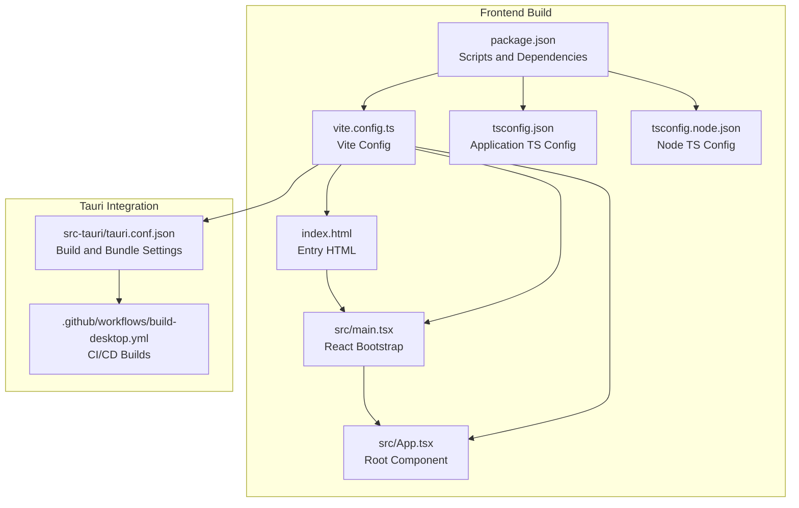
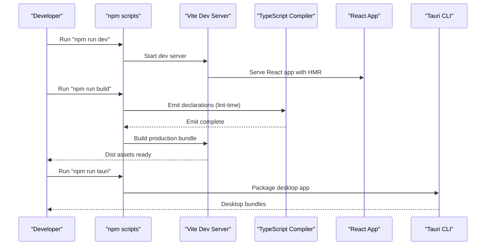
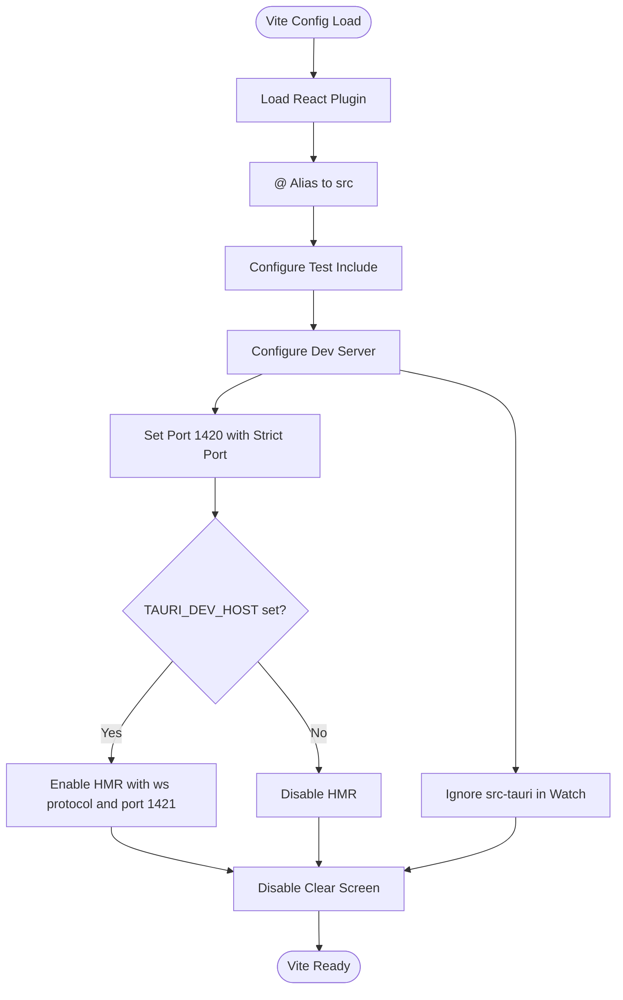
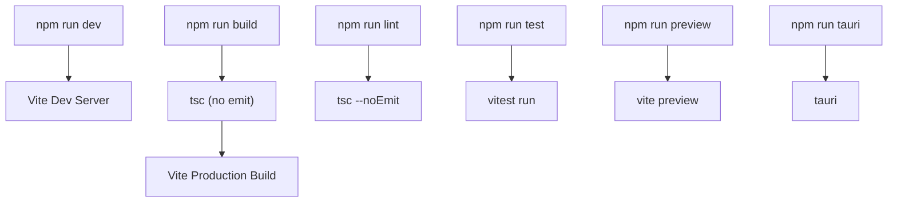
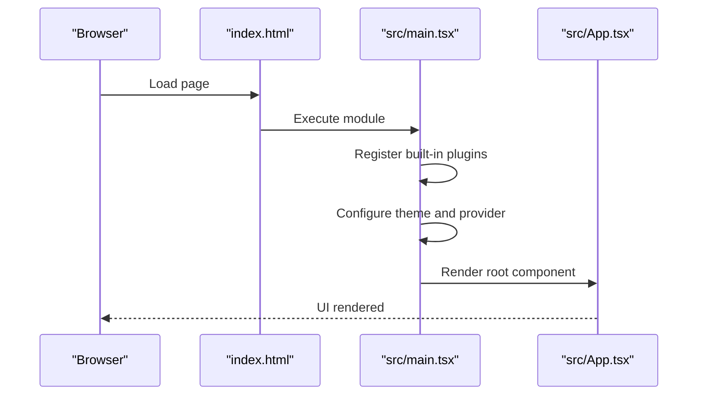
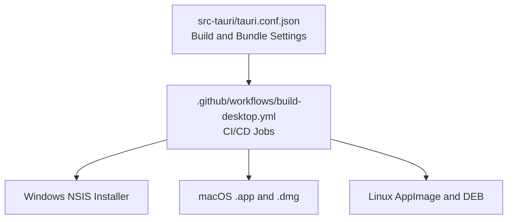
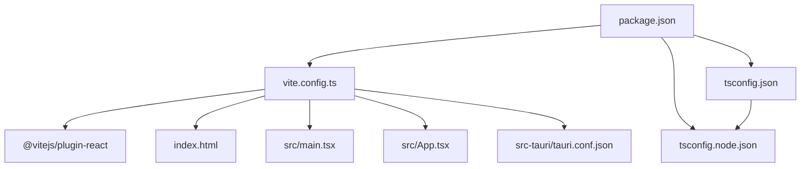

# Frontend Build Configuration

<cite>
**Referenced Files in This Document**
- [package.json](file://package.json)
- [vite.config.ts](file://vite.config.ts)
- [tsconfig.json](file://tsconfig.json)
- [tsconfig.node.json](file://tsconfig.node.json)
- [index.html](file://index.html)
- [src/main.tsx](file://src/main.tsx)
- [src/App.tsx](file://src/App.tsx)
- [src/vite-env.d.ts](file://src/vite-env.d.ts)
- [src-tauri/tauri.conf.json](file://src-tauri/tauri.conf.json)
- [.github/workflows/build-desktop.yml](file://.github/workflows/build-desktop.yml)
</cite>

## Table of Contents
1. [Introduction](#introduction)
2. [Project Structure](#project-structure)
3. [Core Components](#core-components)
4. [Architecture Overview](#architecture-overview)
5. [Detailed Component Analysis](#detailed-component-analysis)
6. [Dependency Analysis](#dependency-analysis)
7. [Performance Considerations](#performance-considerations)
8. [Troubleshooting Guide](#troubleshooting-guide)
9. [Conclusion](#conclusion)

## Introduction
This document provides comprehensive documentation for the frontend build system configuration of the project. It covers the Vite build setup for both development and production, TypeScript compilation and type checking, module resolution, and the build scripts defined in package.json. It also explains how the build integrates with Tauri for desktop packaging and outlines optimization strategies and customization guidance for build targets and environment variables.

## Project Structure
The frontend build system centers around Vite and TypeScript configurations, with Tauri orchestrating the development server and bundling process. Key files include:
- Vite configuration for plugin integration, aliasing, and server behavior
- TypeScript configurations for application and Node environments
- Package scripts for development, building, testing, and previewing
- HTML entry point and React application bootstrap
- Tauri configuration linking frontend build outputs to desktop packaging



**Diagram sources**
- [package.json:1-47](file://package.json#L1-L47)
- [vite.config.ts:1-42](file://vite.config.ts#L1-L42)
- [tsconfig.json:1-30](file://tsconfig.json#L1-L30)
- [tsconfig.node.json:1-11](file://tsconfig.node.json#L1-L11)
- [index.html:1-15](file://index.html#L1-L15)
- [src/main.tsx:1-38](file://src/main.tsx#L1-L38)
- [src/App.tsx:1-11](file://src/App.tsx#L1-L11)
- [src-tauri/tauri.conf.json:1-39](file://src-tauri/tauri.conf.json#L1-L39)
- [.github/workflows/build-desktop.yml:1-142](file://.github/workflows/build-desktop.yml#L1-L142)

**Section sources**
- [package.json:1-47](file://package.json#L1-L47)
- [vite.config.ts:1-42](file://vite.config.ts#L1-L42)
- [tsconfig.json:1-30](file://tsconfig.json#L1-L30)
- [tsconfig.node.json:1-11](file://tsconfig.node.json#L1-L11)
- [index.html:1-15](file://index.html#L1-L15)
- [src/main.tsx:1-38](file://src/main.tsx#L1-L38)
- [src/App.tsx:1-11](file://src/App.tsx#L1-L11)
- [src-tauri/tauri.conf.json:1-39](file://src-tauri/tauri.conf.json#L1-L39)
- [.github/workflows/build-desktop.yml:1-142](file://.github/workflows/build-desktop.yml#L1-L142)

## Core Components
This section documents the primary build components and their roles in the system.

- Vite Configuration
  - Plugin integration: React Fast Refresh and JSX transform
  - Module aliasing: @ resolves to src for clean imports
  - Test configuration: glob pattern for test files
  - Development server: fixed port, strict port enforcement, optional HMR host, and ignored watch patterns for Tauri backend
  - Screen clearing disabled to preserve Rust error visibility during Tauri development

- TypeScript Configuration
  - Application TS config: ESNext module, DOM/DOM.Iterable libraries, bundler module resolution, isolated modules, JSX transform, strict mode, unused checks, and path mapping
  - Node TS config: ESNext module for Vite config and bundler resolution
  - References: application TS config references Node TS config

- Package Scripts
  - dev: starts Vite dev server
  - build: runs TypeScript emit followed by Vite build
  - lint: type-check only (no emit)
  - test/test:watch: runs Vitest tests
  - preview: serves built assets locally
  - tauri: invokes Tauri CLI

- HTML Entry Point
  - Minimal HTML with a root div and script tag pointing to the React entry module

- React Application Bootstrap
  - Registers built-in plugins, sets up theme provider, and mounts the root component

**Section sources**
- [vite.config.ts:1-42](file://vite.config.ts#L1-L42)
- [tsconfig.json:1-30](file://tsconfig.json#L1-L30)
- [tsconfig.node.json:1-11](file://tsconfig.node.json#L1-L11)
- [package.json:6-14](file://package.json#L6-L14)
- [index.html:1-15](file://index.html#L1-L15)
- [src/main.tsx:1-38](file://src/main.tsx#L1-L38)
- [src/App.tsx:1-11](file://src/App.tsx#L1-L11)

## Architecture Overview
The build system architecture integrates Vite, TypeScript, and Tauri to deliver a development and production workflow optimized for desktop applications.



**Diagram sources**
- [package.json:6-14](file://package.json#L6-L14)
- [vite.config.ts:9-41](file://vite.config.ts#L9-L41)
- [tsconfig.json:2-26](file://tsconfig.json#L2-L26)
- [src-tauri/tauri.conf.json:6-11](file://src-tauri/tauri.conf.json#L6-L11)

## Detailed Component Analysis

### Vite Configuration Analysis
Key aspects of the Vite configuration:
- Plugin stack: React plugin for Fast Refresh and JSX transform
- Alias: @ resolves to src for concise imports
- Test scope: Vitest configured to include test files under tests/
- Development server:
  - Fixed port 1420 with strictPort to ensure Tauri compatibility
  - Optional host binding via TAURI_DEV_HOST environment variable
  - Hot Module Replacement (HMR) enabled when host is set, with explicit ws protocol and port 1421
  - Watch ignores src-tauri to avoid unnecessary rebuilds during Rust development
- Screen clearing disabled to preserve Rust error visibility during Tauri development



**Diagram sources**
- [vite.config.ts:9-41](file://vite.config.ts#L9-L41)

**Section sources**
- [vite.config.ts:1-42](file://vite.config.ts#L1-L42)

### TypeScript Configuration Analysis
TypeScript configuration ensures modern JavaScript output with strong typing and efficient bundling:
- Target and Libraries: ES2020 target with DOM and DOM.Iterable libraries
- Module System: ESNext modules with bundler module resolution
- Type Checking: No emit for type checking, isolated modules, and JSX transform
- Path Mapping: BaseUrl and paths for @ alias
- Strictness: Strict mode, unused locals and parameters, switch exhaustiveness
- Node Environment: Separate TS config for Vite config with bundler resolution

```mermaid
classDiagram
class TSConfig {
+target : "ES2020"
+lib : ["ES2020","DOM","DOM.Iterable"]
+module : "ESNext"
+moduleResolution : "bundler"
+jsx : "react-jsx"
+baseUrl : "."
+paths : {"@/*" : ["src/*"]}
+strict : true
+noEmit : true
}
class TSNodeConfig {
+module : "ESNext"
+moduleResolution : "bundler"
+allowSyntheticDefaultImports : true
}
TSConfig --> TSNodeConfig : "references"
```

**Diagram sources**
- [tsconfig.json:2-26](file://tsconfig.json#L2-L26)
- [tsconfig.node.json:2-8](file://tsconfig.node.json#L2-L8)

**Section sources**
- [tsconfig.json:1-30](file://tsconfig.json#L1-L30)
- [tsconfig.node.json:1-11](file://tsconfig.node.json#L1-L11)

### Build Scripts Analysis
The package.json scripts define the complete frontend build lifecycle:
- dev: launches Vite dev server for interactive development
- build: performs TypeScript emit (lint-time) then Vite production build
- lint: runs TypeScript type checking without emitting
- test/test:watch: executes Vitest tests in run or watch modes
- preview: serves the production build locally
- tauri: invokes Tauri CLI for desktop packaging



**Diagram sources**
- [package.json:6-14](file://package.json#L6-L14)

**Section sources**
- [package.json:6-14](file://package.json#L6-L14)

### HTML Entry Point and React Bootstrap
The HTML entry point initializes the React application:
- Minimal HTML with UTF-8 charset, viewport meta, and favicon
- Single root div for mounting the React application
- Script tag loads the React entry module

The React bootstrap registers built-in plugins, applies theme configuration, and renders the root component tree.



**Diagram sources**
- [index.html:1-15](file://index.html#L1-L15)
- [src/main.tsx:1-38](file://src/main.tsx#L1-L38)
- [src/App.tsx:1-11](file://src/App.tsx#L1-L11)

**Section sources**
- [index.html:1-15](file://index.html#L1-L15)
- [src/main.tsx:1-38](file://src/main.tsx#L1-L38)
- [src/App.tsx:1-11](file://src/App.tsx#L1-L11)

### Tauri Integration and CI/CD
Tauri coordinates the frontend build with desktop packaging:
- Build settings: beforeDevCommand, devUrl, beforeBuildCommand, and frontendDist
- Window configuration and security policies
- Bundle targets and icons for multiple platforms

CI/CD workflows orchestrate cross-platform builds using Node.js 20 and Rust toolchains, installing dependencies with npm ci and invoking Tauri build with platform-specific targets and bundles.



**Diagram sources**
- [src-tauri/tauri.conf.json:6-11](file://src-tauri/tauri.conf.json#L6-L11)
- [.github/workflows/build-desktop.yml:31-141](file://.github/workflows/build-desktop.yml#L31-L141)

**Section sources**
- [src-tauri/tauri.conf.json:1-39](file://src-tauri/tauri.conf.json#L1-L39)
- [.github/workflows/build-desktop.yml:1-142](file://.github/workflows/build-desktop.yml#L1-L142)

## Dependency Analysis
This section examines the relationships between build components and external dependencies.



**Diagram sources**
- [vite.config.ts:1-42](file://vite.config.ts#L1-L42)
- [package.json:15-45](file://package.json#L15-L45)
- [tsconfig.json:27-28](file://tsconfig.json#L27-L28)
- [index.html:1-15](file://index.html#L1-L15)
- [src/main.tsx:1-38](file://src/main.tsx#L1-L38)
- [src/App.tsx:1-11](file://src/App.tsx#L1-L11)
- [src-tauri/tauri.conf.json:6-11](file://src-tauri/tauri.conf.json#L6-L11)

**Section sources**
- [vite.config.ts:1-42](file://vite.config.ts#L1-L42)
- [package.json:15-45](file://package.json#L15-L45)
- [tsconfig.json:27-28](file://tsconfig.json#L27-L28)
- [index.html:1-15](file://index.html#L1-L15)
- [src/main.tsx:1-38](file://src/main.tsx#L1-L38)
- [src/App.tsx:1-11](file://src/App.tsx#L1-L11)
- [src-tauri/tauri.conf.json:6-11](file://src-tauri/tauri.conf.json#L6-L11)

## Performance Considerations
- Module Resolution: Using bundler module resolution and path aliases reduces bundle size and improves build performance.
- Isolated Modules: Enabled to improve incremental compilation performance.
- No Emit for Type Checking: Lint command runs type checking without emitting, keeping the build pipeline fast.
- Fixed Port and Strict Port: Ensures deterministic development and avoids port conflicts during Tauri development.
- HMR Optimization: Conditional HMR enables faster reloads in hosted development scenarios.
- Ignored Watch Paths: Prevents unnecessary rebuilds by ignoring the Rust backend directory.

## Troubleshooting Guide
Common issues and resolutions:
- Port Conflicts During Development
  - Symptom: Vite fails to start or Tauri cannot connect
  - Resolution: Ensure port 1420 is free; Vite enforces strict port mode
  - Reference: [vite.config.ts:25-27](file://vite.config.ts#L25-L27)

- HMR Not Working Behind Proxy or Remote Host
  - Symptom: Changes do not hot reload
  - Resolution: Set TAURI_DEV_HOST to enable HMR with ws protocol and port 1421
  - Reference: [vite.config.ts:5-6](file://vite.config.ts#L5-L6), [vite.config.ts:29-35](file://vite.config.ts#L29-L35)

- TypeScript Errors Obscured by Vite Clear Screen
  - Symptom: Rust compilation errors hidden during Tauri dev
  - Resolution: Vite disables screen clearing to preserve error visibility
  - Reference: [vite.config.ts:23](file://vite.config.ts#L23)

- Incorrect Module Resolution After Renaming Directories
  - Symptom: Import errors after refactoring
  - Resolution: Update path aliases in both tsconfig.json and vite.config.ts
  - References: [tsconfig.json:17-19](file://tsconfig.json#L17-L19), [vite.config.ts:11-15](file://vite.config.ts#L11-L15)

- CI/CD Build Failures on Linux
  - Symptom: Missing system dependencies during Tauri build
  - Resolution: Install required packages before building (webkitgtk, gtk, appindicator, curl, patchelf)
  - Reference: [.github/workflows/build-desktop.yml:112-121](file://.github/workflows/build-desktop.yml#L112-L121)

**Section sources**
- [vite.config.ts:5-6](file://vite.config.ts#L5-L6)
- [vite.config.ts:23](file://vite.config.ts#L23)
- [vite.config.ts:25-27](file://vite.config.ts#L25-L27)
- [vite.config.ts:11-15](file://vite.config.ts#L11-L15)
- [tsconfig.json:17-19](file://tsconfig.json#L17-L19)
- [.github/workflows/build-desktop.yml:112-121](file://.github/workflows/build-desktop.yml#L112-L121)

## Conclusion
The frontend build system leverages Vite and TypeScript to provide a robust development and production workflow integrated with Tauri for desktop packaging. The configuration emphasizes predictable ports, efficient module resolution, strict type checking, and streamlined CI/CD pipelines. By following the guidelines and troubleshooting tips outlined here, developers can customize build targets, optimize development workflows, and maintain reliable builds across platforms.