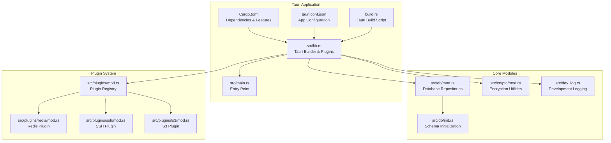
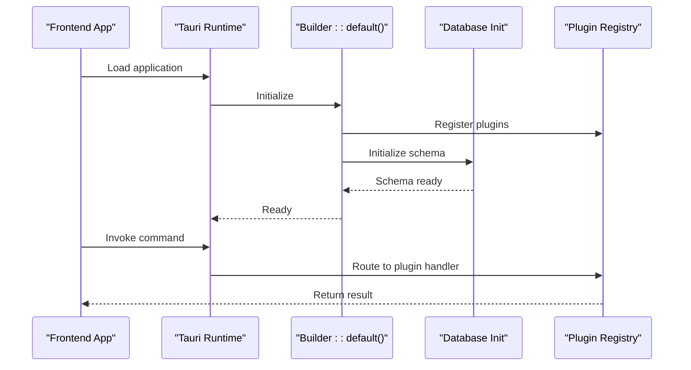
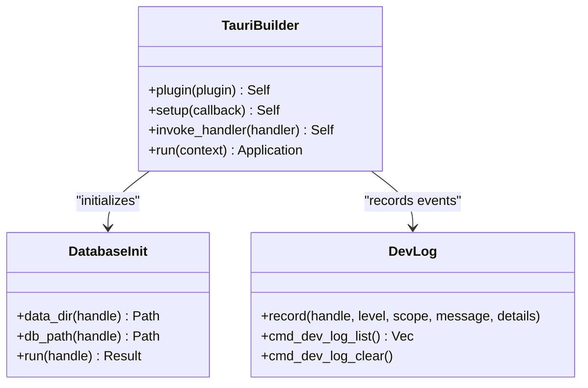
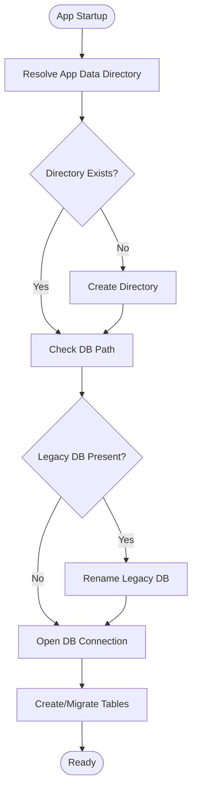
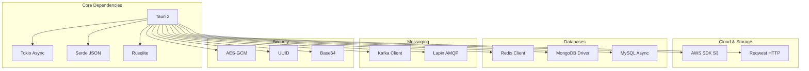
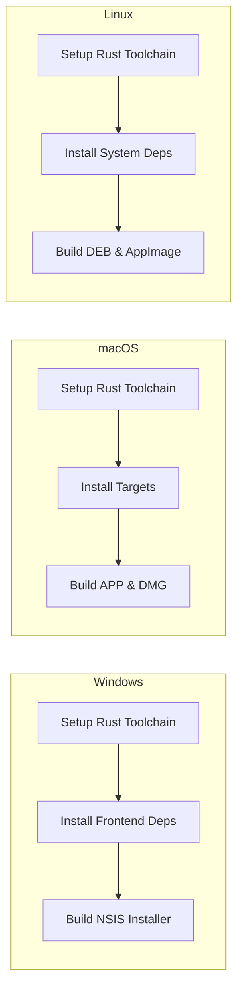
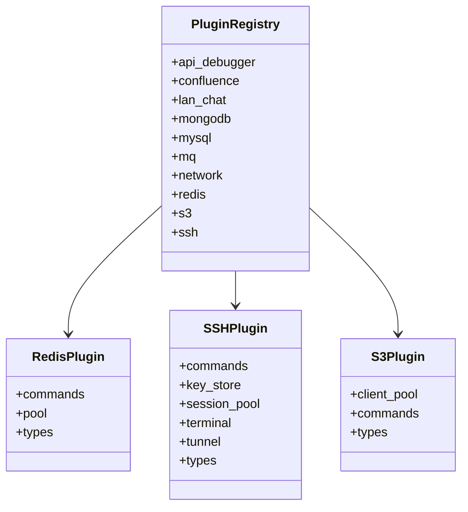

# Rust Backend Compilation

<cite>
**Referenced Files in This Document**
- [Cargo.toml](file://src-tauri/Cargo.toml)
- [lib.rs](file://src-tauri/src/lib.rs)
- [main.rs](file://src-tauri/src/main.rs)
- [tauri.conf.json](file://src-tauri/tauri.conf.json)
- [build.rs](file://src-tauri/build.rs)
- [plugins/mod.rs](file://src-tauri/src/plugins/mod.rs)
- [db/mod.rs](file://src-tauri/src/db/mod.rs)
- [dev_log.rs](file://src-tauri/src/dev_log.rs)
- [crypto/mod.rs](file://src-tauri/src/crypto/mod.rs)
- [db/init.rs](file://src-tauri/src/db/init.rs)
- [plugins/redis/mod.rs](file://src-tauri/src/plugins/redis/mod.rs)
- [plugins/ssh/mod.rs](file://src-tauri/src/plugins/ssh/mod.rs)
- [plugins/s3/mod.rs](file://src-tauri/src/plugins/s3/mod.rs)
- [build-desktop.yml](file://.github/workflows/build-desktop.yml)
- [package.json](file://package.json)
- [vite.config.ts](file://vite.config.ts)
</cite>

## Table of Contents
1. [Introduction](#introduction)
2. [Project Structure](#project-structure)
3. [Core Components](#core-components)
4. [Architecture Overview](#architecture-overview)
5. [Detailed Component Analysis](#detailed-component-analysis)
6. [Dependency Analysis](#dependency-analysis)
7. [Performance Considerations](#performance-considerations)
8. [Cross-Platform Compilation](#cross-platform-compilation)
9. [Plugin Architecture](#plugin-architecture)
10. [Debugging and Profiling](#debugging-and-profiling)
11. [Troubleshooting Guide](#troubleshooting-guide)
12. [Conclusion](#conclusion)

## Introduction
This document provides comprehensive documentation for the Rust backend compilation process of the DevNexus Tauri 2 desktop application. It covers Cargo.toml configuration, Tauri 2 integration, cross-platform compilation targets, dependency management, build optimization strategies, code structure, module organization, plugin architecture, and practical guidance for debugging and performance profiling.

## Project Structure
The Rust backend resides under the `src-tauri` directory and integrates tightly with the Tauri framework. The structure follows a modular pattern with distinct areas for plugins, database initialization, cryptography, and logging.

**Diagram sources**
- [Cargo.toml:1-49](file://src-tauri/Cargo.toml#L1-L49)
- [lib.rs:1-263](file://src-tauri/src/lib.rs#L1-L263)
- [main.rs:1-7](file://src-tauri/src/main.rs#L1-L7)
- [tauri.conf.json:1-39](file://src-tauri/tauri.conf.json#L1-L39)
- [build.rs:1-4](file://src-tauri/build.rs#L1-L4)
- [db/mod.rs:1-8](file://src-tauri/src/db/mod.rs#L1-L8)
- [db/init.rs:1-393](file://src-tauri/src/db/init.rs#L1-L393)
- [crypto/mod.rs:1-75](file://src-tauri/src/crypto/mod.rs#L1-L75)
- [dev_log.rs:1-69](file://src-tauri/src/dev_log.rs#L1-L69)
- [plugins/mod.rs:1-11](file://src-tauri/src/plugins/mod.rs#L1-L11)
- [plugins/redis/mod.rs:1-4](file://src-tauri/src/plugins/redis/mod.rs#L1-L4)
- [plugins/ssh/mod.rs:1-7](file://src-tauri/src/plugins/ssh/mod.rs#L1-L7)
- [plugins/s3/mod.rs:1-4](file://src-tauri/src/plugins/s3/mod.rs#L1-L4)

**Section sources**
- [Cargo.toml:1-49](file://src-tauri/Cargo.toml#L1-L49)
- [lib.rs:1-263](file://src-tauri/src/lib.rs#L1-L263)
- [main.rs:1-7](file://src-tauri/src/main.rs#L1-L7)
- [tauri.conf.json:1-39](file://src-tauri/tauri.conf.json#L1-L39)
- [build.rs:1-4](file://src-tauri/build.rs#L1-L4)

## Core Components
The Rust backend is centered around the Tauri 2 builder, which initializes plugins, sets up the database, and registers command handlers for all integrated plugins. The application entry point delegates to a library crate that encapsulates the Tauri runtime.

Key responsibilities:
- Tauri Builder: Initializes core plugins and application lifecycle hooks
- Database Initialization: Creates and migrates SQLite schema at startup
- Command Registration: Exposes hundreds of commands for frontend-to-backend communication
- Platform-Specific Behavior: Handles macOS window decorations during setup

**Section sources**
- [lib.rs:9-262](file://src-tauri/src/lib.rs#L9-L262)
- [db/init.rs:28-392](file://src-tauri/src/db/init.rs#L28-L392)

## Architecture Overview
The backend architecture follows a layered design with clear separation between the Tauri runtime, core modules, and plugin subsystems. The Tauri Builder orchestrates initialization, while plugins encapsulate domain-specific functionality.

**Diagram sources**
- [lib.rs:10-261](file://src-tauri/src/lib.rs#L10-L261)
- [db/init.rs:28-392](file://src-tauri/src/db/init.rs#L28-L392)

## Detailed Component Analysis

### Cargo.toml Configuration
The Cargo manifest defines the application identity, edition, and comprehensive dependency graph. Notable aspects:
- Library configuration: Multiple crate types enable static linking and dynamic loading
- Tauri integration: Minimal features for core Tauri with explicit plugin additions
- Runtime ecosystem: Tokio for async operations, Serde for serialization
- Database and cloud integrations: Rusqlite with bundled SQLite, AWS SDK for S3
- Network protocols: Redis, MongoDB, MySQL, Kafka, RabbitMQ clients
- Security: AES-GCM encryption, UUID generation, base64 encoding

Build dependencies include tauri-build for code generation during compilation.

**Section sources**
- [Cargo.toml:1-49](file://src-tauri/Cargo.toml#L1-L49)

### Tauri 2 Integration
The Tauri 2 integration centers on the library crate entry point that configures the application runtime. The setup phase handles platform-specific adjustments and initializes the database layer.

**Diagram sources**
- [lib.rs:10-261](file://src-tauri/src/lib.rs#L10-L261)
- [db/init.rs:28-392](file://src-tauri/src/db/init.rs#L28-L392)
- [dev_log.rs:29-68](file://src-tauri/src/dev_log.rs#L29-L68)

**Section sources**
- [lib.rs:9-262](file://src-tauri/src/lib.rs#L9-L262)

### Application Entry Point
The main.rs file serves as the traditional Rust entry point, delegating execution to the library crate's run function. Platform-specific attributes prevent unwanted console windows in release builds on Windows.

**Section sources**
- [main.rs:1-7](file://src-tauri/src/main.rs#L1-L7)

### Database Initialization
The database initialization module manages application data directory creation, legacy migration, and schema creation/migration. It establishes tables for connections, query history, SSH configurations, S3 buckets, MongoDB connections, MySQL connections, network diagnostics, API collections, MQ connections, LAN chat, and Confluence publishing.

**Diagram sources**
- [db/init.rs:6-392](file://src-tauri/src/db/init.rs#L6-L392)

**Section sources**
- [db/init.rs:1-393](file://src-tauri/src/db/init.rs#L1-L393)

### Cryptography Module
The cryptography module provides symmetric encryption using AES-GCM with a 256-bit key. It manages key storage, migration from legacy locations, and secure encryption/decryption operations for sensitive data.

**Section sources**
- [crypto/mod.rs:1-75](file://src-tauri/src/crypto/mod.rs#L1-L75)

### Development Logging
The development logging module maintains an in-memory ring buffer of log entries with emission to the frontend via Tauri events. It supports listing and clearing logs programmatically.

**Section sources**
- [dev_log.rs:1-69](file://src-tauri/src/dev_log.rs#L1-L69)

## Dependency Analysis
The dependency graph spans core Tauri plugins, database drivers, cloud SDKs, and protocol-specific libraries. The build system leverages GitHub Actions for multi-platform builds.

**Diagram sources**
- [Cargo.toml:20-49](file://src-tauri/Cargo.toml#L20-L49)

**Section sources**
- [Cargo.toml:1-49](file://src-tauri/Cargo.toml#L1-L49)

## Performance Considerations
- Asynchronous runtime: Tokio with full features enables efficient concurrent operations across plugins
- Database optimization: Rusqlite with bundled SQLite provides fast embedded operations; consider indexing strategies for frequently queried tables
- Memory management: Use of VecDeque for logs prevents excessive memory growth; configure appropriate limits for production deployments
- Network I/O: Protocol clients (Redis, MongoDB, MySQL) benefit from connection pooling; ensure proper resource cleanup
- Build optimization: Leverage release profiles and platform-specific optimizations in CI/CD pipelines

## Cross-Platform Compilation
The project supports Windows, macOS (Intel and Apple Silicon), and Linux through GitHub Actions workflows. Each platform receives tailored dependency installations and build targets.

**Diagram sources**
- [build-desktop.yml:13-142](file://.github/workflows/build-desktop.yml#L13-L142)

**Section sources**
- [build-desktop.yml:1-142](file://.github/workflows/build-desktop.yml#L1-L142)

## Plugin Architecture
The plugin system organizes functionality into cohesive modules, each exposing commands for frontend interaction. The registry aggregates all plugin commands for registration with the Tauri runtime.

**Diagram sources**
- [plugins/mod.rs:1-11](file://src-tauri/src/plugins/mod.rs#L1-L11)
- [plugins/redis/mod.rs:1-4](file://src-tauri/src/plugins/redis/mod.rs#L1-L4)
- [plugins/ssh/mod.rs:1-7](file://src-tauri/src/plugins/ssh/mod.rs#L1-L7)
- [plugins/s3/mod.rs:1-4](file://src-tauri/src/plugins/s3/mod.rs#L1-L4)

**Section sources**
- [plugins/mod.rs:1-11](file://src-tauri/src/plugins/mod.rs#L1-L11)

## Debugging and Profiling
Recommended approaches for debugging Rust code in this Tauri application:
- Development logging: Utilize the dev_log module for runtime event recording and emission to the frontend
- Database inspection: Connect to the SQLite database file located in the application data directory for schema verification
- Plugin isolation: Test individual plugin commands using the Tauri dev server and console
- Performance profiling: Use Rust profiling tools (perf, valgrind) on Linux; Instruments on macOS; Visual Studio Profiler on Windows
- Memory management: Monitor VecDeque growth limits and ensure proper cleanup of connection pools

**Section sources**
- [dev_log.rs:29-68](file://src-tauri/src/dev_log.rs#L29-L68)
- [db/init.rs:6-26](file://src-tauri/src/db/init.rs#L6-L26)

## Troubleshooting Guide
Common issues and resolutions:
- Database migration failures: Verify application data directory permissions and ensure exclusive access to the SQLite file
- Plugin command errors: Check command registration in lib.rs and ensure proper error propagation from plugin modules
- Cross-platform build failures: Confirm system dependencies installation for each target platform in CI/CD workflows
- Tauri build configuration: Validate tauri.conf.json settings and ensure frontend build artifacts are generated before bundling

**Section sources**
- [lib.rs:26-261](file://src-tauri/src/lib.rs#L26-L261)
- [build-desktop.yml:112-121](file://.github/workflows/build-desktop.yml#L112-L121)

## Conclusion
The DevNexus Rust backend demonstrates a well-structured Tauri 2 application with comprehensive plugin support, robust database initialization, and cross-platform build automation. The modular architecture facilitates maintainability and extensibility, while the CI/CD pipeline ensures reliable distribution across major desktop platforms.