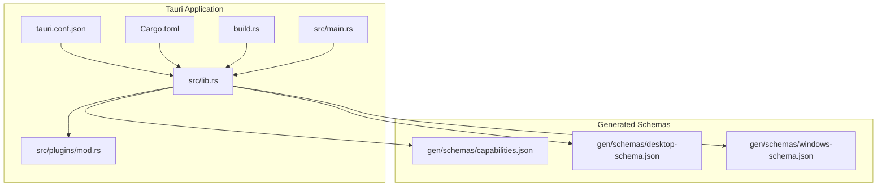
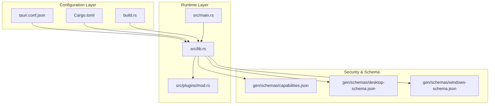
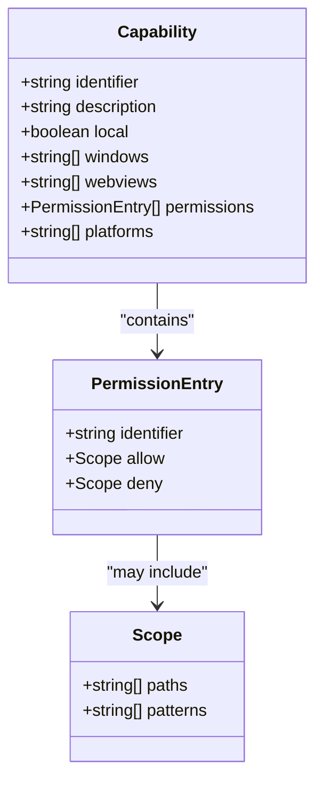
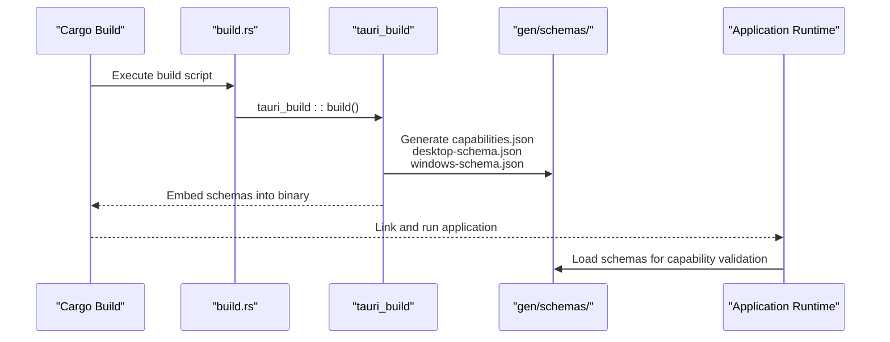
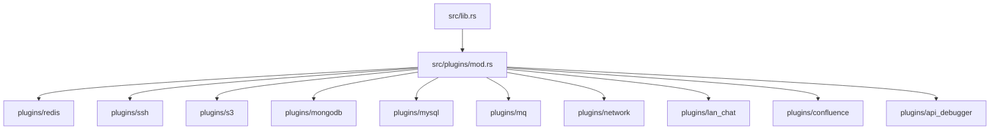
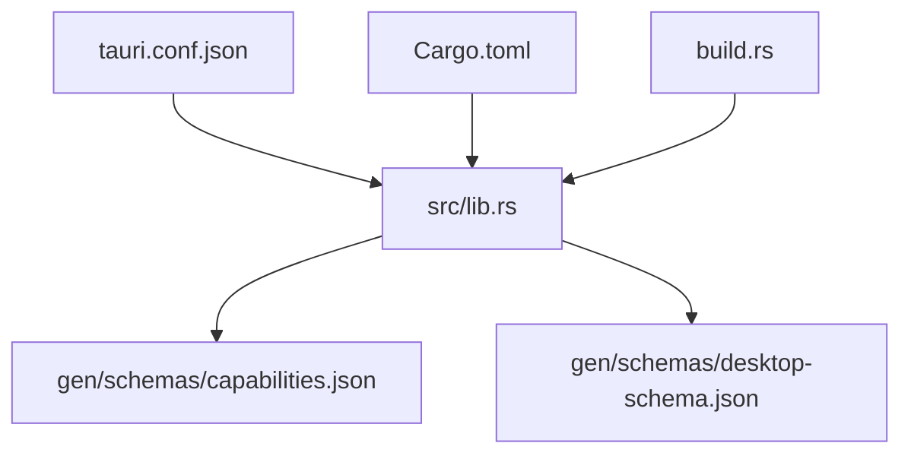

# Tauri Packaging System

<cite>
**Referenced Files in This Document**
- [tauri.conf.json](file://src-tauri/tauri.conf.json)
- [Cargo.toml](file://src-tauri/Cargo.toml)
- [build.rs](file://src-tauri/build.rs)
- [main.rs](file://src-tauri/src/main.rs)
- [lib.rs](file://src-tauri/src/lib.rs)
- [capabilities.json](file://src-tauri/gen/schemas/capabilities.json)
- [desktop-schema.json](file://src-tauri/gen/schemas/desktop-schema.json)
- [windows-schema.json](file://src-tauri/gen/schemas/windows-schema.json)
- [mod.rs](file://src-tauri/src/plugins/mod.rs)
- [redis/mod.rs](file://src-tauri/src/plugins/redis/mod.rs)
- [ssh/mod.rs](file://src-tauri/src/plugins/ssh/mod.rs)
- [s3/mod.rs](file://src-tauri/src/plugins/s3/mod.rs)
- [mongodb/mod.rs](file://src-tauri/src/plugins/mongodb/mod.rs)
</cite>

## Table of Contents
1. [Introduction](#introduction)
2. [Project Structure](#project-structure)
3. [Core Components](#core-components)
4. [Architecture Overview](#architecture-overview)
5. [Detailed Component Analysis](#detailed-component-analysis)
6. [Dependency Analysis](#dependency-analysis)
7. [Performance Considerations](#performance-considerations)
8. [Troubleshooting Guide](#troubleshooting-guide)
9. [Conclusion](#conclusion)

## Introduction
This document provides comprehensive documentation for the Tauri packaging and distribution system used by the DevNexus desktop application. It covers the tauri.conf.json configuration including window settings, security policies, and capability management. It explains the capability system for controlling plugin permissions and system access, documents icon management for different platforms, resource bundling, and asset optimization. It also details the schema generation process and IPC communication setup, and includes platform-specific packaging configurations for Windows, macOS, and Linux distributions.

## Project Structure
The Tauri packaging system is organized around a central configuration file (tauri.conf.json) and supporting Rust crate configuration (Cargo.toml). The build process integrates with Tauri's schema generation and capability system, which define runtime permissions and IPC boundaries. The application entry point initializes plugins and registers IPC handlers for all supported database clients and utilities.

**Diagram sources**
- [tauri.conf.json](file://src-tauri/tauri.conf.json)
- [Cargo.toml](file://src-tauri/Cargo.toml)
- [build.rs](file://src-tauri/build.rs)
- [main.rs](file://src-tauri/src/main.rs)
- [lib.rs](file://src-tauri/src/lib.rs)
- [capabilities.json](file://src-tauri/gen/schemas/capabilities.json)
- [desktop-schema.json](file://src-tauri/gen/schemas/desktop-schema.json)
- [windows-schema.json](file://src-tauri/gen/schemas/windows-schema.json)

**Section sources**
- [tauri.conf.json](file://src-tauri/tauri.conf.json)
- [Cargo.toml](file://src-tauri/Cargo.toml)
- [build.rs](file://src-tauri/build.rs)
- [main.rs](file://src-tauri/src/main.rs)
- [lib.rs](file://src-tauri/src/lib.rs)

## Core Components
This section analyzes the primary components that govern Tauri packaging and distribution, including configuration, build integration, and runtime initialization.

- tauri.conf.json: Defines product metadata, development and build commands, window configuration, security policies, and bundling targets. It specifies icon sets for multiple platforms and sets the bundle target to "all".
- Cargo.toml: Declares the Rust crate, library types, and Tauri-related dependencies including core, dialog, fs, and opener plugins. It also lists external dependencies for Redis, MongoDB, MySQL, S3, SSH, and messaging systems.
- build.rs: Invokes tauri_build::build() during compilation to integrate Tauri's build-time code generation and schema embedding.
- src/main.rs: Sets up the Windows subsystem for release builds and delegates application startup to the library crate.
- src/lib.rs: Initializes Tauri Builder, registers plugins, sets up macOS decorations, initializes database connections, records startup logs, and registers IPC handlers for all plugin commands.

Key configuration highlights:
- Product identity: productName, version, identifier
- Build pipeline: beforeDevCommand, devUrl, beforeBuildCommand, frontendDist
- Window behavior: title, dimensions, minimum sizes, decorations
- Security: CSP policy set to null (no CSP enforced)
- Bundling: active, targets=all, icon array for cross-platform icons

**Section sources**
- [tauri.conf.json](file://src-tauri/tauri.conf.json)
- [Cargo.toml](file://src-tauri/Cargo.toml)
- [build.rs](file://src-tauri/build.rs)
- [main.rs](file://src-tauri/src/main.rs)
- [lib.rs](file://src-tauri/src/lib.rs)

## Architecture Overview
The Tauri packaging system orchestrates configuration-driven window behavior, capability-based IPC permissions, and schema-driven security enforcement. The build pipeline embeds capability and schema definitions, enabling runtime permission checks and IPC command routing.

**Diagram sources**
- [tauri.conf.json](file://src-tauri/tauri.conf.json)
- [Cargo.toml](file://src-tauri/Cargo.toml)
- [build.rs](file://src-tauri/build.rs)
- [main.rs](file://src-tauri/src/main.rs)
- [lib.rs](file://src-tauri/src/lib.rs)
- [capabilities.json](file://src-tauri/gen/schemas/capabilities.json)
- [desktop-schema.json](file://src-tauri/gen/schemas/desktop-schema.json)
- [windows-schema.json](file://src-tauri/gen/schemas/windows-schema.json)

## Detailed Component Analysis

### Capability System and IPC Communication
The capability system defines which IPC commands are permitted for specific windows and webviews. The generated capabilities.json file establishes a default capability for the main window with broad permissions for core, opener, dialog, and fs plugins. The desktop-schema.json file documents the capability format, including identifiers, descriptions, local/remote scope, window/webview targeting, and permission entries.

**Diagram sources**
- [capabilities.json](file://src-tauri/gen/schemas/capabilities.json)
- [desktop-schema.json](file://src-tauri/gen/schemas/desktop-schema.json)

IPC communication setup:
- All plugin commands are registered via generate_handler! in lib.rs, enabling secure invocation only when the window/webview belongs to a capability that grants the specific permission.
- The capability system isolates access to IPC commands, reducing the impact of frontend vulnerabilities by scoping permissions per window or webview.

**Section sources**
- [capabilities.json](file://src-tauri/gen/schemas/capabilities.json)
- [desktop-schema.json](file://src-tauri/gen/schemas/desktop-schema.json)
- [lib.rs](file://src-tauri/src/lib.rs)

### Window Settings and Decorations
The tauri.conf.json defines a single window with:
- Title: "DevNexus"
- Initial size: 1280x800
- Minimum size: 960x600
- Decorations disabled for custom title bar implementation

Platform-specific behavior:
- macOS: Decorations are re-enabled programmatically during setup for proper native appearance.

**Section sources**
- [tauri.conf.json](file://src-tauri/tauri.conf.json)
- [lib.rs](file://src-tauri/src/lib.rs)

### Security Policies and CSP
Security configuration:
- CSP is set to null, indicating no Content Security Policy is enforced by Tauri. Local development serves from devUrl, and production bundles include the frontend distribution.

Recommendations:
- For production deployments, consider defining a strict CSP in tauri.conf.json to mitigate XSS risks.
- Ensure frontend assets are built with appropriate security headers and integrity checks.

**Section sources**
- [tauri.conf.json](file://src-tauri/tauri.conf.json)

### Icon Management and Resource Bundling
Icon configuration:
- Icons array includes multiple resolutions for cross-platform compatibility:
  - PNG icons for general platforms
  - ICNS for macOS
  - ICO for Windows
- Bundle targets are set to "all", enabling generation of installers for Windows, macOS, and Linux.

Asset optimization:
- FrontendDist points to the built React/Vite distribution, ensuring optimized static assets are bundled with the application.

**Section sources**
- [tauri.conf.json](file://src-tauri/tauri.conf.json)

### Schema Generation Process
Schema generation:
- build.rs invokes tauri_build::build(), which generates JSON schemas and capability definitions during compilation.
- Generated schemas include capabilities.json, desktop-schema.json, and windows-schema.json, embedded into the final binary for runtime validation and permission enforcement.

**Diagram sources**
- [build.rs](file://src-tauri/build.rs)
- [capabilities.json](file://src-tauri/gen/schemas/capabilities.json)
- [desktop-schema.json](file://src-tauri/gen/schemas/desktop-schema.json)
- [windows-schema.json](file://src-tauri/gen/schemas/windows-schema.json)

**Section sources**
- [build.rs](file://src-tauri/build.rs)
- [capabilities.json](file://src-tauri/gen/schemas/capabilities.json)
- [desktop-schema.json](file://src-tauri/gen/schemas/desktop-schema.json)
- [windows-schema.json](file://src-tauri/gen/schemas/windows-schema.json)

### Platform-Specific Packaging Configurations
Bundle targets:
- Targets set to "all" ensures Windows, macOS, and Linux installers are produced during packaging.

Windows packaging:
- Uses ICO icon format and standard Windows installer formats.

macOS packaging:
- Uses ICNS icon format and DMG/PKG formats.
- Decorations are managed per platform, with programmatic adjustments for macOS.

Linux packaging:
- Supports AppImage and DEB formats, with PNG icons included in the bundle.

Note: Specific platform packaging details are derived from the bundle configuration and icon formats declared in tauri.conf.json.

**Section sources**
- [tauri.conf.json](file://src-tauri/tauri.conf.json)

### Plugin Ecosystem and IPC Registration
The application registers IPC handlers for numerous plugins, covering:
- Redis operations (connection management, key manipulation, query execution)
- SSH operations (terminal sessions, key management, tunneling)
- S3 operations (bucket management, object operations, upload/download)
- MongoDB operations (connection management, collection operations, aggregation)
- MySQL operations (connection management, SQL execution, schema operations)
- Messaging queue operations (Kafka, RabbitMQ)
- Network diagnostics and LAN chat
- API debugger and Confluence integration

Plugin module structure:
- src/plugins/mod.rs aggregates all plugin modules.
- Each plugin exposes commands, pools, and types under dedicated submodules.

**Diagram sources**
- [lib.rs](file://src-tauri/src/lib.rs)
- [mod.rs](file://src-tauri/src/plugins/mod.rs)
- [redis/mod.rs](file://src-tauri/src/plugins/redis/mod.rs)
- [ssh/mod.rs](file://src-tauri/src/plugins/ssh/mod.rs)
- [s3/mod.rs](file://src-tauri/src/plugins/s3/mod.rs)
- [mongodb/mod.rs](file://src-tauri/src/plugins/mongodb/mod.rs)

**Section sources**
- [lib.rs](file://src-tauri/src/lib.rs)
- [mod.rs](file://src-tauri/src/plugins/mod.rs)
- [redis/mod.rs](file://src-tauri/src/plugins/redis/mod.rs)
- [ssh/mod.rs](file://src-tauri/src/plugins/ssh/mod.rs)
- [s3/mod.rs](file://src-tauri/src/plugins/s3/mod.rs)
- [mongodb/mod.rs](file://src-tauri/src/plugins/mongodb/mod.rs)

## Dependency Analysis
The Tauri packaging system relies on a layered dependency model:
- Configuration dependencies: tauri.conf.json drives window behavior, security, and bundling.
- Build dependencies: build.rs and tauri_build integrate schema generation and capability embedding.
- Runtime dependencies: lib.rs initializes plugins and registers IPC handlers based on Cargo.toml dependencies.

**Diagram sources**
- [tauri.conf.json](file://src-tauri/tauri.conf.json)
- [Cargo.toml](file://src-tauri/Cargo.toml)
- [build.rs](file://src-tauri/build.rs)
- [lib.rs](file://src-tauri/src/lib.rs)
- [capabilities.json](file://src-tauri/gen/schemas/capabilities.json)
- [desktop-schema.json](file://src-tauri/gen/schemas/desktop-schema.json)

**Section sources**
- [tauri.conf.json](file://src-tauri/tauri.conf.json)
- [Cargo.toml](file://src-tauri/Cargo.toml)
- [build.rs](file://src-tauri/build.rs)
- [lib.rs](file://src-tauri/src/lib.rs)

## Performance Considerations
- Capability scoping reduces IPC overhead by limiting command availability to necessary windows/webviews.
- Embedding schemas at build time avoids runtime parsing costs.
- Minimizing icon sizes and formats improves installer size and load times.
- Using platform-specific icons (ICNS, ICO) ensures optimal rendering without runtime conversion overhead.

## Troubleshooting Guide
Common issues and resolutions:
- Capability violations: If IPC commands fail, verify the window belongs to the correct capability and that the capability includes the required permissions.
- Schema validation errors: Ensure generated schemas are present and up-to-date after build.
- Window decoration inconsistencies: On macOS, confirm decorations are enabled during setup; on other platforms, ensure decorations are disabled in tauri.conf.json for custom title bars.
- Build failures: Confirm tauri_build is invoked via build.rs and that all dependencies in Cargo.toml are resolved.

**Section sources**
- [lib.rs](file://src-tauri/src/lib.rs)
- [capabilities.json](file://src-tauri/gen/schemas/capabilities.json)
- [desktop-schema.json](file://src-tauri/gen/schemas/desktop-schema.json)

## Conclusion
The DevNexus Tauri packaging system leverages a configuration-driven approach with robust capability management, schema-driven security, and comprehensive plugin IPC registration. The build pipeline integrates schema generation and capability embedding, while tauri.conf.json coordinates window behavior, security policies, and cross-platform bundling. By adhering to capability scoping and platform-specific packaging configurations, the system delivers a secure, optimized, and maintainable desktop application distribution strategy.