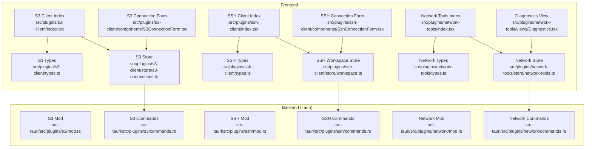
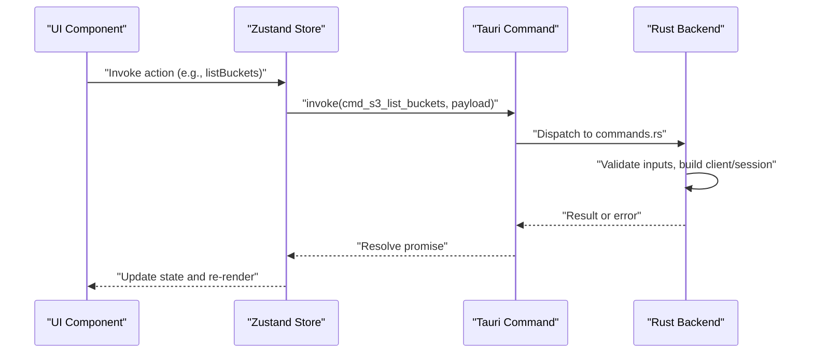
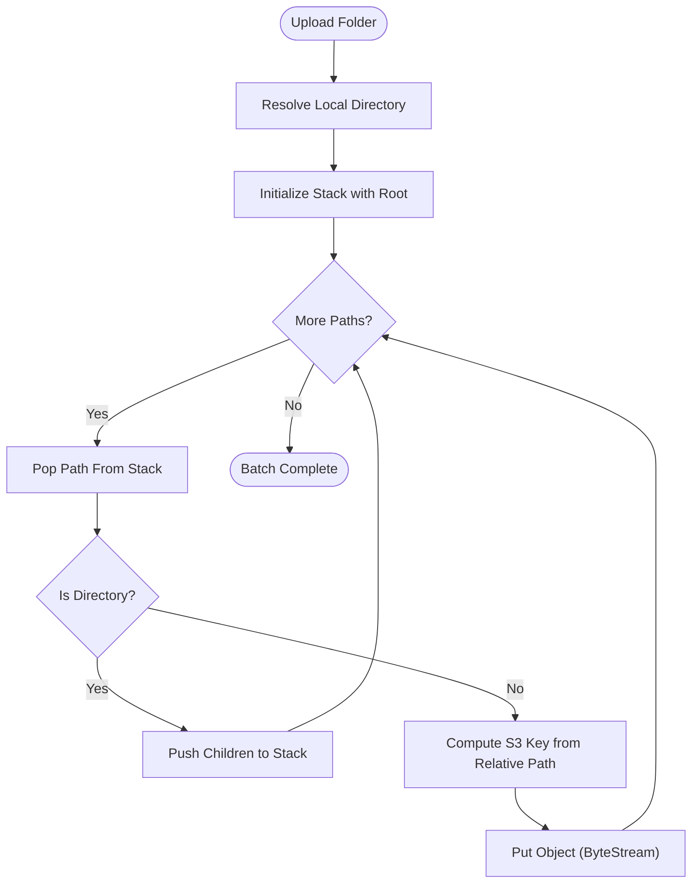
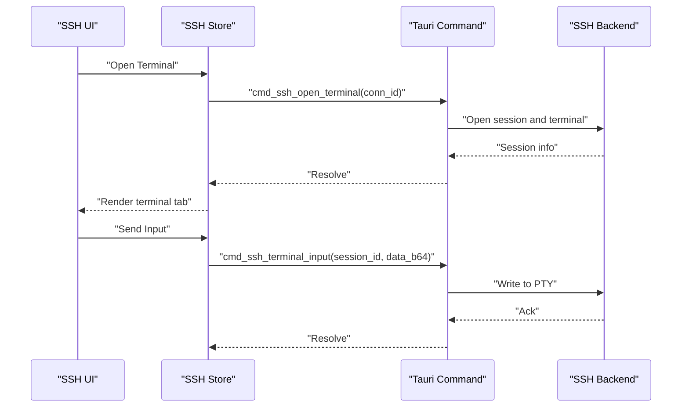
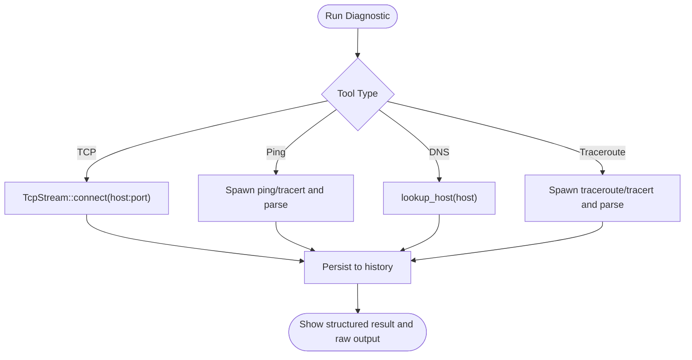
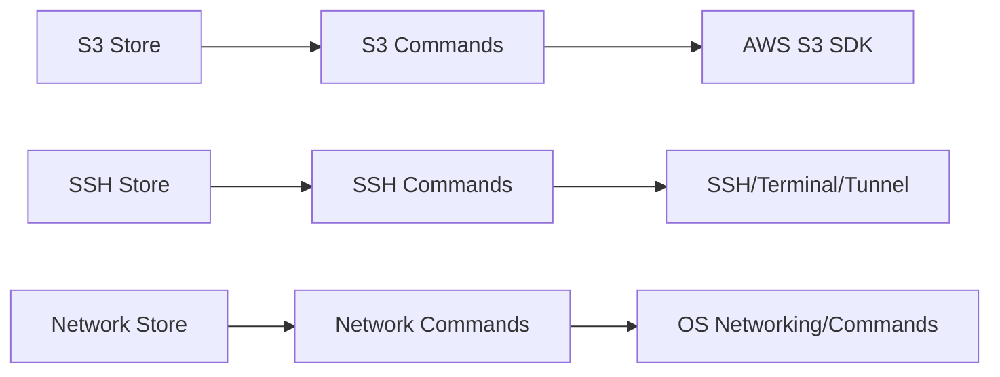

# Cloud & Network Tools

<cite>
**Referenced Files in This Document**
- [index.tsx](file://src/plugins/s3-client/index.tsx)
- [types.ts](file://src/plugins/s3-client/types.ts)
- [s3-connections.ts](file://src/plugins/s3-client/store/s3-connections.ts)
- [S3ConnectionForm.tsx](file://src/plugins/s3-client/components/S3ConnectionForm.tsx)
- [index.tsx](file://src/plugins/ssh-client/index.tsx)
- [types.ts](file://src/plugins/ssh-client/types.ts)
- [workspace.ts](file://src/plugins/ssh-client/store/workspace.ts)
- [SshConnectionForm.tsx](file://src/plugins/ssh-client/components/SshConnectionForm.tsx)
- [index.tsx](file://src/plugins/network-tools/index.tsx)
- [types.ts](file://src/plugins/network-tools/types.ts)
- [network-tools.ts](file://src/plugins/network-tools/store/network-tools.ts)
- [Diagnostics.tsx](file://src/plugins/network-tools/views/Diagnostics.tsx)
- [mod.rs](file://src-tauri/src/plugins/s3/mod.rs)
- [commands.rs](file://src-tauri/src/plugins/s3/commands.rs)
- [mod.rs](file://src-tauri/src/plugins/ssh/mod.rs)
- [commands.rs](file://src-tauri/src/plugins/ssh/commands.rs)
- [mod.rs](file://src-tauri/src/plugins/network/mod.rs)
- [commands.rs](file://src-tauri/src/plugins/network/commands.rs)
</cite>

## Table of Contents
1. [Introduction](#introduction)
2. [Project Structure](#project-structure)
3. [Core Components](#core-components)
4. [Architecture Overview](#architecture-overview)
5. [Detailed Component Analysis](#detailed-component-analysis)
6. [Dependency Analysis](#dependency-analysis)
7. [Performance Considerations](#performance-considerations)
8. [Security Considerations](#security-considerations)
9. [Troubleshooting Guide](#troubleshooting-guide)
10. [Conclusion](#conclusion)

## Introduction
This document explains the Cloud Storage and Network Tools plugins: S3 Client, SSH Client, and Network Tools. It covers:
- S3 bucket and object management, access control, and upload capabilities
- SSH connection lifecycle, terminal emulation, key-based authentication, and port forwarding/tunneling
- Network diagnostics: connectivity testing, DNS resolution, ping, traceroute, and history
It also provides configuration guidance, security best practices, and troubleshooting tips.

## Project Structure
The plugins are organized per domain with React views, Zustand stores, and TypeScript types, backed by Tauri commands implemented in Rust.

**Diagram sources**
- [index.tsx:10-66](file://src/plugins/s3-client/index.tsx#L10-L66)
- [types.ts:1-110](file://src/plugins/s3-client/types.ts#L1-L110)
- [s3-connections.ts:137-431](file://src/plugins/s3-client/store/s3-connections.ts#L137-L431)
- [S3ConnectionForm.tsx:42-124](file://src/plugins/s3-client/components/S3ConnectionForm.tsx#L42-L124)
- [index.tsx:12-56](file://src/plugins/ssh-client/index.tsx#L12-L56)
- [types.ts:1-115](file://src/plugins/ssh-client/types.ts#L1-L115)
- [workspace.ts:16-21](file://src/plugins/ssh-client/store/workspace.ts#L16-L21)
- [SshConnectionForm.tsx:27-113](file://src/plugins/ssh-client/components/SshConnectionForm.tsx#L27-L113)
- [index.tsx:9-24](file://src/plugins/network-tools/index.tsx#L9-L24)
- [types.ts:1-57](file://src/plugins/network-tools/types.ts#L1-L57)
- [network-tools.ts:34-96](file://src/plugins/network-tools/store/network-tools.ts#L34-L96)
- [Diagnostics.tsx:92-147](file://src/plugins/network-tools/views/Diagnostics.tsx#L92-L147)
- [mod.rs:1-4](file://src-tauri/src/plugins/s3/mod.rs#L1-L4)
- [commands.rs:14-1164](file://src-tauri/src/plugins/s3/commands.rs#L14-L1164)
- [mod.rs:1-7](file://src-tauri/src/plugins/ssh/mod.rs#L1-L7)
- [commands.rs:8-266](file://src-tauri/src/plugins/ssh/commands.rs#L8-L266)
- [mod.rs:1-3](file://src-tauri/src/plugins/network/mod.rs#L1-L3)
- [commands.rs:1-537](file://src-tauri/src/plugins/network/commands.rs#L1-L537)

**Section sources**
- [index.tsx:1-76](file://src/plugins/s3-client/index.tsx#L1-L76)
- [index.tsx:1-66](file://src/plugins/ssh-client/index.tsx#L1-L66)
- [index.tsx:1-27](file://src/plugins/network-tools/index.tsx#L1-L27)

## Core Components
- S3 Client
  - Plugin manifest and routing tabs for Connections, Buckets, Objects
  - Stores S3 connection state, lists buckets/objects, manages uploads/downloads/copy/rename/delete
  - Provides connection form with provider presets, region/endpoints, path-style access, and manual bucket support
- SSH Client
  - Plugin manifest with tabs for Connections, Terminal, Keys, Tunnels
  - Manages SSH sessions, terminal I/O, key import/generate/get public key, quick commands, and tunnel rules
  - Provides connection form supporting password/key/key+passphrase auth, jump hosts, encoding, keepalive
- Network Tools
  - Plugin manifest with tabs for Diagnostics and History
  - Offers TCP check, Ping, DNS Lookup, Traceroute with result parsing and history persistence
  - Provides replay capability from history

**Section sources**
- [index.tsx:68-76](file://src/plugins/s3-client/index.tsx#L68-L76)
- [s3-connections.ts:137-431](file://src/plugins/s3-client/store/s3-connections.ts#L137-L431)
- [S3ConnectionForm.tsx:42-124](file://src/plugins/s3-client/components/S3ConnectionForm.tsx#L42-L124)
- [index.tsx:58-66](file://src/plugins/ssh-client/index.tsx#L58-L66)
- [workspace.ts:16-21](file://src/plugins/ssh-client/store/workspace.ts#L16-L21)
- [SshConnectionForm.tsx:27-113](file://src/plugins/ssh-client/components/SshConnectionForm.tsx#L27-L113)
- [index.tsx:26-27](file://src/plugins/network-tools/index.tsx#L26-L27)
- [network-tools.ts:34-96](file://src/plugins/network-tools/store/network-tools.ts#L34-L96)

## Architecture Overview
The frontend plugins expose UI and state via React components and Zustand stores. Each store action invokes a Tauri command that executes on the backend. The backend validates inputs, interacts with external services (S3 SDK, SSH, OS networking), and persists results.

**Diagram sources**
- [s3-connections.ts:197-205](file://src/plugins/s3-client/store/s3-connections.ts#L197-L205)
- [commands.rs:211-249](file://src-tauri/src/plugins/s3/commands.rs#L211-L249)

**Section sources**
- [s3-connections.ts:137-431](file://src/plugins/s3-client/store/s3-connections.ts#L137-L431)
- [commands.rs:14-1164](file://src-tauri/src/plugins/s3/commands.rs#L14-L1164)

## Detailed Component Analysis

### S3 Client
- Provider support and endpoint generation
  - Providers include AWS S3, MinIO, Aliyun OSS, Tencent COS, Cloudflare R2, and Custom
  - Endpoint auto-fill for certain providers and regions; MinIO defaults to path-style access
- Bucket management
  - List buckets with fallback to manual buckets when ListBuckets is disallowed
  - Create/delete buckets with region-aware configuration
  - Retrieve bucket location/versioning and toggle versioning
- Object operations
  - List objects with pagination (common prefixes, continuation token)
  - Head object, get/set tags, copy/move/rename
  - Delete single object, multiple objects, or entire “folder” prefix
  - Upload single file or entire folder recursively; folder creation via zero-byte object
- Access control and security
  - Secret access key stored securely by backend; forms allow leaving secret blank when editing existing connections
  - Manual buckets configuration for accounts with scoped permissions
- Presigned URLs
  - Generate pre-signed URLs for temporary access

**Diagram sources**
- [commands.rs:748-794](file://src-tauri/src/plugins/s3/commands.rs#L748-L794)

**Section sources**
- [S3ConnectionForm.tsx:14-40](file://src/plugins/s3-client/components/S3ConnectionForm.tsx#L14-L40)
- [types.ts:1-110](file://src/plugins/s3-client/types.ts#L1-L110)
- [s3-connections.ts:197-431](file://src/plugins/s3-client/store/s3-connections.ts#L197-L431)
- [commands.rs:211-794](file://src-tauri/src/plugins/s3/commands.rs#L211-L794)

### SSH Client
- Connection lifecycle
  - Test TCP handshake latency before connecting
  - Open/close sessions; backend maintains session pools
- Terminal emulation
  - Open terminal session, send input (base64), resize, drain output, close
- Key management
  - Import private key from file; optional passphrase
  - Generate new key pairs; derive public key
  - List and delete keys
- Quick commands
  - Persist named commands per connection or globally
- Tunneling
  - Define local/remote/dynamic tunnel rules
  - Start/stop tunnels bound to a connection

**Diagram sources**
- [workspace.ts:16-21](file://src/plugins/ssh-client/store/workspace.ts#L16-L21)
- [commands.rs:78-106](file://src-tauri/src/plugins/ssh/commands.rs#L78-L106)

**Section sources**
- [SshConnectionForm.tsx:27-113](file://src/plugins/ssh-client/components/SshConnectionForm.tsx#L27-L113)
- [types.ts:1-115](file://src/plugins/ssh-client/types.ts#L1-L115)
- [workspace.ts:16-21](file://src/plugins/ssh-client/store/workspace.ts#L16-L21)
- [commands.rs:8-266](file://src-tauri/src/plugins/ssh/commands.rs#L8-L266)

### Network Tools
- Diagnostics
  - TCP port check: connect with timeout, capture remote address and error
  - Ping: cross-platform invocation, parse counts, loss%, average latency
  - DNS lookup: resolve A/AAAA records with record-type filtering
  - Traceroute: platform-specific traceroute/tracert, parse hops
- Results and history
  - Structured results per tool type
  - Persist history with parameters, duration, summary, and raw JSON
  - Replay previous diagnostics by reconstructing parameters

**Diagram sources**
- [network-tools.ts:42-95](file://src/plugins/network-tools/store/network-tools.ts#L42-L95)
- [commands.rs:258-481](file://src-tauri/src/plugins/network/commands.rs#L258-L481)

**Section sources**
- [Diagnostics.tsx:92-147](file://src/plugins/network-tools/views/Diagnostics.tsx#L92-L147)
- [types.ts:1-57](file://src/plugins/network-tools/types.ts#L1-L57)
- [network-tools.ts:34-96](file://src/plugins/network-tools/store/network-tools.ts#L34-L96)
- [commands.rs:1-537](file://src-tauri/src/plugins/network/commands.rs#L1-L537)

## Dependency Analysis
- Frontend-to-backend boundaries
  - S3: store actions call Tauri commands for all operations
  - SSH: similar pattern for connections, terminals, keys, tunnels
  - Network: diagnostics invoke commands and persist results
- Internal plugin modules
  - S3/SSH/network mod.rs files aggregate submodules (commands, types, pools, etc.)
- Data types
  - Strongly typed interfaces define payloads and results across layers

**Diagram sources**
- [mod.rs:1-4](file://src-tauri/src/plugins/s3/mod.rs#L1-L4)
- [commands.rs:1-1164](file://src-tauri/src/plugins/s3/commands.rs#L1-L1164)
- [mod.rs:1-7](file://src-tauri/src/plugins/ssh/mod.rs#L1-L7)
- [commands.rs:1-266](file://src-tauri/src/plugins/ssh/commands.rs#L1-L266)
- [mod.rs:1-3](file://src-tauri/src/plugins/network/mod.rs#L1-L3)
- [commands.rs:1-537](file://src-tauri/src/plugins/network/commands.rs#L1-L537)

**Section sources**
- [mod.rs:1-4](file://src-tauri/src/plugins/s3/mod.rs#L1-L4)
- [mod.rs:1-7](file://src-tauri/src/plugins/ssh/mod.rs#L1-L7)
- [mod.rs:1-3](file://src-tauri/src/plugins/network/mod.rs#L1-L3)

## Performance Considerations
- Pagination and batching
  - S3 list objects supports continuation tokens and max-keys to avoid large payloads
  - Upload folder batches files and computes keys relative to prefix
- Timeouts and concurrency
  - Network diagnostics enforce per-operation timeouts and reasonable limits
  - SSH terminal I/O is asynchronous; base64 encoding minimizes overhead
- UI responsiveness
  - Long-running operations set loading flags; results update state atomically

[No sources needed since this section provides general guidance]

## Security Considerations
- S3 credentials
  - Secret access key is required for new connections; when editing, leave blank to reuse existing secret
  - For accounts with restricted permissions, configure Manual Buckets to bypass ListBuckets failures
- SSH key storage
  - Private keys are imported from files; passphrase-protected keys supported
  - Public keys derived for distribution; keys can be listed/deleted
- Network security
  - Diagnostics run OS-native tools; ensure safe execution contexts
  - Tunneling exposes local/remote ports; restrict rules and monitor statuses
- Best practices
  - Prefer short-lived pre-signed URLs with minimal expiry
  - Use jump hosts for bastion access
  - Limit tunnel exposure; monitor tunnel statuses

**Section sources**
- [S3ConnectionForm.tsx:183-188](file://src/plugins/s3-client/components/S3ConnectionForm.tsx#L183-L188)
- [S3ConnectionForm.tsx:209-217](file://src/plugins/s3-client/components/S3ConnectionForm.tsx#L209-L217)
- [SshConnectionForm.tsx:168-192](file://src/plugins/ssh-client/components/SshConnectionForm.tsx#L168-L192)
- [commands.rs:177-235](file://src-tauri/src/plugins/network/commands.rs#L177-L235)

## Troubleshooting Guide
- S3
  - ListBuckets fails: switch to Manual Buckets in connection form
  - Path-style access issues: enable Path Style for MinIO/custom providers
  - Upload/download failures: verify local paths and permissions
- SSH
  - TCP handshake fails: verify host/port reachability and firewall rules
  - Authentication errors: confirm key passphrase and key type selection
  - Terminal output missing: drain output and resize terminal
- Network
  - Ping/traceroute timeouts: increase timeout, check OS firewall and ICMP settings
  - DNS failures: verify record type and upstream resolver

**Section sources**
- [commands.rs:219-248](file://src-tauri/src/plugins/s3/commands.rs#L219-L248)
- [S3ConnectionForm.tsx:85-94](file://src/plugins/s3-client/components/S3ConnectionForm.tsx#L85-L94)
- [commands.rs:29-62](file://src-tauri/src/plugins/ssh/commands.rs#L29-L62)
- [Diagnostics.tsx:107-117](file://src/plugins/network-tools/views/Diagnostics.tsx#L107-L117)

## Conclusion
These plugins provide a cohesive toolkit for cloud storage, secure shell access, and network diagnostics. The frontend offers intuitive forms and workspaces, while the backend ensures robust, secure, and efficient operations against real services and systems.