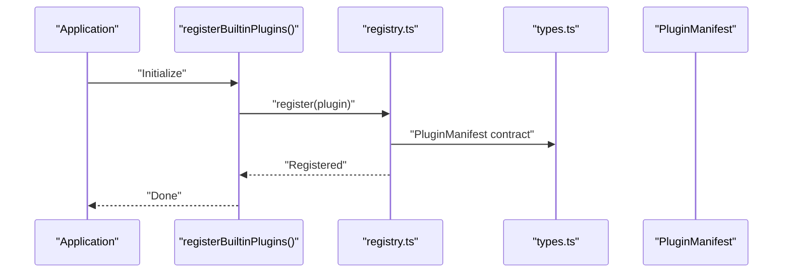
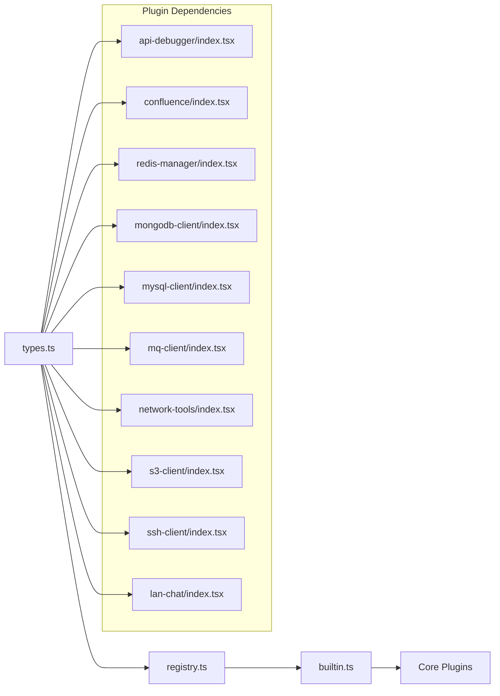

# Core Plugins

<cite>
**Referenced Files in This Document**
- [builtin.ts](file://src/app/plugin-registry/builtin.ts)
- [registry.ts](file://src/app/plugin-registry/registry.ts)
- [types.ts](file://src/app/plugin-registry/types.ts)
- [api-debugger/index.tsx](file://src/plugins/api-debugger/index.tsx)
- [confluence/index.tsx](file://src/plugins/confluence/index.tsx)
- [lan-chat/index.tsx](file://src/plugins/lan-chat/index.tsx)
- [mongodb-client/index.tsx](file://src/plugins/mongodb-client/index.tsx)
- [mq-client/index.tsx](file://src/plugins/mq-client/index.tsx)
- [mysql-client/index.tsx](file://src/plugins/mysql-client/index.tsx)
- [network-tools/index.tsx](file://src/plugins/network-tools/index.tsx)
- [redis-manager/index.tsx](file://src/plugins/redis-manager/index.tsx)
- [s3-client/index.tsx](file://src/plugins/s3-client/index.tsx)
- [ssh-client/index.tsx](file://src/plugins/ssh-client/index.tsx)
</cite>

## Table of Contents
1. [Introduction](#introduction)
2. [Project Structure](#project-structure)
3. [Core Components](#core-components)
4. [Architecture Overview](#architecture-overview)
5. [Detailed Component Analysis](#detailed-component-analysis)
6. [Dependency Analysis](#dependency-analysis)
7. [Performance Considerations](#performance-considerations)
8. [Troubleshooting Guide](#troubleshooting-guide)
9. [Conclusion](#conclusion)

## Introduction
This document provides comprehensive documentation for the DevNexus core plugins. It covers the nine built-in plugins, their capabilities, shared architecture, and integration with the plugin system. Each plugin exposes a manifest that describes its identity, icon, version, and UI component, and is registered during application initialization. The plugin system supports consistent navigation via segmented tabs, environment/connection awareness, and a sidebar order for presentation.

## Project Structure
DevNexus organizes plugins under a dedicated plugins directory, with each plugin containing:
- An index module exporting a PluginManifest
- Views/components implementing the plugin’s UI
- Store modules managing plugin-specific state
- Types and utilities supporting the plugin’s features

The plugin registry maintains a map of manifests keyed by plugin id, sorted by sidebar order for rendering in the sidebar.

```mermaid
graph TB
subgraph "Plugin Registry"
REG["registry.ts<br/>register(), getAll(), getById()"]
TYPES["types.ts<br/>PluginManifest"]
BUILTIN["builtin.ts<br/>registerBuiltinPlugins()"]
end
subgraph "Core Plugins"
API["api-debugger/index.tsx"]
CONFL["confluence/index.tsx"]
REDIS["redis-manager/index.tsx"]
MONGO["mongodb-client/index.tsx"]
MYSQL["mysql-client/index.tsx"]
MQ["mq-client/index.tsx"]
NET["network-tools/index.tsx"]
S3["s3-client/index.tsx"]
SSH["ssh-client/index.tsx"]
LAN["lan-chat/index.tsx"]
end
BUILTIN --> REG
BUILTIN --> API
BUILTIN --> CONFL
BUILTIN --> REDIS
BUILTIN --> MONGO
BUILTIN --> MYSQL
BUILTIN --> MQ
BUILTIN --> NET
BUILTIN --> S3
BUILTIN --> SSH
BUILTIN --> LAN
TYPES --> REG
TYPES --> API
TYPES --> CONFL
TYPES --> REDIS
TYPES --> MONGO
TYPES --> MYSQL
TYPES --> MQ
TYPES --> NET
TYPES --> S3
TYPES --> SSH
TYPES --> LAN
```

**Diagram sources**
- [builtin.ts:14-29](file://src/app/plugin-registry/builtin.ts#L14-L29)
- [registry.ts:3-25](file://src/app/plugin-registry/registry.ts#L3-L25)
- [types.ts:5-13](file://src/app/plugin-registry/types.ts#L5-L13)
- [api-debugger/index.tsx:38](file://src/plugins/api-debugger/index.tsx#L38)
- [confluence/index.tsx:10-17](file://src/plugins/confluence/index.tsx#L10-L17)
- [redis-manager/index.tsx:59-66](file://src/plugins/redis-manager/index.tsx#L59-L66)
- [mongodb-client/index.tsx:79-86](file://src/plugins/mongodb-client/index.tsx#L79-L86)
- [mysql-client/index.tsx:37](file://src/plugins/mysql-client/index.tsx#L37)
- [mq-client/index.tsx:37](file://src/plugins/mq-client/index.tsx#L37)
- [network-tools/index.tsx:26](file://src/plugins/network-tools/index.tsx#L26)
- [s3-client/index.tsx:68-75](file://src/plugins/s3-client/index.tsx#L68-L75)
- [ssh-client/index.tsx:58-65](file://src/plugins/ssh-client/index.tsx#L58-L65)
- [lan-chat/index.tsx](file://src/plugins/lan-chat/index.tsx)

**Section sources**
- [builtin.ts:14-29](file://src/app/plugin-registry/builtin.ts#L14-L29)
- [registry.ts:3-25](file://src/app/plugin-registry/registry.ts#L3-L25)
- [types.ts:5-13](file://src/app/plugin-registry/types.ts#L5-L13)

## Core Components
- Plugin Manifest: Defines id, name, icon, version, component, sidebarOrder, and optional sidebar visibility. See [types.ts:5-13](file://src/app/plugin-registry/types.ts#L5-L13).
- Registry: Provides registration, retrieval, and enumeration of plugins. See [registry.ts:3-25](file://src/app/plugin-registry/registry.ts#L3-L25).
- Built-in Registration: Registers all nine core plugins at startup. See [builtin.ts:14-29](file://src/app/plugin-registry/builtin.ts#L14-L29).

Common patterns across plugins:
- Segmented tabbed workspace with a store-driven active tab.
- Environment/connection awareness and active context indicators.
- Lazy loading of data on tab activation or mount.
- Consistent sidebar ordering for predictable UI placement.

**Section sources**
- [types.ts:5-13](file://src/app/plugin-registry/types.ts#L5-L13)
- [registry.ts:3-25](file://src/app/plugin-registry/registry.ts#L3-L25)
- [builtin.ts:14-29](file://src/app/plugin-registry/builtin.ts#L14-L29)

## Architecture Overview
The plugin architecture follows a manifest-based pattern:
- Each plugin exports a PluginManifest.
- The registry stores manifests and sorts them by sidebarOrder.
- The UI renders the sidebar and routes to the plugin’s component.
- The plugin’s component manages its own internal state and views.

**Diagram sources**
- [builtin.ts:14-29](file://src/app/plugin-registry/builtin.ts#L14-L29)
- [registry.ts:5-11](file://src/app/plugin-registry/registry.ts#L5-L11)
- [types.ts:5-13](file://src/app/plugin-registry/types.ts#L5-L13)

## Detailed Component Analysis

### Redis Manager
Capabilities:
- Connection management and server info.
- Interactive console for issuing Redis commands.
- Key browsing with type-specific editors (string, list, set, hash, sorted set).
- TTL badge and tree navigation for keys.

UI Pattern:
- Segmented tabs for Connections, Keys, Console, Server.
- Auto-switch to Connections tab when no active connection is selected.

Usage pattern:
- Select a connection, navigate to Keys to browse, open editors to modify values, use Console for ad-hoc commands.

Security considerations:
- Treat Redis credentials as secrets; avoid sharing connection strings.
- Prefer local/VPN access to Redis instances.

Performance tips:
- Use cursor-based scanning for large datasets.
- Limit TTL updates to necessary keys.

**Section sources**
- [redis-manager/index.tsx:14-57](file://src/plugins/redis-manager/index.tsx#L14-L57)

### SSH Client
Capabilities:
- Connection management and terminal sessions.
- SSH key management.
- Port forwarding/tunnel management.

UI Pattern:
- Segmented tabs for Connections, Terminal, Keys, Tunnels.
- Content computed based on active view.

Usage pattern:
- Create/edit connections, open terminal sessions, manage keys, configure tunnels.

Security considerations:
- Use key-based authentication; disable password auth when possible.
- Restrict tunnel access to localhost where feasible.

Performance tips:
- Reuse sessions; close unused tunnels.
- Use efficient terminal configurations for large outputs.

**Section sources**
- [ssh-client/index.tsx:12-56](file://src/plugins/ssh-client/index.tsx#L12-L56)

### S3 Client
Capabilities:
- Manage S3 connections.
- Browse buckets and objects.
- View object metadata and preview.

UI Pattern:
- Tabs for Connections, Buckets, Objects.
- Lazy bucket listing triggered on tab switch.

Usage pattern:
- Select a connection, switch to Buckets to list, then Objects to explore.

Security considerations:
- Use IAM roles or short-lived credentials; rotate access keys regularly.
- Enable server-side encryption and restrict bucket policies.

Performance tips:
- Use pagination for large object listings.
- Download in parallel for multiple objects.

**Section sources**
- [s3-client/index.tsx:10-65](file://src/plugins/s3-client/index.tsx#L10-L65)

### MongoDB Client
Capabilities:
- Connection management and database/collection browsing.
- Document editing and import/export.
- Index management and server status.
- SQL-like query workspace.

UI Pattern:
- Tabs for Connections, Databases, Documents, Query, Indexes, Import/Export, Server.
- Active context indicator for connection, database, and collection.

Usage pattern:
- Choose connection, navigate to Databases, select collection, use Query or Documents.

Security considerations:
- Use TLS-enabled connections; enforce authentication.
- Limit admin privileges; apply least-privilege roles.

Performance tips:
- Add appropriate indexes; use explain plans.
- Batch writes for import/export.

**Section sources**
- [mongodb-client/index.tsx:14-77](file://src/plugins/mongodb-client/index.tsx#L14-L77)

### MySQL Client
Capabilities:
- Connection management and database/table browsing.
- SQL editor and table data viewer.
- Index management and server status.
- Import/export utilities.

UI Pattern:
- Tabs for Connections, Databases, Table Data, SQL, Indexes, Import/Export, Server.
- Active context indicator for connection, database, and table.

Usage pattern:
- Select connection, choose Databases, open SQL tab for queries, or Table Data for browsing.

Security considerations:
- Use TLS; prefer service accounts with restricted permissions.
- Sanitize inputs and escape identifiers.

Performance tips:
- Use prepared statements; optimize slow queries with EXPLAIN.
- Batch imports/exports for large datasets.

**Section sources**
- [mysql-client/index.tsx:14-34](file://src/plugins/mysql-client/index.tsx#L14-L34)

### Network Tools
Capabilities:
- Network diagnostics and history.

UI Pattern:
- Tabs for Diagnostics and History.
- Active tool indicator.

Usage pattern:
- Run diagnostics, review history for past operations.

Security considerations:
- Restrict access to sensitive diagnostic endpoints.
- Log and audit repeated scans.

Performance tips:
- Cache recent results; avoid redundant scans.

**Section sources**
- [network-tools/index.tsx:9-23](file://src/plugins/network-tools/index.tsx#L9-L23)

### API Debugger
Capabilities:
- Workspace for crafting requests.
- Collections and environments management.
- History of requests.

UI Pattern:
- Tabs for Workspace, Collections, Environments, History.
- Environment selector with active environment awareness.

Usage pattern:
- Switch to Workspace to compose requests, organize with Collections, track with History.

Security considerations:
- Protect sensitive headers and body content.
- Avoid saving secrets in environments.

Performance tips:
- Use environments to reduce repetition.
- Clear history periodically.

**Section sources**
- [api-debugger/index.tsx:13-36](file://src/plugins/api-debugger/index.tsx#L13-L36)

### MQ Client
Capabilities:
- Manage MQ connections (e.g., Kafka, RabbitMQ).
- Browse topics/exchanges/queues.
- Message studio for publishing/consuming.
- History of operations.

UI Pattern:
- Tabs for Connections, Browser, Message Studio, History.
- Active connection and broker type indicator.

Usage pattern:
- Select a connection, browse topology, publish/consume messages, review history.

Security considerations:
- Use TLS and SASL; restrict producer/consumer roles.
- Audit message flows.

Performance tips:
- Tune batching and consumer concurrency.
- Monitor queue depths.

**Section sources**
- [mq-client/index.tsx:13-34](file://src/plugins/mq-client/index.tsx#L13-L34)

### Confluence Publisher
Capabilities:
- Editor for Confluence pages.
- Connection settings and publish dialog.
- Page tree navigation and publish history panel.

UI Pattern:
- Root component wraps the editor.

Usage pattern:
- Configure connection, edit content, publish to pages.

Security considerations:
- Store API tokens securely; limit token scope.
- Review publish history for accidental changes.

Performance tips:
- Use drafts; batch edits sparingly.

**Section sources**
- [confluence/index.tsx:6-17](file://src/plugins/confluence/index.tsx#L6-L17)

### LAN Chat
Capabilities:
- Local area network chat window host.
- Message preview and LAN messaging features.

UI Pattern:
- Root component hosts the chat window.

Usage pattern:
- Open LAN Chat to communicate locally.

Security considerations:
- Restrict to trusted networks; avoid exposing to untrusted networks.
- Encrypt messages if needed.

Performance tips:
- Limit message history; compact storage.

**Section sources**
- [lan-chat/index.tsx](file://src/plugins/lan-chat/index.tsx)

## Dependency Analysis
The plugin system depends on a small set of registry utilities and a shared manifest type. Each plugin depends on its own store and views. There is no cross-plugin coupling; each plugin encapsulates its own state and UI.

**Diagram sources**
- [types.ts:5-13](file://src/app/plugin-registry/types.ts#L5-L13)
- [registry.ts:3-25](file://src/app/plugin-registry/registry.ts#L3-L25)
- [builtin.ts:14-29](file://src/app/plugin-registry/builtin.ts#L14-L29)
- [api-debugger/index.tsx:38](file://src/plugins/api-debugger/index.tsx#L38)
- [confluence/index.tsx:10-17](file://src/plugins/confluence/index.tsx#L10-L17)
- [redis-manager/index.tsx:59-66](file://src/plugins/redis-manager/index.tsx#L59-L66)
- [mongodb-client/index.tsx:79-86](file://src/plugins/mongodb-client/index.tsx#L79-L86)
- [mysql-client/index.tsx:37](file://src/plugins/mysql-client/index.tsx#L37)
- [mq-client/index.tsx:37](file://src/plugins/mq-client/index.tsx#L37)
- [network-tools/index.tsx:26](file://src/plugins/network-tools/index.tsx#L26)
- [s3-client/index.tsx:68-75](file://src/plugins/s3-client/index.tsx#L68-L75)
- [ssh-client/index.tsx:58-65](file://src/plugins/ssh-client/index.tsx#L58-L65)
- [lan-chat/index.tsx](file://src/plugins/lan-chat/index.tsx)

**Section sources**
- [types.ts:5-13](file://src/app/plugin-registry/types.ts#L5-L13)
- [registry.ts:3-25](file://src/app/plugin-registry/registry.ts#L3-L25)
- [builtin.ts:14-29](file://src/app/plugin-registry/builtin.ts#L14-L29)

## Performance Considerations
- Prefer lazy loading of heavy resources (e.g., bucket/object lists, diagnostics history).
- Use pagination and cursors for large datasets.
- Cache frequently accessed data and invalidate on changes.
- Minimize re-renders by isolating plugin state and using selectors.
- Close unused connections and tunnels to free resources.

## Troubleshooting Guide
- Plugin not visible in sidebar:
  - Verify registration in [builtin.ts:14-29](file://src/app/plugin-registry/builtin.ts#L14-L29).
  - Confirm manifest id/name/icon/version are set in the plugin’s index file.
- Tab switching issues:
  - Ensure the plugin’s store initializes active tab state and handlers.
  - Check for conditional tab routing logic (e.g., Redis auto-switch to connections).
- Environment/connection context missing:
  - Confirm active environment/connection is persisted and retrieved from the plugin store.
- Network errors:
  - Validate endpoint URLs and credentials.
  - Check firewall and proxy settings for Network Tools and MQ clients.
- Performance slowness:
  - Reduce concurrent operations; enable pagination.
  - Clear caches/history periodically.

## Conclusion
DevNexus’s core plugins share a consistent manifest-based architecture with tabbed workspaces and store-driven state. The registry system ensures discoverability and ordered presentation. By following the documented patterns, each plugin delivers specialized functionality while maintaining a cohesive user experience. Security and performance best practices should be applied per plugin category to protect sensitive data and optimize resource usage.