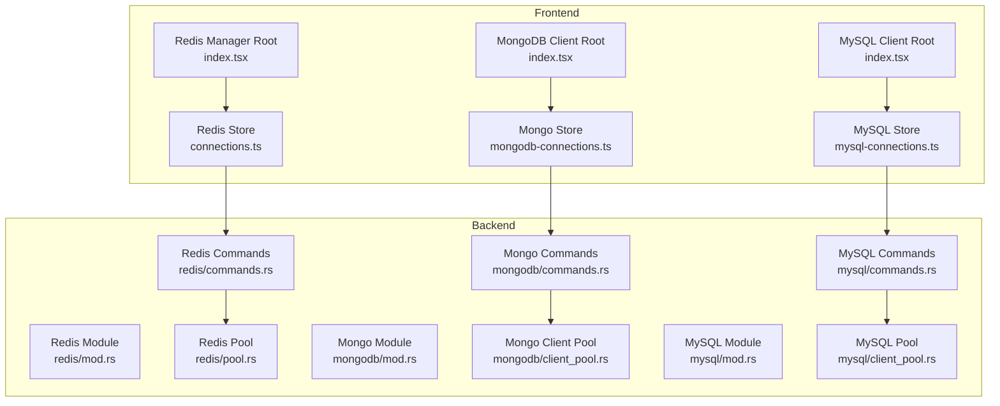
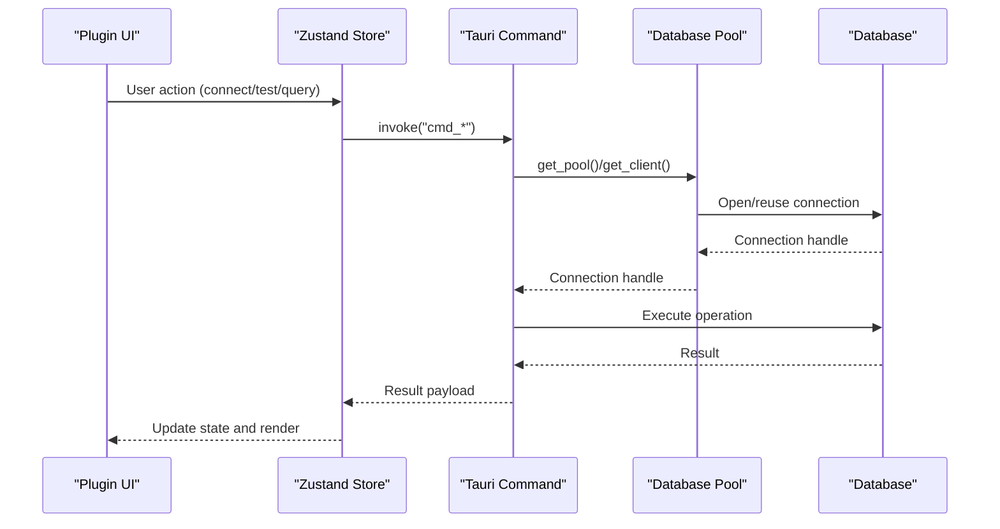
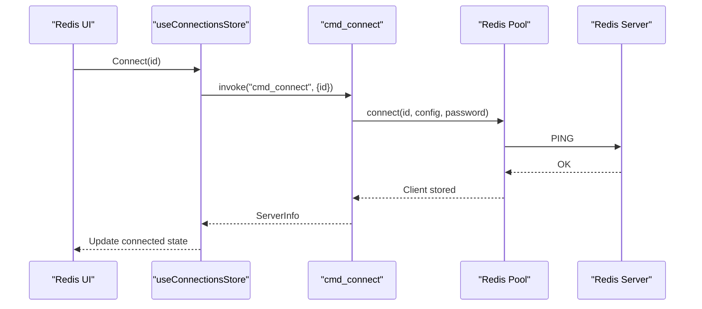
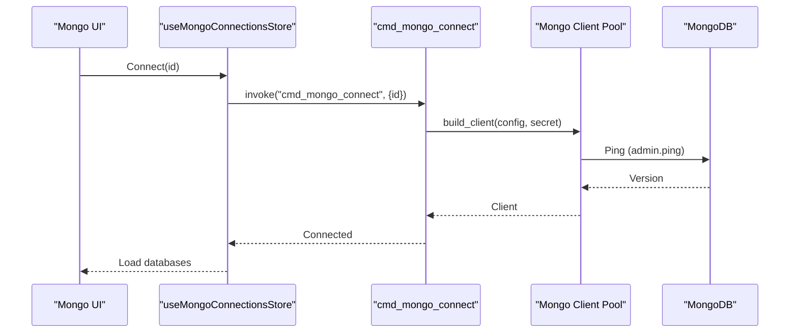
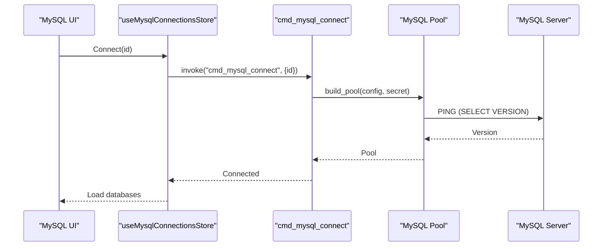
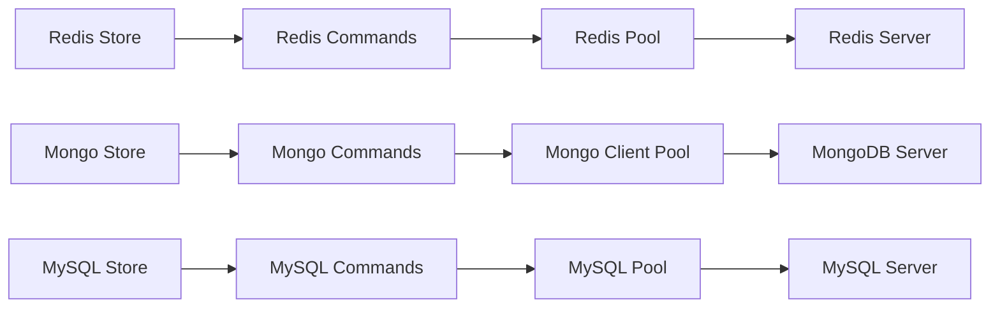

# Database Clients

<cite>
**Referenced Files in This Document**
- [redis-manager/index.tsx](file://src/plugins/redis-manager/index.tsx)
- [mongodb-client/index.tsx](file://src/plugins/mongodb-client/index.tsx)
- [mysql-client/index.tsx](file://src/plugins/mysql-client/index.tsx)
- [redis-manager/store/connections.ts](file://src/plugins/redis-manager/store/connections.ts)
- [mongodb-client/store/mongodb-connections.ts](file://src/plugins/mongodb-client/store/mongodb-connections.ts)
- [mysql-client/store/mysql-connections.ts](file://src/plugins/mysql-client/store/mysql-connections.ts)
- [redis/mod.rs](file://src-tauri/src/plugins/redis/mod.rs)
- [redis/pool.rs](file://src-tauri/src/plugins/redis/pool.rs)
- [redis/commands.rs](file://src-tauri/src/plugins/redis/commands.rs)
- [mongodb/mod.rs](file://src-tauri/src/plugins/mongodb/mod.rs)
- [mongodb/client_pool.rs](file://src-tauri/src/plugins/mongodb/client_pool.rs)
- [mongodb/commands.rs](file://src-tauri/src/plugins/mongodb/commands.rs)
- [mysql/mod.rs](file://src-tauri/src/plugins/mysql/mod.rs)
- [mysql/client_pool.rs](file://src-tauri/src/plugins/mysql/client_pool.rs)
- [mysql/commands.rs](file://src-tauri/src/plugins/mysql/commands.rs)
</cite>

## Table of Contents
1. [Introduction](#introduction)
2. [Project Structure](#project-structure)
3. [Core Components](#core-components)
4. [Architecture Overview](#architecture-overview)
5. [Detailed Component Analysis](#detailed-component-analysis)
6. [Dependency Analysis](#dependency-analysis)
7. [Performance Considerations](#performance-considerations)
8. [Troubleshooting Guide](#troubleshooting-guide)
9. [Conclusion](#conclusion)

## Introduction
This document provides comprehensive documentation for the three database client plugins: Redis Manager, MongoDB Client, and MySQL Client. It covers connection management, authentication methods, security considerations, shared patterns across plugins (connection pooling, query execution, result handling), and database-specific features. It also includes configuration guidance, connection string formats, troubleshooting tips, performance optimization strategies, bulk operations, and data export/import capabilities.

## Project Structure
Each plugin follows a consistent structure:
- A manifest entry that registers the plugin with the application shell
- A root view that manages workspace tabs and navigation
- A store module that encapsulates state and async operations via Tauri invocations
- Backend Rust modules implementing connection pools, commands, and type definitions

**Diagram sources**
- [redis-manager/index.tsx:14-57](file://src/plugins/redis-manager/index.tsx#L14-L57)
- [mongodb-client/index.tsx:14-77](file://src/plugins/mongodb-client/index.tsx#L14-L77)
- [mysql-client/index.tsx:14-35](file://src/plugins/mysql-client/index.tsx#L14-L35)
- [redis-manager/store/connections.ts:27-90](file://src/plugins/redis-manager/store/connections.ts#L27-L90)
- [mongodb-client/store/mongodb-connections.ts:96-295](file://src/plugins/mongodb-client/store/mongodb-connections.ts#L96-L295)
- [mysql-client/store/mysql-connections.ts:77-152](file://src/plugins/mysql-client/store/mysql-connections.ts#L77-L152)
- [redis/mod.rs:1-4](file://src-tauri/src/plugins/redis/mod.rs#L1-L4)
- [redis/pool.rs:10-75](file://src-tauri/src/plugins/redis/pool.rs#L10-L75)
- [redis/commands.rs:139-214](file://src-tauri/src/plugins/redis/commands.rs#L139-L214)
- [mongodb/mod.rs:1-4](file://src-tauri/src/plugins/mongodb/mod.rs#L1-L4)
- [mongodb/client_pool.rs:9-131](file://src-tauri/src/plugins/mongodb/client_pool.rs#L9-L131)
- [mongodb/commands.rs:124-169](file://src-tauri/src/plugins/mongodb/commands.rs#L124-L169)
- [mysql/mod.rs:1-4](file://src-tauri/src/plugins/mysql/mod.rs#L1-L4)
- [mysql/client_pool.rs:7-63](file://src-tauri/src/plugins/mysql/client_pool.rs#L7-L63)
- [mysql/commands.rs:176-214](file://src-tauri/src/plugins/mysql/commands.rs#L176-L214)

**Section sources**
- [redis-manager/index.tsx:14-67](file://src/plugins/redis-manager/index.tsx#L14-L67)
- [mongodb-client/index.tsx:14-87](file://src/plugins/mongodb-client/index.tsx#L14-L87)
- [mysql-client/index.tsx:14-38](file://src/plugins/mysql-client/index.tsx#L14-L38)

## Core Components
- Plugin manifests define the UI shell and routing for each database client.
- Stores manage state and orchestrate Tauri command invocations for CRUD operations, browsing, and server status.
- Backend modules implement connection pooling and command handlers for Redis, MongoDB, and MySQL.

Common patterns across plugins:
- Connection lifecycle: list, save, delete, test, connect, disconnect
- Workspace navigation via segmented controls
- Async operations via zustand stores invoking Tauri commands
- Result handling with typed pages or lists

**Section sources**
- [redis-manager/store/connections.ts:11-25](file://src/plugins/redis-manager/store/connections.ts#L11-L25)
- [mongodb-client/store/mongodb-connections.ts:27-77](file://src/plugins/mongodb-client/store/mongodb-connections.ts#L27-L77)
- [mysql-client/store/mysql-connections.ts:22-62](file://src/plugins/mysql-client/store/mysql-connections.ts#L22-L62)

## Architecture Overview
The frontend invokes Tauri commands defined in the backend. Each database plugin exposes a set of commands for connection management, browsing, querying, and administration. Connection pools are maintained per connection ID to reuse connections efficiently.

**Diagram sources**
- [redis/commands.rs:174-194](file://src-tauri/src/plugins/redis/commands.rs#L174-L194)
- [redis/pool.rs:39-48](file://src-tauri/src/plugins/redis/pool.rs#L39-L48)
- [mongodb/commands.rs:156-169](file://src-tauri/src/plugins/mongodb/commands.rs#L156-L169)
- [mongodb/client_pool.rs:107-123](file://src-tauri/src/plugins/mongodb/client_pool.rs#L107-L123)
- [mysql/commands.rs:201-214](file://src-tauri/src/plugins/mysql/commands.rs#L201-L214)
- [mysql/client_pool.rs:32-48](file://src-tauri/src/plugins/mysql/client_pool.rs#L32-L48)

## Detailed Component Analysis

### Redis Manager
Redis Manager provides a console, key browser, server info, and connection management. It supports scanning keys, getting/setting TTL, renaming keys, and executing raw commands with safety checks.

Key features:
- Connection management: list/save/delete/test/connect/disconnect/select DB
- Key operations: scan, type, TTL, rename, delete, string get/set, hash/list/set/zset operations
- Console: raw command execution with dangerous command confirmation
- Server info: INFO parsing, slowlog, dbsize

**Diagram sources**
- [redis-manager/store/connections.ts:59-68](file://src/plugins/redis-manager/store/connections.ts#L59-L68)
- [redis/commands.rs:174-194](file://src-tauri/src/plugins/redis/commands.rs#L174-L194)
- [redis/pool.rs:39-48](file://src-tauri/src/plugins/redis/pool.rs#L39-L48)

Security and authentication:
- Passwords are retrieved from secure storage and embedded in the Redis URL when present
- Dangerous commands require explicit confirmation

Connection string format:
- Standard Redis URL with optional password and DB index

Performance and bulk operations:
- SCAN with configurable count
- Bulk operations via list/hash/set/zset commands

Data export/import:
- Not exposed in the Redis plugin UI

**Section sources**
- [redis-manager/store/connections.ts:11-25](file://src/plugins/redis-manager/store/connections.ts#L11-L25)
- [redis/commands.rs:216-251](file://src-tauri/src/plugins/redis/commands.rs#L216-L251)
- [redis/commands.rs:668-695](file://src-tauri/src/plugins/redis/commands.rs#L668-L695)
- [redis/pool.rs:15-26](file://src-tauri/src/plugins/redis/pool.rs#L15-L26)

### MongoDB Client
MongoDB Client offers database/browser, document browser, query workspace, index manager, import/export, and server status. It supports find queries, aggregations, indexes, and bulk import/export.

Key features:
- Connection management: list/save/delete/test/connect/disconnect
- Namespace management: databases/collections
- Documents: find, insert, update, delete, pagination
- Aggregation pipeline execution
- Index management: list/create/drop
- Import/export: JSON/JSONL with preview and modes
- Server status and query history

**Diagram sources**
- [mongodb-client/store/mongodb-connections.ts:146-161](file://src/plugins/mongodb-client/store/mongodb-connections.ts#L146-L161)
- [mongodb/commands.rs:156-169](file://src-tauri/src/plugins/mongodb/commands.rs#L156-L169)
- [mongodb/client_pool.rs:14-105](file://src-tauri/src/plugins/mongodb/client_pool.rs#L14-L105)

Security and authentication:
- Supports URI mode and host/port modes
- SRV mode supported with auth parameters and TLS
- Credentials can be provided via secret storage

Connection string formats:
- URI mode: standard MongoDB connection string
- Host/port mode: host, port, optional auth database, replica set, TLS
- SRV mode: auto-discovery with auth and query parameters

Performance and bulk operations:
- Aggregation pipeline execution
- Bulk import with replace/upsert modes
- Pagination for find queries

Data export/import:
- Export documents to JSON/JSONL
- Import from JSON/JSONL with preview and modes

**Section sources**
- [mongodb-client/store/mongodb-connections.ts:56-76](file://src/plugins/mongodb-client/store/mongodb-connections.ts#L56-L76)
- [mongodb/commands.rs:480-520](file://src-tauri/src/plugins/mongodb/commands.rs#L480-L520)
- [mongodb/commands.rs:636-672](file://src-tauri/src/plugins/mongodb/commands.rs#L636-L672)
- [mongodb/commands.rs:711-755](file://src-tauri/src/plugins/mongodb/commands.rs#L711-L755)

### MySQL Client
MySQL Client provides database/browser, table data viewer, SQL workspace, index manager, import/export, and server status. It supports CRUD operations on rows, SQL execution, and bulk import/export.

Key features:
- Connection management: list/save/delete/test/connect/disconnect
- Databases/tables browsing
- Table data: describe, status, paginated rows
- Row operations: insert/update/delete with PK constraints
- SQL execution with query/statement differentiation
- Index management
- Import/export: JSON/CSV with preview and modes
- Server status and query history

**Diagram sources**
- [mysql-client/store/mysql-connections.ts:108-113](file://src/plugins/mysql-client/store/mysql-connections.ts#L108-L113)
- [mysql/commands.rs:201-214](file://src-tauri/src/plugins/mysql/commands.rs#L201-L214)
- [mysql/client_pool.rs:12-30](file://src-tauri/src/plugins/mysql/client_pool.rs#L12-L30)

Security and authentication:
- Username/password via secrets
- Charset initialization and SSL mode support

Connection string formats:
- Host/port with optional default database and charset
- SSL mode configuration

Performance and bulk operations:
- Paginated row selection with limits
- Bulk import with INSERT/REPLACE modes
- Index creation/dropping

Data export/import:
- Export rows to JSON/CSV
- Import from JSON/CSV with preview and modes

**Section sources**
- [mysql-client/store/mysql-connections.ts:47-61](file://src/plugins/mysql-client/store/mysql-connections.ts#L47-L61)
- [mysql/commands.rs:296-322](file://src-tauri/src/plugins/mysql/commands.rs#L296-L322)
- [mysql/commands.rs:503-531](file://src-tauri/src/plugins/mysql/commands.rs#L503-L531)
- [mysql/commands.rs:579-601](file://src-tauri/src/plugins/mysql/commands.rs#L579-L601)

## Dependency Analysis
- Frontend stores depend on Tauri’s invoke mechanism to call backend commands
- Backend commands depend on database-specific pools to obtain connections
- Pools maintain a static map keyed by connection ID for thread-safe access

**Diagram sources**
- [redis-manager/store/connections.ts:36-46](file://src/plugins/redis-manager/store/connections.ts#L36-L46)
- [mongodb-client/store/mongodb-connections.ts:132-137](file://src/plugins/mongodb-client/store/mongodb-connections.ts#L132-L137)
- [mysql-client/store/mysql-connections.ts:99-102](file://src/plugins/mysql-client/store/mysql-connections.ts#L99-L102)
- [redis/commands.rs:139-156](file://src-tauri/src/plugins/redis/commands.rs#L139-L156)
- [mongodb/commands.rs:124-143](file://src-tauri/src/plugins/mongodb/commands.rs#L124-L143)
- [mysql/commands.rs:176-190](file://src-tauri/src/plugins/mysql/commands.rs#L176-L190)
- [redis/pool.rs:10-13](file://src-tauri/src/plugins/redis/pool.rs#L10-L13)
- [mongodb/client_pool.rs:9-12](file://src-tauri/src/plugins/mongodb/client_pool.rs#L9-L12)
- [mysql/client_pool.rs:7-10](file://src-tauri/src/plugins/mysql/client_pool.rs#L7-L10)

**Section sources**
- [redis/mod.rs:1-4](file://src-tauri/src/plugins/redis/mod.rs#L1-L4)
- [mongodb/mod.rs:1-4](file://src-tauri/src/plugins/mongodb/mod.rs#L1-L4)
- [mysql/mod.rs:1-4](file://src-tauri/src/plugins/mysql/mod.rs#L1-L4)

## Performance Considerations
- Connection pooling: Each plugin maintains a static pool keyed by connection ID to avoid repeated handshake overhead.
- Redis: Uses a simple HashMap-based pool guarded by a mutex; ensure minimal contention by reusing connections.
- MongoDB: Builds clients from configuration and secrets; ping verifies connectivity before storing.
- MySQL: Uses mysql_async Pool with charset initialization; disconnects pools on removal.
- Pagination: MongoDB find and MySQL select support skip/limit to control result size.
- Bulk operations: MongoDB aggregation and import; MySQL bulk INSERT/REPLACE modes.
- Export limits: Plugins cap exports at 10,000 items to prevent memory pressure.

[No sources needed since this section provides general guidance]

## Troubleshooting Guide
Common issues and resolutions:
- Connection failures
  - Verify credentials and network reachability
  - Test connection via plugin UI to measure latency
  - Check backend logs for pool acquisition errors
- Authentication problems
  - Redis: Ensure password is properly encoded in URL
  - MongoDB: Confirm URI/host/port/auth settings and TLS flags
  - MySQL: Validate username/password and SSL mode
- Dangerous commands (Redis)
  - Raw commands like FLUSHALL/FLUSHDB require explicit confirmation
- Large result sets
  - Use pagination (skip/limit) to reduce memory usage
- Export/import errors
  - Validate JSON/JSONL/CSV format and preview before bulk operations
- Pool cleanup
  - Disconnect removes pooled connections; ensure proper lifecycle management

**Section sources**
- [redis/commands.rs:674-679](file://src-tauri/src/plugins/redis/commands.rs#L674-L679)
- [redis/commands.rs:158-172](file://src-tauri/src/plugins/redis/commands.rs#L158-L172)
- [mongodb/commands.rs:145-154](file://src-tauri/src/plugins/mongodb/commands.rs#L145-L154)
- [mysql/commands.rs:192-199](file://src-tauri/src/plugins/mysql/commands.rs#L192-L199)

## Conclusion
The three database client plugins share a consistent architecture with connection pooling, robust command invocation, and strong separation of concerns between frontend stores and backend pools. Each plugin leverages database-specific capabilities—Redis key operations, MongoDB document querying/aggregation, and MySQL SQL execution—while providing secure authentication, pagination, bulk operations, and export/import features. Following the patterns and guidelines outlined here ensures reliable, performant, and secure database interactions.