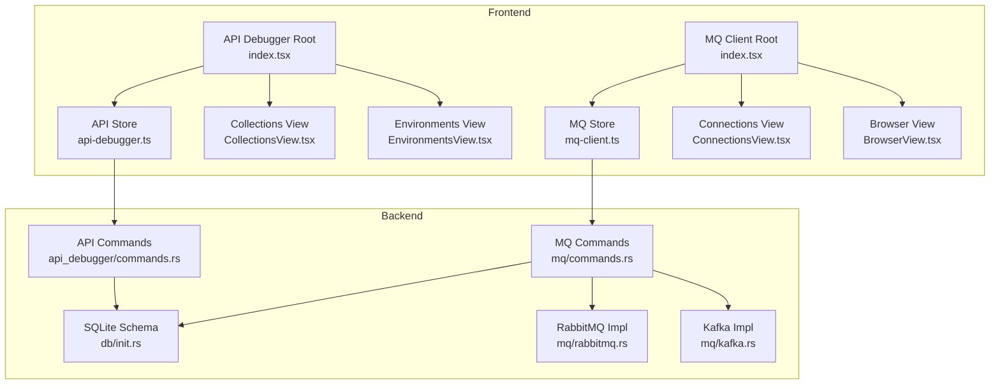
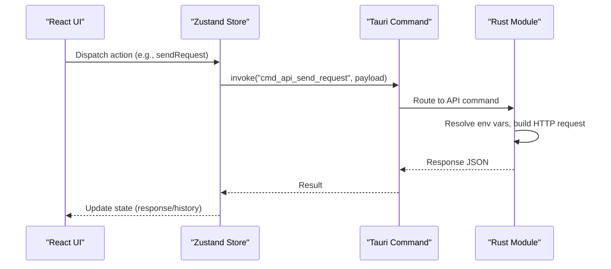
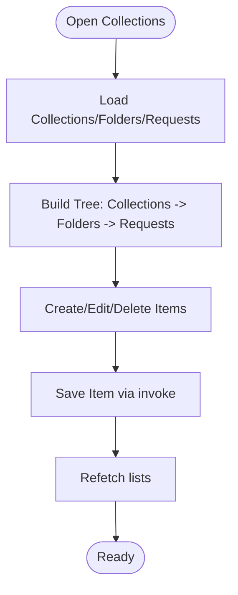
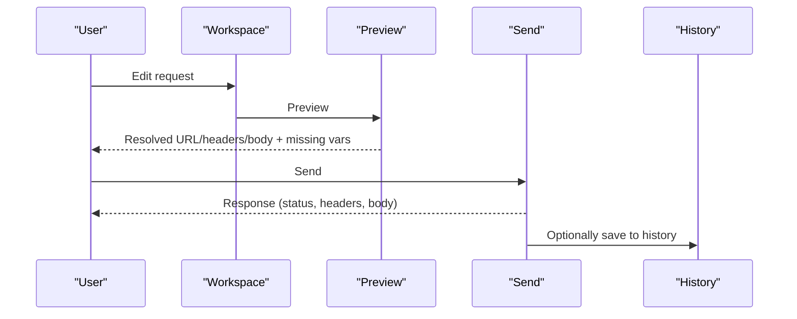
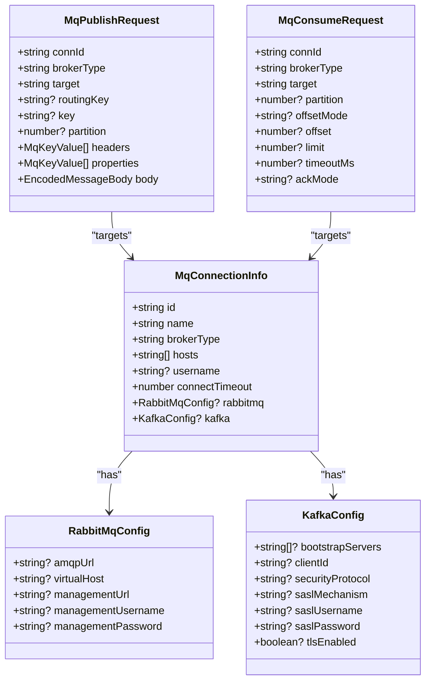
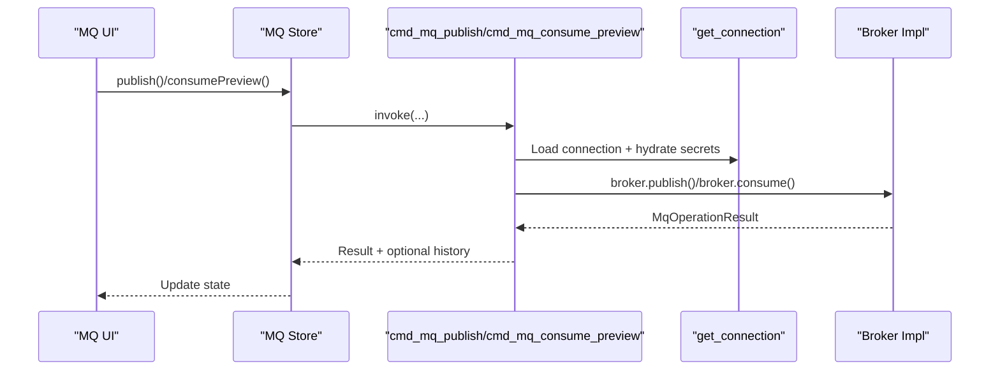
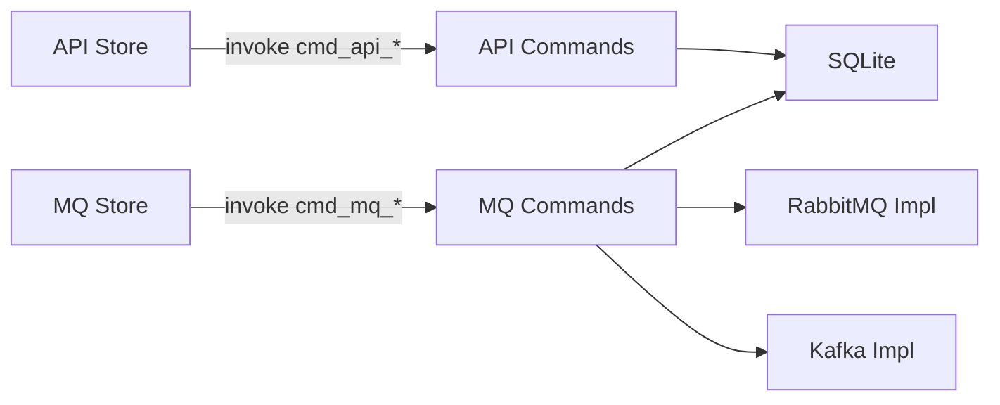

# Development Tools

<cite>
**Referenced Files in This Document**
- [index.tsx](file://src/plugins/api-debugger/index.tsx)
- [api-debugger.ts](file://src/plugins/api-debugger/store/api-debugger.ts)
- [types.ts](file://src/plugins/api-debugger/types.ts)
- [CollectionsView.tsx](file://src/plugins/api-debugger/views/CollectionsView.tsx)
- [EnvironmentsView.tsx](file://src/plugins/api-debugger/views/EnvironmentsView.tsx)
- [index.tsx](file://src/plugins/mq-client/index.tsx)
- [mq-client.ts](file://src/plugins/mq-client/store/mq-client.ts)
- [types.ts](file://src/plugins/mq-client/types.ts)
- [ConnectionsView.tsx](file://src/plugins/mq-client/views/ConnectionsView.tsx)
- [BrowserView.tsx](file://src/plugins/mq-client/views/BrowserView.tsx)
- [commands.rs](file://src-tauri/src/plugins/api_debugger/commands.rs)
- [commands.rs](file://src-tauri/src/plugins/mq/commands.rs)
- [rabbitmq.rs](file://src-tauri/src/plugins/mq/rabbitmq.rs)
- [kafka.rs](file://src-tauri/src/plugins/mq/kafka.rs)
- [init.rs](file://src-tauri/src/db/init.rs)
</cite>

## Table of Contents
1. [Introduction](#introduction)
2. [Project Structure](#project-structure)
3. [Core Components](#core-components)
4. [Architecture Overview](#architecture-overview)
5. [Detailed Component Analysis](#detailed-component-analysis)
6. [Dependency Analysis](#dependency-analysis)
7. [Performance Considerations](#performance-considerations)
8. [Troubleshooting Guide](#troubleshooting-guide)
9. [Conclusion](#conclusion)
10. [Appendices](#appendices)

## Introduction
This document describes two development-focused plugins: API Debugger and MQ Client. It explains how to organize API collections, manage environments, debug requests and responses, and leverage a mock-like history. It also covers MQ Client’s capabilities for RabbitMQ and Kafka, including connection management, resource browsing, publishing, and consuming previews. The guide includes practical workflows, integration patterns, and guidance for performance testing and debugging.

## Project Structure
Both plugins are implemented as React components with Zustand stores and Tauri backend commands. The frontend communicates with the backend via invoke calls, which delegate to Rust modules for HTTP and MQ operations. Data is persisted in a local SQLite database initialized at runtime.

**Diagram sources**
- [index.tsx:13-38](file://src/plugins/api-debugger/index.tsx#L13-L38)
- [index.tsx:13-37](file://src/plugins/mq-client/index.tsx#L13-L37)
- [api-debugger.ts:47-128](file://src/plugins/api-debugger/store/api-debugger.ts#L47-L128)
- [mq-client.ts:52-102](file://src/plugins/mq-client/store/mq-client.ts#L52-L102)
- [commands.rs:391-475](file://src-tauri/src/plugins/api_debugger/commands.rs#L391-L475)
- [commands.rs:152-207](file://src-tauri/src/plugins/mq/commands.rs#L152-L207)
- [rabbitmq.rs:66-104](file://src-tauri/src/plugins/mq/rabbitmq.rs#L66-L104)
- [kafka.rs:44-72](file://src-tauri/src/plugins/mq/kafka.rs#L44-L72)
- [init.rs:179-278](file://src-tauri/src/db/init.rs#L179-L278)

**Section sources**
- [index.tsx:1-39](file://src/plugins/api-debugger/index.tsx#L1-L39)
- [index.tsx:1-38](file://src/plugins/mq-client/index.tsx#L1-L38)
- [api-debugger.ts:1-129](file://src/plugins/api-debugger/store/api-debugger.ts#L1-L129)
- [mq-client.ts:1-103](file://src/plugins/mq-client/store/mq-client.ts#L1-L103)
- [init.rs:179-278](file://src-tauri/src/db/init.rs#L179-L278)

## Core Components
- API Debugger
  - Workspace for crafting requests, previewing resolved values, sending, canceling, saving, importing cURL, and exporting collections.
  - Collections and Folders for organizing requests.
  - Environments for variable substitution and optional encryption of secrets.
  - History for reviewing past requests/responses with filtering and redaction.
- MQ Client
  - Connection management for RabbitMQ and Kafka with diagnostics and browsing.
  - Publishing and consuming previews with configurable offsets and partitions.
  - Saved message templates for reuse.
  - History for operations with filtering.

**Section sources**
- [api-debugger.ts:47-128](file://src/plugins/api-debugger/store/api-debugger.ts#L47-L128)
- [types.ts:1-105](file://src/plugins/api-debugger/types.ts#L1-L105)
- [CollectionsView.tsx:59-166](file://src/plugins/api-debugger/views/CollectionsView.tsx#L59-L166)
- [EnvironmentsView.tsx:8-64](file://src/plugins/api-debugger/views/EnvironmentsView.tsx#L8-L64)
- [mq-client.ts:52-102](file://src/plugins/mq-client/store/mq-client.ts#L52-L102)
- [types.ts:1-90](file://src/plugins/mq-client/types.ts#L1-L90)
- [ConnectionsView.tsx:8-92](file://src/plugins/mq-client/views/ConnectionsView.tsx#L8-L92)
- [BrowserView.tsx:11-23](file://src/plugins/mq-client/views/BrowserView.tsx#L11-L23)

## Architecture Overview
The frontend invokes Tauri commands to perform operations. The backend executes the work (HTTP requests or MQ operations) and persists results to SQLite. Stores orchestrate UI state and command invocations.

**Diagram sources**
- [api-debugger.ts:62-72](file://src/plugins/api-debugger/store/api-debugger.ts#L62-L72)
- [commands.rs:403-475](file://src-tauri/src/plugins/api_debugger/commands.rs#L403-L475)

**Section sources**
- [api-debugger.ts:62-72](file://src/plugins/api-debugger/store/api-debugger.ts#L62-L72)
- [commands.rs:403-475](file://src-tauri/src/plugins/api_debugger/commands.rs#L403-L475)

## Detailed Component Analysis

### API Debugger: Collections, Environments, and History
- Organization
  - Collections and nested Folders group related requests.
  - Requests can be saved into collections/folders or left unorganized.
- Environments
  - Named sets of variables with enable/disable and secret flags.
  - Secrets are encrypted at rest and decrypted only during resolution.
- Preview and Resolution
  - Preview resolves variables and shows effective URL/headers/body preview and missing variables.
- History
  - Redacts sensitive data and truncates large bodies.
  - Supports filtering by method/host/status/limit.

**Diagram sources**
- [CollectionsView.tsx:119-143](file://src/plugins/api-debugger/views/CollectionsView.tsx#L119-L143)
- [api-debugger.ts:90-98](file://src/plugins/api-debugger/store/api-debugger.ts#L90-L98)

**Section sources**
- [CollectionsView.tsx:59-166](file://src/plugins/api-debugger/views/CollectionsView.tsx#L59-L166)
- [EnvironmentsView.tsx:8-64](file://src/plugins/api-debugger/views/EnvironmentsView.tsx#L8-L64)
- [api-debugger.ts:90-127](file://src/plugins/api-debugger/store/api-debugger.ts#L90-L127)
- [commands.rs:125-154](file://src-tauri/src/plugins/api_debugger/commands.rs#L125-L154)
- [commands.rs:391-401](file://src-tauri/src/plugins/api_debugger/commands.rs#L391-L401)
- [commands.rs:671-696](file://src-tauri/src/plugins/api_debugger/commands.rs#L671-L696)

### API Debugger: Request Workflow and Mock Server Notes
- Workflow
  - Compose request in Workspace (method, URL, params, headers, cookies, auth, body).
  - Preview to see resolved values and missing variables.
  - Send to execute; response is shown and optionally saved to history.
  - Import cURL to quickly populate a request.
- Mock Server
  - No embedded HTTP mock server is present in the backend. Responses come from real endpoints or history.

**Diagram sources**
- [api-debugger.ts:73-76](file://src/plugins/api-debugger/store/api-debugger.ts#L73-L76)
- [api-debugger.ts:62-72](file://src/plugins/api-debugger/store/api-debugger.ts#L62-L72)
- [commands.rs:391-401](file://src-tauri/src/plugins/api_debugger/commands.rs#L391-L401)
- [commands.rs:403-475](file://src-tauri/src/plugins/api_debugger/commands.rs#L403-L475)

**Section sources**
- [api-debugger.ts:24-28](file://src/plugins/api-debugger/store/api-debugger.ts#L24-L28)
- [commands.rs:713-738](file://src-tauri/src/plugins/api_debugger/commands.rs#L713-L738)

### MQ Client: RabbitMQ and Kafka
- Connections
  - Define broker type, hosts, credentials, timeouts, and broker-specific configs (AMQP URL/vhost for RabbitMQ; SASL/security for Kafka).
  - Test connectivity and view diagnostics with stage-by-stage results.
- Browsing
  - RabbitMQ: Requires Management Plugin; browses queues/exchanges/bindings.
  - Kafka: Lists brokers, topics, partitions, and consumer groups (read-only).
- Publishing and Consuming
  - Publish to exchanges (RabbitMQ) or topics (Kafka) with routing keys/partition selection.
  - Consume preview supports offset modes and limits; Kafka can target a partition or subscribe to a topic.
- Templates and History
  - Save reusable message templates; view operation history with filtering.

**Diagram sources**
- [types.ts:4-39](file://src/plugins/mq-client/types.ts#L4-L39)
- [types.ts:46-70](file://src/plugins/mq-client/types.ts#L46-L70)

**Section sources**
- [ConnectionsView.tsx:8-92](file://src/plugins/mq-client/views/ConnectionsView.tsx#L8-L92)
- [BrowserView.tsx:11-23](file://src/plugins/mq-client/views/BrowserView.tsx#L11-L23)
- [mq-client.ts:63-82](file://src/plugins/mq-client/store/mq-client.ts#L63-L82)
- [commands.rs:152-207](file://src-tauri/src/plugins/mq/commands.rs#L152-L207)
- [rabbitmq.rs:66-104](file://src-tauri/src/plugins/mq/rabbitmq.rs#L66-L104)
- [kafka.rs:44-72](file://src-tauri/src/plugins/mq/kafka.rs#L44-L72)

### MQ Client: Operation Sequence (Publish/Consume)

**Diagram sources**
- [mq-client.ts:84-94](file://src/plugins/mq-client/store/mq-client.ts#L84-L94)
- [commands.rs:182-207](file://src-tauri/src/plugins/mq/commands.rs#L182-L207)
- [rabbitmq.rs:136-165](file://src-tauri/src/plugins/mq/rabbitmq.rs#L136-L165)
- [kafka.rs:148-176](file://src-tauri/src/plugins/mq/kafka.rs#L148-L176)

**Section sources**
- [mq-client.ts:84-94](file://src/plugins/mq-client/store/mq-client.ts#L84-L94)
- [commands.rs:182-207](file://src-tauri/src/plugins/mq/commands.rs#L182-L207)

## Dependency Analysis
- Frontend-to-Backend
  - API Debugger store invokes commands prefixed with "cmd_api_*".
  - MQ Client store invokes commands prefixed with "cmd_mq_*".
- Backend Modules
  - API commands depend on SQLite schema for collections, requests, environments, and history.
  - MQ commands depend on SQLite schema for connections, message history, and saved messages.
  - MQ commands route to broker-specific implementations (RabbitMQ/Kafka).
- Security
  - Sensitive environment variables and broker passwords/secrets are encrypted at rest and decrypted only when resolving or connecting.

**Diagram sources**
- [api-debugger.ts:62-72](file://src/plugins/api-debugger/store/api-debugger.ts#L62-L72)
- [mq-client.ts:84-89](file://src/plugins/mq-client/store/mq-client.ts#L84-L89)
- [commands.rs:391-475](file://src-tauri/src/plugins/api_debugger/commands.rs#L391-L475)
- [commands.rs:152-207](file://src-tauri/src/plugins/mq/commands.rs#L152-L207)
- [init.rs:179-278](file://src-tauri/src/db/init.rs#L179-L278)

**Section sources**
- [api-debugger.ts:62-72](file://src/plugins/api-debugger/store/api-debugger.ts#L62-L72)
- [mq-client.ts:84-89](file://src/plugins/mq-client/store/mq-client.ts#L84-L89)
- [commands.rs:642-661](file://src-tauri/src/plugins/api_debugger/commands.rs#L642-L661)
- [commands.rs:92-101](file://src-tauri/src/plugins/mq/commands.rs#L92-L101)

## Performance Considerations
- API Debugger
  - Response body truncation prevents excessive memory usage for large payloads.
  - Timeout and redirect policies are configurable; defaults clamp extremes.
  - History redaction avoids storing sensitive data unnecessarily.
- MQ Client
  - Consumer previews poll with bounded limits and timeouts to avoid long-running operations.
  - Kafka metadata and group listings are read-only and lightweight.
  - RabbitMQ Management API is used for browsing when configured; otherwise browsing is limited.

[No sources needed since this section provides general guidance]

## Troubleshooting Guide
- API Debugger
  - Missing variables: Preview highlights missing variables; ensure environment variables are defined and enabled.
  - SSL validation: Toggle validate SSL to bypass certificate checks when needed.
  - History redaction: Sensitive values are masked; adjust environment variable secrets if necessary.
- MQ Client
  - Diagnostics: Use Test to check connectivity stages; errors/warnings indicate failures in client or management endpoints.
  - RabbitMQ browsing: Requires Management Plugin; without it, browsing is limited.
  - Kafka offsets: Consumer previews do not commit offsets; configure partition/offset modes as needed.

**Section sources**
- [commands.rs:205-234](file://src-tauri/src/plugins/api_debugger/commands.rs#L205-L234)
- [commands.rs:152-160](file://src-tauri/src/plugins/mq/commands.rs#L152-L160)
- [rabbitmq.rs:88-95](file://src-tauri/src/plugins/mq/rabbitmq.rs#L88-L95)
- [kafka.rs:178-242](file://src-tauri/src/plugins/mq/kafka.rs#L178-L242)

## Conclusion
The API Debugger and MQ Client plugins provide robust development workflows: organizing API requests with collections and environments, previewing and sending requests, and maintaining a redacted history; and managing MQ connections, browsing resources, publishing, and consuming previews for RabbitMQ and Kafka. Together, they support efficient debugging, testing, and integration tasks with secure storage and diagnostics.

[No sources needed since this section summarizes without analyzing specific files]

## Appendices

### API Testing Workflows
- Organize: Create collections and folders; save requests into them.
- Configure: Create environments with variables; mark secrets for encryption.
- Debug: Use Preview to validate variable resolution; Send to execute; inspect response and timing.
- Automate: Export collections; import cURL to quickly bootstrap requests.

**Section sources**
- [CollectionsView.tsx:59-166](file://src/plugins/api-debugger/views/CollectionsView.tsx#L59-L166)
- [EnvironmentsView.tsx:8-64](file://src/plugins/api-debugger/views/EnvironmentsView.tsx#L8-L64)
- [api-debugger.ts:126-127](file://src/plugins/api-debugger/store/api-debugger.ts#L126-L127)
- [commands.rs:713-738](file://src-tauri/src/plugins/api_debugger/commands.rs#L713-L738)

### MQ Monitoring and Integration Patterns
- Monitor: Connect to RabbitMQ or Kafka; browse resources; review history.
- Integrate: Use templates to standardize message payloads; publish to exchanges/topics; preview consumes to validate message flow.

**Section sources**
- [ConnectionsView.tsx:8-92](file://src/plugins/mq-client/views/ConnectionsView.tsx#L8-L92)
- [BrowserView.tsx:11-23](file://src/plugins/mq-client/views/BrowserView.tsx#L11-L23)
- [mq-client.ts:99-102](file://src/plugins/mq-client/store/mq-client.ts#L99-L102)
- [commands.rs:250-275](file://src-tauri/src/plugins/mq/commands.rs#L250-L275)

### Performance Testing and Load Simulation Notes
- API Debugger
  - Adjust timeoutMs and followRedirects; validate SSL as needed.
  - Use history filtering to focus on recent runs.
- MQ Client
  - Tune limit and timeoutMs for consume previews; select partitions for targeted inspection.
  - For load simulation, use external tools or scripts; the MQ Client focuses on inspection and publishing.

[No sources needed since this section provides general guidance]