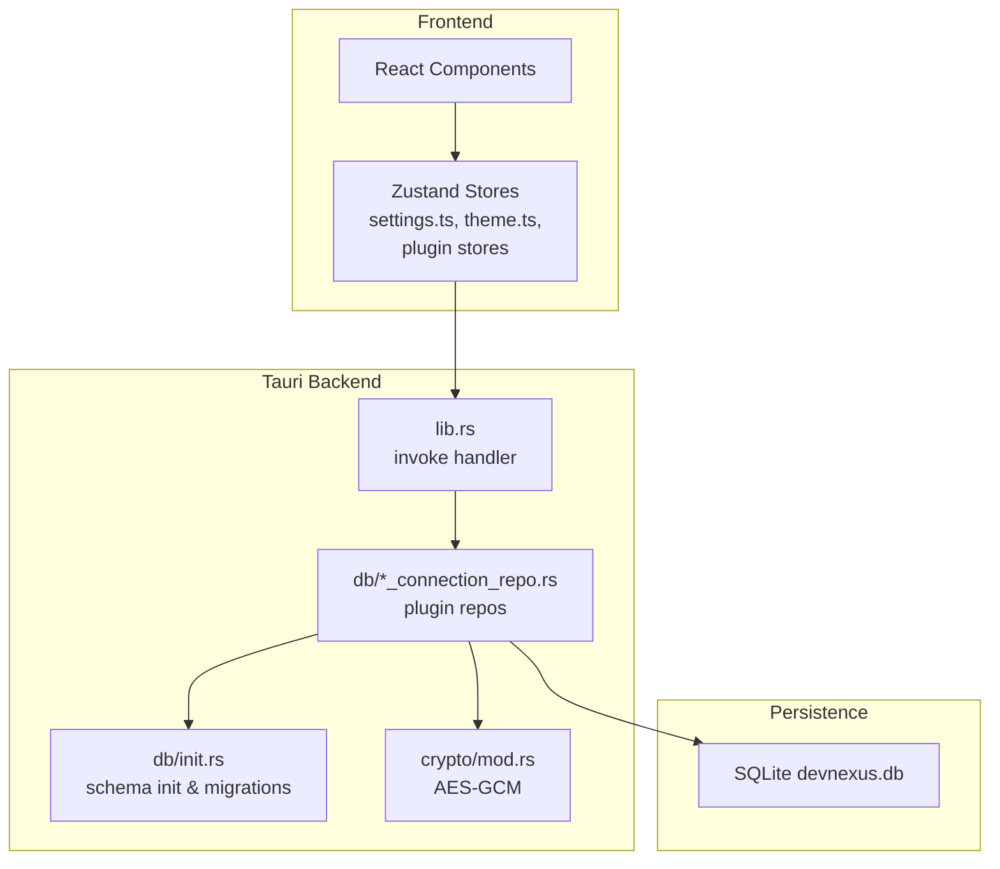
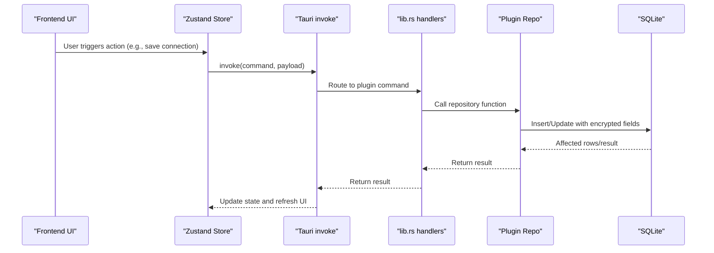
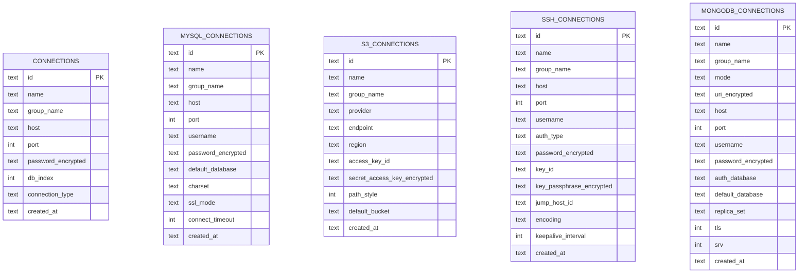
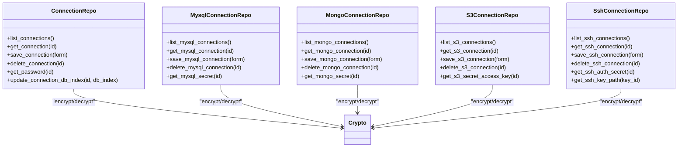
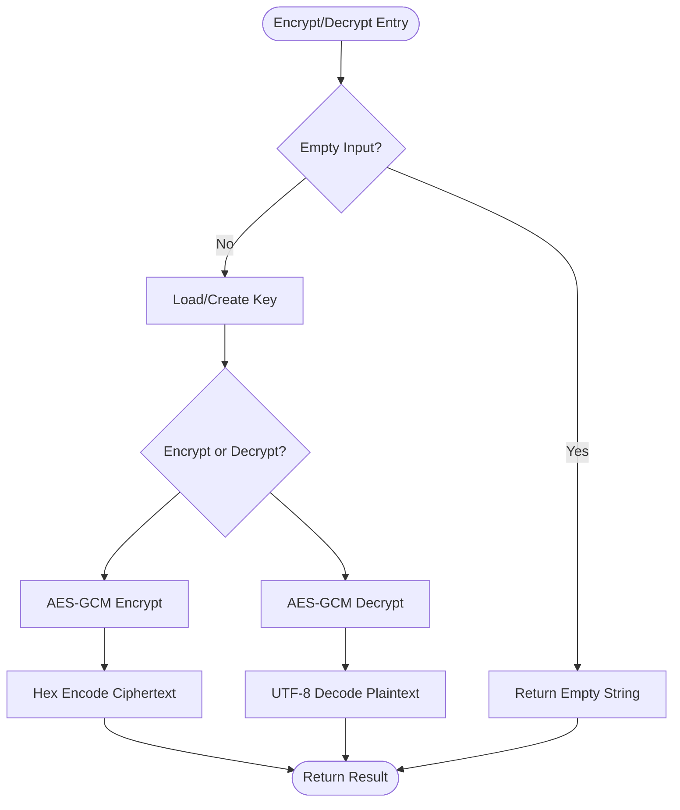
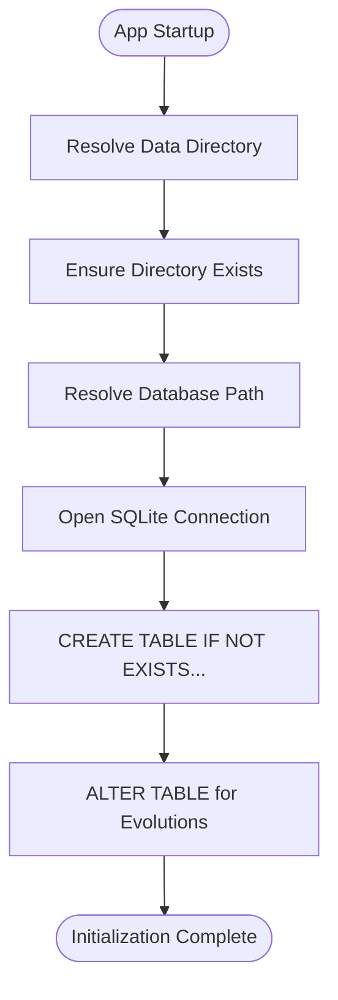
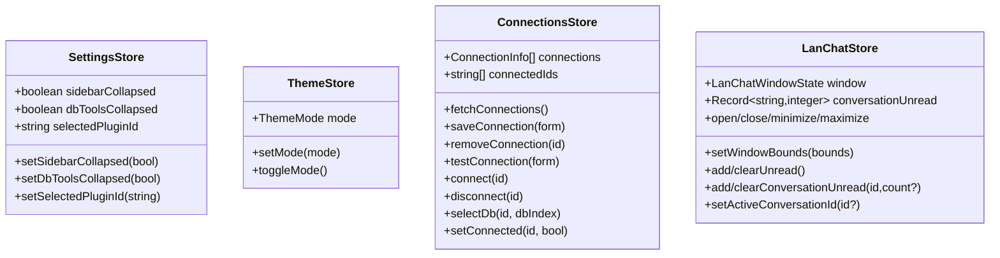
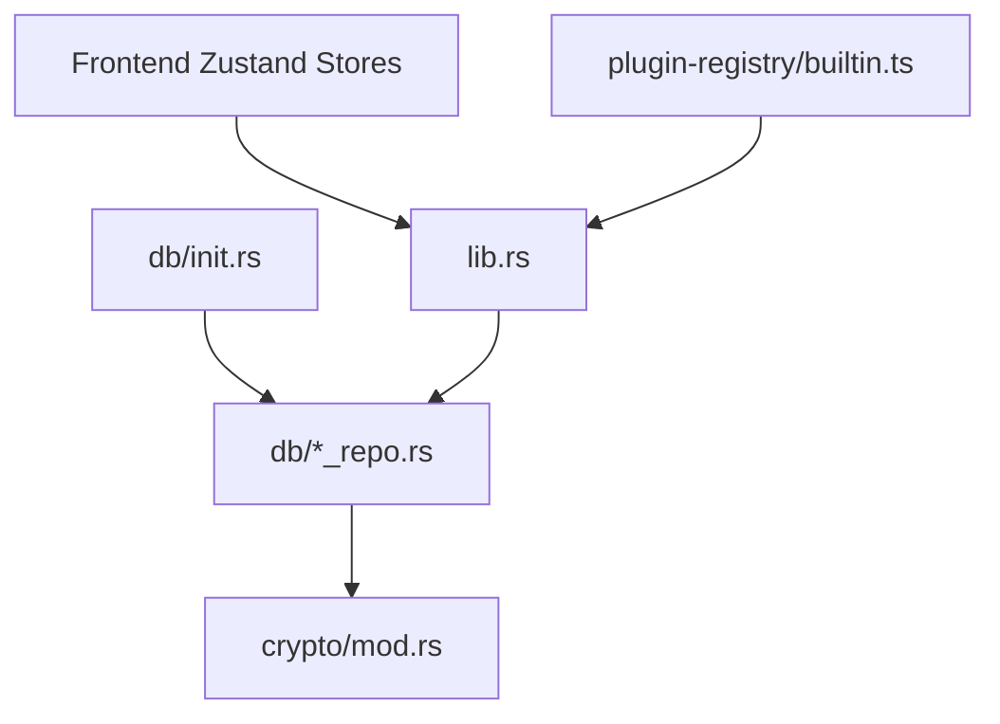

# Data Management & Database Design

<cite>
**Referenced Files in This Document**
- [mod.rs](file://src-tauri/src/db/mod.rs)
- [init.rs](file://src-tauri/src/db/init.rs)
- [connection_repo.rs](file://src-tauri/src/db/connection_repo.rs)
- [mysql_connection_repo.rs](file://src-tauri/src/db/mysql_connection_repo.rs)
- [mongodb_connection_repo.rs](file://src-tauri/src/db/mongodb_connection_repo.rs)
- [s3_connection_repo.rs](file://src-tauri/src/db/s3_connection_repo.rs)
- [ssh_connection_repo.rs](file://src-tauri/src/db/ssh_connection_repo.rs)
- [mod.rs](file://src-tauri/src/crypto/mod.rs)
- [lib.rs](file://src-tauri/src/lib.rs)
- [settings.ts](file://src/app/store/settings.ts)
- [theme.ts](file://src/app/store/theme.ts)
- [connections.ts](file://src/plugins/redis-manager/store/connections.ts)
- [lan-chat.ts](file://src/plugins/lan-chat/store/lan-chat.ts)
- [builtin.ts](file://src/app/plugin-registry/builtin.ts)
</cite>

## Table of Contents
1. [Introduction](#introduction)
2. [Project Structure](#project-structure)
3. [Core Components](#core-components)
4. [Architecture Overview](#architecture-overview)
5. [Detailed Component Analysis](#detailed-component-analysis)
6. [Dependency Analysis](#dependency-analysis)
7. [Performance Considerations](#performance-considerations)
8. [Troubleshooting Guide](#troubleshooting-guide)
9. [Conclusion](#conclusion)

## Introduction
This document provides comprehensive data model documentation for the DevNexus data management system. It covers the SQLite database schema design, the repository pattern implementation for connection management across plugins, and the AES-GCM encryption mechanisms used for sensitive data. It also documents database initialization and migration strategies, schema evolution, and the state management architecture using Zustand for global settings, theme persistence, and plugin-specific state isolation.

## Project Structure
The data management system spans three main layers:
- Backend Rust layer (Tauri) implementing database initialization, schema migrations, and plugin-specific connection repositories.
- Crypto module providing AES-GCM encryption/decryption for sensitive fields.
- Frontend Zustand stores managing global settings, theme, and plugin-specific state.

**Diagram sources**
- [lib.rs:26-259](file://src-tauri/src/lib.rs#L26-L259)
- [init.rs:28-392](file://src-tauri/src/db/init.rs#L28-L392)
- [mod.rs:1-7](file://src-tauri/src/db/mod.rs#L1-L7)
- [mod.rs:1-75](file://src-tauri/src/crypto/mod.rs#L1-L75)

**Section sources**
- [lib.rs:10-262](file://src-tauri/src/lib.rs#L10-L262)
- [init.rs:1-393](file://src-tauri/src/db/init.rs#L1-L393)
- [mod.rs:1-7](file://src-tauri/src/db/mod.rs#L1-L7)
- [mod.rs:1-75](file://src-tauri/src/crypto/mod.rs#L1-L75)

## Core Components
- SQLite schema initialization and migrations: Creates and evolves tables for connections, history, and plugin-specific entities.
- Repository pattern per plugin: Provides CRUD operations for each connection type with unified encryption handling.
- AES-GCM encryption: Centralized encryption/decryption for sensitive fields stored in the database.
- Zustand stores: Global settings and theme persistence, plus plugin-specific stores for isolated state.

**Section sources**
- [init.rs:35-392](file://src-tauri/src/db/init.rs#L35-L392)
- [connection_repo.rs:96-155](file://src-tauri/src/db/connection_repo.rs#L96-L155)
- [mod.rs:40-74](file://src-tauri/src/crypto/mod.rs#L40-L74)
- [settings.ts:1-27](file://src/app/store/settings.ts#L1-L27)
- [theme.ts:1-26](file://src/app/store/theme.ts#L1-L26)

## Architecture Overview
The backend initializes the database on startup, registers all plugin commands, and exposes them to the frontend via Tauri’s invoke mechanism. Frontend Zustand stores orchestrate user actions, invoke backend commands, and update state accordingly. Repositories encapsulate database operations and apply encryption to sensitive fields.

**Diagram sources**
- [lib.rs:26-259](file://src-tauri/src/lib.rs#L26-L259)
- [connections.ts:42-54](file://src/plugins/redis-manager/store/connections.ts#L42-L54)
- [connection_repo.rs:96-131](file://src-tauri/src/db/connection_repo.rs#L96-L131)

## Detailed Component Analysis

### SQLite Schema Design and Initialization
- Data directory and database path resolution with legacy migration support.
- Single-file SQLite database with extensive tables for:
  - Core connections and query history
  - SSH connections, keys, quick commands, and port forwarding rules
  - S3 connections and secrets
  - MongoDB connections and query history
  - MySQL connections and query history
  - Network diagnostic history
  - API collections, folders, requests, environments, and request history
  - MQ connections, message history, and saved messages
  - LAN chat devices, rooms, members, messages, transfers, and shared files
  - Confluence connections and publish history
- Post-initialization ALTER statements to evolve existing tables safely.

**Diagram sources**
- [init.rs:37-377](file://src-tauri/src/db/init.rs#L37-L377)

**Section sources**
- [init.rs:6-392](file://src-tauri/src/db/init.rs#L6-L392)

### Repository Pattern Implementation
- Core connection repository:
  - Lists, retrieves, saves, deletes, updates DB index, and resolves decrypted passwords.
  - Uses ON CONFLICT upsert semantics and encrypts sensitive fields before insert/update.
- MySQL connection repository:
  - Validates required fields, trims optional values, and conditionally encrypts password.
  - Supports retrieving secrets via decryption.
- MongoDB connection repository:
  - Supports URI or form modes, validates mode constraints, and conditionally encrypts URI/password.
  - Retrieves secrets via decryption.
- S3 connection repository:
  - Requires secret access key, encrypts it, and supports retrieval via decryption.
- SSH connection repository:
  - Encrypts password and key passphrase, retrieves secrets, and resolves key file path.

**Diagram sources**
- [connection_repo.rs:34-155](file://src-tauri/src/db/connection_repo.rs#L34-L155)
- [mysql_connection_repo.rs:69-208](file://src-tauri/src/db/mysql_connection_repo.rs#L69-L208)
- [mongodb_connection_repo.rs:72-248](file://src-tauri/src/db/mongodb_connection_repo.rs#L72-L248)
- [s3_connection_repo.rs:38-187](file://src-tauri/src/db/s3_connection_repo.rs#L38-L187)
- [ssh_connection_repo.rs:43-217](file://src-tauri/src/db/ssh_connection_repo.rs#L43-L217)

**Section sources**
- [connection_repo.rs:34-174](file://src-tauri/src/db/connection_repo.rs#L34-L174)
- [mysql_connection_repo.rs:69-209](file://src-tauri/src/db/mysql_connection_repo.rs#L69-L209)
- [mongodb_connection_repo.rs:72-249](file://src-tauri/src/db/mongodb_connection_repo.rs#L72-L249)
- [s3_connection_repo.rs:38-188](file://src-tauri/src/db/s3_connection_repo.rs#L38-L188)
- [ssh_connection_repo.rs:43-218](file://src-tauri/src/db/ssh_connection_repo.rs#L43-L218)

### AES-GCM Encryption Mechanisms
- Key management:
  - Key file located under the application data directory.
  - Legacy key path migration handled during key file resolution.
  - Key is 32 bytes (256 bits) generated as UUID-based material and stored as hex.
- Encryption/Decryption:
  - Uses AES-256-GCM with a fixed 12-byte nonce.
  - Empty plaintext/ciphertext returns empty results.
  - Errors propagate with descriptive messages for read/write, hex decode, encrypt/decrypt, and UTF-8 conversion failures.

**Diagram sources**
- [mod.rs:40-74](file://src-tauri/src/crypto/mod.rs#L40-L74)

**Section sources**
- [mod.rs:1-75](file://src-tauri/src/crypto/mod.rs#L1-L75)

### Database Initialization and Migration Strategies
- On app startup, the backend ensures the data directory exists and resolves the database path, migrating from legacy locations if present.
- Schema creation runs inside a single transaction batch to ensure atomicity.
- Post-creation ALTER statements add new columns to existing tables, preserving data compatibility.

**Diagram sources**
- [init.rs:28-392](file://src-tauri/src/db/init.rs#L28-L392)

**Section sources**
- [init.rs:28-392](file://src-tauri/src/db/init.rs#L28-L392)

### State Management Architecture Using Zustand
- Global settings store:
  - Tracks sidebar collapsed state, DB tools collapsed state, and selected plugin ID.
  - Persisted to local storage with a dedicated storage key.
- Theme store:
  - Manages light/dark mode, provides setters and toggler.
  - Persisted to local storage with a dedicated storage key.
- Plugin-specific stores:
  - Redis manager connections store orchestrates listing, saving, removing, testing, connecting, disconnecting, and DB selection.
  - LAN chat store manages window state, unread counters, and conversation-specific unread counts with selective persistence.

**Diagram sources**
- [settings.ts:13-27](file://src/app/store/settings.ts#L13-L27)
- [theme.ts:12-26](file://src/app/store/theme.ts#L12-L26)
- [connections.ts:11-90](file://src/plugins/redis-manager/store/connections.ts#L11-L90)
- [lan-chat.ts:73-201](file://src/plugins/lan-chat/store/lan-chat.ts#L73-L201)

**Section sources**
- [settings.ts:1-27](file://src/app/store/settings.ts#L1-L27)
- [theme.ts:1-26](file://src/app/store/theme.ts#L1-L26)
- [connections.ts:1-91](file://src/plugins/redis-manager/store/connections.ts#L1-L91)
- [lan-chat.ts:1-202](file://src/plugins/lan-chat/store/lan-chat.ts#L1-L202)

## Dependency Analysis
- Backend initialization depends on database initialization to ensure schema readiness before serving commands.
- All plugin repositories depend on the centralized crypto module for encryption/decryption.
- Frontend Zustand stores depend on Tauri invoke handlers registered in lib.rs to communicate with backend commands.
- Built-in plugin registration ensures all plugins are available to the application.

**Diagram sources**
- [init.rs:21-21](file://src-tauri/src/db/init.rs#L21-L21)
- [lib.rs:26-259](file://src-tauri/src/lib.rs#L26-L259)
- [builtin.ts:14-29](file://src/app/plugin-registry/builtin.ts#L14-L29)

**Section sources**
- [lib.rs:10-262](file://src-tauri/src/lib.rs#L10-L262)
- [builtin.ts:1-30](file://src/app/plugin-registry/builtin.ts#L1-L30)

## Performance Considerations
- SQLite single-writer constraint: Prefer serialized mode for single-process usage; avoid concurrent writes to prevent contention.
- Selective decryption: Decrypt sensitive fields only when needed to reduce CPU overhead.
- Batch operations: Group related UI actions to minimize repeated database writes.
- Persistence middleware: Use targeted persistence for large state slices to reduce storage overhead.

## Troubleshooting Guide
- Database connection errors:
  - Verify data directory permissions and database file integrity.
  - Confirm database version compatibility after migrations.
- Encryption failures:
  - Ensure the key file exists, is readable, and formatted as a 64-character hex string.
  - Confirm sufficient disk space for key and database files.
- Connection validation failures:
  - Validate connection parameters format and network connectivity.
  - Confirm credentials correctness for the target service.

**Section sources**
- [init.rs:6-26](file://src-tauri/src/db/init.rs#L6-L26)
- [mod.rs:10-38](file://src-tauri/src/crypto/mod.rs#L10-L38)

## Conclusion
DevNexus employs a robust data management architecture centered on SQLite, a well-defined repository pattern per plugin, and AES-GCM encryption for sensitive data. The system initializes and evolves its schema safely, while Zustand stores manage global and plugin-specific state with persistence. Together, these components deliver a secure, maintainable, and extensible foundation for connection management across diverse plugins.