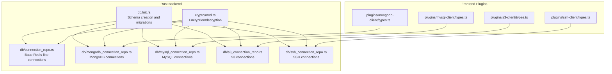
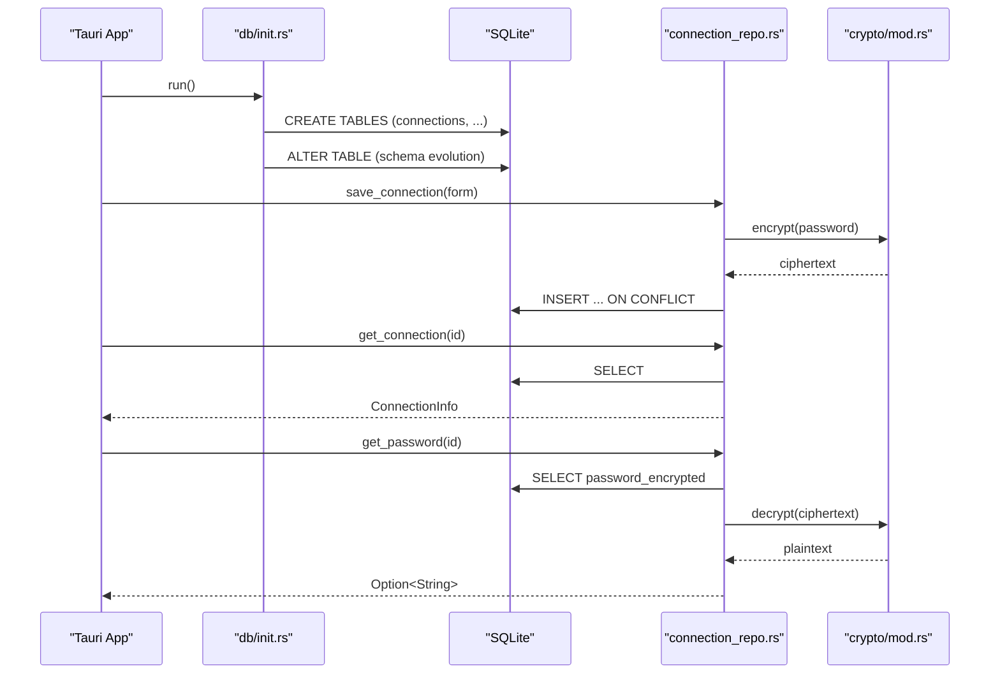
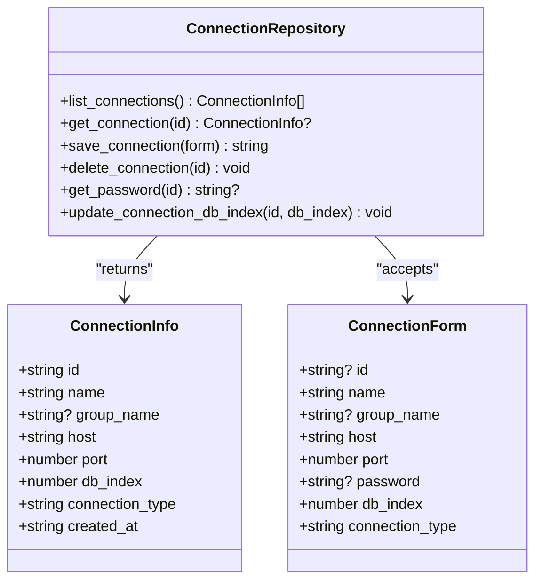
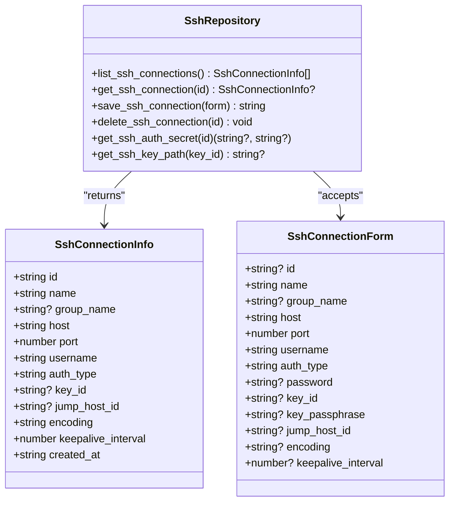
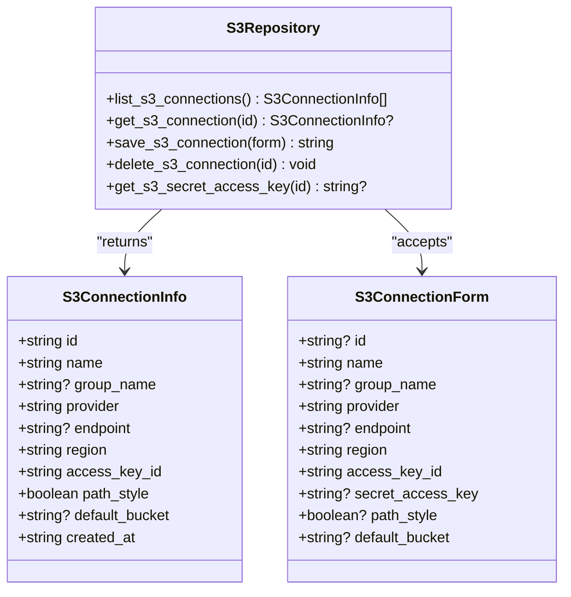
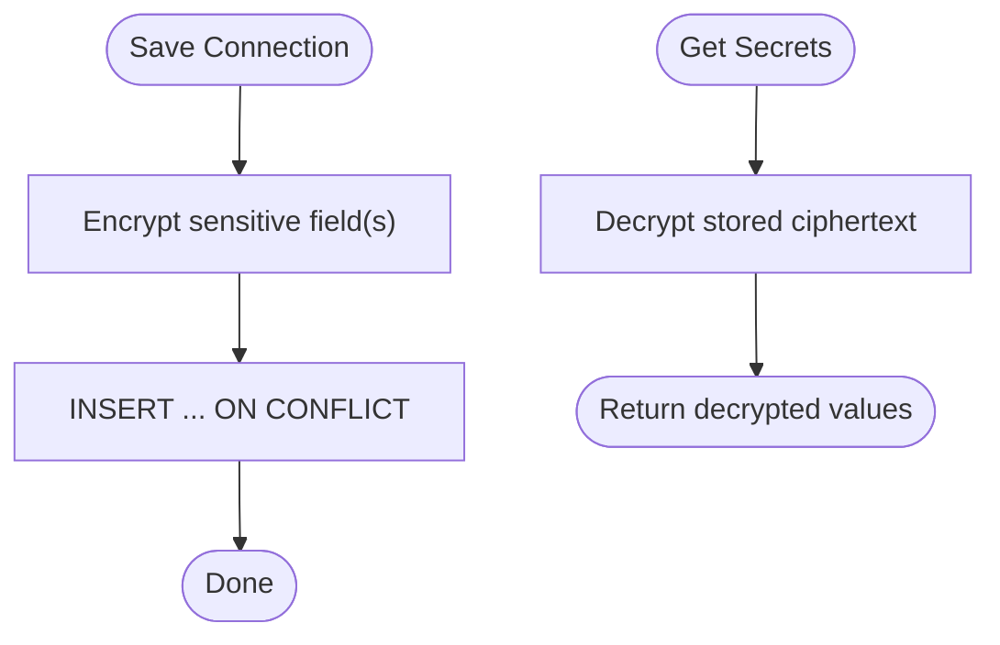
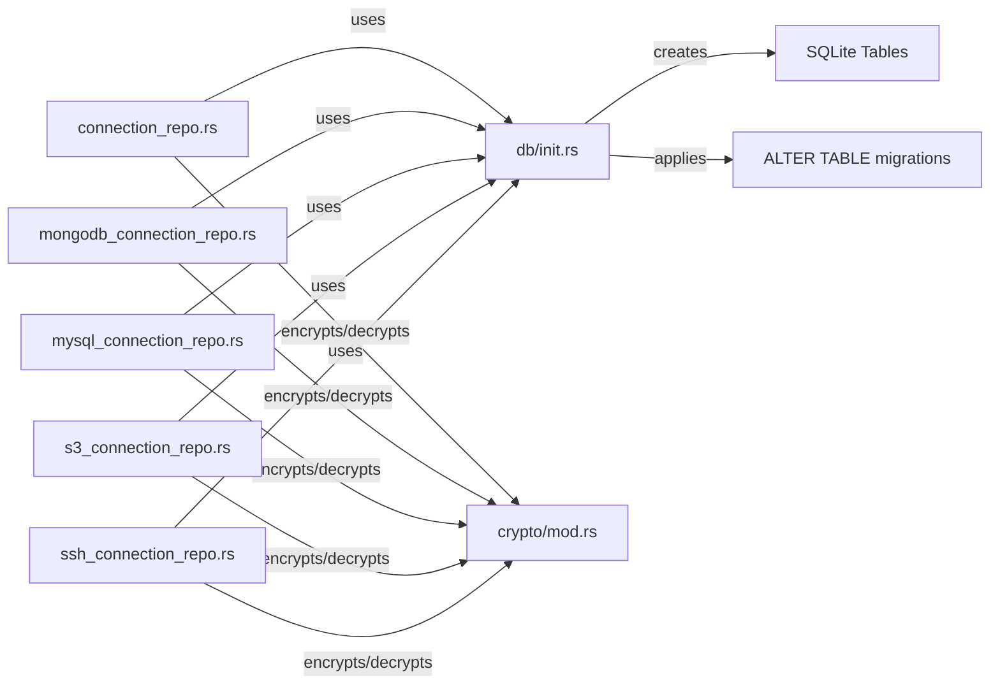

# Database Schema Design

<cite>
**Referenced Files in This Document**
- [init.rs](file://src-tauri/src/db/init.rs)
- [connection_repo.rs](file://src-tauri/src/db/connection_repo.rs)
- [mongodb_connection_repo.rs](file://src-tauri/src/db/mongodb_connection_repo.rs)
- [mysql_connection_repo.rs](file://src-tauri/src/db/mysql_connection_repo.rs)
- [s3_connection_repo.rs](file://src-tauri/src/db/s3_connection_repo.rs)
- [ssh_connection_repo.rs](file://src-tauri/src/db/ssh_connection_repo.rs)
- [mod.rs](file://src-tauri/src/db/mod.rs)
- [mod.rs (crypto)](file://src-tauri/src/crypto/mod.rs)
- [types.ts (SSH)](file://src/plugins/ssh-client/types.ts)
- [types.ts (MongoDB)](file://src/plugins/mongodb-client/types.ts)
- [types.ts (MySQL)](file://src/plugins/mysql-client/types.ts)
- [types.ts (S3)](file://src/plugins/s3-client/types.ts)
</cite>

## Table of Contents
1. [Introduction](#introduction)
2. [Project Structure](#project-structure)
3. [Core Components](#core-components)
4. [Architecture Overview](#architecture-overview)
5. [Detailed Component Analysis](#detailed-component-analysis)
6. [Dependency Analysis](#dependency-analysis)
7. [Performance Considerations](#performance-considerations)
8. [Troubleshooting Guide](#troubleshooting-guide)
9. [Conclusion](#conclusion)

## Introduction
This document describes the DevNexus database schema and the connection repository pattern used to manage diverse connection types (Redis, SSH, MongoDB, MySQL, S3, API testing, MQ, LAN chat, Confluence, and others). It covers table schemas, primary keys, foreign key relationships, indexes, encryption of secrets, and the schema evolution strategy via ALTER TABLE statements. It also explains how each plugin extends the base connection model and how the repository pattern centralizes persistence logic.

## Project Structure
The database layer is implemented in Rust under src-tauri/src/db and uses SQLite via rusqlite. A dedicated initialization routine creates tables and applies schema migrations. Encryption of sensitive data is handled by a separate crypto module. Frontend plugin types define the shape of connection data structures.



**Diagram sources**
- [init.rs:35-380](file://src-tauri/src/db/init.rs#L35-L380)
- [connection_repo.rs:1-174](file://src-tauri/src/db/connection_repo.rs#L1-L174)
- [mongodb_connection_repo.rs:1-249](file://src-tauri/src/db/mongodb_connection_repo.rs#L1-L249)
- [mysql_connection_repo.rs:1-209](file://src-tauri/src/db/mysql_connection_repo.rs#L1-L209)
- [s3_connection_repo.rs:1-188](file://src-tauri/src/db/s3_connection_repo.rs#L1-L188)
- [ssh_connection_repo.rs:1-218](file://src-tauri/src/db/ssh_connection_repo.rs#L1-L218)
- [mod.rs:1-8](file://src-tauri/src/db/mod.rs#L1-L8)
- [mod.rs (crypto):1-75](file://src-tauri/src/crypto/mod.rs#L1-L75)
- [types.ts (SSH):1-115](file://src/plugins/ssh-client/types.ts#L1-L115)
- [types.ts (MongoDB):1-95](file://src/plugins/mongodb-client/types.ts#L1-L95)
- [types.ts (MySQL):1-40](file://src/plugins/mysql-client/types.ts#L1-L40)
- [types.ts (S3):1-110](file://src/plugins/s3-client/types.ts#L1-L110)

**Section sources**
- [mod.rs:1-8](file://src-tauri/src/db/mod.rs#L1-L8)
- [init.rs:35-392](file://src-tauri/src/db/init.rs#L35-L392)
- [mod.rs (crypto):1-75](file://src-tauri/src/crypto/mod.rs#L1-L75)

## Core Components
- Base connection repository: Provides CRUD operations for a generic Redis-style connection model stored in the connections table.
- Plugin-specific connection repositories: Extend the base concept with plugin-specific fields and secret handling, stored in dedicated tables per plugin.
- Encryption: Secrets are persisted encrypted and decrypted on demand using a symmetric key managed by the crypto module.
- Initialization and migrations: The schema is created at first run, and subsequent minor changes are applied via ALTER TABLE statements.

Key responsibilities:
- Base connections: list, get, save (with upsert), delete, get password, update db_index.
- Plugin connections: list, get, save (with upsert), delete, and secret retrieval/decryption.
- Crypto: encrypt/decrypt for sensitive fields.

**Section sources**
- [connection_repo.rs:34-174](file://src-tauri/src/db/connection_repo.rs#L34-L174)
- [mongodb_connection_repo.rs:72-249](file://src-tauri/src/db/mongodb_connection_repo.rs#L72-L249)
- [mysql_connection_repo.rs:69-209](file://src-tauri/src/db/mysql_connection_repo.rs#L69-L209)
- [s3_connection_repo.rs:38-188](file://src-tauri/src/db/s3_connection_repo.rs#L38-L188)
- [ssh_connection_repo.rs:43-218](file://src-tauri/src/db/ssh_connection_repo.rs#L43-L218)
- [mod.rs (crypto):40-75](file://src-tauri/src/crypto/mod.rs#L40-L75)

## Architecture Overview
The backend initializes the SQLite database, creates tables, and applies migrations. Repositories encapsulate SQL queries and map rows to typed structs. Secrets are encrypted before storage and decrypted when needed. Frontend plugins define TypeScript interfaces that align with the backend models.



**Diagram sources**
- [init.rs:35-392](file://src-tauri/src/db/init.rs#L35-L392)
- [connection_repo.rs:96-155](file://src-tauri/src/db/connection_repo.rs#L96-L155)
- [mod.rs (crypto):40-75](file://src-tauri/src/crypto/mod.rs#L40-L75)

## Detailed Component Analysis

### Base Connection Model (Redis-like)
The base model supports generic Redis-style connections with optional password, grouping, host/port, database index, and connection type. It persists encrypted passwords and supports upserts.

- Table: connections
- Primary key: id
- Notable columns: name, group_name, host, port, password_encrypted, db_index, connection_type, created_at
- Operations: list, get, save (upsert), delete, get password, update db_index



**Diagram sources**
- [connection_repo.rs:3-27](file://src-tauri/src/db/connection_repo.rs#L3-L27)
- [connection_repo.rs:34-174](file://src-tauri/src/db/connection_repo.rs#L34-L174)

**Section sources**
- [connection_repo.rs:34-174](file://src-tauri/src/db/connection_repo.rs#L34-L174)

### SSH Connections
Extends the base model with SSH-specific fields and supports multiple authentication modes. Secrets include password and key passphrase, both encrypted.

- Table: ssh_connections
- Primary key: id
- Related table: ssh_keys (stores private/public key paths)
- Notable columns: name, group_name, host, port, username, auth_type, password_encrypted, key_id, key_passphrase_encrypted, jump_host_id, encoding, keepalive_interval, created_at
- Operations: list, get, save (upsert), delete, get auth secrets, get key path



**Diagram sources**
- [ssh_connection_repo.rs:5-36](file://src-tauri/src/db/ssh_connection_repo.rs#L5-L36)
- [ssh_connection_repo.rs:43-218](file://src-tauri/src/db/ssh_connection_repo.rs#L43-L218)

**Section sources**
- [ssh_connection_repo.rs:43-218](file://src-tauri/src/db/ssh_connection_repo.rs#L43-L218)

### MongoDB Connections
Supports two modes: URI-based or form-based configuration. Stores encrypted URI and password. Includes TLS/SRV flags and replica set.

- Table: mongodb_connections
- Primary key: id
- Notable columns: name, group_name, mode, uri_encrypted, host, port, username, password_encrypted, auth_database, default_database, replica_set, tls, srv, created_at
- Operations: list, get, save (upsert), delete, get secrets (URI/password)

```mermaid
classDiagram
class MongoConnectionInfo {
+string id
+string name
+string? group_name
+string mode
+string? host
+number port
+string? username
+string? auth_database
+string? default_database
+string? replica_set
+boolean tls
+boolean srv
+string created_at
}
class MongoConnectionForm {
+string? id
+string name
+string? group_name
+string mode
+string? uri
+string? host
+number? port
+string? username
+string? password
+string? auth_database
+string? default_database
+string? replica_set
+boolean? tls
+boolean? srv
}
class MongoRepository {
+list_mongo_connections() MongoConnectionInfo[]
+get_mongo_connection(id) MongoConnectionInfo?
+save_mongo_connection(form) string
+delete_mongo_connection(id) void
+get_mongo_secret(id) { uri?, password? }
}
MongoRepository --> MongoConnectionInfo : "returns"
MongoRepository --> MongoConnectionForm : "accepts"
```

**Diagram sources**
- [mongodb_connection_repo.rs:5-38](file://src-tauri/src/db/mongodb_connection_repo.rs#L5-L38)
- [mongodb_connection_repo.rs:72-249](file://src-tauri/src/db/mongodb_connection_repo.rs#L72-L249)

**Section sources**
- [mongodb_connection_repo.rs:72-249](file://src-tauri/src/db/mongodb_connection_repo.rs#L72-L249)

### MySQL Connections
Stores host, port, username, default database, charset, SSL mode, and connect timeout. Password is encrypted.

- Table: mysql_connections
- Primary key: id
- Notable columns: name, group_name, host, port, username, password_encrypted, default_database, charset, ssl_mode, connect_timeout, created_at
- Operations: list, get, save (upsert), delete, get secret (password)

```mermaid
classDiagram
class MysqlConnectionInfo {
+string id
+string name
+string? group_name
+string host
+number port
+string username
+string? default_database
+string? charset
+string? ssl_mode
+number connect_timeout
+string created_at
}
class MysqlConnectionForm {
+string? id
+string name
+string? group_name
+string host
+number? port
+string username
+string? password
+string? default_database
+string? charset
+string? ssl_mode
+number? connect_timeout
}
class MysqlRepository {
+list_mysql_connections() MysqlConnectionInfo[]
+get_mysql_connection(id) MysqlConnectionInfo?
+save_mysql_connection(form) string
+delete_mysql_connection(id) void
+get_mysql_secret(id) { password? }
}
MysqlRepository --> MysqlConnectionInfo : "returns"
MysqlRepository --> MysqlConnectionForm : "accepts"
```

**Diagram sources**
- [mysql_connection_repo.rs:5-33](file://src-tauri/src/db/mysql_connection_repo.rs#L5-L33)
- [mysql_connection_repo.rs:69-209](file://src-tauri/src/db/mysql_connection_repo.rs#L69-L209)

**Section sources**
- [mysql_connection_repo.rs:69-209](file://src-tauri/src/db/mysql_connection_repo.rs#L69-L209)

### S3 Connections
Stores provider, endpoint, region, access key ID, encrypted secret access key, path-style flag, and default bucket.

- Table: s3_connections
- Primary key: id
- Notable columns: name, group_name, provider, endpoint, region, access_key_id, secret_access_key_encrypted, path_style, default_bucket, created_at
- Operations: list, get, save (upsert), delete, get secret (access key)



**Diagram sources**
- [s3_connection_repo.rs:5-31](file://src-tauri/src/db/s3_connection_repo.rs#L5-L31)
- [s3_connection_repo.rs:38-188](file://src-tauri/src/db/s3_connection_repo.rs#L38-L188)

**Section sources**
- [s3_connection_repo.rs:38-188](file://src-tauri/src/db/s3_connection_repo.rs#L38-L188)

### Encryption and Secret Handling
Sensitive fields are encrypted before insertion and decrypted on retrieval. The crypto module manages a persistent symmetric key and uses AES-GCM with a fixed nonce.

- Encryption: encrypt(app_handle, plaintext) -> ciphertext
- Decryption: decrypt(app_handle, ciphertext) -> plaintext
- Key lifecycle: loads or generates a 32-byte key, stored in a key file; migrates legacy key location



**Diagram sources**
- [mod.rs (crypto):40-75](file://src-tauri/src/crypto/mod.rs#L40-L75)
- [connection_repo.rs:96-131](file://src-tauri/src/db/connection_repo.rs#L96-L131)
- [ssh_connection_repo.rs:117-166](file://src-tauri/src/db/ssh_connection_repo.rs#L117-L166)
- [mongodb_connection_repo.rs:115-202](file://src-tauri/src/db/mongodb_connection_repo.rs#L115-L202)
- [mysql_connection_repo.rs:108-176](file://src-tauri/src/db/mysql_connection_repo.rs#L108-L176)
- [s3_connection_repo.rs:110-161](file://src-tauri/src/db/s3_connection_repo.rs#L110-L161)

**Section sources**
- [mod.rs (crypto):21-75](file://src-tauri/src/crypto/mod.rs#L21-L75)
- [connection_repo.rs:96-155](file://src-tauri/src/db/connection_repo.rs#L96-L155)
- [ssh_connection_repo.rs:117-203](file://src-tauri/src/db/ssh_connection_repo.rs#L117-L203)
- [mongodb_connection_repo.rs:115-249](file://src-tauri/src/db/mongodb_connection_repo.rs#L115-L249)
- [mysql_connection_repo.rs:108-209](file://src-tauri/src/db/mysql_connection_repo.rs#L108-L209)
- [s3_connection_repo.rs:110-188](file://src-tauri/src/db/s3_connection_repo.rs#L110-L188)

### Schema Evolution Strategy
The schema is initialized with a comprehensive set of tables. Subsequent minor changes are applied via ALTER TABLE statements during initialization to maintain backward compatibility without breaking existing installations.

- Example evolutions applied at startup:
  - Add channel column to lan_chat_rooms with default
  - Add auth_type column to confluence_connections with default

These migrations ensure new features can be introduced while preserving existing data.

**Section sources**
- [init.rs:382-389](file://src-tauri/src/db/init.rs#L382-L389)

## Dependency Analysis
- Initialization depends on rusqlite to create tables and apply migrations.
- Repositories depend on initialization for database path resolution and on the crypto module for secret handling.
- Frontend plugin types mirror backend models to ensure consistent serialization/deserialization.



**Diagram sources**
- [init.rs:35-392](file://src-tauri/src/db/init.rs#L35-L392)
- [connection_repo.rs:29-32](file://src-tauri/src/db/connection_repo.rs#L29-L32)
- [mongodb_connection_repo.rs:40-43](file://src-tauri/src/db/mongodb_connection_repo.rs#L40-L43)
- [mysql_connection_repo.rs:40-43](file://src-tauri/src/db/mysql_connection_repo.rs#L40-L43)
- [s3_connection_repo.rs:33-36](file://src-tauri/src/db/s3_connection_repo.rs#L33-L36)
- [ssh_connection_repo.rs:38-41](file://src-tauri/src/db/ssh_connection_repo.rs#L38-L41)
- [mod.rs (crypto):40-75](file://src-tauri/src/crypto/mod.rs#L40-L75)

**Section sources**
- [init.rs:35-392](file://src-tauri/src/db/init.rs#L35-L392)
- [connection_repo.rs:29-32](file://src-tauri/src/db/connection_repo.rs#L29-L32)
- [mongodb_connection_repo.rs:40-43](file://src-tauri/src/db/mongodb_connection_repo.rs#L40-L43)
- [mysql_connection_repo.rs:40-43](file://src-tauri/src/db/mysql_connection_repo.rs#L40-L43)
- [s3_connection_repo.rs:33-36](file://src-tauri/src/db/s3_connection_repo.rs#L33-L36)
- [ssh_connection_repo.rs:38-41](file://src-tauri/src/db/ssh_connection_repo.rs#L38-L41)
- [mod.rs (crypto):40-75](file://src-tauri/src/crypto/mod.rs#L40-L75)

## Performance Considerations
- SQLite is embedded and optimized for local workloads; ensure appropriate indexing on frequently filtered columns (e.g., created_at ordering is used in several lists).
- Encryption adds CPU overhead; batch operations and minimize repeated decryption where possible.
- Use upserts (ON CONFLICT) to avoid redundant writes and reduce transaction overhead.

## Troubleshooting Guide
Common issues and resolutions:
- Database path resolution failures: Verify app data directory permissions and path resolution logic.
- Migration errors: Ensure ALTER TABLE statements succeed; check for column existence before applying.
- Encryption failures: Confirm key file exists and is valid (32 bytes hex); handle missing or corrupted key files gracefully.
- Repository query errors: Validate SQL queries and parameter bindings; ensure proper error mapping.

**Section sources**
- [init.rs:6-31](file://src-tauri/src/db/init.rs#L6-L31)
- [init.rs:382-389](file://src-tauri/src/db/init.rs#L382-L389)
- [mod.rs (crypto):21-38](file://src-tauri/src/crypto/mod.rs#L21-L38)
- [connection_repo.rs:36-63](file://src-tauri/src/db/connection_repo.rs#L36-L63)

## Conclusion
DevNexus employs a clean separation between schema definition, repository logic, and encryption. The base connection model plus plugin-specific repositories provide a scalable pattern for managing diverse connection types. Schema evolution via ALTER TABLE ensures backward compatibility, while encryption safeguards sensitive data. The frontend types align with backend models, simplifying cross-layer data handling.