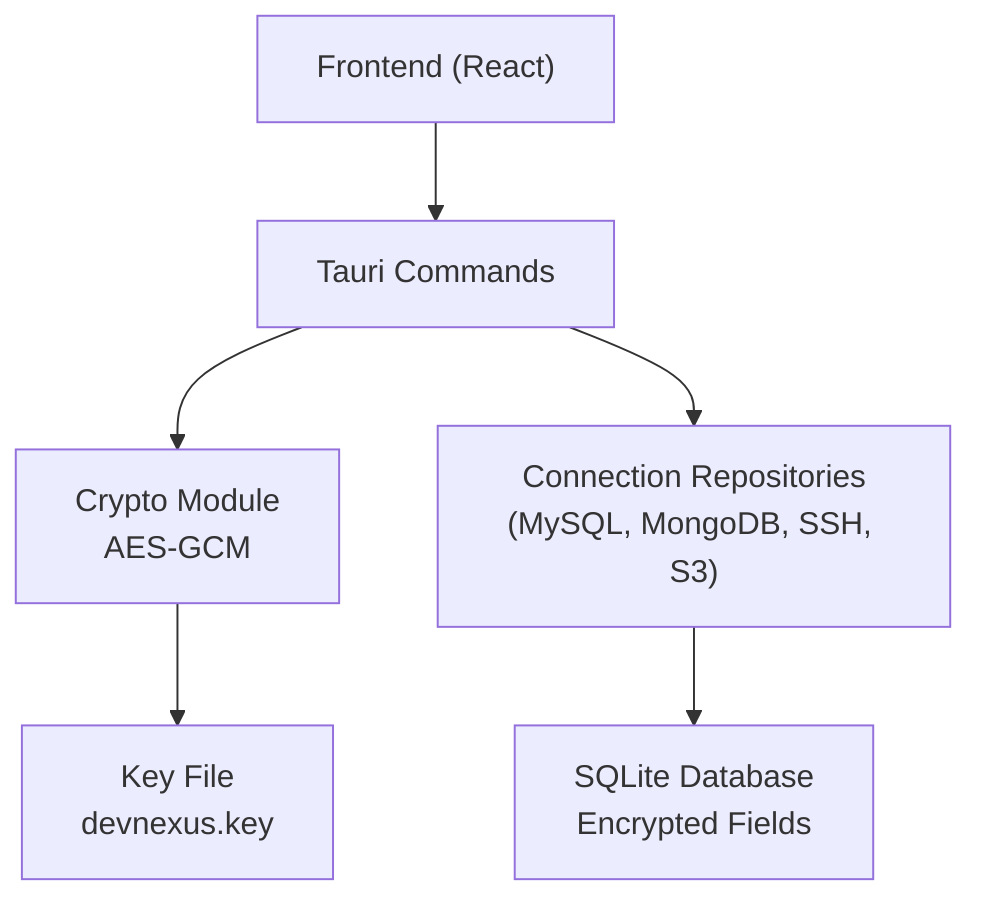
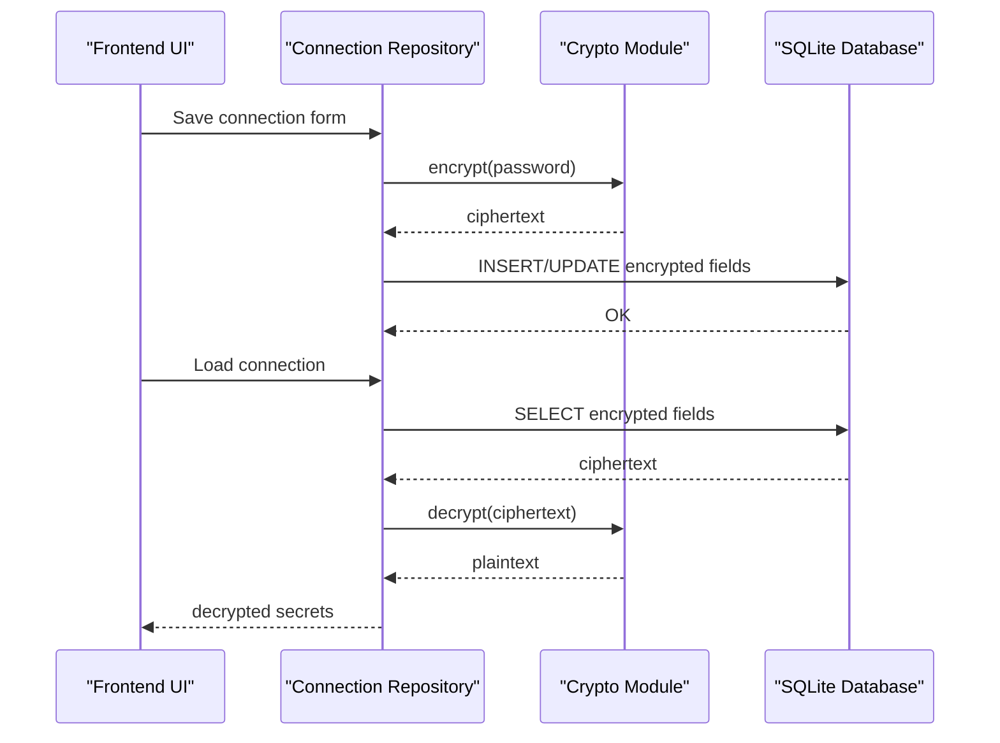
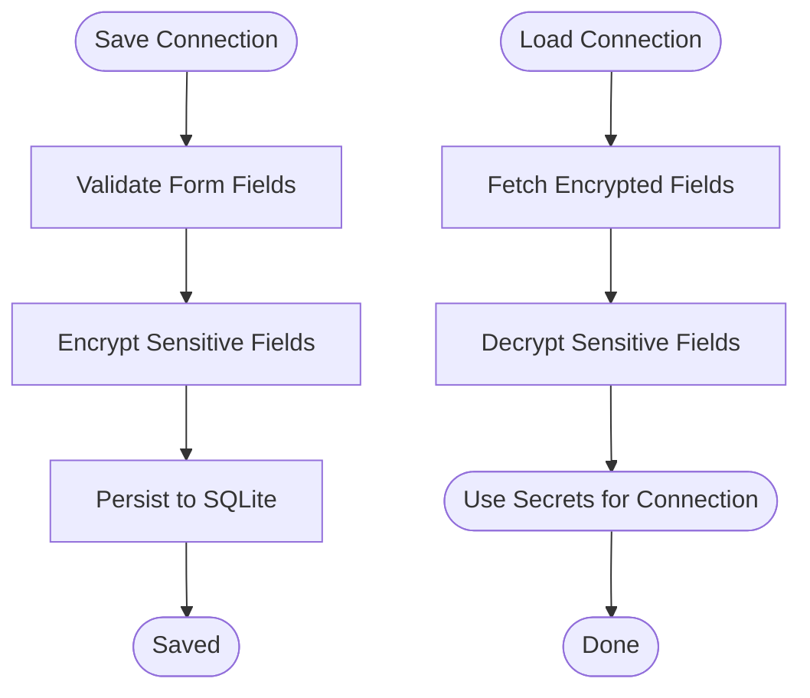
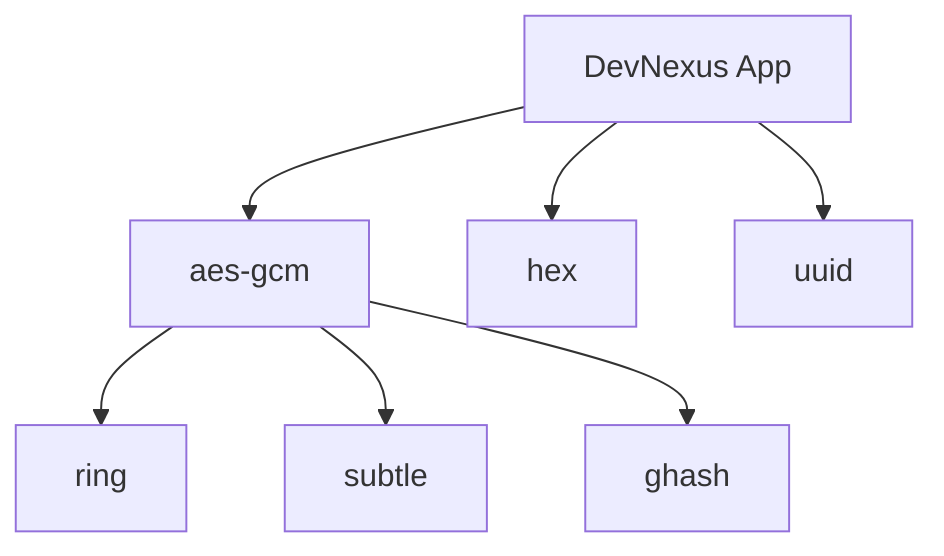

# Encryption & Security Mechanisms

<cite>
**Referenced Files in This Document**
- [mod.rs](file://src-tauri/src/crypto/mod.rs)
- [init.rs](file://src-tauri/src/db/init.rs)
- [mysql_connection_repo.rs](file://src-tauri/src/db/mysql_connection_repo.rs)
- [mongodb_connection_repo.rs](file://src-tauri/src/db/mongodb_connection_repo.rs)
- [ssh_connection_repo.rs](file://src-tauri/src/db/ssh_connection_repo.rs)
- [s3_connection_repo.rs](file://src-tauri/src/db/s3_connection_repo.rs)
- [Cargo.toml](file://src-tauri/Cargo.toml)
- [Cargo.lock](file://src-tauri/Cargo.lock)
- [README.md](file://README.md)
- [PLAN.md](file://PLAN.md)
</cite>

## Table of Contents
1. [Introduction](#introduction)
2. [Project Structure](#project-structure)
3. [Core Components](#core-components)
4. [Architecture Overview](#architecture-overview)
5. [Detailed Component Analysis](#detailed-component-analysis)
6. [Dependency Analysis](#dependency-analysis)
7. [Performance Considerations](#performance-considerations)
8. [Security Best Practices](#security-best-practices)
9. [Troubleshooting Guide](#troubleshooting-guide)
10. [Conclusion](#conclusion)

## Introduction
This document explains DevNexus encryption and security mechanisms with a focus on AES-GCM encryption for sensitive data storage. It covers key derivation, nonce handling, authenticated encryption patterns, and secure credential storage across database passwords, SSH keys, API tokens, and other sensitive information. The document also details the encryption workflow from input through storage to retrieval, error handling, security implications, and performance trade-offs.

## Project Structure
DevNexus employs a layered architecture:
- Frontend (React + TypeScript) communicates with backend plugins via Tauri commands
- Backend (Rust) manages local SQLite storage and applies AES-GCM encryption to sensitive fields
- Crypto module encapsulates encryption/decryption and key management
- Connection repositories persist and retrieve encrypted credentials for various services

**Diagram sources**
- [mod.rs:1-75](file://src-tauri/src/crypto/mod.rs#L1-L75)
- [init.rs:35-393](file://src-tauri/src/db/init.rs#L35-L393)
- [mysql_connection_repo.rs:108-176](file://src-tauri/src/db/mysql_connection_repo.rs#L108-L176)
- [mongodb_connection_repo.rs:115-202](file://src-tauri/src/db/mongodb_connection_repo.rs#L115-L202)
- [ssh_connection_repo.rs:117-203](file://src-tauri/src/db/ssh_connection_repo.rs#L117-L203)
- [s3_connection_repo.rs:110-161](file://src-tauri/src/db/s3_connection_repo.rs#L110-L161)

**Section sources**
- [README.md:28-35](file://README.md#L28-L35)
- [init.rs:35-393](file://src-tauri/src/db/init.rs#L35-L393)

## Core Components
- AES-GCM Crypto Module: Provides symmetric encryption/decryption using a 32-byte key and fixed nonce for all operations
- Connection Repositories: Encrypt sensitive fields before storing to SQLite and decrypt upon retrieval
- SQLite Schema: Defines encrypted columns for credentials across supported connection types
- Key Management: Generates and persists a single AES-256 key in the application data directory

Key implementation references:
- Encryption/decryption functions and fixed nonce usage
- Key file location resolution and migration from legacy path
- Encrypted column definitions in SQLite schema

**Section sources**
- [mod.rs:1-75](file://src-tauri/src/crypto/mod.rs#L1-L75)
- [init.rs:35-393](file://src-tauri/src/db/init.rs#L35-L393)

## Architecture Overview
The encryption architecture ensures sensitive data is encrypted at rest and decrypted only during runtime when needed for connection establishment.

**Diagram sources**
- [mysql_connection_repo.rs:108-176](file://src-tauri/src/db/mysql_connection_repo.rs#L108-L176)
- [mongodb_connection_repo.rs:115-202](file://src-tauri/src/db/mongodb_connection_repo.rs#L115-L202)
- [ssh_connection_repo.rs:117-203](file://src-tauri/src/db/ssh_connection_repo.rs#L117-L203)
- [s3_connection_repo.rs:110-161](file://src-tauri/src/db/s3_connection_repo.rs#L110-L161)
- [mod.rs:40-74](file://src-tauri/src/crypto/mod.rs#L40-L74)

## Detailed Component Analysis

### AES-GCM Implementation and Key Management
- Symmetric encryption uses AES-256 in Galois/Counter Mode (AES-GCM)
- Key derivation: A 32-byte key is generated using a cryptographically random UUID-derived value and persisted as a hex-encoded file in the application data directory
- Legacy key migration: Automatically migrates from the old key filename to the new one if present
- Nonce handling: A fixed 12-byte nonce is used for all encryption/decryption operations
- Error handling: Comprehensive error propagation for file I/O, hex decoding, encryption/decryption failures, and UTF-8 conversion

Security considerations:
- Fixed nonce usage reduces security guarantees; it should be unique per encryption operation for AEAD modes
- Single-key model simplifies deployment but centralizes risk; consider per-user or per-device keys for stronger isolation

**Section sources**
- [mod.rs:1-75](file://src-tauri/src/crypto/mod.rs#L1-L75)
- [init.rs:6-26](file://src-tauri/src/db/init.rs#L6-L26)

### Secure Credential Storage Across Connection Types
- Redis: Credentials are treated as sensitive; encryption pattern follows the same approach as other repositories
- SSH: Stores encrypted password and key passphrase; private key file path is stored separately
- S3: Stores encrypted secret access key; endpoint and region are unencrypted
- MongoDB: Supports URI and form-based modes; stores encrypted URI and password
- MySQL: Stores encrypted password; includes SSL mode and charset configurations
- MQ (RabbitMQ/Kafka): Stores encrypted broker passwords and management/SASL passwords
- Confluence: Stores encrypted password for Basic Auth

Implementation patterns:
- On save: sensitive fields are encrypted before insertion/updating
- On load: encrypted fields are retrieved and decrypted for runtime use
- Empty field handling: Empty inputs are stored as empty strings to avoid unnecessary encryption overhead

**Section sources**
- [ssh_connection_repo.rs:117-203](file://src-tauri/src/db/ssh_connection_repo.rs#L117-L203)
- [s3_connection_repo.rs:110-161](file://src-tauri/src/db/s3_connection_repo.rs#L110-L161)
- [mongodb_connection_repo.rs:115-202](file://src-tauri/src/db/mongodb_connection_repo.rs#L115-L202)
- [mysql_connection_repo.rs:108-176](file://src-tauri/src/db/mysql_connection_repo.rs#L108-L176)
- [init.rs:103-157](file://src-tauri/src/db/init.rs#L103-L157)

### Encryption Workflow: From Input to Retrieval

**Diagram sources**
- [mysql_connection_repo.rs:108-176](file://src-tauri/src/db/mysql_connection_repo.rs#L108-L176)
- [mongodb_connection_repo.rs:115-202](file://src-tauri/src/db/mongodb_connection_repo.rs#L115-L202)
- [ssh_connection_repo.rs:117-203](file://src-tauri/src/db/ssh_connection_repo.rs#L117-L203)
- [s3_connection_repo.rs:110-161](file://src-tauri/src/db/s3_connection_repo.rs#L110-L161)

## Dependency Analysis
External cryptographic dependencies:
- aes-gcm: Provides AES-GCM authenticated encryption
- hex: Encodes/decodes binary data to/from hexadecimal strings
- uuid: Generates cryptographically random identifiers for key creation
- ring, subtle, ghash: Underlying primitives used by aes-gcm and related crates

**Diagram sources**
- [Cargo.toml:29-31](file://src-tauri/Cargo.toml#L29-L31)
- [Cargo.lock:33-44](file://src-tauri/Cargo.lock#L33-L44)

**Section sources**
- [Cargo.toml:29-31](file://src-tauri/Cargo.toml#L29-L31)
- [Cargo.lock:33-44](file://src-tauri/Cargo.lock#L33-L44)

## Performance Considerations
- Encryption/decryption cost: AES-GCM adds CPU overhead proportional to payload size; acceptable for typical credential sizes
- Database I/O: Each save/load triggers encryption/decryption; batching operations can reduce repeated key reads
- Key caching: Consider caching the loaded key in memory per process lifetime to avoid repeated file I/O
- Fixed nonce: While simpler, fixed nonce reduces security; consider per-operation nonce generation for stronger AEAD guarantees

## Security Best Practices
- Key rotation: Implement a key rotation mechanism to periodically replace the master key and re-encrypt stored data
- Per-user keys: Derive keys from user-specific secrets (e.g., OS keychain) to isolate credentials across users
- Nonce uniqueness: Replace fixed nonce with unique nonces per encryption operation to prevent catastrophic reuse
- Least privilege: Restrict file permissions on the key file and database to the current user only
- Input sanitization: Validate and sanitize inputs before encryption to prevent injection-like issues
- Error handling: Log errors without exposing sensitive data; mask stack traces in production
- Transport security: Ensure that decrypted credentials are handled in-memory only and not written to logs or temporary files

## Security Implications and Trade-offs
- Fixed nonce risks: Reusing the same nonce with the same key compromises confidentiality and authenticity; consider nonce-per-encryption
- Single key model: Simplifies deployment but increases blast radius; consider per-connection or per-service keys
- Storage exposure: Even with encryption, database files on disk remain a target; combine with OS-level protections and encryption-at-rest
- Operational overhead: Additional CPU cycles for encryption/decryption; balance security with user experience

## Troubleshooting Guide
Common issues and resolutions:
- Key file corruption: If the key file is missing or invalid, the system regenerates a new key; previously encrypted data becomes unrecoverable
- Decryption failures: Occur when ciphertext is corrupted or key mismatch; verify ciphertext integrity and key persistence
- Empty inputs: Empty sensitive fields are stored as empty strings; ensure UI properly handles optional fields
- Legacy migration: Automatic migration from old key and database filenames; verify file permissions post-migration

**Section sources**
- [mod.rs:21-38](file://src-tauri/src/crypto/mod.rs#L21-L38)
- [init.rs:17-26](file://src-tauri/src/db/init.rs#L17-L26)

## Conclusion
DevNexus implements a practical AES-GCM encryption scheme for protecting sensitive connection credentials across multiple services. While the current design prioritizes simplicity and ease of deployment, it introduces security trade-offs due to fixed nonce usage and a single master key. Adopting per-operation nonces, key rotation, and per-user key derivation would significantly strengthen security posture without substantially compromising usability.