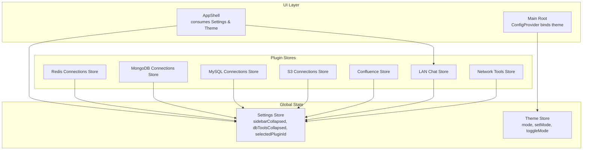
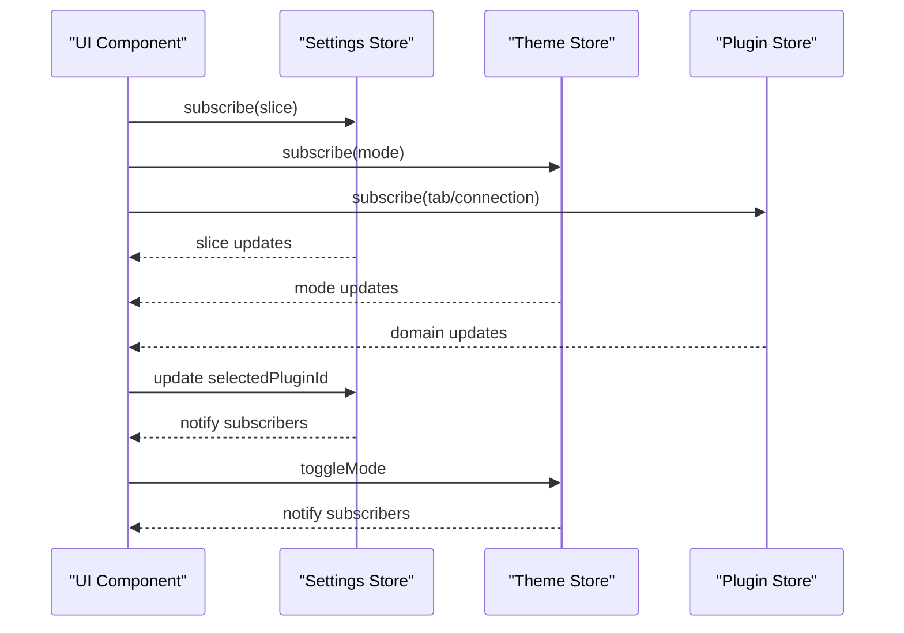
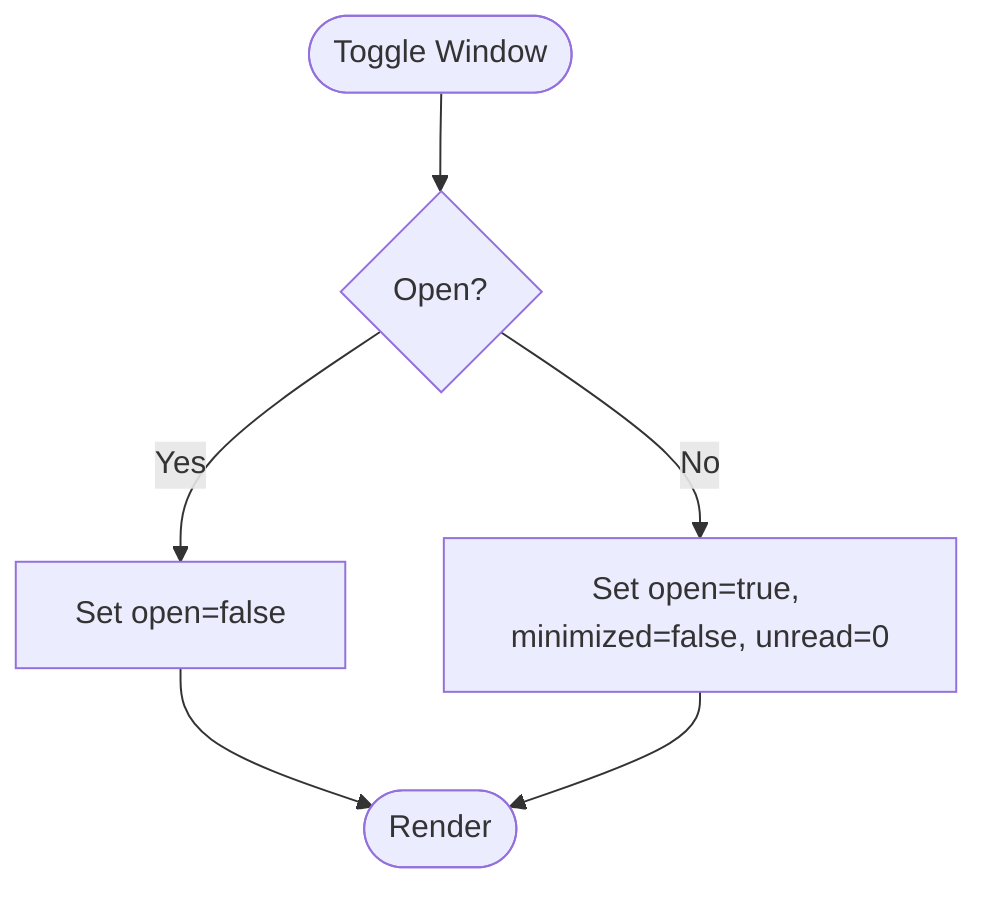
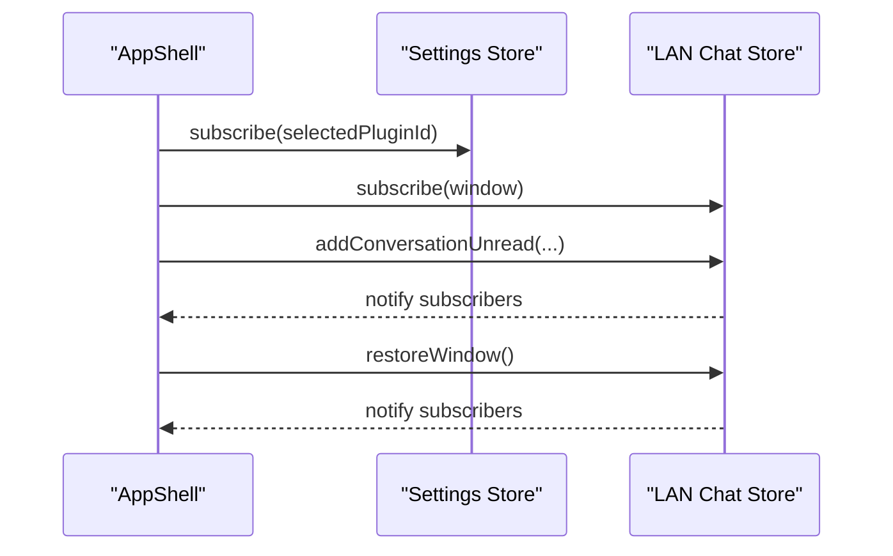
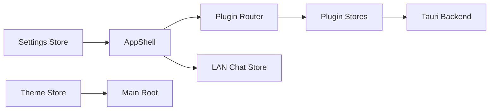

# State Management Architecture

<cite>
**Referenced Files in This Document**
- [settings.ts](file://src/app/store/settings.ts)
- [theme.ts](file://src/app/store/theme.ts)
- [AppShell.tsx](file://src/app/layout/AppShell.tsx)
- [main.tsx](file://src/main.tsx)
- [lan-chat.ts](file://src/plugins/lan-chat/store/lan-chat.ts)
- [confluence.ts](file://src/plugins/confluence/store/confluence.ts)
- [mongodb-connections.ts](file://src/plugins/mongodb-client/store/mongodb-connections.ts)
- [mysql-connections.ts](file://src/plugins/mysql-client/store/mysql-connections.ts)
- [s3-connections.ts](file://src/plugins/s3-client/store/s3-connections.ts)
- [network-tools.ts](file://src/plugins/network-tools/store/network-tools.ts)
- [registry.ts](file://src/app/plugin-registry/registry.ts)
</cite>

## Table of Contents
1. [Introduction](#introduction)
2. [Project Structure](#project-structure)
3. [Core Components](#core-components)
4. [Architecture Overview](#architecture-overview)
5. [Detailed Component Analysis](#detailed-component-analysis)
6. [Dependency Analysis](#dependency-analysis)
7. [Performance Considerations](#performance-considerations)
8. [Troubleshooting Guide](#troubleshooting-guide)
9. [Conclusion](#conclusion)

## Introduction
This document explains the DevNexus state management architecture built on Zustand. It covers global state patterns for settings and theme, plugin-specific state isolation, persistence strategies, reactive updates, and inter-plugin communication. It also documents state hydration and cleanup procedures, and provides practical guidance for selectors, middleware usage, and debugging.

## Project Structure
DevNexus organizes state into two categories:
- Global stores: user preferences and UI theme
- Plugin stores: isolated state per plugin domain

Global stores are located under src/app/store/, while each plugin maintains its own store(s) under src/plugins/<plugin>/store/.

**Diagram sources**
- [settings.ts:1-27](file://src/app/store/settings.ts#L1-L27)
- [theme.ts:1-26](file://src/app/store/theme.ts#L1-L26)
- [AppShell.tsx:31-56](file://src/app/layout/AppShell.tsx#L31-L56)
- [main.tsx:12-31](file://src/main.tsx#L12-L31)
- [lan-chat.ts:89-201](file://src/plugins/lan-chat/store/lan-chat.ts#L89-L201)
- [confluence.ts:67-145](file://src/plugins/confluence/store/confluence.ts#L67-L145)
- [mongodb-connections.ts:96-295](file://src/plugins/mongodb-client/store/mongodb-connections.ts#L96-L295)
- [mysql-connections.ts:77-152](file://src/plugins/mysql-client/store/mysql-connections.ts#L77-L152)
- [s3-connections.ts:137-431](file://src/plugins/s3-client/store/s3-connections.ts#L137-L431)
- [network-tools.ts:34-96](file://src/plugins/network-tools/store/network-tools.ts#L34-L96)

**Section sources**
- [settings.ts:1-27](file://src/app/store/settings.ts#L1-L27)
- [theme.ts:1-26](file://src/app/store/theme.ts#L1-L26)
- [AppShell.tsx:31-56](file://src/app/layout/AppShell.tsx#L31-L56)
- [main.tsx:12-31](file://src/main.tsx#L12-L31)

## Core Components
- Settings Store: persists UI preferences such as sidebar state, database tools panel state, and the selected plugin ID. It uses the persist middleware to synchronize with localStorage.
- Theme Store: manages light/dark mode and exposes setters/toggle. Also persisted to localStorage.
- Plugin Stores: each plugin defines one or more stores encapsulating domain-specific state and async actions (e.g., fetching connections, performing operations). Some plugin stores use the persist middleware for window state or local preferences.

Key characteristics:
- Reactive subscriptions: components subscribe to slices of state via selector functions.
- Persistence: global stores use localStorage-backed persistence; some plugin stores persist subsets of state.
- Hydration: stores hydrate from localStorage on initialization; some stores partially hydrate only specific fields.

**Section sources**
- [settings.ts:13-27](file://src/app/store/settings.ts#L13-L27)
- [theme.ts:12-26](file://src/app/store/theme.ts#L12-L26)
- [lan-chat.ts:89-201](file://src/plugins/lan-chat/store/lan-chat.ts#L89-L201)
- [confluence.ts:67-145](file://src/plugins/confluence/store/confluence.ts#L67-L145)

## Architecture Overview
The architecture follows a unidirectional data flow:
- UI components subscribe to global and plugin stores via hooks.
- Actions mutate state immutably; Zustand triggers re-renders for subscribed components.
- Persistence middleware writes to localStorage automatically after state changes.
- Inter-plugin communication occurs through shared global state (e.g., selectedPluginId) and direct store access patterns.

**Diagram sources**
- [settings.ts:13-27](file://src/app/store/settings.ts#L13-L27)
- [theme.ts:12-26](file://src/app/store/theme.ts#L12-L26)
- [AppShell.tsx:32-36](file://src/app/layout/AppShell.tsx#L32-L36)

## Detailed Component Analysis

### Settings Store
Responsibilities:
- Persist sidebar and database tools panel collapsed state
- Track the currently selected plugin ID
- Provide setters for all fields

Persistence:
- Uses persist middleware with a dedicated storage key
- Hydrates initial state from localStorage on creation

Selectors:
- Subscribe to specific slices (e.g., selectedPluginId) to minimize re-renders

Cleanup:
- No explicit cleanup required; persisted fields remain until overwritten

**Section sources**
- [settings.ts:13-27](file://src/app/store/settings.ts#L13-L27)

### Theme Store
Responsibilities:
- Manage theme mode (light/dark)
- Provide setters and toggle function
- Expose current mode to the UI layer

Integration:
- Consumed by the root provider to apply Ant Design theme algorithms
- Hydrated from localStorage on initialization

**Section sources**
- [theme.ts:12-26](file://src/app/store/theme.ts#L12-L26)
- [main.tsx:12-31](file://src/main.tsx#L12-L31)

### Plugin State Isolation Examples

#### LAN Chat Store (persisted window state)
- Maintains window geometry, visibility, and unread counts
- Uses persist middleware with a partializer to store only window and conversationUnread fields
- Provides helpers to compute derived state (toggle, unread updates)

**Diagram sources**
- [lan-chat.ts:89-138](file://src/plugins/lan-chat/store/lan-chat.ts#L89-L138)

**Section sources**
- [lan-chat.ts:89-201](file://src/plugins/lan-chat/store/lan-chat.ts#L89-L201)

#### Confluence Store (mixed persistence)
- Domain state managed via Zustand actions
- File mappings persisted to localStorage using custom helpers
- Uses Tauri invocations for backend operations

**Section sources**
- [confluence.ts:53-65](file://src/plugins/confluence/store/confluence.ts#L53-L65)
- [confluence.ts:133-144](file://src/plugins/confluence/store/confluence.ts#L133-L144)

#### MongoDB Store (complex domain state)
- Manages connections, active namespace, collections, documents, indexes, and server status
- Uses async actions with invoke for backend calls
- Requires active connection and namespace guards

**Section sources**
- [mongodb-connections.ts:96-295](file://src/plugins/mongodb-client/store/mongodb-connections.ts#L96-L295)

#### MySQL Store (similar pattern)
- Mirrors MongoDB store structure for relational data
- Provides CRUD and administrative operations

**Section sources**
- [mysql-connections.ts:77-152](file://src/plugins/mysql-client/store/mysql-connections.ts#L77-L152)

#### S3 Store (cloud storage)
- Manages buckets, objects, prefixes, and bulk operations
- Implements pagination via continuation tokens

**Section sources**
- [s3-connections.ts:137-431](file://src/plugins/s3-client/store/s3-connections.ts#L137-L431)

#### Network Tools Store (diagnostics)
- Tracks active tool, last result, and history
- Supports rerunning historical diagnostics

**Section sources**
- [network-tools.ts:34-96](file://src/plugins/network-tools/store/network-tools.ts#L34-L96)

### Inter-Plugin Communication Patterns
- Shared selection: AppShell reads selectedPluginId from Settings Store to route content
- Cross-store notifications: AppShell subscribes to LAN Chat unread counts and restores window on demand
- Direct store access: AppShell uses getState() to inspect LAN Chat state for docking logic

**Diagram sources**
- [AppShell.tsx:32-36](file://src/app/layout/AppShell.tsx#L32-L36)
- [AppShell.tsx:69-82](file://src/app/layout/AppShell.tsx#L69-L82)
- [lan-chat.ts:175-194](file://src/plugins/lan-chat/store/lan-chat.ts#L175-L194)

**Section sources**
- [AppShell.tsx:32-92](file://src/app/layout/AppShell.tsx#L32-L92)
- [registry.ts:1-26](file://src/app/plugin-registry/registry.ts#L1-L26)

## Dependency Analysis
- UI depends on global stores for theme and navigation state
- Plugins depend on their own stores and may depend on global settings for routing
- Persistence middleware introduces a dependency on localStorage APIs
- Some stores depend on Tauri invoke for backend operations

**Diagram sources**
- [settings.ts:13-27](file://src/app/store/settings.ts#L13-L27)
- [theme.ts:12-26](file://src/app/store/theme.ts#L12-L26)
- [AppShell.tsx:31-56](file://src/app/layout/AppShell.tsx#L31-L56)
- [main.tsx:12-31](file://src/main.tsx#L12-L31)

**Section sources**
- [settings.ts:13-27](file://src/app/store/settings.ts#L13-L27)
- [theme.ts:12-26](file://src/app/store/theme.ts#L12-L26)
- [AppShell.tsx:31-56](file://src/app/layout/AppShell.tsx#L31-L56)
- [main.tsx:12-31](file://src/main.tsx#L12-L31)

## Performance Considerations
- Prefer narrow selectors to reduce re-renders
- Use partialize in persist middleware to avoid storing large transient data
- Batch state updates in async actions to minimize intermediate renders
- Avoid subscribing to overly broad slices; subscribe to precise fields
- Debounce or throttle frequent updates (e.g., resize or polling)

## Troubleshooting Guide
Common issues and remedies:
- State not persisting
  - Verify persist middleware is configured with a unique storage key
  - Confirm localStorage availability and permissions
- Hydration mismatches
  - Ensure initializers match persisted shape; consider adding migrations
- Unexpected re-renders
  - Switch to shallow selectors or use shallow compare utilities
- Debugging state changes
  - Temporarily log state slices in components
  - Inspect localStorage entries for persisted stores
- Inter-store dependencies
  - Avoid tight coupling; pass state via props or use global settings as a loose coupling mechanism

## Conclusion
DevNexus employs a clean separation of concerns: global Zustand stores manage user preferences and theme, while plugins maintain isolated state machines for their domains. Persistence is handled consistently via the persist middleware, and inter-plugin communication leverages shared global state and direct store access patterns. This design balances simplicity, scalability, and maintainability.