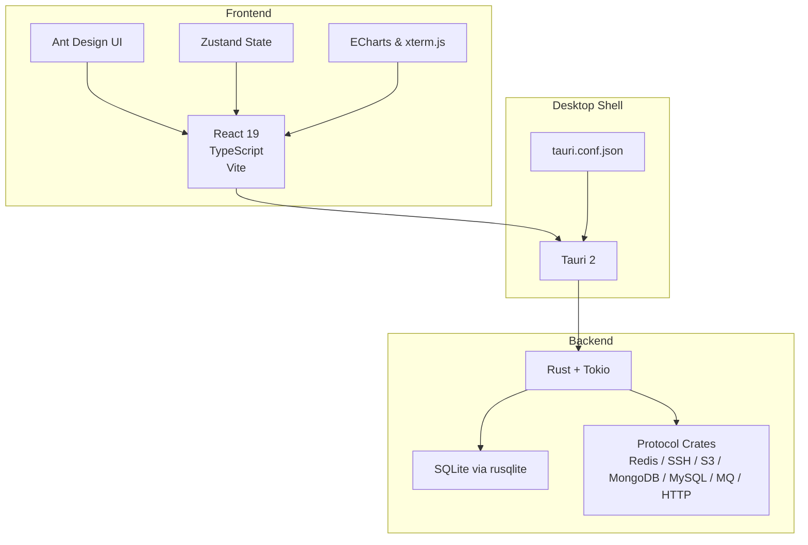
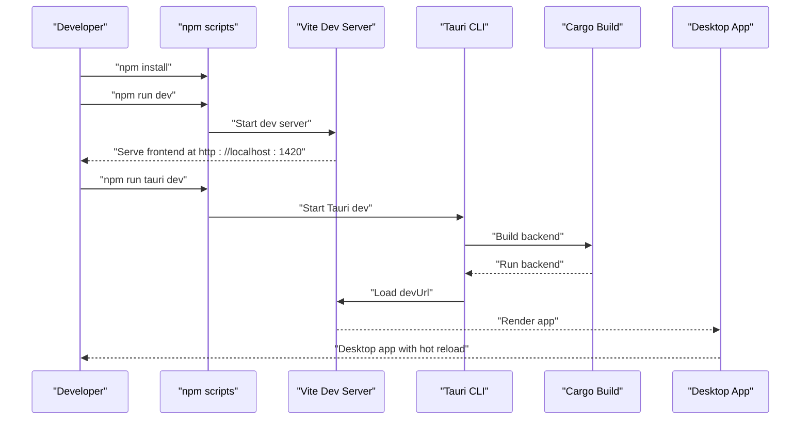
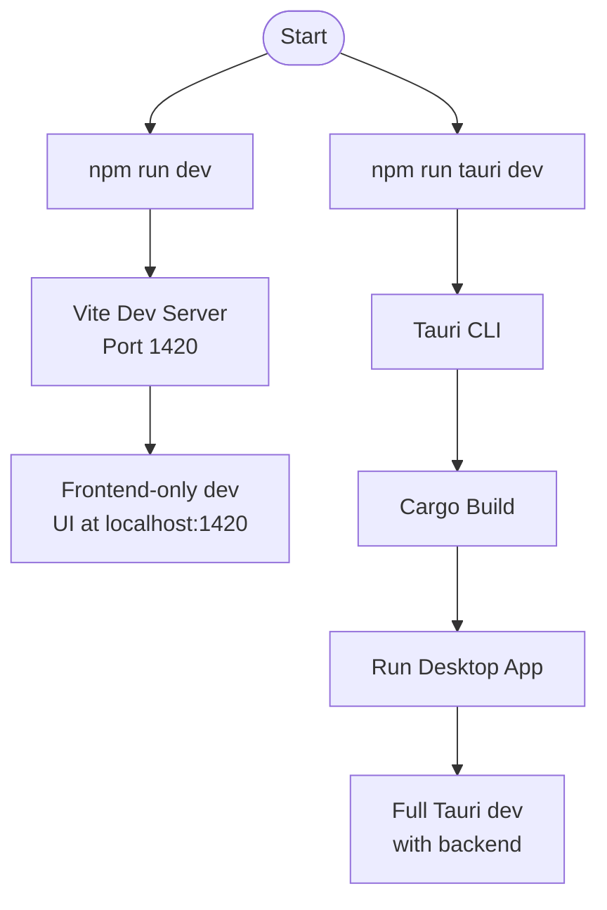
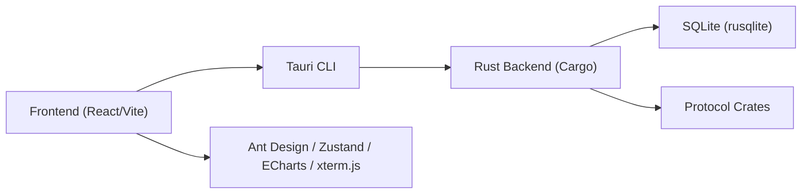

# Getting Started

<cite>
**Referenced Files in This Document**
- [README.md](file://README.md)
- [package.json](file://package.json)
- [vite.config.ts](file://vite.config.ts)
- [src-tauri/tauri.conf.json](file://src-tauri/tauri.conf.json)
- [src-tauri/Cargo.toml](file://src-tauri/Cargo.toml)
- [src-tauri/src/main.rs](file://src-tauri/src/main.rs)
- [src-tauri/build.rs](file://src-tauri/build.rs)
- [.github/workflows/build-desktop.yml](file://.github/workflows/build-desktop.yml)
- [.github/workflows/release.yml](file://.github/workflows/release.yml)
- [src/plugins/api-debugger/index.tsx](file://src/plugins/api-debugger/index.tsx)
- [src/plugins/redis-manager/index.tsx](file://src/plugins/redis-manager/index.tsx)
- [src/plugins/ssh-client/index.tsx](file://src/plugins/ssh-client/index.tsx)
- [src/plugins/s3-client/index.tsx](file://src/plugins/s3-client/index.tsx)
</cite>

## Table of Contents
1. [Introduction](#introduction)
2. [Project Structure](#project-structure)
3. [Core Components](#core-components)
4. [Architecture Overview](#architecture-overview)
5. [Detailed Component Analysis](#detailed-component-analysis)
6. [Dependency Analysis](#dependency-analysis)
7. [Performance Considerations](#performance-considerations)
8. [Troubleshooting Guide](#troubleshooting-guide)
9. [Conclusion](#conclusion)
10. [Appendices](#appendices)

## Introduction
DevNexus is a plugin-based desktop toolbox built with Tauri 2 + React 19 + TypeScript + Rust. It brings common connection-oriented and diagnostic tools into a single lightweight desktop application. The application is organized into a React frontend and a Rust backend, with a plugin architecture that isolates each tool’s UI, state, and backend commands.

Key highlights:
- Plugin-first design: each tool keeps its UI, state, backend commands, and connection pool isolated.
- Local-first storage: connection profiles are stored in local SQLite; sensitive fields are encrypted with AES-GCM.
- Lightweight desktop shell: Tauri provides a small native shell while Rust handles protocol and system-facing work.
- Cross-platform packaging: GitHub Actions build Windows, macOS, and Linux packages.

**Section sources**
- [README.md:207-256](file://README.md#L207-L256)

## Project Structure
The repository is split into:
- Frontend: React 19, TypeScript, Vite, Ant Design, Zustand, ECharts, xterm.js
- Backend: Rust, Tokio, SQLite via rusqlite, and protocol crates for Redis, SSH, S3, MongoDB, MySQL, MQ, and HTTP
- Tauri configuration: tauri.conf.json defines build, dev, app, and bundling settings
- Platform-specific CI: GitHub Actions workflows for Windows/macOS/Linux builds

**Diagram sources**
- [README.md:257-298](file://README.md#L257-L298)
- [src-tauri/tauri.conf.json:1-39](file://src-tauri/tauri.conf.json#L1-L39)

**Section sources**
- [README.md:58-99](file://README.md#L58-L99)
- [src-tauri/tauri.conf.json:1-39](file://src-tauri/tauri.conf.json#L1-L39)

## Core Components
- Environment requirements:
  - Node.js 20+
  - Rust stable
  - Platform-specific Tauri prerequisites
- Scripts:
  - Frontend dev server, build, lint, test, preview, and Tauri CLI invocation
- Tauri configuration:
  - Dev URL, port, and frontend build path
  - Bundling targets and icons
  - Window defaults and CSP policy

Verification commands:
- npm test (Vitest)
- npm run build (TypeScript + Vite)
- cargo check (Rust backend)

Packaging:
- Current platform default bundle
- Windows NSIS installer
- macOS .app + .dmg
- Linux .deb + .AppImage

**Section sources**
- [README.md:101-156](file://README.md#L101-L156)
- [README.md:300-354](file://README.md#L300-L354)
- [package.json:6-14](file://package.json#L6-L14)
- [src-tauri/tauri.conf.json:6-11](file://src-tauri/tauri.conf.json#L6-L11)

## Architecture Overview
The development and build pipeline integrates Vite, Tauri, and Rust:

**Diagram sources**
- [vite.config.ts:20-41](file://vite.config.ts#L20-L41)
- [src-tauri/tauri.conf.json:6-11](file://src-tauri/tauri.conf.json#L6-L11)
- [package.json:6-14](file://package.json#L6-L14)

**Section sources**
- [vite.config.ts:1-42](file://vite.config.ts#L1-L42)
- [src-tauri/tauri.conf.json:1-39](file://src-tauri/tauri.conf.json#L1-L39)
- [README.md:113-124](file://README.md#L113-L124)

## Detailed Component Analysis

### Environment Setup Requirements
- Node.js 20+ and Rust stable are mandatory.
- Platform-specific Tauri prerequisites must be installed for Windows, macOS, and Linux.
- CI workflows demonstrate the required toolchain versions and Linux system dependencies.

Platform prerequisites references:
- Rust installation: https://www.rust-lang.org/tools/install
- Tauri prerequisites: https://tauri.app/start/prerequisites/

Linux system dependencies (from CI):
- libwebkit2gtk-4.1-dev
- libgtk-3-dev
- libayatana-appindicator3-dev
- librsvg2-dev
- libcurl4-openssl-dev
- patchelf

**Section sources**
- [README.md:101-106](file://README.md#L101-L106)
- [README.md:108-111](file://README.md#L108-L111)
- [.github/workflows/build-desktop.yml:112-121](file://.github/workflows/build-desktop.yml#L112-L121)

### Step-by-Step Installation (Development)
1. Install dependencies
   - Run: npm install
2. Frontend-only development
   - Run: npm run dev
   - Visit: http://localhost:1420
3. Full Tauri desktop development
   - Run: npm run tauri dev
   - Tauri loads the dev server at http://localhost:1420

Notes:
- Vite runs on port 1420 with strictPort enabled.
- Tauri dev uses the configured devUrl and frontendDist.

**Section sources**
- [README.md:113-124](file://README.md#L113-L124)
- [vite.config.ts:20-41](file://vite.config.ts#L20-L41)
- [src-tauri/tauri.conf.json:6-11](file://src-tauri/tauri.conf.json#L6-L11)

### Step-by-Step Installation (Production)
- Build for current platform:
  - npm run tauri build
- Platform-specific bundles:
  - Windows: npm run tauri build -- --bundles nsis
  - macOS: npm run tauri build -- --bundles app,dmg
  - Linux: npm run tauri build -- --bundles deb,appimage

Artifacts:
- Windows: NSIS installer under src-tauri/target/release/bundle/nsis/
- macOS: .app and .dmg under respective bundle directories
- Linux: .deb and .AppImage under respective bundle directories

**Section sources**
- [README.md:142-156](file://README.md#L142-L156)
- [README.md:340-354](file://README.md#L340-L354)

### Verification Commands
- Run tests: npm test
- Type-check and build frontend: npm run build
- Rust backend check: cd src-tauri && cargo check

Notes:
- The build may show Vite large-chunk warnings and an existing unused RedisConnectionType warning; as long as exit code is 0, they do not block release.

**Section sources**
- [README.md:126-138](file://README.md#L126-L138)
- [README.md:324-336](file://README.md#L324-L336)

### Local Development Workflow
- Frontend-only development:
  - npm run dev starts Vite at http://localhost:1420
  - Vite ignores src-tauri during watch
- Full Tauri development:
  - npm run tauri dev launches Tauri with the dev server
  - Tauri expects a fixed port and will fail if unavailable

**Diagram sources**
- [vite.config.ts:20-41](file://vite.config.ts#L20-L41)
- [src-tauri/tauri.conf.json:6-11](file://src-tauri/tauri.conf.json#L6-L11)
- [package.json:6-14](file://package.json#L6-L14)

**Section sources**
- [vite.config.ts:1-42](file://vite.config.ts#L1-L42)
- [src-tauri/tauri.conf.json:1-39](file://src-tauri/tauri.conf.json#L1-L39)

### Quick Start Examples
Launch the application:
- Frontend-only: npm run dev
- Full desktop: npm run tauri dev

Access plugins:
- API Debugger: Workspace, Collections, Environments, History tabs
- Redis Manager: Connections, Keys, Console, Server tabs
- SSH Client: Connections, Terminal, Keys, Tunnels tabs
- S3 Client: Connections, Buckets, Objects tabs

Basic operations:
- Open the plugin from the sidebar navigation.
- Switch tabs within each plugin to navigate between views.
- Use the active environment indicator in the API Debugger to manage environments.

**Section sources**
- [src/plugins/api-debugger/index.tsx:13-39](file://src/plugins/api-debugger/index.tsx#L13-L39)
- [src/plugins/redis-manager/index.tsx:14-67](file://src/plugins/redis-manager/index.tsx#L14-L67)
- [src/plugins/ssh-client/index.tsx:12-66](file://src/plugins/ssh-client/index.tsx#L12-L66)
- [src/plugins/s3-client/index.tsx:10-76](file://src/plugins/s3-client/index.tsx#L10-L76)

### Platform-Specific Considerations
- Windows
  - Requires Tauri Windows prerequisites.
  - Artifacts: NSIS installer.
- macOS
  - Multi-arch builds supported (x64 and arm64).
  - Artifacts: .app and .dmg bundles.
- Linux
  - Requires system dependencies listed in CI.
  - Artifacts: .deb and .AppImage bundles.

CI references:
- Windows/macOS/Linux build jobs and targets
- Linux system dependency installation

**Section sources**
- [.github/workflows/build-desktop.yml:13-40](file://.github/workflows/build-desktop.yml#L13-L40)
- [.github/workflows/build-desktop.yml:41-96](file://.github/workflows/build-desktop.yml#L41-L96)
- [.github/workflows/build-desktop.yml:97-142](file://.github/workflows/build-desktop.yml#L97-L142)
- [.github/workflows/release.yml:12-61](file://.github/workflows/release.yml#L12-L61)
- [.github/workflows/release.yml:62-110](file://.github/workflows/release.yml#L62-L110)
- [.github/workflows/release.yml:111-149](file://.github/workflows/release.yml#L111-L149)

## Dependency Analysis
High-level dependencies between frontend, backend, and Tauri:

**Diagram sources**
- [src-tauri/Cargo.toml:20-49](file://src-tauri/Cargo.toml#L20-L49)
- [package.json:15-45](file://package.json#L15-L45)
- [src-tauri/tauri.conf.json:6-11](file://src-tauri/tauri.conf.json#L6-L11)

**Section sources**
- [src-tauri/Cargo.toml:1-49](file://src-tauri/Cargo.toml#L1-L49)
- [package.json:15-45](file://package.json#L15-L45)
- [src-tauri/tauri.conf.json:1-39](file://src-tauri/tauri.conf.json#L1-L39)

## Performance Considerations
- Use pagination and filtering for large datasets (tables, buckets, collections).
- Prefer virtualized lists and scroll-safe dashboards to avoid UI stalls.
- Keep the number of concurrent connections reasonable and close unused sessions.

[No sources needed since this section provides general guidance]

## Troubleshooting Guide
Common issues and resolutions:
- Port conflicts
  - Vite runs on port 1420 with strictPort enabled; ensure it is free or adjust configuration.
- Tauri dev fails to start
  - Verify the dev server is reachable at http://localhost:1420.
  - Confirm the devUrl and frontendDist match the Vite configuration.
- Rust compilation errors
  - Run cargo check in src-tauri to diagnose backend issues.
- Linux build failures
  - Install missing system dependencies as shown in CI workflows.
- Test failures
  - Run npm test to locate failing unit tests; fix or skip as appropriate.

**Section sources**
- [vite.config.ts:20-41](file://vite.config.ts#L20-L41)
- [src-tauri/tauri.conf.json:6-11](file://src-tauri/tauri.conf.json#L6-L11)
- [.github/workflows/build-desktop.yml:112-121](file://.github/workflows/build-desktop.yml#L112-L121)

## Conclusion
You now have the essentials to set up DevNexus locally, develop in either frontend-only or full Tauri mode, verify builds, and package cross-platform binaries. Use the plugin examples to explore core functionality and refer to the troubleshooting section for common pitfalls.

[No sources needed since this section summarizes without analyzing specific files]

## Appendices

### Appendix A: Environment Requirements Checklist
- Node.js 20+
- Rust stable
- Platform-specific Tauri prerequisites
- Optional: Linux system dependencies for packaging

**Section sources**
- [README.md:101-106](file://README.md#L101-L106)
- [README.md:108-111](file://README.md#L108-L111)
- [.github/workflows/build-desktop.yml:112-121](file://.github/workflows/build-desktop.yml#L112-L121)

### Appendix B: Key Commands Reference
- Install dependencies: npm install
- Frontend dev: npm run dev
- Full Tauri dev: npm run tauri dev
- Tests: npm test
- Build: npm run build
- Rust check: cd src-tauri && cargo check
- Package current platform: npm run tauri build
- Windows: npm run tauri build -- --bundles nsis
- macOS: npm run tauri build -- --bundles app,dmg
- Linux: npm run tauri build -- --bundles deb,appimage

**Section sources**
- [README.md:113-156](file://README.md#L113-L156)
- [README.md:311-354](file://README.md#L311-L354)
- [package.json:6-14](file://package.json#L6-L14)