# Plugin Interface Specifications

<cite>
**Referenced Files in This Document**
- [types.ts](file://src/app/plugin-registry/types.ts)
- [registry.ts](file://src/app/plugin-registry/registry.ts)
- [builtin.ts](file://src/app/plugin-registry/builtin.ts)
- [types.ts](file://src/plugins/api-debugger/types.ts)
- [types.ts](file://src/plugins/confluence/types.ts)
- [types.ts](file://src/plugins/mongodb-client/types.ts)
- [types.ts](file://src/plugins/mysql-client/types.ts)
- [types.ts](file://src/plugins/redis-manager/types.ts)
- [types.ts](file://src/plugins/s3-client/types.ts)
- [types.ts](file://src/plugins/ssh-client/types.ts)
- [types.ts](file://src/plugins/mq-client/types.ts)
- [types.ts](file://src/plugins/network-tools/types.ts)
- [types.ts](file://src/plugins/lan-chat/types.ts)
- [mod.rs](file://src-tauri/src/plugins/mod.rs)
- [types.rs](file://src-tauri/src/plugins/api_debugger/types.rs)
- [types.rs](file://src-tauri/src/plugins/mongodb/types.rs)
- [types.rs](file://src-tauri/src/plugins/mysql/types.rs)
- [types.rs](file://src-tauri/src/plugins/redis/types.rs)
- [types.rs](file://src-tauri/src/plugins/s3/types.rs)
- [types.rs](file://src-tauri/src/plugins/ssh/types.rs)
- [types.rs](file://src-tauri/src/plugins/mq/types.rs)
- [types.rs](file://src-tauri/src/plugins/network/types.rs)
- [types.rs](file://src-tauri/src/plugins/lan_chat/types.rs)
</cite>

## Table of Contents
1. [Introduction](#introduction)
2. [Project Structure](#project-structure)
3. [Core Components](#core-components)
4. [Architecture Overview](#architecture-overview)
5. [Detailed Component Analysis](#detailed-component-analysis)
6. [Dependency Analysis](#dependency-analysis)
7. [Performance Considerations](#performance-considerations)
8. [Troubleshooting Guide](#troubleshooting-guide)
9. [Conclusion](#conclusion)
10. [Appendices](#appendices)

## Introduction
This document specifies the plugin interface contracts and standards used by the application. It defines the plugin manifest structure, registration contract, and the shared data types used across frontend plugins. It also outlines the backend plugin module organization and the shared Rust data structures that represent plugin-specific capabilities such as database clients, cloud storage, messaging systems, SSH, LAN chat, and network diagnostics. The document further explains how plugins expose state via shared types and how commands and parameters are modeled for interoperability between frontend and backend.

## Project Structure
The plugin system is composed of:
- Frontend plugin registry and manifest contract
- Built-in plugin registration
- Frontend plugin-specific type definitions
- Backend plugin module organization and shared Rust type definitions

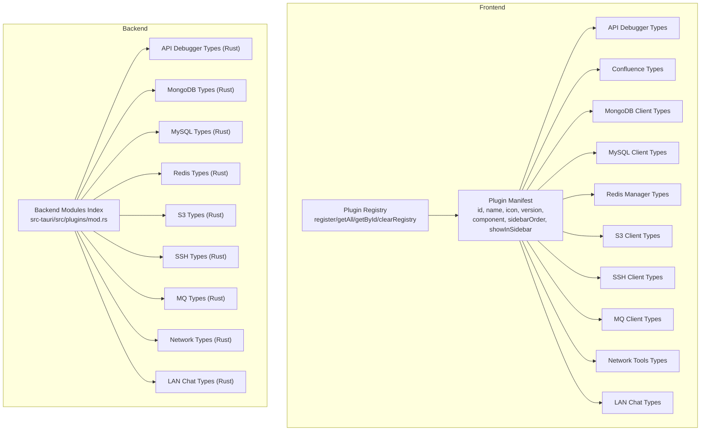

**Diagram sources**
- [registry.ts:1-26](file://src/app/plugin-registry/registry.ts#L1-L26)
- [types.ts:5-13](file://src/app/plugin-registry/types.ts#L5-L13)
- [types.ts:1-105](file://src/plugins/api-debugger/types.ts#L1-L105)
- [types.ts:1-86](file://src/plugins/confluence/types.ts#L1-L86)
- [types.ts:1-95](file://src/plugins/mongodb-client/types.ts#L1-L95)
- [types.ts:1-40](file://src/plugins/mysql-client/types.ts#L1-L40)
- [types.ts:1-91](file://src/plugins/redis-manager/types.ts#L1-L91)
- [types.ts:1-110](file://src/plugins/s3-client/types.ts#L1-L110)
- [types.ts:1-115](file://src/plugins/ssh-client/types.ts#L1-L115)
- [types.ts:1-90](file://src/plugins/mq-client/types.ts#L1-L90)
- [types.ts:1-57](file://src/plugins/network-tools/types.ts#L1-L57)
- [types.ts:1-74](file://src/plugins/lan-chat/types.ts#L1-L74)
- [mod.rs:1-11](file://src-tauri/src/plugins/mod.rs#L1-L11)
- [types.rs:1-170](file://src-tauri/src/plugins/api_debugger/types.rs#L1-L170)
- [types.rs:1-80](file://src-tauri/src/plugins/mongodb/types.rs#L1-L80)
- [types.rs:1-97](file://src-tauri/src/plugins/mysql/types.rs#L1-L97)
- [types.rs:1-97](file://src-tauri/src/plugins/redis/types.rs#L1-L97)
- [types.rs:1-6](file://src-tauri/src/plugins/s3/types.rs#L1-L6)
- [types.rs:1-93](file://src-tauri/src/plugins/ssh/types.rs#L1-L93)
- [types.rs:1-213](file://src-tauri/src/plugins/mq/types.rs#L1-L213)
- [types.rs:1-65](file://src-tauri/src/plugins/network/types.rs#L1-L65)
- [types.rs:1-159](file://src-tauri/src/plugins/lan_chat/types.rs#L1-L159)

**Section sources**
- [registry.ts:1-26](file://src/app/plugin-registry/registry.ts#L1-L26)
- [types.ts:1-14](file://src/app/plugin-registry/types.ts#L1-L14)
- [mod.rs:1-11](file://src-tauri/src/plugins/mod.rs#L1-L11)

## Core Components
- Plugin Manifest: Defines the plugin’s identity, UI component, and sidebar presentation order.
- Plugin Registry: Provides registration, retrieval, and clearing mechanisms for plugins.
- Shared Type Systems: Define the data contracts for plugin operations (requests, responses, history, environments, etc.) on both frontend and backend.

Key responsibilities:
- Manifest: Declares plugin identity and UI entry point.
- Registry: Centralized plugin lifecycle management and ordering.
- Types: Stable contracts for commands, state, and results across plugin domains.

**Section sources**
- [types.ts:5-13](file://src/app/plugin-registry/types.ts#L5-L13)
- [registry.ts:5-21](file://src/app/plugin-registry/registry.ts#L5-L21)

## Architecture Overview
The plugin architecture separates concerns between frontend and backend:
- Frontend: Declares plugin manifests, exposes UI components, and defines domain-specific types.
- Backend: Exposes plugin modules and shared Rust types for data exchange and command handling.

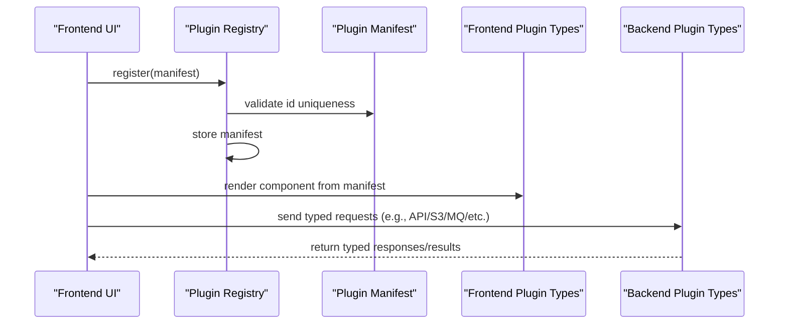

**Diagram sources**
- [registry.ts:5-11](file://src/app/plugin-registry/registry.ts#L5-L11)
- [types.ts:5-13](file://src/app/plugin-registry/types.ts#L5-L13)
- [types.ts:27-41](file://src/plugins/api-debugger/types.ts#L27-L41)
- [types.rs:35-49](file://src-tauri/src/plugins/api_debugger/types.rs#L35-L49)

## Detailed Component Analysis

### Plugin Manifest and Registry Contract
- Manifest fields:
  - id: Unique identifier
  - name: Human-readable name
  - icon: ReactNode for sidebar icon
  - version: Semantic version string
  - component: React component factory
  - sidebarOrder: Number used for sorting
  - showInSidebar: Optional flag to hide from sidebar
- Registry operations:
  - register(plugin): Idempotent registration; duplicates ignored
  - getAll(): Returns sorted manifests by sidebarOrder
  - getById(id): Retrieves a manifest by id
  - clearRegistry(): Clears all registered plugins

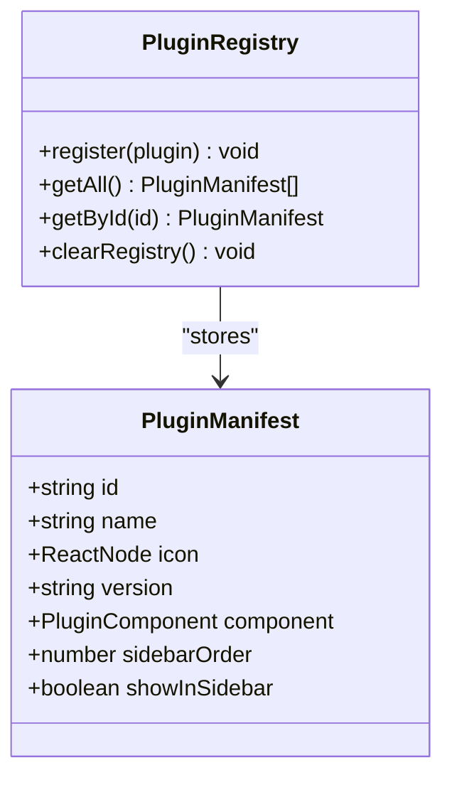

**Diagram sources**
- [types.ts:5-13](file://src/app/plugin-registry/types.ts#L5-L13)
- [registry.ts:5-21](file://src/app/plugin-registry/registry.ts#L5-L21)

**Section sources**
- [types.ts:5-13](file://src/app/plugin-registry/types.ts#L5-L13)
- [registry.ts:5-21](file://src/app/plugin-registry/registry.ts#L5-L21)

### Built-in Plugins Registration
Built-in plugins are registered centrally to ensure consistent availability and ordering. The built-in registry integrates with the core registry to provide default plugins.

- Built-in registry file coordinates plugin registration during application startup.
- It leverages the same manifest and registry APIs to integrate seamlessly.

**Section sources**
- [builtin.ts](file://src/app/plugin-registry/builtin.ts)

### Frontend Plugin Type Contracts

#### API Debugger
- Requests: Method, URL, parameters, headers, cookies, authentication, body, timeouts, redirects, SSL validation, environment binding, and history saving.
- Responses: Status, headers, cookies, body, truncation flag, content type, redirect chain, timing, and error.
- Collections, folders, environments, saved requests, and history items define persistent state and navigation.

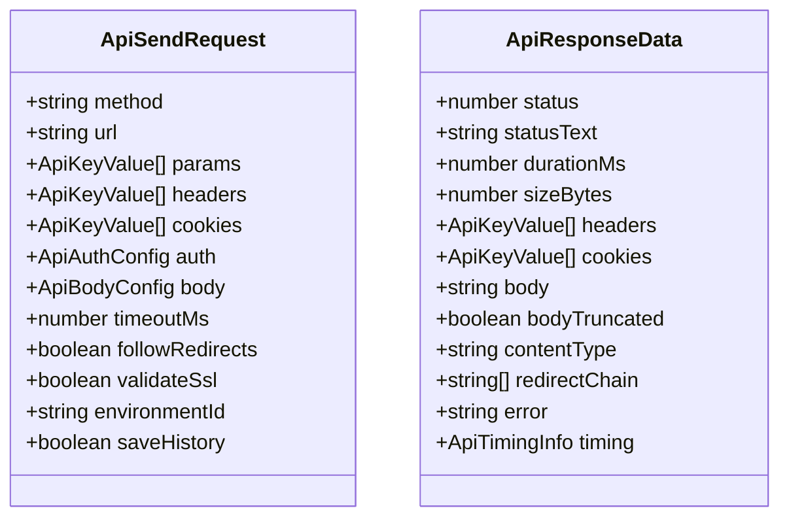

**Diagram sources**
- [types.ts:27-41](file://src/plugins/api-debugger/types.ts#L27-L41)
- [types.ts:51-64](file://src/plugins/api-debugger/types.ts#L51-L64)

**Section sources**
- [types.ts:1-105](file://src/plugins/api-debugger/types.ts#L1-L105)

#### Confluence
- Connection info and forms support basic and personal access token authentication.
- Page and attachment metadata, publish history, and page targeting enable publishing workflows.

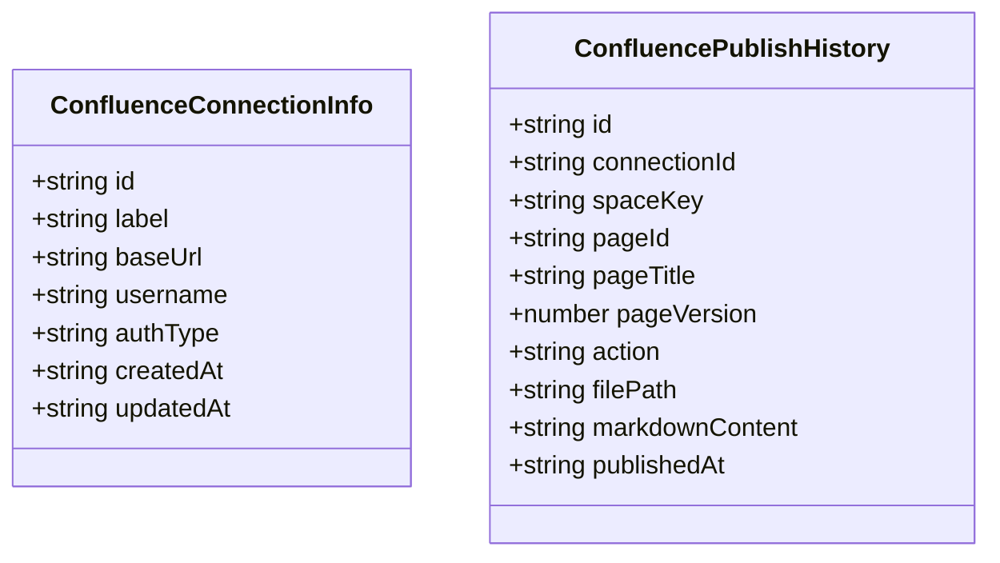

**Diagram sources**
- [types.ts:1-9](file://src/plugins/confluence/types.ts#L1-L9)
- [types.ts:53-66](file://src/plugins/confluence/types.ts#L53-L66)

**Section sources**
- [types.ts:1-86](file://src/plugins/confluence/types.ts#L1-L86)

#### MongoDB Client
- Connection forms and info, latency, databases, collections, indexes, query history, import results, and server status.

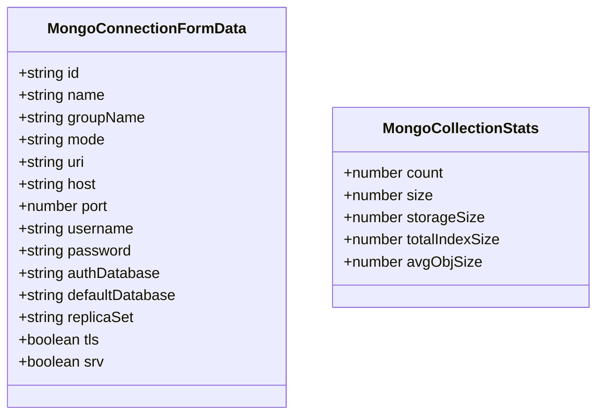

**Diagram sources**
- [types.ts:3-18](file://src/plugins/mongodb-client/types.ts#L3-L18)
- [types.ts:52-58](file://src/plugins/mongodb-client/types.ts#L52-L58)

**Section sources**
- [types.ts:1-95](file://src/plugins/mongodb-client/types.ts#L1-L95)

#### MySQL Client
- Connection forms and info, latency, databases, tables, columns, indexes, rows, SQL results, import results, and server status.

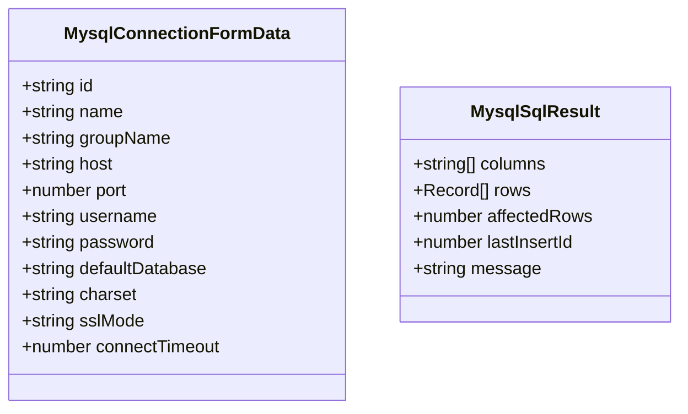

**Diagram sources**
- [types.ts:1-13](file://src/plugins/mysql-client/types.ts#L1-L13)
- [types.ts:35-35](file://src/plugins/mysql-client/types.ts#L35-L35)

**Section sources**
- [types.ts:1-40](file://src/plugins/mysql-client/types.ts#L1-L40)

#### Redis Manager
- Connection forms and info, latency, server info, key scanning, hash/list/set/zset members, slowlog entries, server info groups, import/export results, and export formats.

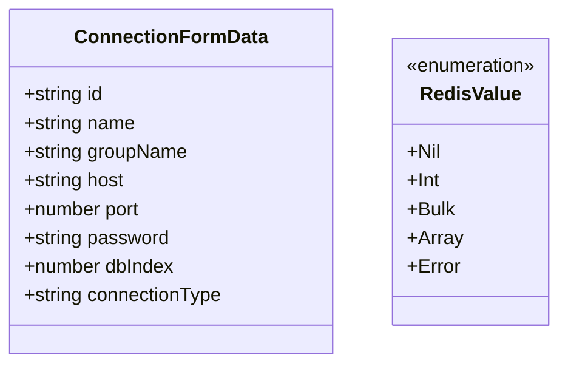

**Diagram sources**
- [types.ts:3-12](file://src/plugins/redis-manager/types.ts#L3-L12)
- [types.ts:85-90](file://src/plugins/redis-manager/types.ts#L85-L90)

**Section sources**
- [types.ts:1-91](file://src/plugins/redis-manager/types.ts#L1-L91)

#### S3 Client
- Provider enumeration, connection forms and info, latency, buckets, objects, versions, object metadata, delete results, tags, bucket statistics, and object row types.

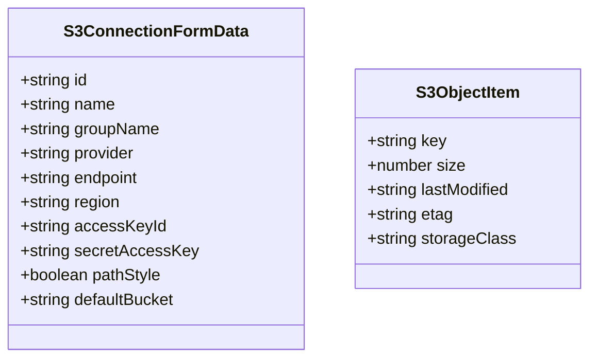

**Diagram sources**
- [types.ts:3-14](file://src/plugins/s3-client/types.ts#L3-L14)
- [types.ts:40-46](file://src/plugins/s3-client/types.ts#L40-L46)

**Section sources**
- [types.ts:1-110](file://src/plugins/s3-client/types.ts#L1-L110)

#### SSH Client
- Authentication types, connection forms and info, latency, terminal sessions, quick commands, key management, and tunnel rules.

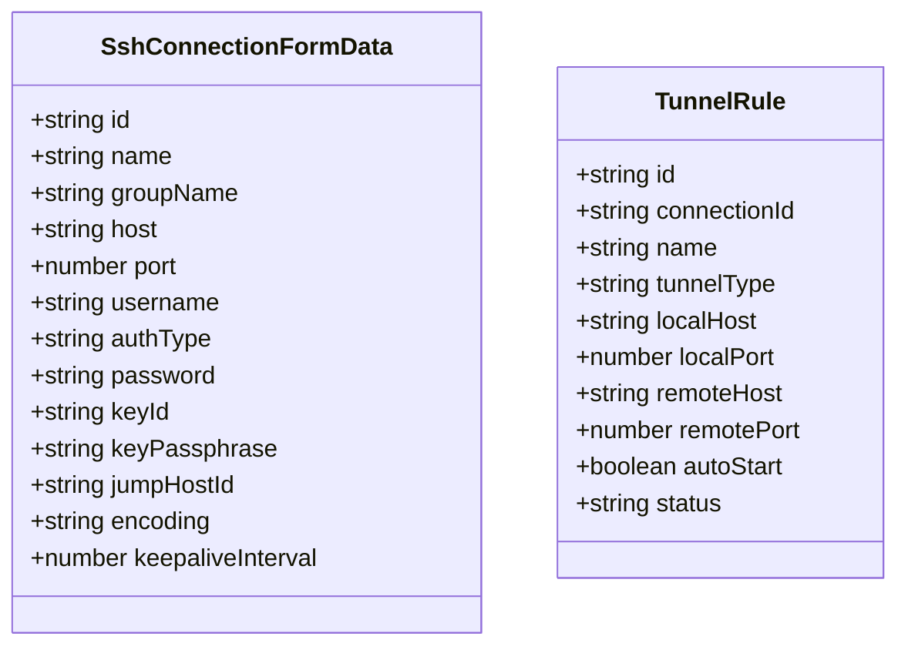

**Diagram sources**
- [types.ts:3-17](file://src/plugins/ssh-client/types.ts#L3-L17)
- [types.ts:82-93](file://src/plugins/ssh-client/types.ts#L82-L93)

**Section sources**
- [types.ts:1-115](file://src/plugins/ssh-client/types.ts#L1-L115)

#### MQ Client
- Broker types, connection forms and info, diagnostics, key-value pairs, encoded message bodies, publish/consume requests, message previews, operation results, resource nodes, history items, and saved messages.

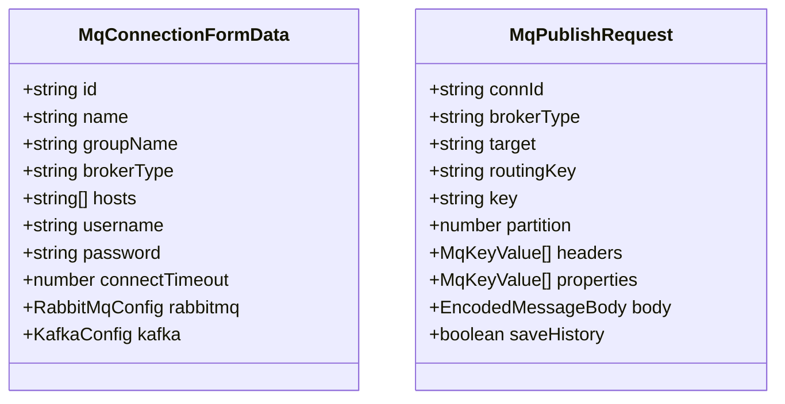

**Diagram sources**
- [types.ts:22-33](file://src/plugins/mq-client/types.ts#L22-L33)
- [types.ts:46-57](file://src/plugins/mq-client/types.ts#L46-L57)

**Section sources**
- [types.ts:1-90](file://src/plugins/mq-client/types.ts#L1-L90)

#### Network Tools
- Tool types, history items, TCP checks, ping results, DNS lookup results, traceroute hops, and union result type.

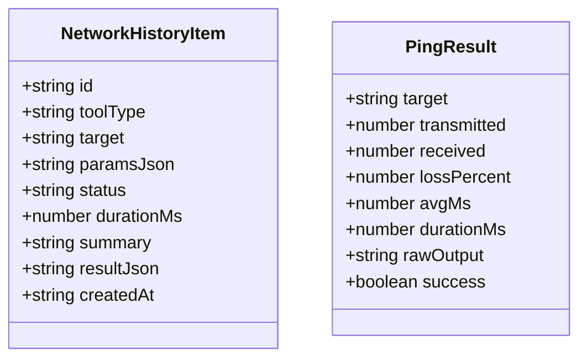

**Diagram sources**
- [types.ts:3-13](file://src/plugins/network-tools/types.ts#L3-L13)
- [types.ts:24-33](file://src/plugins/network-tools/types.ts#L24-L33)

**Section sources**
- [types.ts:1-57](file://src/plugins/network-tools/types.ts#L1-L57)

#### LAN Chat
- Device identity, device records, rooms, conversations, messages, transfers, and snapshot aggregation.

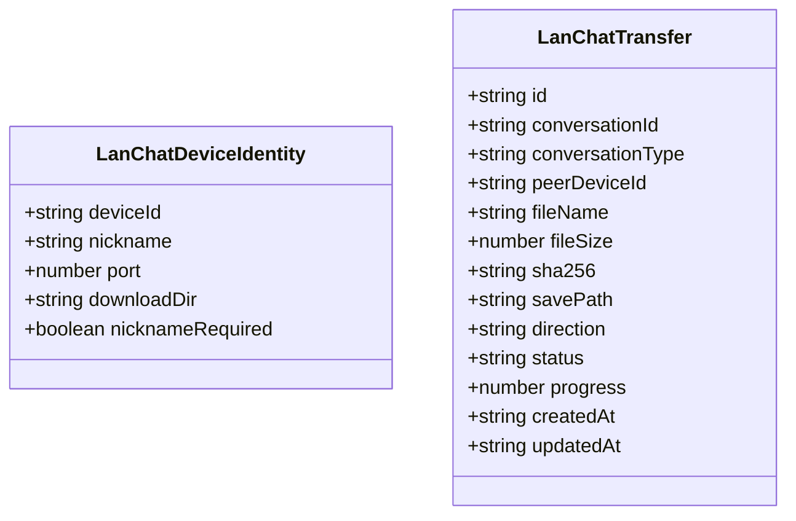

**Diagram sources**
- [types.ts:1-7](file://src/plugins/lan-chat/types.ts#L1-L7)
- [types.ts:52-66](file://src/plugins/lan-chat/types.ts#L52-L66)

**Section sources**
- [types.ts:1-74](file://src/plugins/lan-chat/types.ts#L1-L74)

### Backend Plugin Module Organization and Shared Types

Backend modules are organized under a single index that re-exports all plugin modules. Each module defines its own Rust type definitions for data exchange.

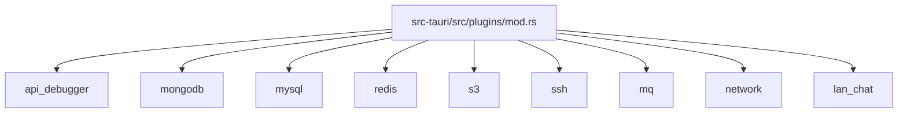

**Diagram sources**
- [mod.rs:1-11](file://src-tauri/src/plugins/mod.rs#L1-L11)

Shared Rust type definitions mirror frontend contracts for consistent serialization and deserialization across the IPC boundary.

Examples of backend type coverage:
- API Debugger: Requests, responses, environments, collections, folders, saved requests, history filters.
- MongoDB: Latency, database info, collection info/stats, document pages, indexes, query history, import results, server status.
- MySQL: Latency, database/table/column/index/info, row pages, SQL results, import results, server status.
- Redis: Server info, latency, key meta, scan results, hash fields, zset members, slowlog entries, server info groups, import/export results, export formats, and tagged enums for values.
- S3: Latency.
- SSH: Latency, terminal sessions, key info, generated key pairs, quick commands, tunnel rules, and forms.
- MQ: Connection info/form, diagnostics, key-value pairs, encoded message bodies, publish/consume requests, operation results, message previews, resource nodes, history items, and saved messages.
- Network: History items, TCP checks, ping results, DNS lookup results, traceroute hops.
- LAN Chat: Device identity, device records, rooms, messages, transfers, conversations, and snapshots; plus request DTOs for operations.

**Section sources**
- [types.rs:1-170](file://src-tauri/src/plugins/api_debugger/types.rs#L1-L170)
- [types.rs:1-80](file://src-tauri/src/plugins/mongodb/types.rs#L1-L80)
- [types.rs:1-97](file://src-tauri/src/plugins/mysql/types.rs#L1-L97)
- [types.rs:1-97](file://src-tauri/src/plugins/redis/types.rs#L1-L97)
- [types.rs:1-6](file://src-tauri/src/plugins/s3/types.rs#L1-L6)
- [types.rs:1-93](file://src-tauri/src/plugins/ssh/types.rs#L1-L93)
- [types.rs:1-213](file://src-tauri/src/plugins/mq/types.rs#L1-L213)
- [types.rs:1-65](file://src-tauri/src/plugins/network/types.rs#L1-L65)
- [types.rs:1-159](file://src-tauri/src/plugins/lan_chat/types.rs#L1-L159)

## Dependency Analysis
- Frontend plugins depend on shared type definitions for consistent contracts.
- Backend modules depend on their respective Rust type definitions for IPC-safe serialization.
- The registry depends on the manifest contract to manage plugin lifecycles.
- Built-in plugins integrate with the registry to provide default functionality.

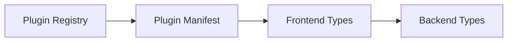

**Diagram sources**
- [registry.ts:1-26](file://src/app/plugin-registry/registry.ts#L1-L26)
- [types.ts:5-13](file://src/app/plugin-registry/types.ts#L5-L13)
- [types.ts:1-105](file://src/plugins/api-debugger/types.ts#L1-L105)
- [types.rs:1-170](file://src-tauri/src/plugins/api_debugger/types.rs#L1-L170)

**Section sources**
- [registry.ts:1-26](file://src/app/plugin-registry/registry.ts#L1-L26)
- [types.ts:1-14](file://src/app/plugin-registry/types.ts#L1-L14)

## Performance Considerations
- Prefer incremental updates and pagination for large datasets (e.g., query history, object lists, message histories).
- Use compact serialized forms for frequent IPC operations (e.g., latency measurements, small key-value pairs).
- Cache frequently accessed metadata (e.g., server info, connection status) to reduce round trips.
- Avoid unnecessary deep cloning of large JSON payloads; pass references where safe and immutable.

## Troubleshooting Guide
Common issues and resolutions:
- Duplicate plugin ID: Registration is idempotent; ensure unique IDs across plugins.
- Sidebar ordering: Adjust sidebarOrder to control display sequence.
- Serialization mismatches: Align frontend and backend type field names and shapes to prevent IPC errors.
- Large payloads: Paginate results and truncate previews to avoid performance degradation.

**Section sources**
- [registry.ts:5-11](file://src/app/plugin-registry/registry.ts#L5-L11)

## Conclusion
The plugin interface specifications define a clear separation between frontend and backend while ensuring strong contracts through shared type definitions. The manifest and registry provide a standardized way to declare and manage plugins, while the backend module organization ensures maintainable and evolvable plugin capabilities. By adhering to these contracts, developers can implement new plugins with predictable behavior and seamless integration.

## Appendices

### Appendix A: Plugin Manifest Fields
- id: Unique plugin identifier
- name: Display name
- icon: ReactNode for sidebar icon
- version: Semantic version string
- component: React component factory
- sidebarOrder: Sorting weight for sidebar
- showInSidebar: Optional visibility flag

**Section sources**
- [types.ts:5-13](file://src/app/plugin-registry/types.ts#L5-L13)

### Appendix B: Example Plugin Domains and Their Interfaces
- Database Clients (MongoDB, MySQL): Connection forms/info, latency, schema browsing, query history, import/export, server status.
- Cloud Services (S3): Provider enumeration, connection forms/info, latency, bucket/object listings, metadata, tagging, deletion, statistics.
- Messaging Systems (MQ): Broker configuration, publish/consume requests, diagnostics, message previews, history, saved messages.
- Development Tools (API Debugger, Network Tools): Request composition, response inspection, environment variables, history, and diagnostic results.
- Infrastructure (SSH, LAN Chat): Authentication, sessions, tunnels, device discovery, messaging, and file transfers.

**Section sources**
- [types.ts:1-95](file://src/plugins/mongodb-client/types.ts#L1-L95)
- [types.ts:1-40](file://src/plugins/mysql-client/types.ts#L1-L40)
- [types.ts:1-110](file://src/plugins/s3-client/types.ts#L1-L110)
- [types.ts:1-90](file://src/plugins/mq-client/types.ts#L1-L90)
- [types.ts:1-105](file://src/plugins/api-debugger/types.ts#L1-L105)
- [types.ts:1-57](file://src/plugins/network-tools/types.ts#L1-L57)
- [types.ts:1-115](file://src/plugins/ssh-client/types.ts#L1-L115)
- [types.ts:1-74](file://src/plugins/lan-chat/types.ts#L1-L74)

### Appendix C: Backend Module Index
- api_debugger
- confluence
- lan_chat
- mongodb
- mysql
- mq
- network
- redis
- s3
- ssh

**Section sources**
- [mod.rs:1-11](file://src-tauri/src/plugins/mod.rs#L1-L11)