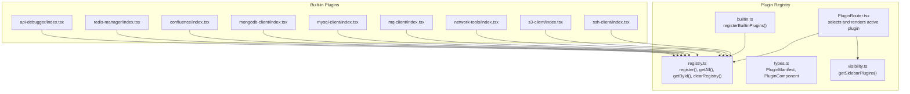
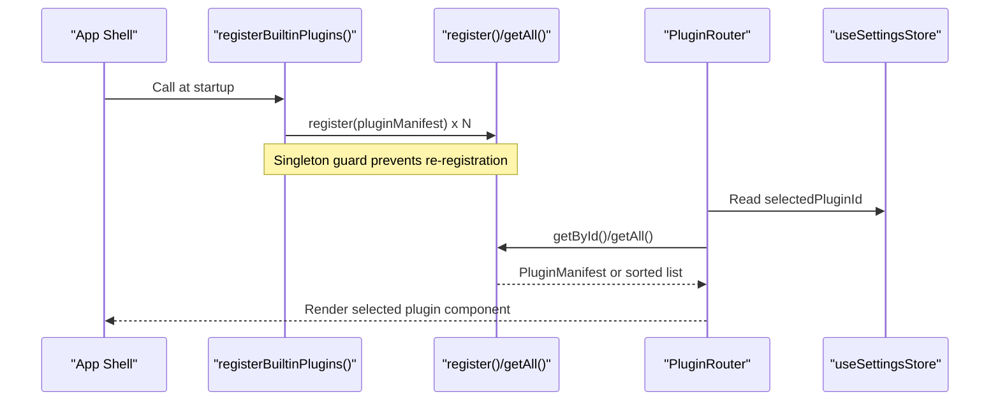
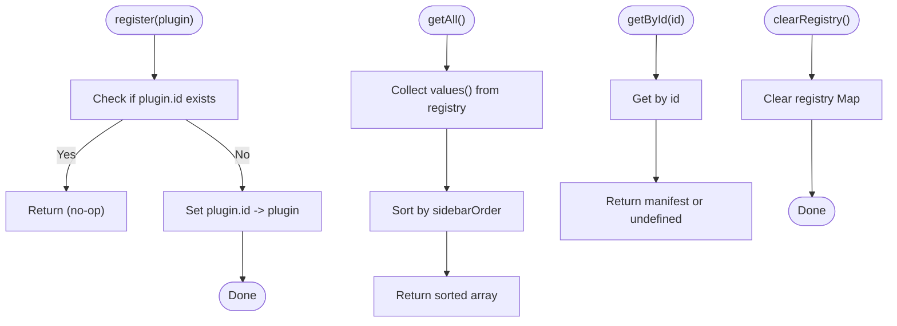
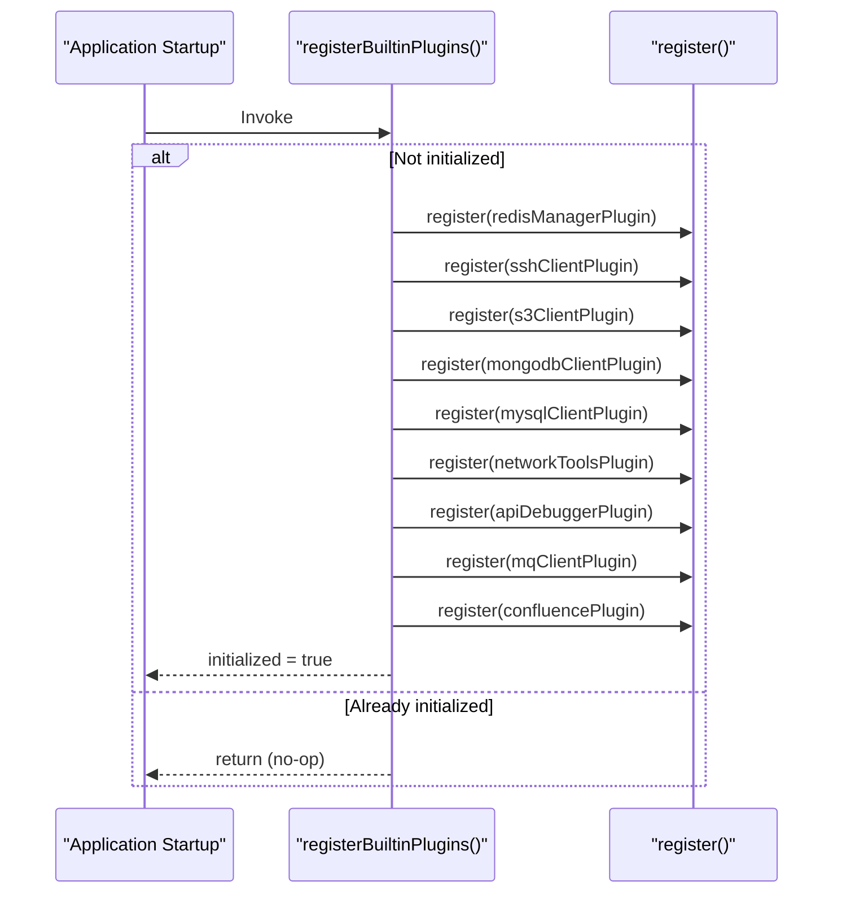
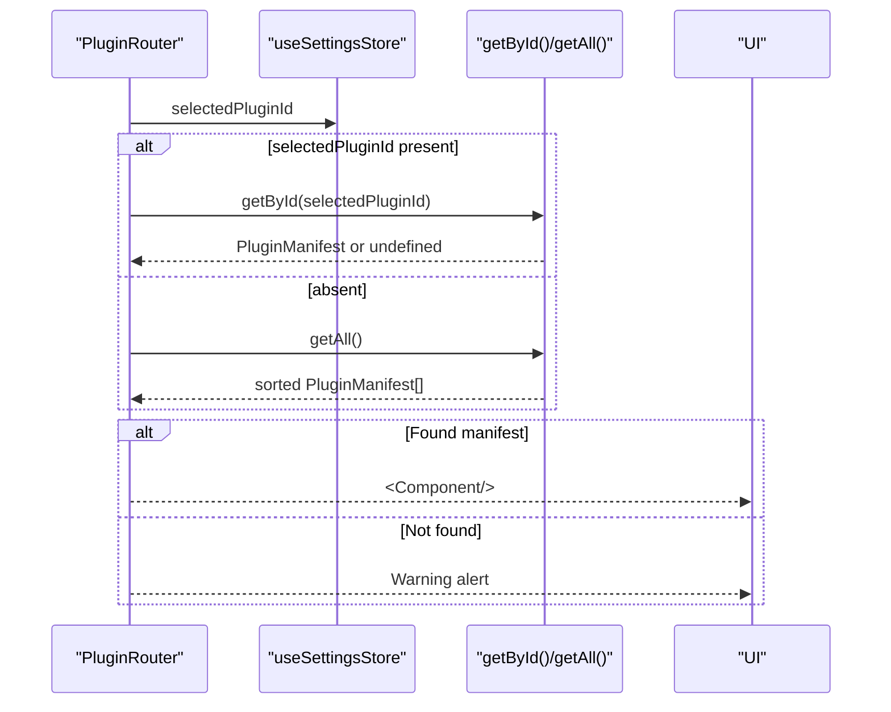
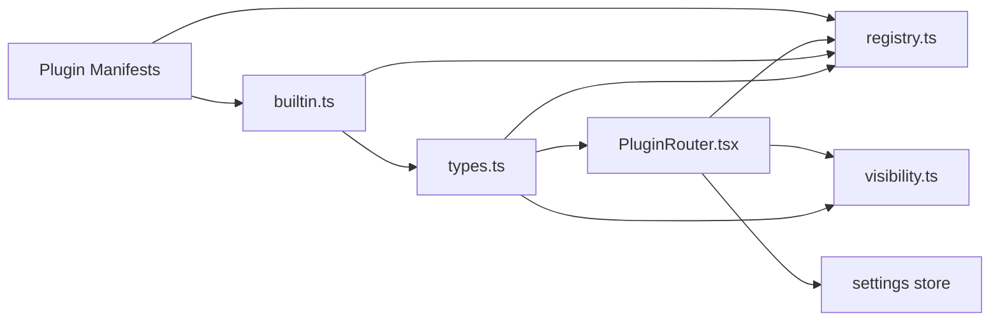

# Plugin Registration & Lifecycle

<cite>
**Referenced Files in This Document**
- [registry.ts](file://src/app/plugin-registry/registry.ts)
- [builtin.ts](file://src/app/plugin-registry/builtin.ts)
- [types.ts](file://src/app/plugin-registry/types.ts)
- [visibility.ts](file://src/app/plugin-registry/visibility.ts)
- [PluginRouter.tsx](file://src/app/plugin-registry/PluginRouter.tsx)
- [index.tsx (api-debugger)](file://src/plugins/api-debugger/index.tsx)
- [index.tsx (redis-manager)](file://src/plugins/redis-manager/index.tsx)
- [index.tsx (confluence)](file://src/plugins/confluence/index.tsx)
- [index.tsx (mongodb-client)](file://src/plugins/mongodb-client/index.tsx)
- [index.tsx (mysql-client)](file://src/plugins/mysql-client/index.tsx)
- [index.tsx (mq-client)](file://src/plugins/mq-client/index.tsx)
- [index.tsx (network-tools)](file://src/plugins/network-tools/index.tsx)
- [index.tsx (s3-client)](file://src/plugins/s3-client/index.tsx)
- [index.tsx (ssh-client)](file://src/plugins/ssh-client/index.tsx)
- [App.tsx](file://src/App.tsx)
</cite>

## Table of Contents
1. [Introduction](#introduction)
2. [Project Structure](#project-structure)
3. [Core Components](#core-components)
4. [Architecture Overview](#architecture-overview)
5. [Detailed Component Analysis](#detailed-component-analysis)
6. [Dependency Analysis](#dependency-analysis)
7. [Performance Considerations](#performance-considerations)
8. [Troubleshooting Guide](#troubleshooting-guide)
9. [Conclusion](#conclusion)

## Introduction
This document explains the plugin registration and lifecycle management system. It covers how plugins are registered at application startup, the initialization sequence, and the role of the registry module. It documents the plugin registration process, including how built-in plugins are loaded via the built-in loader, and the registration mechanism. It also describes plugin lifecycle phases from registration to activation, including state management and cleanup procedures. Practical examples of plugin registration patterns are included, along with an explanation of the singleton pattern used for plugin initialization and how dependency resolution and loading order are handled.

## Project Structure
The plugin system is centered around a small set of registry utilities and a collection of plugin manifests. Built-in plugins are grouped under a dedicated loader that registers each plugin manifest into the central registry. The router selects and renders the active plugin component based on persisted selection.

**Diagram sources**
- [registry.ts:1-26](file://src/app/plugin-registry/registry.ts#L1-L26)
- [builtin.ts:1-31](file://src/app/plugin-registry/builtin.ts#L1-L31)
- [types.ts:1-14](file://src/app/plugin-registry/types.ts#L1-L14)
- [visibility.ts:1-6](file://src/app/plugin-registry/visibility.ts#L1-L6)
- [PluginRouter.tsx:1-29](file://src/app/plugin-registry/PluginRouter.tsx#L1-L29)
- [index.tsx (api-debugger):1-39](file://src/plugins/api-debugger/index.tsx#L1-L39)
- [index.tsx (redis-manager):1-67](file://src/plugins/redis-manager/index.tsx#L1-L67)
- [index.tsx (confluence):1-18](file://src/plugins/confluence/index.tsx#L1-L18)
- [index.tsx (mongodb-client):1-87](file://src/plugins/mongodb-client/index.tsx#L1-L87)
- [index.tsx (mysql-client):1-38](file://src/plugins/mysql-client/index.tsx#L1-L38)
- [index.tsx (mq-client):1-38](file://src/plugins/mq-client/index.tsx#L1-L38)
- [index.tsx (network-tools):1-27](file://src/plugins/network-tools/index.tsx#L1-L27)
- [index.tsx (s3-client):1-76](file://src/plugins/s3-client/index.tsx#L1-L76)
- [index.tsx (ssh-client):1-66](file://src/plugins/ssh-client/index.tsx#L1-L66)

**Section sources**
- [registry.ts:1-26](file://src/app/plugin-registry/registry.ts#L1-L26)
- [builtin.ts:1-31](file://src/app/plugin-registry/builtin.ts#L1-L31)
- [types.ts:1-14](file://src/app/plugin-registry/types.ts#L1-L14)
- [visibility.ts:1-6](file://src/app/plugin-registry/visibility.ts#L1-L6)
- [PluginRouter.tsx:1-29](file://src/app/plugin-registry/PluginRouter.tsx#L1-L29)

## Core Components
- Registry module: Provides a centralized Map-based registry for plugin manifests, with registration, retrieval, sorting, and clearing functions.
- Built-in loader: Imports all built-in plugin manifests and registers them once, enforcing a singleton initialization pattern.
- Types: Defines the PluginManifest contract and the PluginComponent type used for rendering.
- Visibility filter: Filters plugin manifests for sidebar display.
- Plugin router: Selects the active plugin based on persisted selection and renders its component.

Key responsibilities:
- Registration: Ensures uniqueness by ID and stores manifests.
- Initialization: Built-in plugins are registered once via a guarded function.
- Activation: The router resolves the active plugin and renders its component.
- Sorting: Plugins are sorted by sidebarOrder for consistent ordering.
- Sidebar filtering: Excludes plugins marked as hidden.

**Section sources**
- [registry.ts:1-26](file://src/app/plugin-registry/registry.ts#L1-L26)
- [builtin.ts:12-29](file://src/app/plugin-registry/builtin.ts#L12-L29)
- [types.ts:5-13](file://src/app/plugin-registry/types.ts#L5-L13)
- [visibility.ts:3-5](file://src/app/plugin-registry/visibility.ts#L3-L5)
- [PluginRouter.tsx:7-28](file://src/app/plugin-registry/PluginRouter.tsx#L7-L28)

## Architecture Overview
The plugin system follows a simple, predictable flow:
- Application startup triggers the built-in loader to register all core plugins.
- The registry holds plugin manifests keyed by ID.
- The router reads the selected plugin ID from settings and renders the corresponding component.
- Sidebar visibility is derived from the registry and filtered by the visibility utility.

**Diagram sources**
- [builtin.ts:14-29](file://src/app/plugin-registry/builtin.ts#L14-L29)
- [registry.ts:5-17](file://src/app/plugin-registry/registry.ts#L5-L17)
- [PluginRouter.tsx:7-13](file://src/app/plugin-registry/PluginRouter.tsx#L7-L13)

## Detailed Component Analysis

### Registry Module
The registry module encapsulates a Map-based store for plugin manifests. It exposes:
- register(plugin): Adds a manifest if not already present.
- getAll(): Returns a sorted array by sidebarOrder.
- getById(id): Retrieves a manifest by ID.
- clearRegistry(): Clears the registry.

Implementation highlights:
- Uniqueness enforcement by ID prevents duplicate registrations.
- Sorting by sidebarOrder ensures deterministic sidebar ordering.
- No explicit lifecycle hooks; plugins are passive data structures.

**Diagram sources**
- [registry.ts:5-25](file://src/app/plugin-registry/registry.ts#L5-L25)

**Section sources**
- [registry.ts:1-26](file://src/app/plugin-registry/registry.ts#L1-L26)

### Built-in Loader
The built-in loader aggregates all core plugin manifests and registers them once. It uses a boolean flag to enforce singleton initialization, ensuring the registry is populated exactly once during application startup.

Registration sequence:
- Import all plugin manifests from their respective index files.
- Guarded registration: if already initialized, return early.
- Register each manifest in a fixed order.
- Mark initialized after successful registration.

Singleton pattern:
- A private boolean flag prevents multiple initializations.
- This guarantees idempotent registration and avoids duplicate entries.

**Diagram sources**
- [builtin.ts:14-29](file://src/app/plugin-registry/builtin.ts#L14-L29)

**Section sources**
- [builtin.ts:1-31](file://src/app/plugin-registry/builtin.ts#L1-L31)

### Plugin Manifests and Types
Each plugin defines a manifest that describes its identity, metadata, and renderable component. The manifest contract includes:
- id: Unique identifier used as the registry key.
- name: Human-readable name.
- icon: ReactNode used in UI.
- version: Semantic version string.
- component: A React component function returning a ReactNode.
- sidebarOrder: Numeric sort key for sidebar ordering.
- showInSidebar?: Optional flag to hide from sidebar.

Examples of manifests:
- API Debugger
- Redis Manager
- Confluence
- MongoDB Client
- MySQL Client
- MQ Client
- Network Tools
- S3 Client
- SSH Client

These manifests are exported from each plugin’s index file and consumed by the built-in loader.

**Section sources**
- [types.ts:5-13](file://src/app/plugin-registry/types.ts#L5-L13)
- [index.tsx (api-debugger):38](file://src/plugins/api-debugger/index.tsx#L38)
- [index.tsx (redis-manager):59-66](file://src/plugins/redis-manager/index.tsx#L59-L66)
- [index.tsx (confluence):10-17](file://src/plugins/confluence/index.tsx#L10-L17)
- [index.tsx (mongodb-client):79-86](file://src/plugins/mongodb-client/index.tsx#L79-L86)
- [index.tsx (mysql-client):37](file://src/plugins/mysql-client/index.tsx#L37)
- [index.tsx (mq-client):37](file://src/plugins/mq-client/index.tsx#L37)
- [index.tsx (network-tools):26](file://src/plugins/network-tools/index.tsx#L26)
- [index.tsx (s3-client):68-75](file://src/plugins/s3-client/index.tsx#L68-L75)
- [index.tsx (ssh-client):58-65](file://src/plugins/ssh-client/index.tsx#L58-L65)

### Plugin Router and Activation
The plugin router:
- Reads the selected plugin ID from the settings store.
- Resolves the active manifest via getById or falls back to the first available plugin from getAll().
- Renders the component associated with the resolved manifest.
- Displays a warning UI if no plugins are registered.

Activation behavior:
- Deterministic fallback to the first plugin if the stored ID is invalid or missing.
- Component rendering occurs only after a valid manifest is found.

**Diagram sources**
- [PluginRouter.tsx:7-28](file://src/app/plugin-registry/PluginRouter.tsx#L7-L28)
- [registry.ts:13-21](file://src/app/plugin-registry/registry.ts#L13-L21)

**Section sources**
- [PluginRouter.tsx:1-29](file://src/app/plugin-registry/PluginRouter.tsx#L1-L29)

### Sidebar Visibility Filtering
The visibility utility filters plugin manifests to exclude those explicitly marked not to show in the sidebar. This allows fine-grained control over which plugins appear in the navigation.

Filtering logic:
- Accepts a list of manifests.
- Returns those where showInSidebar is not false.

**Section sources**
- [visibility.ts:1-6](file://src/app/plugin-registry/visibility.ts#L1-L6)

## Dependency Analysis
The plugin system exhibits low coupling and high cohesion:
- Registry depends only on the manifest type and stores them in memory.
- Built-in loader depends on the registry and each plugin’s manifest export.
- Router depends on the registry and settings store.
- Visibility utility depends on the manifest type.

**Diagram sources**
- [types.ts:1-14](file://src/app/plugin-registry/types.ts#L1-L14)
- [registry.ts:1-26](file://src/app/plugin-registry/registry.ts#L1-L26)
- [builtin.ts:1-31](file://src/app/plugin-registry/builtin.ts#L1-L31)
- [visibility.ts:1-6](file://src/app/plugin-registry/visibility.ts#L1-L6)
- [PluginRouter.tsx:1-29](file://src/app/plugin-registry/PluginRouter.tsx#L1-L29)

**Section sources**
- [types.ts:1-14](file://src/app/plugin-registry/types.ts#L1-L14)
- [registry.ts:1-26](file://src/app/plugin-registry/registry.ts#L1-L26)
- [builtin.ts:1-31](file://src/app/plugin-registry/builtin.ts#L1-L31)
- [visibility.ts:1-6](file://src/app/plugin-registry/visibility.ts#L1-L6)
- [PluginRouter.tsx:1-29](file://src/app/plugin-registry/PluginRouter.tsx#L1-L29)

## Performance Considerations
- Registry lookup: O(1) average-case Map access for getById.
- getAll sorting: O(n log n) due to comparison-based sort by sidebarOrder.
- Router recomputation: Memoization via useMemo reduces unnecessary re-renders when the selected ID does not change.
- Singleton initialization: registerBuiltinPlugins prevents repeated work and duplicate registrations.

Recommendations:
- Keep sidebarOrder stable across runs to avoid frequent sorting churn.
- Prefer lazy initialization of heavy resources inside plugin components rather than in manifests.
- Avoid registering plugins dynamically at runtime unless necessary; rely on the built-in loader for startup-time registration.

[No sources needed since this section provides general guidance]

## Troubleshooting Guide
Common issues and resolutions:
- No plugin rendered: Occurs when the registry is empty. The router displays a warning UI. Ensure registerBuiltinPlugins is invoked during startup and that plugin manifests are exported correctly.
- Wrong plugin shown: Verify the selected plugin ID in settings and that the corresponding manifest exists in the registry.
- Sidebar shows unexpected items: Check showInSidebar flags on manifests and ensure visibility filtering is applied.
- Duplicate registrations: The registry enforces uniqueness by ID. If duplicates occur, inspect the loader order and manifest IDs.

**Section sources**
- [PluginRouter.tsx:15-24](file://src/app/plugin-registry/PluginRouter.tsx#L15-L24)
- [registry.ts:6-10](file://src/app/plugin-registry/registry.ts#L6-L10)
- [builtin.ts:14-29](file://src/app/plugin-registry/builtin.ts#L14-L29)

## Conclusion
The plugin registration and lifecycle system is intentionally minimal and robust:
- Registration happens once at startup via a singleton loader that imports and registers built-in plugin manifests.
- The registry provides fast lookups and deterministic ordering through sidebarOrder.
- Activation is driven by the router and settings, with a safe fallback when no plugin is registered.
- The manifest contract and visibility filtering enable straightforward extension and control over UI presentation.
This design balances simplicity, predictability, and extensibility for the plugin ecosystem.