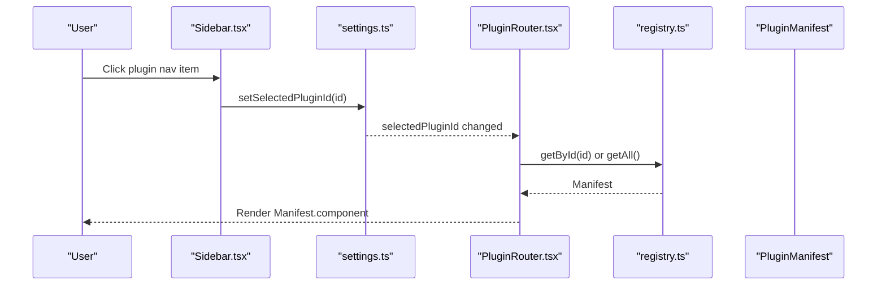
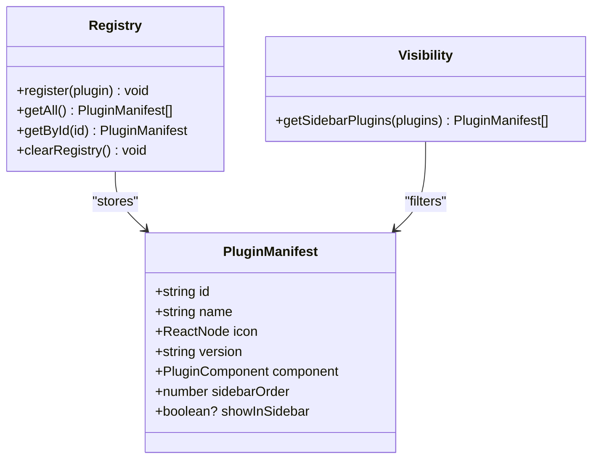
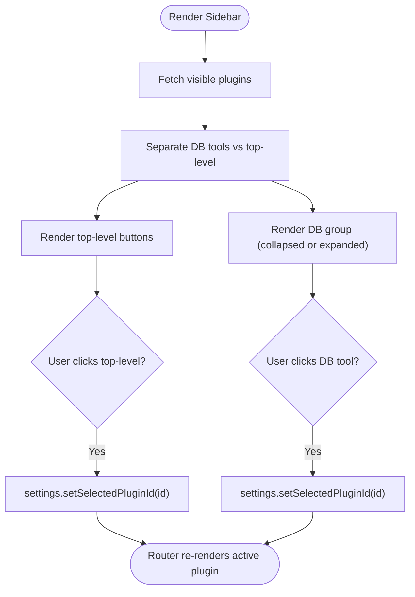
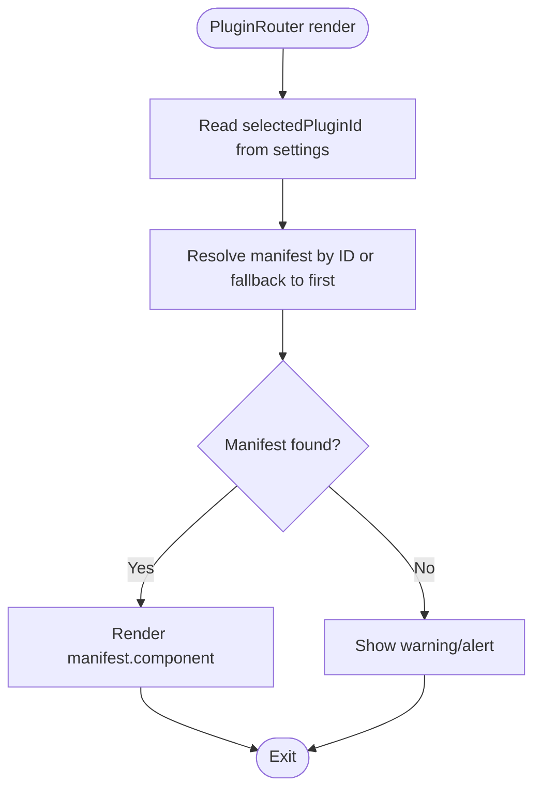
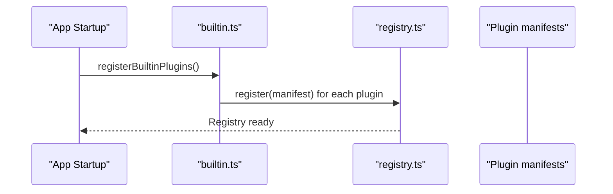
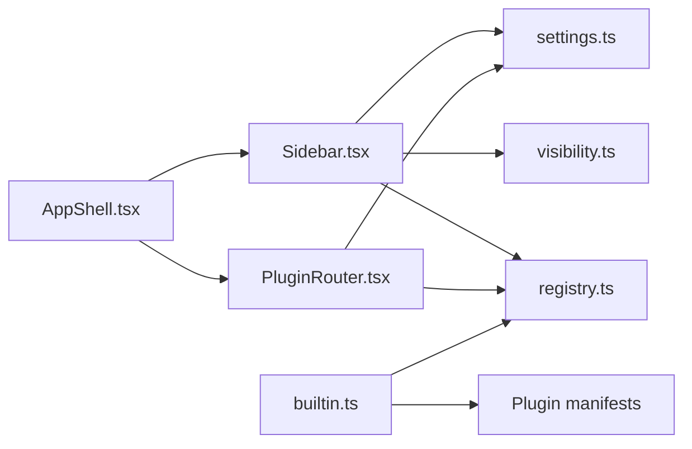

# Plugin Routing & Navigation

<cite>
**Referenced Files in This Document**
- [PluginRouter.tsx](file://src/app/plugin-registry/PluginRouter.tsx)
- [registry.ts](file://src/app/plugin-registry/registry.ts)
- [types.ts](file://src/app/plugin-registry/types.ts)
- [visibility.ts](file://src/app/plugin-registry/visibility.ts)
- [builtin.ts](file://src/app/plugin-registry/builtin.ts)
- [Sidebar.tsx](file://src/app/layout/Sidebar.tsx)
- [AppShell.tsx](file://src/app/layout/AppShell.tsx)
- [settings.ts](file://src/app/store/settings.ts)
- [api-debugger index.tsx](file://src/plugins/api-debugger/index.tsx)
- [confluence index.tsx](file://src/plugins/confluence/index.tsx)
- [mongodb-client index.tsx](file://src/plugins/mongodb-client/index.tsx)
</cite>

## Table of Contents
1. [Introduction](#introduction)
2. [Project Structure](#project-structure)
3. [Core Components](#core-components)
4. [Architecture Overview](#architecture-overview)
5. [Detailed Component Analysis](#detailed-component-analysis)
6. [Dependency Analysis](#dependency-analysis)
7. [Performance Considerations](#performance-considerations)
8. [Troubleshooting Guide](#troubleshooting-guide)
9. [Conclusion](#conclusion)

## Introduction
This document explains the plugin routing and navigation system. It covers how plugins are registered, how selection drives navigation, how the sidebar integrates plugin navigation, and how visibility and ordering are controlled. It also documents the state model used for navigation, outlines patterns for extending the shell’s navigation, and discusses responsive behavior and mobile-friendly interactions.

## Project Structure
The plugin routing system centers around a small registry of manifests, a router that selects the active plugin component, and a sidebar that renders navigation items. The application shell composes these pieces into a cohesive layout.

```mermaid
graph TB
subgraph "Shell"
AppShell["AppShell.tsx"]
Sidebar["Sidebar.tsx"]
PluginRouter["PluginRouter.tsx"]
end
subgraph "Registry"
Registry["registry.ts"]
Types["types.ts"]
Visibility["visibility.ts"]
Builtin["builtin.ts"]
end
subgraph "Plugins"
P1["api-debugger/index.tsx"]
P2["confluence/index.tsx"]
P3["mongodb-client/index.tsx"]
end
AppShell --> Sidebar
AppShell --> PluginRouter
Sidebar --> Registry
PluginRouter --> Registry
Registry --> Types
Visibility --> Registry
Builtin --> Registry
Builtin --> P1
Builtin --> P2
Builtin --> P3
```

**Diagram sources**
- [AppShell.tsx](file://src/app/layout/AppShell.tsx)
- [Sidebar.tsx](file://src/app/layout/Sidebar.tsx)
- [PluginRouter.tsx](file://src/app/plugin-registry/PluginRouter.tsx)
- [registry.ts](file://src/app/plugin-registry/registry.ts)
- [types.ts](file://src/app/plugin-registry/types.ts)
- [visibility.ts](file://src/app/plugin-registry/visibility.ts)
- [builtin.ts](file://src/app/plugin-registry/builtin.ts)
- [api-debugger index.tsx](file://src/plugins/api-debugger/index.tsx)
- [confluence index.tsx](file://src/plugins/confluence/index.tsx)
- [mongodb-client index.tsx](file://src/plugins/mongodb-client/index.tsx)

**Section sources**
- [AppShell.tsx](file://src/app/layout/AppShell.tsx)
- [Sidebar.tsx](file://src/app/layout/Sidebar.tsx)
- [PluginRouter.tsx](file://src/app/plugin-registry/PluginRouter.tsx)
- [registry.ts](file://src/app/plugin-registry/registry.ts)
- [types.ts](file://src/app/plugin-registry/types.ts)
- [visibility.ts](file://src/app/plugin-registry/visibility.ts)
- [builtin.ts](file://src/app/plugin-registry/builtin.ts)

## Core Components
- PluginManifest defines the shape of a plugin: id, name, icon, version, component, sidebarOrder, and optional visibility flag.
- Registry stores manifests in a map and exposes getters and sorting by sidebarOrder.
- Visibility filter determines which plugins appear in the sidebar.
- Sidebar renders grouped navigation items and toggles for database tools, updating the selected plugin via settings.
- PluginRouter reads the selected plugin from settings and renders the corresponding component.
- Settings store persists and updates navigation state (selected plugin, collapsed states).
- Built-in plugin registration wires core plugins into the registry.

**Section sources**
- [types.ts](file://src/app/plugin-registry/types.ts)
- [registry.ts](file://src/app/plugin-registry/registry.ts)
- [visibility.ts](file://src/app/plugin-registry/visibility.ts)
- [Sidebar.tsx](file://src/app/layout/Sidebar.tsx)
- [PluginRouter.tsx](file://src/app/plugin-registry/PluginRouter.tsx)
- [settings.ts](file://src/app/store/settings.ts)
- [builtin.ts](file://src/app/plugin-registry/builtin.ts)

## Architecture Overview
The navigation lifecycle:
- Plugins register manifests with the registry during initialization.
- Sidebar queries the registry, filters visible plugins, and renders navigation items.
- Clicking a navigation item updates the selected plugin ID in settings.
- PluginRouter observes the selected plugin ID and renders the associated component.



**Diagram sources**
- [Sidebar.tsx](file://src/app/layout/Sidebar.tsx)
- [settings.ts](file://src/app/store/settings.ts)
- [PluginRouter.tsx](file://src/app/plugin-registry/PluginRouter.tsx)
- [registry.ts](file://src/app/plugin-registry/registry.ts)
- [types.ts](file://src/app/plugin-registry/types.ts)

## Detailed Component Analysis

### Plugin Manifest and Registry
- PluginManifest carries metadata and the component factory used by the router.
- Registry enforces uniqueness by ID, sorts by sidebarOrder, and provides lookup by ID.
- Visibility filter excludes plugins marked invisible.



**Diagram sources**
- [types.ts](file://src/app/plugin-registry/types.ts)
- [registry.ts](file://src/app/plugin-registry/registry.ts)
- [visibility.ts](file://src/app/plugin-registry/visibility.ts)

**Section sources**
- [types.ts](file://src/app/plugin-registry/types.ts)
- [registry.ts](file://src/app/plugin-registry/registry.ts)
- [visibility.ts](file://src/app/plugin-registry/visibility.ts)

### Sidebar Integration and Navigation Items
- Sidebar fetches visible plugins, groups database tools separately, and renders buttons for each plugin.
- Clicking a button sets the selected plugin ID in settings, driving the router.
- Collapsed mode uses tooltips and dropdowns for compact navigation.



**Diagram sources**
- [Sidebar.tsx](file://src/app/layout/Sidebar.tsx)
- [settings.ts](file://src/app/store/settings.ts)
- [visibility.ts](file://src/app/plugin-registry/visibility.ts)
- [registry.ts](file://src/app/plugin-registry/registry.ts)

**Section sources**
- [Sidebar.tsx](file://src/app/layout/Sidebar.tsx)
- [settings.ts](file://src/app/store/settings.ts)
- [visibility.ts](file://src/app/plugin-registry/visibility.ts)
- [registry.ts](file://src/app/plugin-registry/registry.ts)

### PluginRouter and Route Handling
- Reads selectedPluginId from settings.
- Resolves the active manifest by ID, falling back to the first available plugin if none is selected.
- Renders the manifest’s component.



**Diagram sources**
- [PluginRouter.tsx](file://src/app/plugin-registry/PluginRouter.tsx)
- [settings.ts](file://src/app/store/settings.ts)
- [registry.ts](file://src/app/plugin-registry/registry.ts)
- [types.ts](file://src/app/plugin-registry/types.ts)

**Section sources**
- [PluginRouter.tsx](file://src/app/plugin-registry/PluginRouter.tsx)
- [settings.ts](file://src/app/store/settings.ts)
- [registry.ts](file://src/app/plugin-registry/registry.ts)
- [types.ts](file://src/app/plugin-registry/types.ts)

### Built-in Plugin Registration
- Built-in plugins register their manifests at startup, ensuring the registry is populated before rendering.



**Diagram sources**
- [builtin.ts](file://src/app/plugin-registry/builtin.ts)
- [registry.ts](file://src/app/plugin-registry/registry.ts)
- [api-debugger index.tsx](file://src/plugins/api-debugger/index.tsx)
- [confluence index.tsx](file://src/plugins/confluence/index.tsx)
- [mongodb-client index.tsx](file://src/plugins/mongodb-client/index.tsx)

**Section sources**
- [builtin.ts](file://src/app/plugin-registry/builtin.ts)
- [registry.ts](file://src/app/plugin-registry/registry.ts)
- [api-debugger index.tsx](file://src/plugins/api-debugger/index.tsx)
- [confluence index.tsx](file://src/plugins/confluence/index.tsx)
- [mongodb-client index.tsx](file://src/plugins/mongodb-client/index.tsx)

### Visibility System
- showInSidebar defaults to true; setting it to false hides a plugin from the sidebar.
- The visibility filter is applied before rendering navigation items.

**Section sources**
- [types.ts](file://src/app/plugin-registry/types.ts)
- [visibility.ts](file://src/app/plugin-registry/visibility.ts)
- [Sidebar.tsx](file://src/app/layout/Sidebar.tsx)

### Navigation State Management
- selectedPluginId drives which plugin is rendered.
- sidebarCollapsed and dbToolsCollapsed control sidebar expansion states.
- Settings store persists these preferences across sessions.

**Section sources**
- [settings.ts](file://src/app/store/settings.ts)
- [Sidebar.tsx](file://src/app/layout/Sidebar.tsx)
- [AppShell.tsx](file://src/app/layout/AppShell.tsx)

### Routing Patterns, URL Management, and Deep Linking
- Current implementation uses a single navigation state (selectedPluginId) stored in settings. There is no URL synchronization or deep-linking integration in the analyzed files.
- To add URL management, consider deriving selectedPluginId from location state and synchronizing back to settings on change.

[No sources needed since this section provides general guidance]

### Extending Application Shell Navigation
- Add a new plugin manifest with a unique id, name, icon, version, component, and sidebarOrder.
- Export the manifest from the plugin’s entry and register it in the built-in registry initializer.
- Optionally set showInSidebar to false to hide from the sidebar while keeping the plugin selectable programmatically.

**Section sources**
- [types.ts](file://src/app/plugin-registry/types.ts)
- [builtin.ts](file://src/app/plugin-registry/builtin.ts)
- [api-debugger index.tsx](file://src/plugins/api-debugger/index.tsx)
- [confluence index.tsx](file://src/plugins/confluence/index.tsx)
- [mongodb-client index.tsx](file://src/plugins/mongodb-client/index.tsx)

### Responsive Design and Mobile Navigation
- Collapsible sidebar with tooltips for collapsed labels.
- DB tools grouped under a collapsible header to reduce clutter.
- Utility buttons for chat and theme toggling remain accessible in collapsed mode.

**Section sources**
- [Sidebar.tsx](file://src/app/layout/Sidebar.tsx)

## Dependency Analysis
- Sidebar depends on registry and visibility to render navigation items and on settings to track selection and collapse states.
- PluginRouter depends on settings and registry to resolve and render the active plugin.
- Built-in registration centralizes plugin availability and ordering.



**Diagram sources**
- [Sidebar.tsx](file://src/app/layout/Sidebar.tsx)
- [PluginRouter.tsx](file://src/app/plugin-registry/PluginRouter.tsx)
- [AppShell.tsx](file://src/app/layout/AppShell.tsx)
- [registry.ts](file://src/app/plugin-registry/registry.ts)
- [visibility.ts](file://src/app/plugin-registry/visibility.ts)
- [settings.ts](file://src/app/store/settings.ts)
- [builtin.ts](file://src/app/plugin-registry/builtin.ts)

**Section sources**
- [Sidebar.tsx](file://src/app/layout/Sidebar.tsx)
- [PluginRouter.tsx](file://src/app/plugin-registry/PluginRouter.tsx)
- [AppShell.tsx](file://src/app/layout/AppShell.tsx)
- [registry.ts](file://src/app/plugin-registry/registry.ts)
- [visibility.ts](file://src/app/plugin-registry/visibility.ts)
- [settings.ts](file://src/app/store/settings.ts)
- [builtin.ts](file://src/app/plugin-registry/builtin.ts)

## Performance Considerations
- Rendering the active plugin component is lightweight; the primary cost is in plugin-specific UI and stores.
- Sorting plugins by sidebarOrder occurs once per registry retrieval; keep the number of plugins reasonable.
- Avoid unnecessary re-renders by relying on stable references for plugin components and memoized selectors.

[No sources needed since this section provides general guidance]

## Troubleshooting Guide
- No plugin registered: The router displays a warning when no manifest is available. Ensure built-in plugins are registered.
- Selected plugin not visible: Verify showInSidebar is not false and that sidebarOrder is set appropriately.
- Navigation not changing: Confirm that clicking a sidebar item updates selectedPluginId in settings.

**Section sources**
- [PluginRouter.tsx](file://src/app/plugin-registry/PluginRouter.tsx)
- [Sidebar.tsx](file://src/app/layout/Sidebar.tsx)
- [settings.ts](file://src/app/store/settings.ts)
- [builtin.ts](file://src/app/plugin-registry/builtin.ts)

## Conclusion
The plugin routing and navigation system is intentionally minimal and state-driven. A registry of manifests, a visibility filter, and a settings-backed selection model combine with a sidebar renderer and a router to deliver a flexible, extensible navigation experience. Extending the system involves adding new manifests and optionally integrating URL synchronization for deep-linking.