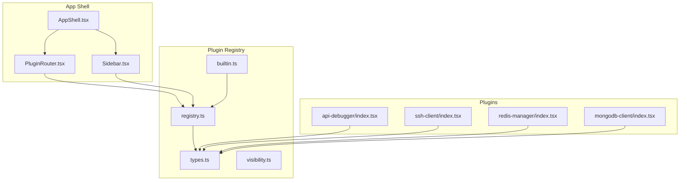
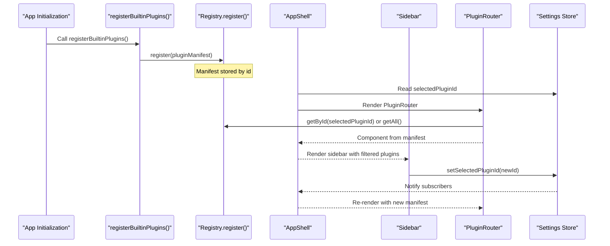
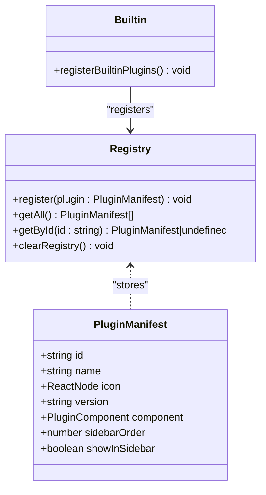
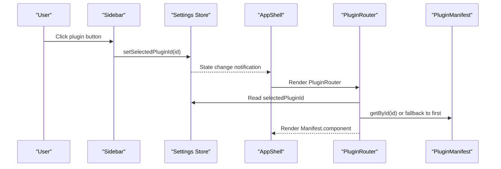
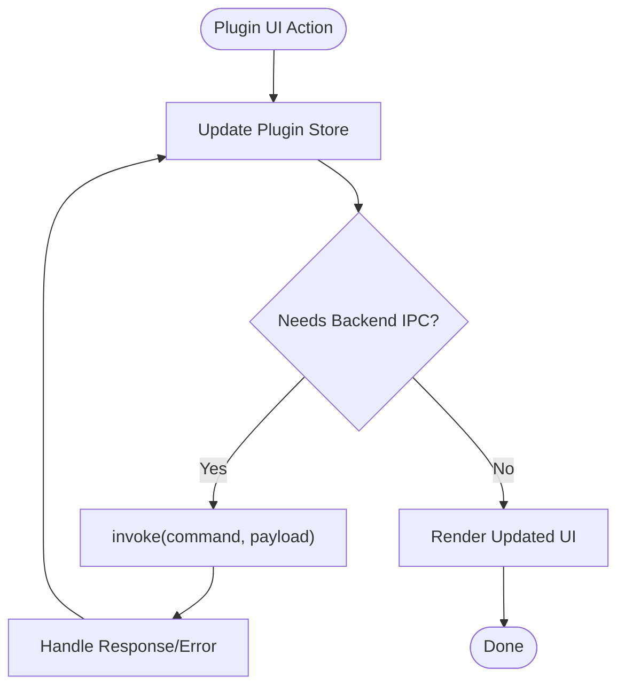
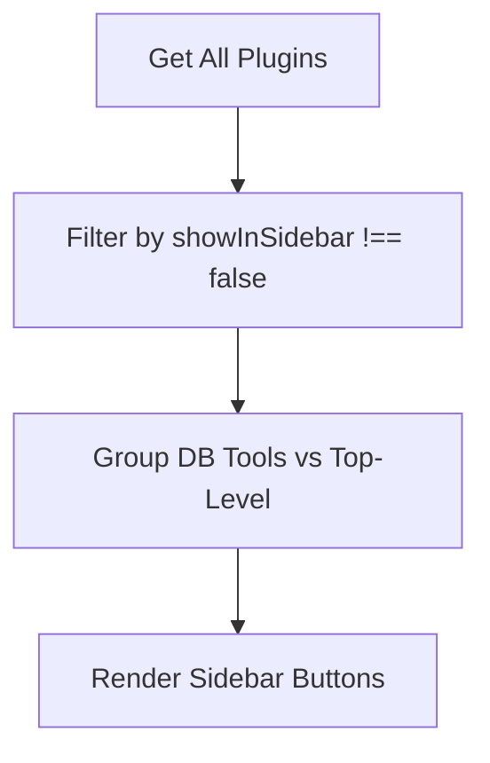
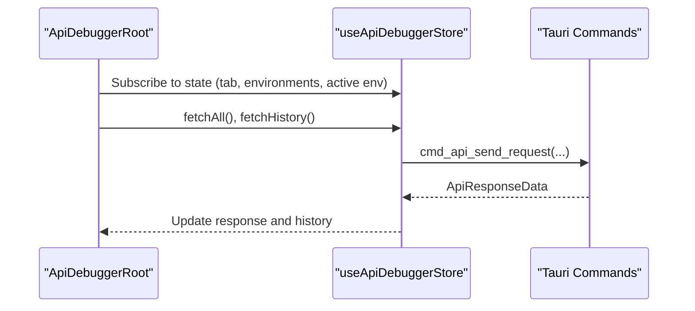
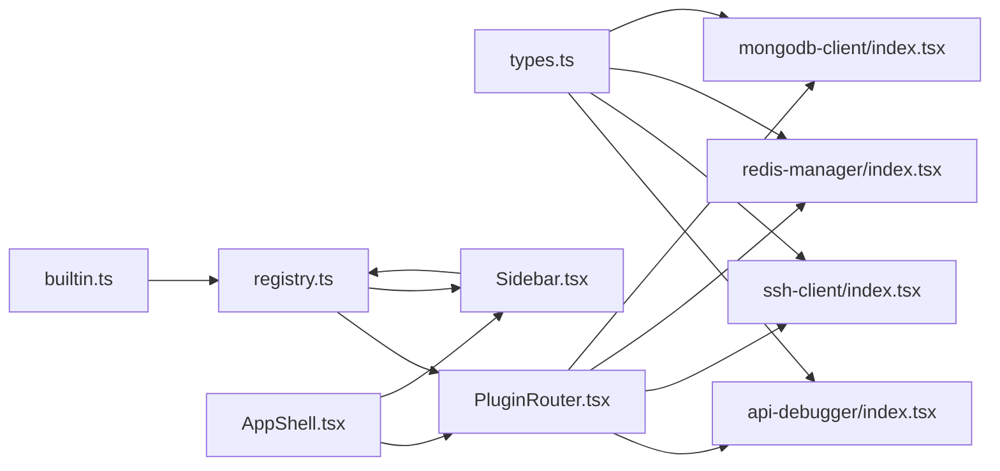

# Plugin System

<cite>
**Referenced Files in This Document**
- [registry.ts](file://src/app/plugin-registry/registry.ts)
- [types.ts](file://src/app/plugin-registry/types.ts)
- [builtin.ts](file://src/app/plugin-registry/builtin.ts)
- [visibility.ts](file://src/app/plugin-registry/visibility.ts)
- [PluginRouter.tsx](file://src/app/plugin-registry/PluginRouter.tsx)
- [AppShell.tsx](file://src/app/layout/AppShell.tsx)
- [Sidebar.tsx](file://src/app/layout/Sidebar.tsx)
- [settings.ts](file://src/app/store/settings.ts)
- [api-debugger/index.tsx](file://src/plugins/api-debugger/index.tsx)
- [api-debugger/types.ts](file://src/plugins/api-debugger/types.ts)
- [api-debugger/store/api-debugger.ts](file://src/plugins/api-debugger/store/api-debugger.ts)
- [ssh-client/index.tsx](file://src/plugins/ssh-client/index.tsx)
- [ssh-client/store/workspace.ts](file://src/plugins/ssh-client/store/workspace.ts)
- [redis-manager/index.tsx](file://src/plugins/redis-manager/index.tsx)
- [mongodb-client/index.tsx](file://src/plugins/mongodb-client/index.tsx)
</cite>

## Table of Contents
1. [Introduction](#introduction)
2. [Project Structure](#project-structure)
3. [Core Components](#core-components)
4. [Architecture Overview](#architecture-overview)
5. [Detailed Component Analysis](#detailed-component-analysis)
6. [Dependency Analysis](#dependency-analysis)
7. [Performance Considerations](#performance-considerations)
8. [Troubleshooting Guide](#troubleshooting-guide)
9. [Conclusion](#conclusion)
10. [Appendices](#appendices)

## Introduction
This document explains the DevNexus plugin system architecture. It covers how plugins register themselves, how the application shell integrates them, how routing works, and how plugin state is isolated and managed. It also documents the plugin visibility system, configuration options exposed via the settings store, and extension points. Finally, it provides practical examples, best practices, testing strategies, and deployment considerations for building robust plugins.

## Project Structure
The plugin system is centered around a small registry and router layer in the application shell, with each plugin exporting a manifest and a root component. Plugins encapsulate their own UI, stores, and domain-specific logic.

**Diagram sources**
- [AppShell.tsx:1-207](file://src/app/layout/AppShell.tsx#L1-L207)
- [Sidebar.tsx:1-177](file://src/app/layout/Sidebar.tsx#L1-L177)
- [PluginRouter.tsx:1-29](file://src/app/plugin-registry/PluginRouter.tsx#L1-L29)
- [registry.ts:1-26](file://src/app/plugin-registry/registry.ts#L1-L26)
- [types.ts:1-14](file://src/app/plugin-registry/types.ts#L1-L14)
- [visibility.ts:1-6](file://src/app/plugin-registry/visibility.ts#L1-L6)
- [builtin.ts:1-31](file://src/app/plugin-registry/builtin.ts#L1-L31)
- [api-debugger/index.tsx:1-39](file://src/plugins/api-debugger/index.tsx#L1-L39)
- [ssh-client/index.tsx:1-66](file://src/plugins/ssh-client/index.tsx#L1-L66)
- [redis-manager/index.tsx:1-67](file://src/plugins/redis-manager/index.tsx#L1-L67)
- [mongodb-client/index.tsx:1-87](file://src/plugins/mongodb-client/index.tsx#L1-L87)

**Section sources**
- [registry.ts:1-26](file://src/app/plugin-registry/registry.ts#L1-L26)
- [types.ts:1-14](file://src/app/plugin-registry/types.ts#L1-L14)
- [builtin.ts:1-31](file://src/app/plugin-registry/builtin.ts#L1-L31)
- [visibility.ts:1-6](file://src/app/plugin-registry/visibility.ts#L1-L6)
- [PluginRouter.tsx:1-29](file://src/app/plugin-registry/PluginRouter.tsx#L1-L29)
- [AppShell.tsx:1-207](file://src/app/layout/AppShell.tsx#L1-L207)
- [Sidebar.tsx:1-177](file://src/app/layout/Sidebar.tsx#L1-L177)
- [settings.ts:1-28](file://src/app/store/settings.ts#L1-L28)

## Core Components
- PluginManifest defines the contract for plugin registration: id, name, icon, version, component, sidebar order, and optional sidebar visibility flag.
- Registry provides a simple in-memory map keyed by plugin id, with helpers to register, enumerate, and resolve manifests.
- Built-in plugin registration centralizes initial plugin registration to avoid duplication and ensure deterministic ordering.
- Visibility filters plugins intended for the sidebar.
- PluginRouter selects the active plugin component based on the current selection persisted in settings.
- Sidebar renders the plugin navigation and updates the selected plugin id in the settings store.
- Settings store persists the selected plugin id and other UI preferences.

**Section sources**
- [types.ts:5-13](file://src/app/plugin-registry/types.ts#L5-L13)
- [registry.ts:3-25](file://src/app/plugin-registry/registry.ts#L3-L25)
- [builtin.ts:14-29](file://src/app/plugin-registry/builtin.ts#L14-L29)
- [visibility.ts:3-5](file://src/app/plugin-registry/visibility.ts#L3-L5)
- [PluginRouter.tsx:7-28](file://src/app/plugin-registry/PluginRouter.tsx#L7-L28)
- [Sidebar.tsx:21-42](file://src/app/layout/Sidebar.tsx#L21-L42)
- [settings.ts:9-21](file://src/app/store/settings.ts#L9-L21)

## Architecture Overview
The plugin system follows a manifest-driven, isolated architecture:
- Registration: Each plugin exports a PluginManifest and registers itself during app initialization.
- Routing: The application shell reads the selected plugin id from settings and renders the corresponding plugin component.
- Isolation: Each plugin maintains its own state stores and domain logic, minimizing cross-plugin coupling.
- Visibility: Sidebar rendering is controlled by a visibility filter and grouped categories.

**Diagram sources**
- [builtin.ts:14-29](file://src/app/plugin-registry/builtin.ts#L14-L29)
- [registry.ts:5-11](file://src/app/plugin-registry/registry.ts#L5-L11)
- [AppShell.tsx:32-56](file://src/app/layout/AppShell.tsx#L32-L56)
- [Sidebar.tsx:34-37](file://src/app/layout/Sidebar.tsx#L34-L37)
- [PluginRouter.tsx:7-13](file://src/app/plugin-registry/PluginRouter.tsx#L7-L13)
- [settings.ts:9-21](file://src/app/store/settings.ts#L9-L21)

## Detailed Component Analysis

### Plugin Manifest and Registration
- PluginManifest specifies the plugin identity, metadata, UI entry point, and presentation hints (sidebar order and visibility).
- The registry enforces uniqueness by id and exposes getters for enumeration and lookup.
- Built-in plugins are registered once to avoid re-registration and to control load order.

**Diagram sources**
- [types.ts:5-13](file://src/app/plugin-registry/types.ts#L5-L13)
- [registry.ts:3-25](file://src/app/plugin-registry/registry.ts#L3-L25)
- [builtin.ts:14-29](file://src/app/plugin-registry/builtin.ts#L14-L29)

**Section sources**
- [types.ts:5-13](file://src/app/plugin-registry/types.ts#L5-L13)
- [registry.ts:3-25](file://src/app/plugin-registry/registry.ts#L3-L25)
- [builtin.ts:14-29](file://src/app/plugin-registry/builtin.ts#L14-L29)

### Plugin Router and Application Shell Integration
- PluginRouter reads the selected plugin id from settings and resolves the manifest to render the plugin’s root component.
- AppShell composes the UI: title bar, sidebar, content area, footer, and integrates LAN chat and developer console.
- Sidebar renders plugin buttons and groups database tools separately, updating the selected plugin id in settings.

**Diagram sources**
- [Sidebar.tsx:34-37](file://src/app/layout/Sidebar.tsx#L34-L37)
- [settings.ts:9-21](file://src/app/store/settings.ts#L9-L21)
- [AppShell.tsx:32-56](file://src/app/layout/AppShell.tsx#L32-L56)
- [PluginRouter.tsx:7-13](file://src/app/plugin-registry/PluginRouter.tsx#L7-L13)

**Section sources**
- [PluginRouter.tsx:7-28](file://src/app/plugin-registry/PluginRouter.tsx#L7-L28)
- [AppShell.tsx:31-56](file://src/app/layout/AppShell.tsx#L31-L56)
- [Sidebar.tsx:21-42](file://src/app/layout/Sidebar.tsx#L21-L42)
- [settings.ts:9-21](file://src/app/store/settings.ts#L9-L21)

### Plugin Isolation and State Management
- Each plugin encapsulates its own Zustand store(s) and domain types. For example:
  - API Debugger: a comprehensive store with actions to send requests, manage collections/environments, and maintain history.
  - SSH Client: a focused workspace store controlling tabs and active connection.
- Plugins communicate with the backend via Tauri invocations through typed commands, keeping UI logic separate from IPC.

**Diagram sources**
- [api-debugger/store/api-debugger.ts:62-81](file://src/plugins/api-debugger/store/api-debugger.ts#L62-L81)
- [api-debugger/store/api-debugger.ts:90-98](file://src/plugins/api-debugger/store/api-debugger.ts#L90-L98)
- [ssh-client/store/workspace.ts:16-21](file://src/plugins/ssh-client/store/workspace.ts#L16-L21)

**Section sources**
- [api-debugger/store/api-debugger.ts:47-128](file://src/plugins/api-debugger/store/api-debugger.ts#L47-L128)
- [ssh-client/store/workspace.ts:9-21](file://src/plugins/ssh-client/store/workspace.ts#L9-L21)

### Plugin Visibility System
- Visibility is controlled by the showInSidebar property in the manifest and filtered by getSidebarPlugins.
- Sidebar groups database tools separately and collapses them under a single header for compactness.

**Diagram sources**
- [visibility.ts:3-5](file://src/app/plugin-registry/visibility.ts#L3-L5)
- [Sidebar.tsx:22-25](file://src/app/layout/Sidebar.tsx#L22-L25)

**Section sources**
- [visibility.ts:3-5](file://src/app/plugin-registry/visibility.ts#L3-L5)
- [Sidebar.tsx:21-42](file://src/app/layout/Sidebar.tsx#L21-L42)

### Example: API Debugger Plugin
- Exports a PluginManifest with id, name, icon, version, sidebarOrder, and component.
- The root component orchestrates tabs and delegates to views.
- Uses a dedicated store for request composition, environment management, history, and IPC-backed actions.

**Diagram sources**
- [api-debugger/index.tsx:13-38](file://src/plugins/api-debugger/index.tsx#L13-L38)
- [api-debugger/store/api-debugger.ts:62-72](file://src/plugins/api-debugger/store/api-debugger.ts#L62-L72)
- [api-debugger/types.ts:27-41](file://src/plugins/api-debugger/types.ts#L27-L41)

**Section sources**
- [api-debugger/index.tsx:38-39](file://src/plugins/api-debugger/index.tsx#L38-L39)
- [api-debugger/store/api-debugger.ts:47-128](file://src/plugins/api-debugger/store/api-debugger.ts#L47-L128)
- [api-debugger/types.ts:1-105](file://src/plugins/api-debugger/types.ts#L1-L105)

### Example: SSH Client Plugin
- Exports a PluginManifest and a root component with segmented tabs for connections, terminal, keys, and tunnels.
- Uses a lightweight workspace store to manage active view and connection id.

**Section sources**
- [ssh-client/index.tsx:58-66](file://src/plugins/ssh-client/index.tsx#L58-L66)
- [ssh-client/store/workspace.ts:9-21](file://src/plugins/ssh-client/store/workspace.ts#L9-L21)

### Example: Redis Manager Plugin
- Demonstrates conditional navigation and tab-to-view mapping with a workspace store.

**Section sources**
- [redis-manager/index.tsx:59-67](file://src/plugins/redis-manager/index.tsx#L59-L67)

### Example: MongoDB Client Plugin
- Multi-tab workspace with active connection and database/collection context.

**Section sources**
- [mongodb-client/index.tsx:79-87](file://src/plugins/mongodb-client/index.tsx#L79-L87)

## Dependency Analysis
- Coupling: Plugins depend on the registry types and React for UI. They are decoupled from each other except through shared stores and IPC.
- Cohesion: Each plugin encapsulates its UI, state, and domain logic.
- External dependencies: Tauri IPC for backend operations; Ant Design for UI primitives; Zustand for state management.

**Diagram sources**
- [types.ts:1-14](file://src/app/plugin-registry/types.ts#L1-L14)
- [registry.ts:1-26](file://src/app/plugin-registry/registry.ts#L1-L26)
- [builtin.ts:1-31](file://src/app/plugin-registry/builtin.ts#L1-L31)
- [PluginRouter.tsx:1-29](file://src/app/plugin-registry/PluginRouter.tsx#L1-L29)
- [Sidebar.tsx:1-177](file://src/app/layout/Sidebar.tsx#L1-L177)
- [AppShell.tsx:1-207](file://src/app/layout/AppShell.tsx#L1-L207)
- [api-debugger/index.tsx:1-39](file://src/plugins/api-debugger/index.tsx#L1-L39)
- [ssh-client/index.tsx:1-66](file://src/plugins/ssh-client/index.tsx#L1-L66)
- [redis-manager/index.tsx:1-67](file://src/plugins/redis-manager/index.tsx#L1-L67)
- [mongodb-client/index.tsx:1-87](file://src/plugins/mongodb-client/index.tsx#L1-L87)

**Section sources**
- [registry.ts:1-26](file://src/app/plugin-registry/registry.ts#L1-L26)
- [types.ts:1-14](file://src/app/plugin-registry/types.ts#L1-L14)
- [builtin.ts:1-31](file://src/app/plugin-registry/builtin.ts#L1-L31)
- [PluginRouter.tsx:1-29](file://src/app/plugin-registry/PluginRouter.tsx#L1-L29)
- [Sidebar.tsx:1-177](file://src/app/layout/Sidebar.tsx#L1-L177)
- [AppShell.tsx:1-207](file://src/app/layout/AppShell.tsx#L1-L207)

## Performance Considerations
- Rendering cost: Keep plugin root components pure and memoized where appropriate to minimize re-renders.
- Store granularity: Split plugin stores into focused slices to reduce unnecessary re-renders across the app.
- IPC batching: For plugins performing frequent IPC calls (e.g., history refresh), debounce or batch updates to avoid thrashing.
- Lazy loading: Consider lazy-loading plugin bundles if startup time becomes a concern, though current architecture loads built-ins eagerly.

## Troubleshooting Guide
- No plugin rendered: Verify at least one plugin is registered and that selectedPluginId is set in settings.
- Sidebar shows no plugins: Confirm showInSidebar is not false and that visibility filtering is applied.
- Navigation not working: Ensure setSelectedPluginId is invoked from Sidebar and that the settings store persists the change.

**Section sources**
- [PluginRouter.tsx:15-24](file://src/app/plugin-registry/PluginRouter.tsx#L15-L24)
- [Sidebar.tsx:34-37](file://src/app/layout/Sidebar.tsx#L34-L37)
- [settings.ts:9-21](file://src/app/store/settings.ts#L9-L21)

## Conclusion
DevNexus employs a clean, manifest-driven plugin architecture with strong isolation per plugin, a simple registry and router, and a configurable sidebar. Plugins integrate seamlessly through a shared store and IPC layer while maintaining autonomy. This design supports extensibility, testability, and predictable performance.

## Appendices

### Plugin Development Checklist
- Export a PluginManifest with a unique id, human-readable name, icon, version, sidebarOrder, and component.
- Provide a root component that orchestrates tabs/views and subscribes to its own store(s).
- Encapsulate domain types and store logic within the plugin namespace.
- Use Tauri invoke for backend interactions and keep IPC calls typed.
- Respect visibility settings and order by sidebarOrder.
- Persist minimal state in the settings store (e.g., selectedPluginId) and avoid global side effects.

### Testing Strategies
- Unit tests for plugin stores: mock invoke calls and assert state transitions.
- Snapshot tests for plugin UI to detect regressions in layout.
- Integration tests: simulate user clicks in Sidebar and verify PluginRouter renders the correct component.
- End-to-end tests: verify IPC commands are invoked with correct payloads and responses update the UI.

### Deployment Considerations
- Keep plugin ids stable across versions to preserve user selections.
- Version manifests help users track compatibility.
- Ensure sidebarOrder remains reasonable to maintain a coherent UX.
- Validate that showInSidebar defaults to visible unless intentionally hidden.