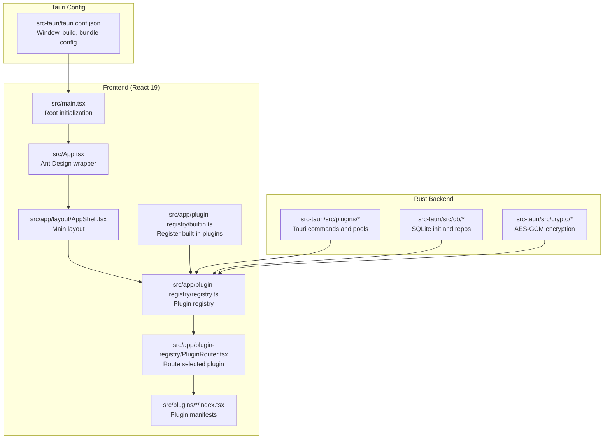
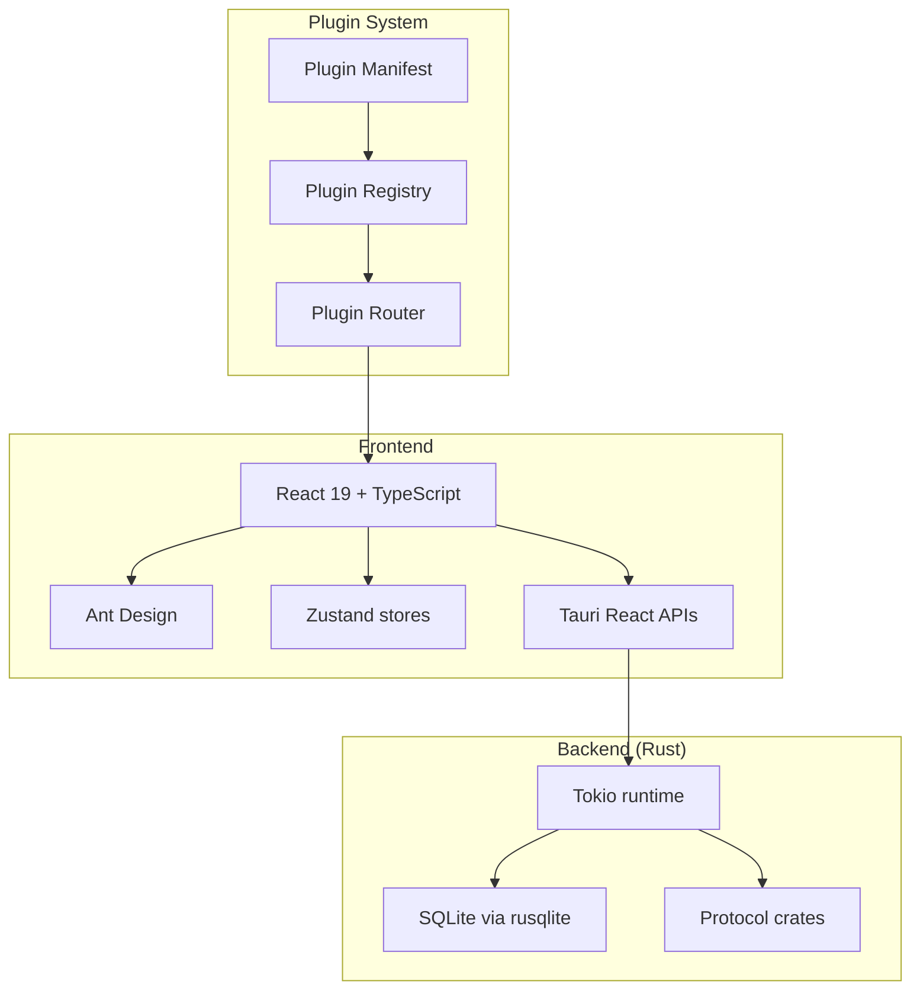
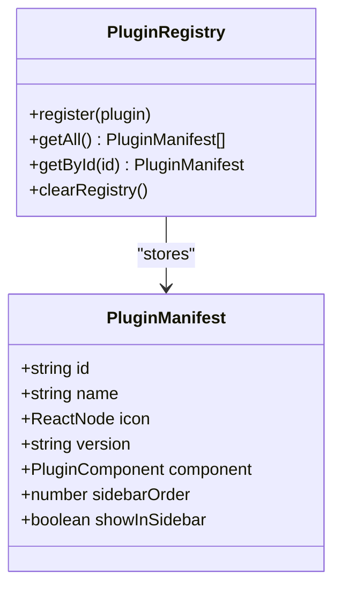
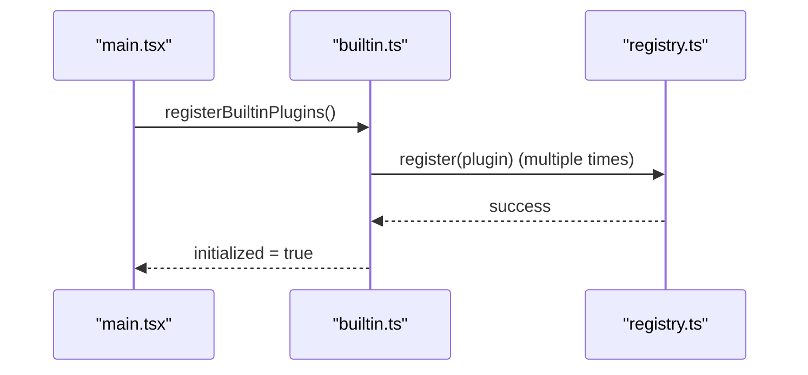
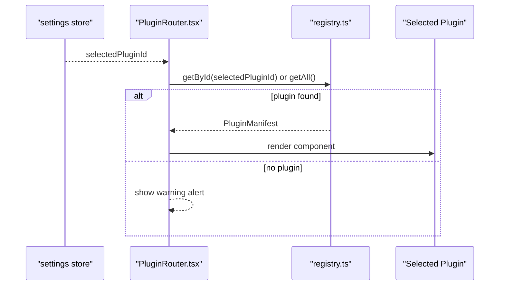
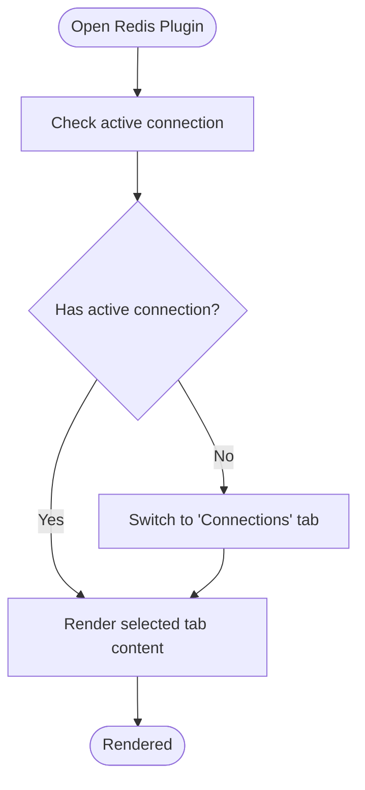
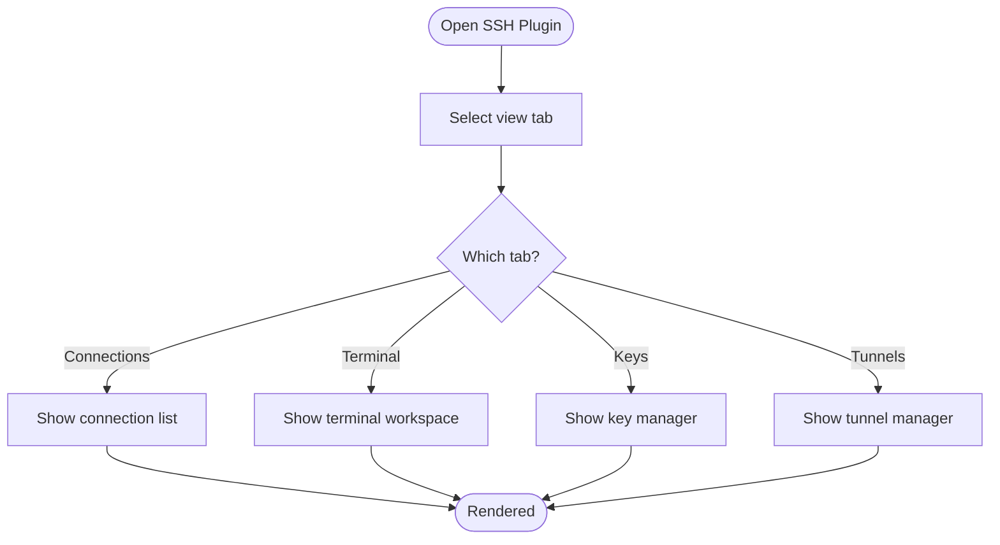
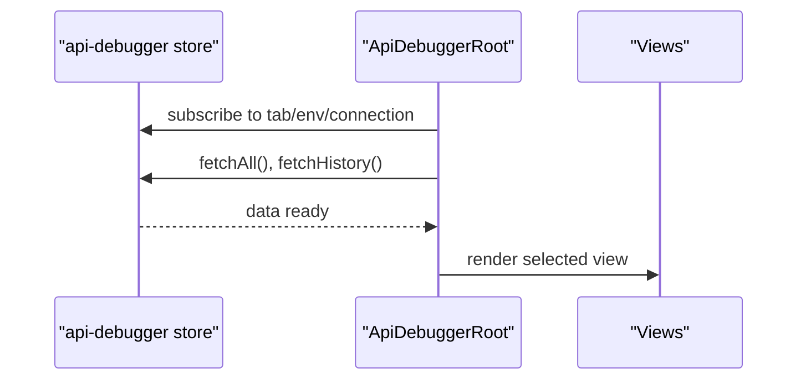
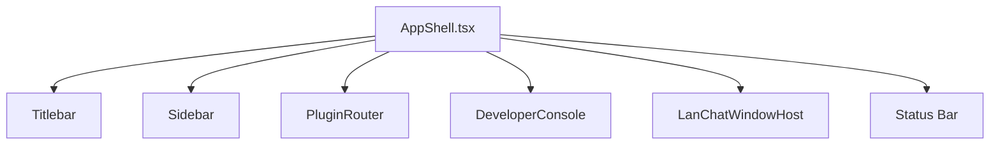
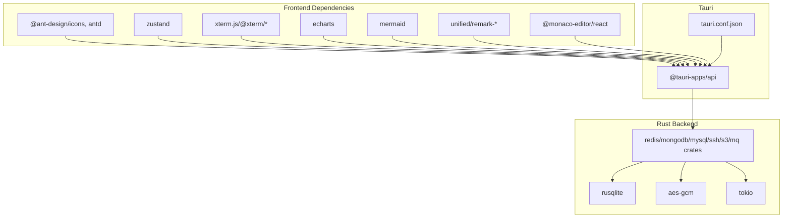

# Project Overview

<cite>
**Referenced Files in This Document**
- [README.md](file://README.md)
- [package.json](file://package.json)
- [tauri.conf.json](file://src-tauri/tauri.conf.json)
- [App.tsx](file://src/App.tsx)
- [main.tsx](file://src/main.tsx)
- [AppShell.tsx](file://src/app/layout/AppShell.tsx)
- [registry.ts](file://src/app/plugin-registry/registry.ts)
- [types.ts](file://src/app/plugin-registry/types.ts)
- [builtin.ts](file://src/app/plugin-registry/builtin.ts)
- [visibility.ts](file://src/app/plugin-registry/visibility.ts)
- [PluginRouter.tsx](file://src/app/plugin-registry/PluginRouter.tsx)
- [redis-manager/index.tsx](file://src/plugins/redis-manager/index.tsx)
- [ssh-client/index.tsx](file://src/plugins/ssh-client/index.tsx)
- [api-debugger/index.tsx](file://src/plugins/api-debugger/index.tsx)
- [PLAN.md](file://PLAN.md)
</cite>

## Table of Contents
1. [Introduction](#introduction)
2. [Project Structure](#project-structure)
3. [Core Components](#core-components)
4. [Architecture Overview](#architecture-overview)
5. [Detailed Component Analysis](#detailed-component-analysis)
6. [Dependency Analysis](#dependency-analysis)
7. [Performance Considerations](#performance-considerations)
8. [Troubleshooting Guide](#troubleshooting-guide)
9. [Conclusion](#conclusion)

## Introduction
DevNexus is a plugin-based desktop toolbox built with Tauri 2 + React 19 + TypeScript + Rust. Its purpose is to consolidate development and operational tools into a single lightweight desktop application. By centralizing connection-oriented tools—such as Redis, SSH, S3, MongoDB, MySQL, Network diagnostics, API debugging, MQ clients, Confluence publishing, and LAN chat—into one cohesive environment, DevNexus reduces context switching and improves workflow efficiency for developers, DevOps engineers, and system administrators who frequently manage infrastructure, databases, and distributed systems.

The core value proposition lies in:
- Consolidation: One desktop app for multiple operational tasks
- Local-first security: Connection configurations stored locally with encryption
- Lightweight footprint: Tauri 2 delivers a small native shell while Rust powers protocol-heavy operations
- Cross-platform distribution: Native installers for Windows, macOS, and Linux
- Operational safety: Built-in safeguards like pagination, virtualization, and dangerous-command confirmations

Target audience:
- Developers building and iterating against databases and APIs
- DevOps engineers managing infrastructure, monitoring, and incident response
- System administrators performing routine maintenance and diagnostics

Key features (as implemented):
- Redis Manager: connection management, DB switching, key tree browsing, key editing, console, server info, import/export
- SSH Client: connection management, multi-tab terminal, key management, quick commands, port forwarding
- S3 Browser: connection management, bucket browsing, object browsing, upload/download, preview, pre-signed URLs, bucket settings
- MongoDB Client: connection management, database/collection browsing, document CRUD, queries/aggregations, indexes, import/export, server status
- MySQL Client: connection management, database/table browsing, table-data CRUD, SQL workspace, indexes, import/export, server status
- Network Tools: ping, TCP port checks, DNS lookup, traceroute, diagnostic history and rerun
- API Debugger: HTTP request builder/sender, collections/environments, response inspection, history rerun, cURL import, redacted export
- MQ Client: RabbitMQ/Kafka connection management, resource browsing, publish/produce, safe consume preview, templates, history rerun, and redaction
- Confluence Publisher: connection management, Monaco Markdown editor, live Storage Format preview, Space/Page selector, one-click publish/update, LaTeX/Mermaid/local-image attachment upload, file-to-page mapping
- LAN Chat: bottom-left chat launcher, floating chat window, LAN room/direct chat, online presence, group member list, inline image/audio previews, file-send progress, local history and transfer records

Product highlights:
- Plugin-first design: each tool keeps its UI, state, backend commands, and connection pool isolated
- Local-first storage: connection profiles stored in local SQLite; sensitive fields encrypted with AES-GCM
- Lightweight desktop shell: Tauri provides a small native shell while Rust handles protocol and system-facing work
- Cross-platform packaging: GitHub Actions build Windows, macOS, and Linux packages
- Operational safety: pagination, virtualized browsing, dangerous-command confirmations, and scroll-safe dashboards are built into the UX

Technology stack summary:
- Desktop: Tauri 2
- Frontend: React 19, TypeScript, Vite
- UI: Ant Design, @ant-design/icons
- State: Zustand
- Charts: ECharts
- Terminal: xterm.js / @xterm/*
- Backend: Rust, Tokio
- Local DB: SQLite via rusqlite
- Protocol crates: redis, russh/russh-keys, aws-sdk-s3, mongodb, mysql_async, lapin/rdkafka, reqwest
- Confluence: unified/remark-parse/remark-gfm + @monaco-editor/react + reqwest (Rust)

Architectural philosophy:
- Plugin-first: each tool is a self-contained module with its own manifest, views, stores, and backend commands
- Local-first: sensitive data stays on the user’s machine; encryption and secure defaults are enforced
- Lightweight desktop: leverage Tauri for native UX and Rust for heavy lifting
- Operational safety: prioritize stability and safety in high-throughput operations (large datasets, long-running sessions)

Positioning in the developer tool ecosystem:
- Complements IDEs and cloud consoles by offering a local, encrypted, and portable desktop companion
- Bridges the gap between browser-based admin panels and CLI-heavy workflows
- Provides a unified surface for connection management, diagnostics, and collaborative publishing

Goals and design principles:
- Reduce friction in daily workflows by minimizing tool switching
- Deliver robust, safe operations with built-in safeguards
- Maintain a small, fast, and cross-platform desktop footprint
- Enable extensibility through a clean plugin architecture

How it addresses common workflow challenges:
- Consolidates scattered tools (Redis GUI, SSH terminals, S3 browsers) into one place
- Improves security posture with local storage and encryption
- Enhances productivity with virtualized browsing, pagination, and safe defaults
- Supports collaboration via Confluence publishing and LAN chat

**Section sources**
- [README.md: 209-235:209-235](file://README.md#L209-L235)
- [README.md: 236-256:236-256](file://README.md#L236-L256)
- [README.md: 257-298:257-298](file://README.md#L257-L298)
- [package.json: 15-45:15-45](file://package.json#L15-L45)
- [tauri.conf.json: 1-39:1-39](file://src-tauri/tauri.conf.json#L1-L39)

## Project Structure
DevNexus follows a clear separation of concerns:
- Frontend (React 19 + TypeScript) under src/
- Tauri configuration and Rust backend under src-tauri/
- Plugin registry and routing under src/app/plugin-registry/
- Individual plugins under src/plugins/<plugin-name>/
- Global layout and shell under src/app/layout/

**Diagram sources**
- [main.tsx: 1-38:1-38](file://src/main.tsx#L1-L38)
- [App.tsx: 1-11:1-11](file://src/App.tsx#L1-L11)
- [AppShell.tsx: 1-207:1-207](file://src/app/layout/AppShell.tsx#L1-L207)
- [registry.ts: 1-26:1-26](file://src/app/plugin-registry/registry.ts#L1-L26)
- [PluginRouter.tsx: 1-29:1-29](file://src/app/plugin-registry/PluginRouter.tsx#L1-L29)
- [builtin.ts: 1-31:1-31](file://src/app/plugin-registry/builtin.ts#L1-L31)
- [tauri.conf.json: 1-39:1-39](file://src-tauri/tauri.conf.json#L1-L39)

**Section sources**
- [README.md: 58-99:58-99](file://README.md#L58-L99)
- [PLAN.md: 52-113:52-113](file://PLAN.md#L52-L113)

## Core Components
- Plugin Registry: centralized registration and retrieval of plugin manifests
- Plugin Router: renders the active plugin based on user selection
- Built-in Plugin Registration: registers all core plugins at startup
- App Shell: orchestrates layout, status bar, sidebar, and developer console
- Tauri Configuration: defines window behavior, build pipeline, and bundling

Key responsibilities:
- Plugin Registry: maintain a sorted list of plugins by sidebar order and expose getters by id
- Plugin Router: fallback handling when no plugin is registered
- Built-in Registration: ensures all core plugins are available on launch
- App Shell: manages resizing overlays, status items, LAN chat integration, and footer controls
- Tauri Config: coordinates frontend build with Tauri dev/build and sets window defaults

**Section sources**
- [registry.ts: 1-26:1-26](file://src/app/plugin-registry/registry.ts#L1-L26)
- [types.ts: 1-14:1-14](file://src/app/plugin-registry/types.ts#L1-L14)
- [builtin.ts: 14-31:14-31](file://src/app/plugin-registry/builtin.ts#L14-L31)
- [PluginRouter.tsx: 7-28:7-28](file://src/app/plugin-registry/PluginRouter.tsx#L7-L28)
- [AppShell.tsx: 31-207:31-207](file://src/app/layout/AppShell.tsx#L31-L207)
- [tauri.conf.json: 6-11:6-11](file://src-tauri/tauri.conf.json#L6-L11)

## Architecture Overview
DevNexus employs a plugin-first architecture with a clear frontend/backend boundary:
- Frontend: React 19 + TypeScript with Ant Design, Zustand for state, and Tauri APIs for native capabilities
- Backend: Rust with Tokio for async operations, SQLite for local persistence, and protocol-specific crates for connectivity
- Plugin Manifest: each plugin exports a manifest with id, name, icon, version, component, and sidebar order
- Routing: AppShell delegates rendering to the selected plugin via PluginRouter

**Diagram sources**
- [App.tsx: 1-11:1-11](file://src/App.tsx#L1-L11)
- [main.tsx: 10-31:10-31](file://src/main.tsx#L10-L31)
- [AppShell.tsx: 11-177:11-177](file://src/app/layout/AppShell.tsx#L11-L177)
- [registry.ts: 3-25:3-25](file://src/app/plugin-registry/registry.ts#L3-L25)
- [PluginRouter.tsx: 7-28:7-28](file://src/app/plugin-registry/PluginRouter.tsx#L7-L28)
- [tauri.conf.json: 6-11:6-11](file://src-tauri/tauri.conf.json#L6-L11)

**Section sources**
- [PLAN.md: 27-48:27-48](file://PLAN.md#L27-L48)
- [README.md: 228-235:228-235](file://README.md#L228-L235)

## Detailed Component Analysis

### Plugin Manifest and Registry
The plugin system centers around a manifest interface and a registry that:
- Defines plugin metadata (id, name, icon, version, component, sidebarOrder)
- Registers plugins once at startup
- Retrieves all plugins and sorts them by sidebar order
- Filters plugins for sidebar visibility

**Diagram sources**
- [types.ts: 5-13:5-13](file://src/app/plugin-registry/types.ts#L5-L13)
- [registry.ts: 3-25:3-25](file://src/app/plugin-registry/registry.ts#L3-L25)

**Section sources**
- [types.ts: 1-14:1-14](file://src/app/plugin-registry/types.ts#L1-L14)
- [registry.ts: 1-26:1-26](file://src/app/plugin-registry/registry.ts#L1-L26)
- [visibility.ts: 3-5:3-5](file://src/app/plugin-registry/visibility.ts#L3-L5)

### Built-in Plugin Registration
Built-in plugins are registered during application initialization to ensure availability at runtime. This mechanism guarantees that core tools (Redis, SSH, S3, MongoDB, MySQL, Network Tools, API Debugger, MQ Client, Confluence, LAN Chat) are always present.

**Diagram sources**
- [main.tsx: 5-10:5-10](file://src/main.tsx#L5-L10)
- [builtin.ts: 14-29:14-29](file://src/app/plugin-registry/builtin.ts#L14-L29)
- [registry.ts: 5-11:5-11](file://src/app/plugin-registry/registry.ts#L5-L11)

**Section sources**
- [builtin.ts: 1-31:1-31](file://src/app/plugin-registry/builtin.ts#L1-L31)

### Plugin Router and Active View Rendering
The router selects the currently active plugin based on user selection and renders its component. If no plugin is registered, it displays a warning.

**Diagram sources**
- [PluginRouter.tsx: 7-28:7-28](file://src/app/plugin-registry/PluginRouter.tsx#L7-L28)
- [registry.ts: 13-21:13-21](file://src/app/plugin-registry/registry.ts#L13-L21)

**Section sources**
- [PluginRouter.tsx: 1-29:1-29](file://src/app/plugin-registry/PluginRouter.tsx#L1-L29)

### Example: Redis Manager Plugin
The Redis Manager demonstrates the plugin pattern with:
- A manifest exporting id, name, icon, version, and component
- A segmented view controlling tabs for connections, keys, console, and server info
- Conditional navigation ensuring a valid active connection before navigating to key browsing

**Diagram sources**
- [redis-manager/index.tsx: 14-36:14-36](file://src/plugins/redis-manager/index.tsx#L14-L36)

**Section sources**
- [redis-manager/index.tsx: 59-67:59-67](file://src/plugins/redis-manager/index.tsx#L59-L67)

### Example: SSH Client Plugin
The SSH Client showcases multi-view navigation with:
- Tabs for connections, terminal, keys, and tunnels
- A segmented control to switch views
- A flexible layout supporting dynamic content areas

**Diagram sources**
- [ssh-client/index.tsx: 12-21:12-21](file://src/plugins/ssh-client/index.tsx#L12-L21)

**Section sources**
- [ssh-client/index.tsx: 58-66:58-66](file://src/plugins/ssh-client/index.tsx#L58-L66)

### Example: API Debugger Plugin
The API Debugger illustrates a workspace with:
- Tabs for Workspace, Collections, Environments, and History
- Environment awareness and automatic data fetching on mount
- A segmented control to navigate views

**Diagram sources**
- [api-debugger/index.tsx: 13-36:13-36](file://src/plugins/api-debugger/index.tsx#L13-L36)

**Section sources**
- [api-debugger/index.tsx: 38-39:38-39](file://src/plugins/api-debugger/index.tsx#L38-L39)

### App Shell and Layout Orchestration
The App Shell integrates:
- Titlebar, Sidebar, and Plugin content area
- Status bar items reflecting runtime, tool selection, and LAN chat metrics
- Edge resize overlays for window resizing
- Developer console and LAN chat window host

**Diagram sources**
- [AppShell.tsx: 147-205:147-205](file://src/app/layout/AppShell.tsx#L147-L205)

**Section sources**
- [AppShell.tsx: 31-207:31-207](file://src/app/layout/AppShell.tsx#L31-L207)

## Dependency Analysis
High-level dependencies:
- Frontend depends on Ant Design, Zustand, xterm.js, ECharts, and Tauri React APIs
- Tauri configuration ties frontend build outputs to Tauri runtime
- Plugins depend on their respective backend command modules and shared registry
- Rust backend depends on protocol crates and SQLite for persistence

**Diagram sources**
- [package.json: 15-45:15-45](file://package.json#L15-L45)
- [tauri.conf.json: 6-11:6-11](file://src-tauri/tauri.conf.json#L6-L11)
- [README.md: 36-56:36-56](file://README.md#L36-L56)

**Section sources**
- [package.json: 15-45:15-45](file://package.json#L15-L45)
- [tauri.conf.json: 1-39:1-39](file://src-tauri/tauri.conf.json#L1-L39)
- [README.md: 36-56:36-56](file://README.md#L36-L56)

## Performance Considerations
- Virtualization and pagination: large datasets (e.g., Redis keys, S3 objects) are handled with virtualized lists and pagination to prevent UI stalls
- Safe defaults: dangerous commands require confirmation; long-running operations provide progress feedback
- Lightweight desktop: Tauri minimizes overhead while Rust handles protocol-intensive tasks efficiently
- Platform-aware UX: resizable overlays and adaptive layouts improve usability without sacrificing performance

[No sources needed since this section provides general guidance]

## Troubleshooting Guide
Common issues and mitigations:
- No plugin registered: the router falls back to a warning; ensure built-in plugins are registered at startup
- Plugin not appearing in sidebar: verify the manifest’s showInSidebar flag and sidebarOrder sorting
- Local storage and encryption: connection profiles are stored locally; sensitive fields are encrypted; avoid committing secrets to version control
- Platform-specific build requirements: ensure Tauri prerequisites are met for the target OS

**Section sources**
- [PluginRouter.tsx: 15-24:15-24](file://src/app/plugin-registry/PluginRouter.tsx#L15-L24)
- [builtin.ts: 14-29:14-29](file://src/app/plugin-registry/builtin.ts#L14-L29)
- [README.md: 185-191:185-191](file://README.md#L185-L191)
- [README.md: 383-389:383-389](file://README.md#L383-L389)

## Conclusion
DevNexus consolidates essential development and operations tools into a single, secure, and efficient desktop application. Its plugin-first architecture, local-first design, and cross-platform packaging enable teams to streamline workflows, reduce risk, and operate confidently across diverse infrastructure scenarios. As the project continues to evolve, the roadmap emphasizes deeper database integrations, improved diagnostics, and enhanced user experience, reinforcing its position as a practical desktop companion for modern engineering teams.

[No sources needed since this section summarizes without analyzing specific files]