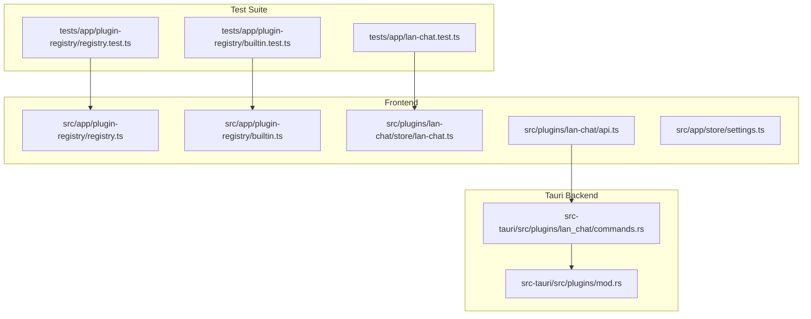
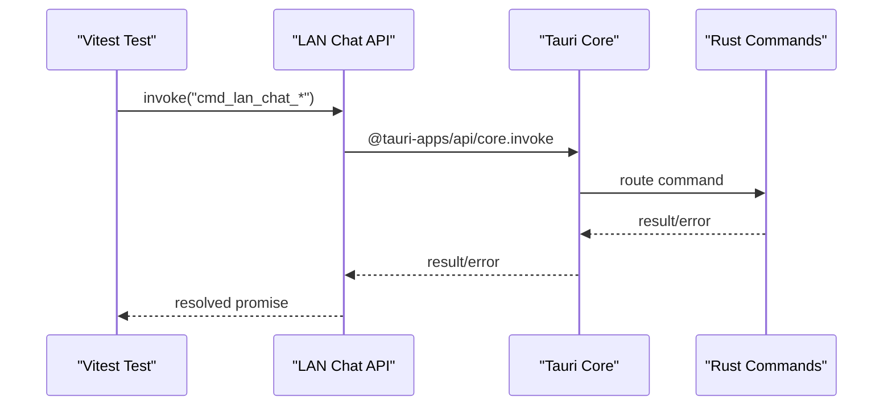
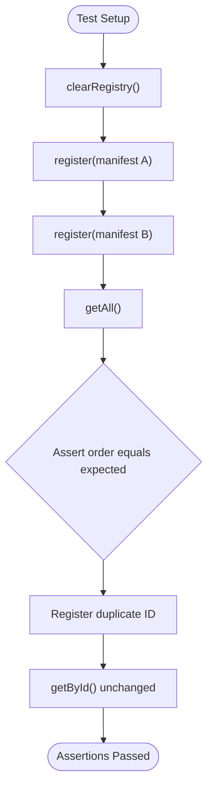
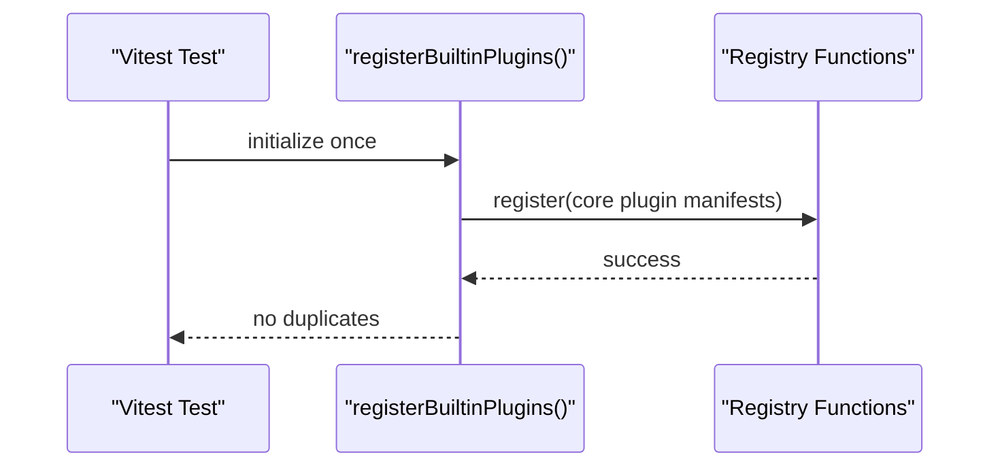
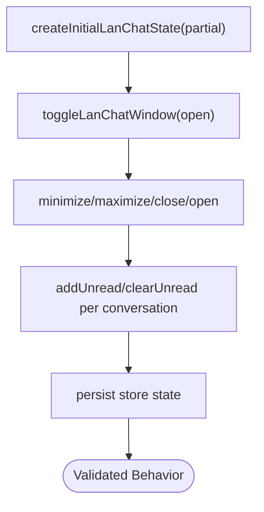
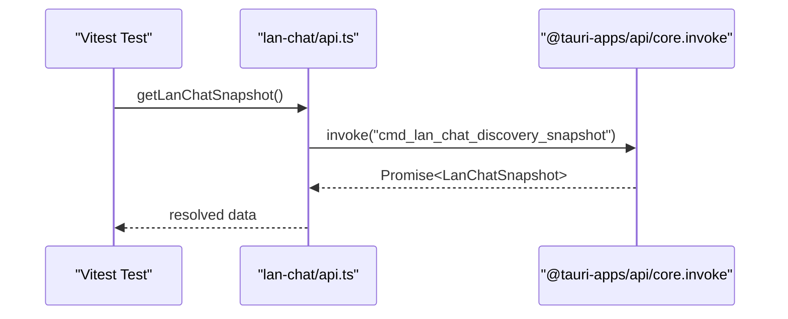
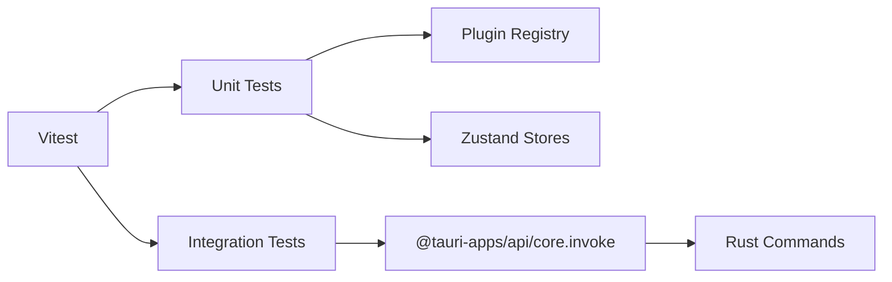
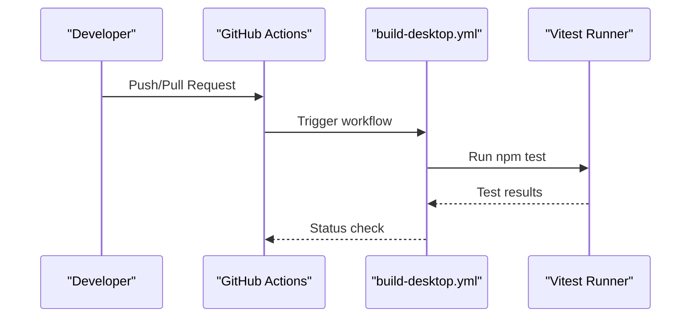

# Testing Strategy

<cite>
**Referenced Files in This Document**
- [package.json](file://package.json)
- [vite.config.ts](file://vite.config.ts)
- [README.md](file://README.md)
- [tests/app/plugin-registry/registry.test.ts](file://tests/app/plugin-registry/registry.test.ts)
- [tests/app/plugin-registry/builtin.test.ts](file://tests/app/plugin-registry/builtin.test.ts)
- [tests/app/lan-chat.test.ts](file://tests/app/lan-chat.test.ts)
- [src/app/plugin-registry/registry.ts](file://src/app/plugin-registry/registry.ts)
- [src/app/plugin-registry/builtin.ts](file://src/app/plugin-registry/builtin.ts)
- [src/plugins/lan-chat/api.ts](file://src/plugins/lan-chat/api.ts)
- [src/plugins/lan-chat/store/lan-chat.ts](file://src/plugins/lan-chat/store/lan-chat.ts)
- [src/plugins/lan-chat/utils/lan-chat.ts](file://src/plugins/lan-chat/utils/lan-chat.ts)
- [src/plugins/lan-chat/types.ts](file://src/plugins/lan-chat/types.ts)
- [src/app/store/settings.ts](file://src/app/store/settings.ts)
- [src-tauri/src/plugins/lan_chat/commands.rs](file://src-tauri/src/plugins/lan_chat/commands.rs)
- [src-tauri/src/plugins/mod.rs](file://src-tauri/src/plugins/mod.rs)
- [.github/workflows/build-desktop.yml](file://.github/workflows/build-desktop.yml)
- [website/content/docs/测试策略.html](file://website/content/docs/测试策略.html)
</cite>

## Table of Contents
1. [Introduction](#introduction)
2. [Project Structure](#project-structure)
3. [Core Components](#core-components)
4. [Architecture Overview](#architecture-overview)
5. [Detailed Component Analysis](#detailed-component-analysis)
6. [Dependency Analysis](#dependency-analysis)
7. [Performance Considerations](#performance-considerations)
8. [Security Testing Considerations](#security-testing-considerations)
9. [Quality Assurance Processes](#quality-assurance-processes)
10. [Continuous Integration Pipeline](#continuous-integration-pipeline)
11. [Troubleshooting Guide](#troubleshooting-guide)
12. [Conclusion](#conclusion)

## Introduction
This document presents a comprehensive testing strategy for the DevNexus application using Vitest. It covers unit testing patterns, integration testing approaches, and plugin-specific methodologies. The strategy addresses frontend and backend components, plugin systems, state management, and cross-language communication between the React/Tauri frontend and Rust backend. It also includes guidance for performance testing, security testing, and CI automation.

## Project Structure
DevNexus organizes tests under the tests/app directory, mirroring the application structure. Vitest is configured via vite.config.ts to include all test files matching tests/**/*.test.ts. The project uses:
- React components and Zustand stores for frontend state
- Tauri commands for native integrations
- Rust plugins for backend functionality

**Diagram sources**
- [vite.config.ts:16-18](file://vite.config.ts#L16-L18)
- [tests/app/plugin-registry/registry.test.ts:1-40](file://tests/app/plugin-registry/registry.test.ts#L1-L40)
- [tests/app/plugin-registry/builtin.test.ts:1-31](file://tests/app/plugin-registry/builtin.test.ts#L1-L31)
- [tests/app/lan-chat.test.ts:1-58](file://tests/app/lan-chat.test.ts#L1-L58)
- [src/app/plugin-registry/registry.ts:1-26](file://src/app/plugin-registry/registry.ts#L1-L26)
- [src/app/plugin-registry/builtin.ts:1-31](file://src/app/plugin-registry/builtin.ts#L1-L31)
- [src/plugins/lan-chat/store/lan-chat.ts:1-202](file://src/plugins/lan-chat/store/lan-chat.ts#L1-L202)
- [src/plugins/lan-chat/api.ts:1-117](file://src/plugins/lan-chat/api.ts#L1-L117)
- [src-tauri/src/plugins/lan_chat/commands.rs](file://src-tauri/src/plugins/lan_chat/commands.rs)

**Section sources**
- [vite.config.ts:16-18](file://vite.config.ts#L16-L18)
- [package.json:10-11](file://package.json#L10-L11)

## Core Components
- Plugin Registry: Centralized plugin registration and retrieval with deduplication and ordering by sidebar position.
- Built-in Plugins: Registration of core plugins during application initialization.
- LAN Chat Store: Zustand store managing floating window state, conversation unread counts, and persistence.
- LAN Chat API: Frontend Tauri command wrappers for LAN chat operations.
- Settings Store: Global UI state persistence for sidebar and selected plugin.

Key testing focuses:
- Registry correctness and deduplication
- Built-in plugin registration coverage
- Store state transitions and persistence
- Tauri command invocation patterns
- Cross-language data contracts via types

**Section sources**
- [src/app/plugin-registry/registry.ts:1-26](file://src/app/plugin-registry/registry.ts#L1-L26)
- [src/app/plugin-registry/builtin.ts:1-31](file://src/app/plugin-registry/builtin.ts#L1-L31)
- [src/plugins/lan-chat/store/lan-chat.ts:1-202](file://src/plugins/lan-chat/store/lan-chat.ts#L1-L202)
- [src/plugins/lan-chat/api.ts:1-117](file://src/plugins/lan-chat/api.ts#L1-L117)
- [src/app/store/settings.ts:1-28](file://src/app/store/settings.ts#L1-L28)

## Architecture Overview
The testing architecture leverages Vitest for unit and integration tests, with explicit mocks for Tauri commands and external dependencies. The frontend interacts with Tauri commands, which are implemented in Rust plugins. Tests validate:
- Frontend state management and UI behavior
- Plugin registration and visibility logic
- Command invocation contracts and error handling
- Persistence boundaries and store serialization

**Diagram sources**
- [src/plugins/lan-chat/api.ts:1-117](file://src/plugins/lan-chat/api.ts#L1-L117)
- [src-tauri/src/plugins/lan_chat/commands.rs](file://src-tauri/src/plugins/lan_chat/commands.rs)

## Detailed Component Analysis

### Plugin Registry Testing
Unit tests validate registry behavior:
- Sorting by sidebar order
- Duplicate ID handling
- Retrieval by ID

**Diagram sources**
- [tests/app/plugin-registry/registry.test.ts:20-39](file://tests/app/plugin-registry/registry.test.ts#L20-L39)
- [src/app/plugin-registry/registry.ts:13-21](file://src/app/plugin-registry/registry.ts#L13-L21)

**Section sources**
- [tests/app/plugin-registry/registry.test.ts:1-40](file://tests/app/plugin-registry/registry.test.ts#L1-L40)
- [src/app/plugin-registry/registry.ts:1-26](file://src/app/plugin-registry/registry.ts#L1-L26)

### Built-in Plugin Registration Testing
Tests ensure built-in plugins are registered correctly and appear in the plugin list.

**Diagram sources**
- [tests/app/plugin-registry/builtin.test.ts:8-30](file://tests/app/plugin-registry/builtin.test.ts#L8-L30)
- [src/app/plugin-registry/builtin.ts:14-29](file://src/app/plugin-registry/builtin.ts#L14-L29)

**Section sources**
- [tests/app/plugin-registry/builtin.test.ts:1-31](file://tests/app/plugin-registry/builtin.test.ts#L1-L31)
- [src/app/plugin-registry/builtin.ts:1-31](file://src/app/plugin-registry/builtin.ts#L1-L31)

### LAN Chat Store Testing
Tests cover floating window behavior, unread counters, and state transitions.

**Diagram sources**
- [tests/app/lan-chat.test.ts:22-57](file://tests/app/lan-chat.test.ts#L22-L57)
- [src/plugins/lan-chat/store/lan-chat.ts:31-71](file://src/plugins/lan-chat/store/lan-chat.ts#L31-L71)

**Section sources**
- [tests/app/lan-chat.test.ts:1-58](file://tests/app/lan-chat.test.ts#L1-L58)
- [src/plugins/lan-chat/store/lan-chat.ts:1-202](file://src/plugins/lan-chat/store/lan-chat.ts#L1-L202)

### LAN Chat API Testing
Frontend Tauri command wrappers are tested for proper invocation and parameter passing.

**Diagram sources**
- [src/plugins/lan-chat/api.ts:11-13](file://src/plugins/lan-chat/api.ts#L11-L13)

**Section sources**
- [src/plugins/lan-chat/api.ts:1-117](file://src/plugins/lan-chat/api.ts#L1-L117)

### State Management Testing Patterns
- Zustand stores use snapshot factories and pure reducers for deterministic tests.
- Persistence middleware is isolated by mocking or using partialize strategies in tests.
- Settings store tests validate persistence keys and defaults.

**Section sources**
- [src/plugins/lan-chat/store/lan-chat.ts:89-201](file://src/plugins/lan-chat/store/lan-chat.ts#L89-L201)
- [src/app/store/settings.ts:13-27](file://src/app/store/settings.ts#L13-L27)

### Plugin-Specific Testing Methodologies
- Manifest validation: ensure required fields and ordering.
- Visibility filtering: confirm sidebar exclusion logic.
- Lifecycle hooks: verify initialization and cleanup behaviors.
- Cross-plugin coordination: validate shared state updates.

**Section sources**
- [src/app/plugin-registry/registry.ts:1-26](file://src/app/plugin-registry/registry.ts#L1-L26)
- [src/app/plugin-registry/builtin.ts:14-29](file://src/app/plugin-registry/builtin.ts#L14-L29)

### Mock Strategies for External Dependencies
Recommended approaches:
- Tauri commands: mock @tauri-apps/api/core.invoke to return controlled responses.
- Network calls: mock fetch or axios in plugin utilities.
- File system: mock @tauri-apps/plugin-fs APIs for file operations.
- Database: isolate database operations behind repositories and mock at the repo level.
- Time-dependent logic: use vitest.useFakeTimers() and vitest.setSystemTime().

[No sources needed since this section provides general guidance]

### Testing Best Practices
- Keep tests isolated and deterministic; avoid shared mutable state.
- Use factory functions for test data (as seen with manifest creation).
- Prefer pure functions and small, focused units.
- Validate side effects (persistence, UI updates) separately.
- Use beforeEach to reset registries and stores between tests.

**Section sources**
- [tests/app/plugin-registry/registry.test.ts:20-23](file://tests/app/plugin-registry/registry.test.ts#L20-L23)
- [tests/app/lan-chat.test.ts:8-10](file://tests/app/lan-chat.test.ts#L8-L10)

## Dependency Analysis
The testing suite depends on:
- Vitest for test runner and assertions
- React Testing Library equivalents for component testing
- Tauri APIs for command invocation
- Zustand for state management testing

**Diagram sources**
- [vite.config.ts:16-18](file://vite.config.ts#L16-L18)
- [src/plugins/lan-chat/api.ts:1](file://src/plugins/lan-chat/api.ts#L1)

**Section sources**
- [package.json:44](file://package.json#L44)
- [vite.config.ts:16-18](file://vite.config.ts#L16-L18)

## Performance Considerations
- Use vitest.setTimeout for long-running tests and avoid unnecessary waits.
- Mock expensive operations (network, file IO) to reduce flakiness.
- Profile UI rendering with lightweight snapshots; avoid heavy DOM assertions.
- Parallelize independent tests; group related tests to minimize setup costs.
- Measure store update performance by counting set invocations in tests.

[No sources needed since this section provides general guidance]

## Security Testing Considerations
- Validate Tauri command permissions and capability schemas.
- Sanitize inputs passed to native commands; assert parameter shapes.
- Test error propagation for invalid or malicious inputs.
- Verify encryption and secure storage for sensitive credentials in stores.
- Audit plugin manifests for unexpected permissions or routes.

[No sources needed since this section provides general guidance]

## Quality Assurance Processes
- Code coverage thresholds for critical modules (registry, stores, commands).
- Lint rules and TypeScript strictness enforced via scripts.
- Pre-commit checks to run tests locally before pushing.
- Automated accessibility and snapshot testing for UI components.

**Section sources**
- [package.json:6-13](file://package.json#L6-L13)

## Continuous Integration Pipeline
Automated test execution is integrated into GitHub Actions workflows. The build workflow triggers tests as part of the desktop build process, ensuring consistent verification across platforms.

**Diagram sources**
- [.github/workflows/build-desktop.yml](file://.github/workflows/build-desktop.yml)

**Section sources**
- [.github/workflows/build-desktop.yml](file://.github/workflows/build-desktop.yml)

## Troubleshooting Guide
Common issues and resolutions:
- Tests failing due to missing mocks: ensure @tauri-apps/api/core.invoke is mocked for API tests.
- State leakage between tests: use beforeEach to clear registries and reset stores.
- CI flakiness: stabilize timing-sensitive tests with fake timers or deterministic delays.
- Type mismatches: align frontend types with backend command signatures.

**Section sources**
- [src/plugins/lan-chat/api.ts:1-117](file://src/plugins/lan-chat/api.ts#L1-L117)
- [src/plugins/lan-chat/types.ts:1-74](file://src/plugins/lan-chat/types.ts#L1-L74)

## Conclusion
DevNexus employs a robust testing strategy centered on Vitest, with clear separation between unit and integration concerns. By focusing on plugin registration, state management, and cross-language command invocation, the suite ensures reliability across the React frontend and Rust backend. The CI pipeline automates test execution, while best practices and mock strategies maintain stability and performance.