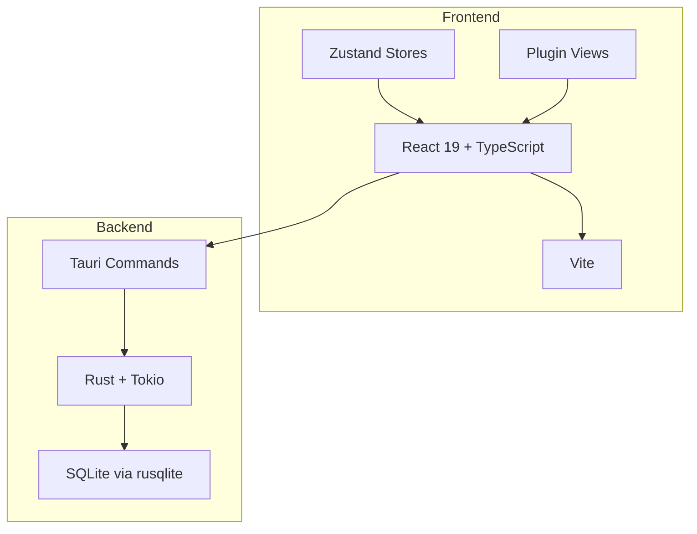
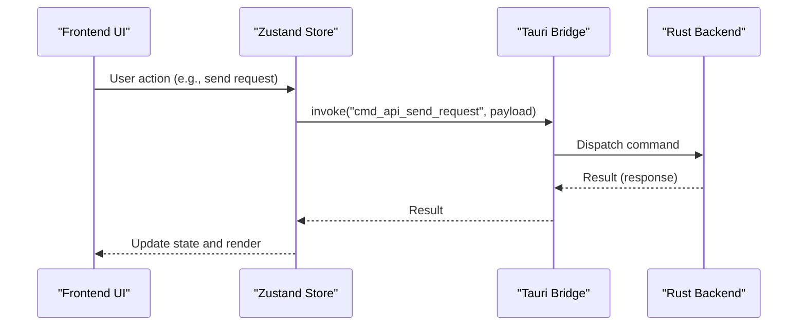
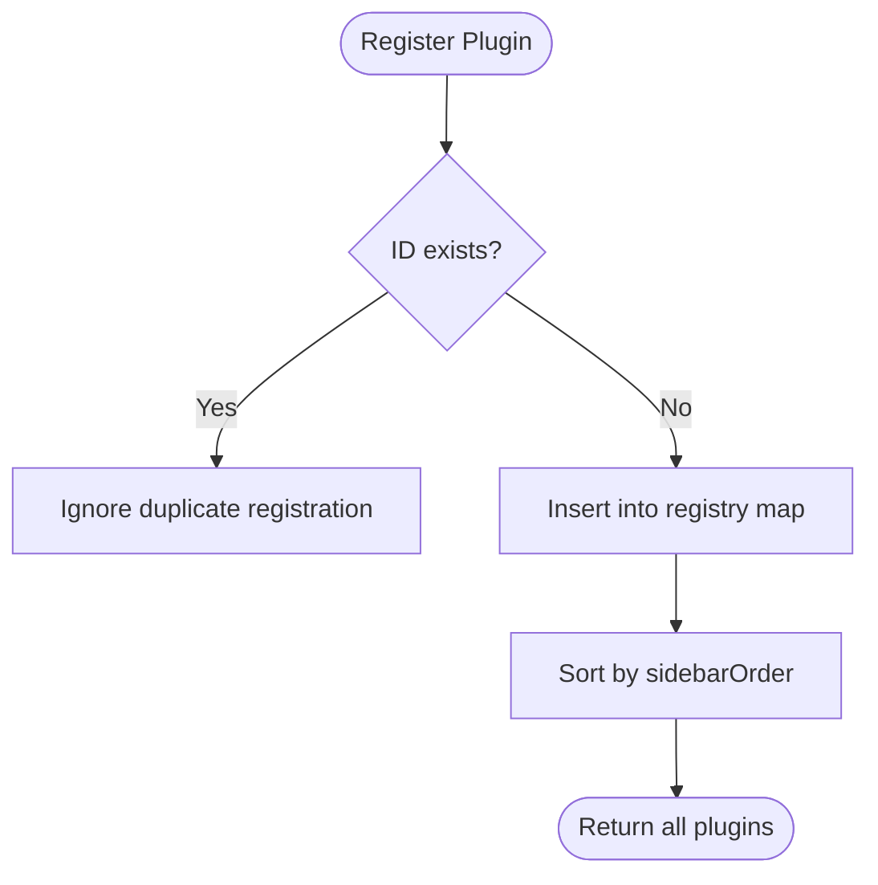
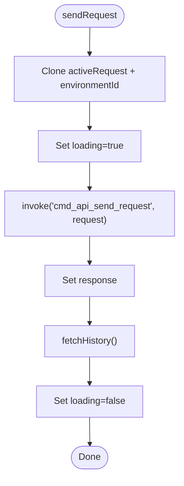
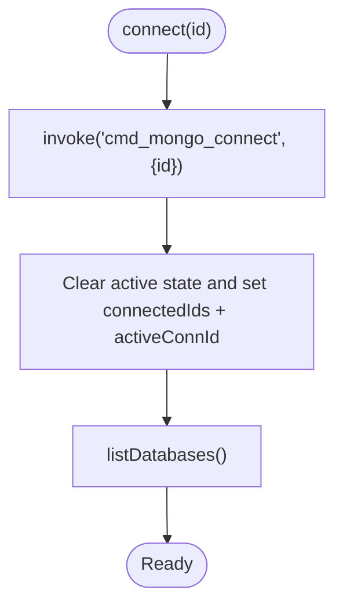
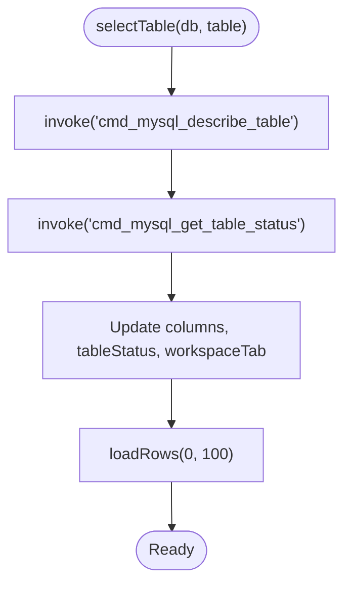
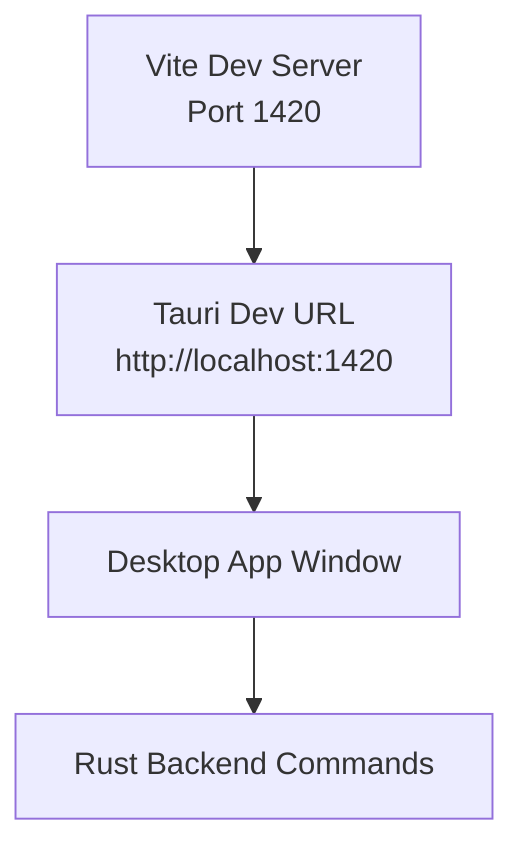
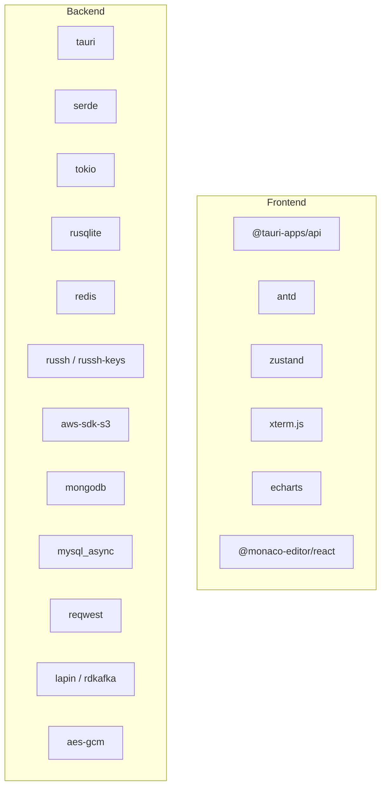

# Troubleshooting & FAQ

<cite>
**Referenced Files in This Document**
- [README.md](file://README.md)
- [package.json](file://package.json)
- [vite.config.ts](file://vite.config.ts)
- [src-tauri/tauri.conf.json](file://src-tauri/tauri.conf.json)
- [src-tauri/Cargo.toml](file://src-tauri/Cargo.toml)
- [src/app/plugin-registry/registry.ts](file://src/app/plugin-registry/registry.ts)
- [src/app/runtime/platform.ts](file://src/app/runtime/platform.ts)
- [src/plugins/api-debugger/store/api-debugger.ts](file://src/plugins/api-debugger/store/api-debugger.ts)
- [src/plugins/mongodb-client/store/mongodb-connections.ts](file://src/plugins/mongodb-client/store/mongodb-connections.ts)
- [src/plugins/mysql-client/store/mysql-connections.ts](file://src/plugins/mysql-client/store/mysql-connections.ts)
- [tests/app/plugin-registry/registry.test.ts](file://tests/app/plugin-registry/registry.test.ts)
- [tests/app/api-debugger.test.ts](file://tests/app/api-debugger.test.ts)
- [PLAN.md](file://PLAN.md)
- [docs/releases/v0.10.0.md](file://docs/releases/v0.10.0.md)
</cite>

## Table of Contents
1. [Introduction](#introduction)
2. [Project Structure](#project-structure)
3. [Core Components](#core-components)
4. [Architecture Overview](#architecture-overview)
5. [Detailed Component Analysis](#detailed-component-analysis)
6. [Dependency Analysis](#dependency-analysis)
7. [Performance Considerations](#performance-considerations)
8. [Troubleshooting Guide](#troubleshooting-guide)
9. [FAQ](#faq)
10. [Conclusion](#conclusion)
11. [Appendices](#appendices)

## Introduction
This document provides comprehensive troubleshooting and FAQ guidance for DevNexus. It covers installation and environment setup issues, development workflow pitfalls, platform-specific problems, dependency conflicts, build errors, debugging techniques for frontend and backend components, performance optimization tips, security considerations, known limitations, migration and upgrade guidance, and best practices. It also includes diagnostic procedures, log analysis techniques, and pointers to community support resources.

## Project Structure
DevNexus is a Tauri 2 desktop application with a React 19 + TypeScript frontend and a Rust backend. The frontend is organized into an app shell, plugin registry, and individual plugin packages. The backend exposes Tauri commands consumed by the frontend stores. The build system uses Vite for the frontend and Tauri for bundling, with Rust Cargo managing the backend.

**Section sources**
- [README.md: 58-99:58-99](file://README.md#L58-L99)
- [README.md: 257-298:257-298](file://README.md#L257-L298)

## Core Components
- Plugin Registry: central mechanism for registering and ordering plugins.
- Runtime Platform Detection: detects macOS for platform-specific behavior.
- API Debugger Store: orchestrates request sending, preview, history, and environment management via Tauri commands.
- MongoDB Client Store: manages connections, namespaces, queries, indexes, import/export, and server status.
- MySQL Client Store: manages connections, tables, rows, indexes, import/export, and server status.

**Section sources**
- [src/app/plugin-registry/registry.ts: 1-26:1-26](file://src/app/plugin-registry/registry.ts#L1-L26)
- [src/app/runtime/platform.ts: 1-10:1-10](file://src/app/runtime/platform.ts#L1-L10)
- [src/plugins/api-debugger/store/api-debugger.ts: 47-129:47-129](file://src/plugins/api-debugger/store/api-debugger.ts#L47-L129)
- [src/plugins/mongodb-client/store/mongodb-connections.ts: 96-296:96-296](file://src/plugins/mongodb-client/store/mongodb-connections.ts#L96-L296)
- [src/plugins/mysql-client/store/mysql-connections.ts: 77-153:77-153](file://src/plugins/mysql-client/store/mysql-connections.ts#L77-L153)

## Architecture Overview
The frontend invokes Tauri commands exposed by the Rust backend. Stores encapsulate state and orchestrate async operations, invoking backend commands and updating state accordingly. The backend performs protocol-specific operations (e.g., HTTP, Redis, SSH, S3, MongoDB, MySQL) and persists data in local SQLite.

**Diagram sources**
- [src/plugins/api-debugger/store/api-debugger.ts: 62-72:62-72](file://src/plugins/api-debugger/store/api-debugger.ts#L62-L72)
- [src/plugins/mongodb-client/store/mongodb-connections.ts: 147-161:147-161](file://src/plugins/mongodb-client/store/mongodb-connections.ts#L147-L161)
- [src/plugins/mysql-client/store/mysql-connections.ts: 109-113:109-113](file://src/plugins/mysql-client/store/mysql-connections.ts#L109-L113)

## Detailed Component Analysis

### Plugin Registry
The registry maintains a map of plugin manifests, prevents duplicate IDs, and returns plugins sorted by sidebar order. Tests verify sorting and deduplication behavior.

**Diagram sources**
- [src/app/plugin-registry/registry.ts: 5-21:5-21](file://src/app/plugin-registry/registry.ts#L5-L21)

**Section sources**
- [src/app/plugin-registry/registry.ts: 1-26:1-26](file://src/app/plugin-registry/registry.ts#L1-L26)
- [tests/app/plugin-registry/registry.test.ts: 20-39:20-39](file://tests/app/plugin-registry/registry.test.ts#L20-L39)

### API Debugger Store
The store coordinates request lifecycle: building requests, sending via Tauri commands, preview resolution, saving collections/environments/requests, importing cURL, exporting collections, and managing history. It toggles loading states and updates UI accordingly.

**Diagram sources**
- [src/plugins/api-debugger/store/api-debugger.ts: 62-72:62-72](file://src/plugins/api-debugger/store/api-debugger.ts#L62-L72)

**Section sources**
- [src/plugins/api-debugger/store/api-debugger.ts: 47-129:47-129](file://src/plugins/api-debugger/store/api-debugger.ts#L47-L129)
- [tests/app/api-debugger.test.ts: 5-23:5-23](file://tests/app/api-debugger.test.ts#L5-L23)

### MongoDB Client Store
The store manages connections, namespaces, and operations like listing databases/collections, querying documents, inserting/updating/deleting, aggregations, indexes, import/export, and server status. It enforces required context (active connection and namespace) and updates state after each operation.

**Diagram sources**
- [src/plugins/mongodb-client/store/mongodb-connections.ts: 147-161:147-161](file://src/plugins/mongodb-client/store/mongodb-connections.ts#L147-L161)

**Section sources**
- [src/plugins/mongodb-client/store/mongodb-connections.ts: 96-296:96-296](file://src/plugins/mongodb-client/store/mongodb-connections.ts#L96-L296)

### MySQL Client Store
The store mirrors MongoDB’s pattern for connection management, database/table navigation, row operations, SQL execution, indexes, import/export, and server status. It validates required context and updates state consistently.

**Diagram sources**
- [src/plugins/mysql-client/store/mysql-connections.ts: 125-133:125-133](file://src/plugins/mysql-client/store/mysql-connections.ts#L125-L133)

**Section sources**
- [src/plugins/mysql-client/store/mysql-connections.ts: 77-153:77-153](file://src/plugins/mysql-client/store/mysql-connections.ts#L77-L153)

### Conceptual Overview
- Frontend development server runs on a fixed port and HMR is configured for Tauri development.
- Tauri configuration defines the dev URL and bundle settings.
- Rust dependencies include Tauri, protocol crates, and local encryption.

**Diagram sources**
- [vite.config.ts: 25-40:25-40](file://vite.config.ts#L25-L40)
- [src-tauri/tauri.conf.json: 6-11:6-11](file://src-tauri/tauri.conf.json#L6-L11)

## Dependency Analysis
- Frontend dependencies include React, Ant Design, Zustand, xterm.js, ECharts, and Monaco editor.
- Backend dependencies include Tauri, serde, tokio, rusqlite, redis, russh/russh-keys, aws-sdk-s3, mongodb, mysql_async, reqwest, lapin, rdkafka, and aes-gcm.

**Diagram sources**
- [package.json: 15-45:15-45](file://package.json#L15-L45)
- [src-tauri/Cargo.toml: 20-49:20-49](file://src-tauri/Cargo.toml#L20-L49)

**Section sources**
- [package.json: 15-45:15-45](file://package.json#L15-L45)
- [src-tauri/Cargo.toml: 20-49:20-49](file://src-tauri/Cargo.toml#L20-L49)

## Performance Considerations
- Virtualization and pagination: MongoDB and MySQL clients use pagination and virtualized browsing to handle large datasets efficiently.
- Background tasks: Heavy operations (e.g., imports, exports, terminal I/O) run on backend threads to avoid blocking the UI.
- Resource pooling: Protocol-specific connection pools (e.g., Redis, SSH, S3, MongoDB, MySQL) reduce overhead and improve responsiveness.
- UI responsiveness: Loading flags in stores prevent concurrent operations and provide feedback.

[No sources needed since this section provides general guidance]

## Troubleshooting Guide

### Installation and Environment Setup
- Node.js and Rust versions: Ensure Node.js 20+ and Rust stable are installed as per prerequisites.
- Platform prerequisites: Install Tauri prerequisites for the target OS (Windows/macOS/Linux).
- Dependencies: Run dependency installation before development or building.

Common symptoms and fixes:
- Node version mismatch leads to build failures. Upgrade Node.js to the required version.
- Missing Rust toolchain causes Cargo errors. Install Rust stable as documented.
- Tauri prerequisites missing cause bundling failures. Follow platform-specific prerequisite steps.

**Section sources**
- [README.md: 101-112:101-112](file://README.md#L101-L112)
- [README.md: 300-309:300-309](file://README.md#L300-L309)

### Development Workflow
- Vite dev server port: The dev server runs on a fixed port and HMR is configured. If the port is busy, the build fails. Free the port or adjust configuration.
- Ignoring src-tauri: Vite ignores watching src-tauri to prevent unnecessary rebuilds.
- Tauri dev URL: Ensure the dev URL matches the configured port in tauri.conf.json.

Common symptoms and fixes:
- Port conflicts: Change the port or stop the conflicting process.
- Unexpected reloads: Verify Vite ignores src-tauri and that devUrl matches the server configuration.

**Section sources**
- [vite.config.ts: 25-40:25-40](file://vite.config.ts#L25-L40)
- [src-tauri/tauri.conf.json: 6-11:6-11](file://src-tauri/tauri.conf.json#L6-L11)

### Build and Packaging
- Frontend build: TypeScript type-check and Vite build must pass.
- Backend check: Cargo check must pass in the src-tauri directory.
- Known warnings: Large chunk warnings and unused type warnings do not block release if exit code is zero.

Common symptoms and fixes:
- Build fails due to TypeScript errors: Fix type errors before building.
- Cargo check fails: Resolve Rust compilation issues.
- Release blocked by warnings: Suppress non-blocking warnings or fix them.

**Section sources**
- [README.md: 126-140:126-140](file://README.md#L126-L140)
- [README.md: 324-339:324-339](file://README.md#L324-L339)

### Platform-Specific Problems
- macOS detection: Use platform detection utilities to adapt behavior on macOS.
- Windows/macOS/Linux packaging: Use the provided tauri build commands for each platform.

Common symptoms and fixes:
- Incorrect platform behavior: Use platform detection to branch logic.
- Packaging issues: Use platform-specific bundles as documented.

**Section sources**
- [src/app/runtime/platform.ts: 1-10:1-10](file://src/app/runtime/platform.ts#L1-L10)
- [README.md: 142-156:142-156](file://README.md#L142-L156)
- [README.md: 340-354:340-354](file://README.md#L340-L354)

### Dependency Conflicts
- Frontend dependencies: Keep React, Ant Design, and related libraries aligned with supported versions.
- Backend dependencies: Align Rust crates with compatible versions and features.

Common symptoms and fixes:
- Version mismatches: Update dependencies to satisfy peer requirements.
- Feature conflicts: Adjust crate features as needed.

**Section sources**
- [package.json: 15-45:15-45](file://package.json#L15-L45)
- [src-tauri/Cargo.toml: 20-49:20-49](file://src-tauri/Cargo.toml#L20-L49)

### Build Errors
- Vite large chunk warnings: These are informational and do not block release.
- Unused type warnings: These are informational and do not block release.

Common symptoms and fixes:
- Ignore non-blocking warnings; focus on nonzero exit codes.

**Section sources**
- [README.md: 140](file://README.md#L140)
- [README.md: 338](file://README.md#L338)

### Debugging Techniques

#### Frontend Debugging
- Use React DevTools and browser debugging to inspect component state and props.
- Inspect store state using logging or React DevTools state tabs.
- Verify Tauri command invocations and loading states.

#### Backend Debugging
- Use Tauri dev mode to observe backend logs in the system console.
- Add logging in Rust commands to trace execution and errors.
- Validate protocol-specific operations (e.g., network connectivity, credential validity).

#### Protocol-Specific Debugging
- API Debugger: Validate request construction, environment variables, and response handling.
- MongoDB/MySQL: Confirm connection strings, credentials, and database/table existence.
- SSH/S3: Verify endpoint configurations, credentials, and network accessibility.

**Section sources**
- [src/plugins/api-debugger/store/api-debugger.ts: 62-72:62-72](file://src/plugins/api-debugger/store/api-debugger.ts#L62-L72)
- [src/plugins/mongodb-client/store/mongodb-connections.ts: 147-161:147-161](file://src/plugins/mongodb-client/store/mongodb-connections.ts#L147-L161)
- [src/plugins/mysql-client/store/mysql-connections.ts: 109-113:109-113](file://src/plugins/mysql-client/store/mysql-connections.ts#L109-L113)

### Performance Optimization Tips
- Prefer pagination and filtering for large datasets.
- Use virtualized lists for extensive key/object browsing.
- Avoid synchronous heavy operations on the UI thread; delegate to backend tasks.
- Monitor and cap concurrent operations in stores.

**Section sources**
- [PLAN.md: 370-377:370-377](file://PLAN.md#L370-L377)

### Security Considerations
- Do not commit sensitive data (passwords, keys, tokens, credentials).
- Treat connection profiles and environment variables as sensitive.
- Redact information in screenshots and bug reports.

**Section sources**
- [README.md: 185-191:185-191](file://README.md#L185-L191)
- [README.md: 383-389:383-389](file://README.md#L383-L389)

### Diagnostic Procedures and Log Analysis
- Frontend logs: Enable verbose logging in stores and components.
- Backend logs: Use Tauri dev mode to capture Rust logs.
- Protocol logs: Capture network traces for HTTP/S3/SSH/MQ operations.
- SQLite inspection: Verify connection profiles and history tables.

**Section sources**
- [src/plugins/api-debugger/store/api-debugger.ts: 62-72:62-72](file://src/plugins/api-debugger/store/api-debugger.ts#L62-L72)
- [src/plugins/mongodb-client/store/mongodb-connections.ts: 147-161:147-161](file://src/plugins/mongodb-client/store/mongodb-connections.ts#L147-L161)
- [src/plugins/mysql-client/store/mysql-connections.ts: 109-113:109-113](file://src/plugins/mysql-client/store/mysql-connections.ts#L109-L113)

### Community Support Resources
- GitHub Issues: Report reproducible bugs with environment details and logs.
- Discussions: Engage in discussions for feature requests and troubleshooting.
- Release Notes: Review release notes for known limits and workarounds.

**Section sources**
- [docs/releases/v0.10.0.md: 24-30:24-30](file://docs/releases/v0.10.0.md#L24-L30)

## FAQ

### Installation and Setup
- Q: What are the environment requirements?
  - A: Node.js 20+, Rust stable, and platform-specific Tauri prerequisites.

- Q: How do I start development?
  - A: Install dependencies, then run the frontend dev server or Tauri dev mode.

**Section sources**
- [README.md: 101-112:101-112](file://README.md#L101-L112)
- [README.md: 113-124:113-124](file://README.md#L113-L124)

### Development and Build
- Q: Why does the build fail with a port conflict?
  - A: The dev server uses a fixed port. Stop the conflicting process or adjust the port.

- Q: Why are there large chunk warnings?
  - A: These are informational and do not block release.

**Section sources**
- [vite.config.ts: 25-29:25-29](file://vite.config.ts#L25-L29)
- [README.md: 140](file://README.md#L140)

### Plugins and Features
- Q: How do I register a new plugin?
  - A: Define a manifest and register it via the registry.

- Q: What are the known limits for plugins?
  - A: Refer to the known limits section for each plugin’s scope and constraints.

**Section sources**
- [src/app/plugin-registry/registry.ts: 5-21:5-21](file://src/app/plugin-registry/registry.ts#L5-L21)
- [README.md: 192-200:192-200](file://README.md#L192-L200)
- [README.md: 390-398:390-398](file://README.md#L390-L398)

### Migration and Upgrades
- Q: How do I upgrade versions?
  - A: Update version fields across package.json, Cargo.toml, and tauri.conf.json, run tests and builds, then tag and release.

**Section sources**
- [README.md: 171-183:171-183](file://README.md#L171-L183)
- [README.md: 369-382:369-382](file://README.md#L369-L382)

### Best Practices
- Q: How can I avoid common pitfalls?
  - A: Use pagination, virtualization, and connection pools; validate inputs; encrypt sensitive data; and keep dependencies updated.

**Section sources**
- [PLAN.md: 370-377:370-377](file://PLAN.md#L370-L377)
- [README.md: 192-200:192-200](file://README.md#L192-L200)

## Conclusion
This guide consolidates troubleshooting workflows, debugging techniques, performance tips, security practices, and FAQs for DevNexus. By following the outlined procedures and best practices, most installation, development, and usage issues can be resolved efficiently. For ongoing enhancements and known limitations, consult the release notes and roadmap.

[No sources needed since this section summarizes without analyzing specific files]

## Appendices

### Appendix A: Common Commands Reference
- Install dependencies: npm install
- Start frontend dev server: npm run dev
- Start Tauri dev: npm run tauri dev
- Run tests: npm test
- Type-check and build frontend: npm run build
- Check backend: cd src-tauri && cargo check
- Build for current platform: npm run tauri build
- Build Windows installer: npm run tauri build -- --bundles nsis
- Build macOS app/dmg: npm run tauri build -- --bundles app,dmg
- Build Linux packages: npm run tauri build -- --bundles deb,appimage

**Section sources**
- [README.md: 113-156:113-156](file://README.md#L113-L156)
- [README.md: 311-354:311-354](file://README.md#L311-L354)