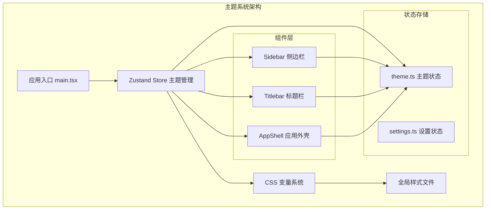
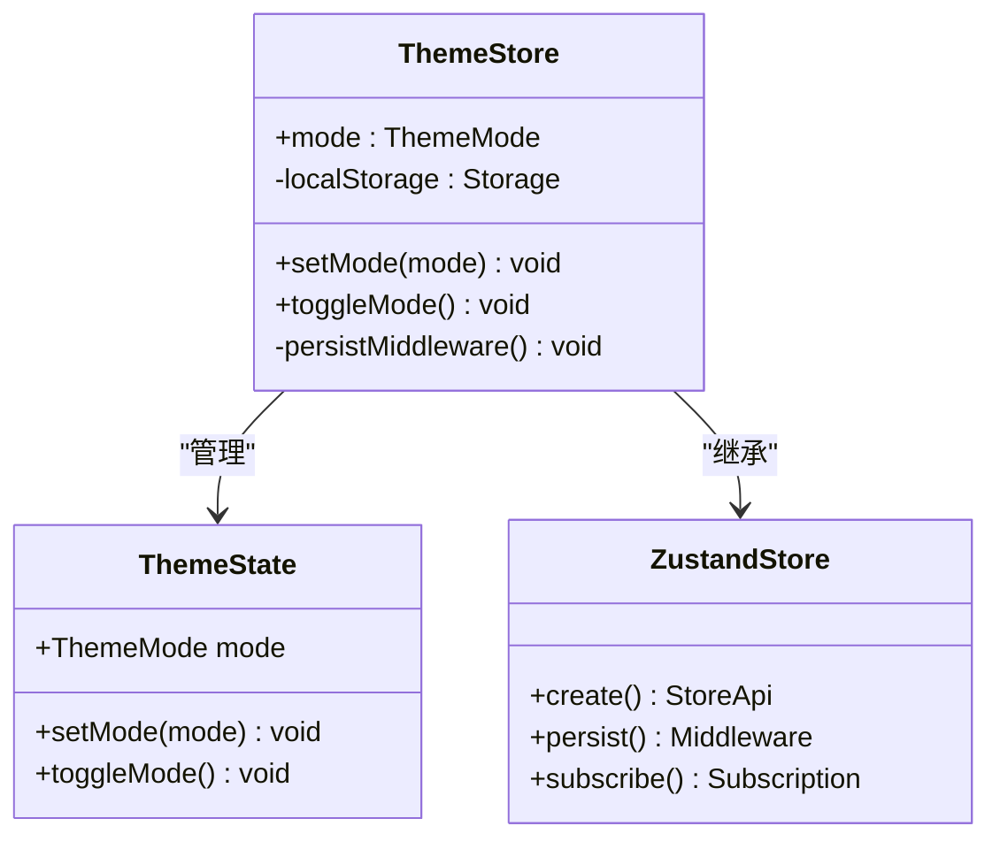
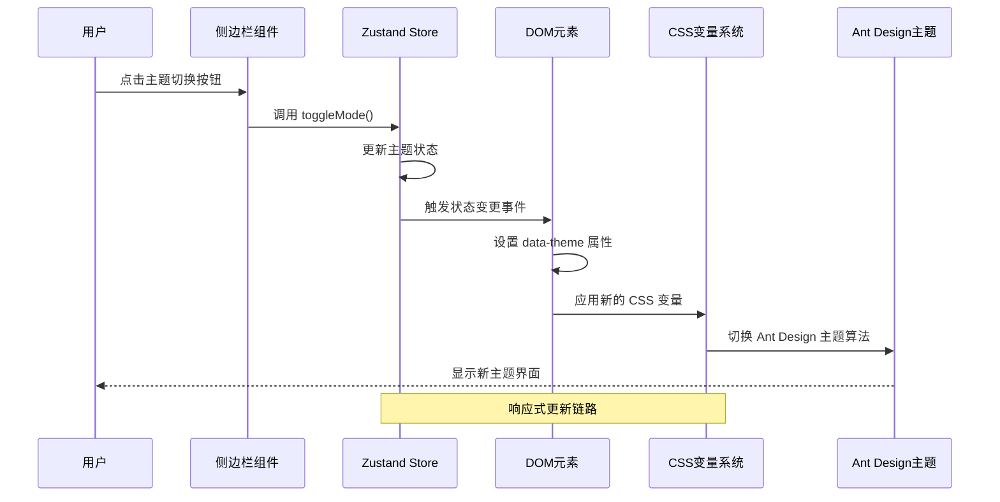
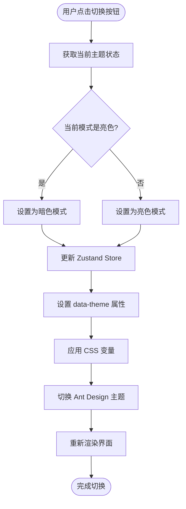
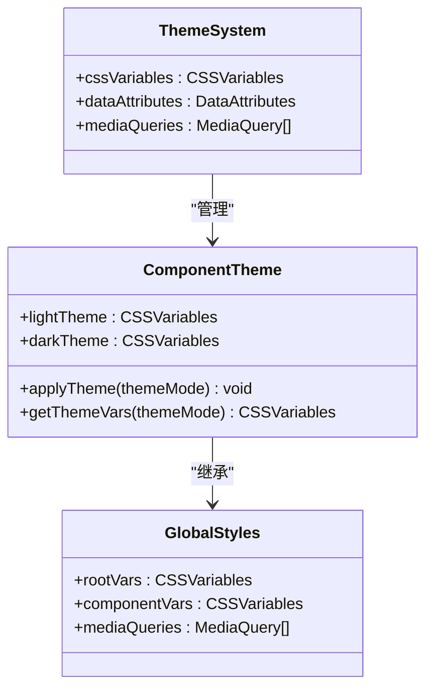
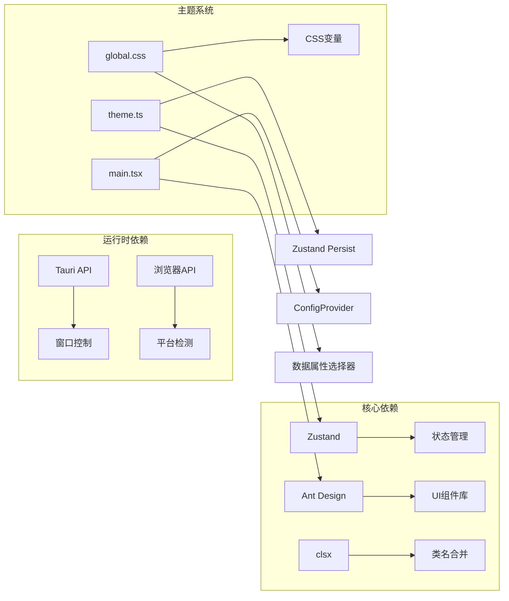
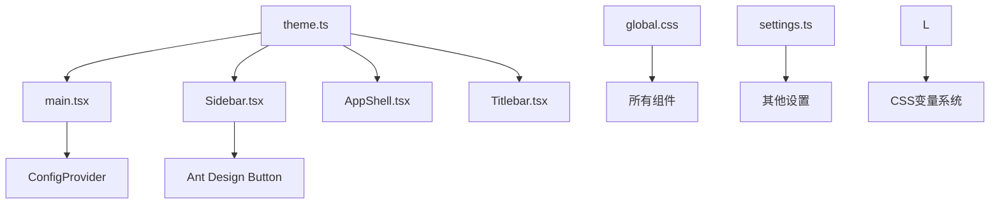

# 主题管理系统

<cite>
**本文档引用的文件**
- [theme.ts](file://src/app/store/theme.ts)
- [main.tsx](file://src/main.tsx)
- [global.css](file://src/styles/global.css)
- [Sidebar.tsx](file://src/app/layout/Sidebar.tsx)
- [AppShell.tsx](file://src/app/layout/AppShell.tsx)
- [settings.ts](file://src/app/store/settings.ts)
- [platform.ts](file://src/app/runtime/platform.ts)
- [Titlebar.tsx](file://src/app/layout/Titlebar.tsx)
</cite>

## 目录
1. [简介](#简介)
2. [项目结构](#项目结构)
3. [核心组件](#核心组件)
4. [架构概览](#架构概览)
5. [详细组件分析](#详细组件分析)
6. [依赖关系分析](#依赖关系分析)
7. [性能考虑](#性能考虑)
8. [故障排除指南](#故障排除指南)
9. [结论](#结论)
10. [附录：主题开发指南](#附录主题开发指南)

## 简介

DevNexus 主题管理系统是一个基于 Zustand 状态管理库构建的现代化主题切换解决方案。该系统实现了完整的明暗主题切换功能，支持用户偏好持久化存储，并通过 CSS 变量系统实现响应式主题更新。

系统采用分层架构设计，包含状态管理层、样式层和组件层三个主要层次。状态管理层使用 Zustand store 管理主题状态，样式层通过 CSS 变量实现主题切换，组件层负责用户界面交互和状态同步。

## 项目结构

主题管理系统在项目中的组织结构如下：



**图表来源**
- [main.tsx:12-30](file://src/main.tsx#L12-L30)
- [theme.ts:12-26](file://src/app/store/theme.ts#L12-L26)
- [Sidebar.tsx:38-39](file://src/app/layout/Sidebar.tsx#L38-L39)

**章节来源**
- [main.tsx:1-38](file://src/main.tsx#L1-L38)
- [theme.ts:1-27](file://src/app/store/theme.ts#L1-L27)

## 核心组件

### Zustand 主题 Store

主题状态管理的核心是基于 Zustand 的轻量级状态管理器。该 store 实现了以下关键功能：

- **状态定义**：维护当前主题模式（light/dark）
- **操作方法**：提供设置主题和切换主题的方法
- **持久化存储**：使用 persist middleware 将用户偏好保存到本地存储
- **响应式更新**：自动触发组件重新渲染



**图表来源**
- [theme.ts:6-10](file://src/app/store/theme.ts#L6-L10)
- [theme.ts:12-26](file://src/app/store/theme.ts#L12-L26)

### CSS 变量系统

系统采用 CSS 自定义属性（CSS Variables）作为主题变量的载体，实现了高效的样式切换机制：

- **根级变量**：定义在 :root 选择器中，作用于整个文档
- **数据属性驱动**：通过 data-theme 属性控制主题切换
- **组件级覆盖**：支持针对特定组件的主题定制
- **渐进增强**：确保向后兼容性

**章节来源**
- [global.css:1-17](file://src/styles/global.css#L1-L17)
- [main.tsx:15-17](file://src/main.tsx#L15-L17)

## 架构概览

主题管理系统的整体架构采用分层设计，确保各层职责清晰且松耦合：



**图表来源**
- [Sidebar.tsx:163-172](file://src/app/layout/Sidebar.tsx#L163-L172)
- [main.tsx:12-30](file://src/main.tsx#L12-L30)
- [theme.ts:17-20](file://src/app/store/theme.ts#L17-L20)

## 详细组件分析

### 主题切换逻辑

主题切换逻辑实现了完整的明暗主题互切功能，具有以下特点：

#### 状态管理流程



**图表来源**
- [theme.ts:17-20](file://src/app/store/theme.ts#L17-L20)
- [main.tsx:15-17](file://src/main.tsx#L15-L17)

#### 组件集成方式

主题状态通过多种方式在组件中使用：

1. **直接状态访问**：组件直接从 store 获取当前主题状态
2. **事件处理绑定**：组件绑定主题切换的事件处理器
3. **条件渲染**：根据主题状态动态调整组件外观

**章节来源**
- [Sidebar.tsx:38-39](file://src/app/layout/Sidebar.tsx#L38-L39)
- [Sidebar.tsx:163-172](file://src/app/layout/Sidebar.tsx#L163-L172)

### 样式系统集成

#### 全局样式动态加载

系统通过以下机制实现样式的动态加载和主题切换：

- **样式文件导入**：在应用入口处统一导入全局样式
- **CSS 变量优先**：优先使用 CSS 变量而非内联样式
- **组件样式隔离**：确保主题切换不影响其他组件

#### 组件主题化实现



**图表来源**
- [global.css:1-973](file://src/styles/global.css#L1-L973)
- [main.tsx:6-8](file://src/main.tsx#L6-L8)

**章节来源**
- [global.css:1-973](file://src/styles/global.css#L1-L973)
- [main.tsx:6-8](file://src/main.tsx#L6-L8)

### 动画效果实现

系统在主题切换过程中实现了平滑的过渡动画效果：

- **渐变过渡**：使用 CSS transition 实现颜色渐变
- **延迟加载**：避免主题切换时的闪烁现象
- **性能优化**：最小化重绘和回流操作

## 依赖关系分析

### 外部依赖

主题系统依赖以下关键外部库：



**图表来源**
- [main.tsx:3-6](file://src/main.tsx#L3-L6)
- [theme.ts:1-2](file://src/app/store/theme.ts#L1-L2)

### 内部模块依赖



**图表来源**
- [theme.ts:12-26](file://src/app/store/theme.ts#L12-L26)
- [main.tsx:12-30](file://src/main.tsx#L12-L30)

**章节来源**
- [theme.ts:12-26](file://src/app/store/theme.ts#L12-L26)
- [main.tsx:12-30](file://src/main.tsx#L12-L30)

## 性能考虑

### 状态更新优化

系统在性能方面采用了多项优化策略：

- **选择性订阅**：组件只订阅需要的状态变化
- **防抖处理**：避免频繁的主题切换导致的性能问题
- **内存管理**：及时清理不再使用的状态引用

### 渲染性能

- **最小化重绘**：通过 CSS 变量实现零重绘主题切换
- **批量更新**：将多个状态更新合并为单个渲染周期
- **懒加载**：按需加载主题相关的样式资源

## 故障排除指南

### 常见问题及解决方案

#### 主题状态不同步

**问题描述**：组件显示的主题与实际状态不一致

**解决步骤**：
1. 检查组件是否正确订阅了主题状态
2. 验证 Zustand store 的持久化配置
3. 确认 data-theme 属性是否正确设置

#### 样式切换失败

**问题描述**：主题切换后样式没有更新

**解决步骤**：
1. 检查 CSS 变量是否正确定义
2. 验证 data-theme 选择器的优先级
3. 确认 Ant Design 主题算法的正确应用

#### 性能问题

**问题描述**：主题切换时出现卡顿或闪烁

**解决步骤**：
1. 检查是否有不必要的状态订阅
2. 优化 CSS 过渡动画的复杂度
3. 避免在主题切换时进行大量计算

**章节来源**
- [theme.ts:12-26](file://src/app/store/theme.ts#L12-L26)
- [main.tsx:15-17](file://src/main.tsx#L15-L17)

## 结论

DevNexus 主题管理系统通过精心设计的架构实现了高效、可扩展的主题切换功能。系统采用 Zustand 作为状态管理核心，结合 CSS 变量和 Ant Design 主题算法，提供了流畅的用户体验。

该系统的主要优势包括：
- **简洁高效**：基于 Zustand 的轻量级实现
- **响应式更新**：自动化的状态同步机制
- **可扩展性**：模块化的架构设计
- **性能优化**：最小化的渲染开销

未来可以考虑的功能增强包括：
- 系统主题跟随功能
- 自定义主题创建
- 主题预设管理
- 更丰富的动画效果

## 附录：主题开发指南

### 自定义主题创建

#### 步骤一：定义主题变量

在全局样式文件中添加新的 CSS 变量：

```css
:root {
  /* 新主题的颜色变量 */
  --custom-primary-color: #007bff;
  --custom-secondary-color: #6c757d;
  --custom-success-color: #28a745;
}

[data-theme="dark"] {
  --custom-primary-color: #0d6efd;
  --custom-secondary-color: #adb5bd;
  --custom-success-color: #198754;
}
```

#### 步骤二：创建主题 store

扩展现有的主题 store 以支持新主题：

```typescript
// 在 theme.ts 中添加
interface CustomThemeState extends ThemeState {
  customMode: 'default' | 'custom';
  setCustomMode: (mode: 'default' | 'custom') => void;
}
```

#### 步骤三：实现主题切换逻辑

在组件中实现自定义主题的切换：

```tsx
const toggleCustomTheme = () => {
  const currentMode = useThemeStore.getState().customMode;
  const newMode = currentMode === 'default' ? 'custom' : 'default';
  useThemeStore.getState().setCustomMode(newMode);
};
```

### 颜色体系设计最佳实践

#### 颜色层次结构

建议采用以下颜色层次结构：

```css
/* 基础颜色 */
--color-primary: #007bff;
--color-secondary: #6c757d;
--color-success: #28a745;
--color-danger: #dc3545;
--color-warning: #ffc107;
--color-info: #17a2b8;

/* 状态颜色 */
--color-error: #dc3545;
--color-warn: #ffc107;
--color-success-state: #28a745;
--color-info-state: #17a2b8;

/* 中性色调 */
--color-gray-50: #f8f9fa;
--color-gray-100: #e9ecef;
--color-gray-200: #dee2e6;
--color-gray-300: #ced4da;
--color-gray-400: #adb5bd;
--color-gray-500: #6c757d;
--color-gray-600: #495057;
--color-gray-700: #343a40;
--color-gray-800: #212529;
--color-gray-900: #121212;
```

#### 对比度要求

确保颜色对比度满足可访问性标准：

- 文本与背景的对比度至少为 4.5:1
- 重要信息的对比度至少为 3:1
- 图标和装饰元素可以使用较低的对比度

### 主题扩展最佳实践

#### 组件主题化

为组件创建主题化版本：

```tsx
const ThemedButton = ({ children, themeMode }) => {
  const baseClasses = "btn";
  const themeClasses = themeMode === "dark" 
    ? "btn-dark-theme" 
    : "btn-light-theme";
  
  return (
    <button className={`${baseClasses} ${themeClasses}`}>
      {children}
    </button>
  );
};
```

#### 动画效果设计

实现平滑的主题切换动画：

```css
.theme-transition {
  transition: all 0.3s ease-in-out;
  will-change: transform, opacity;
}

[data-theme="dark"] .theme-transition {
  filter: brightness(0.9);
}
```

#### 性能优化技巧

- 使用 CSS 变量而非内联样式
- 避免在主题切换时进行复杂的 DOM 操作
- 合理使用 CSS `will-change` 属性优化动画性能
- 避免在主题切换时触发大规模的重排版

通过遵循这些最佳实践，可以创建出既美观又高性能的主题系统，为用户提供优秀的视觉体验。