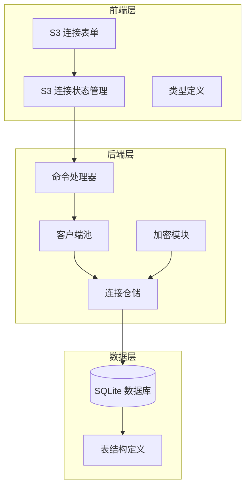
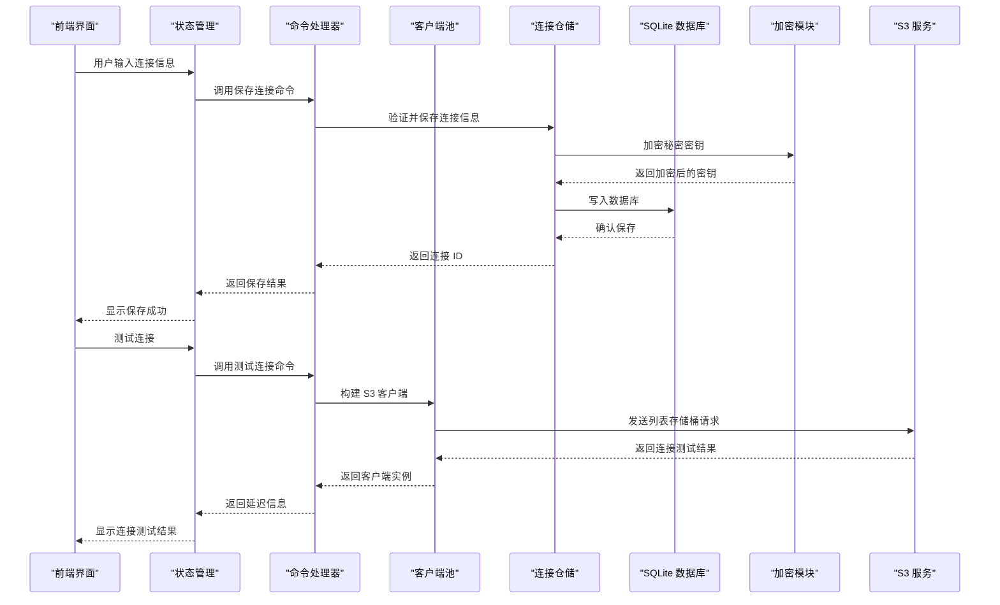
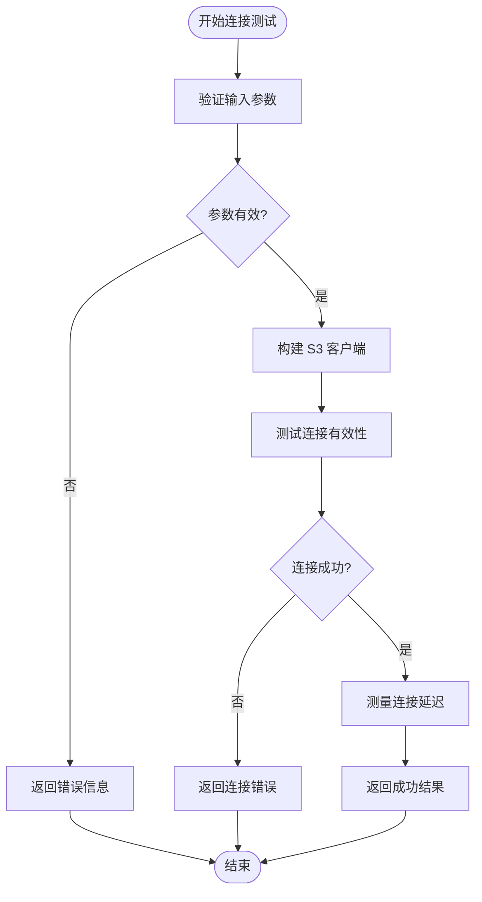
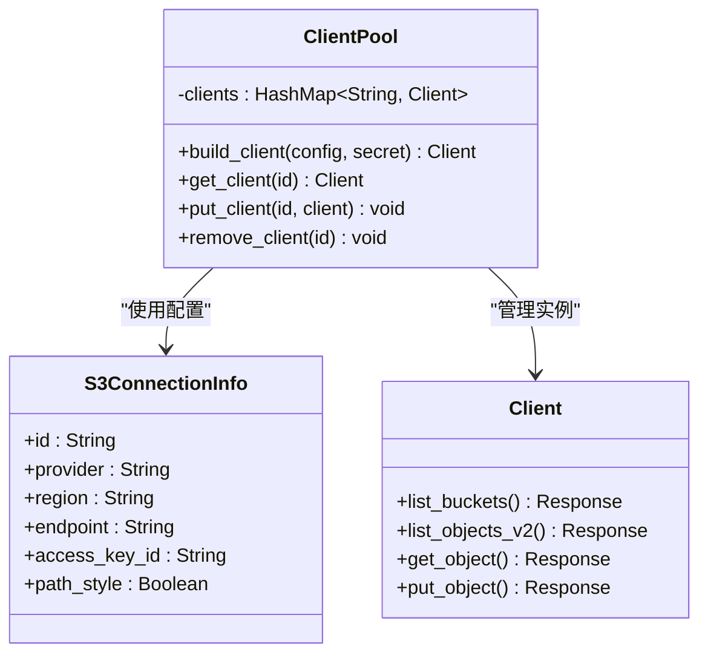
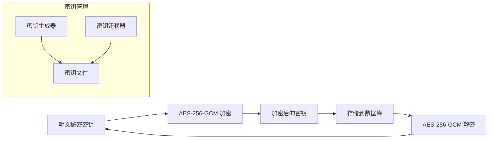
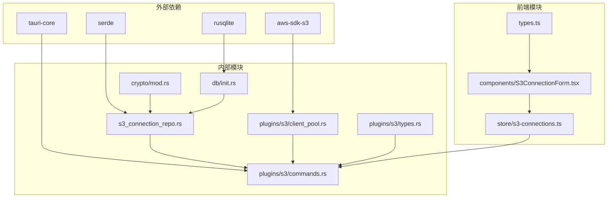

# S3 连接仓储

<cite>
**本文档引用的文件**
- [s3_connection_repo.rs](file://src-tauri/src/db/s3_connection_repo.rs)
- [client_pool.rs](file://src-tauri/src/plugins/s3/client_pool.rs)
- [commands.rs](file://src-tauri/src/plugins/s3/commands.rs)
- [types.rs](file://src-tauri/src/plugins/s3/types.rs)
- [mod.rs](file://src-tauri/src/plugins/s3/mod.rs)
- [init.rs](file://src-tauri/src/db/init.rs)
- [mod.rs](file://src-tauri/src/crypto/mod.rs)
- [S3ConnectionForm.tsx](file://src/plugins/s3-client/components/S3ConnectionForm.tsx)
- [s3-connections.ts](file://src/plugins/s3-client/store/s3-connections.ts)
- [types.ts](file://src/plugins/s3-client/types.ts)
</cite>

## 目录
1. [简介](#简介)
2. [项目结构](#项目结构)
3. [核心组件](#核心组件)
4. [架构概览](#架构概览)
5. [详细组件分析](#详细组件分析)
6. [依赖关系分析](#依赖关系分析)
7. [性能考量](#性能考量)
8. [故障排除指南](#故障排除指南)
9. [结论](#结论)

## 简介

DevNexus 的 S3 连接仓储是一个专门设计用于管理 S3 兼容存储服务连接的系统组件。该系统提供了完整的 AWS 认证支持、区域配置、端点设置以及连接验证机制。通过这个仓储，用户可以安全地管理多个 S3 连接，包括 AWS S3、MinIO、阿里云 OSS、腾讯 COS 和 Cloudflare R2 等不同提供商的服务。

该系统采用分层架构设计，结合 Rust 后端的安全加密机制和 React 前端的用户界面，为用户提供了一个功能完整且安全的 S3 连接管理解决方案。

## 项目结构

DevNexus 的 S3 连接仓储分布在多个层次中，形成了清晰的分层架构：

**图表来源**
- [S3ConnectionForm.tsx:1-220](file://src/plugins/s3-client/components/S3ConnectionForm.tsx#L1-L220)
- [s3-connections.ts:1-432](file://src/plugins/s3-client/store/s3-connections.ts#L1-L432)
- [commands.rs:1-1080](file://src-tauri/src/plugins/s3/commands.rs#L1-L1080)
- [client_pool.rs:1-86](file://src-tauri/src/plugins/s3/client_pool.rs#L1-L86)
- [s3_connection_repo.rs:1-188](file://src-tauri/src/db/s3_connection_repo.rs#L1-L188)

**章节来源**
- [S3ConnectionForm.tsx:1-220](file://src/plugins/s3-client/components/S3ConnectionForm.tsx#L1-L220)
- [s3-connections.ts:1-432](file://src/plugins/s3-client/store/s3-connections.ts#L1-L432)
- [commands.rs:1-1080](file://src-tauri/src/plugins/s3/commands.rs#L1-L1080)

## 核心组件

### 数据模型设计

S3 连接仓储的核心数据模型包括两个主要结构体：

#### S3ConnectionInfo 结构体
这是从数据库查询返回的连接信息结构，包含：
- **标识符**: 唯一连接 ID
- **基本信息**: 名称、分组名称
- **提供商信息**: 支持 AWS、MinIO、阿里云、腾讯云、R2 和自定义提供商
- **网络配置**: 区域、端点、路径样式访问
- **认证信息**: 访问密钥 ID（不包含秘密密钥）
- **默认设置**: 默认存储桶
- **时间戳**: 创建时间

#### S3ConnectionForm 结构体  
这是用于保存和更新连接的表单数据结构，包含：
- **可选标识符**: 用于更新现有连接
- **必填字段**: 名称、提供商、区域、访问密钥 ID
- **敏感信息**: 秘密访问密钥（可选，留空表示保持不变）
- **高级选项**: 路径样式访问、默认存储桶

### 数据库架构

S3 连接信息存储在 SQLite 数据库的 `s3_connections` 表中，具有以下字段：

| 字段名 | 类型 | 描述 | 约束 |
|--------|------|------|------|
| id | TEXT | 连接唯一标识符 | PRIMARY KEY |
| name | TEXT | 连接名称 | NOT NULL |
| group_name | TEXT | 分组名称 | 可为空 |
| provider | TEXT | 提供商类型 | NOT NULL |
| endpoint | TEXT | 自定义端点 | 可为空 |
| region | TEXT | 区域标识 | NOT NULL |
| access_key_id | TEXT | 访问密钥 ID | NOT NULL |
| secret_access_key_encrypted | TEXT | 加密的秘密密钥 | NOT NULL |
| path_style | INTEGER | 路径样式访问标志 | NOT NULL DEFAULT 0 |
| default_bucket | TEXT | 默认存储桶 | 可为空 |
| created_at | TEXT | 创建时间戳 | NOT NULL |

**章节来源**
- [s3_connection_repo.rs:3-31](file://src-tauri/src/db/s3_connection_repo.rs#L3-L31)
- [init.rs:103-115](file://src-tauri/src/db/init.rs#L103-L115)

## 架构概览

S3 连接仓储采用分层架构设计，确保了良好的关注点分离和安全性：

**图表来源**
- [commands.rs:22-80](file://src-tauri/src/plugins/s3/commands.rs#L22-L80)
- [client_pool.rs:34-59](file://src-tauri/src/plugins/s3/client_pool.rs#L34-L59)
- [s3_connection_repo.rs:110-161](file://src-tauri/src/db/s3_connection_repo.rs#L110-L161)

## 详细组件分析

### 连接验证机制

S3 连接验证是系统安全性的关键组成部分，采用了多层验证策略：

#### 前端验证
前端表单提供了实时验证功能：
- 必填字段验证（名称、访问密钥 ID、区域）
- 提供商特定验证（自定义提供商必须提供端点）
- 密码字段条件性验证（新建连接时要求输入秘密密钥）

#### 后端验证
后端执行更严格的验证：
- 参数完整性检查
- 提供商和区域的有效性验证
- 端点格式验证（仅限自定义提供商）
- 凭证有效性测试

#### 连接测试流程
连接测试通过实际的 S3 API 调用来验证：
1. 构建临时 S3 客户端
2. 执行 `list_buckets` 操作
3. 计算响应时间作为延迟指标
4. 返回连接状态和性能信息

**图表来源**
- [commands.rs:36-80](file://src-tauri/src/plugins/s3/commands.rs#L36-L80)

**章节来源**
- [S3ConnectionForm.tsx:103-107](file://src/plugins/s3-client/components/S3ConnectionForm.tsx#L103-L107)
- [commands.rs:36-80](file://src-tauri/src/plugins/s3/commands.rs#L36-L80)

### 客户端池管理

S3 客户端池是系统性能优化的关键组件，实现了连接复用和资源管理：

#### 客户端生命周期管理
- **创建**: 通过 `build_client` 函数创建新的 S3 客户端
- **缓存**: 使用 HashMap 存储已建立的客户端实例
- **获取**: 通过连接 ID 快速检索客户端
- **移除**: 支持主动断开连接和清理过期客户端

#### 连接池实现细节
- 使用 `Mutex` 确保线程安全
- 采用 `OnceLock` 实现懒加载
- 支持动态客户端替换
- 提供完整的生命周期管理

**图表来源**
- [client_pool.rs:10-86](file://src-tauri/src/plugins/s3/client_pool.rs#L10-L86)

**章节来源**
- [client_pool.rs:1-86](file://src-tauri/src/plugins/s3/client_pool.rs#L1-L86)

### 加密安全机制

S3 连接仓储采用了多层加密保护来确保敏感信息的安全：

#### 密钥管理系统
- **密钥生成**: 自动生成 256 位 AES-GCM 密钥
- **密钥存储**: 将密钥安全存储在应用数据目录中
- **密钥迁移**: 支持从旧版本密钥文件的自动迁移

#### 加密算法选择
- **算法**: AES-256-GCM（Galois/Counter Mode）
- **模式**: 对称加密，提供机密性和完整性保护
- **随机数**: 固定 96 位随机数（Nonce）
- **填充**: 不需要填充，适合任意长度消息

#### 敏感数据处理
- **存储加密**: 秘密访问密钥在数据库中加密存储
- **传输安全**: 通过 HTTPS 协议与 S3 服务通信
- **内存保护**: 最小化敏感数据在内存中的暴露时间
- **日志过滤**: 避免在日志中记录敏感信息

**图表来源**
- [mod.rs:40-75](file://src-tauri/src/crypto/mod.rs#L40-L75)
- [s3_connection_repo.rs:115-125](file://src-tauri/src/db/s3_connection_repo.rs#L115-L125)

**章节来源**
- [mod.rs:1-75](file://src-tauri/src/crypto/mod.rs#L1-L75)
- [s3_connection_repo.rs:115-125](file://src-tauri/src/db/s3_connection_repo.rs#L115-L125)

### 命令处理系统

S3 连接仓储提供了丰富的命令接口，支持完整的 S3 操作：

#### 连接管理命令
- `cmd_s3_list_connections`: 列出所有连接
- `cmd_s3_save_connection`: 保存连接配置
- `cmd_s3_delete_connection`: 删除连接
- `cmd_s3_test_connection`: 测试连接有效性
- `cmd_s3_connect`: 建立持久连接
- `cmd_s3_disconnect`: 断开连接

#### 存储桶操作命令
- `cmd_s3_list_buckets`: 列出可用存储桶
- `cmd_s3_create_bucket`: 创建新存储桶
- `cmd_s3_delete_bucket`: 删除存储桶
- `cmd_s3_get_bucket_location`: 获取存储桶位置
- `cmd_s3_get_bucket_versioning`: 获取版本控制状态
- `cmd_s3_set_bucket_versioning`: 设置版本控制

#### 对象操作命令
- `cmd_s3_list_objects`: 列出存储对象
- `cmd_s3_head_object`: 获取对象元数据
- `cmd_s3_get_object_text`: 下载文本对象
- `cmd_s3_get_object_bytes`: 下载二进制对象
- `cmd_s3_upload_file`: 上传文件
- `cmd_s3_download_object`: 下载对象
- `cmd_s3_delete_object`: 删除对象
- `cmd_s3_copy_object`: 复制对象
- `cmd_s3_move_object`: 移动对象
- `cmd_s3_rename_object`: 重命名对象

**章节来源**
- [commands.rs:14-1080](file://src-tauri/src/plugins/s3/commands.rs#L14-L1080)

## 依赖关系分析

S3 连接仓储的依赖关系体现了清晰的分层架构：

**图表来源**
- [client_pool.rs:4-6](file://src-tauri/src/plugins/s3/client_pool.rs#L4-L6)
- [s3_connection_repo.rs:1-5](file://src-tauri/src/db/s3_connection_repo.rs#L1-L5)
- [commands.rs:1-12](file://src-tauri/src/plugins/s3/commands.rs#L1-L12)

**章节来源**
- [client_pool.rs:1-86](file://src-tauri/src/plugins/s3/client_pool.rs#L1-L86)
- [s3_connection_repo.rs:1-188](file://src-tauri/src/db/s3_connection_repo.rs#L1-L188)

## 性能考量

### 连接池优化
- **客户端复用**: 避免频繁创建和销毁 S3 客户端实例
- **内存管理**: 合理的客户端生命周期管理
- **并发安全**: 使用互斥锁确保线程安全

### 数据库性能
- **索引优化**: 在连接 ID 上建立索引
- **批量操作**: 支持批量删除和更新操作
- **查询优化**: 使用预编译语句减少解析开销

### 网络优化
- **超时配置**: 合理的请求超时设置
- **重试机制**: 自动重试失败的操作
- **流式处理**: 大文件的流式上传和下载

## 故障排除指南

### 常见连接问题

#### 凭证验证失败
**症状**: 连接测试失败，返回认证错误
**可能原因**:
- 访问密钥 ID 或秘密密钥错误
- 凭证权限不足
- 区域配置不正确

**解决步骤**:
1. 验证访问密钥 ID 和秘密密钥的正确性
2. 检查 IAM 用户或角色的权限策略
3. 确认区域设置与 S3 服务匹配

#### 网络连接问题
**症状**: 连接超时或网络错误
**可能原因**:
- 网络防火墙阻拦
- 自定义端点配置错误
- DNS 解析失败

**解决步骤**:
1. 测试基本网络连通性
2. 验证自定义端点 URL 格式
3. 检查代理服务器配置

#### 权限配置问题
**症状**: 存储桶列出失败或对象操作被拒绝
**可能原因**:
- 存储桶策略限制
- IAM 策略权限不足
- 跨账户访问权限缺失

**解决步骤**:
1. 检查存储桶策略允许的 IP 地址范围
2. 验证 IAM 用户的最小权限原则配置
3. 确认跨账户访问的委托关系

### 性能优化建议

#### 连接池调优
- 合理设置连接池大小
- 监控连接使用率
- 定期清理闲置连接

#### 数据库优化
- 定期维护数据库文件
- 监控磁盘空间使用
- 优化查询性能

#### 网络优化
- 使用合适的超时值
- 启用连接复用
- 监控网络延迟

**章节来源**
- [commands.rs:36-80](file://src-tauri/src/plugins/s3/commands.rs#L36-L80)
- [client_pool.rs:34-59](file://src-tauri/src/plugins/s3/client_pool.rs#L34-L59)

## 结论

DevNexus 的 S3 连接仓储是一个设计精良、功能完整的系统组件。它通过以下关键特性提供了可靠的 S3 连接管理能力：

### 技术优势
- **安全性**: 多层加密保护敏感信息，符合现代安全标准
- **可靠性**: 完善的错误处理和重试机制
- **性能**: 连接池优化和异步操作支持
- **可扩展性**: 支持多种 S3 兼容提供商

### 设计亮点
- **分层架构**: 清晰的关注点分离
- **类型安全**: Rust 类型系统保证运行时安全
- **用户体验**: 直观的前端界面和实时验证
- **数据持久化**: 结构化的数据库存储方案

### 应用价值
该系统为 DevNexus 用户提供了一个企业级的 S3 连接管理解决方案，支持从个人开发者到大型企业的各种使用场景。通过其强大的功能集和可靠的安全保障，用户可以高效地管理和操作各种 S3 兼容存储服务。