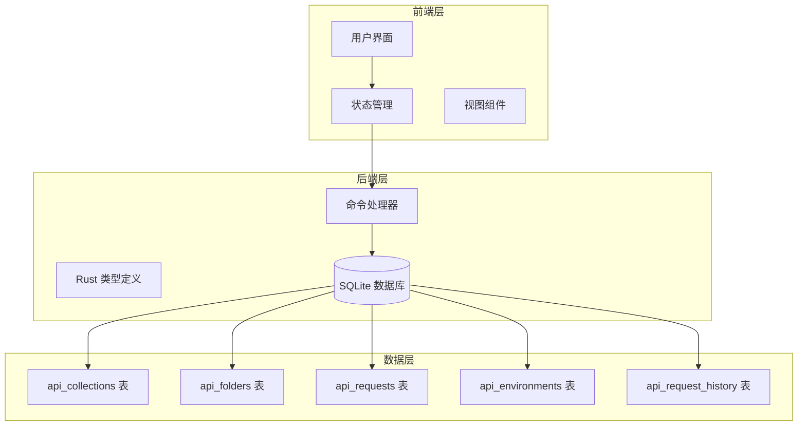
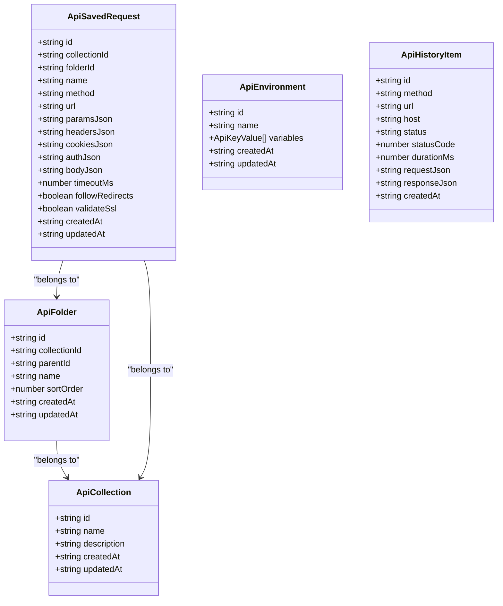
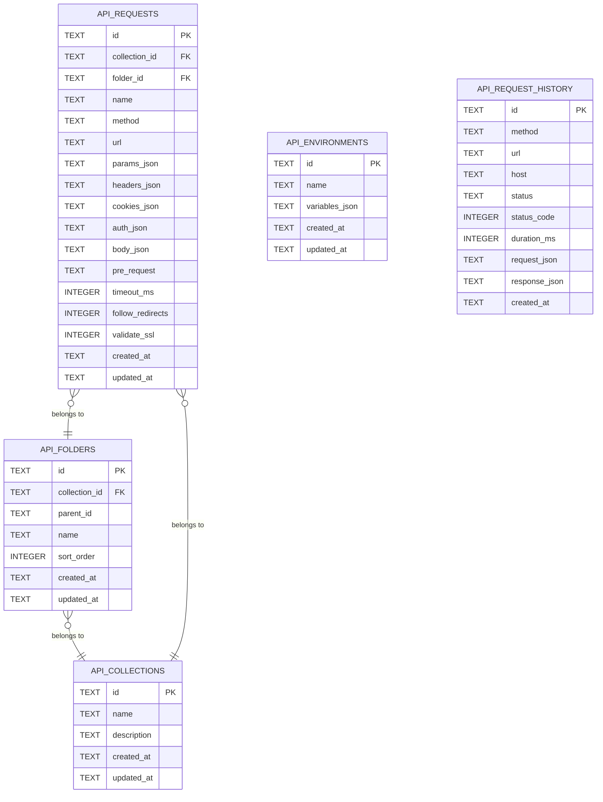
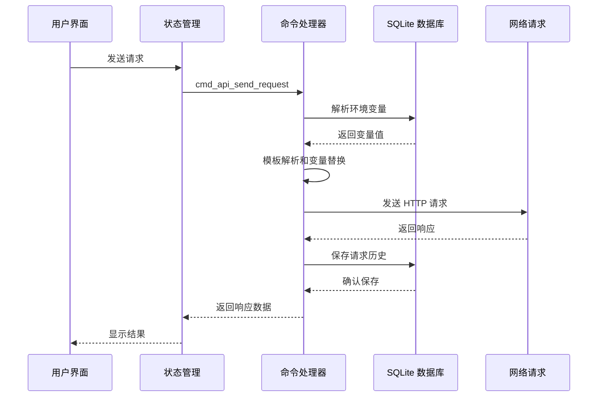
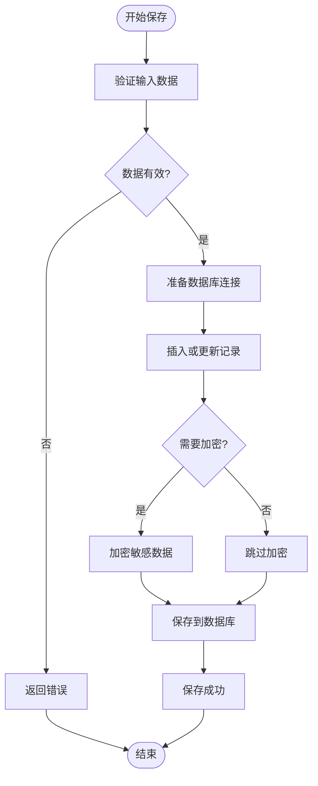

# API 测试相关表

<cite>
**本文档引用的文件**
- [types.ts](file://src/plugins/api-debugger/types.ts)
- [types.rs](file://src-tauri/src/plugins/api_debugger/types.rs)
- [commands.rs](file://src-tauri/src/plugins/api_debugger/commands.rs)
- [init.rs](file://src-tauri/src/db/init.rs)
- [CollectionsView.tsx](file://src/plugins/api-debugger/views/CollectionsView.tsx)
- [EnvironmentsView.tsx](file://src/plugins/api-debugger/views/EnvironmentsView.tsx)
- [HistoryView.tsx](file://src/plugins/api-debugger/views/HistoryView.tsx)
- [api-debugger.ts](file://src/plugins/api-debugger/store/api-debugger.ts)
- [api-debugger.ts](file://src/plugins/api-debugger/utils/api-debugger.ts)
</cite>

## 目录
1. [简介](#简介)
2. [项目结构概览](#项目结构概览)
3. [核心数据模型](#核心数据模型)
4. [表结构详细说明](#表结构详细说明)
5. [表间关系与约束](#表间关系与约束)
6. [数据流转流程](#数据流转流程)
7. [API 接口映射](#api-接口映射)
8. [使用示例](#使用示例)
9. [最佳实践](#最佳实践)
10. [故障排除指南](#故障排除指南)

## 简介

DevNexus 是一个功能强大的 API 测试工具，提供了完整的 API 集合管理、环境变量配置、请求历史记录等功能。本文档详细说明了 API 测试相关的数据库表设计，包括 api_collections、api_folders、api_requests、api_environments 和 api_request_history 表的结构、字段含义以及它们之间的关系。

## 项目结构概览

DevNexus 的 API 测试功能采用前后端分离架构：



**图表来源**
- [CollectionsView.tsx:1-166](file://src/plugins/api-debugger/views/CollectionsView.tsx#L1-L166)
- [api-debugger.ts:47-129](file://src/plugins/api-debugger/store/api-debugger.ts#L47-L129)
- [commands.rs:19-791](file://src-tauri/src/plugins/api_debugger/commands.rs#L19-L791)

## 核心数据模型

DevNexus 使用 TypeScript 和 Rust 双语言定义数据模型，确保前后端数据结构的一致性。



**图表来源**
- [types.ts:66-105](file://src/plugins/api-debugger/types.ts#L66-L105)
- [types.rs:84-170](file://src-tauri/src/plugins/api_debugger/types.rs#L84-L170)

## 表结构详细说明

### api_collections 表

api_collections 表用于存储 API 集合的基本信息，是整个 API 测试系统的核心组织单元。

| 字段名 | 数据类型 | 约束条件 | 描述 |
|--------|----------|----------|------|
| id | TEXT | PRIMARY KEY NOT NULL | 集合唯一标识符，UUID 格式 |
| name | TEXT | NOT NULL | 集合名称，如 "Production APIs" |
| description | TEXT | NULL | 集合描述信息 |
| created_at | TEXT | NOT NULL | 创建时间戳（RFC3339 格式） |
| updated_at | TEXT | NOT NULL | 更新时间戳（RFC3339 格式） |

**章节来源**
- [init.rs:179-185](file://src-tauri/src/db/init.rs#L179-L185)
- [types.ts:66](file://src/plugins/api-debugger/types.ts#L66)
- [types.rs:86-92](file://src-tauri/src/plugins/api_debugger/types.rs#L86-L92)

### api_folders 表

api_folders 表用于在集合内创建层次化的文件夹结构，支持嵌套文件夹管理。

| 字段名 | 数据类型 | 约束条件 | 描述 |
|--------|----------|----------|------|
| id | TEXT | PRIMARY KEY NOT NULL | 文件夹唯一标识符，UUID 格式 |
| collection_id | TEXT | NOT NULL | 所属集合的 ID，外键关联 api_collections |
| parent_id | TEXT | NULL | 父文件夹 ID，支持嵌套结构 |
| name | TEXT | NOT NULL | 文件夹名称 |
| sort_order | INTEGER | NOT NULL DEFAULT 0 | 排序权重，数值越大越靠前 |
| created_at | TEXT | NOT NULL | 创建时间戳（RFC3339 格式） |
| updated_at | TEXT | NOT NULL | 更新时间戳（RFC3339 格式） |

**章节来源**
- [init.rs:187-195](file://src-tauri/src/db/init.rs#L187-L195)
- [types.ts:67](file://src/plugins/api-debugger/types.ts#L67)
- [types.rs:96-104](file://src-tauri/src/plugins/api_debugger/types.rs#L96-L104)

### api_requests 表

api_requests 表存储所有保存的 API 请求配置，包含完整的请求参数和配置信息。

| 字段名 | 数据类型 | 约束条件 | 描述 |
|--------|----------|----------|------|
| id | TEXT | PRIMARY KEY NOT NULL | 请求唯一标识符，UUID 格式 |
| collection_id | TEXT | NULL | 所属集合的 ID，外键关联 api_collections |
| folder_id | TEXT | NULL | 所属文件夹的 ID，外键关联 api_folders |
| name | TEXT | NOT NULL | 请求名称 |
| method | TEXT | NOT NULL | HTTP 方法，如 "GET"、"POST" 等 |
| url | TEXT | NOT NULL | 请求 URL |
| params_json | TEXT | NOT NULL DEFAULT '[]' | 查询参数的 JSON 序列化字符串 |
| headers_json | TEXT | NOT NULL DEFAULT '[]' | 请求头的 JSON 序列化字符串 |
| cookies_json | TEXT | NOT NULL DEFAULT '[]' | Cookie 的 JSON 序列化字符串 |
| auth_json | TEXT | NOT NULL DEFAULT 'null' | 认证配置的 JSON 序列化字符串 |
| body_json | TEXT | NOT NULL DEFAULT 'null' | 请求体的 JSON 序列化字符串 |
| pre_request | TEXT | NULL | 预执行脚本内容 |
| timeout_ms | INTEGER | NOT NULL DEFAULT 30000 | 超时时间（毫秒），默认 30 秒 |
| follow_redirects | INTEGER | NOT NULL DEFAULT 1 | 是否跟随重定向（1/0 布尔值） |
| validate_ssl | INTEGER | NOT NULL DEFAULT 1 | 是否验证 SSL 证书（1/0 布尔值） |
| created_at | TEXT | NOT NULL | 创建时间戳（RFC3339 格式） |
| updated_at | TEXT | NOT NULL | 更新时间戳（RFC3339 格式） |

**章节来源**
- [init.rs:197-215](file://src-tauri/src/db/init.rs#L197-L215)
- [types.ts:70-87](file://src/plugins/api-debugger/types.ts#L70-L87)
- [types.rs:108-125](file://src-tauri/src/plugins/api_debugger/types.rs#L108-L125)

### api_environments 表

api_environments 表用于存储环境变量配置，支持多环境管理和敏感信息加密。

| 字段名 | 数据类型 | 约束条件 | 描述 |
|--------|----------|----------|------|
| id | TEXT | PRIMARY KEY NOT NULL | 环境唯一标识符，UUID 格式 |
| name | TEXT | NOT NULL | 环境名称，如 "Development"、"Production" |
| variables_json | TEXT | NOT NULL DEFAULT '[]' | 环境变量的 JSON 序列化字符串 |
| created_at | TEXT | NOT NULL | 创建时间戳（RFC3339 格式） |
| updated_at | TEXT | NOT NULL | 更新时间戳（RFC3339 格式） |

**章节来源**
- [init.rs:217-223](file://src-tauri/src/db/init.rs#L217-L223)
- [types.ts:68](file://src/plugins/api-debugger/types.ts#L68)
- [types.rs:139-145](file://src-tauri/src/plugins/api_debugger/types.rs#L139-L145)

### api_request_history 表

api_request_history 表记录所有 API 请求的历史信息，用于调试和审计。

| 字段名 | 数据类型 | 约束条件 | 描述 |
|--------|----------|----------|------|
| id | TEXT | PRIMARY KEY NOT NULL | 历史记录唯一标识符，UUID 格式 |
| method | TEXT | NOT NULL | HTTP 方法 |
| url | TEXT | NOT NULL | 完整请求 URL |
| host | TEXT | NULL | 主机名提取自 URL |
| status | TEXT | NOT NULL | 状态：'success' 或 'error' |
| status_code | INTEGER | NULL | HTTP 状态码 |
| duration_ms | INTEGER | NOT NULL DEFAULT 0 | 请求耗时（毫秒） |
| request_json | TEXT | NOT NULL | 请求详情的 JSON 序列化字符串 |
| response_json | TEXT | NOT NULL | 响应详情的 JSON 序列化字符串 |
| created_at | TEXT | NOT NULL | 创建时间戳（RFC3339 格式） |

**章节来源**
- [init.rs:225-236](file://src-tauri/src/db/init.rs#L225-L236)
- [types.ts:89-100](file://src/plugins/api-debugger/types.ts#L89-L100)
- [types.rs:149-160](file://src-tauri/src/plugins/api_debugger/types.rs#L149-L160)

## 表间关系与约束

DevNexus 中的 API 测试表之间存在清晰的层次关系和外键约束：



**图表来源**
- [init.rs:179-236](file://src-tauri/src/db/init.rs#L179-L236)

### 外键关系说明

1. **api_folders.collection_id → api_collections.id**
   - 每个文件夹必须属于一个有效的集合
   - 支持嵌套文件夹结构，通过 parent_id 实现层级关系

2. **api_requests.collection_id → api_collections.id**
   - 每个请求可以属于一个集合，也可以独立存在
   - 支持无集合的全局请求

3. **api_requests.folder_id → api_folders.id**
   - 每个请求可以属于一个文件夹
   - 支持无文件夹的直接请求

## 数据流转流程

### 请求发送流程



**图表来源**
- [commands.rs:404-475](file://src-tauri/src/plugins/api_debugger/commands.rs#L404-L475)
- [api-debugger.ts:62-72](file://src/plugins/api-debugger/store/api-debugger.ts#L62-L72)

### 数据保存流程



**图表来源**
- [commands.rs:588-617](file://src-tauri/src/plugins/api_debugger/commands.rs#L588-L617)
- [commands.rs:642-661](file://src-tauri/src/plugins/api_debugger/commands.rs#L642-L661)

## API 接口映射

### 集合管理接口

| 接口名称 | 功能描述 | 参数 | 返回值 |
|----------|----------|------|--------|
| cmd_api_list_collections | 获取所有集合列表 | 无 | ApiCollection[] |
| cmd_api_save_collection | 保存或更新集合 | id?, name, description? | string (新 ID) |
| cmd_api_delete_collection | 删除集合 | id | void |

### 文件夹管理接口

| 接口名称 | 功能描述 | 参数 | 返回值 |
|----------|----------|------|--------|
| cmd_api_list_folders | 获取文件夹列表 | collection_id? | ApiFolder[] |
| cmd_api_save_folder | 保存或更新文件夹 | id?, collection_id, parent_id?, name | string (新 ID) |
| cmd_api_delete_folder | 删除文件夹 | id | void |

### 请求管理接口

| 接口名称 | 功能描述 | 参数 | 返回值 |
|----------|----------|------|--------|
| cmd_api_list_requests | 获取请求列表 | collection_id? | ApiSavedRequest[] |
| cmd_api_save_request | 保存或更新请求 | form: ApiSaveRequestForm | string (新 ID) |
| cmd_api_delete_request | 删除请求 | id | void |

### 环境管理接口

| 接口名称 | 功能描述 | 参数 | 返回值 |
|----------|----------|------|--------|
| cmd_api_list_environments | 获取环境列表 | 无 | ApiEnvironment[] |
| cmd_api_save_environment | 保存或更新环境 | id?, name, variables | string (新 ID) |
| cmd_api_delete_environment | 删除环境 | id | void |

### 历史记录接口

| 接口名称 | 功能描述 | 参数 | 返回值 |
|----------|----------|------|--------|
| cmd_api_list_history | 获取历史记录 | filter? | ApiHistoryItem[] |
| cmd_api_delete_history | 删除历史记录 | id | void |
| cmd_api_clear_history | 清空历史记录 | 无 | void |

**章节来源**
- [commands.rs:483-710](file://src-tauri/src/plugins/api_debugger/commands.rs#L483-L710)

## 使用示例

### 创建 API 集合

```typescript
// 前端调用示例
const collectionId = await invoke<string>("cmd_api_save_collection", {
  name: "Production APIs",
  description: "生产环境 API 集合"
});
```

### 添加文件夹到集合

```typescript
// 在 "Production APIs" 集合下创建文件夹
const folderId = await invoke<string>("cmd_api_save_folder", {
  collectionId: collectionId,
  name: "User Management",
  parentId: null // 根级文件夹
});
```

### 保存 API 请求

```typescript
// 保存一个 GET 请求
const requestId = await invoke<string>("cmd_api_save_request", {
  form: {
    name: "Get User Profile",
    collectionId: collectionId,
    folderId: folderId,
    request: {
      method: "GET",
      url: "https://api.example.com/users/{{userId}}",
      params: [
        { key: "include", value: "profile", enabled: true }
      ],
      headers: [
        { key: "Authorization", value: "Bearer {{accessToken}}", enabled: true }
      ],
      auth: { authType: "none" },
      body: { bodyType: "none" },
      timeoutMs: 30000,
      followRedirects: true,
      validateSsl: true
    }
  }
});
```

### 使用环境变量

```typescript
// 创建开发环境
const envId = await invoke<string>("cmd_api_save_environment", {
  name: "Development",
  variables: [
    { key: "baseUrl", value: "https://dev-api.example.com", enabled: true },
    { key: "accessToken", value: "{{ENCRYPTED_TOKEN}}", enabled: true, secret: true }
  ]
});
```

## 最佳实践

### 数据组织建议

1. **集合命名规范**
   - 使用环境名称作为集合名：Production、Staging、Development
   - 避免使用特殊字符，保持简洁明了

2. **文件夹层级设计**
   - 按功能模块组织：User Management、Order Processing、Payment Gateway
   - 控制嵌套层级不超过 3 层，保持可读性

3. **请求命名策略**
   - 采用动词+名词格式：Get User Profile、Create Order
   - 包含版本信息：API v1、API v2

### 性能优化建议

1. **索引优化**
   - 为常用查询字段建立索引：collection_id、folder_id、created_at
   - 考虑添加复合索引优化复杂查询

2. **数据清理策略**
   - 定期清理历史记录，保留最近 30 天的数据
   - 删除不再使用的集合和文件夹

3. **批量操作**
   - 使用事务处理批量数据操作
   - 避免频繁的小事务操作

### 安全考虑

1. **敏感数据保护**
   - 将密码、令牌等敏感信息标记为 secret
   - 使用加密存储敏感变量值

2. **访问控制**
   - 限制对生产环境的访问权限
   - 审计所有 API 操作日志

## 故障排除指南

### 常见问题及解决方案

1. **数据库连接失败**
   ```bash
   # 检查数据库文件是否存在
   ls ~/.local/share/devnexus/devnexus.db
   
   # 检查文件权限
   chmod 644 ~/.local/share/devnexus/devnexus.db
   ```

2. **请求超时问题**
   - 检查网络连接状态
   - 调整 timeout_ms 参数值
   - 确认目标服务器可达性

3. **环境变量未生效**
   - 验证环境变量是否启用
   - 检查模板语法 {{variable}}
   - 确认变量名拼写正确

### 调试技巧

1. **启用详细日志**
   ```typescript
   // 在前端启用调试模式
   localStorage.setItem('debug', 'true');
   ```

2. **检查数据完整性**
   ```sql
   -- 验证外键约束
   PRAGMA foreign_key_check;
   
   -- 检查重复数据
   SELECT url, COUNT(*) FROM api_requests GROUP BY url HAVING COUNT(*) > 1;
   ```

3. **性能监控**
   ```sql
   -- 分析查询性能
   EXPLAIN QUERY PLAN SELECT * FROM api_requests WHERE collection_id = ?;
   ```

**章节来源**
- [commands.rs:391-401](file://src-tauri/src/plugins/api_debugger/commands.rs#L391-L401)
- [commands.rs:671-696](file://src-tauri/src/plugins/api_debugger/commands.rs#L671-L696)