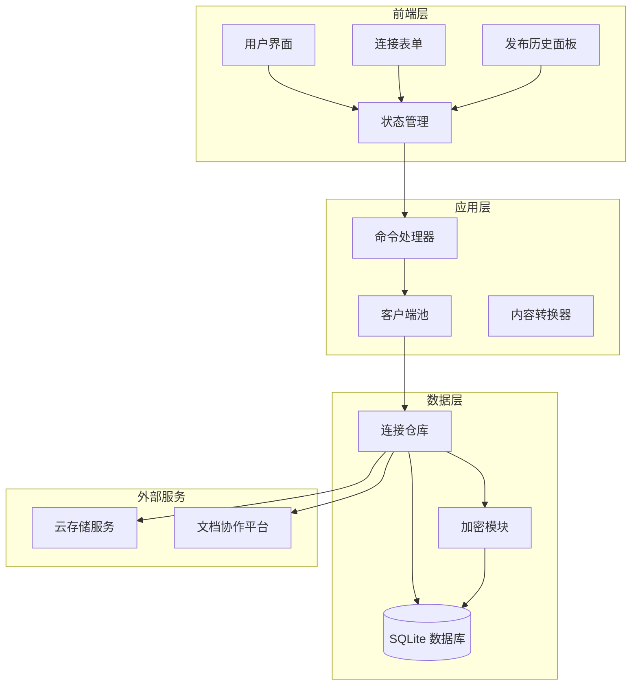
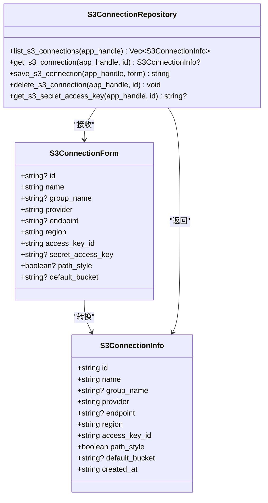
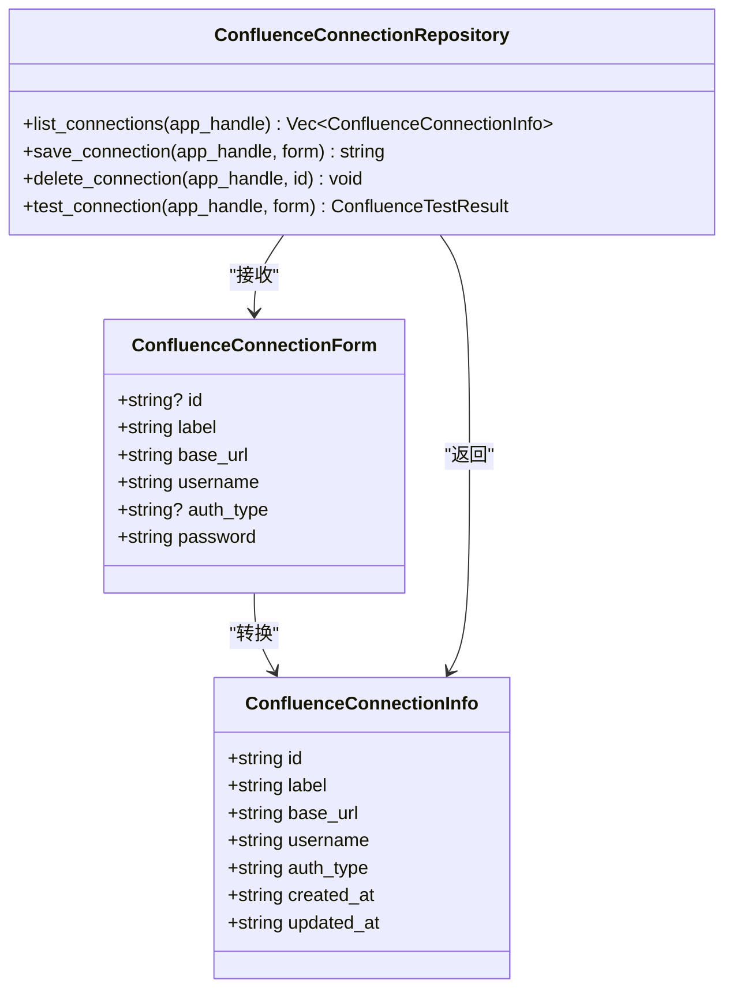
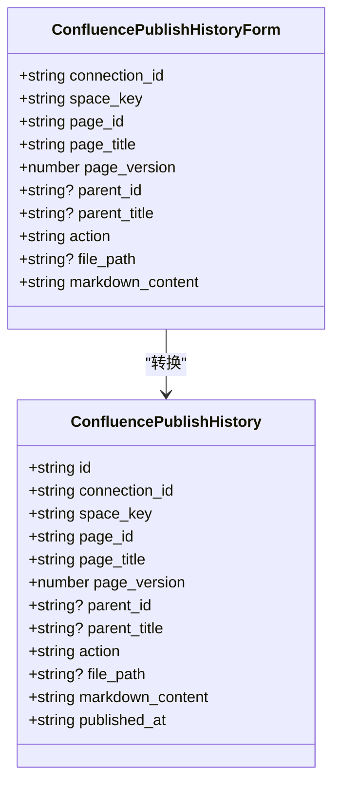
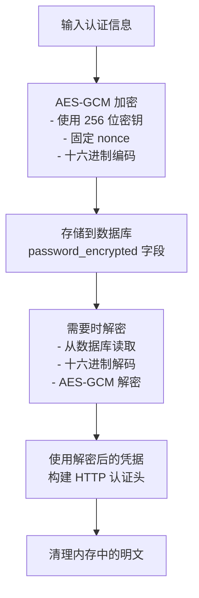

# 云存储连接表

<cite>
**本文档引用的文件**
- [s3_connection_repo.rs](file://src-tauri/src/db/s3_connection_repo.rs)
- [init.rs](file://src-tauri/src/db/init.rs)
- [s3-connections.ts](file://src/plugins/s3-client/store/s3-connections.ts)
- [types.ts](file://src/plugins/s3-client/types.ts)
- [S3ConnectionForm.tsx](file://src/plugins/s3-client/components/S3ConnectionForm.tsx)
- [commands.rs](file://src-tauri/src/plugins/s3/commands.rs)
- [client_pool.rs](file://src-tauri/src/plugins/s3/client_pool.rs)
- [mod.rs](file://src-tauri/src/plugins/s3/mod.rs)
- [mod.rs](file://src-tauri/src/crypto/mod.rs)
- [confluence.ts](file://src/plugins/confluence/store/confluence.ts)
- [types.ts](file://src/plugins/confluence/types.ts)
- [commands.rs](file://src-tauri/src/plugins/confluence/commands.rs)
- [client.rs](file://src-tauri/src/plugins/confluence/client.rs)
- [init.rs](file://src-tauri/src/db/init.rs)
</cite>

## 更新摘要
**变更内容**
- 新增 Confluence 文档协作平台集成支持
- 添加 confluence_connections 连接表结构说明
- 添加 confluence_publish_history 发布历史表结构说明
- 扩展云存储平台为多平台文档协作平台
- 新增认证类型支持（Basic 和 PAT/Bearer）
- 新增发布历史追踪功能

## 目录
1. [简介](#简介)
2. [平台架构概览](#平台架构概览)
3. [S3 云存储连接表](#s3-云存储连接表)
4. [Confluence 文档协作连接表](#confluence-文档协作连接表)
5. [发布历史追踪表](#发布历史追踪表)
6. [认证机制与安全](#认证机制与安全)
7. [最佳实践与配置指南](#最佳实践与配置指南)
8. [故障排除指南](#故障排除指南)
9. [总结](#总结)

## 简介

DevNexus 是一个功能丰富的开发者工具平台，现已扩展为支持多种云存储和文档协作平台的综合解决方案。本文档详细介绍平台的核心数据结构设计，包括原有的 S3 云存储连接表和新增的 Confluence 文档协作连接表及其发布历史追踪功能。

平台支持多种云存储提供商（AWS S3、MinIO、阿里云 OSS、腾讯云 COS、Cloudflare R2 等）和文档协作平台（如 Atlassian Confluence），通过统一的加密存储机制确保敏感凭据的安全管理，并提供完整的发布历史追踪功能。

## 平台架构概览

DevNexus 采用分层架构设计，支持多种连接类型和数据存储方式：

**图表来源**
- [confluence.ts:67-146](file://src/plugins/confluence/store/confluence.ts#L67-L146)
- [commands.rs:14-95](file://src-tauri/src/plugins/s3/commands.rs#L14-L95)
- [init.rs:353-393](file://src-tauri/src/db/init.rs#L353-L393)

## S3 云存储连接表

### 表结构设计

s3_connections 表采用 SQLite 关系型数据库存储，包含以下核心字段：

| 字段名 | 类型 | 默认值 | 说明 |
|--------|------|--------|------|
| id | TEXT | PRIMARY KEY | 连接唯一标识符 |
| name | TEXT | NOT NULL | 连接名称 |
| group_name | TEXT | NULL | 连接分组 |
| provider | TEXT | NOT NULL | 云存储提供商类型 |
| endpoint | TEXT | NULL | 自定义端点URL |
| region | TEXT | NOT NULL | 区域信息 |
| access_key_id | TEXT | NOT NULL | 访问密钥ID |
| secret_access_key_encrypted | TEXT | NOT NULL | 加密后的密钥 |
| path_style | INTEGER | 0 (默认) | 路径样式标志 |
| default_bucket | TEXT | NULL | 默认存储桶 |
| created_at | TEXT | NOT NULL | 创建时间戳 |

### 数据模型映射

**图表来源**
- [s3_connection_repo.rs:3-31](file://src-tauri/src/db/s3_connection_repo.rs#L3-L31)
- [init.rs:103-115](file://src-tauri/src/db/init.rs#L103-L115)

**章节来源**
- [s3_connection_repo.rs:3-31](file://src-tauri/src/db/s3_connection_repo.rs#L3-L31)
- [init.rs:103-115](file://src-tauri/src/db/init.rs#L103-L115)

## Confluence 文档协作连接表

### 表结构设计

confluence_connections 表专门用于存储 Confluence 文档协作平台的连接信息，支持多种认证方式：

| 字段名 | 类型 | 默认值 | 说明 |
|--------|------|--------|------|
| id | TEXT | PRIMARY KEY | 连接唯一标识符 |
| label | TEXT | NOT NULL | 连接标签名称 |
| base_url | TEXT | NOT NULL | Confluence 基础URL |
| username | TEXT | NOT NULL | 用户名 |
| auth_type | TEXT | 'basic' | 认证类型（basic/pat/bearer） |
| password_encrypted | TEXT | NOT NULL | 加密后的密码或令牌 |
| created_at | TEXT | NOT NULL | 创建时间戳 |
| updated_at | TEXT | NOT NULL | 更新时间戳 |

### 数据模型映射

**图表来源**
- [types.rs:3-22](file://src-tauri/src/plugins/confluence/types.rs#L3-L22)
- [commands.rs:21-46](file://src-tauri/src/plugins/confluence/commands.rs#L21-L46)

**章节来源**
- [types.rs:3-22](file://src-tauri/src/plugins/confluence/types.rs#L3-L22)
- [commands.rs:21-46](file://src-tauri/src/plugins/confluence/commands.rs#L21-L46)

## 发布历史追踪表

### 表结构设计

confluence_publish_history 表用于追踪所有文档发布活动，提供完整的审计和回溯能力：

| 字段名 | 类型 | 默认值 | 说明 |
|--------|------|--------|------|
| id | TEXT | PRIMARY KEY | 历史记录唯一标识符 |
| connection_id | TEXT | NOT NULL | 关联的连接ID |
| space_key | TEXT | NOT NULL | 空间键 |
| page_id | TEXT | NOT NULL | 页面ID |
| page_title | TEXT | NOT NULL | 页面标题 |
| page_version | INTEGER | 1 | 页面版本号 |
| parent_id | TEXT | NULL | 父页面ID |
| parent_title | TEXT | NULL | 父页面标题 |
| action | TEXT | NOT NULL | 操作类型（create/update） |
| file_path | TEXT | NULL | 关联文件路径 |
| markdown_content | TEXT | NOT NULL | 发布的Markdown内容 |
| published_at | TEXT | NOT NULL | 发布时间戳 |

### 发布历史数据模型

**图表来源**
- [types.rs:58-86](file://src-tauri/src/plugins/confluence/types.rs#L58-L86)
- [commands.rs:241-292](file://src-tauri/src/plugins/confluence/commands.rs#L241-L292)

**章节来源**
- [types.rs:58-86](file://src-tauri/src/plugins/confluence/types.rs#L58-L86)
- [commands.rs:241-292](file://src-tauri/src/plugins/confluence/commands.rs#L241-L292)

## 认证机制与安全

### 多重认证支持

平台支持两种主要的认证方式：

1. **Basic 认证**：
   - 用户名 + 密码组合
   - 标准的 HTTP Basic 认证头
   - 适用于传统用户名密码认证

2. **PAT/Bearer 认证**：
   - 个人访问令牌（Personal Access Token）
   - Bearer Token 认证方式
   - 更安全的认证方式，适合 SSO 和现代认证系统

### 加密存储机制

所有敏感信息都通过 AES-GCM 加密算法进行安全存储：

**图表来源**
- [mod.rs:40-74](file://src-tauri/src/crypto/mod.rs#L40-L74)

**章节来源**
- [client.rs:15-36](file://src-tauri/src/plugins/confluence/client.rs#L15-L36)
- [mod.rs:1-75](file://src-tauri/src/crypto/mod.rs#L1-L75)

## 最佳实践与配置指南

### S3 连接配置最佳实践

1. **提供商选择**：
   - AWS S3：使用默认端点和区域配置
   - MinIO：启用路径样式，使用自定义端点
   - 兼容服务：根据提供商文档配置相应参数

2. **安全配置**：
   - 使用最小权限原则分配 IAM 角色
   - 定期轮换访问密钥
   - 启用服务器端加密

### Confluence 连接配置最佳实践

1. **认证类型选择**：
   - 优先使用 PAT/Bearer 认证
   - 仅在必要时使用 Basic 认证
   - 确保令牌具有适当的权限范围

2. **连接测试**：
   - 发布前进行连接测试
   - 验证空间访问权限
   - 检查网络连通性

### 发布历史管理

1. **历史保留策略**：
   - 建议保留最近 200 条发布记录
   - 定期清理过期的历史记录
   - 备份重要发布历史

2. **版本控制**：
   - 利用页面版本号进行冲突解决
   - 在并发编辑时使用版本比较
   - 建立发布前的版本审查流程

**章节来源**
- [ConnectionSettings.tsx:1-27](file://src/plugins/confluence/components/ConnectionSettings.tsx#L1-L27)
- [confluence.ts:84-146](file://src/plugins/confluence/store/confluence.ts#L84-L146)

## 故障排除指南

### S3 连接问题

**常见问题**：
- **路径样式问题**：某些 S3 兼容服务需要启用路径样式
- **区域配置错误**：确保 endpoint 和 region 匹配
- **权限不足**：检查 IAM 策略和桶策略

**解决方案**：
1. 验证网络连接和 DNS 解析
2. 检查访问密钥和密钥 ID 的有效性
3. 确认端点 URL 格式正确
4. 测试不同路径样式配置

### Confluence 连接问题

**常见问题**：
- **认证失败**：检查用户名密码或令牌有效性
- **权限不足**：验证用户在目标空间的权限
- **网络连接**：确认能够访问 Confluence 实例

**解决方案**：
1. 验证 Confluence URL 和网络可达性
2. 测试不同认证类型的连接
3. 检查防火墙和代理设置
4. 确认用户具有必要的空间访问权限

### 发布历史问题

**常见问题**：
- **历史记录缺失**：检查数据库连接和表结构
- **版本冲突**：页面版本号不匹配导致更新失败
- **内容丢失**：发布历史中的 Markdown 内容被修改

**解决方案**：
1. 验证 confluence_publish_history 表的完整性
2. 检查页面版本号同步状态
3. 备份重要发布历史记录
4. 实施定期的数据完整性检查

**章节来源**
- [client.rs:38-59](file://src-tauri/src/plugins/confluence/client.rs#L38-L59)
- [commands.rs:36-80](file://src-tauri/src/plugins/s3/commands.rs#L36-L80)

## 总结

DevNexus 平台通过其精心设计的数据库架构，成功地将传统的云存储连接管理扩展为支持多种文档协作平台的综合解决方案：

### 核心优势

1. **统一架构**：S3 连接表和 Confluence 连接表共享相同的加密存储机制
2. **安全可靠**：通过 AES-GCM 加密确保所有敏感凭据的安全
3. **灵活扩展**：支持多种认证方式和连接类型
4. **完整追踪**：Confluence 发布历史表提供完整的审计能力
5. **易于维护**：清晰的表结构设计便于数据库迁移和升级

### 技术创新

- **多平台支持**：从单一云存储扩展到文档协作平台
- **智能认证**：支持 Basic 和 PAT 两种认证方式
- **历史追踪**：提供完整的发布活动审计功能
- **性能优化**：客户端池化和连接复用机制

### 应用价值

DevNexus 平台为开发者和团队提供了强大的文档协作和云存储管理能力，满足了从个人开发者到企业用户的多样化需求。通过统一的安全机制和灵活的配置选项，平台确保了数据的安全性和系统的可靠性。