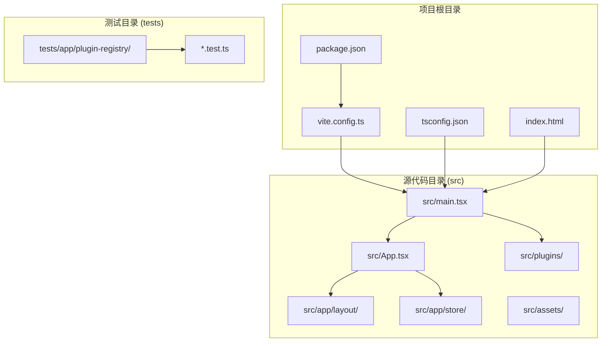
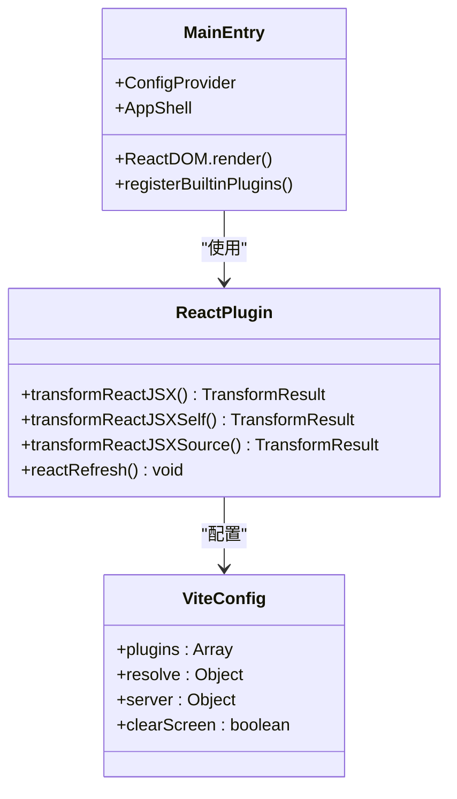
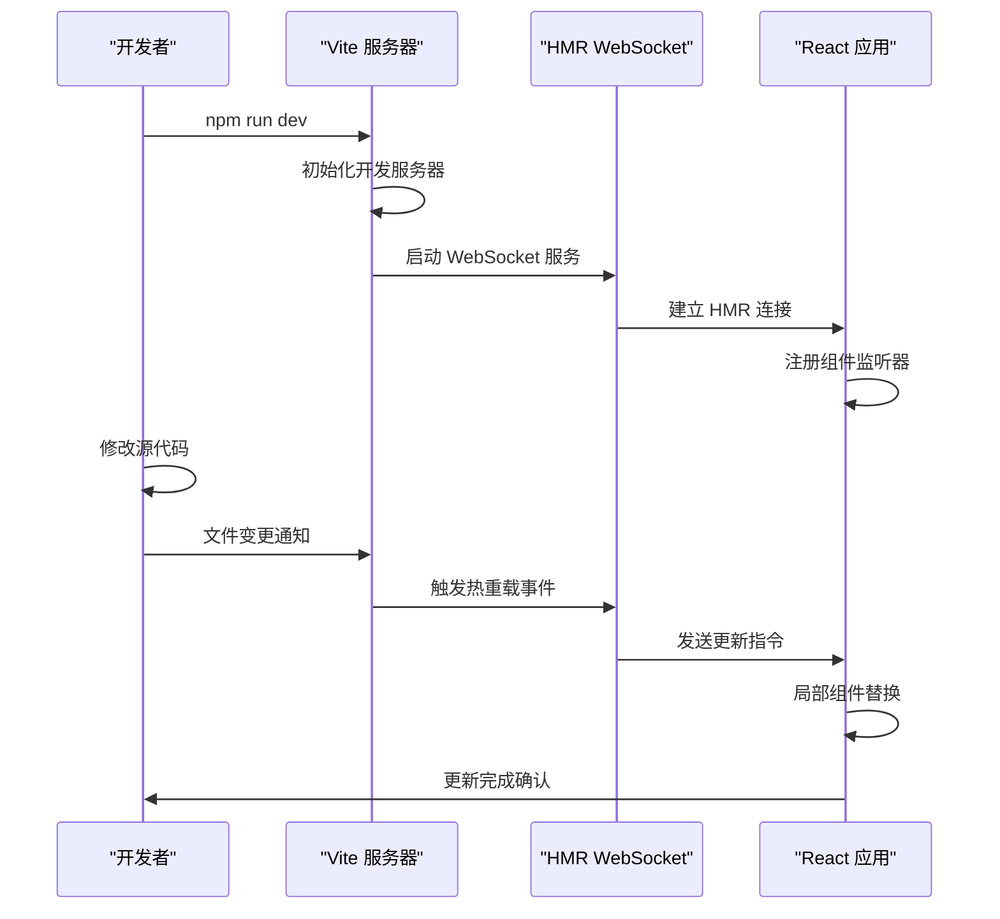
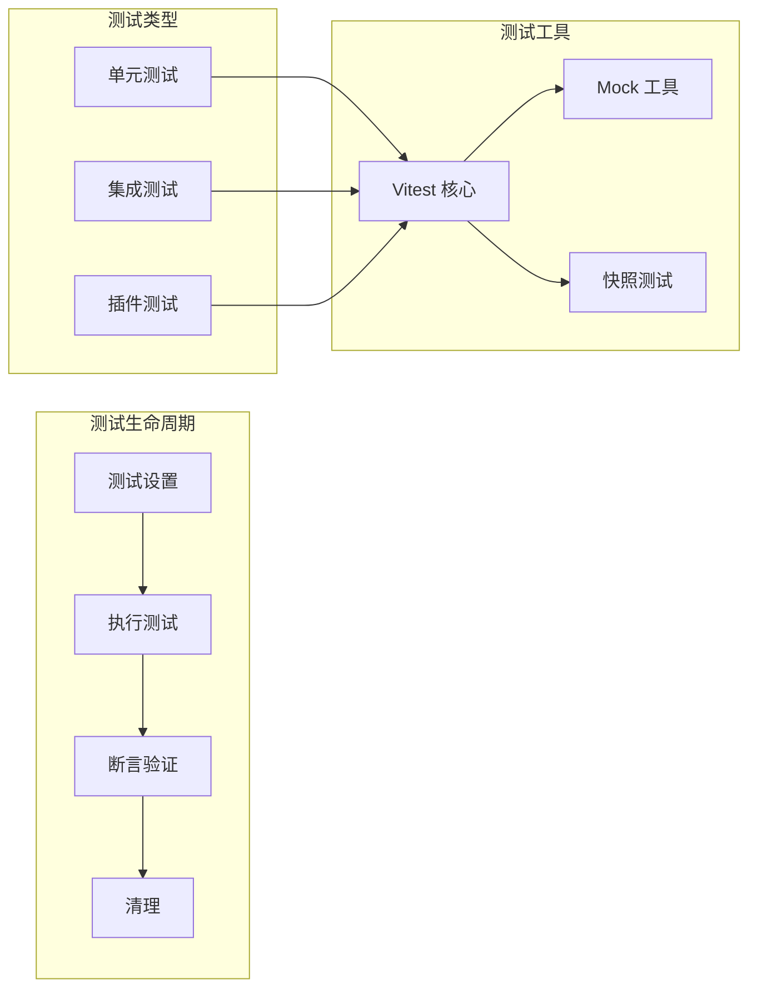
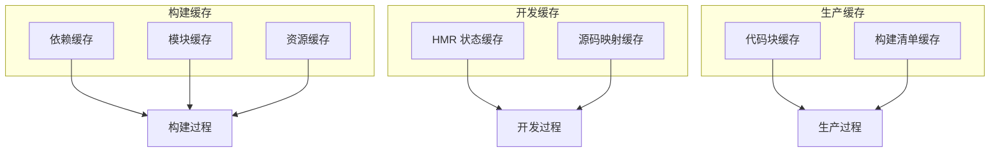

# 前端构建配置

<cite>
**本文档引用的文件**
- [vite.config.ts](file://vite.config.ts)
- [package.json](file://package.json)
- [tsconfig.json](file://tsconfig.json)
- [tsconfig.node.json](file://tsconfig.node.json)
- [index.html](file://index.html)
- [src/main.tsx](file://src/main.tsx)
- [src/App.tsx](file://src/App.tsx)
- [src/vite-env.d.ts](file://src/vite-env.d.ts)
- [tests/app/plugin-registry/registry.test.ts](file://tests/app/plugin-registry/registry.test.ts)
- [tests/app/plugin-registry/builtin.test.ts](file://tests/app/plugin-registry/builtin.test.ts)
</cite>

## 目录
1. [简介](#简介)
2. [项目结构](#项目结构)
3. [核心组件](#核心组件)
4. [架构概览](#架构概览)
5. [详细组件分析](#详细组件分析)
6. [依赖关系分析](#依赖关系分析)
7. [性能考虑](#性能考虑)
8. [故障排除指南](#故障排除指南)
9. [结论](#结论)

## 简介

DevNexus 是一个基于 Tauri 的桌面应用程序，前端采用 React + TypeScript + Vite 技术栈构建。本文档深入解析其构建配置，涵盖开发服务器设置、路径别名配置、测试配置、插件系统以及代码分割策略等核心内容。

## 项目结构

该项目采用标准的 Vite + React + TypeScript 项目结构：



**图表来源**
- [vite.config.ts:1-42](file://vite.config.ts#L1-L42)
- [package.json:1-40](file://package.json#L1-L40)
- [tsconfig.json:1-30](file://tsconfig.json#L1-L30)

**章节来源**
- [vite.config.ts:1-42](file://vite.config.ts#L1-L42)
- [package.json:1-40](file://package.json#L1-L40)
- [tsconfig.json:1-30](file://tsconfig.json#L1-L30)

## 核心组件

### Vite 构建配置

Vite 配置文件提供了完整的开发和构建支持：

#### 插件系统
- **React 插件**: 使用 [@vitejs/plugin-react](file://vite.config.ts#L2) 提供 React JSX 转换和开发时 HMR 支持
- **自动刷新**: 集成 react-refresh 实现快速组件更新

#### 路径别名配置
- **@ 符号别名**: 指向 `src` 目录，简化模块导入路径
- **TypeScript 配置**: 在 tsconfig.json 中同步配置路径映射

#### 开发服务器设置
- **固定端口**: 开发服务器使用 1420 端口，确保与 Tauri 配置一致
- **严格端口模式**: 当端口被占用时直接失败，避免端口冲突
- **主机绑定**: 支持通过环境变量 `TAURI_DEV_HOST` 绑定特定主机地址
- **热重载配置**: 在远程开发时启用 WebSocket HMR，使用 1421 端口

**章节来源**
- [vite.config.ts:9-41](file://vite.config.ts#L9-L41)
- [tsconfig.json:17-19](file://tsconfig.json#L17-L19)

### 测试配置

项目集成了 Vitest 测试框架：

#### 测试范围
- **测试文件模式**: `tests/**/*.test.ts`
- **测试命令**: 
  - `npm test`: 运行所有测试
  - `npm run test:watch`: 监听模式运行测试

#### 测试覆盖
- **插件注册测试**: 验证插件注册机制的正确性
- **内置插件测试**: 测试各内置插件的注册功能

**章节来源**
- [vite.config.ts:16-18](file://vite.config.ts#L16-L18)
- [package.json:10-11](file://package.json#L10-L11)
- [tests/app/plugin-registry/registry.test.ts:1-40](file://tests/app/plugin-registry/registry.test.ts#L1-L40)

### TypeScript 配置

#### 编译选项
- **目标版本**: ES2020
- **模块系统**: ESNext + Bundler 模式
- **严格模式**: 启用严格类型检查
- **JSX 处理**: 使用 react-jsx 编译器选项

#### 路径映射
- **baseUrl**: 项目根目录
- **@/* 映射**: 指向 src 目录下的对应文件

**章节来源**
- [tsconfig.json:2-26](file://tsconfig.json#L2-L26)
- [tsconfig.node.json:1-11](file://tsconfig.node.json#L1-L11)

## 架构概览

DevNexus 的前端架构采用模块化设计，结合 Tauri 的桌面应用特性：

```mermaid
graph TB
subgraph "开发环境"
DEV[Vite 开发服务器<br/>端口: 1420]
HMR[HMR WebSocket<br/>端口: 1421]
HOST[Tauri 主机绑定]
end
subgraph "构建流程"
SRC[源代码<br/>src/]
ALIAS[路径别名<br/>@ -> src]
TRANSPILE[编译转换<br/>TypeScript/JSX]
OPTIMIZE[代码优化<br/>Tree Shaking]
end
subgraph "测试环境"
VITEST[Vitest 测试框架]
UNIT_TESTS[单元测试<br/>tests/]
end
subgraph "运行时"
MAIN[src/main.tsx]
APP[src/App.tsx]
LAYOUT[应用布局]
PLUGINS[插件系统]
end
DEV --> HMR
DEV --> HOST
SRC --> ALIAS
ALIAS --> TRANSPILE
TRANSPILE --> OPTIMIZE
VITEST --> UNIT_TESTS
OPTIMIZE --> MAIN
MAIN --> APP
APP --> LAYOUT
APP --> PLUGINS
```

**图表来源**
- [vite.config.ts:25-35](file://vite.config.ts#L25-L35)
- [src/main.tsx:1-38](file://src/main.tsx#L1-L38)
- [src/App.tsx:1-11](file://src/App.tsx#L1-L11)

## 详细组件分析

### React 插件配置

React 插件提供了完整的开发体验：



**图表来源**
- [vite.config.ts:10](file://vite.config.ts#L10)
- [src/main.tsx:10](file://src/main.tsx#L10)

#### 插件特性
- **JSX 转换**: 自动处理 React JSX 语法
- **开发时刷新**: 集成 react-refresh 实现实时组件更新
- **源码映射**: 生成准确的调试信息

**章节来源**
- [vite.config.ts:10](file://vite.config.ts#L10)
- [src/main.tsx:10](file://src/main.tsx#L10)

### 路径别名系统

路径别名配置实现了模块导入的统一管理：

```mermaid
flowchart TD
START[模块导入请求] --> CHECK_ALIAS{检查 @ 别名}
CHECK_ALIAS --> |是| RESOLVE_PATH[解析到 src 目录]
CHECK_ALIAS --> |否| NORMAL_RESOLVE[正常模块解析]
RESOLVE_PATH --> MAP_TO_SRC[映射到实际路径]
NORMAL_RESOLVE --> CONTINUE[继续解析]
MAP_TO_SRC --> END[返回最终路径]
CONTINUE --> END
subgraph "配置映射"
TS_CONFIG[tsconfig.json<br/>@/* -> src/*]
VITE_CONFIG[vite.config.ts<br/>alias: '@' -> src]
end
TS_CONFIG --> RESOLVE_PATH
VITE_CONFIG --> RESOLVE_PATH
```

**图表来源**
- [tsconfig.json:17-19](file://tsconfig.json#L17-L19)
- [vite.config.ts:12-14](file://vite.config.ts#L12-L14)

#### 配置一致性
- **TypeScript 支持**: 编译时路径解析
- **Vite 支持**: 开发时路径解析
- **IDE 支持**: 智能提示和跳转

**章节来源**
- [tsconfig.json:17-19](file://tsconfig.json#L17-L19)
- [vite.config.ts:12-14](file://vite.config.ts#L12-L14)

### 开发服务器配置

开发服务器针对 Tauri 环境进行了专门优化：



**图表来源**
- [vite.config.ts:25-35](file://vite.config.ts#L25-L35)

#### 关键配置项
- **端口固定**: 1420 确保与 Tauri 配置一致
- **严格端口**: 防止端口冲突导致的意外行为
- **主机绑定**: 支持远程开发场景
- **HMR 配置**: WebSocket 协议和独立端口

**章节来源**
- [vite.config.ts:25-35](file://vite.config.ts#L25-L35)

### 测试框架集成

Vitest 提供了高效的测试解决方案：



**图表来源**
- [tests/app/plugin-registry/registry.test.ts:20-39](file://tests/app/plugin-registry/registry.test.ts#L20-L39)
- [tests/app/plugin-registry/builtin.test.ts:8-29](file://tests/app/plugin-registry/builtin.test.ts#L8-L29)

#### 测试策略
- **插件注册测试**: 验证插件注册逻辑
- **排序功能测试**: 确保插件按正确顺序显示
- **去重机制测试**: 防止重复注册同一插件

**章节来源**
- [tests/app/plugin-registry/registry.test.ts:1-40](file://tests/app/plugin-registry/registry.test.ts#L1-L40)
- [tests/app/plugin-registry/builtin.test.ts:1-31](file://tests/app/plugin-registry/builtin.test.ts#L1-L31)

## 依赖关系分析

项目依赖关系展现了清晰的层次结构：

```mermaid
graph TB
subgraph "运行时依赖"
REACT[react: ^19.1.0]
REACT_DOM[react-dom: ^19.1.0]
ANTD[antd: ^6.3.7]
TAURI_API[@tauri-apps/api: 2.10.1]
XTERM[xterm: ^5.3.0]
end
subgraph "开发时依赖"
VITE[vite: ^7.0.4]
REACT_PLUGIN[@vitejs/plugin-react: ^4.6.0]
TYPESCRIPT[typescript: ~5.8.3]
VITEST[vitest: ^4.1.5]
TAURI_CLI[@tauri-apps/cli: ^2]
end
subgraph "类型定义"
TYPES_REACT[@types/react: ^19.1.8]
TYPES_REACT_DOM[@types/react-dom: ^19.1.6]
end
REACT --> REACT_DOM
REACT --> ANTD
REACT --> XTERM
VITE --> REACT_PLUGIN
TYPESCRIPT --> VITE
VITEST --> VITE
```

**图表来源**
- [package.json:15-38](file://package.json#L15-L38)

**章节来源**
- [package.json:15-38](file://package.json#L15-L38)

## 性能考虑

### 代码分割策略

项目当前采用以下代码分割策略：

#### 动态导入
- **插件系统**: 通过动态导入实现插件的按需加载
- **路由分割**: 可扩展的路由级代码分割方案

#### 依赖优化
- **预构建**: Vite 自动进行依赖预构建
- **Tree Shaking**: TypeScript 和 Rollup 配合实现无用代码删除

### 缓存策略



### 性能优化建议

1. **依赖预构建优化**
   - 定期清理 node_modules/.vite 缓存目录
   - 使用 `optimizeDeps.exclude` 排除不需要预构建的包

2. **动态导入策略**
   - 对大型第三方库使用动态导入
   - 实现插件级别的懒加载

3. **资源优化**
   - 配置适当的资源大小阈值
   - 启用压缩和最小化

## 故障排除指南

### 常见构建问题

#### 端口冲突
**问题症状**: 开发服务器启动失败
**解决方法**: 
- 检查 1420 端口占用情况
- 设置 `TAURI_DEV_HOST` 环境变量使用其他主机地址

#### HMR 连接失败
**问题症状**: 页面无法热重载更新
**解决方法**:
- 确认 WebSocket 端口 1421 可用
- 检查防火墙设置允许 WebSocket 连接

#### 路径解析错误
**问题症状**: 模块导入失败
**解决方法**:
- 验证 tsconfig.json 中的路径映射
- 检查 @ 符号别名配置是否正确

#### 测试运行问题
**问题症状**: 测试无法找到或运行
**解决方法**:
- 确认测试文件路径符合 `tests/**/*.test.ts` 模式
- 检查测试依赖是否正确安装

**章节来源**
- [vite.config.ts:25-35](file://vite.config.ts#L25-L35)
- [tsconfig.json:17-19](file://tsconfig.json#L17-L19)

## 结论

DevNexus 的前端构建配置展现了现代化的开发实践，通过精心设计的 Vite 配置、TypeScript 类型系统和测试框架，为复杂的桌面应用提供了稳定可靠的开发基础。配置特点包括：

- **高度定制化**: 针对 Tauri 环境的专用配置
- **开发友好**: 完善的热重载和错误处理机制
- **类型安全**: 强类型的 TypeScript 配置
- **测试完备**: 全面的单元测试覆盖
- **可扩展性**: 模块化的插件系统架构

这些配置为后续的功能扩展和性能优化奠定了坚实的基础，同时保持了良好的开发体验和维护性。