# 版本与发布管理

<cite>
**本文档引用的文件**
- [package.json](file://package.json)
- [src-tauri/Cargo.toml](file://src-tauri/Cargo.toml)
- [src-tauri/tauri.conf.json](file://src-tauri/tauri.conf.json)
- [.github/workflows/release.yml](file://.github/workflows/release.yml)
- [.github/workflows/build-desktop.yml](file://.github/workflows/build-desktop.yml)
- [README.md](file://README.md)
- [PLAN.md](file://PLAN.md)
- [docs/releases/v0.9.3.md](file://docs/releases/v0.9.3.md)
- [docs/releases/v0.9.2.md](file://docs/releases/v0.9.2.md)
- [tests/app/status-bar.test.ts](file://tests/app/status-bar.test.ts)
- [tests/app/plugin-registry/registry.test.ts](file://tests/app/plugin-registry/registry.test.ts)
</cite>

## 目录
1. [简介](#简介)
2. [项目结构](#项目结构)
3. [核心组件](#核心组件)
4. [架构概览](#架构概览)
5. [详细组件分析](#详细组件分析)
6. [依赖关系分析](#依赖关系分析)
7. [性能考虑](#性能考虑)
8. [故障排除指南](#故障排除指南)
9. [结论](#结论)
10. [附录](#附录)

## 简介

DevNexus 是一个基于 Tauri 2 + React 19 + TypeScript + Rust 的插件化桌面工具箱，当前版本为 0.9.3。该项目采用现代化的版本管理策略，实现了完整的 CI/CD 发布流水线，支持 Windows、macOS 和 Linux 三大平台的自动化构建和发布。

## 项目结构

DevNexus 项目采用清晰的分层架构设计，主要包含以下核心目录：

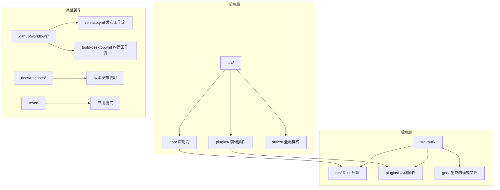

**图表来源**
- [README.md:56-93](file://README.md#L56-L93)
- [.github/workflows/release.yml:1-178](file://.github/workflows/release.yml#L1-L178)

**章节来源**
- [README.md:56-93](file://README.md#L56-L93)
- [package.json:1-40](file://package.json#L1-L40)
- [src-tauri/Cargo.toml:1-48](file://src-tauri/Cargo.toml#L1-L48)

## 核心组件

### 版本管理系统

DevNexus 采用了多层面的版本管理策略，确保前后端版本的一致性和可追溯性：

#### 1. 语义化版本控制
- **版本格式**: 遵循语义化版本 2.0.0 标准 (MAJOR.MINOR.PATCH)
- **版本范围**: 当前版本为 0.9.3，采用主版本 0 表示开发阶段
- **版本演进**: 从 0.1.0 到 0.9.3 的稳定增长轨迹

#### 2. 版本同步机制
项目实现了严格的版本同步策略：

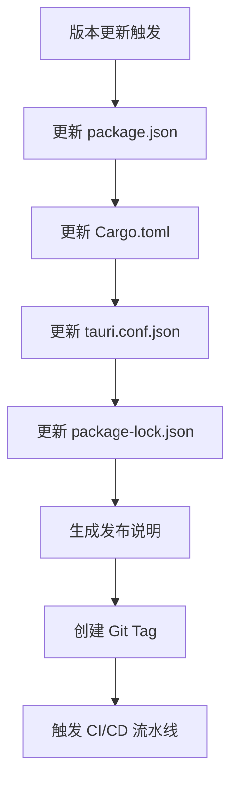

**图表来源**
- [README.md:167-177](file://README.md#L167-L177)
- [PLAN.md:1706-1710](file://PLAN.md#L1706-L1710)

#### 3. 发布分支管理
- **主要分支**: `main` 分支用于稳定发布
- **工作流分离**: 构建和发布工作流相互独立
- **标签驱动**: 使用 `v*` 标签触发发布流程

**章节来源**
- [package.json:4](file://package.json#L4)
- [src-tauri/Cargo.toml:3](file://src-tauri/Cargo.toml#L3)
- [src-tauri/tauri.conf.json:4](file://src-tauri/tauri.conf.json#L4)
- [.github/workflows/release.yml:3-6](file://.github/workflows/release.yml#L3-L6)

### 变更日志维护流程

#### 1. 变更分类
DevNexus 的变更日志采用结构化的分类方式：

| 变更类别 | 描述 | 示例 |
|---------|------|------|
| **Highlights** | 主要功能亮点 | 新增插件、重要改进 |
| **Features** | 新功能特性 | 用户界面改进、新工具 |
| **Bug Fixes** | 问题修复 | 性能优化、稳定性提升 |
| **Validation** | 验证步骤 | 测试用例、构建验证 |

#### 2. 格式标准化
发布说明遵循统一的 Markdown 格式：

```markdown
# DevNexus v0.9.3

## Highlights
- 主要功能亮点描述

## Features  
- 新功能详细说明

## Bug Fixes
- 问题修复详情

## Validation
- 验证步骤列表
```

#### 3. 自动化生成
通过 GitHub Actions 实现发布说明的自动化处理：

**章节来源**
- [docs/releases/v0.9.3.md:1-20](file://docs/releases/v0.9.3.md#L1-L20)
- [docs/releases/v0.9.2.md:1-32](file://docs/releases/v0.9.2.md#L1-L32)

### 发布标签管理

#### 1. Git 标签创建
发布流程严格遵循标签驱动的发布策略：

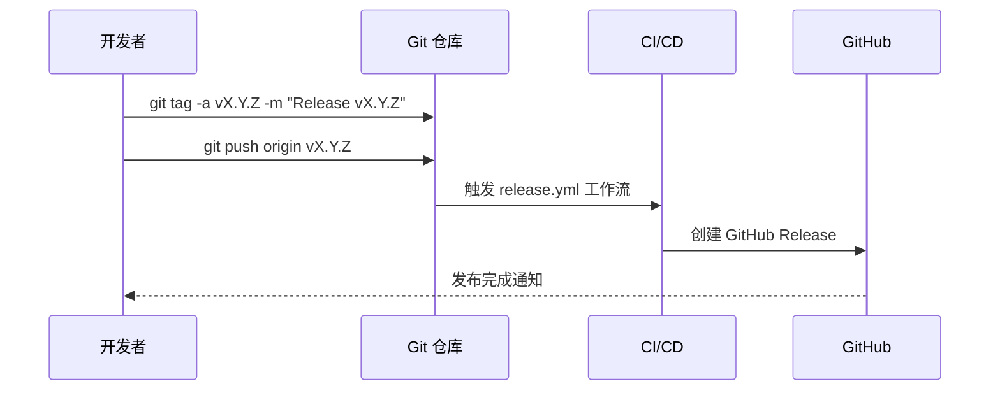

**图表来源**
- [.github/workflows/release.yml:166-178](file://.github/workflows/release.yml#L166-L178)

#### 2. 发布说明编写
每个版本都配有详细的发布说明，包含：
- 功能亮点摘要
- 具体改进描述
- 验证步骤清单
- 已知限制说明

#### 3. 资产发布流程
多平台构建和资产发布的完整流程：

**章节来源**
- [.github/workflows/release.yml:11-178](file://.github/workflows/release.yml#L11-L178)

### 版本兼容性管理

#### 1. 依赖版本锁定
项目采用精确的依赖版本管理策略：

| 依赖类型 | 管理方式 | 版本范围 |
|---------|---------|---------|
| **前端依赖** | 精确版本 | `^x.y.z` |
| **开发依赖** | 精确版本 | `~版本号` |
| **Rust 依赖** | 精确版本 | `版本号` |
| **Tauri 版本** | 同步锁定 | `2.x.x` |

#### 2. 向后兼容性保证
- **API 稳定性**: 保持插件接口的向后兼容
- **数据迁移**: SQLite 数据库的版本迁移策略
- **配置兼容**: Tauri 配置的向后兼容性

#### 3. 弃用策略
项目建立了清晰的弃用和迁移策略：
- **弃用通知**: 在多个版本前发出弃用警告
- **迁移指南**: 提供详细的迁移步骤
- **渐进式淘汰**: 逐步移除旧功能

**章节来源**
- [package.json:15-38](file://package.json#L15-L38)
- [src-tauri/Cargo.toml:20-48](file://src-tauri/Cargo.toml#L20-L48)

## 架构概览

DevNexus 的版本与发布管理架构采用分层设计，确保版本控制的完整性和可追溯性：

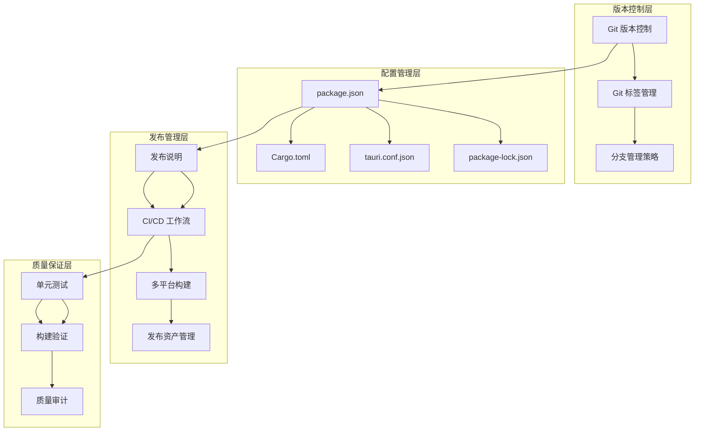

**图表来源**
- [README.md:158-177](file://README.md#L158-L177)
- [.github/workflows/release.yml:1-178](file://.github/workflows/release.yml#L1-L178)

## 详细组件分析

### CI/CD 工作流分析

#### 1. 发布工作流 (release.yml)
发布工作流是 DevNexus 版本管理的核心组件：

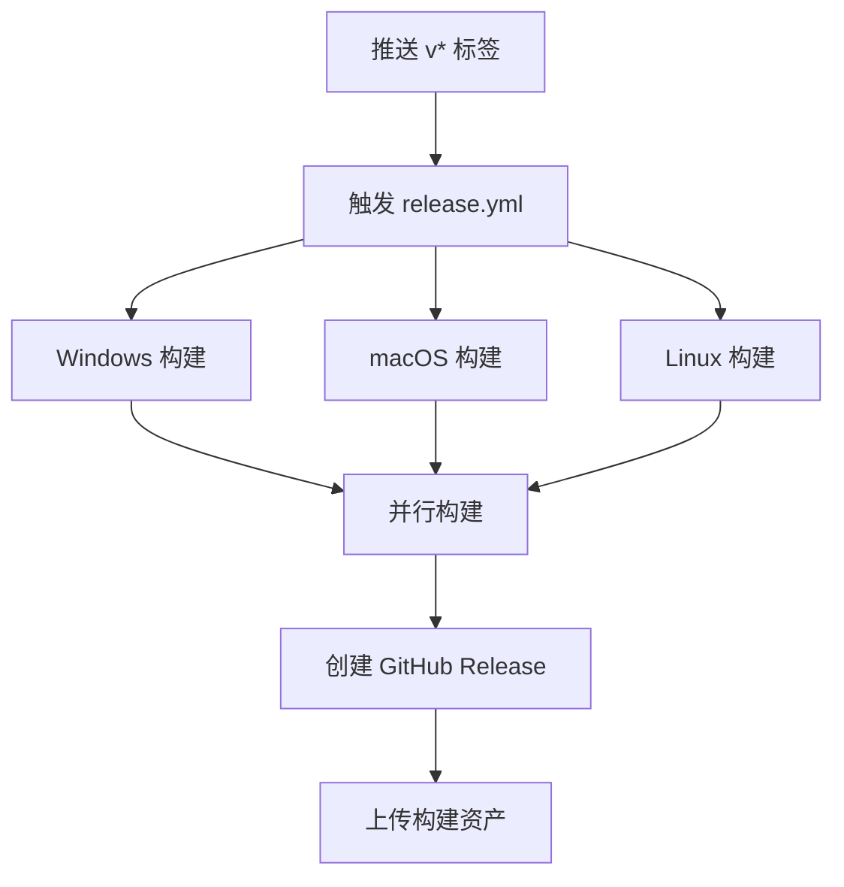

**图表来源**
- [.github/workflows/release.yml:1-178](file://.github/workflows/release.yml#L1-L178)

#### 2. 构建工作流 (build-desktop.yml)
构建工作流专注于日常开发构建：

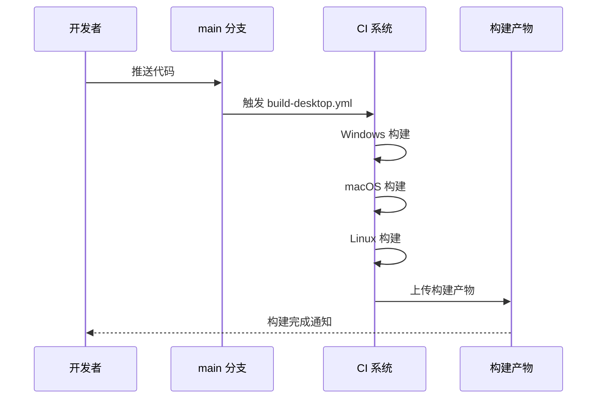

**图表来源**
- [.github/workflows/build-desktop.yml:1-142](file://.github/workflows/build-desktop.yml#L1-L142)

#### 3. 多平台构建策略
项目实现了针对不同平台的优化构建策略：

| 平台 | 目标架构 | 构建产物 | 特殊配置 |
|------|---------|---------|---------|
| **Windows** | x64 | NSIS 安装包 | 支持便携版 ZIP |
| **macOS** | x64 | DMG 安装包 | 原生窗口控件 |
| **macOS** | ARM64 | DMG 安装包 | Apple Silicon 支持 |
| **Linux** | x64 | DEB + AppImage | 多种包格式 |

**章节来源**
- [.github/workflows/release.yml:12-150](file://.github/workflows/release.yml#L12-L150)
- [.github/workflows/build-desktop.yml:13-142](file://.github/workflows/build-desktop.yml#L13-L142)

### 版本同步机制

#### 1. 配置文件同步
DevNexus 实现了多配置文件的版本同步：

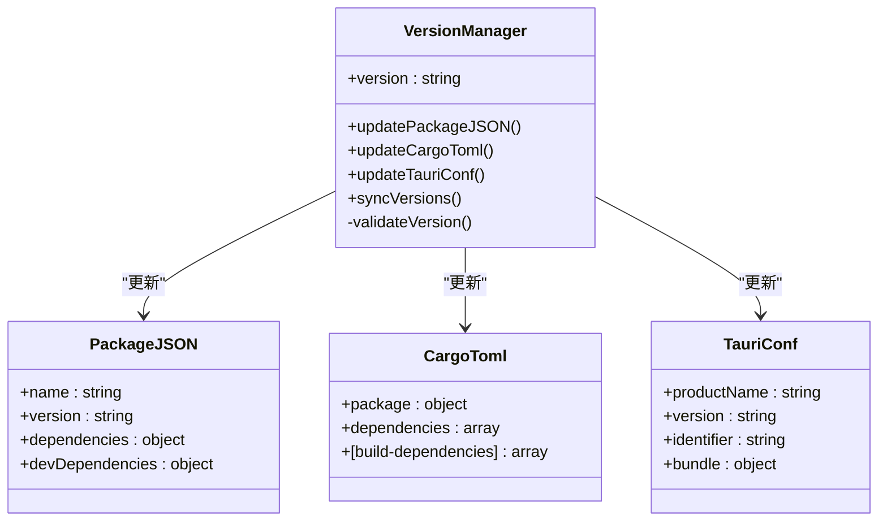

**图表来源**
- [package.json:1-40](file://package.json#L1-L40)
- [src-tauri/Cargo.toml:1-48](file://src-tauri/Cargo.toml#L1-L48)
- [src-tauri/tauri.conf.json:1-39](file://src-tauri/tauri.conf.json#L1-L39)

#### 2. 版本验证流程
每次版本更新都经过严格的验证流程：

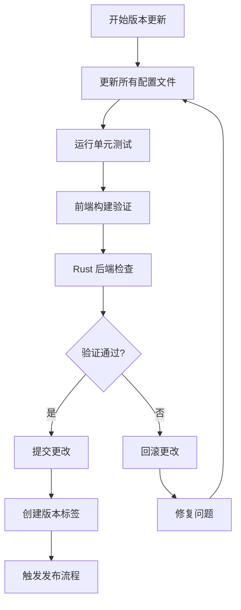

**图表来源**
- [README.md:350-362](file://README.md#L350-L362)

**章节来源**
- [package.json:4](file://package.json#L4)
- [src-tauri/Cargo.toml:3](file://src-tauri/Cargo.toml#L3)
- [src-tauri/tauri.conf.json:4](file://src-tauri/tauri.conf.json#L4)

### 测试与质量保证

#### 1. 测试策略
DevNexus 采用多层次的质量保证策略：

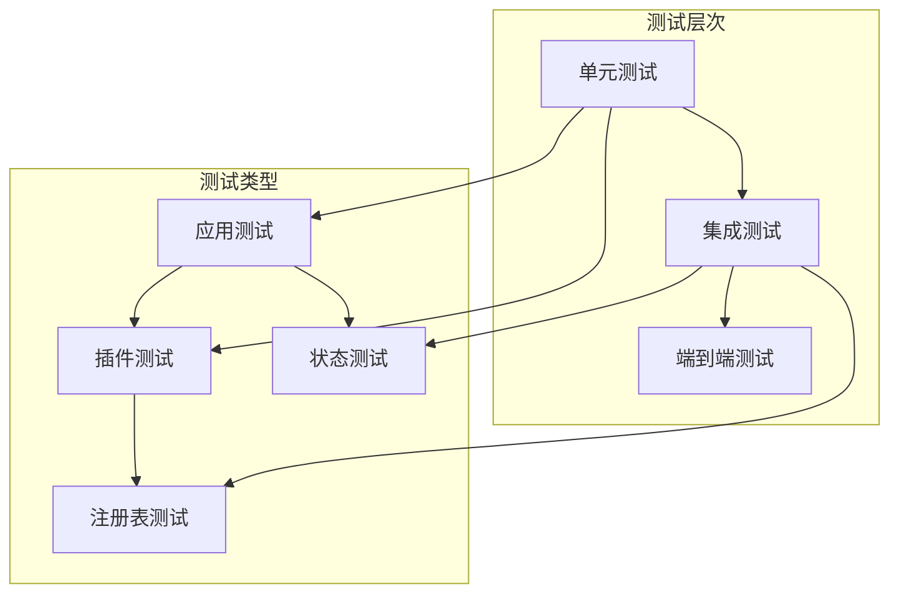

**图表来源**
- [tests/app/status-bar.test.ts:1-27](file://tests/app/status-bar.test.ts#L1-L27)
- [tests/app/plugin-registry/registry.test.ts:1-40](file://tests/app/plugin-registry/registry.test.ts#L1-L40)

#### 2. 质量门禁
发布前的质量门禁包括：
- **单元测试覆盖率**: 确保核心功能的稳定性
- **构建验证**: 前端和后端构建的完整性
- **平台兼容性**: 多平台构建的交叉验证

**章节来源**
- [tests/app/status-bar.test.ts:1-27](file://tests/app/status-bar.test.ts#L1-L27)
- [tests/app/plugin-registry/registry.test.ts:1-40](file://tests/app/plugin-registry/registry.test.ts#L1-L40)

## 依赖关系分析

### 版本依赖矩阵

DevNexus 的版本管理涉及多个层面的依赖关系：

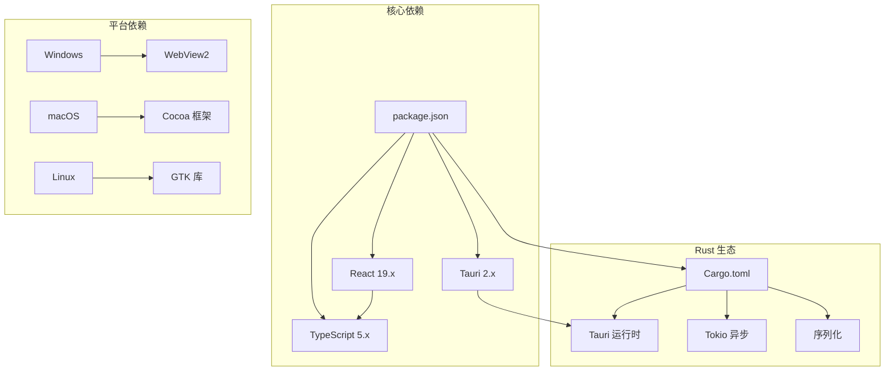

**图表来源**
- [package.json:15-38](file://package.json#L15-L38)
- [src-tauri/Cargo.toml:20-48](file://src-tauri/Cargo.toml#L20-L48)

### 版本兼容性矩阵

| 组件 | 当前版本 | 最低要求 | 兼容范围 |
|------|---------|---------|---------|
| **Node.js** | 20+ | 20.0 | 20.x |
| **Rust** | stable | 1.70+ | 1.x |
| **Tauri** | 2.x | 2.0 | 2.x |
| **React** | 19.x | 18.0 | 18.x/19.x |
| **TypeScript** | 5.8+ | 5.0 | 5.x |

**章节来源**
- [README.md:95-100](file://README.md#L95-L100)
- [package.json:15-38](file://package.json#L15-L38)
- [src-tauri/Cargo.toml:20-48](file://src-tauri/Cargo.toml#L20-L48)

## 性能考虑

### 构建性能优化

DevNexus 在版本管理中采用了多项性能优化策略：

1. **并行构建**: CI/CD 工作流中的多平台并行构建
2. **缓存策略**: npm 和 Rust 构建缓存的合理利用
3. **增量构建**: 部分平台的增量构建支持
4. **资源优化**: 构建产物的压缩和优化

### 发布性能监控

项目建立了完善的发布性能监控机制：
- **构建时间统计**: 各平台构建时间的跟踪
- **资源使用监控**: CI/CD 环境的资源使用情况
- **发布成功率**: 发布流程的成功率统计

## 故障排除指南

### 常见发布问题及解决方案

#### 1. 版本不同步问题
**问题症状**: 前端和后端版本不一致
**解决步骤**:
1. 检查所有配置文件的版本号
2. 运行版本同步脚本
3. 验证构建过程

#### 2. CI/CD 构建失败
**问题症状**: GitHub Actions 构建失败
**解决步骤**:
1. 检查构建日志中的错误信息
2. 验证依赖版本的兼容性
3. 重新触发构建流程

#### 3. 平台特定问题
**问题症状**: 某一平台构建失败
**解决步骤**:
1. 检查平台特定的前置条件
2. 验证平台依赖的正确性
3. 查看平台特定的构建日志

**章节来源**
- [README.md:179-184](file://README.md#L179-L184)
- [PLAN.md:368-377](file://PLAN.md#L368-L377)

### 回滚策略

DevNexus 建立了完善的回滚策略：

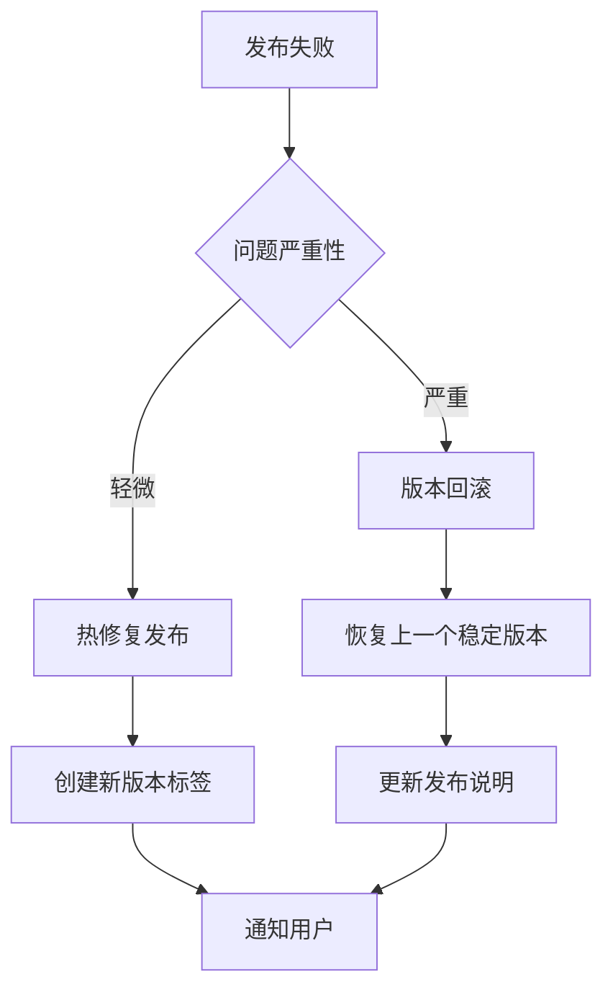

## 结论

DevNexus 的版本与发布管理体现了现代软件工程的最佳实践。通过严格的版本控制、自动化的工作流和全面的质量保证，项目实现了高效的版本发布管理。

### 主要优势

1. **一致性**: 多配置文件的版本同步确保了系统的整体一致性
2. **自动化**: 完整的 CI/CD 流水线减少了人工干预
3. **可追溯性**: 详细的发布说明和变更日志提供了完整的版本历史
4. **可靠性**: 多层次的质量保证确保了发布的稳定性

### 改进建议

1. **自动化测试**: 增加更多的自动化测试覆盖
2. **性能监控**: 建立更完善的性能监控体系
3. **文档完善**: 完善版本管理相关的文档
4. **回滚自动化**: 实现更自动化的回滚机制

## 附录

### 发布前检查清单

#### 1. 功能测试
- [ ] 所有单元测试通过
- [ ] 集成测试验证
- [ ] 端到端测试覆盖
- [ ] 平台兼容性测试

#### 2. 性能验证
- [ ] 构建时间检查
- [ ] 应用性能测试
- [ ] 内存使用监控
- [ ] 磁盘空间检查

#### 3. 安全审计
- [ ] 依赖漏洞扫描
- [ ] 代码安全审查
- [ ] 敏感信息检查
- [ ] 权限验证

#### 4. 文档更新
- [ ] 发布说明更新
- [ ] README 文件更新
- [ ] API 文档同步
- [ ] 用户指南更新

### 发布后监控

#### 1. 用户反馈处理
- [ ] 错误报告收集
- [ ] 用户建议整理
- [ ] 性能问题监控
- [ ] 兼容性问题跟踪

#### 2. 系统监控
- [ ] 应用崩溃监控
- [ ] 性能指标跟踪
- [ ] 用户行为分析
- [ ] 反馈响应时间

**章节来源**
- [README.md:350-362](file://README.md#L350-L362)
- [docs/releases/v0.9.3.md:13-20](file://docs/releases/v0.9.3.md#L13-L20)