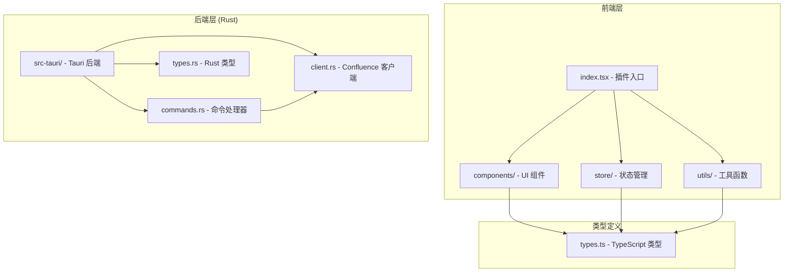
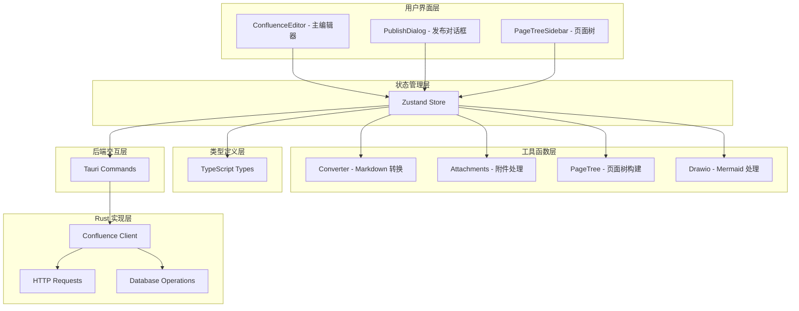
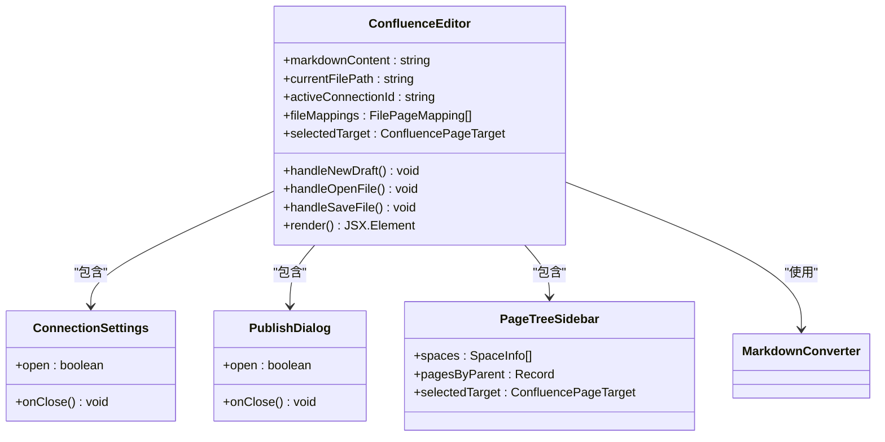
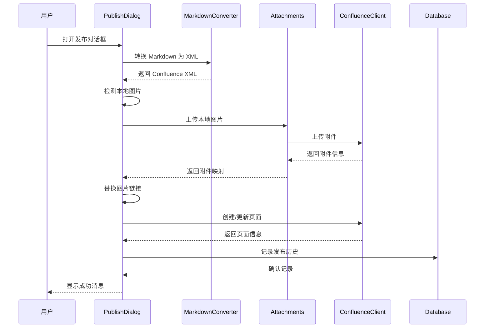
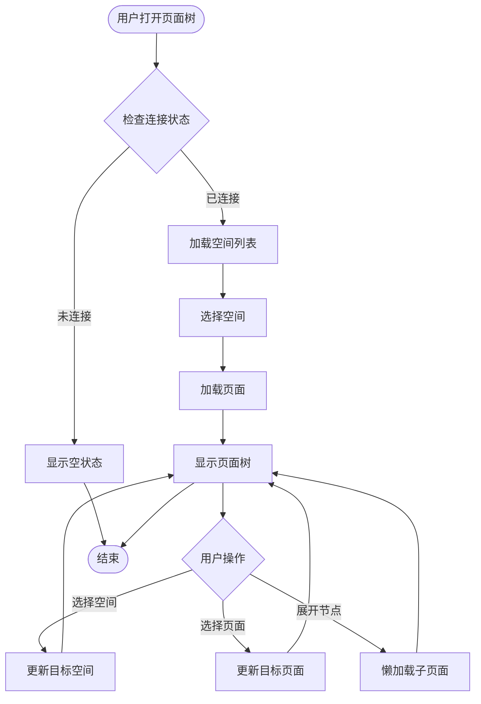
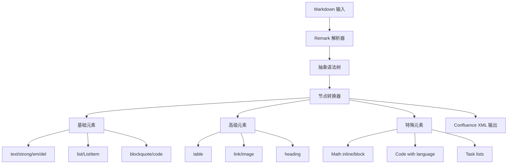
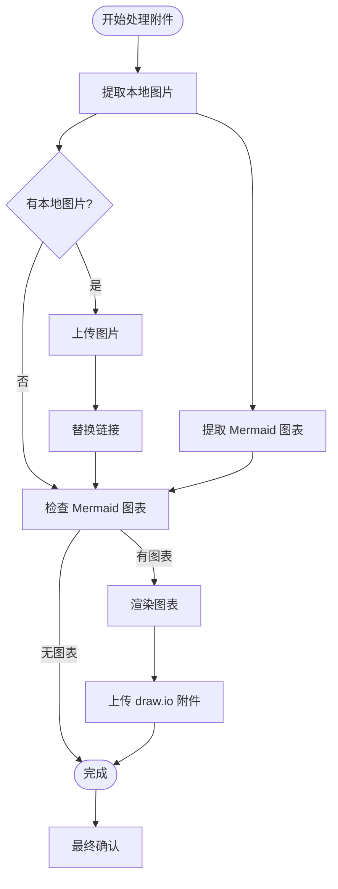
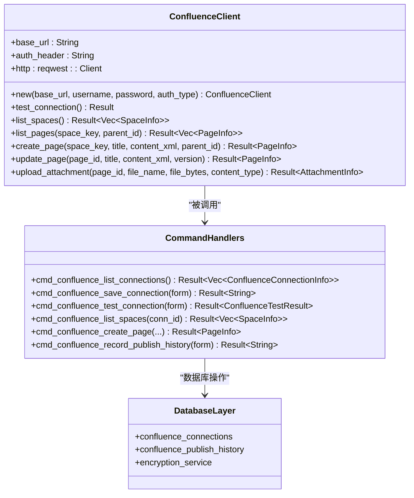
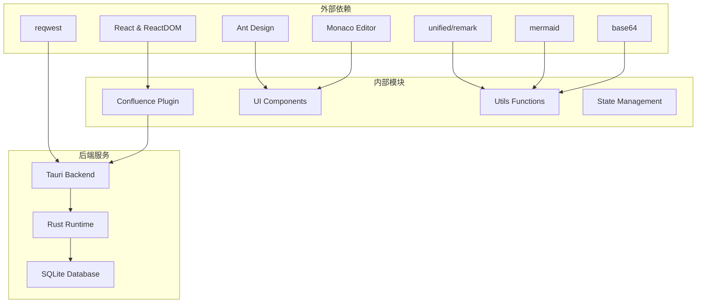

# Confluence 发布器插件

<cite>
**本文档引用的文件**
- [index.tsx](file://src/plugins/confluence/index.tsx)
- [types.ts](file://src/plugins/confluence/types.ts)
- [confluence.ts](file://src/plugins/confluence/store/confluence.ts)
- [converter.ts](file://src/plugins/confluence/utils/converter.ts)
- [page-tree.ts](file://src/plugins/confluence/utils/page-tree.ts)
- [attachments.ts](file://src/plugins/confluence/utils/attachments.ts)
- [drawio.ts](file://src/plugins/confluence/utils/drawio.ts)
- [ConfluenceEditor.tsx](file://src/plugins/confluence/components/ConfluenceEditor.tsx)
- [PublishDialog.tsx](file://src/plugins/confluence/components/PublishDialog.tsx)
- [PageTreeSidebar.tsx](file://src/plugins/confluence/components/PageTreeSidebar.tsx)
- [mod.rs](file://src-tauri/src/plugins/confluence/mod.rs)
- [client.rs](file://src-tauri/src/plugins/confluence/client.rs)
- [commands.rs](file://src-tauri/src/plugins/confluence/commands.rs)
- [types.rs](file://src-tauri/src/plugins/confluence/types.rs)
- [default.json](file://src-tauri/capabilities/default.json)
</cite>

## 目录
1. [简介](#简介)
2. [项目结构](#项目结构)
3. [核心组件](#核心组件)
4. [架构概览](#架构概览)
5. [详细组件分析](#详细组件分析)
6. [依赖关系分析](#依赖关系分析)
7. [性能考虑](#性能考虑)
8. [故障排除指南](#故障排除指南)
9. [结论](#结论)

## 简介

Confluence 发布器插件是一个集成在 DevNexus 应用中的强大工具，专门用于将 Markdown 文档发布到 Atlassian Confluence 平台。该插件提供了完整的文档发布工作流程，包括连接管理、页面浏览、内容转换、附件处理和发布历史记录等功能。

该插件采用现代化的前端技术栈，使用 React 和 TypeScript 构建用户界面，同时通过 Tauri 框架提供安全的桌面应用程序体验。插件支持多种认证方式（Basic 认证和 Personal Access Token），能够处理复杂的 Markdown 内容转换为 Confluence 存储格式，并支持 Mermaid 图表渲染和本地图片上传。

## 项目结构

Confluence 发布器插件遵循模块化的架构设计，主要分为前端组件层、工具函数层和后端 Rust 实现层：

**图表来源**
- [index.tsx:1-18](file://src/plugins/confluence/index.tsx#L1-L18)
- [types.ts:1-86](file://src/plugins/confluence/types.ts#L1-L86)

**章节来源**
- [index.tsx:1-18](file://src/plugins/confluence/index.tsx#L1-L18)
- [types.ts:1-86](file://src/plugins/confluence/types.ts#L1-L86)

## 核心组件

### 插件入口和注册

插件通过标准的插件注册机制集成到 DevNexus 应用中。插件入口文件定义了插件的基本元数据和主组件。

### 状态管理 (Zustand Store)

插件使用 Zustand 进行状态管理，集中处理所有与 Confluence 相关的状态操作，包括连接管理、内容编辑、页面浏览和发布历史等。

### Markdown 转换引擎

内置的 Markdown 到 Confluence 存储格式转换器支持丰富的 Markdown 语法，包括数学公式、代码高亮、表格、任务列表、脚注等高级功能。

### 附件处理系统

自动检测和处理本地图片和 Mermaid 图表，支持将本地资源上传到 Confluence 并正确替换链接引用。

**章节来源**
- [confluence.ts:1-146](file://src/plugins/confluence/store/confluence.ts#L1-L146)
- [converter.ts:1-226](file://src/plugins/confluence/utils/converter.ts#L1-L226)
- [attachments.ts:1-147](file://src/plugins/confluence/utils/attachments.ts#L1-L147)

## 架构概览

插件采用分层架构设计，确保前后端分离和职责明确：

**图表来源**
- [ConfluenceEditor.tsx:1-205](file://src/plugins/confluence/components/ConfluenceEditor.tsx#L1-L205)
- [PublishDialog.tsx:1-241](file://src/plugins/confluence/components/PublishDialog.tsx#L1-L241)
- [PageTreeSidebar.tsx:1-153](file://src/plugins/confluence/components/PageTreeSidebar.tsx#L1-L153)
- [client.rs:1-356](file://src-tauri/src/plugins/confluence/client.rs#L1-L356)

## 详细组件分析

### 主编辑器组件 (ConfluenceEditor)

主编辑器组件是用户交互的核心界面，提供了一个现代化的双面板编辑体验：

**图表来源**
- [ConfluenceEditor.tsx:15-205](file://src/plugins/confluence/components/ConfluenceEditor.tsx#L15-L205)
- [PublishDialog.tsx:9-241](file://src/plugins/confluence/components/PublishDialog.tsx#L9-L241)
- [PageTreeSidebar.tsx:10-153](file://src/plugins/confluence/components/PageTreeSidebar.tsx#L10-L153)

#### 编辑器功能特性

- **实时预览**：支持 Markdown 到 HTML 的实时转换和预览
- **文件管理**：支持打开、保存 Markdown 文件
- **连接管理**：集成连接设置对话框
- **发布控制**：一键发布或更新 Confluence 页面
- **状态指示**：显示当前文件路径和页面绑定状态

**章节来源**
- [ConfluenceEditor.tsx:1-205](file://src/plugins/confluence/components/ConfluenceEditor.tsx#L1-L205)

### 发布对话框 (PublishDialog)

发布对话框提供了完整的发布工作流程，支持新页面创建和现有页面更新：

**图表来源**
- [PublishDialog.tsx:64-171](file://src/plugins/confluence/components/PublishDialog.tsx#L64-L171)
- [converter.ts:185-189](file://src/plugins/confluence/utils/converter.ts#L185-L189)
- [attachments.ts:74-126](file://src/plugins/confluence/utils/attachments.ts#L74-L126)

#### 发布流程处理

1. **内容转换**：将 Markdown 转换为 Confluence 存储格式
2. **附件处理**：自动检测和上传本地图片
3. **Mermaid 支持**：渲染 Mermaid 图表为 draw.io 附件
4. **页面操作**：根据是否存在映射决定创建或更新页面
5. **历史记录**：记录发布操作到数据库

**章节来源**
- [PublishDialog.tsx:1-241](file://src/plugins/confluence/components/PublishDialog.tsx#L1-L241)

### 页面树组件 (PageTreeSidebar)

页面树组件提供了直观的 Confluence 空间和页面导航：

**图表来源**
- [PageTreeSidebar.tsx:31-85](file://src/plugins/confluence/components/PageTreeSidebar.tsx#L31-L85)
- [page-tree.ts:21-50](file://src/plugins/confluence/utils/page-tree.ts#L21-L50)

#### 页面树功能

- **空间浏览**：显示所有可用的空间
- **层级导航**：支持多级页面嵌套
- **懒加载**：按需加载子页面，提高性能
- **目标选择**：选择发布目标页面
- **状态同步**：与编辑器状态保持同步

**章节来源**
- [PageTreeSidebar.tsx:1-153](file://src/plugins/confluence/components/PageTreeSidebar.tsx#L1-L153)

### Markdown 转换器 (Converter)

转换器模块负责将 Markdown 内容转换为 Confluence 兼容的存储格式：

**图表来源**
- [converter.ts:68-183](file://src/plugins/confluence/utils/converter.ts#L68-L183)

#### 支持的 Markdown 功能

- **基础语法**：标题、段落、粗体、斜体、删除线
- **列表**：有序和无序列表，任务列表
- **代码**：内联代码和代码块，支持多种语言
- **链接**：普通链接和图片链接
- **表格**：标准表格支持
- **数学公式**：LaTeX 数学公式（行内和块级）
- **脚注**：文档脚注支持

**章节来源**
- [converter.ts:1-226](file://src/plugins/confluence/utils/converter.ts#L1-L226)

### 附件处理系统

附件处理系统自动检测和处理本地资源，确保发布内容的完整性：

**图表来源**
- [attachments.ts:23-126](file://src/plugins/confluence/utils/attachments.ts#L23-L126)

#### 附件处理流程

1. **图片检测**：扫描 Markdown 中的本地图片链接
2. **图片上传**：读取本地文件并上传到 Confluence
3. **链接替换**：将原始链接替换为 Confluence 附件链接
4. **图表处理**：渲染 Mermaid 图表为 SVG 并上传
5. **类型识别**：自动识别文件 MIME 类型

**章节来源**
- [attachments.ts:1-147](file://src/plugins/confluence/utils/attachments.ts#L1-L147)

### Rust 后端实现

后端使用 Rust 提供高性能和安全的 Confluence 集成：

**图表来源**
- [client.rs:8-356](file://src-tauri/src/plugins/confluence/client.rs#L8-L356)
- [commands.rs:20-307](file://src-tauri/src/plugins/confluence/commands.rs#L20-L307)

#### 后端功能特性

- **认证支持**：支持 Basic 认证和 Personal Access Token
- **错误处理**：完善的 HTTP 错误处理和状态码检查
- **超时控制**：30 秒请求超时设置
- **数据库集成**：SQLite 数据库存储连接信息和发布历史
- **加密存储**：敏感信息加密存储

**章节来源**
- [client.rs:1-356](file://src-tauri/src/plugins/confluence/client.rs#L1-L356)
- [commands.rs:1-307](file://src-tauri/src/plugins/confluence/commands.rs#L1-L307)

## 依赖关系分析

插件的依赖关系清晰且层次分明，确保了良好的可维护性和扩展性：

**图表来源**
- [mod.rs:1-4](file://src-tauri/src/plugins/confluence/mod.rs#L1-L4)
- [default.json:1-18](file://src-tauri/capabilities/default.json#L1-L18)

### 关键依赖说明

- **前端依赖**：React 生态系统提供组件化开发，Ant Design 提供 UI 组件，Monaco Editor 提供代码编辑功能
- **转换引擎**：unified/remark 生态系统提供强大的 Markdown 处理能力
- **HTTP 客户端**：reqwest 提供异步 HTTP 请求支持
- **图表渲染**：Mermaid 提供图表渲染功能
- **后端框架**：Tauri 提供跨平台桌面应用框架

**章节来源**
- [mod.rs:1-4](file://src-tauri/src/plugins/confluence/mod.rs#L1-L4)
- [default.json:1-18](file://src-tauri/capabilities/default.json#L1-L18)

## 性能考虑

插件在设计时充分考虑了性能优化，采用了多种策略来确保流畅的用户体验：

### 前端性能优化

- **状态管理**：使用 Zustand 减少不必要的重渲染
- **懒加载**：页面树组件按需加载子页面数据
- **内存管理**：及时清理定时器和事件监听器
- **虚拟滚动**：对于大量数据的场景使用虚拟化技术

### 后端性能优化

- **连接池**：HTTP 客户端复用连接减少建立连接的开销
- **缓存策略**：合理使用缓存避免重复的 API 调用
- **并发处理**：支持并发的附件上传操作
- **超时控制**：设置合理的超时时间避免长时间阻塞

### 网络优化

- **请求合并**：将多个小请求合并为批量操作
- **压缩传输**：启用 HTTP 压缩减少传输数据量
- **断线重试**：实现智能的断线重试机制

## 故障排除指南

### 常见问题及解决方案

#### 连接问题

**问题**：无法连接到 Confluence 服务器
**可能原因**：
- 网络连接问题
- 认证凭据错误
- 服务器地址配置错误

**解决步骤**：
1. 检查网络连接是否正常
2. 验证 Confluence 服务器地址
3. 确认用户名和密码或 PAT 设置正确
4. 尝试使用连接测试功能验证配置

#### 发布失败

**问题**：发布操作失败但没有明确错误信息
**可能原因**：
- Markdown 格式不正确
- 附件上传失败
- 权限不足

**解决步骤**：
1. 检查 Markdown 语法是否符合规范
2. 确认有足够的权限发布到目标空间
3. 查看发布历史记录获取详细错误信息
4. 尝试简化内容重新发布

#### 性能问题

**问题**：界面响应缓慢或卡顿
**可能原因**：
- 大量页面数据导致渲染压力
- 附件过多影响上传速度
- 系统资源不足

**解决步骤**：
1. 清理不需要的页面树缓存
2. 分批处理大量附件
3. 关闭其他占用资源的应用程序
4. 重启应用以释放内存

**章节来源**
- [client.rs:38-59](file://src-tauri/src/plugins/confluence/client.rs#L38-L59)
- [commands.rs:92-112](file://src-tauri/src/plugins/confluence/commands.rs#L92-L112)

## 结论

Confluence 发布器插件是一个功能完整、架构清晰的高质量工具。它成功地将复杂的文档发布流程简化为直观易用的操作界面，同时保持了强大的功能性和可靠性。

### 主要优势

1. **用户友好**：提供直观的双面板编辑界面和实时预览功能
2. **功能丰富**：支持完整的 Markdown 语法和高级特性
3. **性能优秀**：采用现代前端技术和优化策略
4. **安全性强**：使用 Tauri 框架提供安全的桌面应用体验
5. **可扩展性**：模块化设计便于功能扩展和维护

### 技术亮点

- **混合架构**：前端使用 React + TypeScript，后端使用 Rust，充分发挥各自优势
- **类型安全**：完整的 TypeScript 类型定义确保代码质量
- **异步处理**：充分利用异步编程模型提升用户体验
- **错误处理**：完善的错误处理和用户反馈机制

该插件为 DevNexus 应用提供了强大的文档协作能力，是团队知识管理和文档发布的理想选择。其优秀的架构设计和实现质量为未来的功能扩展奠定了坚实的基础。