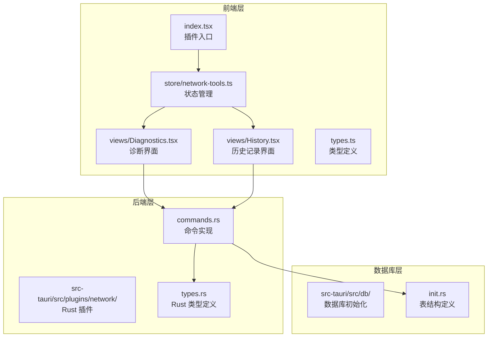
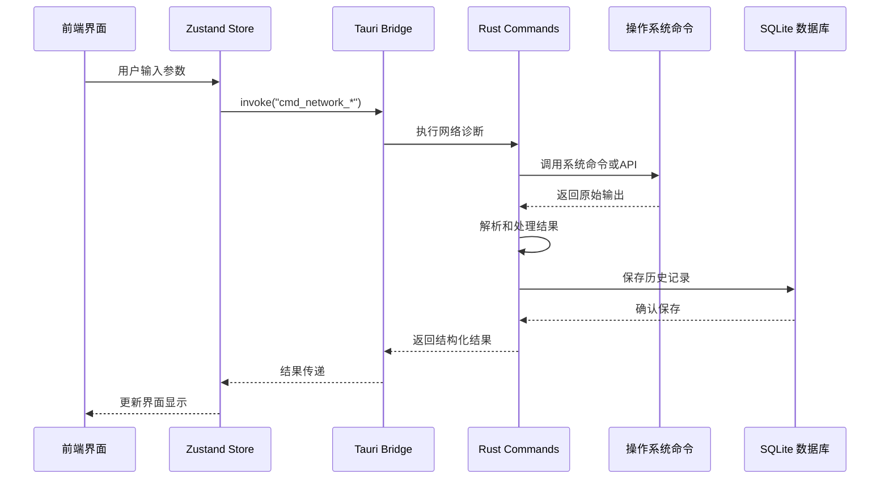
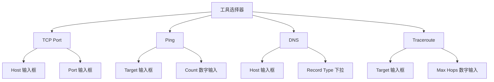
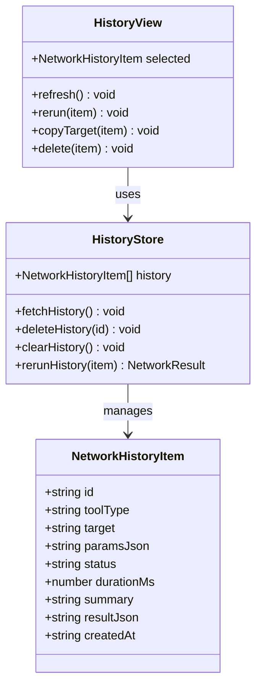
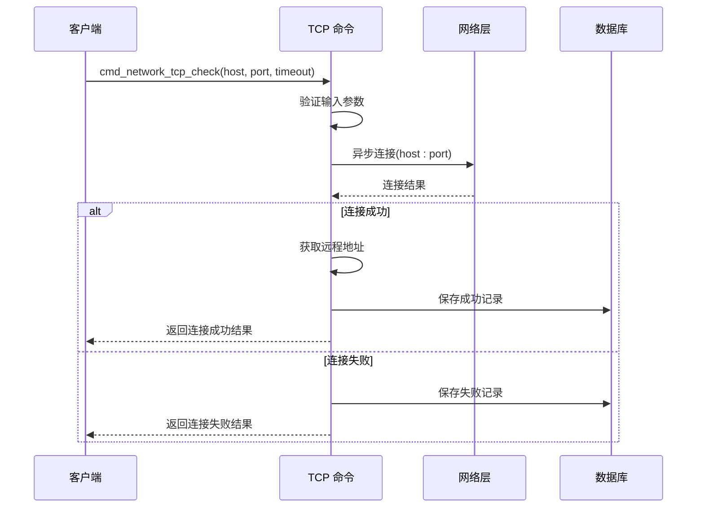
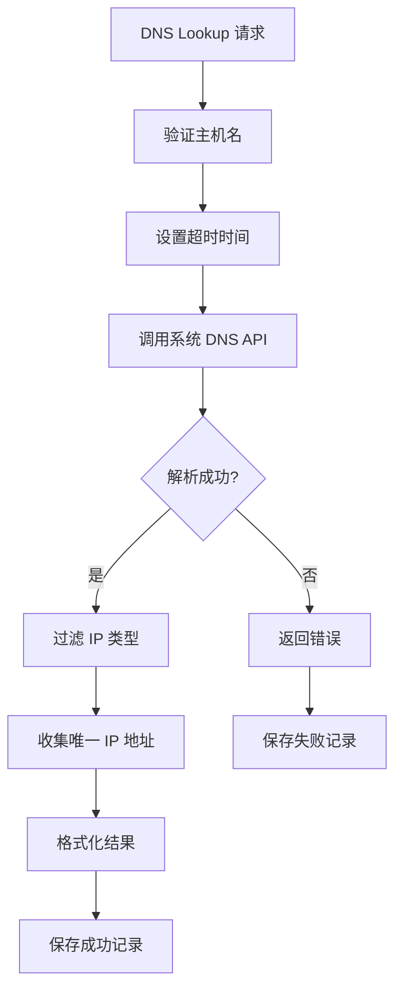
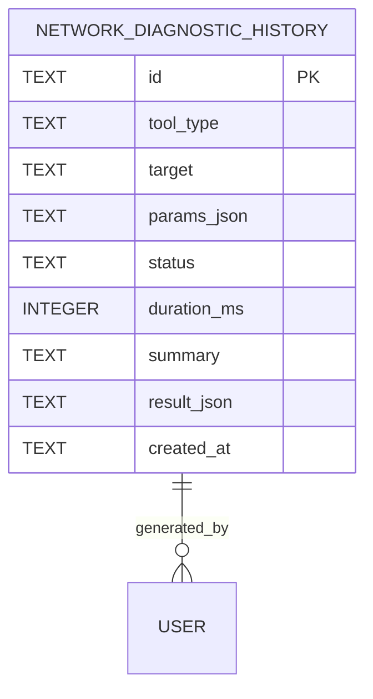
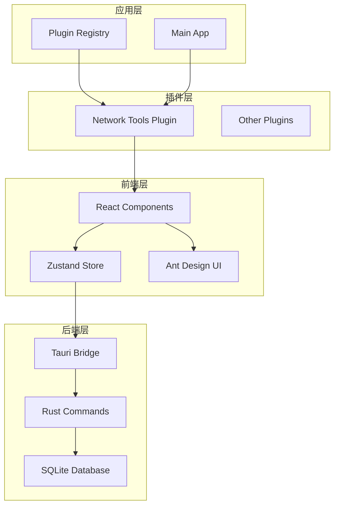

# 网络工具插件

<cite>
**本文档引用的文件**
- [index.tsx](file://src/plugins/network-tools/index.tsx)
- [network-tools.ts](file://src/plugins/network-tools/store/network-tools.ts)
- [Diagnostics.tsx](file://src/plugins/network-tools/views/Diagnostics.tsx)
- [History.tsx](file://src/plugins/network-tools/views/History.tsx)
- [types.ts](file://src/plugins/network-tools/types.ts)
- [commands.rs](file://src-tauri/src/plugins/network/commands.rs)
- [types.rs](file://src-tauri/src/plugins/network/types.rs)
- [init.rs](file://src-tauri/src/db/init.rs)
- [builtin.ts](file://src/app/plugin-registry/builtin.ts)
</cite>

## 目录
1. [简介](#简介)
2. [项目结构](#项目结构)
3. [核心组件](#核心组件)
4. [架构概览](#架构概览)
5. [详细组件分析](#详细组件分析)
6. [依赖关系分析](#依赖关系分析)
7. [性能考虑](#性能考虑)
8. [故障排除指南](#故障排除指南)
9. [结论](#结论)

## 简介

网络工具插件是一个功能完整的网络诊断工具集合，为开发者和系统管理员提供了全面的网络连通性测试能力。该插件支持四种主要的网络诊断功能：Ping 测试、TCP 端口检测、DNS 解析和 Traceroute 路径追踪。

该插件采用前端 React + Zustand 状态管理 + 后端 Rust + Tauri 的架构设计，通过本地命令行工具（ping、traceroute）和系统 API 实现网络诊断功能，同时提供完整的本地历史记录管理和结果可视化。

## 项目结构

网络工具插件位于 `src/plugins/network-tools/` 目录下，采用模块化的设计模式：

**图表来源**
- [index.tsx:1-27](file://src/plugins/network-tools/index.tsx#L1-L27)
- [network-tools.ts:1-97](file://src/plugins/network-tools/store/network-tools.ts#L1-L97)
- [Diagnostics.tsx:1-148](file://src/plugins/network-tools/views/Diagnostics.tsx#L1-L148)
- [History.tsx:1-76](file://src/plugins/network-tools/views/History.tsx#L1-L76)

**章节来源**
- [index.tsx:1-27](file://src/plugins/network-tools/index.tsx#L1-L27)
- [network-tools.ts:1-97](file://src/plugins/network-tools/store/network-tools.ts#L1-L97)

## 核心组件

### 网络诊断工具类型

插件支持四种核心网络诊断工具：

| 工具类型 | 功能描述 | 主要参数 |
|---------|----------|----------|
| TCP Port | 测试指定主机的端口连通性 | host, port, timeoutMs |
| Ping | 测试网络连通性和延迟 | target, count, timeoutMs |
| DNS | 解析域名到IP地址 | host, recordType, timeoutMs |
| Traceroute | 追踪数据包路由路径 | target, maxHops, timeoutMs |

### 状态管理架构

使用 Zustand 实现轻量级状态管理，包含以下核心状态：

- `workspaceTab`: 当前工作区标签页（diagnostics/history）
- `activeTool`: 当前激活的诊断工具
- `lastResult`: 最新诊断结果
- `history`: 诊断历史记录数组
- `loading`: 加载状态标志

**章节来源**
- [network-tools.ts:8-24](file://src/plugins/network-tools/store/network-tools.ts#L8-L24)
- [types.ts:1-57](file://src/plugins/network-tools/types.ts#L1-L57)

## 架构概览

该插件采用分层架构设计，实现了前端与后端的清晰分离：

**图表来源**
- [Diagnostics.tsx:107-117](file://src/plugins/network-tools/views/Diagnostics.tsx#L107-L117)
- [network-tools.ts:42-77](file://src/plugins/network-tools/store/network-tools.ts#L42-L77)
- [commands.rs:257-314](file://src-tauri/src/plugins/network/commands.rs#L257-L314)

## 详细组件分析

### 诊断界面组件

诊断界面提供了直观的用户交互体验，支持四种诊断工具的参数配置和结果显示。

#### 工具选择器

**图表来源**
- [Diagnostics.tsx:7-12](file://src/plugins/network-tools/views/Diagnostics.tsx#L7-L12)
- [Diagnostics.tsx:124-139](file://src/plugins/network-tools/views/Diagnostics.tsx#L124-L139)

#### 结果展示面板

结果面板根据不同的诊断类型提供相应的信息展示：

| 诊断类型 | 关键指标 | 显示内容 |
|----------|----------|----------|
| TCP Port | 连接状态、延迟、远程地址 | 连接成功/失败、耗时、目标地址 |
| Ping | 发送/接收包数、丢包率、平均延迟 | 包统计、丢包百分比、平均响应时间 |
| DNS | 记录类型、解析结果数量 | DNS记录列表、解析耗时 |
| Traceroute | 跳数、路径节点 | 路由跳数、中间节点IP |

**章节来源**
- [Diagnostics.tsx:37-90](file://src/plugins/network-tools/views/Diagnostics.tsx#L37-L90)

### 历史记录管理

历史记录功能提供了完整的诊断结果存储和重放能力：

**图表来源**
- [types.ts:3-13](file://src/plugins/network-tools/types.ts#L3-L13)
- [History.tsx:15-76](file://src/plugins/network-tools/views/History.tsx#L15-L76)

**章节来源**
- [History.tsx:15-76](file://src/plugins/network-tools/views/History.tsx#L15-L76)

### 后端命令实现

Rust 后端实现了四种核心网络诊断功能，每个功能都有独立的命令处理逻辑：

#### TCP 端口检测

TCP 端口检测使用异步套接字连接实现，支持超时控制和错误处理：

**图表来源**
- [commands.rs:257-314](file://src-tauri/src/plugins/network/commands.rs#L257-L314)

#### Ping 测试

Ping 测试通过调用系统原生命令实现跨平台兼容性：

| 平台 | 命令 | 参数映射 |
|------|------|----------|
| Windows | `ping -n count -w timeout target` | -n: 包数, -w: 超时(ms) |
| Linux/macOS | `ping -c count -W timeout target` | -c: 包数, -W: 超时(s) |

**章节来源**
- [commands.rs:316-365](file://src-tauri/src/plugins/network/commands.rs#L316-L365)

#### DNS 解析

DNS 解析使用系统 `lookup_host` API，支持 IPv4/IPv6 双栈解析：

**图表来源**
- [commands.rs:367-443](file://src-tauri/src/plugins/network/commands.rs#L367-L443)

**章节来源**
- [commands.rs:367-443](file://src-tauri/src/plugins/network/commands.rs#L367-L443)

#### Traceroute 路径追踪

Traceroute 使用系统原生命令获取路由路径信息：

| 平台 | 命令 | 参数映射 |
|------|------|----------|
| Windows | `tracert -d -h maxHops -w timeout target` | -d: 禁用DNS, -h: 最大跳数, -w: 超时(ms) |
| Linux/macOS | `traceroute -n -m maxHops -w timeout target` | -n: 禁用DNS, -m: 最大跳数, -w: 超时(s) |

**章节来源**
- [commands.rs:445-481](file://src-tauri/src/plugins/network/commands.rs#L445-L481)

### 数据库架构

插件使用 SQLite 作为本地存储，专门的 `network_diagnostic_history` 表存储所有诊断记录：

**图表来源**
- [init.rs:167-177](file://src-tauri/src/db/init.rs#L167-L177)

**章节来源**
- [init.rs:167-177](file://src-tauri/src/db/init.rs#L167-L177)

## 依赖关系分析

插件的依赖关系体现了清晰的分层架构：

**图表来源**
- [builtin.ts:13-27](file://src/app/plugin-registry/builtin.ts#L13-L27)
- [index.tsx:26](file://src/plugins/network-tools/index.tsx#L26)

**章节来源**
- [builtin.ts:13-27](file://src/app/plugin-registry/builtin.ts#L13-L27)

## 性能考虑

### 超时配置优化

插件实现了灵活的超时机制，确保网络诊断不会无限等待：

- **默认超时**: 5000ms（5秒）
- **范围限制**: 500ms - 120000ms（120秒）
- **动态计算**: 根据诊断类型自动调整超时时间

### 并发处理

当前实现采用串行执行模式，避免了资源竞争问题。对于需要并发测试的场景，可以考虑：

1. **批量测试**: 同时测试多个目标的相同端口
2. **异步队列**: 实现任务队列管理
3. **进度反馈**: 提供实时进度指示

### 内存管理

- **结果缓存**: 仅保留最近的诊断结果
- **历史限制**: 默认限制历史记录数量为100条
- **JSON 序列化**: 高效的结构化数据存储

## 故障排除指南

### 常见问题及解决方案

#### 1. 权限问题

**症状**: TCP 端口检测失败，提示权限不足
**解决方案**: 
- 在 Linux/macOS 上使用 sudo 权限运行
- 检查防火墙设置
- 验证端口是否被占用

#### 2. DNS 解析失败

**症状**: DNS 查找返回空结果或超时
**解决方案**:
- 检查 DNS 服务器配置
- 验证网络连接状态
- 尝试使用不同的 DNS 服务器

#### 3. Traceroute 不可用

**症状**: Traceroute 命令执行失败
**解决方案**:
- 检查系统是否安装 traceroute 工具
- 验证管理员权限
- 调整最大跳数参数

#### 4. 超时问题

**症状**: 诊断长时间无响应
**解决方案**:
- 增加超时时间设置
- 检查网络连接质量
- 验证目标主机可达性

### 调试技巧

#### 1. 原始输出分析

所有诊断结果都包含原始输出，可用于深入分析：
- 查看 `Raw Output` 标签页获取系统命令的完整输出
- 分析错误信息中的具体原因
- 对比不同平台的输出差异

#### 2. 历史记录对比

利用历史记录功能进行趋势分析：
- 比较同一目标在不同时间点的表现
- 识别网络性能变化模式
- 建立基线性能标准

#### 3. 参数优化

根据实际需求调整参数：
- **Ping**: 根据网络环境调整包数和超时
- **TCP**: 测试不同端口组合
- **Traceroute**: 调整最大跳数以适应复杂网络

## 结论

网络工具插件提供了一个功能完整、易于使用的网络诊断解决方案。其设计特点包括：

### 技术优势
- **跨平台兼容**: 支持 Windows、Linux、macOS
- **实时结果**: 即时显示诊断结果和状态
- **历史记录**: 完整的诊断历史管理和重放功能
- **安全存储**: 本地 SQLite 数据库存储敏感信息

### 功能完整性
- **四类诊断**: TCP、Ping、DNS、Traceroute 全面覆盖
- **参数配置**: 灵活的参数设置满足不同需求
- **结果分析**: 结构化和原始输出双重展示
- **错误处理**: 完善的异常捕获和用户提示

### 扩展潜力
该插件架构为未来的功能扩展提供了良好的基础，可以轻松添加新的诊断工具、改进现有功能或集成更高级的网络分析能力。

通过合理配置和使用，网络工具插件能够有效帮助用户快速定位和解决各种网络连接问题，是开发和运维工作中不可或缺的实用工具。